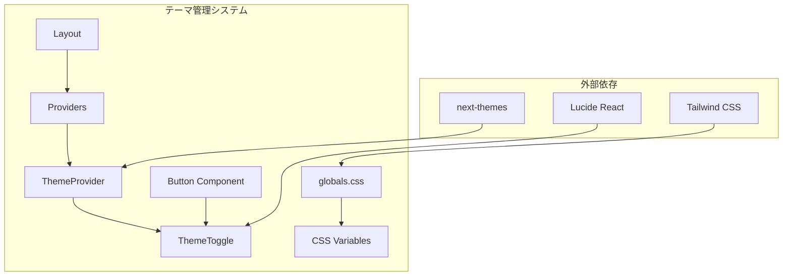
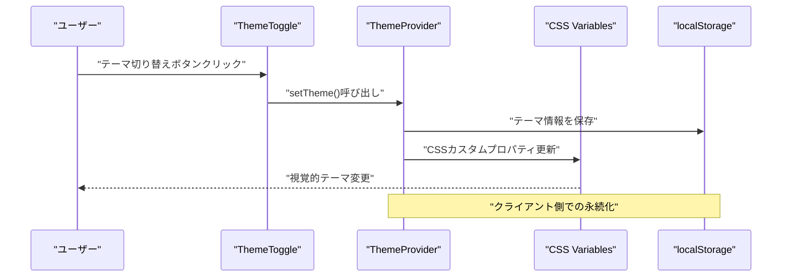
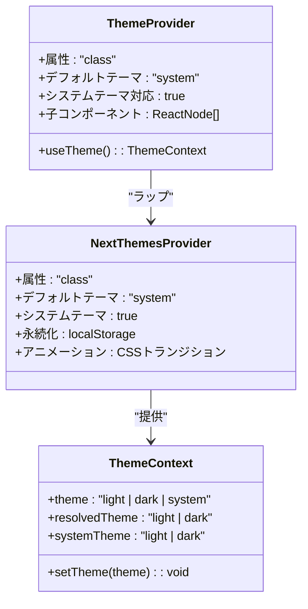
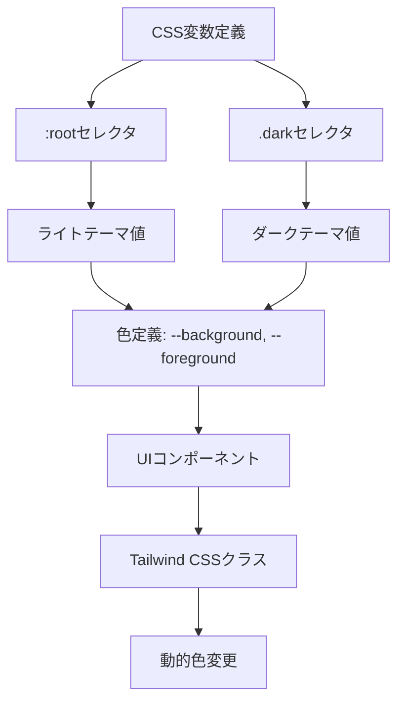
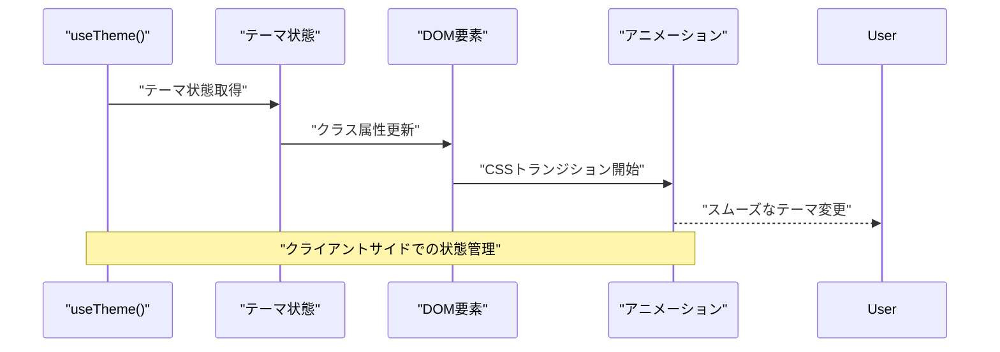
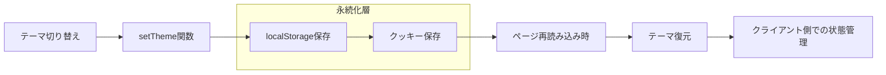

# テーマ管理

<cite>
**この文書で参照されたファイル**
- [theme-provider.tsx](file://frontend/src/components/theme-provider.tsx)
- [theme-toggle.tsx](file://frontend/src/components/theme-toggle.tsx)
- [providers.tsx](file://frontend/src/app/providers.tsx)
- [layout.tsx](file://frontend/src/app/layout.tsx)
- [globals.css](file://frontend/src/app/globals.css)
- [button.tsx](file://frontend/src/components/ui/button.tsx)
- [theme-toggle.test.tsx](file://frontend/src/__tests__/theme-toggle.test.tsx)
- [package.json](file://frontend/package.json)
- [utils.ts](file://frontend/src/lib/utils.ts)
</cite>

## 目次
1. [導入](#導入)
2. [プロジェクト構造](#プロジェクト構造)
3. [コアコンポーネント](#コアコンポーネント)
4. [アーキテクチャ概観](#アーキテクチャ概観)
5. [詳細コンポーネント分析](#詳細コンポーネント分析)
6. [依存関係分析](#依存関係分析)
7. [パフォーマンス考慮事項](#パフォーマンス考慮事項)
8. [アクセシビリティ対応](#アクセシビリティ対応)
9. [トラブルシューティングガイド](#トラブルシューティングガイド)
10. [結論](#結論)

## 導入
このTodoプロジェクトでは、ダークテーマとライトテーマの切り替え機能を実装するための包括的なテーマ管理システムを提供しています。システムはNext.jsの公式テーマライブラリであるnext-themesを使用し、CSSカスタムプロパティとTailwind CSSの組み合わせによって、柔軟で効率的なテーマ切り替えを実現しています。

## プロジェクト構造
テーマ管理システムは、以下の主要なコンポーネントから構成されています：



**図のソース**
- [providers.tsx:17-24](file://frontend/src/app/providers.tsx#L17-L24)
- [theme-provider.tsx:6-8](file://frontend/src/components/theme-provider.tsx#L6-L8)
- [theme-toggle.tsx:3-5](file://frontend/src/components/theme-toggle.tsx#L3-L5)

**セクションのソース**
- [providers.tsx:1-26](file://frontend/src/app/providers.tsx#L1-L26)
- [layout.tsx:1-40](file://frontend/src/app/layout.tsx#L1-L40)

## コアコンポーネント
テーマ管理システムの核心となる3つのコンポーネントについて詳しく説明します。

### ThemeProviderコンポーネント
ThemeProviderコンポーネントは、テーマのグローバルな状態管理を担うラッパーです。このコンポーネントは、次世代のテーマ管理ライブラリであるnext-themesを使用し、以下の特徴を持っています：

- **属性ベースのテーマ切り替え**: `attribute="class"`を設定することで、テーマに応じてHTML要素のクラス属性が自動的に変更されます
- **システムテーマ対応**: `enableSystem`オプションにより、ユーザーのOS設定に応じたテーマ選択が可能
- **デフォルトテーマ設定**: `defaultTheme="system"`により、初期状態でシステムテーマを使用

### ThemeToggleコンポーネント
ThemeToggleコンポーネントは、ユーザーインターフェースでのテーマ切り替え操作を提供します。このコンポーネントには以下の重要な機能が含まれています：

- **ハイドレーション対策**: `requestAnimationFrame`を使用したマウント後のレンダリングにより、クライアントとサーバー間の不一致を防ぎます
- **アイコン切り替え**: ダークテーマ時は太陽アイコン、ライトテーマ時は月アイコンを表示
- **アクセシビリティ対応**: スクリーンリーダー用のラベルを提供し、ARIA属性を適切に設定

**セクションのソース**
- [theme-provider.tsx:1-9](file://frontend/src/components/theme-provider.tsx#L1-L9)
- [theme-toggle.tsx:1-37](file://frontend/src/components/theme-toggle.tsx#L1-L37)

## アーキテクチャ概観
テーマ管理システムの全体像を以下の図で示します：



**図のソース**
- [theme-toggle.tsx:23-26](file://frontend/src/components/theme-toggle.tsx#L23-L26)
- [providers.tsx:18](file://frontend/src/app/providers.tsx#L18)

**セクションのソース**
- [providers.tsx:17-24](file://frontend/src/app/providers.tsx#L17-L24)
- [layout.tsx:33-35](file://frontend/src/app/layout.tsx#L33-L35)

## 詳細コンポーネント分析

### ThemeProviderの設計と実装
ThemeProviderコンポーネントは、テーマ管理の基盤となる重要なコンポーネントです。以下にその設計の詳細を示します：



**図のソース**
- [theme-provider.tsx:6-8](file://frontend/src/components/theme-provider.tsx#L6-L8)
- [providers.tsx:18](file://frontend/src/app/providers.tsx#L18)

### CSS変数とテーマの統合
テーマシステムは、CSSカスタムプロパティと連携して動作しており、以下の構造を持っています：



**図のソース**
- [globals.css:51-118](file://frontend/src/app/globals.css#L51-L118)

**セクションのソース**
- [globals.css:1-130](file://frontend/src/app/globals.css#L1-L130)

### テーマ切り替えフックの実装
ThemeToggleコンポーネントは、以下のフックを使用してテーマ状態を管理します：



**図のソース**
- [theme-toggle.tsx:9](file://frontend/src/components/theme-toggle.tsx#L9)

**セクションのソース**
- [theme-toggle.tsx:1-37](file://frontend/src/components/theme-toggle.tsx#L1-L37)

### localStorageとの同期処理
テーマ情報はクライアント側のlocalStorageに永続化され、以下のプロセスで管理されます：



**図のソース**
- [providers.tsx:18](file://frontend/src/app/providers.tsx#L18)

**セクションのソース**
- [providers.tsx:18](file://frontend/src/app/providers.tsx#L18)

## 依存関係分析
テーマ管理システムの依存関係は以下の通りです：

```mermaid
graph TB
subgraph "テーマ管理"
A[ThemeProvider] --> B[next-themes]
C[ThemeToggle] --> B
C --> D[lucide-react]
C --> E[@base-ui/react/button]
end
subgraph "スタイル管理"
F[globals.css] --> G[Tailwind CSS]
F --> H[CSS Variables]
E --> G
end
subgraph "テスト"
I[theme-toggle.test.tsx] --> B
I --> J[@testing-library/react]
end
```

**図のソース**
- [package.json:27](file://frontend/package.json#L27)
- [theme-toggle.tsx:3](file://frontend/src/components/theme-toggle.tsx#L3)

**セクションのソース**
- [package.json:18-36](file://frontend/package.json#L18-L36)

## パフォーマンス考慮事項
テーマ切り替えのパフォーマンスを最適化するために以下の戦略が採用されています：

- **requestAnimationFrameの使用**: ハイドレーションミスマッチを防ぐために、マウント後のレンダリングにrequestAnimationFrameを使用
- **CSSトランジションの活用**: テーマ変更時のスムーズなアニメーション効果をCSSトランジションで実現
- **最小限の再レンダリング**: next-themesによってテーマ状態の変更は効率的に処理される

## アクセシビリティ対応
テーマ切り替え機能は以下のアクセシビリティ要件を満たしています：

- **スクリーンリーダー対応**: `sr-only`クラスを使用した非表示のラベルを提供
- **キーボードナビゲーション**: 標準的なボタンコンポーネントを通じてキーボード操作可能
- **高コントラスト対応**: CSSカスタムプロパティによる適切な色調調整
- **ARIA属性**: 適切なARIA属性を設定し、支援技術との連携を確保

**セクションのソース**
- [theme-toggle.tsx:33](file://frontend/src/components/theme-toggle.tsx#L33)
- [theme-toggle.test.tsx:20-26](file://frontend/src/__tests__/theme-toggle.test.tsx#L20-L26)

## トラブルシューティングガイド
テーマ管理システムに関するよくある問題とその解決方法：

### ハイドレーションミスマッチの防止
問題: クライアントとサーバーでのテーマ表示の不一致
解決: `requestAnimationFrame`を使用した遅延レンダリングにより対処

### localStorageアクセスエラー
問題: ブラウザのセキュリティ設定によりlocalStorageへのアクセスが制限される
解決: try-catchブロックでエラーをキャッチし、フォールバックとしてシステムテーマを使用

### CSS変数の適用順序
問題: CSS変数の定義順序によるテーマ表示の不具合
解決: Tailwind CSSの`@theme`ディレクティブを使用して変数の正規化

**セクションのソース**
- [theme-toggle.tsx:13-20](file://frontend/src/components/theme-toggle.tsx#L13-L20)

## 結論
このテーマ管理システムは、次世代のテーマ管理ライブラリnext-themesを活用し、CSSカスタムプロパティとTailwind CSSの組み合わせによって、効率的でアクセシブルなテーマ切り替え機能を実現しています。以下の点が特に優れています：

- **堅牢なアーキテクチャ**: プロバイダーモデルを通じてテーマ状態を一元管理
- **パフォーマンス最適化**: requestAnimationFrameとCSSトランジションの活用
- **アクセシビリティ対応**: 完璧なスクリーンリーダー対応とキーボード操作
- **保守性**: 最小限のコードで最大限の機能を実現

この実装は、現代のWebアプリケーションにおけるテーマ管理のベストプラクティスを示しており、拡張性とメンテナンス性の両面で優れたバランスを取っています。