# フロントエンドアーキテクチャ

<cite>
**この文書で参照されたファイル**   
- [package.json](file://frontend/package.json)
- [layout.tsx](file://frontend/src/app/layout.tsx)
- [providers.tsx](file://frontend/src/app/providers.tsx)
- [page.tsx（ログイン）](file://frontend/src/app/login/page.tsx)
- [page.tsx（登録）](file://frontend/src/app/register/page.tsx)
- [page.tsx（ダッシュボード）](file://frontend/src/app/page.tsx)
- [theme-provider.tsx](file://frontend/src/components/theme-provider.tsx)
- [theme-toggle.tsx](file://frontend/src/components/theme-toggle.tsx)
- [useTodos.ts](file://frontend/src/hooks/useTodos.ts)
- [api.ts](file://frontend/src/lib/api.ts)
- [sonner.tsx](file://frontend/src/components/ui/sonner.tsx)
- [button.tsx](file://frontend/src/components/ui/button.tsx)
- [card.tsx](file://frontend/src/components/ui/card.tsx)
- [input.tsx](file://frontend/src/components/ui/input.tsx)
- [checkbox.tsx](file://frontend/src/components/ui/checkbox.tsx)
</cite>

## 目次
1. [導入](#導入)
2. [プロジェクト構造](#プロジェクト構造)
3. [コアコンポーネント](#コアコンポーネント)
4. [アーキテクチャ概観](#アーキテクチャ概観)
5. [詳細コンポーネント分析](#詳細コンポーネント分析)
6. [依存関係分析](#依存関係分析)
7. [パフォーマンス考慮事項](#パフォーマンス考慮事項)
8. [トラブルシューティングガイド](#トラブルシューティングガイド)
9. [結論](#結論)

## 導入
本プロジェクトは、Next.js 16（App Router）を用いたモダンなフロントエンドアーキテクチャを実装しています。認証フロー（ログイン／登録）、タスク管理ダッシュボード、テーマ切り替え、UIコンポーネント、クエリ管理、通知システムを統合し、型安全かつ保守性の高いコードベースを提供します。

## プロジェクト構造
Next.js 16のApp Routerでは、pagesディレクトリではなくappディレクトリ配下にルートとページを配置します。全体のレイアウトとプロバイダー（React Query、テーマ、通知）をproviders.tsxで一元管理し、各ページコンポーネント（login、register、dashboard）が個別に機能を提供します。

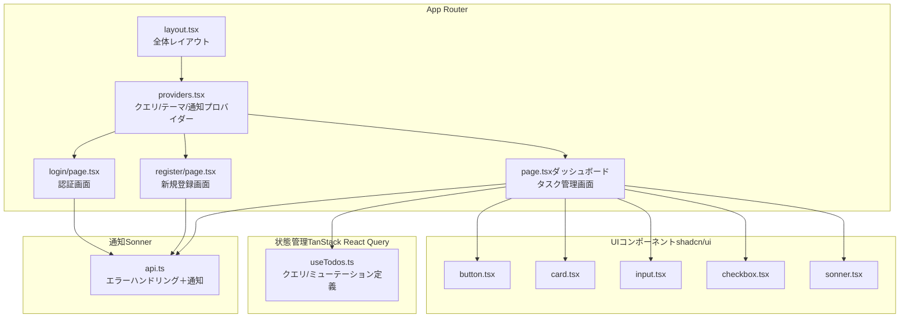

**図の出典**
- [layout.tsx:1-40](file://frontend/src/app/layout.tsx#L1-L40)
- [providers.tsx:1-26](file://frontend/src/app/providers.tsx#L1-L26)
- [page.tsx（ログイン）:1-108](file://frontend/src/app/login/page.tsx#L1-L108)
- [page.tsx（登録）:1-111](file://frontend/src/app/register/page.tsx#L1-L111)
- [page.tsx（ダッシュボード）:1-314](file://frontend/src/app/page.tsx#L1-L314)
- [useTodos.ts:1-96](file://frontend/src/hooks/useTodos.ts#L1-L96)
- [api.ts:1-102](file://frontend/src/lib/api.ts#L1-L102)
- [sonner.tsx:1-50](file://frontend/src/components/ui/sonner.tsx#L1-L50)
- [button.tsx:1-59](file://frontend/src/components/ui/button.tsx#L1-L59)
- [card.tsx:1-104](file://frontend/src/components/ui/card.tsx#L1-L104)
- [input.tsx:1-21](file://frontend/src/components/ui/input.tsx#L1-L21)
- [checkbox.tsx:1-30](file://frontend/src/components/ui/checkbox.tsx#L1-L30)

**節の出典**
- [layout.tsx:1-40](file://frontend/src/app/layout.tsx#L1-L40)
- [providers.tsx:1-26](file://frontend/src/app/providers.tsx#L1-L26)

## コアコンポーネント
- App全体のレイアウト：グローバルスタイル、テーマプロバイダー、通知トースターを設定
- Providers：React Queryクライアント、開発ツール、next-themesによるテーマ管理を提供
- 各ページ：認証（login、register）、ダッシュボード（todos）の画面ロジック
- UIコンポーネント：shadcn/ui互換の再利用可能なコンポーネント群
- 状態管理：useTodosフックを通じてAPIとのCRUD操作を管理
- 通知：api.tsのエラーハンドリングとUIトースター連携

**節の出典**
- [layout.tsx:1-40](file://frontend/src/app/layout.tsx#L1-L40)
- [providers.tsx:1-26](file://frontend/src/app/providers.tsx#L1-L26)
- [page.tsx（ログイン）:1-108](file://frontend/src/app/login/page.tsx#L1-L108)
- [page.tsx（登録）:1-111](file://frontend/src/app/register/page.tsx#L1-L111)
- [page.tsx（ダッシュボード）:1-314](file://frontend/src/app/page.tsx#L1-L314)
- [useTodos.ts:1-96](file://frontend/src/hooks/useTodos.ts#L1-L96)
- [api.ts:1-102](file://frontend/src/lib/api.ts#L1-L102)
- [sonner.tsx:1-50](file://frontend/src/components/ui/sonner.tsx#L1-L50)

## アーキテクチャ概観
App Routerのルート構成：
- root layout：全画面共通のHTML構造、フォント、テーマ、通知トースター
- providers：クエリ管理（React Query）、テーマ（next-themes）、開発ツール
- pages：login（認証）、register（新規登録）、dashboard（todos）

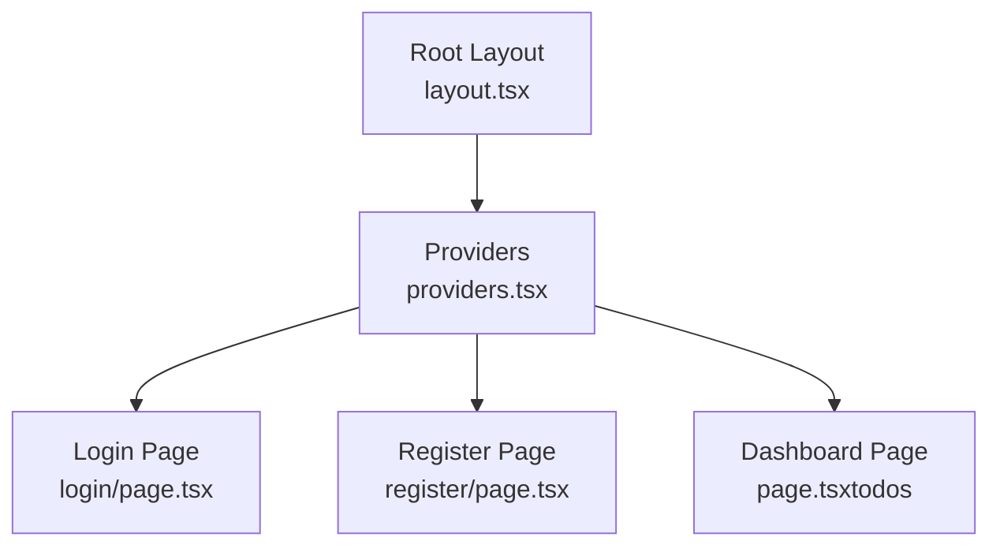

**図の出典**
- [layout.tsx:1-40](file://frontend/src/app/layout.tsx#L1-L40)
- [providers.tsx:1-26](file://frontend/src/app/providers.tsx#L1-L26)
- [page.tsx（ログイン）:1-108](file://frontend/src/app/login/page.tsx#L1-L108)
- [page.tsx（登録）:1-111](file://frontend/src/app/register/page.tsx#L1-L111)
- [page.tsx（ダッシュボード）:1-314](file://frontend/src/app/page.tsx#L1-L314)

## 詳細コンポーネント分析

### App Router構成
- 全体レイアウト：HTML属性、フォント変数、Toaster配置、Providersラッパー
- Providers：クエリクライアント初期化（staleTime設定）、next-themes、ReactQueryDevtools

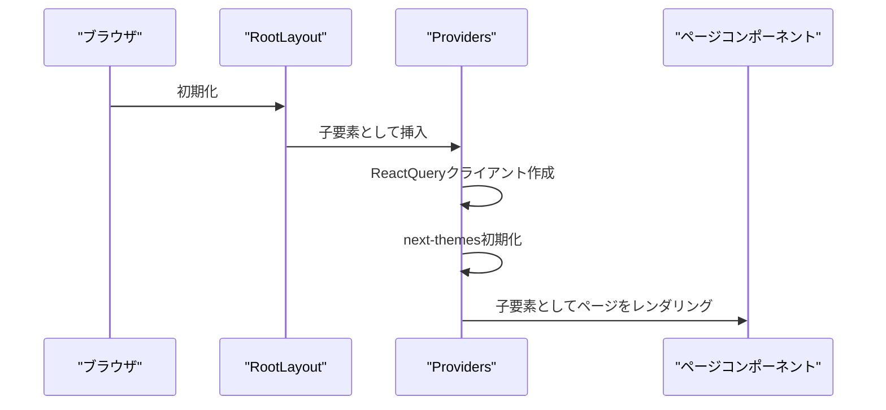

**図の出典**
- [layout.tsx:22-39](file://frontend/src/app/layout.tsx#L22-L39)
- [providers.tsx:8-25](file://frontend/src/app/providers.tsx#L8-L25)

**節の出典**
- [layout.tsx:1-40](file://frontend/src/app/layout.tsx#L1-L40)
- [providers.tsx:1-26](file://frontend/src/app/providers.tsx#L1-L26)

### ページコンポーネント（login、register、dashboard）
- login：React Hook Form + Zodによる入力バリデーション、ZodResolver使用、Sonnerによるエラーメッセージ表示
- register：同様のバリデーションと通知、登録成功後はログイン画面へ遷移
- dashboard：useTodosフックによるCRUD操作、フィルタ（検索・ステータス・優先度・ソート）適用、エラー発生時の自動リダイレクト

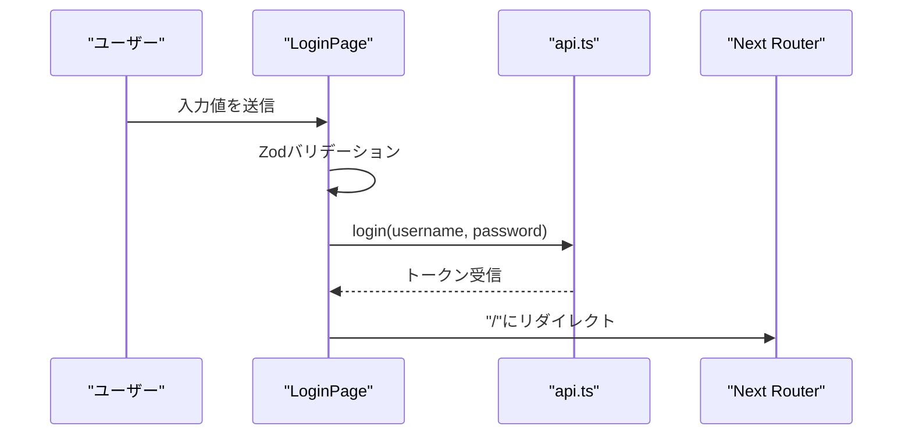

**図の出典**
- [page.tsx（ログイン）:23-44](file://frontend/src/app/login/page.tsx#L23-L44)
- [api.ts:60-96](file://frontend/src/lib/api.ts#L60-L96)

**節の出典**
- [page.tsx（ログイン）:1-108](file://frontend/src/app/login/page.tsx#L1-L108)
- [page.tsx（登録）:1-111](file://frontend/src/app/register/page.tsx#L1-L111)
- [page.tsx（ダッシュボード）:1-314](file://frontend/src/app/page.tsx#L1-L314)

### React Queryによるクエリ管理（useTodos）
- Todo一覧取得：URLSearchParamsによるフィルタクエリ構築、クエリキーに含める
- CRUDミューテーション：追加、更新（完了フラグ反転）、削除、エラー時/成功時の通知
- キャッシュ無効化：各ミューテーション成功後にtodosクエリを無効化

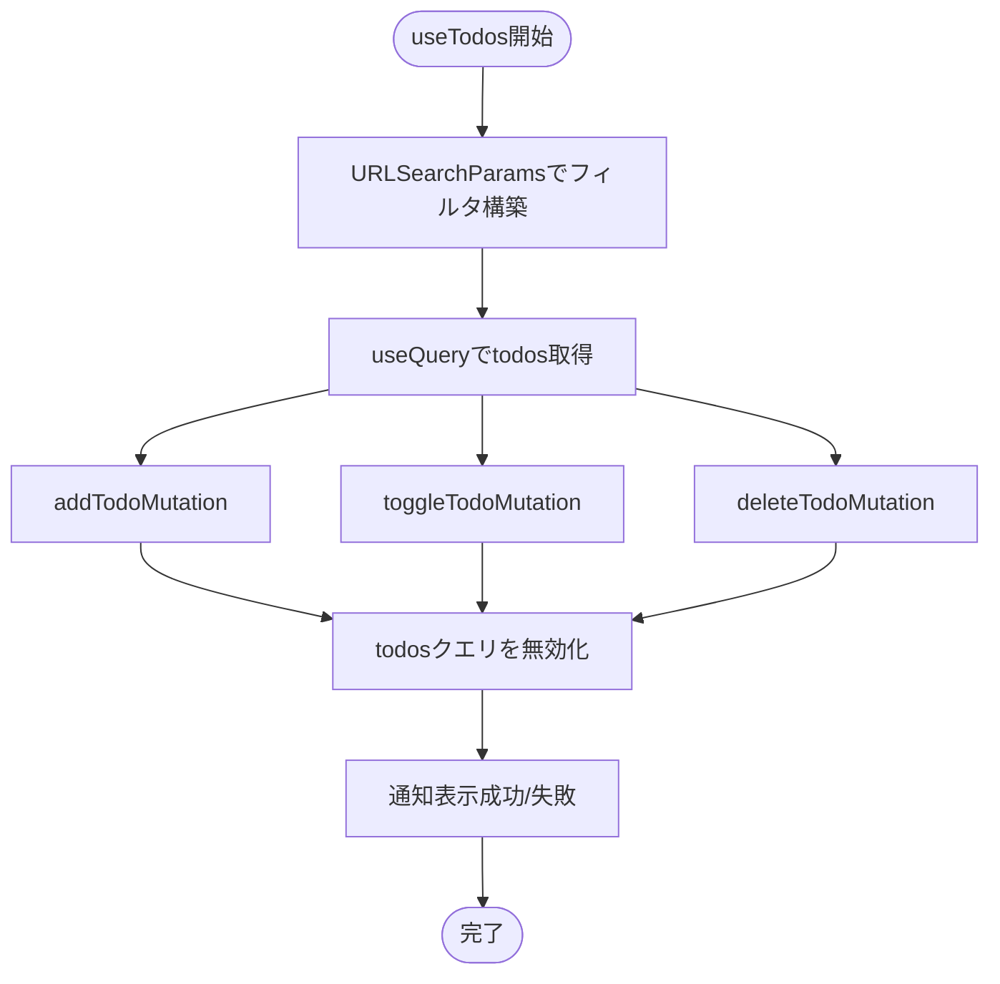

**図の出典**
- [useTodos.ts:26-96](file://frontend/src/hooks/useTodos.ts#L26-L96)

**節の出典**
- [useTodos.ts:1-96](file://frontend/src/hooks/useTodos.ts#L1-L96)

### テーマ切り替え機能（next-themes + UI）
- ThemeProvider：next-themesの属性設定、デフォルトテーマsystem
- ThemeToggle：クライアントコンポーネント、マウント後の初期化、テーマ切替ボタン
- UI通知：Toasterコンポーネントでテーマに応じたアイコンとスタイル適用

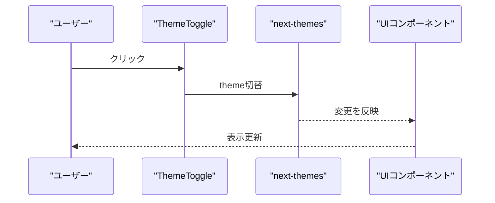

**図の出典**
- [theme-toggle.tsx:8-35](file://frontend/src/components/theme-toggle.tsx#L8-L35)
- [theme-provider.tsx:1-9](file://frontend/src/components/theme-provider.tsx#L1-L9)
- [sonner.tsx:7-47](file://frontend/src/components/ui/sonner.tsx#L7-L47)

**節の出典**
- [theme-toggle.tsx:1-36](file://frontend/src/components/theme-toggle.tsx#L1-L36)
- [theme-provider.tsx:1-9](file://frontend/src/components/theme-provider.tsx#L1-L9)
- [sonner.tsx:1-50](file://frontend/src/components/ui/sonner.tsx#L1-L50)

### UIコンポーネント（shadcn/ui互換）
- button.tsx：variants/sizeによるバリエーション、CVA適用
- card.tsx：ヘッダー/タイトル/コンテンツ/フッター構成、サイズ指定可能
- input.tsx：入力フィールドのスタイリング
- checkbox.tsx：チェックボックスの状態管理

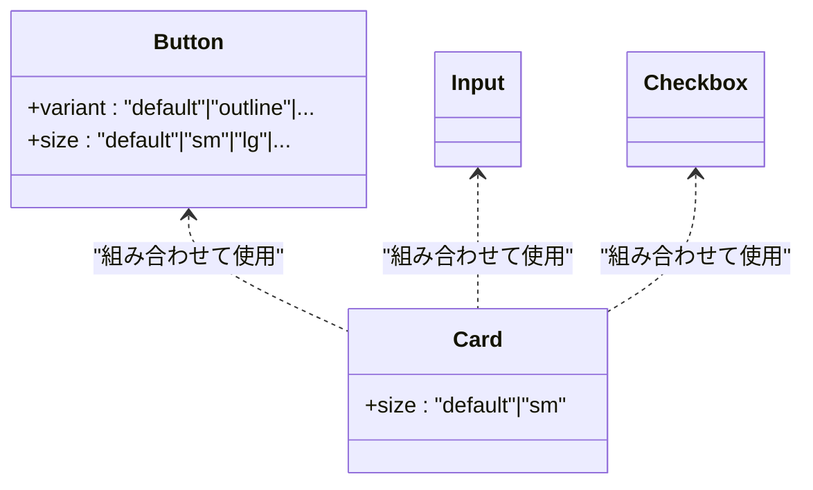

**図の出典**
- [button.tsx:6-41](file://frontend/src/components/ui/button.tsx#L6-L41)
- [card.tsx:5-93](file://frontend/src/components/ui/card.tsx#L5-L93)
- [input.tsx:6-18](file://frontend/src/components/ui/input.tsx#L6-L18)
- [checkbox.tsx:8-26](file://frontend/src/components/ui/checkbox.tsx#L8-L26)

**節の出典**
- [button.tsx:1-59](file://frontend/src/components/ui/button.tsx#L1-L59)
- [card.tsx:1-104](file://frontend/src/components/ui/card.tsx#L1-L104)
- [input.tsx:1-21](file://frontend/src/components/ui/input.tsx#L1-L21)
- [checkbox.tsx:1-30](file://frontend/src/components/ui/checkbox.tsx#L1-L30)

### 状態管理（TanStack React Query）
- useQuery：todos一覧取得、フィルタ付きクエリキー
- useMutation：CRUD操作、成功/失敗時の通知、キャッシュ無効化
- useQueryClient：クエリの再取得トリガー

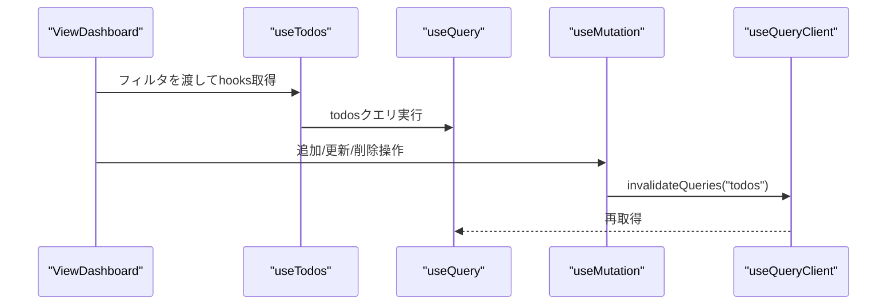

**図の出典**
- [useTodos.ts:41-87](file://frontend/src/hooks/useTodos.ts#L41-L87)

**節の出典**
- [useTodos.ts:1-96](file://frontend/src/hooks/useTodos.ts#L1-L96)

### フォーム処理（React Hook Form + Zod）
- login：Zodスキーマによるバリデーション、zodResolver使用、エラーハンドリング
- register：同様のバリデーション、成功時/失敗時の通知と遷移

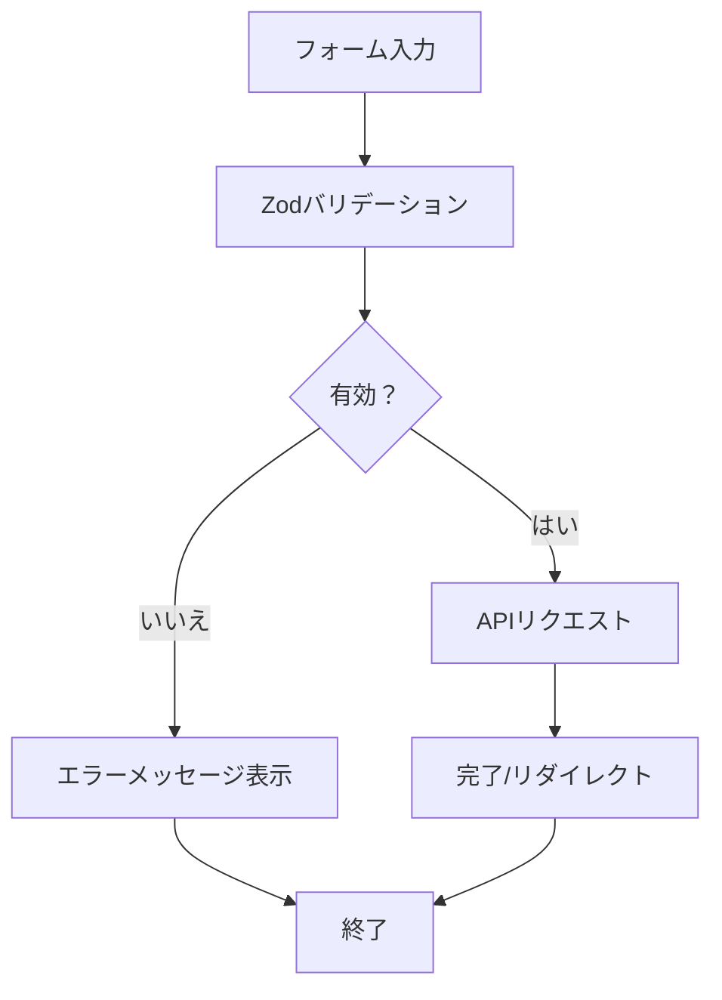

**図の出典**
- [page.tsx（ログイン）:16-32](file://frontend/src/app/login/page.tsx#L16-L32)
- [page.tsx（登録）:16-32](file://frontend/src/app/register/page.tsx#L16-L32)

**節の出典**
- [page.tsx（ログイン）:1-108](file://frontend/src/app/login/page.tsx#L1-L108)
- [page.tsx（登録）:1-111](file://frontend/src/app/register/page.tsx#L1-L111)

### 通知システム（Sonner）
- layout.tsx：Toaster配置（position=top-center、richColors）
- api.ts：fetchエラー時、詳細なエラーメッセージをtoastで表示
- components/ui/sonner.tsx：テーマに応じたアイコンとCSS変数適用

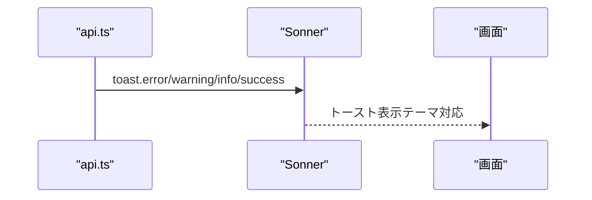

**図の出典**
- [layout.tsx:35-35](file://frontend/src/app/layout.tsx#L35-L35)
- [api.ts:17-58](file://frontend/src/lib/api.ts#L17-L58)
- [sonner.tsx:7-47](file://frontend/src/components/ui/sonner.tsx#L7-L47)

**節の出典**
- [layout.tsx:1-40](file://frontend/src/app/layout.tsx#L1-L40)
- [api.ts:1-102](file://frontend/src/lib/api.ts#L1-L102)
- [sonner.tsx:1-50](file://frontend/src/components/ui/sonner.tsx#L1-L50)

## 依存関係分析
- package.json：Next.js 16、React 19、@tanstack/react-query、react-hook-form、zod、sonner、next-themes、shadcn互換コンポーネント群
- providers.tsx：クエリ管理（React Query）、開発ツール、テーマ管理（next-themes）
- pages：各画面コンポーネントがAPI、UI、通知、クエリを統合

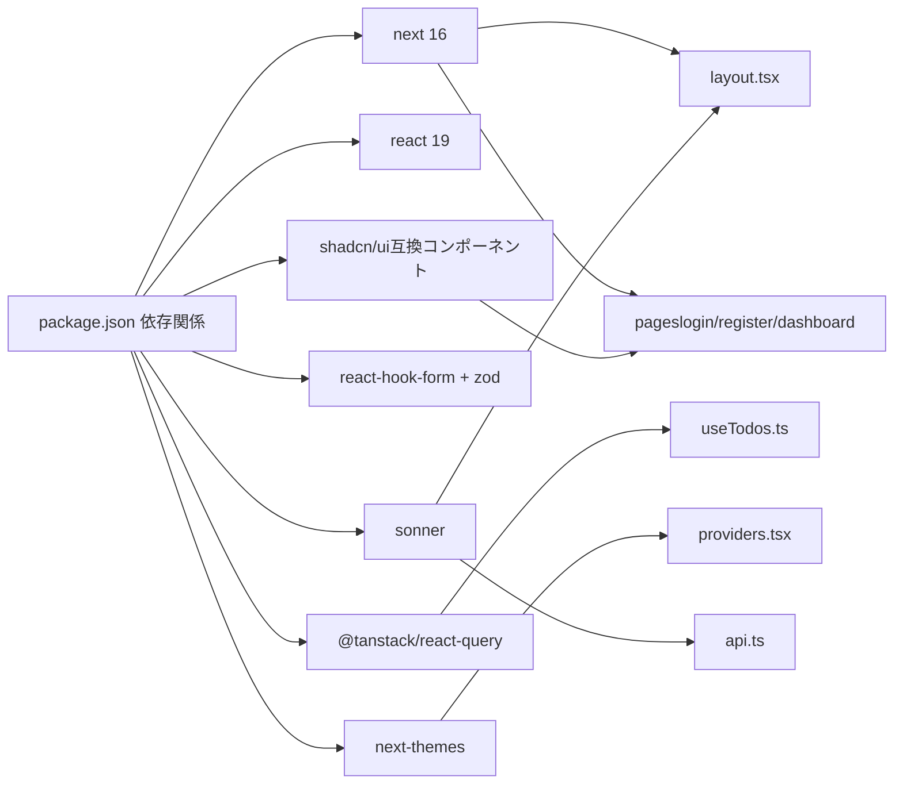

**図の出典**
- [package.json:14-31](file://frontend/package.json#L14-L31)
- [layout.tsx:1-40](file://frontend/src/app/layout.tsx#L1-L40)
- [providers.tsx:1-26](file://frontend/src/app/providers.tsx#L1-L26)
- [useTodos.ts:1-96](file://frontend/src/hooks/useTodos.ts#L1-L96)
- [api.ts:1-102](file://frontend/src/lib/api.ts#L1-L102)

**節の出典**
- [package.json:1-60](file://frontend/package.json#L1-L60)

## パフォーマンス考慮事項
- React QueryのstaleTime：60秒間はキャッシュを再取得しない設定により、不要なネットワークリクエストを抑制
- URLSearchParamsによるフィルタクエリ：クエリキーにフィルタを含めることで、適切なキャッシュ分離と再取得を実現
- 通知の条件付き表示：エラー発生時のみトーストを表示し、ユーザー体験を損なわないよう配慮

## トラブルシューティングガイド
- APIエラー時の通知：api.tsでレスポンスが正常でない場合、エラーメッセージ（詳細も可）をtoastで表示し、throwでエラーを上位に伝播
- 認証エラー：login関数でトークンが返らない場合、エラーを投げて画面側でハンドリング
- ダッシュボードでのエラー：todosクエリのisError時に自動的にログイン画面へリダイレクト
- 通知のテーマ対応：sonner.tsxでテーマに応じたアイコンとCSS変数を適用

**節の出典**
- [api.ts:33-58](file://frontend/src/lib/api.ts#L33-L58)
- [api.ts:73-91](file://frontend/src/lib/api.ts#L73-L91)
- [page.tsx（ダッシュボード）:35-40](file://frontend/src/app/page.tsx#L35-L40)
- [sonner.tsx:7-47](file://frontend/src/components/ui/sonner.tsx#L7-L47)

## 結論
本アーキテクチャは、Next.js 16のApp Router、shadcn/ui互換UI、TanStack React Query、React Hook Form/Zod、Sonner、next-themesを統合し、認証フロー、タスク管理、テーマ切り替え、通知を一貫した設計で実現しています。フィルタ付きクエリ管理、エラーハンドリング、通知連携により、堅牢でユーザーフレンドリーなフロントエンドを提供します。