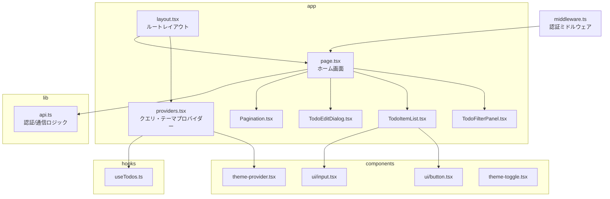
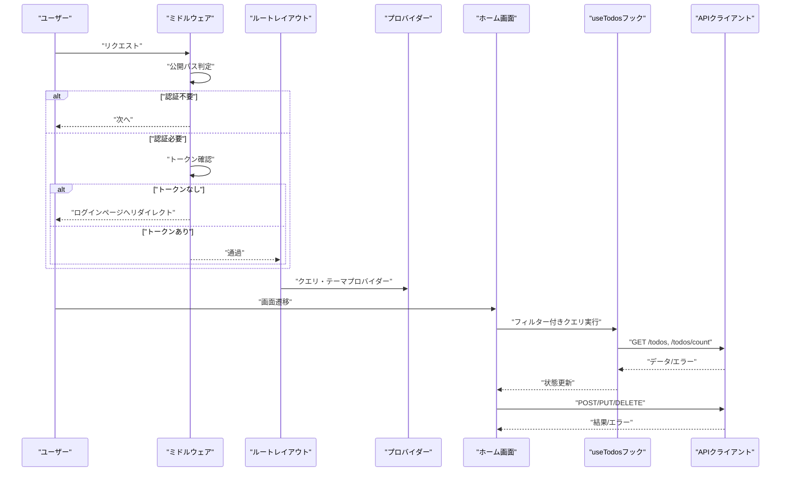
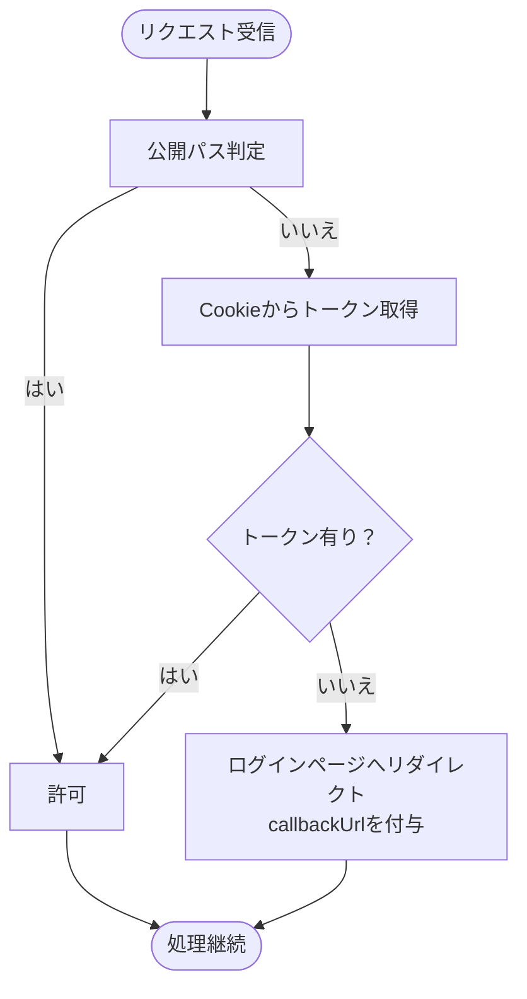
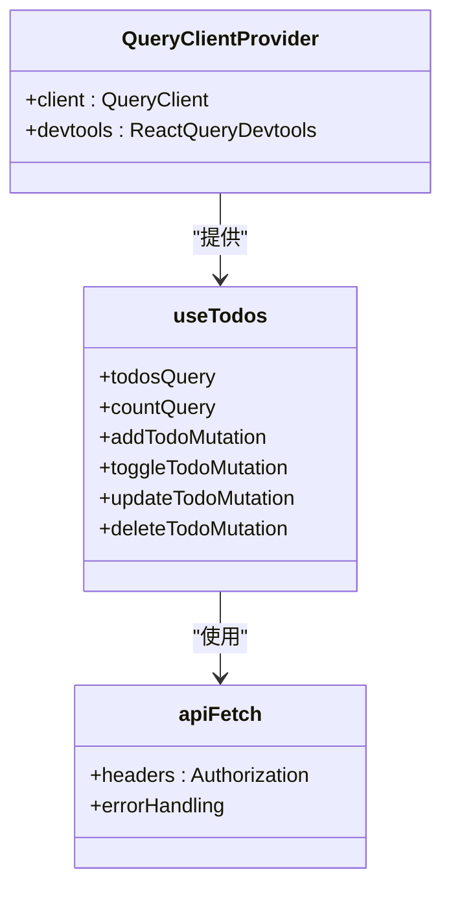
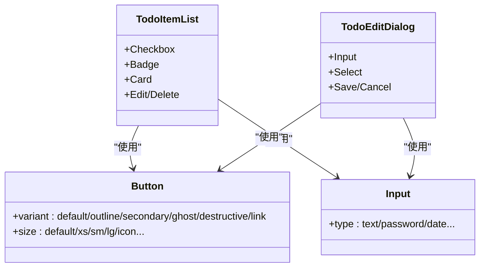
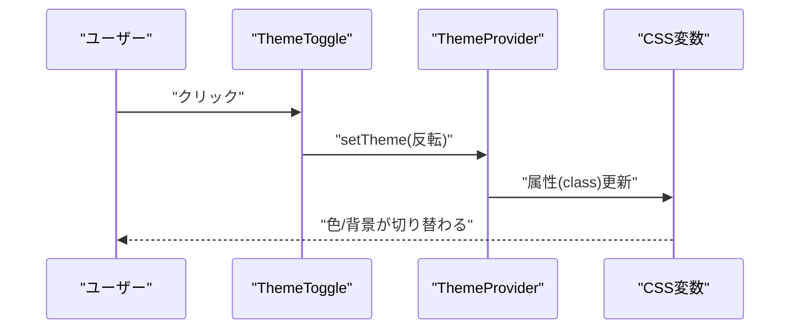
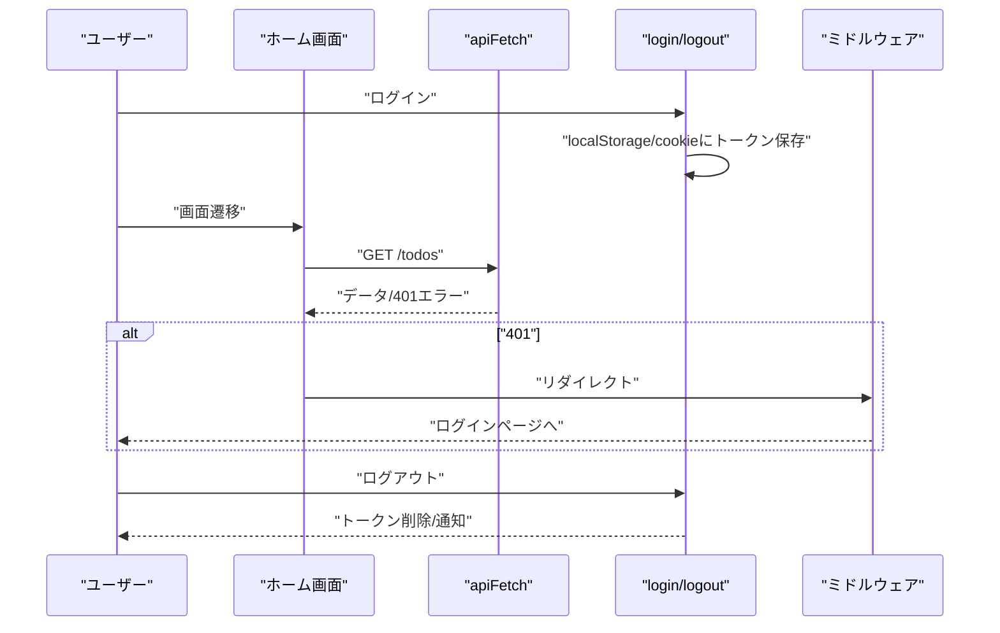
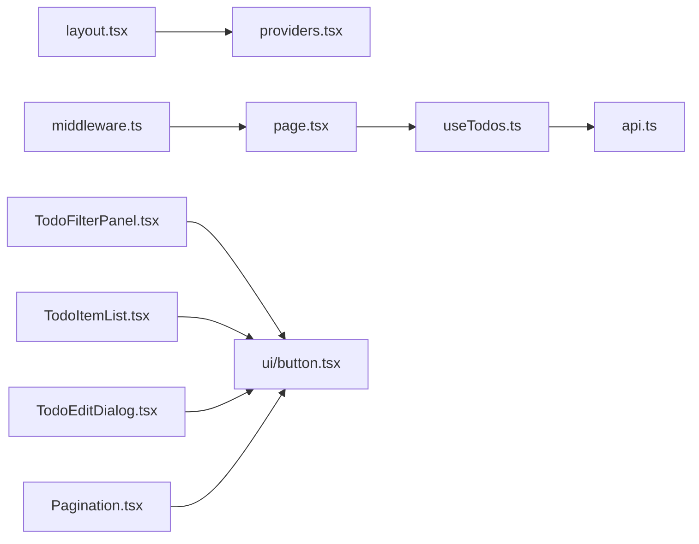

# フロントエンドアーキテクチャ

<cite>
**この文書で参照されるファイル**
- [frontend/src/app/layout.tsx](file://frontend/src/app/layout.tsx)
- [frontend/src/app/providers.tsx](file://frontend/src/app/providers.tsx)
- [frontend/src/middleware.ts](file://frontend/src/middleware.ts)
- [frontend/src/lib/api.ts](file://frontend/src/lib/api.ts)
- [frontend/src/hooks/useTodos.ts](file://frontend/src/hooks/useTodos.ts)
- [frontend/src/app/page.tsx](file://frontend/src/app/page.tsx)
- [frontend/src/app/_components/TodoFilterPanel.tsx](file://frontend/src/app/_components/TodoFilterPanel.tsx)
- [frontend/src/app/_components/TodoItemList.tsx](file://frontend/src/app/_components/TodoItemList.tsx)
- [frontend/src/app/_components/TodoEditDialog.tsx](file://frontend/src/app/_components/TodoEditDialog.tsx)
- [frontend/src/app/_components/Pagination.tsx](file://frontend/src/app/_components/Pagination.tsx)
- [frontend/src/components/theme-provider.tsx](file://frontend/src/components/theme-provider.tsx)
- [frontend/src/components/theme-toggle.tsx](file://frontend/src/components/theme-toggle.tsx)
- [frontend/src/components/ui/button.tsx](file://frontend/src/components/ui/button.tsx)
- [frontend/src/components/ui/input.tsx](file://frontend/src/components/ui/input.tsx)
- [frontend/src/app/globals.css](file://frontend/src/app/globals.css)
</cite>

## 目次
1. [導入](#導入)
2. [プロジェクト構造](#プロジェクト構造)
3. [コアコンポーネント](#コアコンポーネント)
4. [アーキテクチャ概観](#アーキテクチャ概観)
5. [詳細コンポーネント分析](#詳細コンポーネント分析)
6. [依存関係分析](#依存関係分析)
7. [パフォーマンス考慮事項](#パフォーマンス考慮事項)
8. [トラブルシューティングガイド](#トラブルシューティングガイド)
9. [結論](#結論)

## 導入
本プロジェクトは、Next.js App Router を活用したモダンなフロントエンドアーキテクチャを実現しています。認証フロー、ルーティング、状態管理（TanStack Query）、テーマ切り替え、レスポンシブデザイン、ミドルウェアによるセキュリティ保護を統合的に設計・実装しています。本ドキュメントでは、これらの要素をコードレベルで詳細に解説し、理解しやすい構成にしています。

## プロジェクト構造
Next.js App Router に基づくディレクトリ構造は以下の通りです：
- app: ルートレイアウト、ルーティング、プロバイダー配置
- components: 再利用可能なUIコンポーネント（UIスケール、テーマ）
- hooks: 独自フック（APIクライアント、Todo一覧操作）
- lib: API通信ロジック（認証、エラーハンドリング）
- middleware: 認証不要な公開パスを定義し、認証が必要なリクエストを保護

```mermaid
graph TB
subgraph "app"
L["layout.tsx<br/>ルートレイアウト"]
P["providers.tsx<br/>クエリ・テーマプロバイダー"]
H["page.tsx<br/>ホーム画面"]
C1["TodoFilterPanel.tsx"]
C2["TodoItemList.tsx"]
C3["TodoEditDialog.tsx"]
C4["Pagination.tsx"]
end
subgraph "components"
U1["ui/button.tsx"]
U2["ui/input.tsx"]
TP["theme-provider.tsx"]
TT["theme-toggle.tsx"]
end
subgraph "hooks"
HT["useTodos.ts"]
end
subgraph "lib"
API["api.ts<br/>認証/通信ロジック"]
end
M["middleware.ts<br/>認証ミドルウェア"]
L --> P
L --> H
H --> C1
H --> C2
H --> C3
H --> C4
C2 --> U1
C2 --> U2
P --> TP
P --> HT
H --> API
M --> H
```

**図の出典**
- [frontend/src/app/layout.tsx:1-40](file://frontend/src/app/layout.tsx#L1-L40)
- [frontend/src/app/providers.tsx:1-26](file://frontend/src/app/providers.tsx#L1-L26)
- [frontend/src/app/page.tsx:1-298](file://frontend/src/app/page.tsx#L1-L298)
- [frontend/src/app/_components/TodoFilterPanel.tsx:1-105](file://frontend/src/app/_components/TodoFilterPanel.tsx#L1-L105)
- [frontend/src/app/_components/TodoItemList.tsx:1-182](file://frontend/src/app/_components/TodoItemList.tsx#L1-L182)
- [frontend/src/app/_components/TodoEditDialog.tsx:1-137](file://frontend/src/app/_components/TodoEditDialog.tsx#L1-L137)
- [frontend/src/app/_components/Pagination.tsx:1-49](file://frontend/src/app/_components/Pagination.tsx#L1-L49)
- [frontend/src/components/ui/button.tsx:1-59](file://frontend/src/components/ui/button.tsx#L1-L59)
- [frontend/src/components/ui/input.tsx:1-21](file://frontend/src/components/ui/input.tsx#L1-L21)
- [frontend/src/components/theme-provider.tsx:1-9](file://frontend/src/components/theme-provider.tsx#L1-L9)
- [frontend/src/components/theme-toggle.tsx:1-37](file://frontend/src/components/theme-toggle.tsx#L1-L37)
- [frontend/src/hooks/useTodos.ts:1-119](file://frontend/src/hooks/useTodos.ts#L1-L119)
- [frontend/src/lib/api.ts:1-113](file://frontend/src/lib/api.ts#L1-L113)
- [frontend/src/middleware.ts:1-35](file://frontend/src/middleware.ts#L1-L35)

**節の出典**
- [frontend/src/app/layout.tsx:1-40](file://frontend/src/app/layout.tsx#L1-L40)
- [frontend/src/app/providers.tsx:1-26](file://frontend/src/app/providers.tsx#L1-L26)
- [frontend/src/middleware.ts:1-35](file://frontend/src/middleware.ts#L1-L35)

## コアコンポーネント
- ルートレイアウト：グローバルスタイル、トースト通知、テーマプロバイダーを提供
- プロバイダー：TanStack Queryクライアント、開発ツール、テーマ管理を統合
- APIクライアント：認証トークン管理、エラーハンドリング、認証/ログアウト処理
- Todoフック：一覧取得、件数取得、CRUDミューテーション、フィルター構築
- UIコンポーネント：ボタン、入力、カード、ダイアログ、フィルター、一覧、編集ダイアログ、ページネーション
- テーマ：next-themesによるテーマ切り替え、ハイドレーション対策

**節の出典**
- [frontend/src/app/layout.tsx:1-40](file://frontend/src/app/layout.tsx#L1-L40)
- [frontend/src/app/providers.tsx:1-26](file://frontend/src/app/providers.tsx#L1-L26)
- [frontend/src/lib/api.ts:1-113](file://frontend/src/lib/api.ts#L1-L113)
- [frontend/src/hooks/useTodos.ts:1-119](file://frontend/src/hooks/useTodos.ts#L1-L119)
- [frontend/src/components/ui/button.tsx:1-59](file://frontend/src/components/ui/button.tsx#L1-L59)
- [frontend/src/components/ui/input.tsx:1-21](file://frontend/src/components/ui/input.tsx#L1-L21)
- [frontend/src/components/theme-provider.tsx:1-9](file://frontend/src/components/theme-provider.tsx#L1-L9)
- [frontend/src/components/theme-toggle.tsx:1-37](file://frontend/src/components/theme-toggle.tsx#L1-L37)

## アーキテクチャ概観
全体のフローは以下の通りです：
- 認証不要な公開パス（ログイン、登録、パスワード再設定）をミドルウェアが除外
- それ以外のリクエストに対して、CookieまたはlocalStorageからトークンを確認
- トークンが存在しない場合、コールバックURL付きでログインページへリダイレクト
- 認証済みユーザーはルートレイアウト配下でクエリ・テーマプロバイダーを利用可能
- Todo一覧画面でフィルター・ソート・ページネーションを適用し、TanStack Queryでデータを取得
- CRUD操作はミューテーションを通じて即時反映、エラーハンドリング付き

```mermaid
sequenceDiagram
participant U as "ユーザー"
participant MW as "ミドルウェア"
participant L as "ルートレイアウト"
participant PR as "プロバイダー"
participant PG as "ホーム画面"
participant HK as "useTodosフック"
participant API as "APIクライアント"
U->>MW : "リクエスト"
MW->>MW : "公開パス判定"
alt "認証不要"
MW-->>U : "次へ"
else "認証必要"
MW->>MW : "トークン確認"
alt "トークンなし"
MW-->>U : "ログインページへリダイレクト"
else "トークンあり"
MW-->>L : "通過"
end
end
L->>PR : "クエリ・テーマプロバイダー"
U->>PG : "画面遷移"
PG->>HK : "フィルター付きクエリ実行"
HK->>API : "GET /todos, /todos/count"
API-->>HK : "データ/エラー"
HK-->>PG : "状態更新"
PG->>API : "POST/PUT/DELETE"
API-->>PG : "結果/エラー"
```

**図の出典**
- [frontend/src/middleware.ts:1-35](file://frontend/src/middleware.ts#L1-L35)
- [frontend/src/app/layout.tsx:1-40](file://frontend/src/app/layout.tsx#L1-L40)
- [frontend/src/app/providers.tsx:1-26](file://frontend/src/app/providers.tsx#L1-L26)
- [frontend/src/app/page.tsx:1-298](file://frontend/src/app/page.tsx#L1-L298)
- [frontend/src/hooks/useTodos.ts:1-119](file://frontend/src/hooks/useTodos.ts#L1-L119)
- [frontend/src/lib/api.ts:1-113](file://frontend/src/lib/api.ts#L1-L113)

## 詳細コンポーネント分析

### ルーティングとミドルウェア
- 公開パス（ログイン、登録、パスワード再設定、静的リソース）を除外
- それ以外のリクエストに対して、Cookieからトークンを取得
- トークンがなければ、現在のpathnameをcallbackUrlとしてログインページへリダイレクト
- マッチ条件は正規表現により、認証が必要なパスのみを対象

```mermaid
flowchart TD
Start(["リクエスト受信"]) --> CheckPublic["公開パス判定"]
CheckPublic --> |はい| Allow["許可"]
CheckPublic --> |いいえ| CheckToken["Cookieからトークン取得"]
CheckToken --> HasToken{"トークン有り？"}
HasToken --> |はい| Allow
HasToken --> |いいえ| Redirect["ログインページへリダイレクト<br/>callbackUrlを付与"]
Allow --> End(["処理継続"])
Redirect --> End
```

**図の出典**
- [frontend/src/middleware.ts:1-35](file://frontend/src/middleware.ts#L1-L35)

**節の出典**
- [frontend/src/middleware.ts:1-35](file://frontend/src/middleware.ts#L1-L35)

### 状態管理（TanStack Query）の実装
- QueryClientProviderでクエリクライアントを提供（staleTime設定）
- useTodosフックで以下の操作をカプセル化：
  - Todo一覧取得（クエリキー：todos＋フィルター）
  - 件数取得（クエリキー：todos-count＋フィルター）
  - 追加、更新、削除、完了状態切り替え（ミューテーション）
  - 失敗時のトースト表示、成功時のクエリ無効化
- apiFetch関数で共通のエラーハンドリング、認証ヘッダー付与

```mermaid
classDiagram
class QueryClientProvider {
+client : QueryClient
+devtools : ReactQueryDevtools
}
class useTodos {
+todosQuery
+countQuery
+addTodoMutation
+toggleTodoMutation
+updateTodoMutation
+deleteTodoMutation
}
class apiFetch {
+headers : Authorization
+errorHandling
}
QueryClientProvider --> useTodos : "提供"
useTodos --> apiFetch : "使用"
```

**図の出典**
- [frontend/src/app/providers.tsx:1-26](file://frontend/src/app/providers.tsx#L1-L26)
- [frontend/src/hooks/useTodos.ts:1-119](file://frontend/src/hooks/useTodos.ts#L1-L119)
- [frontend/src/lib/api.ts:1-113](file://frontend/src/lib/api.ts#L1-L113)

**節の出典**
- [frontend/src/app/providers.tsx:1-26](file://frontend/src/app/providers.tsx#L1-L26)
- [frontend/src/hooks/useTodos.ts:1-119](file://frontend/src/hooks/useTodos.ts#L1-L119)
- [frontend/src/lib/api.ts:1-113](file://frontend/src/lib/api.ts#L1-L113)

### UIコンポーネントの設計思想
- 再利用性：UIスケール（button、inputなど）はpropsベースでバリエーションを提供
- デザインシステム：TailwindCSS、shadcn/tailwind、Tw-Animate-CSS、Geistフォント
- レスポンシブ：Grid/Stack/Flexを適切に組み合わせ、モバイルファースト
- アクセシビリティ：aria-*、フォーカスリング、スクリーンリーダー対応

```mermaid
classDiagram
class Button {
+variant : default/outline/secondary/ghost/destructive/link
+size : default/xs/sm/lg/icon...
}
class Input {
+type : text/password/date...
}
class TodoItemList {
+Checkbox
+Badge
+Card
+Edit/Delete
}
class TodoEditDialog {
+Input
+Select
+Save/Cancel
}
TodoItemList --> Button : "使用"
TodoItemList --> Input : "使用"
TodoEditDialog --> Button : "使用"
TodoEditDialog --> Input : "使用"
```

**図の出典**
- [frontend/src/components/ui/button.tsx:1-59](file://frontend/src/components/ui/button.tsx#L1-L59)
- [frontend/src/components/ui/input.tsx:1-21](file://frontend/src/components/ui/input.tsx#L1-L21)
- [frontend/src/app/_components/TodoItemList.tsx:1-182](file://frontend/src/app/_components/TodoItemList.tsx#L1-L182)
- [frontend/src/app/_components/TodoEditDialog.tsx:1-137](file://frontend/src/app/_components/TodoEditDialog.tsx#L1-L137)

**節の出典**
- [frontend/src/components/ui/button.tsx:1-59](file://frontend/src/components/ui/button.tsx#L1-L59)
- [frontend/src/components/ui/input.tsx:1-21](file://frontend/src/components/ui/input.tsx#L1-L21)
- [frontend/src/app/_components/TodoItemList.tsx:1-182](file://frontend/src/app/_components/TodoItemList.tsx#L1-L182)
- [frontend/src/app/_components/TodoEditDialog.tsx:1-137](file://frontend/src/app/_components/TodoEditDialog.tsx#L1-L137)

### テーマ切り替え機能
- next-themesによるテーマ管理（light/dark/system）
- ThemeProviderで属性をclassに設定し、CSS変数ベースのカラースキームを切り替え
- ThemeToggleはクライアントコンポーネント、ハイドレーション後の初期描画を回避

```mermaid
sequenceDiagram
participant U as "ユーザー"
participant TT as "ThemeToggle"
participant TP as "ThemeProvider"
participant CSS as "CSS変数"
U->>TT : "クリック"
TT->>TP : "setTheme(反転)"
TP->>CSS : "属性(class)更新"
CSS-->>U : "色/背景が切り替わる"
```

**図の出典**
- [frontend/src/components/theme-toggle.tsx:1-37](file://frontend/src/components/theme-toggle.tsx#L1-L37)
- [frontend/src/components/theme-provider.tsx:1-9](file://frontend/src/components/theme-provider.tsx#L1-L9)
- [frontend/src/app/globals.css:1-130](file://frontend/src/app/globals.css#L1-L130)

**節の出典**
- [frontend/src/components/theme-toggle.tsx:1-37](file://frontend/src/components/theme-toggle.tsx#L1-L37)
- [frontend/src/components/theme-provider.tsx:1-9](file://frontend/src/components/theme-provider.tsx#L1-L9)
- [frontend/src/app/globals.css:1-130](file://frontend/src/app/globals.css#L1-L130)

### レスポンシブデザインの実装
- Grid（md以上での列分割）とFlexによるレイアウト調整
- 単一行の入力・ボタンを折りたたむUI（詳細設定）をハンバーガーメニュー風に制御
- 表示件数・ページネーションをモバイルでも操作しやすく配置

**節の出典**
- [frontend/src/app/page.tsx:1-298](file://frontend/src/app/page.tsx#L1-L298)
- [frontend/src/app/_components/TodoFilterPanel.tsx:1-105](file://frontend/src/app/_components/TodoFilterPanel.tsx#L1-L105)
- [frontend/src/app/_components/Pagination.tsx:1-49](file://frontend/src/app/_components/Pagination.tsx#L1-L49)

### API通信と認証フロー
- apiFetch：BASE_URL、Authorizationヘッダー、JSONエラーレスポンスの解析、トーストでのユーザー向けメッセージ
- login：form-encoded送信、access_tokenをlocalStorage/cookieに保存
- logout：両方からトークンを削除、通知表示

```mermaid
sequenceDiagram
participant U as "ユーザー"
participant PG as "ホーム画面"
participant API as "apiFetch"
participant AUTH as "login/logout"
participant MW as "ミドルウェア"
U->>AUTH : "ログイン"
AUTH->>AUTH : "localStorage/cookieにトークン保存"
U->>PG : "画面遷移"
PG->>API : "GET /todos"
API-->>PG : "データ/401エラー"
alt "401"
PG->>MW : "リダイレクト"
MW-->>U : "ログインページへ"
end
U->>AUTH : "ログアウト"
AUTH-->>U : "トークン削除/通知"
```

**図の出典**
- [frontend/src/lib/api.ts:1-113](file://frontend/src/lib/api.ts#L1-L113)
- [frontend/src/app/page.tsx:1-298](file://frontend/src/app/page.tsx#L1-L298)
- [frontend/src/middleware.ts:1-35](file://frontend/src/middleware.ts#L1-L35)

**節の出典**
- [frontend/src/lib/api.ts:1-113](file://frontend/src/lib/api.ts#L1-L113)
- [frontend/src/app/page.tsx:1-298](file://frontend/src/app/page.tsx#L1-L298)
- [frontend/src/middleware.ts:1-35](file://frontend/src/middleware.ts#L1-L35)

## 依存関係分析
- app/layout.tsx は app/providers.tsx に依存（プロバイダー配置）
- app/page.tsx は hooks/useTodos.ts に依存（状態管理）
- hooks/useTodos.ts は lib/api.ts に依存（通信）
- 各UIコンポーネント（button/input）は shadcn/UI に依存
- middleware.ts は認証フローの前提条件（Cookie/Token）

```mermaid
graph LR
L["layout.tsx"] --> P["providers.tsx"]
H["page.tsx"] --> HT["useTodos.ts"]
HT --> API["api.ts"]
C1["TodoFilterPanel.tsx"] --> UI["ui/button.tsx"]
C2["TodoItemList.tsx"] --> UI
C3["TodoEditDialog.tsx"] --> UI
C4["Pagination.tsx"] --> UI
M["middleware.ts"] --> H
```

**図の出典**
- [frontend/src/app/layout.tsx:1-40](file://frontend/src/app/layout.tsx#L1-L40)
- [frontend/src/app/providers.tsx:1-26](file://frontend/src/app/providers.tsx#L1-L26)
- [frontend/src/app/page.tsx:1-298](file://frontend/src/app/page.tsx#L1-L298)
- [frontend/src/hooks/useTodos.ts:1-119](file://frontend/src/hooks/useTodos.ts#L1-L119)
- [frontend/src/lib/api.ts:1-113](file://frontend/src/lib/api.ts#L1-L113)
- [frontend/src/app/_components/TodoFilterPanel.tsx:1-105](file://frontend/src/app/_components/TodoFilterPanel.tsx#L1-L105)
- [frontend/src/app/_components/TodoItemList.tsx:1-182](file://frontend/src/app/_components/TodoItemList.tsx#L1-L182)
- [frontend/src/app/_components/TodoEditDialog.tsx:1-137](file://frontend/src/app/_components/TodoEditDialog.tsx#L1-L137)
- [frontend/src/app/_components/Pagination.tsx:1-49](file://frontend/src/app/_components/Pagination.tsx#L1-L49)
- [frontend/src/components/ui/button.tsx:1-59](file://frontend/src/components/ui/button.tsx#L1-L59)
- [frontend/src/middleware.ts:1-35](file://frontend/src/middleware.ts#L1-L35)

**節の出典**
- [frontend/src/app/layout.tsx:1-40](file://frontend/src/app/layout.tsx#L1-L40)
- [frontend/src/app/providers.tsx:1-26](file://frontend/src/app/providers.tsx#L1-L26)
- [frontend/src/app/page.tsx:1-298](file://frontend/src/app/page.tsx#L1-L298)
- [frontend/src/hooks/useTodos.ts:1-119](file://frontend/src/hooks/useTodos.ts#L1-L119)
- [frontend/src/lib/api.ts:1-113](file://frontend/src/lib/api.ts#L1-L113)
- [frontend/src/middleware.ts:1-35](file://frontend/src/middleware.ts#L1-L35)

## パフォーマンス考慮事項
- TanStack QueryのstaleTime（1分）により、再取得頻度を抑制し、ネットワーク負荷を軽減
- useTodosのクエリキーにフィルターを含めることで、異なる条件でのキャッシュ分離
- 一覧表示時の遅延描画（requestAnimationFrame）による初期レンダリングの安定化（テーマ切り替えコンポーネント）
- トグルボタンのハイドレーション対策（マウント後描画）によるSSR/CSRの不一致防止

[この節は一般的なパフォーマンスに関する考察であり、特定ファイルの解析を伴わないため「節の出典」を含みません]

## トラブルシューティングガイド
- 401エラー発生時：ホーム画面でエラーチェックを行い、ログインページへリダイレクト
- APIエラー：apiFetchがJSONエラーレスポンスを解析し、トーストで詳細を表示
- トークン喪失：middlewareが存在しない場合、ログインページへリダイレクト
- 認証成功/失敗：login関数がaccess_tokenを保存/削除し、トーストで通知

**節の出典**
- [frontend/src/app/page.tsx:49-54](file://frontend/src/app/page.tsx#L49-L54)
- [frontend/src/lib/api.ts:39-62](file://frontend/src/lib/api.ts#L39-L62)
- [frontend/src/middleware.ts:15-23](file://frontend/src/middleware.ts#L15-L23)

## 結論
本アーキテクチャは、Next.js App Routerの強みを活かし、認証・ルーティング・状態管理・テーマ・レスポンシブデザインを一貫して統合しています。TanStack Queryによる堅牢なデータフロー、ミドルウェアによるセキュリティ保護、UIコンポーネントの再利用性とアクセシビリティ設計により、保守性・拡張性に優れたフロントエンド基盤を提供しています。