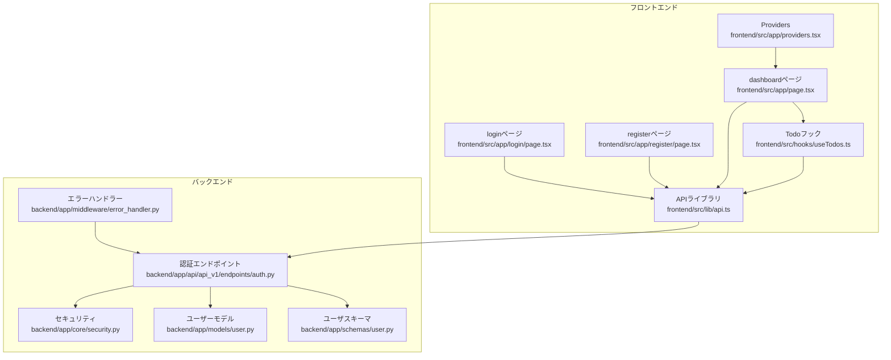
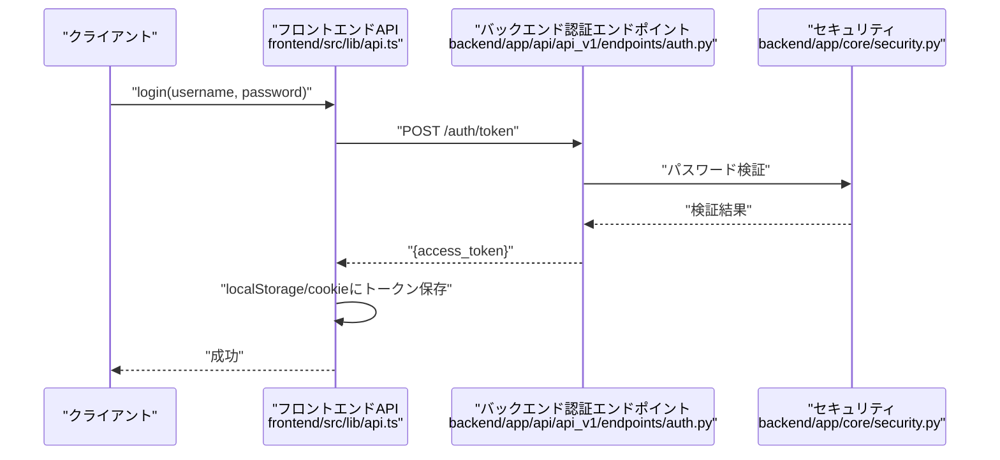
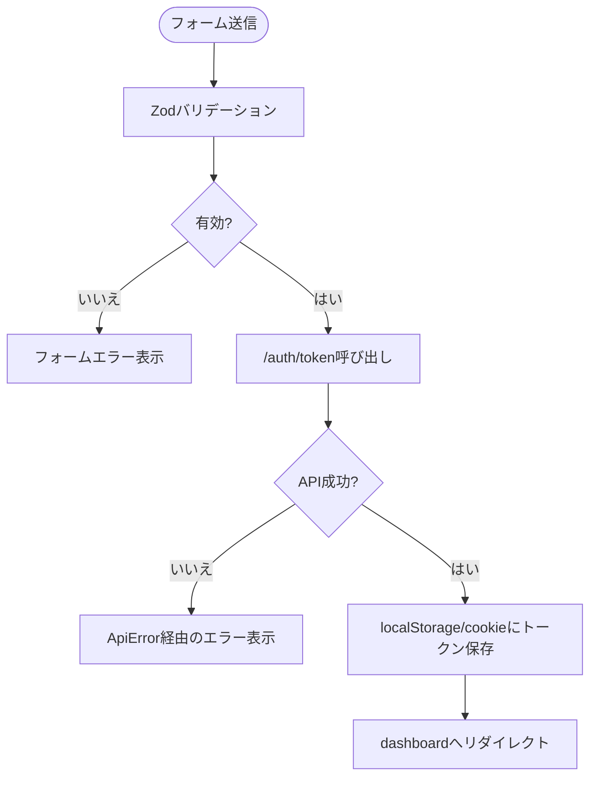
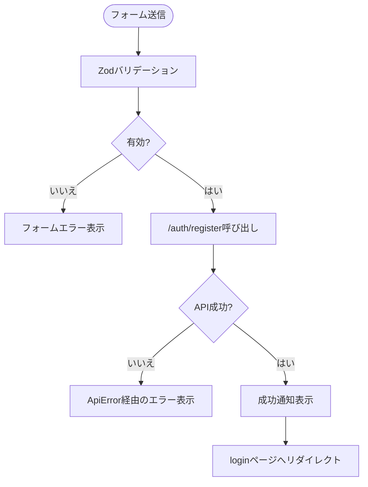
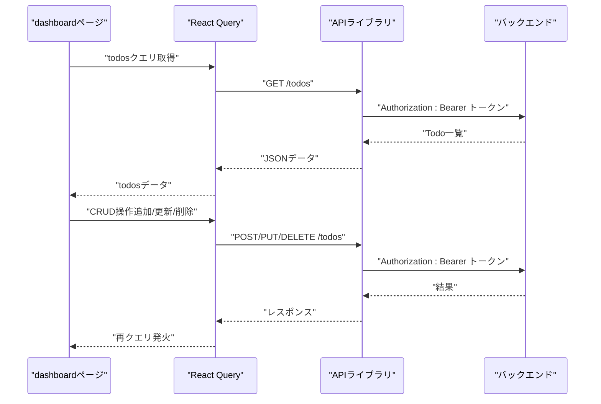
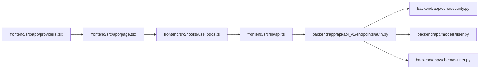

# ページコンポーネント

<cite>
**このドキュメントで参照されているファイル**
- [frontend/src/app/login/page.tsx](file://frontend/src/app/login/page.tsx)
- [frontend/src/app/register/page.tsx](file://frontend/src/app/register/page.tsx)
- [frontend/src/app/page.tsx](file://frontend/src/app/page.tsx)
- [frontend/src/lib/api.ts](file://frontend/src/lib/api.ts)
- [frontend/src/hooks/useTodos.ts](file://frontend/src/hooks/useTodos.ts)
- [frontend/src/app/providers.tsx](file://frontend/src/app/providers.tsx)
- [frontend/src/app/layout.tsx](file://frontend/src/app/layout.tsx)
- [frontend/src/app/_components/TodoFilterPanel.tsx](file://frontend/src/app/_components/TodoFilterPanel.tsx)
- [frontend/src/app/_components/TodoItemList.tsx](file://frontend/src/app/_components/TodoItemList.tsx)
- [backend/app/api/api_v1/endpoints/auth.py](file://backend/app/api/api_v1/endpoints/auth.py)
- [backend/app/core/security.py](file://backend/app/core/security.py)
- [backend/app/middleware/error_handler.py](file://backend/app/middleware/error_handler.py)
- [backend/app/models/user.py](file://backend/app/models/user.py)
- [backend/app/schemas/user.py](file://backend/app/schemas/user.py)
</cite>

## 目次
1. [導入](#導入)
2. [プロジェクト構造](#プロジェクト構造)
3. [コアコンポーネント](#コアコンポーネント)
4. [アーキテクチャ概観](#アーキテクチャ概観)
5. [詳細コンポーネント分析](#詳細コンポーネント分析)
6. [依存関係分析](#依存関係分析)
7. [パフォーマンス考慮事項](#パフォーマンス考慮事項)
8. [トラブルシューティングガイド](#トラブルシューティングガイド)
9. [結論](#結論)

## 導入
本ドキュメントでは、Todoアプリケーションにおける各ページコンポーネントの詳細設計を説明します。特に以下の3つのページについて、コンポーネント構造、フォームバリデーション、認証フローの実装方法を詳しく解説します。また、CSR（クライアントサイドレンダリング）とSSR（サーバーサイドレンダリング）の使い分け、エラーハンドリング、ユーザー入力処理のベストプラクティスについても示します。

- loginページ：認証フォーム、Zodによるバリデーション、エラーハンドリング、トークン保存
- registerページ：新規登録フォーム、Zodによるバリデーション、エラーハンドリング、通知表示
- dashboardページ：Todoリスト表示、フィルタリング・ソート・ページネーション、CRUD操作

## プロジェクト構造
本プロジェクトは、Next.js（frontend）とFastAPI（backend）の2層構造です。認証フローはフロントエンドでOAuth2 Password Flowを用い、JWTトークンをlocalStorageとCookieに保存し、以降のAPIリクエストにAuthorizationヘッダーとして付与します。クエリ管理にはReact Queryを使用し、Todo一覧の取得・更新・削除を非同期で行います。

**図の出典**
- [frontend/src/app/login/page.tsx:1-105](file://frontend/src/app/login/page.tsx#L1-L105)
- [frontend/src/app/register/page.tsx:1-111](file://frontend/src/app/register/page.tsx#L1-L111)
- [frontend/src/app/page.tsx:1-298](file://frontend/src/app/page.tsx#L1-L298)
- [frontend/src/lib/api.ts:1-110](file://frontend/src/lib/api.ts#L1-L110)
- [frontend/src/hooks/useTodos.ts:1-119](file://frontend/src/hooks/useTodos.ts#L1-L119)
- [frontend/src/app/providers.tsx:1-26](file://frontend/src/app/providers.tsx#L1-L26)
- [backend/app/api/api_v1/endpoints/auth.py:1-53](file://backend/app/api/api_v1/endpoints/auth.py#L1-L53)
- [backend/app/core/security.py:1-35](file://backend/app/core/security.py#L1-L35)
- [backend/app/middleware/error_handler.py:1-149](file://backend/app/middleware/error_handler.py#L1-L149)
- [backend/app/models/user.py:1-16](file://backend/app/models/user.py#L1-L16)
- [backend/app/schemas/user.py:1-12](file://backend/app/schemas/user.py#L1-L12)

**節の出典**
- [frontend/src/app/layout.tsx:1-40](file://frontend/src/app/layout.tsx#L1-L40)
- [frontend/src/app/providers.tsx:1-26](file://frontend/src/app/providers.tsx#L1-L26)

## コアコンポーネント
- loginページ：Zodスキーマによる入力バリデーション、react-hook-formによるフォーム管理、ApiErrorを介したエラーハンドリング、JWTアクセストークンの取得と保存、ルーティングによる遷移
- registerページ：同様のバリデーションとエラーハンドリング、登録成功時の通知と遷移
- dashboardページ：Todo一覧の表示・フィルタリング・ソート・ページネーション、CRUD操作、認証エラー時の自動リダイレクト、テーマ切り替え

**節の出典**
- [frontend/src/app/login/page.tsx:15-41](file://frontend/src/app/login/page.tsx#L15-L41)
- [frontend/src/app/register/page.tsx:16-47](file://frontend/src/app/register/page.tsx#L16-L47)
- [frontend/src/app/page.tsx:27-166](file://frontend/src/app/page.tsx#L27-L166)

## アーキテクチャ概観
認証フローは以下の通りです。フロントエンドはOAuth2 Password Flowを用い、username/passwordを送信してアクセストークンを取得します。取得したトークンはlocalStorageとCookieに保存され、以降のAPIリクエストにAuthorizationヘッダーとして付与されます。エラーハンドリングは、フロントエンドのApiErrorクラスとバックエンドの統一エラーレスポンス形式により一貫しています。

**図の出典**
- [frontend/src/lib/api.ts:64-102](file://frontend/src/lib/api.ts#L64-L102)
- [backend/app/api/api_v1/endpoints/auth.py:34-52](file://backend/app/api/api_v1/endpoints/auth.py#L34-L52)
- [backend/app/core/security.py:10-27](file://backend/app/core/security.py#L10-L27)

## 詳細コンポーネント分析

### loginページ（認証フォーム）
- 入力バリデーション：Zodスキーマ（ユーザー名3文字以上、パスワード6文字以上）
- フォーム管理：react-hook-form + zodResolver
- エラーハンドリング：setErrorでフォームレベルエラー表示、ApiError経由の通知
- トークン保存：アクセストークンをlocalStorageとCookieに保存
- 遷移：認証成功後dashboardへリダイレクト

**図の出典**
- [frontend/src/app/login/page.tsx:33-41](file://frontend/src/app/login/page.tsx#L33-L41)
- [frontend/src/lib/api.ts:64-102](file://frontend/src/lib/api.ts#L64-L102)

**節の出典**
- [frontend/src/app/login/page.tsx:15-41](file://frontend/src/app/login/page.tsx#L15-L41)
- [frontend/src/lib/api.ts:64-102](file://frontend/src/lib/api.ts#L64-L102)

### registerページ（新規登録フォーム）
- 入力バリデーション：Zodスキーマ（ユーザー名3文字以上、パスワード6文字以上）
- フォーム管理：react-hook-form + zodResolver
- エラーハンドリング：setErrorでフォームレベルエラー表示、ApiError経由の通知
- 成功時処理：通知表示、loginページへの遷移

**図の出典**
- [frontend/src/app/register/page.tsx:34-47](file://frontend/src/app/register/page.tsx#L34-L47)
- [frontend/src/lib/api.ts:25-62](file://frontend/src/lib/api.ts#L25-L62)

**節の出典**
- [frontend/src/app/register/page.tsx:16-47](file://frontend/src/app/register/page.tsx#L16-L47)
- [frontend/src/lib/api.ts:25-62](file://frontend/src/lib/api.ts#L25-L62)

### dashboardページ（Todo管理画面）
- 認証エラー時リダイレクト：401エラー時にloginページへリダイレクト
- Todo一覧：React Queryによるクエリ管理、フィルタ・ソート・ページネーション
- CRUD操作：追加・更新（完了状態切替含む）・削除のミューテーション
- UIコンポーネント：TodoFilterPanel、TodoItemList、Pagination、TodoEditDialog
- 通知：sonnerによるトースト通知

**図の出典**
- [frontend/src/app/page.tsx:44-54](file://frontend/src/app/page.tsx#L44-L54)
- [frontend/src/hooks/useTodos.ts:42-108](file://frontend/src/hooks/useTodos.ts#L42-L108)
- [frontend/src/lib/api.ts:25-62](file://frontend/src/lib/api.ts#L25-L62)

**節の出典**
- [frontend/src/app/page.tsx:27-166](file://frontend/src/app/page.tsx#L27-L166)
- [frontend/src/hooks/useTodos.ts:26-118](file://frontend/src/hooks/useTodos.ts#L26-L118)
- [frontend/src/app/_components/TodoFilterPanel.tsx:25-104](file://frontend/src/app/_components/TodoFilterPanel.tsx#L25-L104)
- [frontend/src/app/_components/TodoItemList.tsx:34-181](file://frontend/src/app/_components/TodoItemList.tsx#L34-L181)

### Todoフィルターパネル（TodoFilterPanel）
- 機能：検索、ステータスフィルター、優先度フィルター、並び替え
- 動作：親コンポーネントから渡された関数を通じて状態を変更

**節の出典**
- [frontend/src/app/_components/TodoFilterPanel.tsx:15-104](file://frontend/src/app/_components/TodoFilterPanel.tsx#L15-L104)

### Todoアイテムリスト（TodoItemList）
- 機能：Todo表示、完了状態の切替、編集・削除ボタン、タグクリックでのフィルタリング
- 表示：期限の状態（期限切れ/まもなく期限/期限日）に応じた視覚表現

**節の出典**
- [frontend/src/app/_components/TodoItemList.tsx:19-181](file://frontend/src/app/_components/TodoItemList.tsx#L19-L181)

## 依存関係分析
- 認証フローの依存関係
  - frontend/src/lib/api.ts が backend/app/api/api_v1/endpoints/auth.py に依存
  - backend/app/api/api_v1/endpoints/auth.py が backend/app/core/security.py に依存
  - backend/app/api/api_v1/endpoints/auth.py が backend/app/models/user.py と backend/app/schemas/user.py に依存
- dashboardページの依存関係
  - frontend/src/app/page.tsx が frontend/src/hooks/useTodos.ts に依存
  - frontend/src/hooks/useTodos.ts が frontend/src/lib/api.ts に依存
  - frontend/src/app/providers.tsx が frontend/src/app/page.tsx に依存

**図の出典**
- [frontend/src/lib/api.ts:1-110](file://frontend/src/lib/api.ts#L1-L110)
- [backend/app/api/api_v1/endpoints/auth.py:1-53](file://backend/app/api/api_v1/endpoints/auth.py#L1-L53)
- [backend/app/core/security.py:1-35](file://backend/app/core/security.py#L1-L35)
- [backend/app/models/user.py:1-16](file://backend/app/models/user.py#L1-L16)
- [backend/app/schemas/user.py:1-12](file://backend/app/schemas/user.py#L1-L12)
- [frontend/src/app/page.tsx:1-298](file://frontend/src/app/page.tsx#L1-L298)
- [frontend/src/hooks/useTodos.ts:1-119](file://frontend/src/hooks/useTodos.ts#L1-L119)
- [frontend/src/app/providers.tsx:1-26](file://frontend/src/app/providers.tsx#L1-L26)

**節の出典**
- [frontend/src/app/providers.tsx:8-24](file://frontend/src/app/providers.tsx#L8-L24)

## パフォーマンス考慮事項
- CSRとSSRの使い分け
  - 認証ページ（login/register/dashboard）はクライアントサイドでの認証フローとUI操作が中心であるため、Next.jsのCSR（app router）で実装する方が適しています。初期表示の高速化のためにSSRは必要ありません。
- APIリクエストの最適化
  - React QueryのstaleTime（60秒）により、クエリの再取得頻度を抑制し、ネットワーク負荷を軽減します。
- トークン管理
  - localStorageとCookieの両方にトークンを保存することで、ミドルウェアでの認証確認とクライアント側でのリクエストに備えていますが、セキュリティリスクを考慮した上で適切なSameSiteやHttpOnly設定の検討が必要です。
- 通知とエラーハンドリング
  - sonnerによるトースト通知はUX向上に寄与しますが、エラーメッセージの詳細表示（backendのValidationErrorDetail）も活用することで、ユーザーへのフィードバックを強化できます。

[この節では具体的なファイル分析を行っていません]

## トラブルシューティングガイド
- 認証エラー（401）
  - dashboardページでは、ApiError経由の401エラー時に自動的にloginページへリダイレクトします。エラーハンドリングの仕組みを確認し、必要に応じてエラーメッセージを改善してください。
- APIエラー（4xx/5xx）
  - frontend/src/lib/api.ts でApiErrorをthrowし、backend/app/middleware/error_handler.py で統一エラーレスポンス形式に整形されます。エラーメッセージの日本語化や詳細情報（details）の表示を確認してください。
- トークンの有効期限
  - ACCESS_TOKEN_EXPIRE_MINUTESに基づくトークンの有効期限が設定されています。有効期限切れの場合は再度ログインが必要です。
- 重複したユーザー名
  - backend/app/api/api_v1/endpoints/auth.py で既存ユーザー名のチェックを行い、400エラーを返します。フロントエンドで適切なエラーメッセージを表示してください。

**節の出典**
- [frontend/src/app/page.tsx:49-54](file://frontend/src/app/page.tsx#L49-L54)
- [frontend/src/lib/api.ts:17-23](file://frontend/src/lib/api.ts#L17-L23)
- [backend/app/middleware/error_handler.py:107-122](file://backend/app/middleware/error_handler.py#L107-L122)
- [backend/app/api/api_v1/endpoints/auth.py:25-32](file://backend/app/api/api_v1/endpoints/auth.py#L25-L32)
- [backend/app/core/security.py:17-27](file://backend/app/core/security.py#L17-L27)

## 結論
本ドキュメントでは、loginページ、registerページ、dashboardページのコンポーネント構造、フォームバリデーション、認証フローの実装方法について詳細に説明しました。CSRとSSRの使い分け、エラーハンドリング、ユーザー入力処理のベストプラクティスも示しました。認証フローはJWTを用いたOAuth2 Password Flowであり、フロントエンドではZodによるバリデーション、react-hook-formによるフォーム管理、ApiErrorによるエラーハンドリングが実装されています。dashboardページではReact Queryによるクエリ管理、フィルタリング・ソート・ページネーション、CRUD操作が実装されており、認証エラー時の自動リダイレクト機能も備わっています。今後の改善点として、Cookieのセキュリティ設定、エラーメッセージの多言語対応、認証フローのセキュリティ強化などが挙げられます。