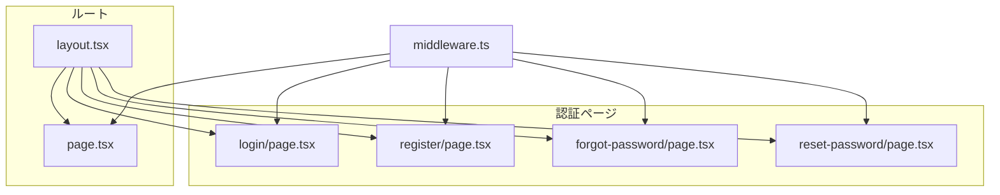
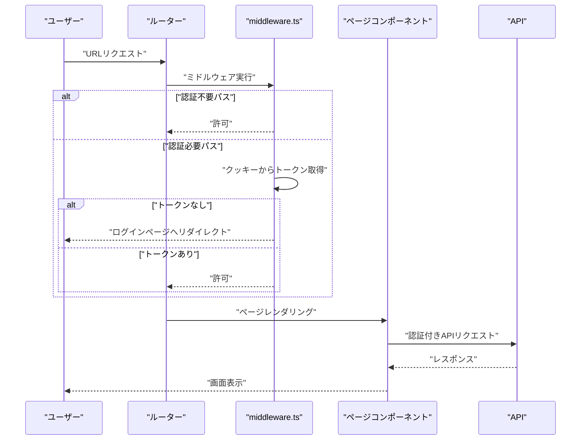
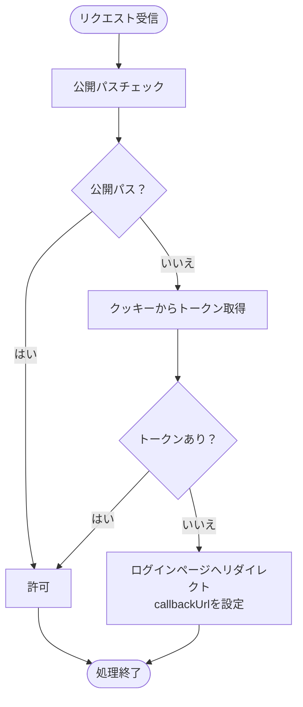
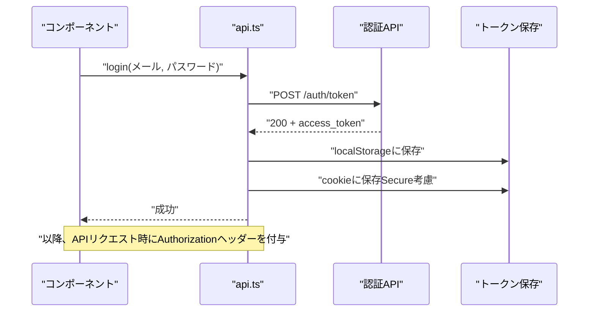
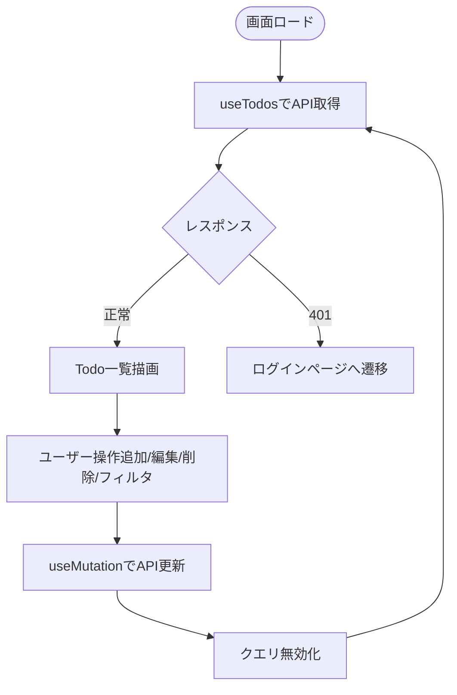
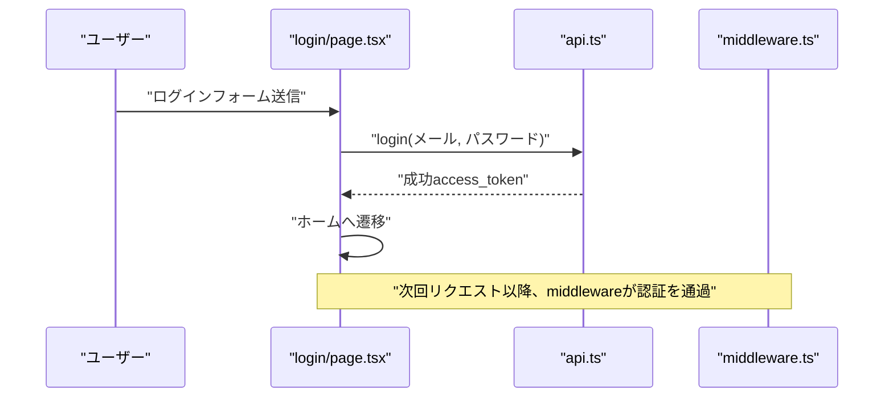
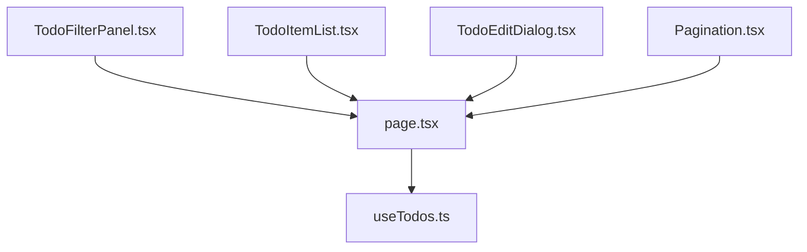
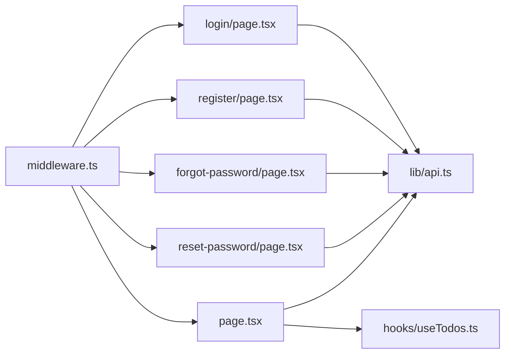

# ルーティングシステム

<cite>
**この文書で参照されるファイル**
- [frontend/src/middleware.ts](file://frontend/src/middleware.ts)
- [frontend/src/app/layout.tsx](file://frontend/src/app/layout.tsx)
- [frontend/src/app/page.tsx](file://frontend/src/app/page.tsx)
- [frontend/src/app/login/page.tsx](file://frontend/src/app/login/page.tsx)
- [frontend/src/app/register/page.tsx](file://frontend/src/app/register/page.tsx)
- [frontend/src/app/forgot-password/page.tsx](file://frontend/src/app/forgot-password/page.tsx)
- [frontend/src/app/reset-password/page.tsx](file://frontend/src/app/reset-password/page.tsx)
- [frontend/src/lib/api.ts](file://frontend/src/lib/api.ts)
- [frontend/src/hooks/useTodos.ts](file://frontend/src/hooks/useTodos.ts)
- [frontend/src/app/_components/TodoFilterPanel.tsx](file://frontend/src/app/_components/TodoFilterPanel.tsx)
- [frontend/src/app/_components/TodoItemList.tsx](file://frontend/src/app/_components/TodoItemList.tsx)
- [frontend/src/app/_components/TodoEditDialog.tsx](file://frontend/src/app/_components/TodoEditDialog.tsx)
- [frontend/src/app/_components/Pagination.tsx](file://frontend/src/app/_components/Pagination.tsx)
- [frontend/next.config.ts](file://frontend/next.config.ts)
</cite>

## 目次
1. [はじめに](#はじめに)
2. [プロジェクト構造](#プロジェクト構造)
3. [コアコンポーネント](#コアコンポーネント)
4. [アーキテクチャ概要](#アーキテクチャ概要)
5. [詳細コンポーネント分析](#詳細コンポーネント分析)
6. [依存関係分析](#依存関係分析)
7. [パフォーマンス考慮事項](#パフォーマンス考慮事項)
8. [トラブルシューティングガイド](#トラブルシューティングガイド)
9. [結論](#結論)
10. [付録](#付録)

## はじめに
本ドキュメントは、Next.js App Routerにおけるルーティングメカニズムについて解説します。特に以下の点に焦点を当てます：
- ページコンポーネントの構成と階層
- middleware.tsによる認証フロー
- ルートグループの使用方法
- ルーティングのパフォーマンス最適化
- 動的ルーティング
- エラーハンドリングの実装方法

また、認証フローの具体的な流れ、APIとの連携、クエリパラメータの扱い、クエリキャッシュの仕組みなどをコードレベルで紐解きます。

## プロジェクト構造
Next.js App Routerでは、pagesではなくappディレクトリ配下にルート階層を定義し、各ディレクトリがURLパスに対応します。認証に関連するページ（ログイン、登録、パスワードリセットなど）はそれぞれ独立したページコンポーネントとして提供されています。共通レイアウトはルートのlayout.tsxで定義され、全ページに適用されます。

**図の出典**
- [frontend/src/app/layout.tsx:1-40](file://frontend/src/app/layout.tsx#L1-L40)
- [frontend/src/middleware.ts:1-35](file://frontend/src/middleware.ts#L1-L35)
- [frontend/src/app/page.tsx:1-298](file://frontend/src/app/page.tsx#L1-L298)
- [frontend/src/app/login/page.tsx:1-111](file://frontend/src/app/login/page.tsx#L1-L111)
- [frontend/src/app/register/page.tsx:1-112](file://frontend/src/app/register/page.tsx#L1-L112)
- [frontend/src/app/forgot-password/page.tsx:1-116](file://frontend/src/app/forgot-password/page.tsx#L1-L116)
- [frontend/src/app/reset-password/page.tsx:1-168](file://frontend/src/app/reset-password/page.tsx#L1-L168)

**節の出典**
- [frontend/src/app/layout.tsx:1-40](file://frontend/src/app/layout.tsx#L1-L40)
- [frontend/src/middleware.ts:1-35](file://frontend/src/middleware.ts#L1-L35)

## コアコンポーネント
- ルートレイアウト：全ページに適用される共通HTML構造、テーマ、Provider、通知コンポーネントを配置。
- 各ページコンポーネント：認証系（login/register/forgot-password/reset-password）とメイン画面（page）。
- 認証フロー：middleware.tsによる認可判定、API経由でのトークン取得・保存、クッキーの設定。
- データ取得：React QueryによるAPI呼び出し、クエリパラメータの決定論的構築、キャッシュ無効化。

**節の出典**
- [frontend/src/app/layout.tsx:1-40](file://frontend/src/app/layout.tsx#L1-L40)
- [frontend/src/app/page.tsx:1-298](file://frontend/src/app/page.tsx#L1-L298)
- [frontend/src/middleware.ts:1-35](file://frontend/src/middleware.ts#L1-L35)
- [frontend/src/lib/api.ts:1-113](file://frontend/src/lib/api.ts#L1-L113)
- [frontend/src/hooks/useTodos.ts:1-119](file://frontend/src/hooks/useTodos.ts#L1-L119)

## アーキテクチャ概要
Next.js App Routerのルーティングは、ディレクトリ構造がURLパスに直接対応するという原則に基づきます。認証が必要なページはmiddleware.tsで保護され、認証されていない場合にログインページへリダイレクトされます。クライアントサイドでは、APIとの連携に加え、クエリパラメータを決定論的に構築することで、クエリキャッシュの効率的な利用が可能になります。

**図の出典**
- [frontend/src/middleware.ts:7-26](file://frontend/src/middleware.ts#L7-L26)
- [frontend/src/lib/api.ts:25-62](file://frontend/src/lib/api.ts#L25-L62)
- [frontend/src/app/login/page.tsx:33-41](file://frontend/src/app/login/page.tsx#L33-L41)

## 詳細コンポーネント分析

### 認証フロー（middleware.ts）
- 公開パス：ログイン、登録、パスワードリセット関連ページは認証なし。
- 認証判定：クッキーからトークンを取得。存在しない場合はログインページへリダイレクトし、元のURLをcallbackUrlとして渡す。
- 実行範囲：matcherにより認証が必要なページのみに適用。

**図の出典**
- [frontend/src/middleware.ts:4-26](file://frontend/src/middleware.ts#L4-L26)

**節の出典**
- [frontend/src/middleware.ts:1-35](file://frontend/src/middleware.ts#L1-L35)

### API連携と認証（lib/api.ts）
- トークンの保存：認証成功後、localStorageにアクセストークンを保存。クッキーにも同値を設定（HTTPS環境ではSecure属性を付与）。
- APIリクエスト：AuthorizationヘッダーにBearerトークンを含めてリクエスト。エラー時はApiErrorをthrowし、UI側でToast表示。
- 認証エラー：401エラー発生時に、ページコンポーネントがログインページへ遷移。

**図の出典**
- [frontend/src/lib/api.ts:64-104](file://frontend/src/lib/api.ts#L64-L104)

**節の出典**
- [frontend/src/lib/api.ts:1-113](file://frontend/src/lib/api.ts#L1-L113)

### メイン画面（page.tsx）とデータフロー
- 認証エラー時のリダイレクト：401エラー発生時にログインページへ遷移。
- Todo一覧：useTodosフックから取得。クエリパラメータを決定論的に構築し、クエリキーを統一することでキャッシュ効率化。
- CRUD操作：追加・更新・削除後にクエリを無効化し、自動再取得。

**図の出典**
- [frontend/src/app/page.tsx:44-54](file://frontend/src/app/page.tsx#L44-L54)
- [frontend/src/hooks/useTodos.ts:26-50](file://frontend/src/hooks/useTodos.ts#L26-L50)

**節の出典**
- [frontend/src/app/page.tsx:1-298](file://frontend/src/app/page.tsx#L1-L298)
- [frontend/src/hooks/useTodos.ts:1-119](file://frontend/src/hooks/useTodos.ts#L1-L119)

### 認証系ページ（login/register/forgot-password/reset-password）
- login：Zodによるバリデーション、認証API呼び出し、成功後にホームへ遷移。
- register：登録API呼び出し、成功後ログインへ遷移。
- forgot-password：メールアドレスを送信し、リセットリンクの送付を促す。
- reset-password：URLパラメータからトークンを取得し、新パスワードを設定。

**図の出典**
- [frontend/src/app/login/page.tsx:33-41](file://frontend/src/app/login/page.tsx#L33-L41)
- [frontend/src/lib/api.ts:64-104](file://frontend/src/lib/api.ts#L64-L104)

**節の出典**
- [frontend/src/app/login/page.tsx:1-111](file://frontend/src/app/login/page.tsx#L1-L111)
- [frontend/src/app/register/page.tsx:1-112](file://frontend/src/app/register/page.tsx#L1-L112)
- [frontend/src/app/forgot-password/page.tsx:1-116](file://frontend/src/app/forgot-password/page.tsx#L1-L116)
- [frontend/src/app/reset-password/page.tsx:1-168](file://frontend/src/app/reset-password/page.tsx#L1-L168)

### UIコンポーネント群
- TodoFilterPanel：検索・ステータス・優先度・並び替えフィルターを提供。
- TodoItemList：Todoリストの描画、期限状況の可視化、編集・削除ボタン。
- TodoEditDialog：Todo編集ダイアログ。
- Pagination：ページネーションUI。

**図の出典**
- [frontend/src/app/_components/TodoFilterPanel.tsx:1-105](file://frontend/src/app/_components/TodoFilterPanel.tsx#L1-L105)
- [frontend/src/app/_components/TodoItemList.tsx:1-182](file://frontend/src/app/_components/TodoItemList.tsx#L1-L182)
- [frontend/src/app/_components/TodoEditDialog.tsx:1-137](file://frontend/src/app/_components/TodoEditDialog.tsx#L1-L137)
- [frontend/src/app/_components/Pagination.tsx:1-49](file://frontend/src/app/_components/Pagination.tsx#L1-L49)
- [frontend/src/hooks/useTodos.ts:1-119](file://frontend/src/hooks/useTodos.ts#L1-L119)

**節の出典**
- [frontend/src/app/_components/TodoFilterPanel.tsx:1-105](file://frontend/src/app/_components/TodoFilterPanel.tsx#L1-L105)
- [frontend/src/app/_components/TodoItemList.tsx:1-182](file://frontend/src/app/_components/TodoItemList.tsx#L1-L182)
- [frontend/src/app/_components/TodoEditDialog.tsx:1-137](file://frontend/src/app/_components/TodoEditDialog.tsx#L1-L137)
- [frontend/src/app/_components/Pagination.tsx:1-49](file://frontend/src/app/_components/Pagination.tsx#L1-L49)

## 依存関係分析
- middleware.tsは全認証不要ページを定義し、それ以外のリクエストに対して認証判定を行う。
- 各ページコンポーネントはlib/api.tsを介して認証・API連携を行い、認証成功後クッキー/ローカルストレージにトークンを保存。
- useTodos.tsはクエリパラメータを決定論的に構築し、クエリキーを統一することで、React Queryのキャッシュ効率を高める。

**図の出典**
- [frontend/src/middleware.ts:1-35](file://frontend/src/middleware.ts#L1-L35)
- [frontend/src/app/login/page.tsx:1-111](file://frontend/src/app/login/page.tsx#L1-L111)
- [frontend/src/app/register/page.tsx:1-112](file://frontend/src/app/register/page.tsx#L1-L112)
- [frontend/src/app/forgot-password/page.tsx:1-116](file://frontend/src/app/forgot-password/page.tsx#L1-L116)
- [frontend/src/app/reset-password/page.tsx:1-168](file://frontend/src/app/reset-password/page.tsx#L1-L168)
- [frontend/src/app/page.tsx:1-298](file://frontend/src/app/page.tsx#L1-L298)
- [frontend/src/lib/api.ts:1-113](file://frontend/src/lib/api.ts#L1-L113)
- [frontend/src/hooks/useTodos.ts:1-119](file://frontend/src/hooks/useTodos.ts#L1-L119)

**節の出典**
- [frontend/src/middleware.ts:1-35](file://frontend/src/middleware.ts#L1-L35)
- [frontend/src/lib/api.ts:1-113](file://frontend/src/lib/api.ts#L1-L113)
- [frontend/src/hooks/useTodos.ts:1-119](file://frontend/src/hooks/useTodos.ts#L1-L119)

## パフォーマンス考慮事項
- クエリパラメータの決定論的構築：URLSearchParamsにエントリーを順序通りに追加することで、同じ条件のクエリが常に同じクエリキーになるため、React Queryのキャッシュヒット率が向上します。
- クエリの無効化：CRUD操作後にクエリを無効化することで、即座に最新データを取得し、不要な再取得を防ぎます。
- middlewareのmatcher：認証が必要なページのみに適用することで、不要な処理を省き、ミドルウェアのオーバーヘッドを削減できます。
- トークンの保存場所：クッキーとlocalStorageの両方に保存することで、サーバーサイドレンダリング時とクライアントサイドでの認証判定を両立しています。

**節の出典**
- [frontend/src/hooks/useTodos.ts:29-40](file://frontend/src/hooks/useTodos.ts#L29-L40)
- [frontend/src/lib/api.ts:97-101](file://frontend/src/lib/api.ts#L97-L101)
- [frontend/src/middleware.ts:28-34](file://frontend/src/middleware.ts#L28-L34)

## トラブルシューティングガイド
- 401エラー発生時：ページコンポーネントがログインページへ遷移するよう実装されています。APIからのエラーレスポンスを確認し、再度認証を試みてください。
- トークンが無効：クッキー/ローカルストレージのトークンをクリアし、再ログインしてください。
- APIエラー：lib/api.tsのエラーハンドリングにより、詳細なエラーメッセージがToastで表示されます。エラーレスポンスの内容を確認し、適切な修正を行ってください。
- 認証フローの確認：middleware.tsのmatcherと公開パスの設定を確認し、意図しないリダイレクトや許可が行われていないか確認してください。

**節の出典**
- [frontend/src/app/page.tsx:49-54](file://frontend/src/app/page.tsx#L49-L54)
- [frontend/src/lib/api.ts:39-59](file://frontend/src/lib/api.ts#L39-L59)
- [frontend/src/middleware.ts:4-26](file://frontend/src/middleware.ts#L4-L26)

## 結論
本プロジェクトでは、Next.js App Routerのルーティングメカニズムを活用し、認証フローをmiddleware.tsで一元管理し、各ページコンポーネントでAPI連携とUIロジックを分離しています。クエリパラメータの決定論的構築とReact Queryのクエリ無効化により、パフォーマンスとユーザーエクスペリエンスを両立しています。認証不要なページの定義とmatcherの設定により、不要な処理を排除し、保守性も向上しています。

## 付録
- 動的ルーティング：本プロジェクトではApp Routerのディレクトリ構造がURLパスに対応しており、動的パラメータは使用されていません。必要に応じて、[...slug]/route.tsのような動的ルーティングを導入できます。
- 設定ファイル：next.config.tsには追加の設定は記述されていません。

**節の出典**
- [frontend/next.config.ts:1-8](file://frontend/next.config.ts#L1-L8)