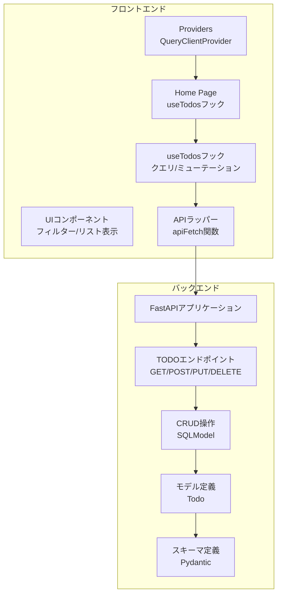
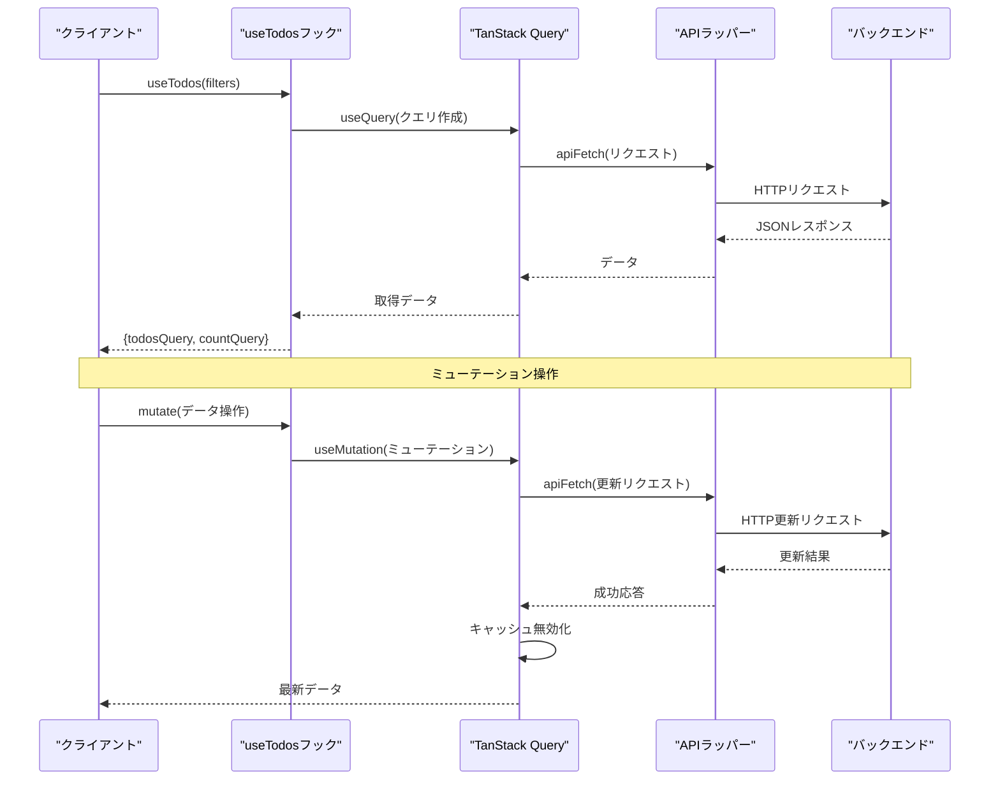
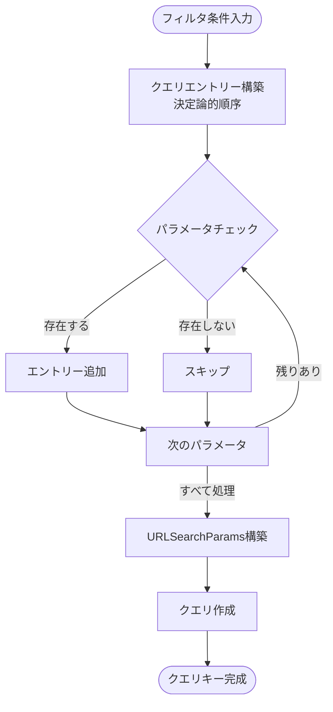
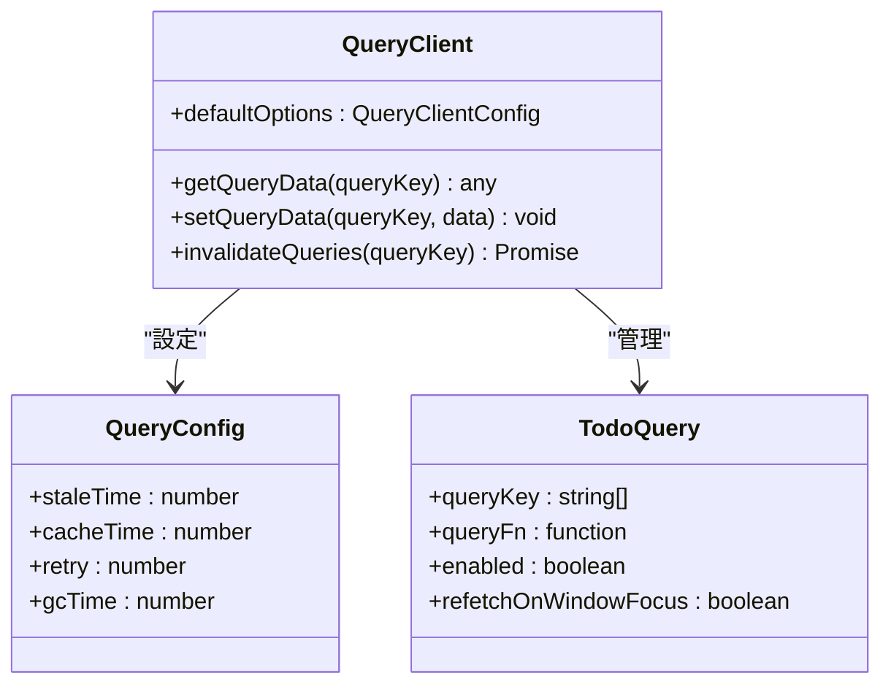
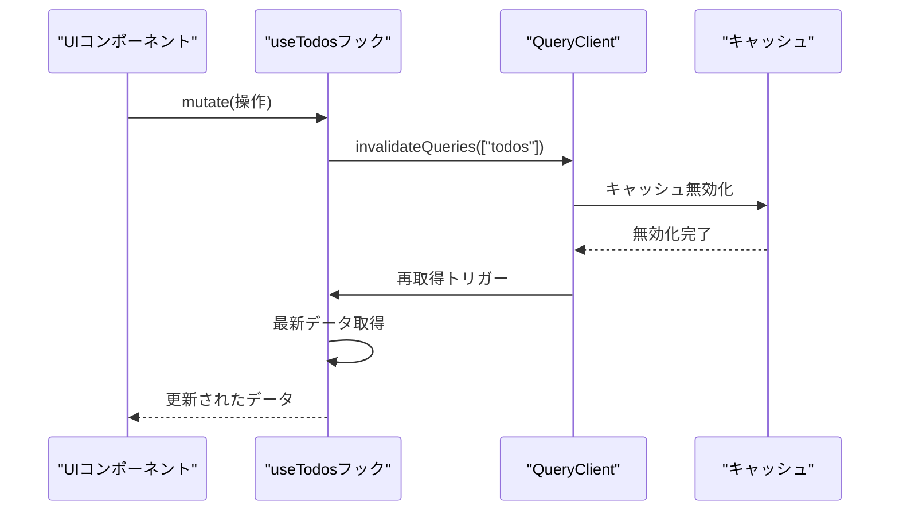
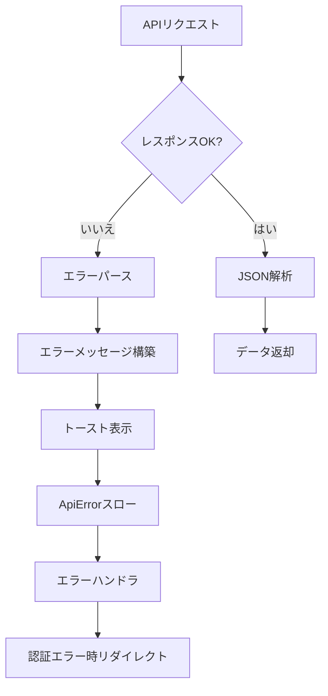
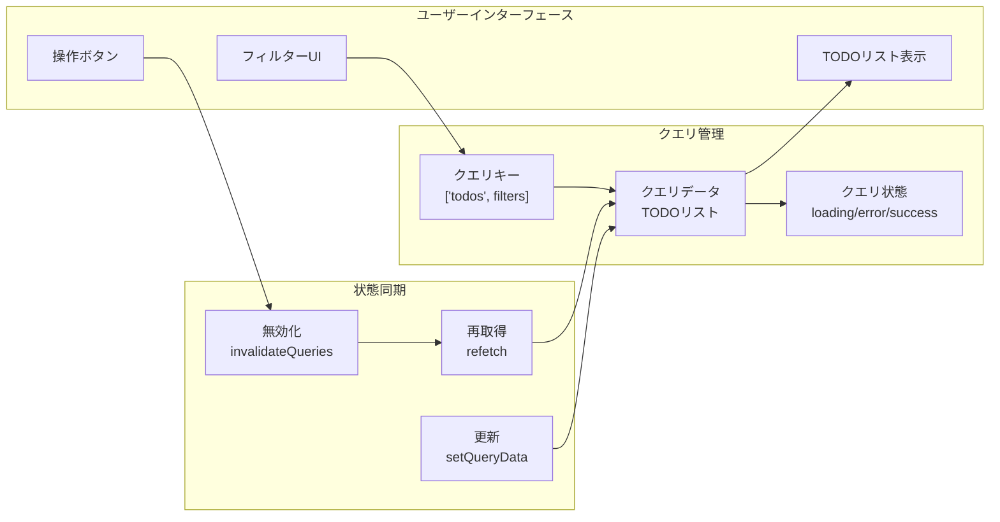
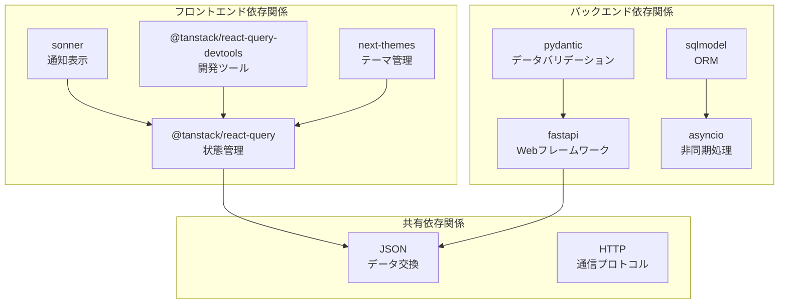

# 状態管理

<cite>
**この文書で参照されるファイル**
- [frontend/src/hooks/useTodos.ts](file://frontend/src/hooks/useTodos.ts)
- [frontend/src/app/providers.tsx](file://frontend/src/app/providers.tsx)
- [frontend/src/app/page.tsx](file://frontend/src/app/page.tsx)
- [frontend/src/lib/api.ts](file://frontend/src/lib/api.ts)
- [frontend/src/app/_components/TodoFilterPanel.tsx](file://frontend/src/app/_components/TodoFilterPanel.tsx)
- [frontend/src/app/_components/TodoItemList.tsx](file://frontend/src/app/_components/TodoItemList.tsx)
- [backend/app/api/api_v1/endpoints/todos.py](file://backend/app/api/api_v1/endpoints/todos.py)
- [backend/app/crud/crud_todo.py](file://backend/app/crud/crud_todo.py)
- [backend/app/models/todo.py](file://backend/app/models/todo.py)
- [backend/app/schemas/todo.py](file://backend/app/schemas/todo.py)
- [frontend/package.json](file://frontend/package.json)
- [backend/pyproject.toml](file://backend/pyproject.toml)
</cite>

## 目次
1. [導入](#導入)
2. [プロジェクト構造](#プロジェクト構造)
3. [コアコンポーネント](#コアコンポーネント)
4. [アーキテクチャ概観](#アーキテクチャ概観)
5. [詳細コンポーネント解析](#詳細コンポーネント解析)
6. [依存関係解析](#依存関係解析)
7. [パフォーマンス考慮事項](#パフォーマンス考慮事項)
8. [トラブルシューティングガイド](#トラブルシューティングガイド)
9. [結論](#結論)

## 導入
本プロジェクトは、TanStack Query（React Query）を活用した現代的な状態管理実装を提供しています。useTodosフックを通じて、クエリのキャッシュ戦略、自動更新機能、エラーハンドリングを統合的に実現し、サーバーサイドでの状態管理とクライアントサイドでの状態同期を効率的に行っています。

## プロジェクト構造
全体のシステムはフロントエンド（Next.js + TanStack Query）とバックエンド（FastAPI + SQLModel）の2層構造です。フロントエンドは状態管理の中心としてuseTodosフックを使用し、バックエンドはRESTful APIを通じてデータを提供します。

**図の出典**
- [frontend/src/app/providers.tsx:1-26](file://frontend/src/app/providers.tsx#L1-L26)
- [frontend/src/hooks/useTodos.ts:1-119](file://frontend/src/hooks/useTodos.ts#L1-L119)
- [backend/app/api/api_v1/endpoints/todos.py:1-102](file://backend/app/api/api_v1/endpoints/todos.py#L1-L102)

**セクションの出典**
- [frontend/src/app/providers.tsx:1-26](file://frontend/src/app/providers.tsx#L1-L26)
- [frontend/src/hooks/useTodos.ts:1-119](file://frontend/src/hooks/useTodos.ts#L1-L119)
- [backend/app/api/api_v1/endpoints/todos.py:1-102](file://backend/app/api/api_v1/endpoints/todos.py#L1-L102)

## コアコンポーネント
useTodosフックは、TODOアプリケーションの状態管理を担う中心的なコンポーネントです。以下の主要な機能を提供します：

### 主要なデータ構造
- Todoインターフェース：id、title、is_completed、priority、due_date、tags、created_at
- TodoFiltersインターフェース：検索、フィルタリング、ソート、ページネーションパラメータ

### クエリ管理
- todosQuery：TODOリストの取得（検索、フィルタリング、ソート、ページネーション対応）
- countQuery：TODO件数の取得（フィルタリング対応）

### ミューテーション操作
- addTodoMutation：TODOの作成
- toggleTodoMutation：TODO完了状態のトグル
- updateTodoMutation：TODOの更新
- deleteTodoMutation：TODOの削除

**セクションの出典**
- [frontend/src/hooks/useTodos.ts:5-24](file://frontend/src/hooks/useTodos.ts#L5-L24)
- [frontend/src/hooks/useTodos.ts:26-118](file://frontend/src/hooks/useTodos.ts#L26-L118)

## アーキテクチャ概観
TanStack Queryのアーキテクチャは、クエリの自動キャッシュ管理、背景での再取得、エラーハンドリングを提供します。フロントエンドのuseTodosフックは、バックエンドのRESTful APIと連携して、リアルタイムな状態管理を実現します。

**図の出典**
- [frontend/src/hooks/useTodos.ts:42-108](file://frontend/src/hooks/useTodos.ts#L42-L108)
- [frontend/src/lib/api.ts:25-62](file://frontend/src/lib/api.ts#L25-L62)

## 詳細コンポーネント解析

### useTodosフックの設計思想
useTodosフックは、以下の設計原則に基づいています：

#### 決定論的クエリキー構築
クエリパラメータを決定論的な順序で構築し、同じフィルタ条件に対して常に同じクエリキーを生成します。これにより、TanStack Queryのキャッシュ効率が向上します。

**図の出典**
- [frontend/src/hooks/useTodos.ts:29-40](file://frontend/src/hooks/useTodos.ts#L29-L40)

#### 一貫したエラーハンドリング
各ミューテーション操作には、共通のエラーハンドリングロジックが実装されており、ユーザーに適切なフィードバックを提供します。

**セクションの出典**
- [frontend/src/hooks/useTodos.ts:26-118](file://frontend/src/hooks/useTodos.ts#L26-L118)

### クエリのキャッシュ戦略
TanStack Queryのデフォルトオプションは、60秒間のstaleTimeを設定しています。これにより、短期間の再表示ではキャッシュからデータを提供し、一定時間後にバックグラウンドで最新データを取得します。

**図の出典**
- [frontend/src/app/providers.tsx:9-15](file://frontend/src/app/providers.tsx#L9-L15)

**セクションの出典**
- [frontend/src/app/providers.tsx:9-15](file://frontend/src/app/providers.tsx#L9-L15)

### 自動更新機能
TODOの作成、更新、削除操作後には、クエリクライアントを使用して関連するクエリを無効化（invalidate）し、自動的に最新データを取得します。

**図の出典**
- [frontend/src/hooks/useTodos.ts:58-108](file://frontend/src/hooks/useTodos.ts#L58-L108)

**セクションの出典**
- [frontend/src/hooks/useTodos.ts:58-108](file://frontend/src/hooks/useTodos.ts#L58-L108)

### エラーハンドリング
APIエラーハンドリングは、ApiErrorクラスを介して実装されており、HTTPステータスコードに応じた適切な処理が行われます。

**図の出典**
- [frontend/src/lib/api.ts:39-59](file://frontend/src/lib/api.ts#L39-L59)

**セクションの出典**
- [frontend/src/lib/api.ts:17-23](file://frontend/src/lib/api.ts#L17-L23)
- [frontend/src/lib/api.ts:39-62](file://frontend/src/lib/api.ts#L39-L62)

### サーバーサイドでの状態管理
バックエンドは、SQLModelを使用してデータベース操作を抽象化し、以下の特徴を持ちます：

#### 検索・フィルタリング機能
- 検索ワードによるタイトル検索
- 完了状態でのフィルタ
- 優先度でのフィルタ
- タグによるフィルタ（カンマ区切り）

#### ソート機能
- created_at（作成日時）でのソート
- priority（優先度）でのソート
- due_date（期限日）でのソート

**セクションの出典**
- [backend/app/crud/crud_todo.py:10-71](file://backend/app/crud/crud_todo.py#L10-L71)
- [backend/app/crud/crud_todo.py:73-98](file://backend/app/crud/crud_todo.py#L73-L98)

### クライアントサイドでの状態同期
クライアントサイドでは、TanStack Queryの自動同期機能により、サーバー側の変更をリアルタイムに反映します。

**図の出典**
- [frontend/src/hooks/useTodos.ts:42-108](file://frontend/src/hooks/useTodos.ts#L42-L108)

**セクションの出典**
- [frontend/src/hooks/useTodos.ts:42-108](file://frontend/src/hooks/useTodos.ts#L42-L108)

## 依存関係解析
フロントエンドとバックエンドの依存関係は以下の通りです：

**図の出典**
- [frontend/package.json:18-35](file://frontend/package.json#L18-L35)
- [backend/pyproject.toml:7-25](file://backend/pyproject.toml#L7-L25)

**セクションの出典**
- [frontend/package.json:18-35](file://frontend/package.json#L18-L35)
- [backend/pyproject.toml:7-25](file://backend/pyproject.toml#L7-L25)

## パフォーマンス考慮事項
TanStack Queryのパフォーマンス特性を活かすための最適化手法：

### キャッシュ戦略の最適化
- **staleTimeの設定**：60秒間のstaleTimeにより、頻繁なリクエストを抑制
- **queryKeyの設計**：フィルタ条件を含むクエリキーにより、適切なキャッシュ分離
- **背景再取得**：ウィンドウフォーカス時の自動再取得

### ミューテーション時のパフォーマンス
- **即時無効化**：成功時にクエリを即座に無効化し、最新データをすぐに取得
- **トランザクショナル更新**：UI更新とAPI呼び出しをトランザクショナルに管理

### データ転送の最適化
- **フィルタリングの前処理**：クライアント側で不要なデータを除外
- **ページネーション**：100件までの制限により、大量データの転送を制御

## トラブルシューティングガイド

### 共通エラーの診断手順
1. **認証エラー（401）**：自動的にログインページにリダイレクト
2. **ネットワークエラー**：APIラッパーのエラーハンドリングでトースト表示
3. **バリデーションエラー**：詳細なエラーメッセージを表示

### 一般的な問題と解決策
- **データが更新されない場合**：queryClient.invalidateQueries()の呼び出しを確認
- **フィルタ機能が動作しない場合**：queryKeyの構築ロジックを確認
- **エラーメッセージが表示されない場合**：ApiErrorクラスの実装を確認

**セクションの出典**
- [frontend/src/app/page.tsx:49-54](file://frontend/src/app/page.tsx#L49-L54)
- [frontend/src/lib/api.ts:39-59](file://frontend/src/lib/api.ts#L39-L59)

## 結論
本プロジェクトは、TanStack Queryを活用した効率的な状態管理実装を提供しています。useTodosフックを通じて、以下の重要な機能を統合的に実現しています：

- **決定論的クエリ管理**：フィルタ条件を含むクエリキーにより、適切なキャッシュ管理
- **自動更新機能**：ミューテーション後の自動再取得により、リアルタイムな状態同期
- **堅牢なエラーハンドリング**：ApiErrorクラスによる一貫したエラーハンドリング
- **パフォーマンス最適化**：staleTime設定と背景再取得による効率的なデータ管理

このアーキテクチャにより、ユーザーはスムーズな操作体験を得られると同時に、開発者は保守性の高いコードを維持することが可能になります。