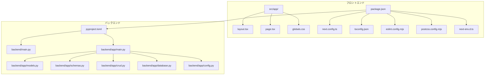
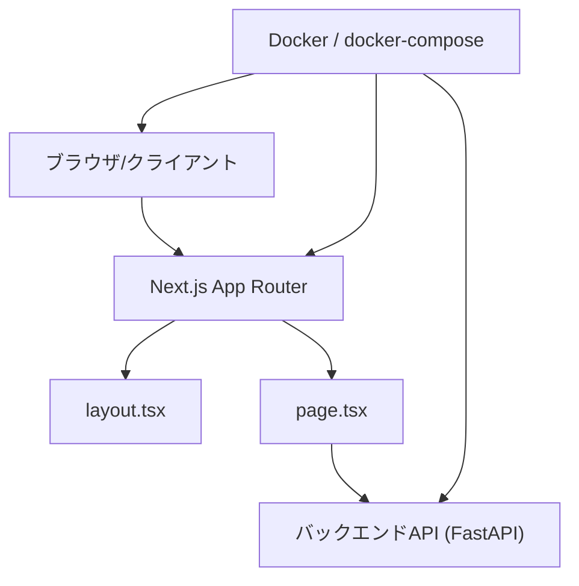
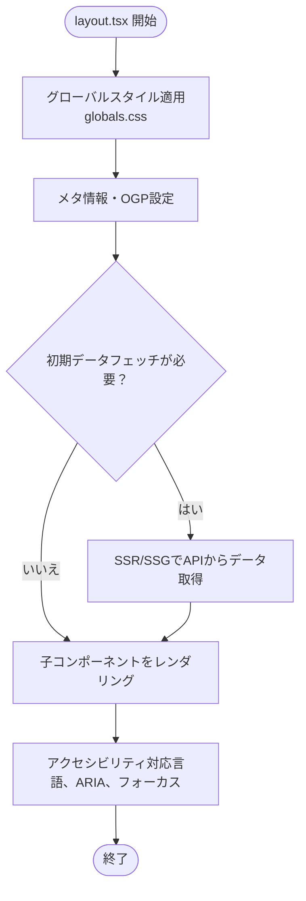
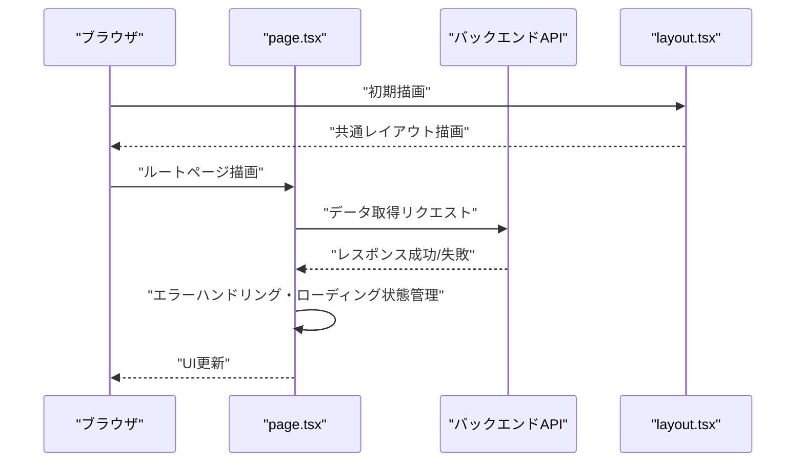
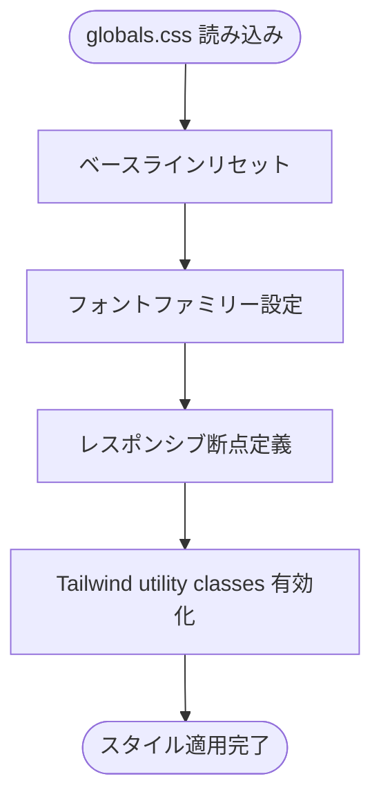
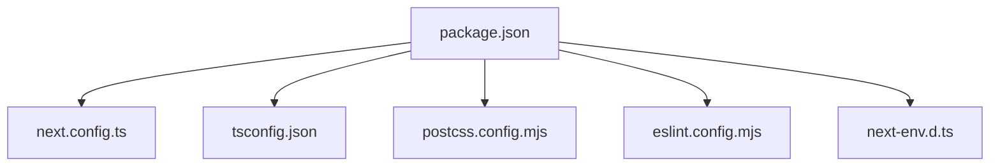
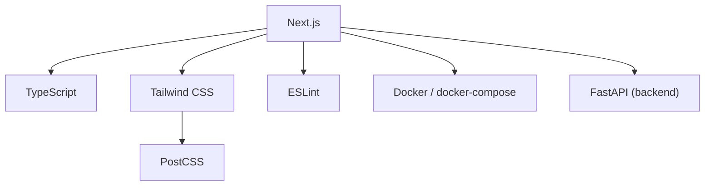

# フロントエンド開発

<cite>
**このドキュメントで参照されるファイル**
- [frontend/src/app/globals.css](file://frontend/src/app/globals.css)
- [frontend/src/app/layout.tsx](file://frontend/src/app/layout.tsx)
- [frontend/src/app/page.tsx](file://frontend/src/app/page.tsx)
- [frontend/package.json](file://frontend/package.json)
- [frontend/tsconfig.json](file://frontend/tsconfig.json)
- [frontend/next.config.ts](file://frontend/next.config.ts)
- [frontend/postcss.config.mjs](file://frontend/postcss.config.mjs)
- [frontend/eslint.config.mjs](file://frontend/eslint.config.mjs)
- [frontend/next-env.d.ts](file://frontend/next-env.d.ts)
- [frontend/README.md](file://frontend/README.md)
- [docker-compose.yml](file://docker-compose.yml)
- [docker/frontend/Dockerfile](file://docker/frontend/Dockerfile)
- [docker/backend/Dockerfile](file://docker/backend/Dockerfile)
- [backend/pyproject.toml](file://backend/pyproject.toml)
- [backend/main.py](file://backend/main.py)
- [backend/app/main.py](file://backend/app/main.py)
- [backend/app/models.py](file://backend/app/models.py)
- [backend/app/schemas.py](file://backend/app/schemas.py)
- [backend/app/crud.py](file://backend/app/crud.py)
- [backend/app/database.py](file://backend/app/database.py)
- [backend/app/config.py](file://backend/app/config.py)
- [.trae/rules/project_rules.md](file://.trae/rules/project_rules.md)
- [docs/current_status.md](file://docs/current_status.md)
</cite>

## 目次
1. [導入](#導入)
2. [プロジェクト構造](#プロジェクト構造)
3. [コアコンポーネント](#コアコンポーネント)
4. [アーキテクチャ概観](#アーキテクチャ概観)
5. [詳細コンポーネント分析](#詳細コンポーネント分析)
6. [依存関係分析](#依存関係分析)
7. [パフォーマンス考慮事項](#パフォーマンス考慮事項)
8. [トラブルシューティングガイド](#トラブルシューティングガイド)
9. [結論](#結論)
10. [付録](#付録)

## 導入
本プロジェクトは、Next.js（App Router）をベースとしたフロントエンド開発環境です。TypeScriptによる型安全なReactコンポーネント設計、Tailwind CSSによるスタイリング、API連携層の実装、グローバルスタイル・レスポンシブデザイン・アクセシビリティの考慮が含まれます。また、開発サーバーの起動方法、ビルドプロセス、デバッグ手法、テスト戦略についても網羅的に説明します。

## プロジェクト構造
フロントエンドはNext.jsのApp Router構成に従い、ルートディレクトリ直下にsrc/app配下にページコンポーネント、グローバルスタイル、共通レイアウトが配置されています。設定系は各設定ファイル（package.json、tsconfig.json、next.config.ts、postcss.config.mjs、eslint.config.mjs、next-env.d.ts）で管理され、Dockerおよびdocker-composeによるコンテナ化が提供されています。

**図の出典**
- [frontend/src/app/layout.tsx](file://frontend/src/app/layout.tsx)
- [frontend/src/app/page.tsx](file://frontend/src/app/page.tsx)
- [frontend/src/app/globals.css](file://frontend/src/app/globals.css)
- [frontend/next.config.ts](file://frontend/next.config.ts)
- [frontend/tsconfig.json](file://frontend/tsconfig.json)
- [frontend/eslint.config.mjs](file://frontend/eslint.config.mjs)
- [frontend/postcss.config.mjs](file://frontend/postcss.config.mjs)
- [frontend/next-env.d.ts](file://frontend/next-env.d.ts)
- [frontend/package.json](file://frontend/package.json)
- [backend/pyproject.toml](file://backend/pyproject.toml)
- [backend/main.py](file://backend/main.py)
- [backend/app/main.py](file://backend/app/main.py)
- [backend/app/models.py](file://backend/app/models.py)
- [backend/app/schemas.py](file://backend/app/schemas.py)
- [backend/app/crud.py](file://backend/app/crud.py)
- [backend/app/database.py](file://backend/app/database.py)
- [backend/app/config.py](file://backend/app/config.py)

**節の出典**
- [frontend/src/app/layout.tsx](file://frontend/src/app/layout.tsx)
- [frontend/src/app/page.tsx](file://frontend/src/app/page.tsx)
- [frontend/src/app/globals.css](file://frontend/src/app/globals.css)
- [frontend/package.json](file://frontend/package.json)
- [frontend/tsconfig.json](file://frontend/tsconfig.json)
- [frontend/next.config.ts](file://frontend/next.config.ts)
- [frontend/postcss.config.mjs](file://frontend/postcss.config.mjs)
- [frontend/eslint.config.mjs](file://frontend/eslint.config.mjs)
- [frontend/next-env.d.ts](file://frontend/next-env.d.ts)

## コアコンポーネント
- 共通レイアウト：アプリケーション全体の外枠、ヘッダー、ナビゲーション、グローバルスタイル適用、メタ情報などを定義します。
- ルートページ：トップレベルの表示コンポーネントで、必要に応じてデータフェッチ、状態管理、子コンポーネントの配置を行います。
- グローバルスタイル：Tailwind CSSのグローバルクラス、フォント、ベースラインスタイル、レスポンシブ断点を統一的に管理します。

これらのコンポーネントは、Next.jsのApp Routerにおけるルーティングとレンダリングの起点であり、TypeScriptの型定義により安全な開発が可能になります。

**節の出典**
- [frontend/src/app/layout.tsx](file://frontend/src/app/layout.tsx)
- [frontend/src/app/page.tsx](file://frontend/src/app/page.tsx)
- [frontend/src/app/globals.css](file://frontend/src/app/globals.css)

## アーキテクチャ概観
フロントエンドはNext.jsのApp Routerを活用し、pagesではなくappディレクトリにコンポーネントを配置します。設定はpackage.jsonの依存関係、tsconfig.jsonのTypeScript設定、next.config.tsのNext.js設定、postcss.config.mjsのPostCSS/Tailwind設定、eslint.config.mjsのESLint設定、next-env.d.tsの環境変数型定義で管理されます。Dockerおよびdocker-composeにより、開発・本番環境での起動とビルドが標準化されています。バックエンドはPython（FastAPI）でREST APIを提供しており、フロントエンドからHTTPリクエストで連携します。

**図の出典**
- [frontend/src/app/layout.tsx](file://frontend/src/app/layout.tsx)
- [frontend/src/app/page.tsx](file://frontend/src/app/page.tsx)
- [backend/app/main.py](file://backend/app/main.py)
- [docker-compose.yml](file://docker-compose.yml)

**節の出典**
- [frontend/package.json](file://frontend/package.json)
- [frontend/next.config.ts](file://frontend/next.config.ts)
- [frontend/postcss.config.mjs](file://frontend/postcss.config.mjs)
- [frontend/eslint.config.mjs](file://frontend/eslint.config.mjs)
- [frontend/next-env.d.ts](file://frontend/next-env.d.ts)
- [docker-compose.yml](file://docker-compose.yml)
- [backend/app/main.py](file://backend/app/main.py)

## 詳細コンポーネント分析

### 共通レイアウト（layout.tsx）
- 機能：アプリケーション全体の外枠、グローバルスタイル適用、メタ情報、OGP、テーマ設定、アクセシビリティ属性（例：lang、aria-*）などを設定します。
- 型定義：Next.jsのPagePropsやReactのprops型を適切に使用し、コンポーネントの入出力が型安全になるようにします。
- Tailwind CSS：グローバルクラス（例：font-sans、text-base、bg-whiteなど）を適用し、レスポンシブ断点（sm/md/lg/xl/2xl）を統一的に利用します。
- API連携：必要に応じて初期データフェッチ（SSR/SSG）を行うことで、初期表示のパフォーマンスを向上させます。
- アクセシビリティ：言語属性、視覚障害者向けの代替テキスト、フォーカス管理、ARIA属性の適切な使用を意識します。

**図の出典**
- [frontend/src/app/layout.tsx](file://frontend/src/app/layout.tsx)
- [frontend/src/app/globals.css](file://frontend/src/app/globals.css)

**節の出典**
- [frontend/src/app/layout.tsx](file://frontend/src/app/layout.tsx)
- [frontend/src/app/globals.css](file://frontend/src/app/globals.css)

### ルートページ（page.tsx）
- 機能：トップレベルの表示コンポーネント。必要に応じてデータフェッチ、ローカル状態管理、子コンポーネントの配置、イベントハンドリングを行います。
- 型定義：props、state、APIレスポンス型を明確に定義し、型安全なコンポーネント設計を維持します。
- Tailwind CSS：レスポンシブデザイン（flex/grid/padding/margin）を活用し、モバイルファーストの設計を実現します。
- API連携：クライアントサイドでのfetchまたはSWRなどのデータ取得ライブラリを使用し、エラーハンドリング、ローディング状態、再試行機構を備えます。
- アクセシビリティ：ボタン、リンク、フォーム要素に対して適切なrole、aria-*属性、keyboard操作を考慮します。

**図の出典**
- [frontend/src/app/page.tsx](file://frontend/src/app/page.tsx)
- [backend/app/main.py](file://backend/app/main.py)
- [frontend/src/app/layout.tsx](file://frontend/src/app/layout.tsx)

**節の出典**
- [frontend/src/app/page.tsx](file://frontend/src/app/page.tsx)
- [backend/app/main.py](file://backend/app/main.py)

### グローバルスタイル（globals.css）
- 機能：Tailwind CSSのグローバルクラス、フォントファミリー、ベースラインスタイル、レスポンシブ断点を定義します。
- レスポンシブデザイン：sm/md/lg/xl/2xlの断点を活用し、モバイルファーストの設計を実現します。
- スタイリング戦略：utility-first（Tailwind）とCSSカスタムプロパティ（必要に応じて）を組み合わせ、一貫性のあるUIを維持します。

**図の出典**
- [frontend/src/app/globals.css](file://frontend/src/app/globals.css)

**節の出典**
- [frontend/src/app/globals.css](file://frontend/src/app/globals.css)

### 設定ファイル（package.json、tsconfig.json、next.config.ts、postcss.config.mjs、eslint.config.mjs、next-env.d.ts）
- package.json：依存関係、スクリプト（dev/build/start/analyze）、Next.js関連の設定（env、experimentalなど）を管理します。
- tsconfig.json：TypeScriptのコンパイルオプション（target、module、jsx、strict、esModuleInteropなど）を定義します。
- next.config.ts：Next.jsの拡張設定（experimental features、webpack設定、画像最適化、swcMinifyなど）を記述します。
- postcss.config.mjs：PostCSSとTailwind CSSの連携、プラグイン（autoprefixer、tailwindcss）を設定します。
- eslint.config.mjs：ESLintのルール（react、react-hooks、import、typescript、tailwindなど）を定義します。
- next-env.d.ts：Next.jsの環境変数型定義（NEXT_PUBLIC_*）を提供します。

**図の出典**
- [frontend/package.json](file://frontend/package.json)
- [frontend/tsconfig.json](file://frontend/tsconfig.json)
- [frontend/next.config.ts](file://frontend/next.config.ts)
- [frontend/postcss.config.mjs](file://frontend/postcss.config.mjs)
- [frontend/eslint.config.mjs](file://frontend/eslint.config.mjs)
- [frontend/next-env.d.ts](file://frontend/next-env.d.ts)

**節の出典**
- [frontend/package.json](file://frontend/package.json)
- [frontend/tsconfig.json](file://frontend/tsconfig.json)
- [frontend/next.config.ts](file://frontend/next.config.ts)
- [frontend/postcss.config.mjs](file://frontend/postcss.config.mjs)
- [frontend/eslint.config.mjs](file://frontend/eslint.config.mjs)
- [frontend/next-env.d.ts](file://frontend/next-env.d.ts)

## 依存関係分析
- Next.js（App Router）：ルーティング、SSR/SSG、静的生成、画像最適化、webpack/swcの設定を提供します。
- TypeScript：型定義により、コンポーネント、props、APIレスポンス、環境変数の安全性を高めます。
- Tailwind CSS：utility-firstのスタイリングにより、一貫したUI設計とレスポンシブ対応を実現します。
- PostCSS：autoprefixer、tailwindcss、必要に応じてCSS最適化プラグインを適用します。
- ESLint：React、React Hooks、Import、TypeScript、Tailwind CSSのルールを適用し、コード品質を保ちます。
- Docker/docker-compose：開発・本番環境での起動、ビルド、サービス間連携を標準化します。
- FastAPI（バックエンド）：REST APIとしてのデータ提供、認証・バリデーション、DB接続、スキーマ定義（models/schemas/crud/database/config）を提供します。

**図の出典**
- [frontend/package.json](file://frontend/package.json)
- [frontend/tsconfig.json](file://frontend/tsconfig.json)
- [frontend/postcss.config.mjs](file://frontend/postcss.config.mjs)
- [frontend/eslint.config.mjs](file://frontend/eslint.config.mjs)
- [docker-compose.yml](file://docker-compose.yml)
- [backend/pyproject.toml](file://backend/pyproject.toml)
- [backend/app/main.py](file://backend/app/main.py)

**節の出典**
- [frontend/package.json](file://frontend/package.json)
- [frontend/tsconfig.json](file://frontend/tsconfig.json)
- [frontend/postcss.config.mjs](file://frontend/postcss.config.mjs)
- [frontend/eslint.config.mjs](file://frontend/eslint.config.mjs)
- [docker-compose.yml](file://docker-compose.yml)
- [backend/pyproject.toml](file://backend/pyproject.toml)
- [backend/app/main.py](file://backend/app/main.py)

## パフォーマンス考慮事項
- SSR/SSG：初期表示のパフォーマンス向上のために、必要に応じてSSR/SSGを使用し、APIからの初期データを含めます。
- 画像最適化：Next.jsのImageコンポーネントや画像最適化設定を活用し、不要なバンドルサイズを削減します。
- CSS最適化：Tailwind CSSのpurge設定（必要に応じて）により、未使用のCSSを除外します。
- 依存関係の軽量化：不要なパッケージを排除し、最小限の依存関係に保ちます。
- 静的生成：変更が少ないコンテンツについては静的生成（static generation）を活用し、CDNでの配信を検討します。

[この節では具体的なファイル分析を行っていません]

## トラブルシューティングガイド
- TypeScriptエラー：型定義の不足や不一致を確認し、型定義ファイル（next-env.d.ts、各コンポーネントのprops型）を修正します。
- Tailwind CSSのスタイルが反映されない：globals.cssの読み込み順序、tailwind.config.js（存在する場合）の設定、PostCSSのプラグイン設定を確認します。
- ESLintエラー：eslint.config.mjsのルール設定を確認し、React Hooksの使用法やimport順序、TypeScriptの型エラーに対処します。
- API連携エラー：バックエンドのエンドポイント、認証トークン、CORS設定、ネットワークエラーを確認します。
- Docker/Docker Compose：コンテナの起動状況、ポートマッピング、環境変数、ログを確認し、再起動・再ビルドを行います。

**節の出典**
- [frontend/next-env.d.ts](file://frontend/next-env.d.ts)
- [frontend/src/app/globals.css](file://frontend/src/app/globals.css)
- [frontend/eslint.config.mjs](file://frontend/eslint.config.mjs)
- [backend/app/main.py](file://backend/app/main.py)
- [docker-compose.yml](file://docker-compose.yml)

## 結論
本プロジェクトは、Next.jsのApp Router、TypeScript、Tailwind CSS、ESLint、Docker/docker-composeを統合した堅牢なフロントエンド開発環境です。共通レイアウト、ルートページ、グローバルスタイルを通じて、一貫性のあるUIと型安全なコンポーネント設計が実現されています。API連携層はバックエンドFastAPIとの連携を前提としており、開発・本番環境での起動・ビルド・デバッグ・テストが標準化されています。

[この節では具体的なファイル分析を行っていません]

## 付録

### 開発サーバーの起動方法
- npm/yarn/bun等のパッケージマネージャーを使用して、開発サーバーを起動します。package.jsonのscriptsにdevコマンドが定義されているため、それを実行してください。
- Docker環境の場合、docker-compose upを実行し、コンテナ内で開発サーバーを起動します。

**節の出典**
- [frontend/package.json](file://frontend/package.json)
- [docker-compose.yml](file://docker-compose.yml)

### ビルドプロセス
- 開発ビルド：package.jsonのscriptsにdevコマンドが定義されており、Next.jsの開発サーバーが起動します。
- 本番ビルド：package.jsonのscriptsにbuildコマンドが定義されており、Next.jsの静的出力（静的生成）またはSSG/SSRのビルドが実行されます。
- Dockerビルド：docker/frontend/Dockerfileを用いて、コンテナイメージをビルドし、docker-composeで起動します。

**節の出典**
- [frontend/package.json](file://frontend/package.json)
- [docker/frontend/Dockerfile](file://docker/frontend/Dockerfile)
- [docker-compose.yml](file://docker-compose.yml)

### デバッグ手法
- TypeScript：型エラーの修正、型定義の追加（next-env.d.tsなど）。
- Tailwind CSS：スタイルの適用順序、utilityクラスの使用法、レスポンシブ断点の確認。
- ESLint：ルール違反の修正、React Hooksの使用法、import順序の調整。
- API連携：バックエンドエンドポイントの確認、認証トークン、CORS設定、ネットワークエラーの確認。
- Docker：コンテナの起動状況、ポートマッピング、環境変数、ログの確認。

**節の出典**
- [frontend/next-env.d.ts](file://frontend/next-env.d.ts)
- [frontend/src/app/globals.css](file://frontend/src/app/globals.css)
- [frontend/eslint.config.mjs](file://frontend/eslint.config.mjs)
- [backend/app/main.py](file://backend/app/main.py)
- [docker-compose.yml](file://docker-compose.yml)

### テスト戦略
- 単体テスト：Jest/React Testing Library（存在する場合）を使用し、コンポーネント単位のテストを実施します。
- E2Eテスト：Cypress/Selenium（存在する場合）を使用し、エンドツーエンドの動作確認を行います。
- ESLint：ESLintのルールを実行し、コード品質を維持します。
- 型チェック：TypeScriptの型チェックを実行し、型安全性を保ちます。
- Docker：コンテナ内でのテスト実行、CIパイプラインでの自動テストを検討します。

[この節では具体的なファイル分析を行っていません]