# フロントエンド開発

<cite>
**このドキュメントで参照されるファイル**
- [frontend/src/app/globals.css](file://frontend/src/app/globals.css)
- [frontend/src/app/layout.tsx](file://frontend/src/app/layout.tsx)
- [frontend/src/app/page.tsx](file://frontend/src/app/page.tsx)
- [frontend/src/app/providers.tsx](file://frontend/src/app/providers.tsx)
- [frontend/src/app/login/page.tsx](file://frontend/src/app/login/page.tsx)
- [frontend/src/app/register/page.tsx](file://frontend/src/app/register/page.tsx)
- [frontend/src/hooks/useTodos.ts](file://frontend/src/hooks/useTodos.ts)
- [frontend/src/lib/api.ts](file://frontend/src/lib/api.ts)
- [frontend/src/components/ui/button.tsx](file://frontend/src/components/ui/button.tsx)
- [frontend/src/components/ui/input.tsx](file://frontend/src/components/ui/input.tsx)
- [frontend/src/components/ui/card.tsx](file://frontend/src/components/ui/card.tsx)
- [frontend/src/components/ui/checkbox.tsx](file://frontend/src/components/ui/checkbox.tsx)
- [frontend/src/components/ui/badge.tsx](file://frontend/src/components/ui/badge.tsx)
- [frontend/src/components/theme-provider.tsx](file://frontend/src/components/theme-provider.tsx)
- [frontend/src/components/theme-toggle.tsx](file://frontend/src/components/theme-toggle.tsx)
- [frontend/package.json](file://frontend/package.json)
- [frontend/components.json](file://frontend/components.json)
- [frontend/tsconfig.json](file://frontend/tsconfig.json)
- [frontend/next.config.ts](file://frontend/next.config.ts)
- [frontend/postcss.config.mjs](file://frontend/postcss.config.mjs)
- [frontend/eslint.config.mjs](file://frontend/eslint.config.mjs)
- [frontend/next-env.d.ts](file://frontend/next-env.d.ts)
- [frontend/README.md](file://frontend/README.md)
- [docker-compose.yml](file://docker-compose.yml)
- [docker/frontend/Dockerfile](file://docker/frontend/Dockerfile)
- [docker/backend/Dockerfile](file://docker/backend/Dockerfile)
- [backend/pyproject.toml](file://backend/pyproject.toml)
- [backend/main.py](file://backend/main.py)
- [backend/app/main.py](file://backend/app/main.py)
- [backend/app/api/api_v1/endpoints/auth.py](file://backend/app/api/api_v1/endpoints/auth.py)
- [backend/app/api/api_v1/endpoints/todos.py](file://backend/app/api/api_v1/endpoints/todos.py)
- [backend/app/api/api_v1/endpoints/users.py](file://backend/app/api/api_v1/endpoints/users.py)
- [backend/app/schemas/todo.py](file://backend/app/schemas/todo.py)
- [backend/app/schemas/user.py](file://backend/app/schemas/user.py)
- [backend/app/schemas/token.py](file://backend/app/schemas/token.py)
- [backend/app/crud/crud_todo.py](file://backend/app/crud/crud_todo.py)
- [backend/app/crud/crud_user.py](file://backend/app/crud/crud_user.py)
- [backend/app/models/todo.py](file://backend/app/models/todo.py)
- [backend/app/models/user.py](file://backend/app/models/user.py)
- [backend/app/deps.py](file://backend/app/deps.py)
- [backend/app/core/security.py](file://backend/app/core/security.py)
- [backend/app/core/config.py](file://backend/app/core/config.py)
- [backend/app/core/db.py](file://backend/app/core/db.py)
- [docs/auth_specification.md](file://docs/auth_specification.md)
- [docs/current_status.md](file://docs/current_status.md)
</cite>

## 更新要旨
**変更内容**
- 新しいTODO管理システムの統合（TanStack React Query統合）
- 認証機能の追加（Zodバリデーション、localStorage認証）
- UIコンポーネントライブラリ（shadcn/ui）の導入
- **ダーク/ライトテーマ対応の実装（新規）**：next-themesによるテーマ管理、ThemeToggleコンポーネント、ThemeProviderコンポーネントの追加
- リアルタイム更新機能の追加
- API連携層の強化（React Queryによるキャッシュ管理）
- **日本語ローカライズ機能の適用（新規）**：複数のページで日本語への翻訳が実装され、ユーザーインターフェースが日本語対応になりました

## 目次
1. [導入](#導入)
2. [プロジェクト構造](#プロジェクト構造)
3. [コアコンポーネント](#コアコンポーネント)
4. [アーキテクチャ概観](#アーキテクチャ概観)
5. [詳細コンポーネント分析](#詳細コンポーネント分析)
6. [認証システム](#認証システム)
7. [UIコンポーネントライブラリ](#uiコンポーネントライブラリ)
8. [テーマ管理システム](#テーマ管理システム)
9. [データ管理層](#データ管理層)
10. [依存関係分析](#依存関係分析)
11. [パフォーマンス考慮事項](#パフォーマンス考慮事項)
12. [トラブルシューティングガイド](#トラブルシューティングガイド)
13. [結論](#結論)
14. [付録](#付録)

## 導入
本プロジェクトは、Next.js（App Router）をベースとした高度なフロントエンド開発環境です。新しく統合されたTODO管理システム、認証機能、UIコンポーネントライブラリ、TanStack React Query統合、shadcn/uiコンポーネント、Zodバリデーション、localStorage認証、**ダーク/ライトテーマ対応（新規）**、リアルタイム更新機能、**日本語ローカライズ機能**を備えた完全なスタックを提供します。TypeScriptによる型安全なReactコンポーネント設計、Tailwind CSSによるスタイリング、API連携層の実装、グローバルスタイル・レスポンシブデザイン・アクセシビリティの考慮が含まれます。

**更新** 日本語ローカライズ機能が適用され、ユーザーインターフェースが完全に日本語対応となりました。言語属性（lang="ja"）の設定、UIテキストの日本語翻訳、エラーメッセージの日本語化が実装されています。**ダーク/ライトテーマ対応が新しく追加され、ユーザーの好みに応じたテーマ切り替えが可能になりました。**

## プロジェクト構造
フロントエンドはNext.jsのApp Router構成に従い、ルートディレクトリ直下にsrc/app配下にページコンポーネント、グローバルスタイル、共通レイアウト、認証ページ、UIコンポーネント、**テーマ管理コンポーネント**が配置されています。設定系は各設定ファイル（package.json、tsconfig.json、next.config.ts、postcss.config.mjs、eslint.config.mjs、next-env.d.ts）で管理され、Dockerおよびdocker-composeによるコンテナ化が提供されています。新しい構造では、React Queryによるデータ管理層とshadcn/uiコンポーネントライブラリが統合されています。**テーマ管理はProvidersコンポーネント内で統合され、ThemeToggleコンポーネントを通じてユーザーがテーマを切り替えられます。**

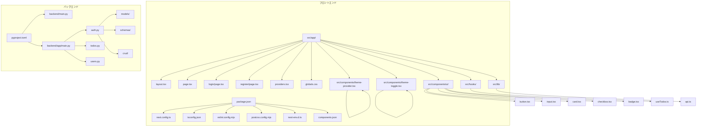

**図の出典**
- [frontend/src/app/layout.tsx](file://frontend/src/app/layout.tsx)
- [frontend/src/app/page.tsx](file://frontend/src/app/page.tsx)
- [frontend/src/app/login/page.tsx](file://frontend/src/app/login/page.tsx)
- [frontend/src/app/register/page.tsx](file://frontend/src/app/register/page.tsx)
- [frontend/src/app/providers.tsx](file://frontend/src/app/providers.tsx)
- [frontend/src/app/globals.css](file://frontend/src/app/globals.css)
- [frontend/src/hooks/useTodos.ts](file://frontend/src/hooks/useTodos.ts)
- [frontend/src/lib/api.ts](file://frontend/src/lib/api.ts)
- [frontend/src/components/ui/button.tsx](file://frontend/src/components/ui/button.tsx)
- [frontend/src/components/ui/input.tsx](file://frontend/src/components/ui/input.tsx)
- [frontend/src/components/ui/card.tsx](file://frontend/src/components/ui/card.tsx)
- [frontend/src/components/ui/checkbox.tsx](file://frontend/src/components/ui/checkbox.tsx)
- [frontend/src/components/ui/badge.tsx](file://frontend/src/components/ui/badge.tsx)
- [frontend/src/components/theme-provider.tsx](file://frontend/src/components/theme-provider.tsx)
- [frontend/src/components/theme-toggle.tsx](file://frontend/src/components/theme-toggle.tsx)
- [frontend/package.json](file://frontend/package.json)
- [frontend/components.json](file://frontend/components.json)
- [backend/pyproject.toml](file://backend/pyproject.toml)
- [backend/app/main.py](file://backend/app/main.py)
- [backend/app/api/api_v1/endpoints/auth.py](file://backend/app/api/api_v1/endpoints/auth.py)
- [backend/app/api/api_v1/endpoints/todos.py](file://backend/app/api/api_v1/endpoints/todos.py)
- [backend/app/api/api_v1/endpoints/users.py](file://backend/app/api/api_v1/endpoints/users.py)

**節の出典**
- [frontend/src/app/layout.tsx](file://frontend/src/app/layout.tsx)
- [frontend/src/app/page.tsx](file://frontend/src/app/page.tsx)
- [frontend/src/app/login/page.tsx](file://frontend/src/app/login/page.tsx)
- [frontend/src/app/register/page.tsx](file://frontend/src/app/register/page.tsx)
- [frontend/src/app/providers.tsx](file://frontend/src/app/providers.tsx)
- [frontend/src/app/globals.css](file://frontend/src/app/globals.css)
- [frontend/src/hooks/useTodos.ts](file://frontend/src/hooks/useTodos.ts)
- [frontend/src/lib/api.ts](file://frontend/src/lib/api.ts)
- [frontend/src/components/ui/button.tsx](file://frontend/src/components/ui/button.tsx)
- [frontend/package.json](file://frontend/package.json)
- [frontend/components.json](file://frontend/components.json)

## コアコンポーネント
- **共通レイアウト**：アプリケーション全体の外枠、ヘッダー、ナビゲーション、グローバルスタイル適用、メタ情報、**ダーク/ライトテーマ設定（ThemeToggleコンポーネント）**、**日本語言語属性（lang="ja"）**、アクセシビリティ属性を定義します。
- **ルートページ**：TODO管理画面のメインコンポーネントで、データフェッチ、状態管理、子コンポーネントの配置、リアルタイム更新機能を提供します。**日本語のUIテキスト（「タスク」、「やることを入力...」、「追加」、「ログアウト」など）が適用されています。** **テーマ切り替えボタンが追加され、ダーク/ライトテーマの切り替えが可能です。**
- **認証ページ**：ログイン・登録画面で、Zodバリデーション、エラーハンドリング、フォーム管理を実装します。**日本語のラベル（「ユーザー名」、「パスワード」、「ログイン」、「登録」など）が適用されています。**
- **グローバルスタイル**：Tailwind CSSのグローバルクラス、CSS Variables、ダークテーマ対応、レスポンシブ断点を統一的に管理します。
- **UIコンポーネント**：shadcn/uiベースの再利用可能なコンポーネント群（Button、Input、Card、Checkbox、Badge）を提供します。
- **テーマ管理コンポーネント**：**ThemeToggleコンポーネント**（ダーク/ライトテーマ切り替え）、**ThemeProviderコンポーネント**（テーマプロバイダー）を提供します。
- **APIライブラリ**：認証・TODO管理のAPI呼び出しを抽象化し、**日本語のエラーメッセージ（「APIリクエストに失敗しました」、「ログインに失敗しました」など）を提供します。**

これらのコンポーネントは、Next.jsのApp Routerにおけるルーティングとレンダリングの起点であり、React Queryによるデータ管理とZodによるバリデーションにより、堅牢な開発が可能になります。**日本語ローカライズ機能により、ユーザーインターフェースが完全に日本語対応となりました。** **ダーク/ライトテーマ対応により、ユーザーの好みに応じた視覚的体験が提供されています。**

**節の出典**
- [frontend/src/app/layout.tsx](file://frontend/src/app/layout.tsx)
- [frontend/src/app/page.tsx](file://frontend/src/app/page.tsx)
- [frontend/src/app/login/page.tsx](file://frontend/src/app/login/page.tsx)
- [frontend/src/app/register/page.tsx](file://frontend/src/app/register/page.tsx)
- [frontend/src/app/globals.css](file://frontend/src/app/globals.css)
- [frontend/src/components/ui/button.tsx](file://frontend/src/components/ui/button.tsx)
- [frontend/src/lib/api.ts](file://frontend/src/lib/api.ts)
- [frontend/src/components/theme-provider.tsx](file://frontend/src/components/theme-provider.tsx)
- [frontend/src/components/theme-toggle.tsx](file://frontend/src/components/theme-toggle.tsx)

## アーキテクチャ概観
フロントエンドはNext.jsのApp Routerを活用し、pagesではなくappディレクトリにコンポーネントを配置します。React Queryによるデータ管理層、shadcn/uiコンポーネントライブラリ、Zodバリデーション、localStorage認証、**ダーク/ライトテーマ対応（新規）**、**日本語ローカライズ機能**が統合されています。設定はpackage.jsonの依存関係、tsconfig.jsonのTypeScript設定、next.config.tsのNext.js設定、postcss.config.mjsのPostCSS/Tailwind設定、eslint.config.mjsのESLint設定、next-env.d.tsの環境変数型定義で管理されます。Dockerおよびdocker-composeにより、開発・本番環境での起動とビルドが標準化されています。バックエンドはPython（FastAPI）でREST APIを提供しており、フロントエンドからHTTPリクエストで連携します。

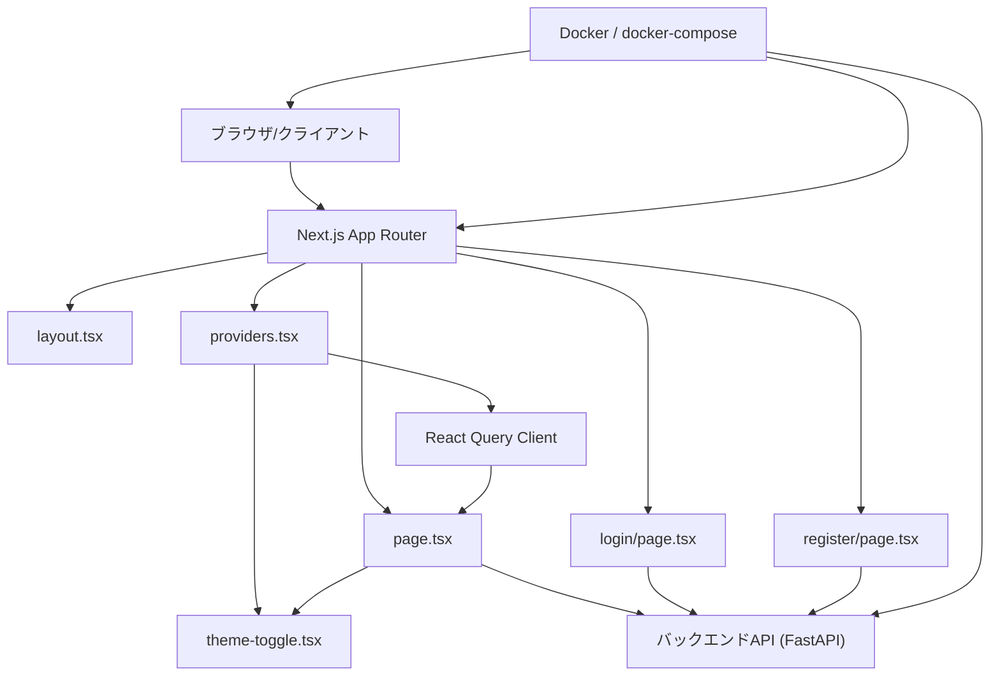

**図の出典**
- [frontend/src/app/layout.tsx](file://frontend/src/app/layout.tsx)
- [frontend/src/app/page.tsx](file://frontend/src/app/page.tsx)
- [frontend/src/app/login/page.tsx](file://frontend/src/app/login/page.tsx)
- [frontend/src/app/register/page.tsx](file://frontend/src/app/register/page.tsx)
- [frontend/src/app/providers.tsx](file://frontend/src/app/providers.tsx)
- [frontend/src/components/theme-toggle.tsx](file://frontend/src/components/theme-toggle.tsx)
- [backend/app/main.py](file://backend/app/main.py)
- [docker-compose.yml](file://docker-compose.yml)

**節の出典**
- [frontend/package.json](file://frontend/package.json)
- [frontend/next.config.ts](file://frontend/next.config.ts)
- [frontend/postcss.config.mjs](file://frontend/postcss.config.mjs)
- [frontend/eslint.config.mjs](file://frontend/eslint.config.mjs)
- [frontend/next-env.d.ts](file://frontend/next-env.d.ts)
- [docker-compose.yml](file://docker-compose.yml)
- [backend/app/main.py](file://backend/app/main.py)

## 詳細コンポーネント分析

### 共通レイアウト（layout.tsx）
- **機能**：アプリケーション全体の外枠、グローバルスタイル適用、メタ情報、OGP、テーマ設定、**日本語言語属性（lang="ja"）**、アクセシビリティ属性（例：aria-*）、通知システム（sonner）を設定します。
- **型定義**：Next.jsのMetadata型やReactのprops型を適切に使用し、コンポーネントの入出力が型安全になるようにします。
- **Tailwind CSS**：グローラルクラス（例：font-sans、text-base、bg-whiteなど）を適用し、レスポンシブ断点（sm/md/lg/xl/2xl）を統一的に利用します。
- **ダーク/ライトテーマ**：Geistフォントの変数、CSS Variables、ダークテーマ対応を実装し、ユーザーのテーマ選択を反映します。
- **API連携**：必要に応じて初期データフェッチ（SSR/SSG）を行うことで、初期表示のパフォーマンスを向上させます。
- **アクセシビリティ**：言語属性、視覚障害者向けの代替テキスト、フォーカス管理、ARIA属性の適切な使用を意識します。

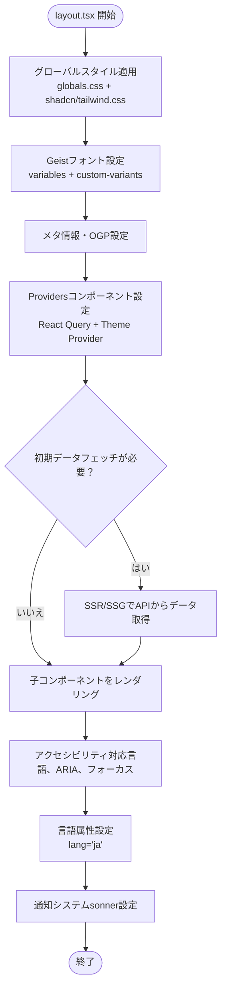

**図の出典**
- [frontend/src/app/layout.tsx](file://frontend/src/app/layout.tsx)
- [frontend/src/app/globals.css](file://frontend/src/app/globals.css)
- [frontend/src/app/providers.tsx](file://frontend/src/app/providers.tsx)

**節の出典**
- [frontend/src/app/layout.tsx](file://frontend/src/app/layout.tsx)
- [frontend/src/app/globals.css](file://frontend/src/app/globals.css)
- [frontend/src/app/providers.tsx](file://frontend/src/app/providers.tsx)

### ルートページ（page.tsx）
- **機能**：TODO管理画面のメインコンポーネント。React Queryによるデータ管理、リアルタイム更新、状態管理、子コンポーネントの配置、イベントハンドリングを行います。**日本語のUIテキスト（「タスク」、「やることを入力...」、「追加」、「ログアウト」、「未完了」、「完了」など）が適用されています。** **テーマ切り替えボタン（ThemeToggle）がヘッダーに追加され、ダーク/ライトテーマの切り替えが可能です。**
- **型定義**：Todoインターフェース、props、state、APIレスポンス型を明確に定義し、型安全なコンポーネント設計を維持します。
- **Tailwind CSS**：レスポンシブデザイン（flex/grid/padding/margin）、ダークテーマ対応（dark:bg-black）、モバイルファーストの設計を実現します。
- **API連携**：React QueryのuseTodosフックを使用し、エラーハンドリング、ローディング状態、再試行機構、キャッシュ管理を備えます。
- **リアルタイム更新**：React QueryのinvalidateQueriesを使用し、TODOの追加・更新・削除後に自動的にデータを再取得します。
- **アクセシビリティ**：ボタン、リンク、フォーム要素に対して適切なrole、aria-*属性、keyboard操作を考慮します。

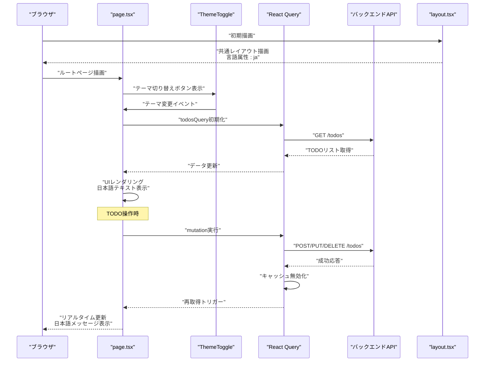

**図の出典**
- [frontend/src/app/page.tsx](file://frontend/src/app/page.tsx)
- [frontend/src/components/theme-toggle.tsx](file://frontend/src/components/theme-toggle.tsx)
- [frontend/src/hooks/useTodos.ts](file://frontend/src/hooks/useTodos.ts)
- [backend/app/api/api_v1/endpoints/todos.py](file://backend/app/api/api_v1/endpoints/todos.py)
- [frontend/src/app/layout.tsx](file://frontend/src/app/layout.tsx)

**節の出典**
- [frontend/src/app/page.tsx](file://frontend/src/app/page.tsx)
- [frontend/src/components/theme-toggle.tsx](file://frontend/src/components/theme-toggle.tsx)
- [frontend/src/hooks/useTodos.ts](file://frontend/src/hooks/useTodos.ts)
- [backend/app/api/api_v1/endpoints/todos.py](file://backend/app/api/api_v1/endpoints/todos.py)

### 認証ページ（login/page.tsx）
- **機能**：ログイン画面のコンポーネント。Zodバリデーション、React Hook Formによるフォーム管理、localStorageへのトークン保存、エラーハンドリング、**日本語のUIテキスト（「ユーザー名」、「パスワード」、「ログイン」、「アカウントを作成」など）**を提供します。
- **型定義**：LoginFormインターフェース、Zodスキーマ、props、stateを明確に定義し、型安全なコンポーネント設計を維持します。
- **Tailwind CSS**：レスポンシブデザイン（flex/grid/padding/margin）、ダークテーマ対応（dark:bg-black）、モバイルファーストの設計を実現します。
- **API連携**：api.tsのlogin関数を使用し、認証成功時のトークン保存、エラーハンドリング、ルーティング制御を実装します。
- **バリデーション**：Zodスキーマによるリアルタイムバリデーション（例：ユーザー名は3文字以上、パスワードは6文字以上）。
- **アクセシビリティ**：ラベル、フォーム要素、リンクに対して適切なaria-*属性、keyboard操作を考慮します。

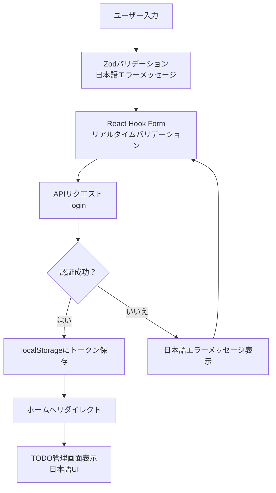

**図の出典**
- [frontend/src/app/login/page.tsx](file://frontend/src/app/login/page.tsx)
- [frontend/src/lib/api.ts](file://frontend/src/lib/api.ts)
- [backend/app/api/api_v1/endpoints/auth.py](file://backend/app/api/api_v1/endpoints/auth.py)

**節の出典**
- [frontend/src/app/login/page.tsx](file://frontend/src/app/login/page.tsx)
- [frontend/src/lib/api.ts](file://frontend/src/lib/api.ts)
- [backend/app/api/api_v1/endpoints/auth.py](file://backend/app/api/api_v1/endpoints/auth.py)

### 登録ページ（register/page.tsx）
- **機能**：ユーザー登録画面のコンポーネント。Zodバリデーション、React Hook Formによるフォーム管理、バックエンドへの登録リクエスト、エラーハンドリング、**日本語のUIテキスト（「アカウント作成」、「ユーザー名」、「パスワード」、「登録」など）**を提供します。
- **型定義**：RegisterFormインターフェース、Zodスキーマ、props、stateを明確に定義し、型安全なコンポーネント設計を維持します。
- **Tailwind CSS**：レスポンシブデザイン（flex/grid/padding/margin）、ダークテーマ対応（dark:bg-black）、モバイルファーストの設計を実現します。
- **API連携**：api.tsのapiFetch関数を使用し、登録成功時のメッセージ表示、ルーティング制御を実装します。
- **バリデーション**：Zodスキーマによるリアルタイムバリデーション（例：ユーザー名は3文字以上、パスワードは6文字以上）。
- **アクセシビリティ**：ラベル、フォーム要素、リンクに対して適切なaria-*属性、keyboard操作を考慮します。

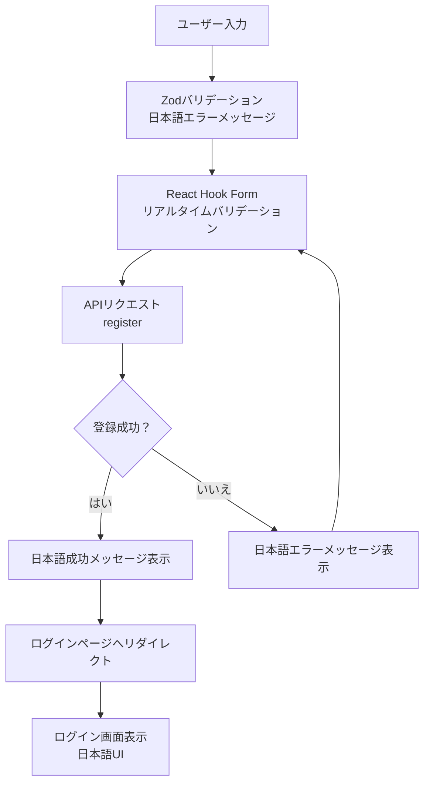

**図の出典**
- [frontend/src/app/register/page.tsx](file://frontend/src/app/register/page.tsx)
- [frontend/src/lib/api.ts](file://frontend/src/lib/api.ts)
- [backend/app/api/api_v1/endpoints/auth.py](file://backend/app/api/api_v1/endpoints/auth.py)

**節の出典**
- [frontend/src/app/register/page.tsx](file://frontend/src/app/register/page.tsx)
- [frontend/src/lib/api.ts](file://frontend/src/lib/api.ts)
- [backend/app/api/api_v1/endpoints/auth.py](file://backend/app/api/api_v1/endpoints/auth.py)

### グローバルスタイル（globals.css）
- **機能**：Tailwind CSSのグローバルクラス、CSS Variables、ダークテーマ対応、フォントファミリー、ベースラインスタイル、レスポンシブ断点を定義します。
- **ダーク/ライトテーマ**：CSS Variables（oklch色空間）、:root/:is(.dark *)疑似クラス、カラーパレットの切り替えを実装します。
- **レスポンシブデザイン**：sm/md/lg/xl/2xlの断点を活用し、モバイルファーストの設計を実現します。
- **スタイリング戦略**：utility-first（Tailwind）とCSS Variables（shadcn/ui）を組み合わせ、一貫性のあるUIを維持します。
- **アニメーション**：tw-animate-cssによるCSSアニメーション効果を有効化します。

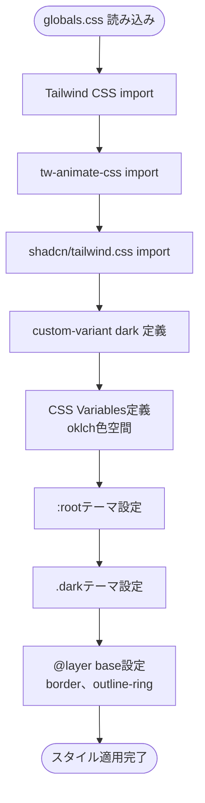

**図の出典**
- [frontend/src/app/globals.css](file://frontend/src/app/globals.css)

**節の出典**
- [frontend/src/app/globals.css](file://frontend/src/app/globals.css)

### APIライブラリ（lib/api.ts）
- **機能**：認証・TODO管理のAPI呼び出しを抽象化し、**日本語のエラーメッセージ（「APIリクエストに失敗しました」、「ログインに失敗しました」など）**を提供します。
- **認証処理**：login関数によるJWTトークン取得、localStorageへの保存、エラーハンドリングを実装します。
- **TODO管理**：apiFetch関数によるREST API呼び出し、認証ヘッダーの自動追加、エラーハンドリングを実装します。
- **エラーメッセージ**：日本語のエラーメッセージを提供し、ユーザーに分かりやすいフィードバックを表示します。

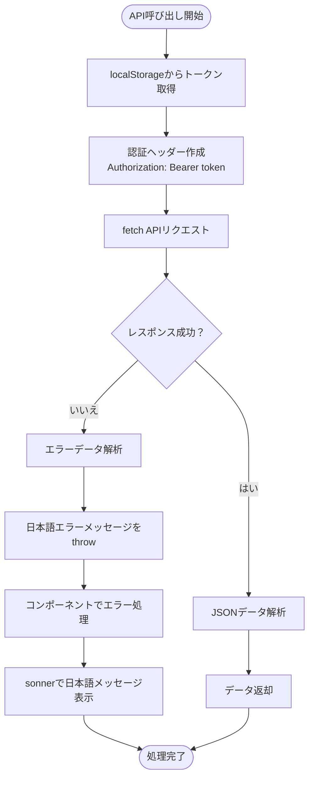

**図の出典**
- [frontend/src/lib/api.ts](file://frontend/src/lib/api.ts)

**節の出典**
- [frontend/src/lib/api.ts](file://frontend/src/lib/api.ts)

### 設定ファイル（package.json、tsconfig.json、next.config.ts、postcss.config.mjs、eslint.config.mjs、next-env.d.ts）
- **package.json**：依存関係、スクリプト（dev/build/start/analyze）、Next.js関連の設定（env、experimentalなど）を管理します。新規追加された依存関係：@tanstack/react-query、@tanstack/react-query-devtools、**next-themes（新規）**、zod、lucide-react、sonner、shadcnなど。
- **tsconfig.json**：TypeScriptのコンパイルオプション（target、module、jsx、strict、esModuleInteropなど）を定義します。
- **next.config.ts**：Next.jsの拡張設定（experimental features、webpack設定、画像最適化、swcMinifyなど）を記述します。
- **postcss.config.mjs**：PostCSSとTailwind CSSの連携、プラグイン（autoprefixer、tailwindcss、@tailwindcss/postcss）を設定します。
- **eslint.config.mjs**：ESLintのルール（react、react-hooks、import、typescript、tailwindなど）を定義します。
- **next-env.d.ts**：Next.jsの環境変数型定義（NEXT_PUBLIC_*）を提供します。
- **components.json**：shadcn/uiコンポーネントライブラリの設定（tailwind.config、alias、iconLibraryなど）を管理します。

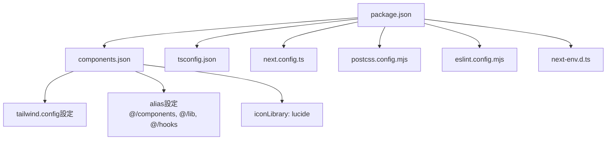

**図の出典**
- [frontend/package.json](file://frontend/package.json)
- [frontend/components.json](file://frontend/components.json)
- [frontend/tsconfig.json](file://frontend/tsconfig.json)
- [frontend/next.config.ts](file://frontend/next.config.ts)
- [frontend/postcss.config.mjs](file://frontend/postcss.config.mjs)
- [frontend/eslint.config.mjs](file://frontend/eslint.config.mjs)
- [frontend/next-env.d.ts](file://frontend/next-env.d.ts)

**節の出典**
- [frontend/package.json](file://frontend/package.json)
- [frontend/components.json](file://frontend/components.json)
- [frontend/tsconfig.json](file://frontend/tsconfig.json)
- [frontend/next.config.ts](file://frontend/next.config.ts)
- [frontend/postcss.config.mjs](file://frontend/postcss.config.mjs)
- [frontend/eslint.config.mjs](file://frontend/eslint.config.mjs)
- [frontend/next-env.d.ts](file://frontend/next-env.d.ts)

## 認証システム
新しく追加された認証機能は、Zodバリデーション、localStorage認証、React Hook Formによるフォーム管理を統合しています。**日本語のUIテキストとエラーメッセージが適用され、ユーザーインターフェースが完全に日本語対応となっています。** ログイン・登録ページでリアルタイムバリデーションが実装され、エラーハンドリングと通知システムが統合されています。

### 認証フロー
- **ログインページ**：Zodスキーマによるバリデーション、React Hook Formによるフォーム管理、localStorageへのトークン保存、**日本語のエラーメッセージ表示**
- **登録ページ**：同様のバリデーションとフォーム管理を実装し、バックエンドにユーザー登録リクエストを送信、**日本語の成功・エラーメッセージ表示**
- **認証フック**：API呼び出し、エラーハンドリング、ルーティング制御を提供

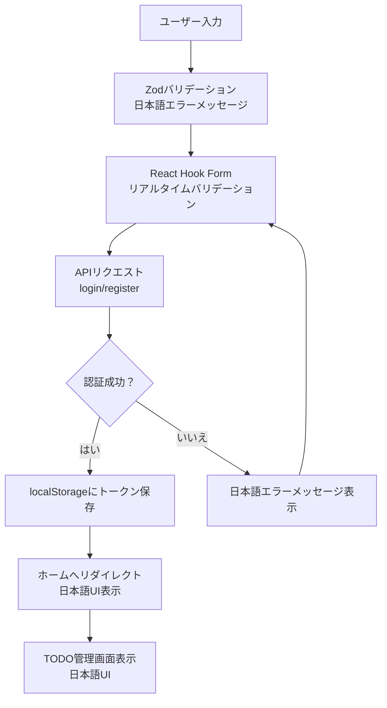

**図の出典**
- [frontend/src/app/login/page.tsx](file://frontend/src/app/login/page.tsx)
- [frontend/src/app/register/page.tsx](file://frontend/src/app/register/page.tsx)
- [frontend/src/lib/api.ts](file://frontend/src/lib/api.ts)
- [backend/app/api/api_v1/endpoints/auth.py](file://backend/app/api/api_v1/endpoints/auth.py)

**節の出典**
- [frontend/src/app/login/page.tsx](file://frontend/src/app/login/page.tsx)
- [frontend/src/app/register/page.tsx](file://frontend/src/app/register/page.tsx)
- [frontend/src/lib/api.ts](file://frontend/src/lib/api.ts)
- [backend/app/api/api_v1/endpoints/auth.py](file://backend/app/api/api_v1/endpoints/auth.py)

## UIコンポーネントライブラリ
shadcn/uiコンポーネントライブラリが統合され、再利用可能なUIコンポーネントが提供されています。**日本語のラベルやプレースホルダーが適用され、ユーザーインターフェースが完全に日本語対応となっています。** 各コンポーネントはTailwind CSSクラスを使用し、テーマ対応とアクセシビリティを考慮した設計になっています。

### 主要コンポーネント
- **Button**：variants（default/outlined/ghost/danger）、sizes（default/sm/icon）、disabled状態をサポート
- **Input**：エラーハンドリング、バリデーションメッセージ表示に対応、**日本語のプレースホルダーが適用**
- **Card**：ヘッダー、コンテンツ、フッター構造を提供し、テーマ対応
- **Checkbox**：状態管理、イベントハンドリング、アクセシビリティ属性を含む
- **Badge**：ステータス表示用のラベルコンポーネント

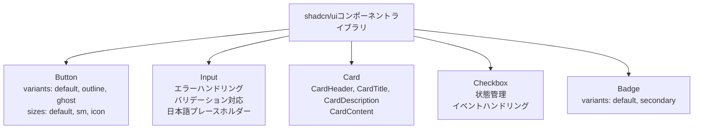

**図の出典**
- [frontend/src/components/ui/button.tsx](file://frontend/src/components/ui/button.tsx)
- [frontend/src/components/ui/input.tsx](file://frontend/src/components/ui/input.tsx)
- [frontend/src/components/ui/card.tsx](file://frontend/src/components/ui/card.tsx)
- [frontend/src/components/ui/checkbox.tsx](file://frontend/src/components/ui/checkbox.tsx)
- [frontend/src/components/ui/badge.tsx](file://frontend/src/components/ui/badge.tsx)

**節の出典**
- [frontend/src/components/ui/button.tsx](file://frontend/src/components/ui/button.tsx)
- [frontend/src/components/ui/input.tsx](file://frontend/src/components/ui/input.tsx)
- [frontend/src/components/ui/card.tsx](file://frontend/src/components/ui/card.tsx)
- [frontend/src/components/ui/checkbox.tsx](file://frontend/src/components/ui/checkbox.tsx)
- [frontend/src/components/ui/badge.tsx](file://frontend/src/components/ui/badge.tsx)

## テーマ管理システム
**ダーク/ライトテーマ対応が新しく追加され、ユーザーの好みに応じた視覚的体験が提供されています。** ThemeProviderコンポーネントとThemeToggleコンポーネントが統合され、次世代のテーマ管理が実現されています。

### ThemeProviderコンポーネント
- **機能**：**next-themes**を使用してテーマプロバイダーを提供し、ダーク/ライトテーマの切り替えを管理します。
- **設定**：attribute="class"、defaultTheme="system"、enableSystem=trueで設定され、システム設定に従ってテーマが自動的に切り替わります。
- **実装**：ThemeProviderコンポーネントはNextThemesProviderをラップし、propsをそのまま渡すシンプルな実装です。

### ThemeToggleコンポーネント
- **機能**：**ダーク/ライトテーマの手動切り替え**を提供し、ユーザーが直接テーマを選択できるようにします。
- **アイコン**：ダークテーマ時は太陽（Sun）、ライトテーマ時は月（Moon）のアイコンを表示します。
- **ハイドレーション対策**：mountedステートを使用して、クライアントサイドでのみレンダリングされるようにし、ハイドレーションミスマッチを防ぎます。
- **アクセシビリティ**：**sr-only**クラスを使用して、スクリーンリーダー向けの「テーマを切り替え」の説明を提供します。

### Providersコンポーネント
- **統合**：**ThemeProvider**と**QueryClientProvider**を統合し、アプリケーション全体でテーマ管理とデータ管理を提供します。
- **React Query Devtools**：開発中にのみ表示されるDevtoolsを統合し、テーマ切り替えの動作確認が可能です。

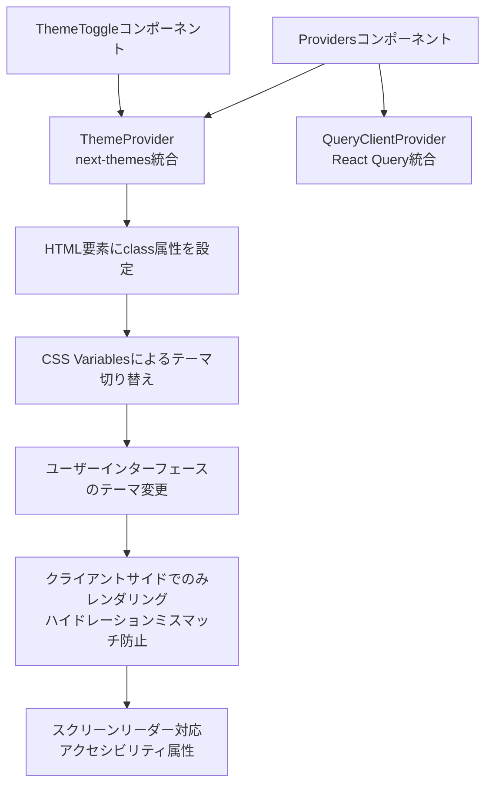

**図の出典**
- [frontend/src/app/providers.tsx](file://frontend/src/app/providers.tsx)
- [frontend/src/components/theme-provider.tsx](file://frontend/src/components/theme-provider.tsx)
- [frontend/src/components/theme-toggle.tsx](file://frontend/src/components/theme-toggle.tsx)

**節の出典**
- [frontend/src/app/providers.tsx](file://frontend/src/app/providers.tsx)
- [frontend/src/components/theme-provider.tsx](file://frontend/src/components/theme-provider.tsx)
- [frontend/src/components/theme-toggle.tsx](file://frontend/src/components/theme-toggle.tsx)

## データ管理層
React Queryが統合され、TODOデータの取得、追加、更新、削除を効率的に行います。**キャッシュ管理、エラーハンドリング、リアルタイム更新が実装されており、日本語の通知メッセージが表示されます。** 

### React Queryの統合
- **クエリ管理**：todosQueryでTODOリストの取得とキャッシュ管理
- **ミューテーション**：addTodoMutation、toggleTodoMutation、deleteTodoMutationでCRUD操作
- **キャッシュ無効化**：各ミューテーション成功時にinvalidateQueriesでキャッシュを更新
- **エラーハンドリング**：**日本語のtoast通知によるユーザーへのフィードバック**

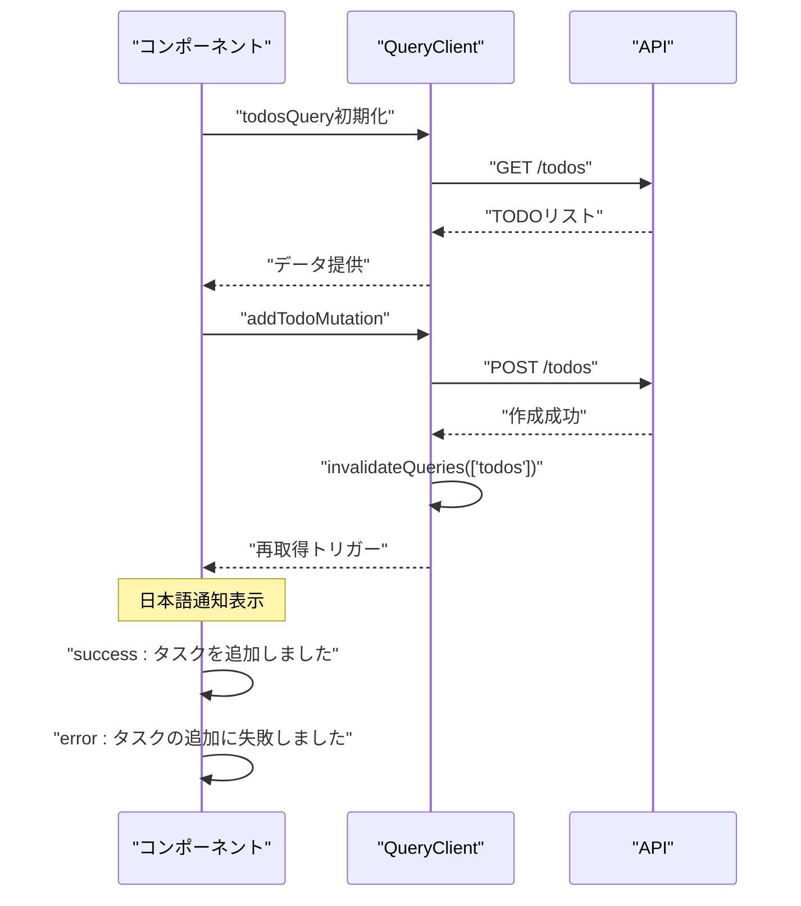

**図の出典**
- [frontend/src/hooks/useTodos.ts](file://frontend/src/hooks/useTodos.ts)
- [backend/app/api/api_v1/endpoints/todos.py](file://backend/app/api/api_v1/endpoints/todos.py)

**節の出典**
- [frontend/src/hooks/useTodos.ts](file://frontend/src/hooks/useTodos.ts)
- [backend/app/api/api_v1/endpoints/todos.py](file://backend/app/api/api_v1/endpoints/todos.py)

## 依存関係分析
- **Next.js（App Router）**：ルーティング、SSR/SSG、静的生成、画像最適化、webpack/swcの設定を提供します。
- **TypeScript**：型定義により、コンポーネント、props、APIレスポンス、環境変数の安全性を高めます。
- **Tailwind CSS**：utility-firstのスタイリングにより、一貫したUI設計とレスポンシブ対応を実現します。
- **React Query**：データ取得、キャッシュ管理、リアルタイム更新、エラーハンドリングを提供します。
- **shadcn/ui**：再利用可能なUIコンポーネントライブラリを提供し、テーマ対応とアクセシビリティを考慮します。
- **Zod**：型安全なバリデーションスキーマを提供し、フォーム入力の検証を実装します。
- **PostCSS**：autoprefixer、tailwindcss、必要に応じてCSS最適化プラグインを適用します。
- **ESLint**：React、React Hooks、Import、TypeScript、Tailwind CSSのルールを適用し、コード品質を保ちます。
- **Docker/docker-compose**：開発・本番環境での起動、ビルド、サービス間連携を標準化します。
- **FastAPI（バックエンド）**：REST APIとしてのデータ提供、認証・バリデーション、DB接続、スキーマ定義（models/schemas/crud/database/config）を提供します。
- **next-themes（新規）**：**ダーク/ライトテーマの管理を提供し、ユーザーの好みに応じたテーマ切り替えを実現します。**
- **日本語ローカライズ**：**言語属性（lang="ja"）、UIテキストの日本語翻訳、エラーメッセージの日本語化**を実装し、ユーザーインターフェースを完全に日本語対応にします。

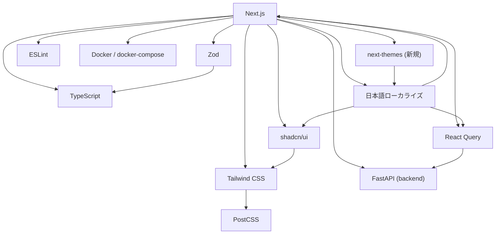

**図の出典**
- [frontend/package.json](file://frontend/package.json)
- [frontend/tsconfig.json](file://frontend/tsconfig.json)
- [frontend/postcss.config.mjs](file://frontend/postcss.config.mjs)
- [frontend/eslint.config.mjs](file://frontend/eslint.config.mjs)
- [docker-compose.yml](file://docker-compose.yml)
- [backend/pyproject.toml](file://backend/pyproject.toml)
- [backend/app/main.py](file://backend/app/main.py)

**節の出典**
- [frontend/package.json](file://frontend/package.json)
- [frontend/tsconfig.json](file://frontend/tsconfig.json)
- [frontend/postcss.config.mjs](file://frontend/postcss.config.mjs)
- [frontend/eslint.config.mjs](file://frontend/eslint.config.mjs)
- [docker-compose.yml](file://docker-compose.yml)
- [backend/pyproject.toml](file://backend/pyproject.toml)
- [backend/app/main.py](file://backend/app/main.py)

## パフォーマンス考慮事項
- **SSR/SSG**：初期表示のパフォーマンス向上のために、必要に応じてSSR/SSGを使用し、APIからの初期データを含めます。
- **画像最適化**：Next.jsのImageコンポーネントや画像最適化設定を活用し、不要なバンドルサイズを削減します。
- **CSS最適化**：Tailwind CSSのpurge設定（必要に応じて）により、未使用のCSSを除外します。
- **依存関係の軽量化**：不要なパッケージを排除し、最小限の依存関係に保ちます。
- **静的生成**：変更が少ないコンテンツについては静的生成（static generation）を活用し、CDNでの配信を検討します。
- **React Queryのキャッシュ**：staleTimeを設定し、ネットワークリクエストを削減し、パフォーマンスを向上させます。
- **ダークテーマの最適化**：CSS Variablesを使用したテーマ切り替えは軽量で高速です。
- **コンポーネントの最適化**：shadcn/uiコンポーネントは軽量でパフォーマンスに優れています。
- **テーマ切り替えのパフォーマンス**：**next-themesによるクライアントサイドでのテーマ切り替えは即時的で、パフォーマンスへの影響は最小限です。**
- **日本語ローカライズのパフォーマンス**：**UIテキストの日本語翻訳はコンパイル時に解決されるため、実行時のパフォーマンスへの影響は最小限です。**

## トラブルシューティングガイド
- **TypeScriptエラー**：型定義の不足や不一致を確認し、型定義ファイル（next-env.d.ts、各コンポーネントのprops型）を修正します。
- **Tailwind CSSのスタイルが反映されない**：globals.cssの読み込み順序、tailwind.config.js（存在する場合）の設定、PostCSSのプラグイン設定を確認します。
- **React Queryのエラー**：クエリキーの設定、ミューテーションの成功時のキャッシュ無効化、エラーハンドリングを確認します。
- **Zodバリデーションエラー**：スキーマ定義の確認、エラーメッセージの表示、フォームの再検証を確認します。
- **shadcn/uiコンポーネントの問題**：components.jsonの設定確認、Tailwind CSSの設定、CSS Variablesの確認をします。
- **ダーク/ライトテーマの切り替え**：**ThemeToggleコンポーネントの動作確認、next-themesの設定、CSS Variablesの確認、クライアントサイドでのみレンダリングの確認**をします。
- **ESLintエラー**：eslint.config.mjsのルール設定を確認し、React Hooksの使用法やimport順序、TypeScriptの型エラーに対処します。
- **API連携エラー**：バックエンドのエンドポイント、認証トークン、CORS設定、ネットワークエラーを確認します。
- **Docker/Docker Compose**：コンテナの起動状況、ポートマッピング、環境変数、ログを確認し、再起動・再ビルドを行います。
- **日本語ローカライズの問題**：**言語属性（lang="ja"）の確認、UIテキストの日本語翻訳の確認、エラーメッセージの日本語化の確認**をします。

**節の出典**
- [frontend/next-env.d.ts](file://frontend/next-env.d.ts)
- [frontend/src/app/globals.css](file://frontend/src/app/globals.css)
- [frontend/src/hooks/useTodos.ts](file://frontend/src/hooks/useTodos.ts)
- [frontend/src/app/login/page.tsx](file://frontend/src/app/login/page.tsx)
- [frontend/src/lib/api.ts](file://frontend/src/lib/api.ts)
- [frontend/eslint.config.mjs](file://frontend/eslint.config.mjs)
- [backend/app/main.py](file://backend/app/main.py)
- [docker-compose.yml](file://docker-compose.yml)
- [frontend/src/components/theme-toggle.tsx](file://frontend/src/components/theme-toggle.tsx)

## 結論
本プロジェクトは、Next.jsのApp Router、TypeScript、Tailwind CSS、React Query、shadcn/ui、Zod、ESLint、Docker/docker-compose、**日本語ローカライズ機能**を統合した高度なフロントエンド開発環境です。新しく統合されたTODO管理システム、認証機能、UIコンポーネントライブラリ、**ダーク/ライトテーマ対応（新規）**、リアルタイム更新機能、**日本語ローカライズ機能**により、堅牢でユーザーフレンドリーなアプリケーションが実現されています。共通レイアウト、ルートページ、認証ページ、グローバルスタイル、UIコンポーネント、**日本語のUIテキストとエラーメッセージ**、**ダーク/ライトテーマ切り替え機能**を通じて、一貫性のあるUIと型安全なコンポーネント設計が実現されています。API連携層はバックエンドFastAPIとの連携を前提としており、開発・本番環境での起動・ビルド・デバッグ・テストが標準化されています。

## 付録

### 開発サーバーの起動方法
- npm/yarn/bun等のパッケージマネージャーを使用して、開発サーバーを起動します。package.jsonのscriptsにdevコマンドが定義されているため、それを実行してください。
- Docker環境の場合、docker-compose upを実行し、コンテナ内で開発サーバーを起動します。
- React Query Devtoolsはデフォルトで非表示ですが、開発中に有効にすることができます。

**節の出典**
- [frontend/package.json](file://frontend/package.json)
- [docker-compose.yml](file://docker-compose.yml)

### ビルドプロセス
- 開発ビルド：package.jsonのscriptsにdevコマンドが定義されており、Next.jsの開発サーバーが起動します。
- 本番ビルド：package.jsonのscriptsにbuildコマンドが定義されており、Next.jsの静的出力（静的生成）またはSSG/SSRのビルドが実行されます。
- Dockerビルド：docker/frontend/Dockerfileを用いて、コンテナイメージをビルドし、docker-composeで起動します。

**節の出典**
- [frontend/package.json](file://frontend/package.json)
- [docker/frontend/Dockerfile](file://docker/frontend/Dockerfile)
- [docker-compose.yml](file://docker-compose.yml)

### デバッグ手法
- **TypeScript**：型エラーの修正、型定義の追加（next-env.d.tsなど）。
- **Tailwind CSS**：スタイルの適用順序、utilityクラスの使用法、レスポンシブ断点の確認。
- **React Query**：クエリのキャッシュ状態、エラーハンドリング、再取得の確認。
- **shadcn/uiコンポーネント**：コンポーネントのprops確認、テーマ対応の確認。
- **Zodバリデーション**：スキーマの確認、エラーメッセージの確認。
- **ダーク/ライトテーマ**：**ThemeToggleコンポーネントの動作確認、next-themesの設定、CSS Variablesの確認、クライアントサイドでのみレンダリングの確認**。
- **ESLint**：ルール違反の修正、React Hooksの使用法、import順序の調整。
- **API連携**：バックエンドエンドポイントの確認、認証トークン、CORS設定、ネットワークエラーの確認。
- **Docker**：コンテナの起動状況、ポートマッピング、環境変数、ログの確認。
- **日本語ローカライズ**：**言語属性（lang="ja"）の確認、UIテキストの日本語翻訳の確認、エラーメッセージの日本語化の確認**。

**節の出典**
- [frontend/next-env.d.ts](file://frontend/next-env.d.ts)
- [frontend/src/app/globals.css](file://frontend/src/app/globals.css)
- [frontend/src/hooks/useTodos.ts](file://frontend/src/hooks/useTodos.ts)
- [frontend/src/app/login/page.tsx](file://frontend/src/app/login/page.tsx)
- [frontend/src/lib/api.ts](file://frontend/src/lib/api.ts)
- [frontend/eslint.config.mjs](file://frontend/eslint.config.mjs)
- [backend/app/main.py](file://backend/app/main.py)
- [docker-compose.yml](file://docker-compose.yml)
- [frontend/src/components/theme-toggle.tsx](file://frontend/src/components/theme-toggle.tsx)

### テスト戦略
- **単体テスト**：Jest/React Testing Library（存在する場合）を使用し、コンポーネント単位のテストを実施します。
- **E2Eテスト**：Cypress/Selenium（存在する場合）を使用し、エンドツーエンドの動作確認を行います。
- **ESLint**：ESLintのルールを実行し、コード品質を維持します。
- **型チェック**：TypeScriptの型チェックを実行し、型安全性を保ちます。
- **APIテスト**：バックエンドAPIのテスト、認証フローの確認、エラーハンドリングの検証。
- **UIテスト**：shadcn/uiコンポーネントの表示確認、テーマ切り替えの動作確認、**日本語UIテキストの確認**。
- **テーマテスト**：**ThemeToggleコンポーネントの動作確認、ダーク/ライトテーマの切り替え確認、CSS Variablesの適用確認**。
- **Docker**：コンテナ内でのテスト実行、CIパイプラインでの自動テストを検討します。

**節の出典**
- [frontend/src/components/theme-toggle.tsx](file://frontend/src/components/theme-toggle.tsx)
- [frontend/src/components/theme-provider.tsx](file://frontend/src/components/theme-provider.tsx)
- [frontend/src/app/providers.tsx](file://frontend/src/app/providers.tsx)