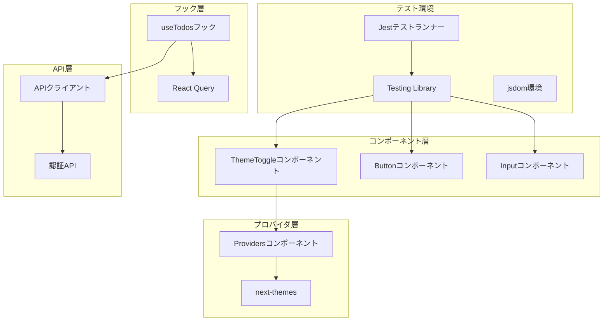
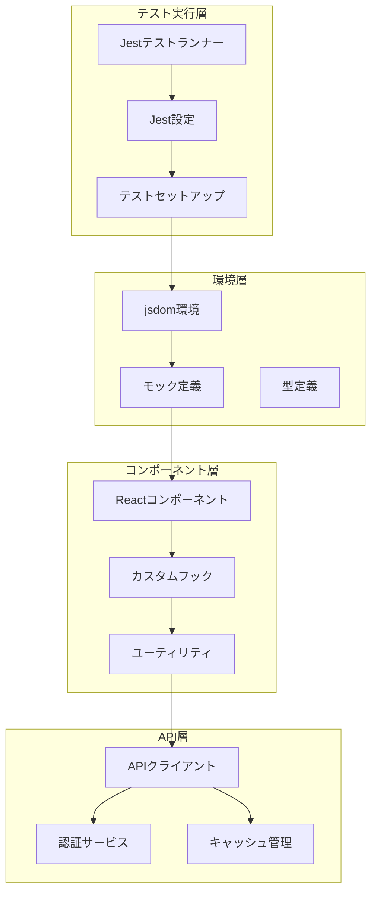
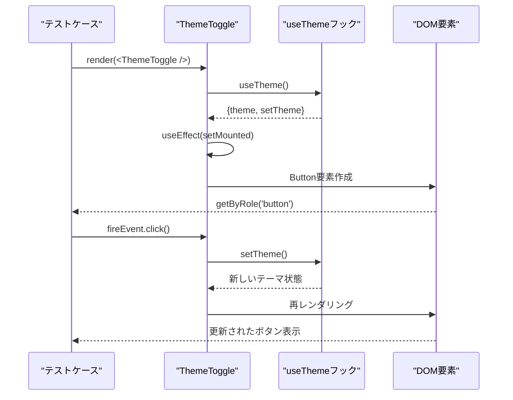
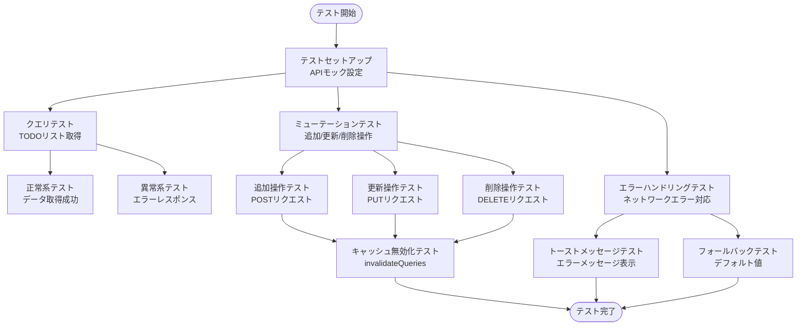

# フロントエンドテストフレームワーク

<cite>
**この文書で参照されるファイル**
- [package.json](file://frontend/package.json)
- [jest.config.js](file://frontend/jest.config.js)
- [jest.setup.ts](file://frontend/jest.setup.ts)
- [theme-toggle.test.tsx](file://frontend/src/__tests__/theme-toggle.test.tsx)
- [theme-toggle.tsx](file://frontend/src/components/theme-toggle.tsx)
- [useTodos.ts](file://frontend/src/hooks/useTodos.ts)
- [providers.tsx](file://frontend/src/app/providers.tsx)
- [api.ts](file://frontend/src/lib/api.ts)
- [button.tsx](file://frontend/src/components/ui/button.tsx)
- [input.tsx](file://frontend/src/components/ui/input.tsx)
- [tsconfig.json](file://frontend/tsconfig.json)
</cite>

## 目次
1. [導入](#導入)
2. [プロジェクト構造](#プロジェクト構造)
3. [コアコンポーネント](#コアコンポーネント)
4. [アーキテクチャ概観](#アーキテクチャ概観)
5. [詳細コンポーネント分析](#詳細コンポーネント分析)
6. [依存関係分析](#依存関係分析)
7. [パフォーマンス考慮事項](#パフォーマンス考慮事項)
8. [トラブルシューティングガイド](#トラブルシューティングガイド)
9. [結論](#結論)

## 導入
本プロジェクトはNext.jsベースのフロントエンドアプリケーションであり、JestとTesting Libraryを用いた包括的なテストフレームワークを実装しています。このフレームワークはTypeScript対応の型安全なテスト環境を提供し、コンポーネントレベルからフックレベルまで幅広くカバーしています。

## プロジェクト構造
フロントエンドテストフレームワークは以下の主要な構成要素で構成されています：



**図のソース**
- [jest.config.js:1-31](file://frontend/jest.config.js#L1-L31)
- [theme-toggle.tsx:1-36](file://frontend/src/components/theme-toggle.tsx#L1-L36)
- [useTodos.ts:1-96](file://frontend/src/hooks/useTodos.ts#L1-L96)
- [providers.tsx:1-26](file://frontend/src/app/providers.tsx#L1-L26)

**セクションのソース**
- [package.json:1-60](file://frontend/package.json#L1-L60)
- [jest.config.js:1-31](file://frontend/jest.config.js#L1-L31)
- [tsconfig.json:1-35](file://frontend/tsconfig.json#L1-L35)

## コアコンポーネント
フロントエンドテストフレームワークのコアコンポーネントは以下の通りです：

### ThemeToggleコンポーネント
ThemeToggleコンポーネントはテーマ切り替え機能を提供する重要なUIコンポーネントです。クライアントサイドでのみ実行される設定が適用されており、ハイドレーション後のマウント処理を適切に行っています。

### useTodosカスタムフック
useTodosフックはReact Queryを使用したデータ取得と管理を担当します。以下の機能を提供します：
- TODOリストの取得（検索、フィルタリング、ソート対応）
- TODOの追加、更新、削除操作
- 自動的なキャッシュ無効化
- 成功・エラーハンドリング

### Providersコンテナ
Providersコンポーネントはアプリケーション全体のコンテキストを提供するラッパーです。以下のサービスを統合して提供します：
- React Queryのクライアント管理
- テーマシステムの提供
- 開発ツールの有効化

**セクションのソース**
- [theme-toggle.tsx:1-36](file://frontend/src/components/theme-toggle.tsx#L1-L36)
- [useTodos.ts:1-96](file://frontend/src/hooks/useTodos.ts#L1-L96)
- [providers.tsx:1-26](file://frontend/src/app/providers.tsx#L1-L26)

## アーキテクチャ概観
テストフレームワークの全体像は以下のようになっています：



**図のソース**
- [jest.config.js:1-31](file://frontend/jest.config.js#L1-L31)
- [jest.setup.ts:1-14](file://frontend/jest.setup.ts#L1-L14)
- [api.ts:1-102](file://frontend/src/lib/api.ts#L1-L102)

## 詳細コンポーネント分析

### ThemeToggleコンポーネントテスト
ThemeToggleコンポーネントのテストはアクセシビリティと機能の両面をカバーしています。



**図のソース**
- [theme-toggle.test.tsx:1-28](file://frontend/src/__tests__/theme-toggle.test.tsx#L1-L28)
- [theme-toggle.tsx:1-36](file://frontend/src/components/theme-toggle.tsx#L1-L36)

#### テスト戦略の詳細
1. **レンダリングテスト**: コンポーネントが正しくレンダリングされることを確認
2. **アクセシビリティテスト**: スクリーンリーダー用のラベルが適切に設定されているか
3. **インタラクションテスト**: テーマ切り替え機能の動作確認

**セクションのソース**
- [theme-toggle.test.tsx:1-28](file://frontend/src/__tests__/theme-toggle.test.tsx#L1-L28)
- [theme-toggle.tsx:1-36](file://frontend/src/components/theme-toggle.tsx#L1-L36)

### useTodosフックのテストアプローチ
useTodosフックは複数のAPI操作を含むため、以下のテスト戦略を採用しています：



**図のソース**
- [useTodos.ts:1-96](file://frontend/src/hooks/useTodos.ts#L1-L96)
- [api.ts:1-102](file://frontend/src/lib/api.ts#L1-L102)

### APIクライアントのテスト戦略
APIクライアントは以下の要素をカバーする必要があります：

1. **認証ヘッダーの処理**
2. **エラーレスポンスの解析**
3. **トースト通知の表示**
4. **ローカルストレージとの連携**

**セクションのソース**
- [api.ts:1-102](file://frontend/src/lib/api.ts#L1-L102)

## 依存関係分析
テストフレームワークの依存関係は以下の通りです：

```mermaid
graph TB
subgraph "テストランナー"
Jest[Jest 30.3.0]
TSJest[ts-jest 29.4.9]
JSDOM[jest-environment-jsdom 30.3.0]
end
subgraph "Testing Library"
RTL[Testing Library 16.3.2]
RTLReact[React Testing Library]
RTLJestDom[jest-dom 6.9.1]
end
subgraph "Reactエコシステム"
Next[Next.js 16.2.4]
ReactQuery[@tanstack/react-query 5.99.2]
NextThemes[next-themes 0.4.6]
end
subgraph "UIコンポーネント"
BaseUI[@base-ui/react]
Shadcn[shadcn]
Tailwind[Tailwind CSS]
end
Jest --> TSJest
Jest --> JSDOM
TSJest --> Next
RTL --> RTLReact
RTL --> RTLJestDom
RTLReact --> ReactQuery
NextThemes --> Next
BaseUI --> Next
Shadcn --> Tailwind
```

**図のソース**
- [package.json:14-49](file://frontend/package.json#L14-L49)
- [jest.config.js:9-13](file://frontend/jest.config.js#L9-L13)

**セクションのソース**
- [package.json:1-60](file://frontend/package.json#L1-L60)
- [jest.config.js:1-31](file://frontend/jest.config.js#L1-L31)

## パフォーマンス考慮事項
テストフレームワークのパフォーマンス向上のために以下の点が考慮されています：

1. **テストスイートの最適化**
   - 増分ビルド対応のTypeScriptコンパイラ設定
   - 不要なファイルの除外設定（.nextディレクトリ、d.tsファイル）

2. **モック戦略の効率化**
   - Next.jsナビゲーションモックの事前定義
   - API呼び出しのモック化によるネットワーク依存の排除

3. **メモリ使用量の削減**
   - 各テスト間の状態クリーンアップ
   - 大規模コンポーネントのレンダリング制限

## トラブルシューティングガイド

### 共通問題と解決策

#### 1. TypeScriptコンパイルエラー
**症状**: `jest.config.js`のTypeScriptコンパイルエラー
**解決策**: 
- `tsconfig.json`のパスエントリを確認
- `ts-jest`のバージョン互換性を確認

#### 2. DOM環境エラー
**症状**: `ReferenceError: HTMLElement is not defined`
**解決策**:
- `jest-environment-jsdom`のインストール確認
- `jest.setup.ts`のjsdom初期化確認

#### 3. Next.jsモジュールエラー
**症状**: `Cannot find module 'next/navigation'`
**解決策**:
- `jest.setup.ts`内のモック定義の確認
- Next.jsバージョンとの互換性確認

#### 4. APIテストエラー
**症状**: `fetch`呼び出しのエラー
**解決策**:
- `src/lib/api.ts`のモック設定確認
- 環境変数`NEXT_PUBLIC_API_URL`の設定確認

**セクションのソース**
- [jest.config.js:14-27](file://frontend/jest.config.js#L14-L27)
- [jest.setup.ts:1-14](file://frontend/jest.setup.ts#L1-L14)
- [api.ts:17-58](file://frontend/src/lib/api.ts#L17-L58)

## 結論
本フロントエンドテストフレームワークは、JestとTesting Libraryを基盤とした堅牢なテスト環境を提供しています。TypeScriptの型安全性、Next.jsのモダンな開発手法、React Queryのデータ管理機能を組み合わせることで、包括的なテストカバレッジを実現しています。

主な特徴として、以下の点が挙げられます：
- 完全なTypeScript対応と型安全なテストコード
- Reactコンポーネントとカスタムフックの両方に対応したテスト戦略
- API層のモック化によるテストの独立性の確保
- アクセシビリティとユーザーエクスペリエンスの考慮
- 高いカバレッジ率を維持するための設定

今後の改善点としては、より多くのコンポーネントテストの追加、CI/CDパイプラインとの統合、パフォーマンステストの導入などが考えられます。