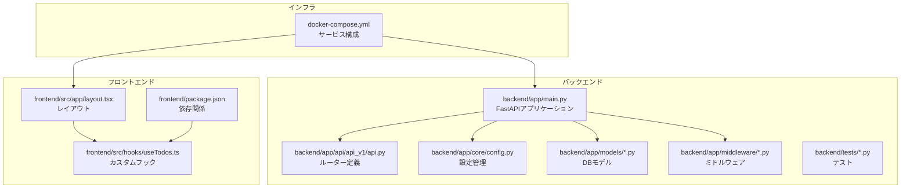
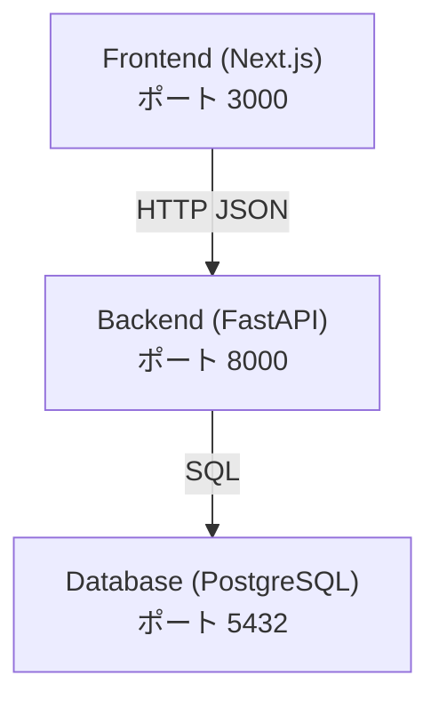
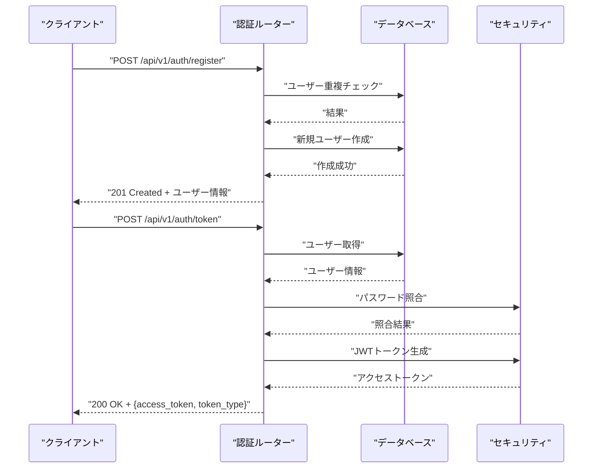
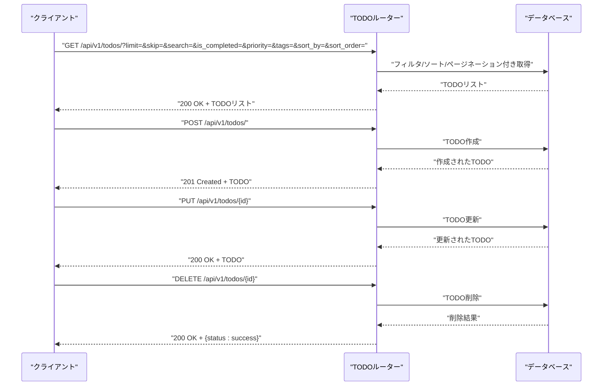
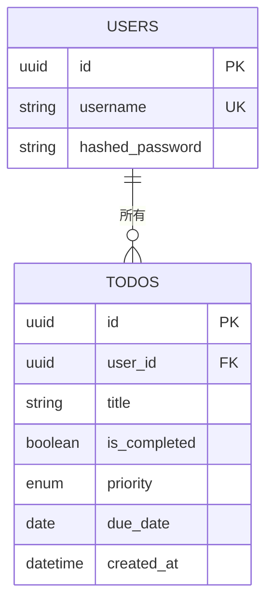
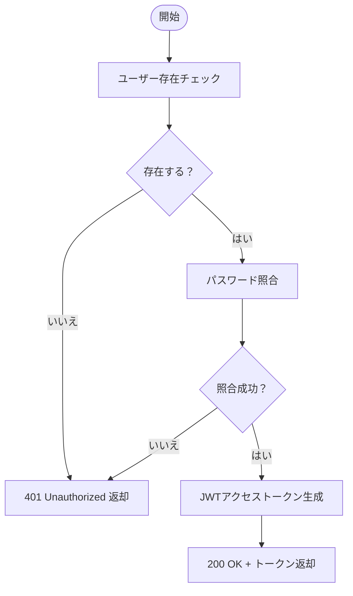
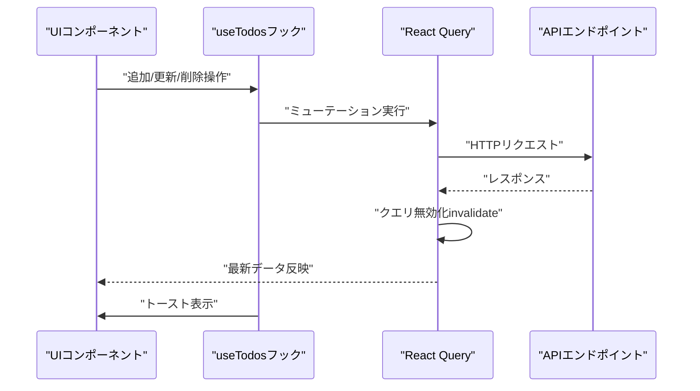
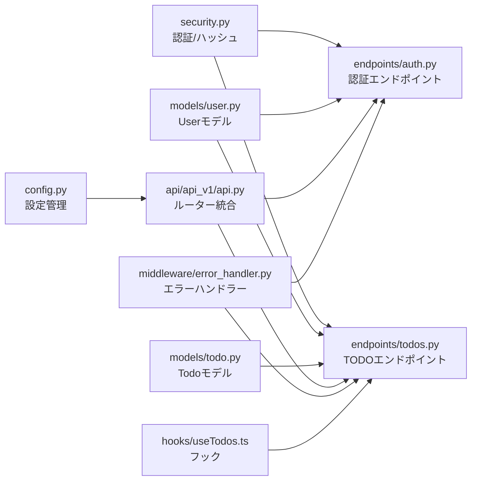

# プロジェクト概要

<cite>
**この文書で参照されるファイル**
- [README.md](file://README.md)
- [backend/app/main.py](file://backend/app/main.py)
- [backend/app/core/config.py](file://backend/app/core/config.py)
- [backend/app/api/api_v1/api.py](file://backend/app/api/api_v1/api.py)
- [backend/app/api/api_v1/endpoints/auth.py](file://backend/app/api/api_v1/endpoints/auth.py)
- [backend/app/api/api_v1/endpoints/todos.py](file://backend/app/api/api_v1/endpoints/todos.py)
- [backend/app/models/todo.py](file://backend/app/models/todo.py)
- [backend/app/models/user.py](file://backend/app/models/user.py)
- [backend/app/core/security.py](file://backend/app/core/security.py)
- [backend/app/middleware/error_handler.py](file://backend/app/middleware/error_handler.py)
- [backend/pyproject.toml](file://backend/pyproject.toml)
- [frontend/src/app/layout.tsx](file://frontend/src/app/layout.tsx)
- [frontend/src/hooks/useTodos.ts](file://frontend/src/hooks/useTodos.ts)
- [frontend/package.json](file://frontend/package.json)
- [docker-compose.yml](file://docker-compose.yml)
- [backend/tests/test_auth.py](file://backend/tests/test_auth.py)
</cite>

## 目次
1. [導入](#導入)
2. [プロジェクト構造](#プロジェクト構造)
3. [コアコンポーネント](#コアコンポーネント)
4. [アーキテクチャ概観](#アーキテクチャ概観)
5. [詳細コンポーネント分析](#詳細コンポーネント分析)
6. [依存関係分析](#依存関係分析)
7. [パフォーマンス考慮事項](#パフォーマンス考慮事項)
8. [トラブルシューティングガイド](#トラブルシューティングガイド)
9. [結論](#結論)
10. [付録](#付録)

## 導入
本プロジェクトは、FastAPI（Python）によるバックエンドとNext.js（TypeScript）によるフロントエンドの統合構成を持つ、モダンなフルスタックTODO管理アプリケーションです。JWTベースの認証、リアルタイム更新、レート制限、構造化ロギング、エラーハンドリング、ヘルスチェックなどの機能を備えています。初心者への導入と経験者向けの技術的詳細の両面に対応したドキュメントとして、本概要をご提供します。

## プロジェクト構造
全体のプロジェクトは以下のディレクトリ構成で構成されています：
- backend: FastAPIによるAPIサーバー、DB接続、認証、ミドルウェア、CRUD、スキーマ、モデル、設定、テストを含みます
- frontend: Next.jsによるフロントエンド、UIコンポーネント、カスタムフック、テーマ管理、通知などを含みます
- docker: Dockerイメージビルド用のDockerfile
- docker-compose.yml: Docker Composeによるサービス構成
- docs: 認証仕様書や現在の開発状況に関する文書

**図の出典**
- [backend/app/main.py:1-164](file://backend/app/main.py#L1-L164)
- [backend/app/api/api_v1/api.py:1-8](file://backend/app/api/api_v1/api.py#L1-L8)
- [backend/app/core/config.py:1-60](file://backend/app/core/config.py#L1-L60)
- [frontend/src/app/layout.tsx:1-40](file://frontend/src/app/layout.tsx#L1-L40)
- [frontend/src/hooks/useTodos.ts:1-96](file://frontend/src/hooks/useTodos.ts#L1-L96)
- [docker-compose.yml](file://docker-compose.yml)

**節の出典**
- [README.md:158-184](file://README.md#L158-L184)
- [backend/app/main.py:1-164](file://backend/app/main.py#L1-L164)
- [frontend/src/app/layout.tsx:1-40](file://frontend/src/app/layout.tsx#L1-L40)

## コアコンポーネント
- 認証システム: JWTベースの認証、パスワードハッシュ化（Argon2）、トークン有効期限管理
- TODO管理: CRUD操作、フィルタリング、ソート、ページネーション
- 実装フレームワーク: FastAPI（バックエンド）、Next.js（フロントエンド）
- DB: PostgreSQL（asyncpg + SQLModel）
- 高度な機能: レート制限（SlowAPI）、構造化ロギング（python-json-logger）、CORS、ヘルスチェック

**節の出典**
- [README.md:12-21](file://README.md#L12-L21)
- [backend/app/core/security.py:1-35](file://backend/app/core/security.py#L1-L35)
- [backend/app/api/api_v1/endpoints/auth.py:1-53](file://backend/app/api/api_v1/endpoints/auth.py#L1-L53)
- [backend/app/api/api_v1/endpoints/todos.py:1-80](file://backend/app/api/api_v1/endpoints/todos.py#L1-L80)
- [backend/app/core/config.py:1-60](file://backend/app/core/config.py#L1-L60)

## アーキテクチャ概観
本アプリケーションは、Next.js（ポート3000）がフロントエンド、FastAPI（ポート8000）がバックエンド、PostgreSQL（ポート5432）がデータベースという3層構造です。APIドキュメントはScalarで提供され、CORS設定によりフロントエンドオリジンからのアクセスを許可しています。

**図の出典**
- [README.md:60-68](file://README.md#L60-L68)
- [backend/app/main.py:104-124](file://backend/app/main.py#L104-L124)
- [backend/app/core/config.py:44-48](file://backend/app/core/config.py#L44-L48)

**節の出典**
- [README.md:60-84](file://README.md#L60-L84)
- [backend/app/main.py:104-124](file://backend/app/main.py#L104-L124)

## 詳細コンポーネント分析

### 認証エンドポイント
認証エンドポイントには「ユーザー登録」と「アクセストークン取得」があり、いずれもレート制限が適用されます。ユーザー登録は既存ユーザーの重複を防ぎ、ログイン時はパスワード照合とJWTトークン発行を行います。

**図の出典**
- [backend/app/api/api_v1/endpoints/auth.py:17-53](file://backend/app/api/api_v1/endpoints/auth.py#L17-L53)
- [backend/app/core/security.py:10-27](file://backend/app/core/security.py#L10-L27)

**節の出典**
- [backend/app/api/api_v1/endpoints/auth.py:1-53](file://backend/app/api/api_v1/endpoints/auth.py#L1-L53)
- [backend/app/core/security.py:1-35](file://backend/app/core/security.py#L1-L35)

### TODO管理エンドポイント
TODO管理エンドポイントでは、GET（一覧取得）、POST（作成）、PUT（更新）、DELETE（削除）が提供され、すべて認証が必要です。クエリパラメータによるフィルタリング、ソート、ページネーションが実装されています。

**図の出典**
- [backend/app/api/api_v1/endpoints/todos.py:13-80](file://backend/app/api/api_v1/endpoints/todos.py#L13-L80)

**節の出典**
- [backend/app/api/api_v1/endpoints/todos.py:1-80](file://backend/app/api/api_v1/endpoints/todos.py#L1-L80)

### DBモデルとスキーマ
- Userモデル: UUID主キー、hashed_password、Relationshipを通じてTodoと関連付け
- Todoモデル: UUID主キー、user_id外部キー、created_at、Userとの関連付け、複数のインデックスを設定
- PriorityEnum: 優先度の列挙型（high/medium/low）

**図の出典**
- [backend/app/models/user.py:9-19](file://backend/app/models/user.py#L9-L19)
- [backend/app/models/todo.py:10-25](file://backend/app/models/todo.py#L10-L25)

**節の出典**
- [backend/app/models/user.py:1-19](file://backend/app/models/user.py#L1-L19)
- [backend/app/models/todo.py:1-25](file://backend/app/models/todo.py#L1-L25)

### 認証フロー（JWT）
JWT認証の流れは以下の通りです：クライアントがログインリクエストを送信し、バックエンドはユーザー情報を照合してパスワードを検証し、成功すればJWTアクセストークンを発行します。

**図の出典**
- [backend/app/api/api_v1/endpoints/auth.py:34-53](file://backend/app/api/api_v1/endpoints/auth.py#L34-L53)
- [backend/app/core/security.py:17-35](file://backend/app/core/security.py#L17-L35)

**節の出典**
- [backend/app/api/api_v1/endpoints/auth.py:1-53](file://backend/app/api/api_v1/endpoints/auth.py#L1-L53)
- [backend/app/core/security.py:1-35](file://backend/app/core/security.py#L1-L35)

### フロントエンドのTODOフック（リアルタイム更新）
フロントエンドでは、TanStack React Queryを使用してTODOのCRUD操作を非同期で処理し、成功時にはクエリを無効化（invalidate）して即時反映させています。Sonnerによるトースト通知も統合されています。

**図の出典**
- [frontend/src/hooks/useTodos.ts:46-94](file://frontend/src/hooks/useTodos.ts#L46-L94)

**節の出典**
- [frontend/src/hooks/useTodos.ts:1-96](file://frontend/src/hooks/useTodos.ts#L1-L96)

## 依存関係分析
- 設定管理: backend/app/core/config.py が環境変数からDB接続文字列、JWT設定、CORS、レート制限を読み込みます
- APIルーティング: backend/app/api/api_v1/api.py が各エンドポイントルーターを統合
- 認証: backend/app/core/security.py がJWT生成/検証、パスワードハッシュ化を担当
- DBモデル: backend/app/models/user.py と backend/app/models/todo.py がSQLModelベースのORMモデル
- エラーハンドリング: backend/app/middleware/error_handler.py がバリデーションエラー、HTTP例外、レート制限超過、一般例外を統一的に処理
- フロントエンド: frontend/src/hooks/useTodos.ts がAPI呼び出し、React Query、トースト通知を統合

**図の出典**
- [backend/app/core/config.py:1-60](file://backend/app/core/config.py#L1-L60)
- [backend/app/core/security.py:1-35](file://backend/app/core/security.py#L1-L35)
- [backend/app/models/user.py:1-19](file://backend/app/models/user.py#L1-L19)
- [backend/app/models/todo.py:1-25](file://backend/app/models/todo.py#L1-L25)
- [backend/app/api/api_v1/api.py:1-8](file://backend/app/api/api_v1/api.py#L1-L8)
- [backend/app/api/api_v1/endpoints/auth.py:1-53](file://backend/app/api/api_v1/endpoints/auth.py#L1-L53)
- [backend/app/api/api_v1/endpoints/todos.py:1-80](file://backend/app/api/api_v1/endpoints/todos.py#L1-L80)
- [backend/app/middleware/error_handler.py:1-149](file://backend/app/middleware/error_handler.py#L1-L149)
- [frontend/src/hooks/useTodos.ts:1-96](file://frontend/src/hooks/useTodos.ts#L1-L96)

**節の出典**
- [backend/app/core/config.py:1-60](file://backend/app/core/config.py#L1-L60)
- [backend/app/core/security.py:1-35](file://backend/app/core/security.py#L1-L35)
- [backend/app/api/api_v1/api.py:1-8](file://backend/app/api/api_v1/api.py#L1-L8)
- [backend/app/middleware/error_handler.py:1-149](file://backend/app/middleware/error_handler.py#L1-L149)
- [frontend/src/hooks/useTodos.ts:1-96](file://frontend/src/hooks/useTodos.ts#L1-L96)

## パフォーマンス考慮事項
- DB接続: 非同期接続（asyncpg）とSQLModelによる効率的なORM操作
- インデックス: Todoモデルには複数のインデックス（user_id, created_at, is_completed, priority, due_date）が設定されており、クエリパフォーマンス向上に寄与
- レート制限: SlowAPIによるレート制限（認証エンドポイントは5/分、デフォルトは100/分）により、Brute-force攻撃やAPI過剰使用を防止
- 構造化ロギング: JSONフォーマットによるログ出力により、運用・監視ツールとの連携が容易
- フロントエンド: React Queryのキャッシュと自動リフェッチにより、ネットワーク効率とUXの両立

**節の出典**
- [backend/app/models/todo.py:10-18](file://backend/app/models/todo.py#L10-L18)
- [backend/app/core/config.py:50-53](file://backend/app/core/config.py#L50-L53)
- [README.md:17-18](file://README.md#L17-L18)

## トラブルシューティングガイド
- 認証エラー（401 Unauthorized）: ユーザー名またはパスワードが間違っている可能性があります。再度ログインしてください。
- 重複ユーザー登録（400 Bad Request）: 既に存在するユーザー名です。別のユーザー名をご利用ください。
- DB接続エラー: /healthエンドポイントでデータベース接続状況を確認し、DBサービスの起動状況を確認してください。
- 予期しないエラー（500 Internal Server Error）: 構造化ロギングにより詳細なエラー情報を確認できます。ログを確認し、再現手順を把握してください。
- レート制限超過（429 Too Many Requests）: 認証エンドポイントは5/分、その他のエンドポイントは100/分の制限があります。時間を置いて再度お試しください。

**節の出典**
- [backend/app/middleware/error_handler.py:52-122](file://backend/app/middleware/error_handler.py#L52-L122)
- [backend/app/main.py:130-163](file://backend/app/main.py#L130-L163)
- [backend/tests/test_auth.py:71-80](file://backend/tests/test_auth.py#L71-L80)

## 結論
本プロジェクトは、JWT認証、リアルタイム更新、レート制限、構造化ロギング、ヘルスチェックなど、モダンなWeb開発における重要な要素を統合したTodoアプリケーションです。FastAPIとNext.jsの組み合わせにより、堅牢で拡張可能なアーキテクチャを実現しています。初心者にも経験者にも適した設計であり、教育・ポートフォリオとして最適です。

## 付録
- APIエンドポイント一覧
  - 認証: POST /api/v1/auth/register, POST /api/v1/auth/token
  - TODO: GET /api/v1/todos/, POST /api/v1/todos/, PUT /api/v1/todos/{id}, DELETE /api/v1/todos/{id}
  - ヘルス: GET /health
- 開発環境
  - Docker & Docker Compose, Bun（フロント）、Python 3.10+ & uv（バック）、Jujutsu（バージョン管理）
- APIドキュメント
  - Scalar API Reference: http://localhost:8000/docs
  - OpenAPI JSON: http://localhost:8000/api/v1/openapi.json

**節の出典**
- [README.md:70-84](file://README.md#L70-L84)
- [backend/app/main.py:117-122](file://backend/app/main.py#L117-L122)
- [backend/app/main.py:126-128](file://backend/app/main.py#L126-L128)