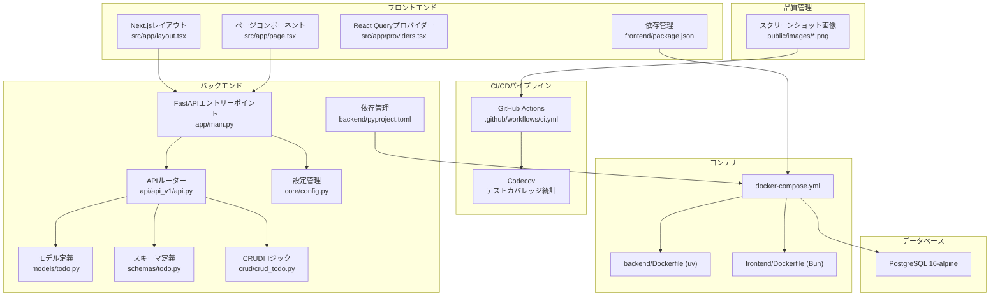
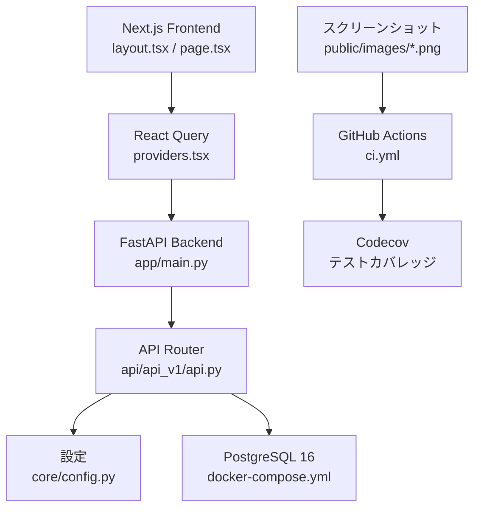
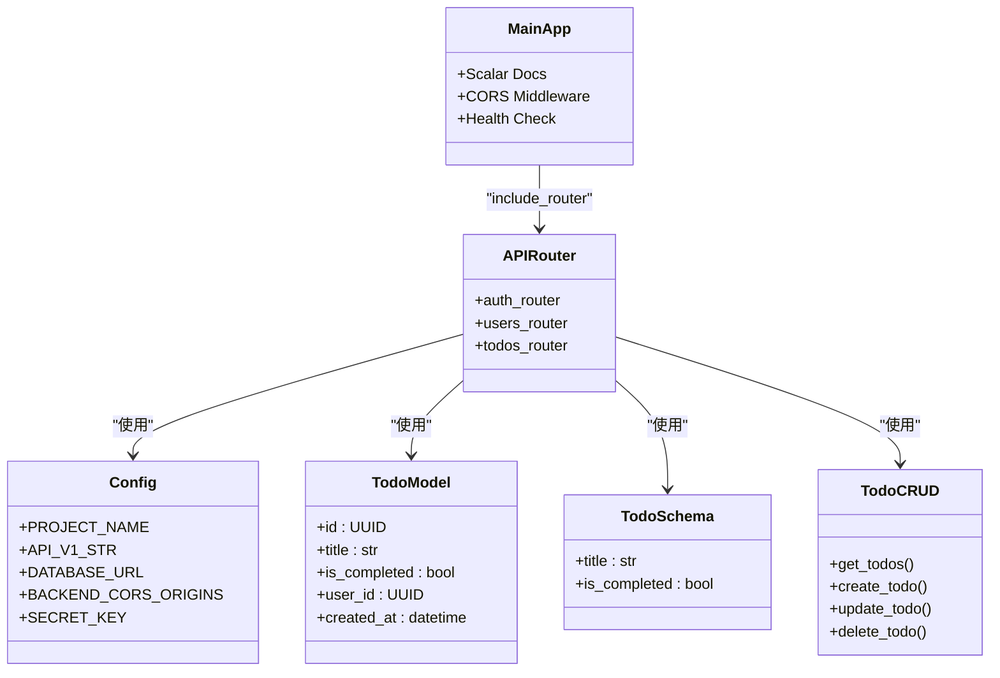
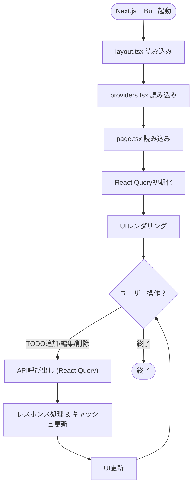
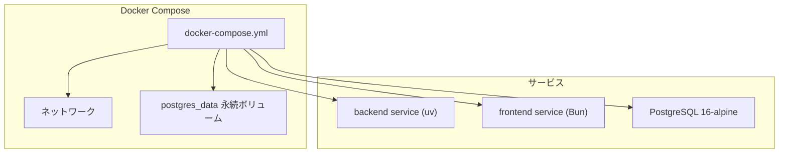
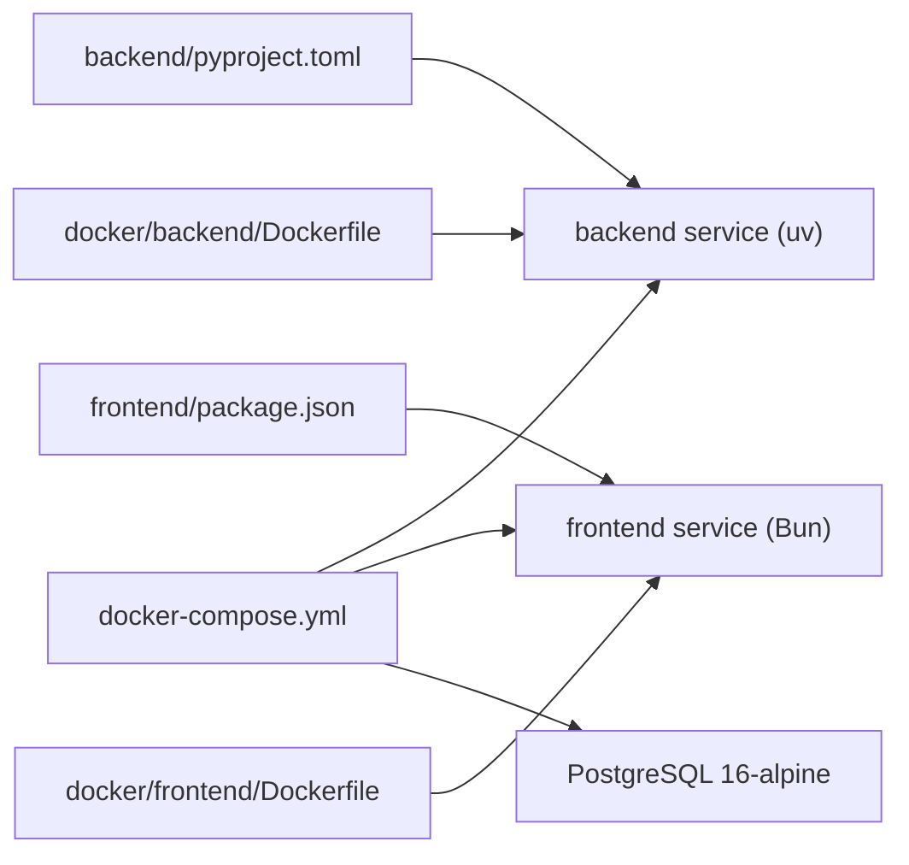
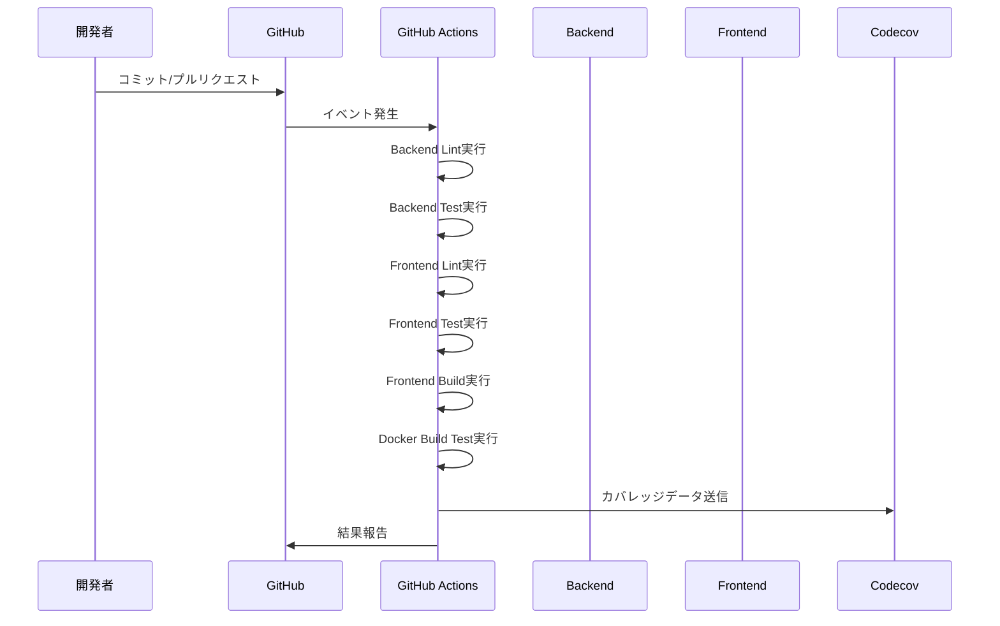

# プロジェクト概要

<cite>
**本ドキュメントで参照されるファイル**
- [backend/app/main.py](file://backend/app/main.py)
- [backend/main.py](file://backend/main.py)
- [backend/app/models/todo.py](file://backend/app/models/todo.py)
- [backend/app/schemas/todo.py](file://backend/app/schemas/todo.py)
- [backend/app/crud/crud_todo.py](file://backend/app/crud/crud_todo.py)
- [backend/app/core/config.py](file://backend/app/core/config.py)
- [backend/app/api/api_v1/api.py](file://backend/app/api/api_v1/api.py)
- [backend/pyproject.toml](file://backend/pyproject.toml)
- [frontend/src/app/layout.tsx](file://frontend/src/app/layout.tsx)
- [frontend/src/app/page.tsx](file://frontend/src/app/page.tsx)
- [frontend/src/app/providers.tsx](file://frontend/src/app/providers.tsx)
- [frontend/package.json](file://frontend/package.json)
- [docker-compose.yml](file://docker-compose.yml)
- [docker/backend/Dockerfile](file://docker/backend/Dockerfile)
- [docker/frontend/Dockerfile](file://docker/frontend/Dockerfile)
- [.github/workflows/ci.yml](file://.github/workflows/ci.yml)
- [README.md](file://README.md)
</cite>

## 更新概要
**変更内容**
- CI/CDパイプラインの統合（GitHub Actions）
- Codecovによるテストカバレッジ統計の追加
- スクリーンショット画像の追加（ログイン画面、TODOリスト）
- GitHub Actionsワークフローの詳細なステップ追加

## 目次
1. [導入](#導入)
2. [プロジェクト構造](#プロジェクト構造)
3. [コアコンポーネント](#コアコンポーネント)
4. [アーキテクチャ概観](#アーキテクチャ概観)
5. [詳細コンポーネント分析](#詳細コンポーネント分析)
6. [依存関係分析](#依存関係分析)
7. [CI/CD統合と品質管理](#cicd統合と品質管理)
8. [パフォーマンス考慮事項](#パフォーマンス考慮事項)
9. [トラブルシューティングガイド](#トラブルシューティングガイド)
10. [結論](#結論)
11. [付録](#付録)

## 導入
本プロジェクトは、Next.js（フロントエンド）とFastAPI（バックエンド）を統合したフルスタックTODOアプリケーションです。Gitベースの新しい開発フロー、Dockerコンテナ化された堅牢なアーキテクチャ、Bunパッケージマネージャーの導入により、開発・デプロイの効率性と再現性を高めています。  
- プロジェクトの目的：シンプルかつ拡張可能なTODO管理機能を提供し、React/TypeScriptによる現代的なフロントエンドとPython/FastAPIによる堅牢なバックエンドの統合を通じて、学習者にも実務者にも使いやすい環境を整備すること。  
- 主な機能：TODOのCRUD操作、認証・認可の基本的な実装、APIドキュメント（Scalar/Swagger/OpenAPI）、ヘルスチェック、Dockerによる環境構築、GitHub ActionsによるCI/CD統合、Codecovによるテストカバレッジ監視。  
- 技術スタックの選定理由：Next.js（App Router、TypeScript、SSR/CSR対応、Bunパッケージマネージャー）、FastAPI（型安全なAPI、自動ドキュメント、非同期処理、SQLModel）、Docker（依存関係の標準化、uv/AsyncPGによる高速パッケージ管理）、GitHub Actions（継続的インテグレーション）、Codecov（品質管理）。  
- 開発チームへの利点：分離されたフロント/バックエンド、コンテナによる環境の一貫性、型安全なAPI設計によるバグ低減、自動ドキュメントによる連携の円滑化、Bunによる高速なフロントエンドビルド、CI/CDパイプラインによる品質保証、テストカバレッジの可視化。

## プロジェクト構造
全体のディレクトリ構成は以下の通りです。  
- backend：FastAPIベースのAPIサーバー（Python、SQLModel、AsyncPG等）  
- frontend：Next.js（App Router、TypeScript、TailwindCSS、Bunパッケージマネージャー）  
- docker：バックエンド/フロント用Dockerfile（uv/AsyncPG、Bun対応）  
- docker-compose.yml：PostgreSQLサービスの設定  
- docs：プロジェクトの現在状況や方針文書  
- .github/workflows：GitHub ActionsによるCI/CDワークフロー  
- public/images：スクリーンショット画像（ログイン画面、TODOリスト）

**図の出典**
- [backend/app/main.py](file://backend/app/main.py)
- [backend/app/api/api_v1/api.py](file://backend/app/api/api_v1/api.py)
- [backend/app/models/todo.py](file://backend/app/models/todo.py)
- [backend/app/schemas/todo.py](file://backend/app/schemas/todo.py)
- [backend/app/crud/crud_todo.py](file://backend/app/crud/crud_todo.py)
- [backend/app/core/config.py](file://backend/app/core/config.py)
- [backend/pyproject.toml](file://backend/pyproject.toml)
- [frontend/src/app/layout.tsx](file://frontend/src/app/layout.tsx)
- [frontend/src/app/page.tsx](file://frontend/src/app/page.tsx)
- [frontend/src/app/providers.tsx](file://frontend/src/app/providers.tsx)
- [frontend/package.json](file://frontend/package.json)
- [docker-compose.yml](file://docker-compose.yml)
- [docker/backend/Dockerfile](file://docker/backend/Dockerfile)
- [docker/frontend/Dockerfile](file://docker/frontend/Dockerfile)
- [.github/workflows/ci.yml](file://.github/workflows/ci.yml)
- [README.md](file://README.md)

**節の出典**
- [backend/app/main.py](file://backend/app/main.py)
- [frontend/src/app/layout.tsx](file://frontend/src/app/layout.tsx)
- [frontend/src/app/page.tsx](file://frontend/src/app/page.tsx)
- [docker-compose.yml](file://docker-compose.yml)
- [.github/workflows/ci.yml](file://.github/workflows/ci.yml)

## コアコンポーネント
- APIエントリーポイント（FastAPI）：ルート定義、依存関係注入、例外ハンドリング、Scalar API Referenceの提供、CORS設定、ヘルスチェックエンドポイント。  
- APIルーター（FastAPI）：認証、ユーザー、TODOエンドポイントのルーティング設定。  
- モデル/スキーマ（SQLModel/Pydantic）：データのバリデーション、ORMマッピング、API入出力の型定義。  
- CRUDロジック：データの作成・読取・更新・削除を行うビジネスロジック層。  
- 設定管理：環境変数、データベース接続文字列、APIの基本URL、JWT設定、CORS設定を一元管理。  
- フロントエンド（Next.js App Router）：レイアウト、ページコンポーネント、React Queryによるデータ取得、通知表示。  
- Docker設定：uvによる高速Pythonパッケージ管理、Bunによる高速フロントエンドビルド、docker-composeによるサービス管理。
- CI/CDパイプライン：GitHub Actionsによる継続的インテグレーション、Codecovによるテストカバレッジ統計。

**節の出典**
- [backend/app/main.py](file://backend/app/main.py)
- [backend/app/api/api_v1/api.py](file://backend/app/api/api_v1/api.py)
- [backend/app/models/todo.py](file://backend/app/models/todo.py)
- [backend/app/schemas/todo.py](file://backend/app/schemas/todo.py)
- [backend/app/crud/crud_todo.py](file://backend/app/crud/crud_todo.py)
- [backend/app/core/config.py](file://backend/app/core/config.py)
- [frontend/src/app/layout.tsx](file://frontend/src/app/layout.tsx)
- [frontend/src/app/page.tsx](file://frontend/src/app/page.tsx)
- [frontend/src/app/providers.tsx](file://frontend/src/app/providers.tsx)
- [docker-compose.yml](file://docker-compose.yml)
- [.github/workflows/ci.yml](file://.github/workflows/ci.yml)

## アーキテクチャ概観
本プロジェクトは「フロントエンド（Next.js/Bun）→バックエンド（FastAPI/uv）→データベース（PostgreSQL）」の3層構造を採用。  
- フロントエンドはApp Routerを使用し、layout.tsxで共通レイアウト、page.tsxでページコンポーネントを定義。  
- バックエンドはFastAPIでREST APIを提供し、依存関係（DB接続、設定、スキーマ）をDIで管理。  
- Dockerコンテナ化により、開発・本番環境での動作の一貫性を確保。  
- APIの型安全性と自動ドキュメントにより、フロントエンドとの連携がスムーズになる。  
- Bunパッケージマネージャーによる高速なフロントエンドビルドと、uvによる高速なPythonパッケージ管理。
- GitHub ActionsによるCI/CDパイプラインで、継続的な品質保証とテストカバレッジの可視化。

**図の出典**
- [frontend/src/app/layout.tsx](file://frontend/src/app/layout.tsx)
- [frontend/src/app/page.tsx](file://frontend/src/app/page.tsx)
- [frontend/src/app/providers.tsx](file://frontend/src/app/providers.tsx)
- [backend/app/main.py](file://backend/app/main.py)
- [backend/app/api/api_v1/api.py](file://backend/app/api/api_v1/api.py)
- [backend/app/core/config.py](file://backend/app/core/config.py)
- [docker-compose.yml](file://docker-compose.yml)
- [.github/workflows/ci.yml](file://.github/workflows/ci.yml)
- [README.md](file://README.md)

## 詳細コンポーネント分析

### バックエンド（FastAPI + SQLModel）
- エントリーポイント：ルート定義、ミドルウェア（CORS）、例外ハンドラ、Scalar API Referenceの提供。  
- 設定：環境変数からDB接続情報やAPI基本URLを取得。  
- モデル：SQLModelエンティティ（TODOなど）の定義。  
- スキーマ：Pydanticモデルによる入出力バリデーション。  
- CRUD：DB操作ロジック（作成・読取・更新・削除）。  
- 依存関係：DBセッション、設定、スキーマのDI。  
- ヘルスチェック：データベース接続状態の確認。

**図の出典**
- [backend/app/core/config.py](file://backend/app/core/config.py)
- [backend/app/models/todo.py](file://backend/app/models/todo.py)
- [backend/app/schemas/todo.py](file://backend/app/schemas/todo.py)
- [backend/app/crud/crud_todo.py](file://backend/app/crud/crud_todo.py)
- [backend/app/api/api_v1/api.py](file://backend/app/api/api_v1/api.py)
- [backend/app/main.py](file://backend/app/main.py)

**節の出典**
- [backend/app/main.py](file://backend/app/main.py)
- [backend/app/core/config.py](file://backend/app/core/config.py)
- [backend/app/models/todo.py](file://backend/app/models/todo.py)
- [backend/app/schemas/todo.py](file://backend/app/schemas/todo.py)
- [backend/app/crud/crud_todo.py](file://backend/app/crud/crud_todo.py)
- [backend/app/api/api_v1/api.py](file://backend/app/api/api_v1/api.py)

### フロントエンド（Next.js App Router + Bun）
- 共通レイアウト：layout.tsxでサイト全体のHTML構造、メタ情報、スタイルを定義。  
- ページコンポーネント：page.tsxでTODO表示・編集UIを実装。  
- React Query：useTodosフックによるデータ取得、キャッシュ、エラーハンドリング。  
- 依存管理：package.jsonでNext.js、TypeScript、TailwindCSS、React Query、開発ツール群。  
- Bunパッケージマネージャー：高速なパッケージインストールとビルド。  
- 動作確認：開発サーバー起動後、ブラウザでAPIエンドポイントにアクセス可能。

**図の出典**
- [frontend/src/app/layout.tsx](file://frontend/src/app/layout.tsx)
- [frontend/src/app/providers.tsx](file://frontend/src/app/providers.tsx)
- [frontend/src/app/page.tsx](file://frontend/src/app/page.tsx)
- [frontend/package.json](file://frontend/package.json)
- [docker/frontend/Dockerfile](file://docker/frontend/Dockerfile)

**節の出典**
- [frontend/src/app/layout.tsx](file://frontend/src/app/layout.tsx)
- [frontend/src/app/page.tsx](file://frontend/src/app/page.tsx)
- [frontend/src/app/providers.tsx](file://frontend/src/app/providers.tsx)
- [frontend/package.json](file://frontend/package.json)
- [docker/frontend/Dockerfile](file://docker/frontend/Dockerfile)

### Dockerコンテナ化
- backend/Dockerfile（uv版）：Python環境、uvによる高速パッケージ同期、AsyncPG対応。  
- frontend/Dockerfile（Bun版）：Bunパッケージマネージャー、高速ビルド、実行コマンド。  
- docker-compose.yml：PostgreSQL 16-alpine、永続ボリューム、ポートマッピング。  
- これにより、開発者がローカルで一貫した環境でAPIとフロントを同時に起動可能。

**図の出典**
- [docker-compose.yml](file://docker-compose.yml)
- [docker/backend/Dockerfile](file://docker/backend/Dockerfile)
- [docker/frontend/Dockerfile](file://docker/frontend/Dockerfile)

**節の出典**
- [docker-compose.yml](file://docker-compose.yml)
- [docker/backend/Dockerfile](file://docker/backend/Dockerfile)
- [docker/frontend/Dockerfile](file://docker/frontend/Dockerfile)

## 依存関係分析
- バックエンド依存：FastAPI、SQLModel、AsyncPG、uvicorn（ASGIサーバー）、pydantic-settings、scalar-fastapi。  
- フロントエンド依存：Next.js、React、TypeScript、TailwindCSS、@tanstack/react-query、Bun。  
- Docker依存：Python 3.10 slim、Bun latest、PostgreSQL 16-alpine、uv/AsyncPG対応イメージ。  
- 依存関係の整合性：pyproject.toml、package.json、Dockerfile、docker-compose.ymlで一元管理。

**図の出典**
- [backend/pyproject.toml](file://backend/pyproject.toml)
- [frontend/package.json](file://frontend/package.json)
- [docker-compose.yml](file://docker-compose.yml)
- [docker/backend/Dockerfile](file://docker/backend/Dockerfile)
- [docker/frontend/Dockerfile](file://docker/frontend/Dockerfile)

**節の出典**
- [backend/pyproject.toml](file://backend/pyproject.toml)
- [frontend/package.json](file://frontend/package.json)
- [docker-compose.yml](file://docker-compose.yml)

## CI/CD統合と品質管理

### GitHub Actionsによる継続的インテグレーション
プロジェクトはGitHub Actionsを活用した完全なCI/CDパイプラインを構築しています。以下のジョブが実行されます：

- **Backend Lint Job**：Pythonコードの静的解析（ruff）とフォーマットチェック
- **Backend Test Job**：Pytestによる単体テスト実行とCodecovへのカバレッジ送信
- **Frontend Lint Job**：ESLintによるJavaScript/TypeScriptの静的解析とTypeScriptコンパイルチェック
- **Frontend Test Job**：Jestによるフロントエンドテスト実行とカバレッジ収集
- **Frontend Build Job**：Next.jsアプリケーションのビルド実行
- **Docker Build Test Job**：バックエンドとフロントエンドのDockerイメージビルドテスト

**図の出典**
- [.github/workflows/ci.yml](file://.github/workflows/ci.yml)

### Codecovによるテストカバレッジ監視
- **バックエンドカバレッジ**：coverage.xmlファイルを送信し、backend-coverageとして識別
- **フロントエンドカバレッジ**：lcov.infoファイルを送信し、frontend-coverageとして識別
- **統合ダッシュボード**：codecov.ioで統一的にカバレッジを可視化可能

### スクリーンショットによる品質保証
プロジェクトには以下のスクリーンショットが含まれています：
- **ログイン画面**：public/images/login-screen.png
- **TODOリスト画面**：public/images/todo-list.png
- **追加スクリーンショット**：vibe_images/ディレクトリ下の追加画像

これらのスクリーンショットは、手動テストや回帰テストのための視覚的基準として活用できます。

**節の出典**
- [.github/workflows/ci.yml](file://.github/workflows/ci.yml)
- [README.md](file://README.md)

## パフォーマンス考慮事項
- 非同期処理：FastAPI + SQLModel + AsyncPGによる非同期DB操作。  
- 型チェックとバリデーション：Pydantic + SQLModelによる入力検証により、無駄なDBアクセスを防ぐ。  
- DB接続プーリング：設定で接続プールを適切に設定することで、接続コストを削減。  
- 静的アセット配信：Next.jsの静的生成/最適化により、フロントエンドのパフォーマンス向上。  
- Dockerでのリソース管理：CPU/メモリ制限を設定することで、リソースの過剰消費を抑制。  
- Bunによる高速ビルド：Bunパッケージマネージャーによる高速なフロントエンドビルド。  
- uvによる高速パッケージ管理：uvによる高速なPythonパッケージ同期。  
- GitHub Actionsの並列処理：複数ジョブを並列実行することで、ビルド時間の短縮。

## トラブルシューティングガイド
- API疎通確認：docker-composeでサービスが起動しているか、ポート番号が正しいか確認。  
- 環境変数：backend/app/core/config.pyで読み込まれる環境変数がdocker-compose.ymlで正しく設定されているか。  
- DB接続：backend/app/core/config.pyのasync_database_urlが正しく生成されているか。  
- CORS問題：Next.jsからFastAPIにアクセスする際のオリジン設定が必要な場合がある。  
- TypeScript/型エラー：frontend/src/app/page.tsxでAPIレスポンスの型定義がschema.pyと一致しているか。  
- Dockerビルド失敗：backend/frontendのDockerfileで依存パッケージのインストール順序やキャッシュ戦略を見直す。  
- Bunパッケージエラー：frontend/package.jsonの依存関係がBunで正しく解決できるか確認。  
- uvパッケージエラー：backend/pyproject.tomlの依存関係がuvで正しく同期できるか確認。  
- GitHub Actionsエラー：ci.ymlのステップが正しく実行されているか、依存関係が適切にインストールされているか確認。  
- Codecov送信失敗：coverage.xmlやlcov.infoファイルが正しく生成されているか確認。

**節の出典**
- [backend/app/core/config.py](file://backend/app/core/config.py)
- [frontend/src/app/page.tsx](file://frontend/src/app/page.tsx)
- [docker-compose.yml](file://docker-compose.yml)
- [.github/workflows/ci.yml](file://.github/workflows/ci.yml)

## 結論
本プロジェクトは、Next.js+Bun、FastAPI+uv、SQLModel+AsyncPGの最新技術スタックを活用し、Gitベースの新しい開発フロー、Dockerコンテナ化、GitHub ActionsによるCI/CD統合、Codecovによるテストカバレッジ監視を通じて、学習者にも実務者にも向いた堅牢なTODOアプリケーションの基盤を提供します。型安全なAPI設計、自動ドキュメント、コンテナ化された開発環境、Bunによる高速なフロントエンドビルド、継続的インテグレーションパイプライン、テストカバレッジの可視化により、開発効率と保守性が大幅に向上します。今後の拡張として、認証・認可の強化、より高度なReact Query活用、CI/CDパイプラインの最適化、品質保証の強化などが考えられます。

## 付録
- 開発手順の参考：docker-compose.ymlに記載されているPostgreSQLサービスの設定を確認してください。  
- API仕様：FastAPIのScalar API Referenceをブラウザで確認可能（backend/app/main.pyで有効化）。  
- 依存パッケージ：backend/pyproject.toml、frontend/package.jsonを確認し、必要に応じてバージョンを更新してください。  
- Dockerイメージ：backend/Dockerfileはuvを使用、frontend/DockerfileはBunを使用しています。  
- CI/CD設定：.github/workflows/ci.ymlでGitHub Actionsのワークフローを確認してください。  
- スクリーンショット：public/images/ディレクトリ下の画像ファイルを確認してください。  
- Codecov統計：README.mdのcodecovバッジでテストカバレッジ状況を確認できます。

**節の出典**
- [docker-compose.yml](file://docker-compose.yml)
- [backend/app/main.py](file://backend/app/main.py)
- [backend/pyproject.toml](file://backend/pyproject.toml)
- [frontend/package.json](file://frontend/package.json)
- [docker/backend/Dockerfile](file://docker/backend/Dockerfile)
- [docker/frontend/Dockerfile](file://docker/frontend/Dockerfile)
- [.github/workflows/ci.yml](file://.github/workflows/ci.yml)
- [README.md](file://README.md)