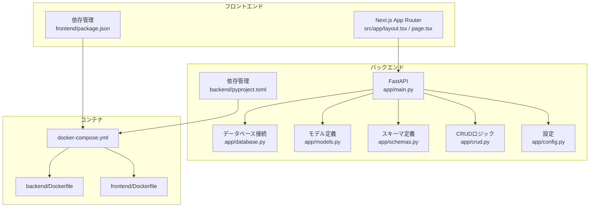
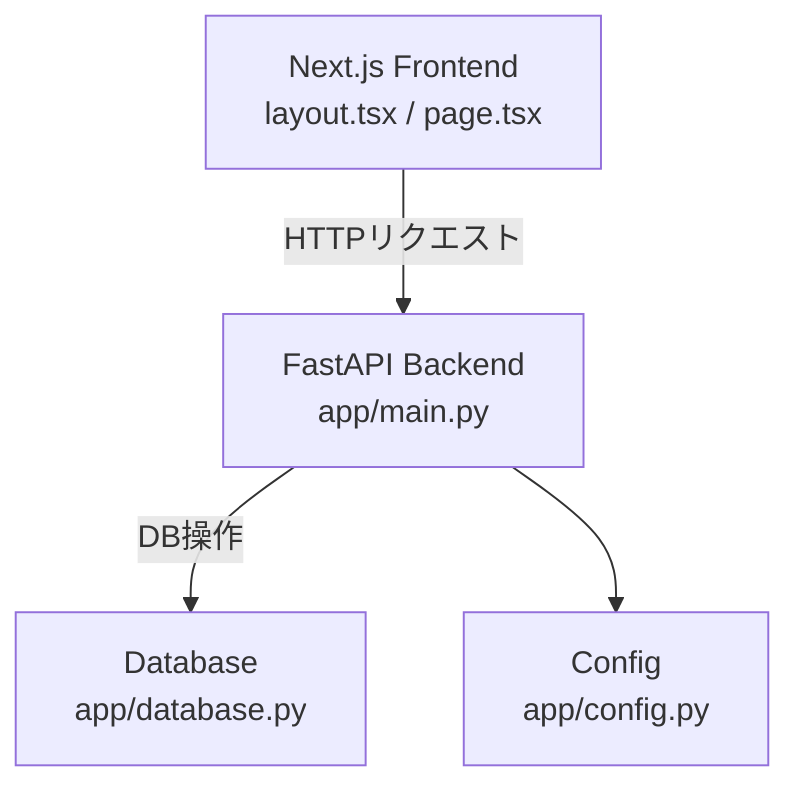
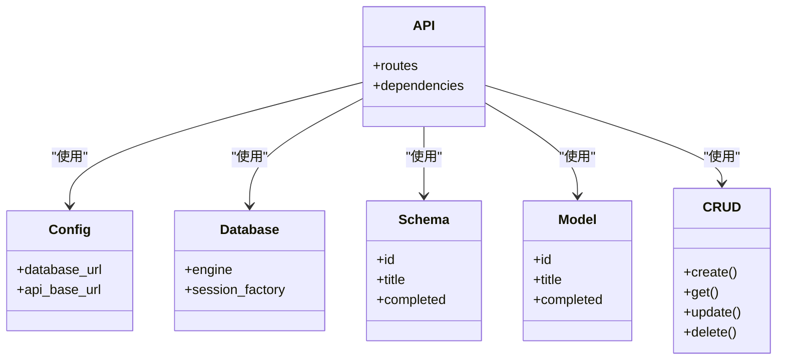
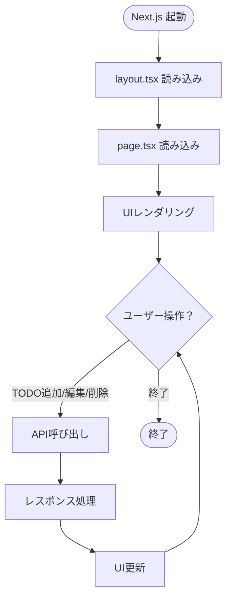
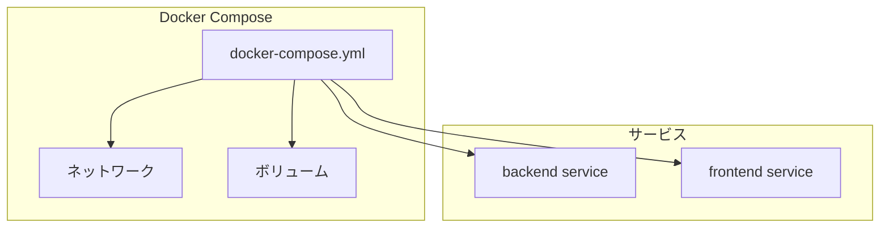
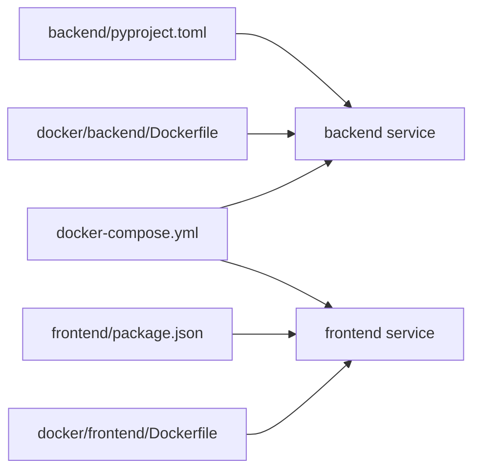

# プロジェクト概要

<cite>
**本ドキュメントで参照されるファイル**
- [backend/app/main.py](file://backend/app/main.py)
- [backend/main.py](file://backend/main.py)
- [backend/app/models.py](file://backend/app/models.py)
- [backend/app/schemas.py](file://backend/app/schemas.py)
- [backend/app/crud.py](file://backend/app/crud.py)
- [backend/app/database.py](file://backend/app/database.py)
- [backend/app/config.py](file://backend/app/config.py)
- [backend/pyproject.toml](file://backend/pyproject.toml)
- [frontend/src/app/layout.tsx](file://frontend/src/app/layout.tsx)
- [frontend/src/app/page.tsx](file://frontend/src/app/page.tsx)
- [frontend/package.json](file://frontend/package.json)
- [docker-compose.yml](file://docker-compose.yml)
- [docker/backend/Dockerfile](file://docker/backend/Dockerfile)
- [docker/frontend/Dockerfile](file://docker/frontend/Dockerfile)
- [docs/current_status.md](file://docs/current_status.md)
</cite>

## 目次
1. [導入](#導入)
2. [プロジェクト構造](#プロジェクト構造)
3. [コアコンポーネント](#コアコンポーネント)
4. [アーキテクチャ概観](#アーキテクチャ概観)
5. [詳細コンポーネント分析](#詳細コンポーネント分析)
6. [依存関係分析](#依存関係分析)
7. [パフォーマンス考慮事項](#パフォーマンス考慮事項)
8. [トラブルシューティングガイド](#トラブルシューティングガイド)
9. [結論](#結論)
10. [付録](#付録)

## 導入
本プロジェクトは、Next.js（フロントエンド）とFastAPI（バックエンド）を統合したフルスタックTODOアプリケーションです。Dockerコンテナ化された堅牢なアーキテクチャにより、開発・デプロイの効率性と再現性を高めています。  
- プロジェクトの目的：シンプルかつ拡張可能なTODO管理機能を提供し、React/TypeScriptによる現代的なフロントエンドとPython/FastAPIによる堅牢なバックエンドの統合を通じて、学習者にも実務者にも使いやすい環境を整備すること。  
- 主な機能：TODOのCRUD操作、認証・認可の基本的な実装、APIドキュメント（Swagger/OpenAPI）、Dockerによる環境構築。  
- 技術スタックの選定理由：Next.js（App Router、TypeScript、SSR/CSR対応）、FastAPI（型安全なAPI、自動ドキュメント、非同期処理）、Docker（依存関係の標準化）。  
- 開発チームへの利点：分離されたフロント/バックエンド、コンテナによる環境の一貫性、型安全なAPI設計によるバグ低減、自動ドキュメントによる連携の円滑化。

## プロジェクト構造
全体のディレクトリ構成は以下の通りです。  
- backend：FastAPIベースのAPIサーバー（Python、Pydantic、SQLAlchemy等）  
- frontend：Next.js（App Router、TypeScript、TailwindCSS）  
- docker：バックエンド/フロント用Dockerfile  
- docker-compose.yml：サービス間の連携設定  
- docs：プロジェクトの現在状況や方針文書  

**図の出典**
- [backend/app/main.py](file://backend/app/main.py)
- [backend/app/database.py](file://backend/app/database.py)
- [backend/app/models.py](file://backend/app/models.py)
- [backend/app/schemas.py](file://backend/app/schemas.py)
- [backend/app/crud.py](file://backend/app/crud.py)
- [backend/app/config.py](file://backend/app/config.py)
- [backend/pyproject.toml](file://backend/pyproject.toml)
- [frontend/src/app/layout.tsx](file://frontend/src/app/layout.tsx)
- [frontend/src/app/page.tsx](file://frontend/src/app/page.tsx)
- [frontend/package.json](file://frontend/package.json)
- [docker-compose.yml](file://docker-compose.yml)
- [docker/backend/Dockerfile](file://docker/backend/Dockerfile)
- [docker/frontend/Dockerfile](file://docker/frontend/Dockerfile)

**節の出典**
- [backend/app/main.py](file://backend/app/main.py)
- [frontend/src/app/layout.tsx](file://frontend/src/app/layout.tsx)
- [frontend/src/app/page.tsx](file://frontend/src/app/page.tsx)
- [docker-compose.yml](file://docker-compose.yml)

## コアコンポーネント
- APIエントリーポイント（FastAPI）：ルート定義、依存関係注入、例外ハンドリング、Swagger/OpenAPIドキュメントの提供。  
- モデル/スキーマ（Pydantic/SQLAlchemy）：データのバリデーション、ORMマッピング、API入出力の型定義。  
- CRUDロジック：データの作成・読取・更新・削除を行うビジネスロジック層。  
- 設定管理：環境変数、データベース接続文字列、APIの基本URLなどを一元管理。  
- フロントエンド（Next.js App Router）：レイアウト、ページコンポーネント、静的生成/動的生成、スタイル適用。  
- Docker設定：サービスごとのDockerfile、docker-composeによるネットワーク・ボリューム管理。

**節の出典**
- [backend/app/main.py](file://backend/app/main.py)
- [backend/app/models.py](file://backend/app/models.py)
- [backend/app/schemas.py](file://backend/app/schemas.py)
- [backend/app/crud.py](file://backend/app/crud.py)
- [backend/app/config.py](file://backend/app/config.py)
- [frontend/src/app/layout.tsx](file://frontend/src/app/layout.tsx)
- [frontend/src/app/page.tsx](file://frontend/src/app/page.tsx)
- [docker-compose.yml](file://docker-compose.yml)

## アーキテクチャ概観
本プロジェクトは「フロントエンド（Next.js）→バックエンド（FastAPI）→データベース」の3層構造を採用。  
- フロントエンドはApp Routerを使用し、layout.tsxで共通レイアウト、page.tsxでページコンポーネントを定義。  
- バックエンドはFastAPIでREST APIを提供し、依存関係（DB接続、設定、スキーマ）をDIで管理。  
- Dockerコンテナ化により、開発・本番環境での動作の一貫性を確保。  
- APIの型安全性と自動ドキュメントにより、フロントエンドとの連携がスムーズになる。

**図の出典**
- [frontend/src/app/layout.tsx](file://frontend/src/app/layout.tsx)
- [frontend/src/app/page.tsx](file://frontend/src/app/page.tsx)
- [backend/app/main.py](file://backend/app/main.py)
- [backend/app/database.py](file://backend/app/database.py)
- [backend/app/config.py](file://backend/app/config.py)

## 詳細コンポーネント分析

### バックエンド（FastAPI）
- エントリーポイント：ルート定義、ミドルウェア、例外ハンドラ、Swagger/OpenAPIの有効化。  
- 設定：環境変数からDB接続情報やAPI基本URLを取得。  
- モデル：ORMエンティティ（TODOなど）の定義。  
- スキーマ：Pydanticモデルによる入出力バリデーション。  
- CRUD：DB操作ロジック（作成・読取・更新・削除）。  
- 依存関係：DBセッション、設定、スキーマのDI。

**図の出典**
- [backend/app/config.py](file://backend/app/config.py)
- [backend/app/database.py](file://backend/app/database.py)
- [backend/app/schemas.py](file://backend/app/schemas.py)
- [backend/app/models.py](file://backend/app/models.py)
- [backend/app/crud.py](file://backend/app/crud.py)
- [backend/app/main.py](file://backend/app/main.py)

**節の出典**
- [backend/app/main.py](file://backend/app/main.py)
- [backend/app/config.py](file://backend/app/config.py)
- [backend/app/database.py](file://backend/app/database.py)
- [backend/app/schemas.py](file://backend/app/schemas.py)
- [backend/app/models.py](file://backend/app/models.py)
- [backend/app/crud.py](file://backend/app/crud.py)

### フロントエンド（Next.js App Router）
- 共通レイアウト：layout.tsxでサイト全体のHTML構造、メタ情報、スタイルを定義。  
- ページコンポーネント：page.tsxでTODO表示・編集UIを実装。  
- 依存管理：package.jsonでNext.js、TypeScript、TailwindCSS、開発依存を管理。  
- 動作確認：開発サーバー起動後、ブラウザでAPIエンドポイントにアクセス可能。

**図の出典**
- [frontend/src/app/layout.tsx](file://frontend/src/app/layout.tsx)
- [frontend/src/app/page.tsx](file://frontend/src/app/page.tsx)
- [frontend/package.json](file://frontend/package.json)

**節の出典**
- [frontend/src/app/layout.tsx](file://frontend/src/app/layout.tsx)
- [frontend/src/app/page.tsx](file://frontend/src/app/page.tsx)
- [frontend/package.json](file://frontend/package.json)

### Dockerコンテナ化
- backend/Dockerfile：Python環境、依存パッケージ、実行コマンドを定義。  
- frontend/Dockerfile：Node.js環境、依存パッケージ、ビルド/起動コマンドを定義。  
- docker-compose.yml：サービス間のネットワーク、ポートマッピング、ボリュームマウント、依存関係を記述。  
- これにより、開発者がローカルで一貫した環境でAPIとフロントを同時に起動可能。

**図の出典**
- [docker-compose.yml](file://docker-compose.yml)
- [docker/backend/Dockerfile](file://docker/backend/Dockerfile)
- [docker/frontend/Dockerfile](file://docker/frontend/Dockerfile)

**節の出典**
- [docker-compose.yml](file://docker-compose.yml)
- [docker/backend/Dockerfile](file://docker/backend/Dockerfile)
- [docker/frontend/Dockerfile](file://docker/frontend/Dockerfile)

## 依存関係分析
- バックエンド依存：FastAPI、SQLAlchemy、Pydantic、uvicorn（ASGIサーバー）、環境変数管理。  
- フロントエンド依存：Next.js、React、TypeScript、TailwindCSS、開発ツール群。  
- Docker依存：Python/Node.jsベースイメージ、ポート、環境変数、共有ネットワーク。  
- 依存関係の整合性：pyproject.toml、package.json、Dockerfile、docker-compose.ymlで一元管理。

**図の出典**
- [backend/pyproject.toml](file://backend/pyproject.toml)
- [frontend/package.json](file://frontend/package.json)
- [docker-compose.yml](file://docker-compose.yml)
- [docker/backend/Dockerfile](file://docker/backend/Dockerfile)
- [docker/frontend/Dockerfile](file://docker/frontend/Dockerfile)

**節の出典**
- [backend/pyproject.toml](file://backend/pyproject.toml)
- [frontend/package.json](file://frontend/package.json)
- [docker-compose.yml](file://docker-compose.yml)

## パフォーマンス考慮事項
- 非同期処理：FastAPIは非同期に対応しており、I/O重複を避けるために非同期関数を利用。  
- 型チェックとバリデーション：Pydanticによる入力検証により、無駄なDBアクセスを防ぐ。  
- DB接続プーリング：設定で接続プールを適切に設定することで、接続コストを削減。  
- 静的アセット配信：Next.jsの静的生成/最適化により、フロントエンドのパフォーマンス向上。  
- Dockerでのリソース管理：CPU/メモリ制限を設定することで、リソースの過剰消費を抑制。

## トラブルシューティングガイド
- API疎通確認：docker-composeでサービスが起動しているか、ポート番号が正しいか確認。  
- 環境変数：backend/app/config.pyで読み込まれる環境変数がdocker-compose.ymlで正しく設定されているか。  
- DB接続：backend/app/database.pyの接続文字列がconfig.pyから正しく取得できているか。  
- CORS問題：Next.jsからFastAPIにアクセスする際のオリジン設定が必要な場合がある。  
- TypeScript/型エラー：frontend/src/app/page.tsxでAPIレスポンスの型定義がschema.pyと一致しているか。  
- Dockerビルド失敗：backend/frontendのDockerfileで依存パッケージのインストール順序やキャッシュ戦略を見直す。

**節の出典**
- [backend/app/config.py](file://backend/app/config.py)
- [backend/app/database.py](file://backend/app/database.py)
- [frontend/src/app/page.tsx](file://frontend/src/app/page.tsx)
- [docker-compose.yml](file://docker-compose.yml)

## 結論
本プロジェクトは、Next.jsとFastAPIの統合、Dockerによる環境標準化を通じて、学習者にも実務者にも向いた堅牢なTODOアプリケーションの基盤を提供します。型安全なAPI設計、自動ドキュメント、コンテナ化された開発環境により、開発効率と保守性が向上します。今後の拡張として、認証・認可の強化、テストカバレッジの向上、CI/CDパイプラインの導入などが考えられます。

## 付録
- 開発手順の参考：docs/current_status.mdに記載されている現在の開発状況や方針を確認してください。  
- API仕様：FastAPIのSwagger/OpenAPIドキュメントをブラウザで確認可能（backend/app/main.pyで有効化）。  
- 依存パッケージ：backend/pyproject.toml、frontend/package.jsonを確認し、必要に応じてバージョンを更新してください。

**節の出典**
- [docs/current_status.md](file://docs/current_status.md)
- [backend/app/main.py](file://backend/app/main.py)
- [backend/pyproject.toml](file://backend/pyproject.toml)
- [frontend/package.json](file://frontend/package.json)