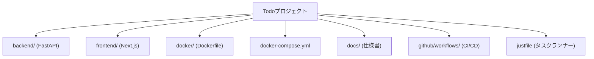
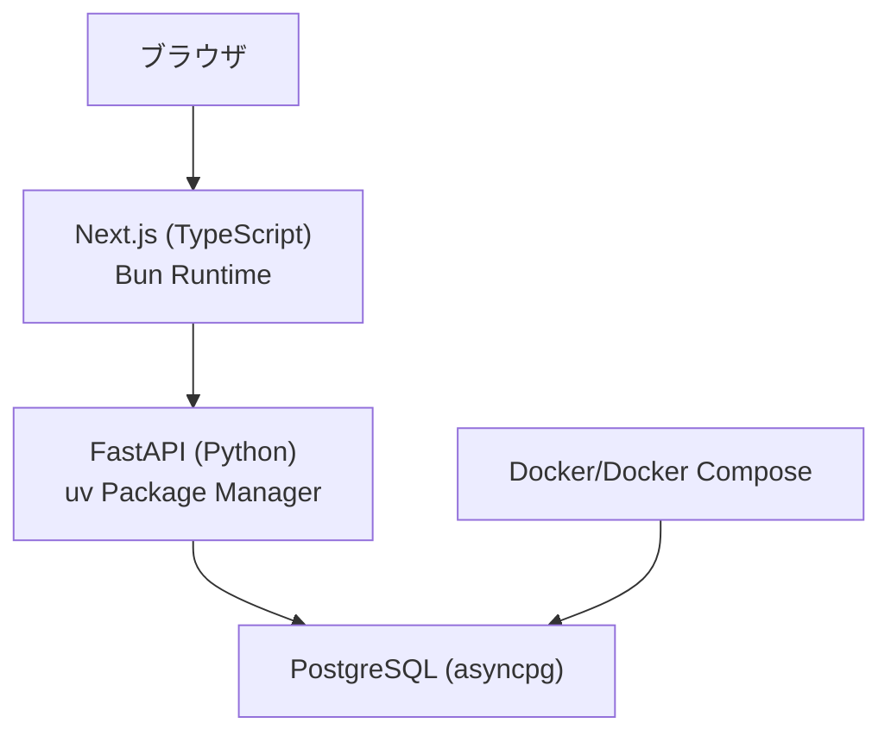
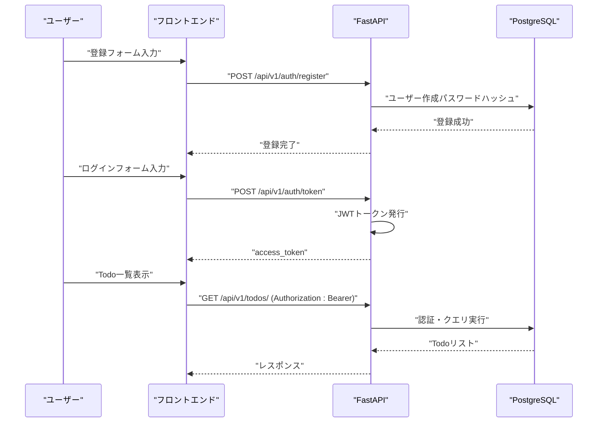
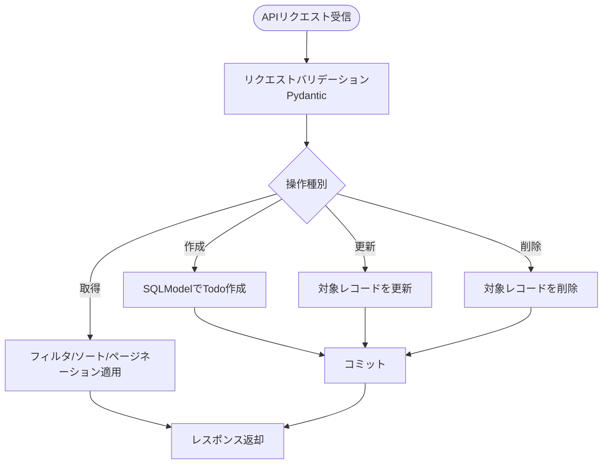
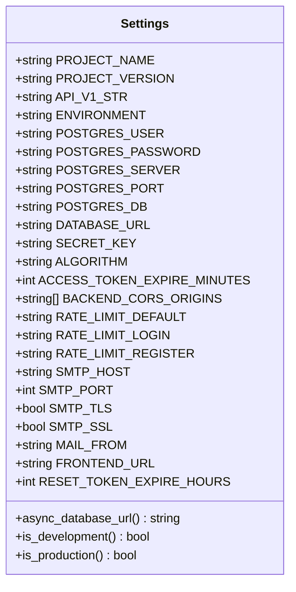
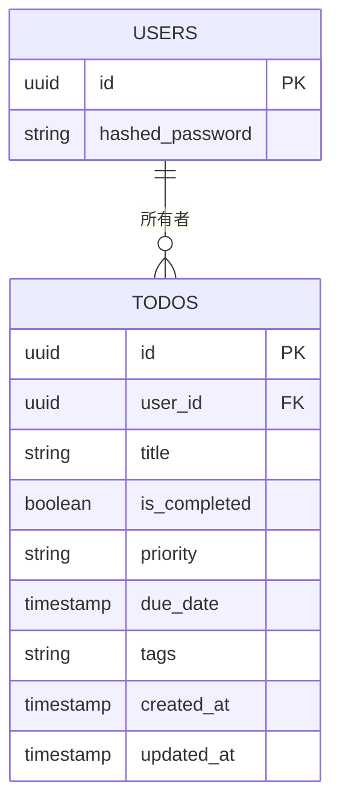
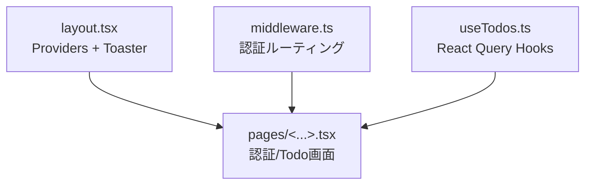
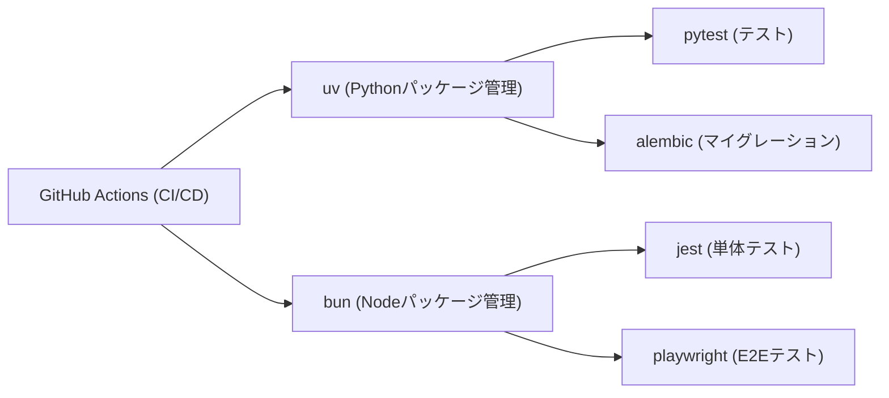

# プロジェクト概要

<cite>
**この文書で参照されるファイル**
- [README.md](file://README.md)
- [SPECIFICATION.md](file://SPECIFICATION.md)
- [backend/pyproject.toml](file://backend/pyproject.toml)
- [frontend/package.json](file://frontend/package.json)
- [docker-compose.yml](file://docker-compose.yml)
- [justfile](file://justfile)
- [.github/workflows/ci.yml](file://.github/workflows/ci.yml)
- [.github/workflows/e2e-tests.yml](file://.github/workflows/e2e-tests.yml)
- [docs/auth_specification.md](file://docs/auth_specification.md)
- [docs/current_status.md](file://docs/current_status.md)
- [backend/app/main.py](file://backend/app/main.py)
- [backend/app/api/api_v1/api.py](file://backend/app/api/api_v1/api.py)
- [backend/app/core/config.py](file://backend/app/core/config.py)
- [backend/app/models/user.py](file://backend/app/models/user.py)
- [backend/app/models/todo.py](file://backend/app/models/todo.py)
- [frontend/src/app/layout.tsx](file://frontend/src/app/layout.tsx)
- [frontend/src/middleware.ts](file://frontend/src/middleware.ts)
- [frontend/src/hooks/useTodos.ts](file://frontend/src/hooks/useTodos.ts)
</cite>

## 目次
1. [導入](#導入)
2. [プロジェクト構造](#プロジェクト構造)
3. [コアコンポーネント](#コアコンポーネント)
4. [アーキテクチャ概観](#アーキテクチャ概観)
5. [詳細コンポーネント分析](#詳細コンポーネント分析)
6. [依存関係分析](#依存関係分析)
7. [パフォーマンス考慮事項](#パフォーマンス考慮事項)
8. [トラブルシューティングガイド](#トラブルシューティングガイド)
9. [結論](#結論)
10. [付録](#付録)

## 導入
本プロジェクトは、モダンなツールチェーン（Bun、uv、Jujutsu）を活用したTodoアプリケーションです。FastAPI（バックエンド）とNext.js（フロントエンド）をベースに、JWT認証、リアルタイム更新、レート制限、構造化ログ、E2Eテストを備えたポートフォリオ用途の教育型フルスタックアプリケーションです。

主な目的と目標：
- 現代的な開発手法とツールの実践例を示す
- 認証・Todo管理機能を網羅的に実装し、動作を検証する
- Dockerによるコンテナ化、GitHub ActionsによるCI/CDを実装し、運用基盤を整備する
- 学習者にも理解しやすい設計とドキュメントを提供する

**節の出典**
- [README.md:1-294](file://README.md#L1-L294)
- [SPECIFICATION.md:1-147](file://SPECIFICATION.md#L1-L147)

## プロジェクト構造
全体のディレクトリ構造は以下の通りです。バックエンド（FastAPI）、フロントエンド（Next.js）、Docker、CI/CD、ドキュメントが分離されています。

```mermaid
graph TB
root["Todoプロジェクト"]
backend["backend/ (FastAPI)"]
frontend["frontend/ (Next.js)"]
docker["docker/ (Dockerfile)"]
compose["docker-compose.yml"]
docs["docs/ (仕様書)"]
gh["github/workflows/ (CI/CD)"]
just["justfile (タスクランナー)"]
root --> backend
root --> frontend
root --> docker
root --> compose
root --> docs
root --> gh
root --> just
```

**図の出典**
- [README.md:216-242](file://README.md#L216-L242)

**節の出典**
- [README.md:216-242](file://README.md#L216-L242)
- [SPECIFICATION.md:99-115](file://SPECIFICATION.md#L99-L115)

## コアコンポーネント
- 認証（JWTベース）：ユーザー登録、ログイン、トークン発行、保護ルート
- Todo管理：CRUD、検索・フィルタ・ソート・ページネーション
- APIドキュメント：ScalarによるインタラクティブなAPIリファレンス
- 構造化ログ：JSON形式でのリクエスト/レスポンス追跡
- レート制限：認証系エンドポイントにSlowAPIによる保護
- E2Eテスト：Playwrightによる認証・Todoフローの自動テスト

**節の出典**
- [README.md:12-21](file://README.md#L12-L21)
- [docs/auth_specification.md:1-65](file://docs/auth_specification.md#L1-L65)
- [backend/app/main.py:120-127](file://backend/app/main.py#L120-L127)

## アーキテクチャ概観
システムの全体像は以下の通りです。クライアントブラウザからNext.jsフロントエンド、REST API経由でFastAPIバックエンド、PostgreSQLデータベースへアクセスします。

```mermaid
graph TB
browser["ブラウザ"]
nextjs["Next.js (TypeScript)<br/>Bun Runtime"]
fastapi["FastAPI (Python)<br/>uv Package Manager"]
db["PostgreSQL (asyncpg)"]
docker["Docker/Docker Compose"]
browser --> nextjs
nextjs --> fastapi
fastapi --> db
docker --> db
```

**図の出典**
- [README.md:60-102](file://README.md#L60-L102)
- [SPECIFICATION.md:8-27](file://SPECIFICATION.md#L8-L27)

**節の出典**
- [README.md:60-102](file://README.md#L60-L102)
- [SPECIFICATION.md:8-27](file://SPECIFICATION.md#L8-L27)

## 詳細コンポーネント分析

### 認証フロー（JWT）
認証プロセスの流れは以下の通りです。登録→トークン取得→保護ルートへのアクセス（Bearer認証）。

```mermaid
sequenceDiagram
participant U as "ユーザー"
participant FE as "フロントエンド"
participant BE as "FastAPI"
participant DB as "PostgreSQL"
U->>FE : "登録フォーム入力"
FE->>BE : "POST /api/v1/auth/register"
BE->>DB : "ユーザー作成パスワードハッシュ"
DB-->>BE : "登録成功"
BE-->>FE : "登録完了"
U->>FE : "ログインフォーム入力"
FE->>BE : "POST /api/v1/auth/token"
BE->>BE : "JWTトークン発行"
BE-->>FE : "access_token"
U->>FE : "Todo一覧表示"
FE->>BE : "GET /api/v1/todos/ (Authorization : Bearer)"
BE->>DB : "認証・クエリ実行"
DB-->>BE : "Todoリスト"
BE-->>FE : "レスポンス"
```

**図の出典**
- [README.md:106-111](file://README.md#L106-L111)
- [docs/auth_specification.md:11-47](file://docs/auth_specification.md#L11-L47)

**節の出典**
- [README.md:106-111](file://README.md#L106-L111)
- [docs/auth_specification.md:11-47](file://docs/auth_specification.md#L11-L47)

### Todo CRUDフロー
Todoの作成・取得・更新・削除の処理フローを以下に示します。

```mermaid
flowchart TD
Start(["APIリクエスト受信"]) --> Validate["リクエストバリデーション<br/>Pydantic"]
Validate --> Decision{"操作種別"}
Decision --> |作成| Create["SQLModelでTodo作成"]
Decision --> |取得| Fetch["フィルタ/ソート/ページネーション適用"]
Decision --> |更新| Update["対象レコードを更新"]
Decision --> |削除| Delete["対象レコードを削除"]
Create --> Commit["コミット"]
Fetch --> Return["レスポンス返却"]
Update --> Commit
Delete --> Commit
Commit --> Return
```

**図の出典**
- [README.md:113-126](file://README.md#L113-L126)

**節の出典**
- [README.md:113-126](file://README.md#L113-L126)

### API設計（要約）
- 認証系：`/api/v1/auth/register`、`/api/v1/auth/token`
- Todo系：`/api/v1/todos/`（GET/POST/PUT/DELETE）、`/api/v1/todos/count`
- 共通：`/health`（ヘルスチェック）

**節の出典**
- [README.md:128-142](file://README.md#L128-L142)

### 設定管理（Settings）
設定は環境変数ベースで管理され、開発・本番の差異を吸収します。DB接続文字列、JWT設定、CORS、レートリミット、メール設定などが含まれます。

```mermaid
classDiagram
class Settings {
+string PROJECT_NAME
+string PROJECT_VERSION
+string API_V1_STR
+string ENVIRONMENT
+string POSTGRES_USER
+string POSTGRES_PASSWORD
+string POSTGRES_SERVER
+string POSTGRES_PORT
+string POSTGRES_DB
+string DATABASE_URL
+string SECRET_KEY
+string ALGORITHM
+int ACCESS_TOKEN_EXPIRE_MINUTES
+string[] BACKEND_CORS_ORIGINS
+string RATE_LIMIT_DEFAULT
+string RATE_LIMIT_LOGIN
+string RATE_LIMIT_REGISTER
+string SMTP_HOST
+int SMTP_PORT
+bool SMTP_TLS
+bool SMTP_SSL
+string MAIL_FROM
+string FRONTEND_URL
+int RESET_TOKEN_EXPIRE_HOURS
+async_database_url() string
+is_development() bool
+is_production() bool
}
```

**図の出典**
- [backend/app/core/config.py:4-91](file://backend/app/core/config.py#L4-L91)

**節の出典**
- [backend/app/core/config.py:4-91](file://backend/app/core/config.py#L4-L91)

### データモデル（SQLModel）
UserとTodoの関係性、ユニークID、外部キー、インデックスが定義されています。

```mermaid
erDiagram
USERS {
uuid id PK
string hashed_password
}
TODOS {
uuid id PK
uuid user_id FK
string title
boolean is_completed
string priority
timestamp due_date
string tags
timestamp created_at
timestamp updated_at
}
USERS ||--o{ TODOS : "所有者"
```

**図の出典**
- [backend/app/models/user.py:9-15](file://backend/app/models/user.py#L9-L15)
- [backend/app/models/todo.py:10-24](file://backend/app/models/todo.py#L10-L24)

**節の出典**
- [backend/app/models/user.py:9-15](file://backend/app/models/user.py#L9-L15)
- [backend/app/models/todo.py:10-24](file://backend/app/models/todo.py#L10-L24)

### フロントエンド構成（Next.js）
- App Router、UIコンポーネント（shadcn/ui）、Tailwind CSS
- TanStack React Queryによるサーバー状態管理
- Sonnerによる通知、React Hook Form + Zodによるフォームバリデーション
- 認証不要なパブリックページ（ログイン/登録/パスワードリセット）と認証が必要なページのミドルウェア

```mermaid
graph TB
layout["layout.tsx<br/>Providers + Toaster"]
mw["middleware.ts<br/>認証ルーティング"]
hooks["useTodos.ts<br/>React Query Hooks"]
pages["pages/<...>.tsx<br/>認証/Todo画面"]
layout --> pages
mw --> pages
hooks --> pages
```

**図の出典**
- [frontend/src/app/layout.tsx:17-39](file://frontend/src/app/layout.tsx#L17-L39)
- [frontend/src/middleware.ts:7-26](file://frontend/src/middleware.ts#L7-L26)
- [frontend/src/hooks/useTodos.ts:26-118](file://frontend/src/hooks/useTodos.ts#L26-L118)

**節の出典**
- [frontend/src/app/layout.tsx:17-39](file://frontend/src/app/layout.tsx#L17-L39)
- [frontend/src/middleware.ts:7-26](file://frontend/src/middleware.ts#L7-L26)
- [frontend/src/hooks/useTodos.ts:26-118](file://frontend/src/hooks/useTodos.ts#L26-L118)

## 依存関係分析
- バックエンド（FastAPI）：uvによる依存管理、pytestによるテスト、alembicによるマイグレーション
- フロントエンド（Next.js）：bunによる依存管理、Jestによる単体テスト、PlaywrightによるE2Eテスト
- CI/CD：GitHub ActionsによるLint、テスト、ビルド、Dockerイメージビルド

```mermaid
graph LR
uv["uv (Pythonパッケージ管理)"]
pytest["pytest (テスト)"]
alembic["alembic (マイグレーション)"]
bun["bun (Nodeパッケージ管理)"]
jest["jest (単体テスト)"]
pw["playwright (E2Eテスト)"]
gh["GitHub Actions (CI/CD)"]
uv --> pytest
uv --> alembic
bun --> jest
bun --> pw
gh --> uv
gh --> bun
```

**図の出典**
- [backend/pyproject.toml:27-35](file://backend/pyproject.toml#L27-L35)
- [frontend/package.json:5-17](file://frontend/package.json#L5-L17)
- [.github/workflows/ci.yml:23-38](file://.github/workflows/ci.yml#L23-L38)
- [.github/workflows/e2e-tests.yml:31-54](file://.github/workflows/e2e-tests.yml#L31-L54)

**節の出典**
- [backend/pyproject.toml:27-35](file://backend/pyproject.toml#L27-L35)
- [frontend/package.json:5-17](file://frontend/package.json#L5-L17)
- [.github/workflows/ci.yml:23-38](file://.github/workflows/ci.yml#L23-L38)
- [.github/workflows/e2e-tests.yml:31-54](file://.github/workflows/e2e-tests.yml#L31-L54)

## パフォーマンス考慮事項
- フロントエンド：ビルド最適化、バンドルサイズの削減、不要な再描画の抑制
- バックエンド：SQLクエリのN+1防止、適切なインデックスの活用、キャッシュ戦略の導入
- API：レスポンスタイムの監視（X-Process-Timeヘッダー）、エラーハンドリングの効率化
- 運用：構造化ログによるトレースIDの追加、モニタリング指標の可視化

[この節は一般的なガイダンスであり、特定のファイルを直接分析していません]

## トラブルシューティングガイド
- 起動・停止・ログ確認：`just up/dev/logs/down`、`just backend-logs/frontend-logs/db-logs`
- DBリセット：`just clean-db`
- マイグレーション：`just db-migrate/db-rollback/db-revision MESSAGE="..."`、`just db-version/db-history`
- 環境変数：`.env`の設定確認（DB接続、JWTシークレット、SMTP設定）

**節の出典**
- [justfile:3-69](file://justfile#L3-L69)
- [docs/current_status.md:50-61](file://docs/current_status.md#L50-L61)

## 結論
本プロジェクトは、教育・ポートフォリオ目的のモダンなTodoアプリケーションとして、FastAPI＋Next.js＋PostgreSQLの組み合わせに加え、Bun、uv、Jujutsuといった最新ツールチェーンを活用して、開発効率性と保守性を両立させた実践的な基盤を提供しています。認証・Todo管理・APIドキュメント・構造化ログ・レート制限・E2Eテスト・CI/CDが一貫して実装されており、初心者にも理解しやすい設計とドキュメントが整っています。

[この節は要約であり、特定のファイルを直接分析していません]

## 付録
- 開発環境のセットアップ手順（Docker起動、ローカル起動、Jujutsu初期化）
- API仕様書（認証・Todo系エンドポイント）
- 現状まとめ（インフラ構築・プロジェクト構成・タスク一覧・進捗状況）

**節の出典**
- [SPECIFICATION.md:119-147](file://SPECIFICATION.md#L119-L147)
- [docs/auth_specification.md:1-65](file://docs/auth_specification.md#L1-L65)
- [docs/current_status.md:1-85](file://docs/current_status.md#L1-L85)