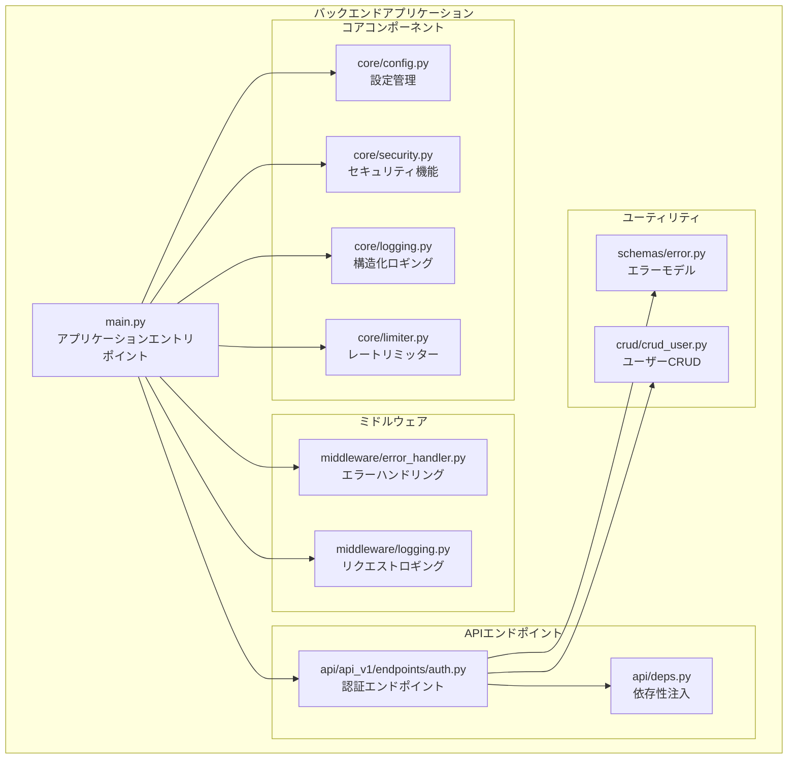
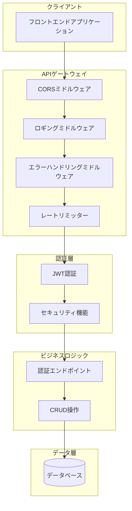
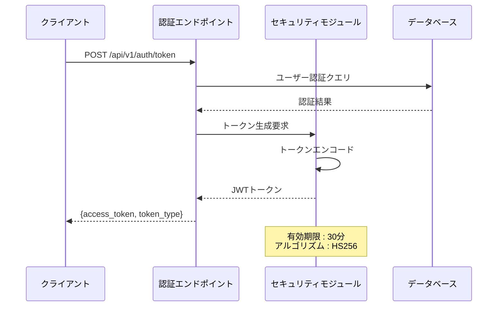
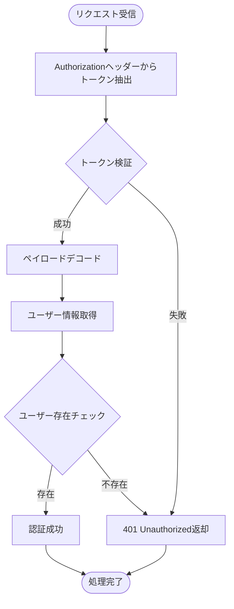
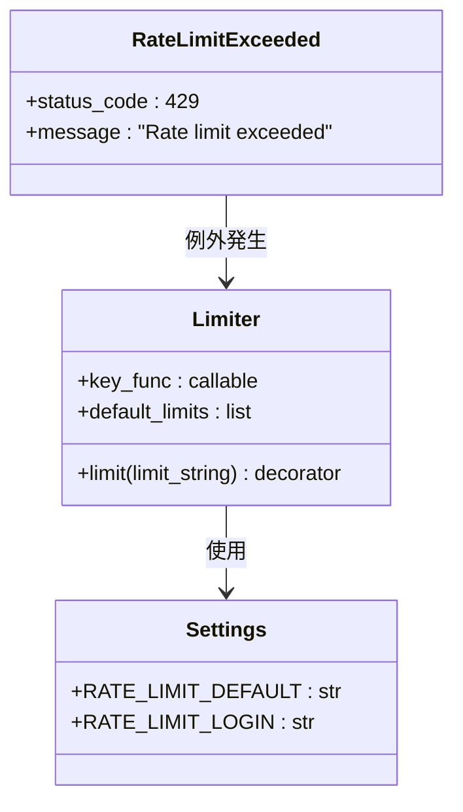
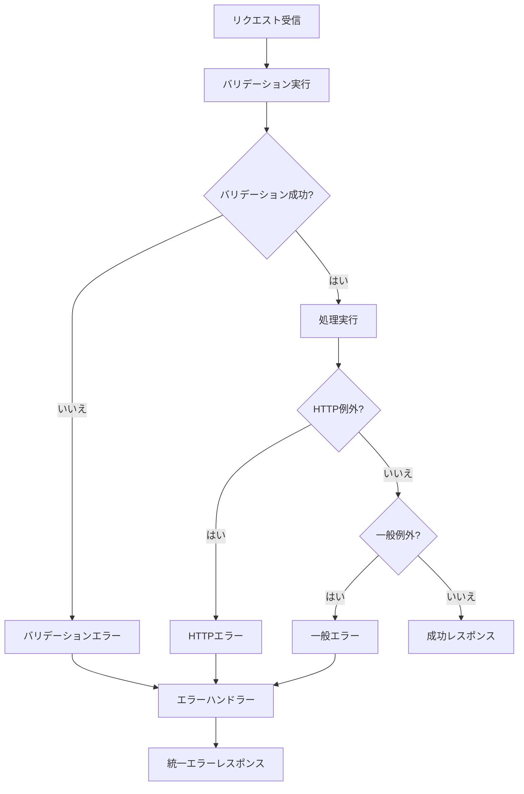
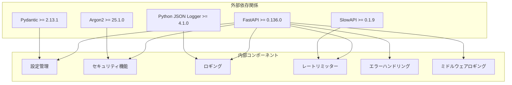

# ミドルウェアとセキュリティ

<cite>
**このドキュメントで参照されるファイル**
- [main.py](file://backend/app/main.py)
- [config.py](file://backend/app/core/config.py)
- [security.py](file://backend/app/core/security.py)
- [logging.py](file://backend/app/core/logging.py)
- [limiter.py](file://backend/app/core/limiter.py)
- [error_handler.py](file://backend/app/middleware/error_handler.py)
- [middleware_logging.py](file://backend/app/middleware/logging.py)
- [error_schemas.py](file://backend/app/schemas/error.py)
- [auth_endpoint.py](file://backend/app/api/api_v1/endpoints/auth.py)
- [deps.py](file://backend/app/api/deps.py)
- [crud_user.py](file://backend/app/crud/crud_user.py)
- [pyproject.toml](file://backend/pyproject.toml)
</cite>

## 目次
1. [導入](#導入)
2. [プロジェクト構造](#プロジェクト構造)
3. [コアコンポーネント](#コアコンポーネント)
4. [アーキテクチャ概観](#アーキテクチャ概観)
5. [詳細コンポーネント分析](#詳細コンポーネント分析)
6. [依存関係分析](#依存関係分析)
7. [パフォーマンス考慮事項](#パフォーマンス考慮事項)
8. [トラブルシューティングガイド](#トラブルシューティングガイド)
9. [結論](#結論)

## 導入

このTodo APIプロジェクトでは、堅牢なミドルウェアとセキュリティ対策が実装されています。本ドキュメントでは、CORS設定、エラーハンドリングミドルウェア、レートリミッターの実装、JWTトークンの検証、パスワードハッシュ化、入力バリデーションについて詳細に解説します。さらに、構造化ロギング（JSONフォーマット）、ヘルスチェックエンドポイント、セキュリティ監査の仕組みについても説明します。

## プロジェクト構造

バックエンドアプリケーションは以下の主要なディレクトリ構成を持っています：



**図の出典**
- [main.py:1-164](file://backend/app/main.py#L1-L164)
- [config.py:1-60](file://backend/app/core/config.py#L1-L60)

**セクションの出典**
- [main.py:1-164](file://backend/app/main.py#L1-L164)
- [config.py:1-60](file://backend/app/core/config.py#L1-L60)

## コアコンポーネント

### CORS設定

アプリケーションはFastAPIのCORSMiddlewareを使用してクロスオリジンリクエストを制御しています。設定は以下の通りです：

- **許可されたオリジン**: localhost:3000、127.0.0.1:3000、localhost:8000
- **資格情報の許可**: true
- **メソッド**: すべてのHTTPメソッド
- **ヘッダー**: すべてのカスタムヘッダー

### 構造化ロギング

JSONフォーマットを使用した構造化ロギングが実装されており、以下の要素を含みます：
- タイムスタンプ
- ロガー名
- ログレベル
- メッセージ
- ファイル名
- 関数名
- 行番号

**セクションの出典**
- [main.py:104-111](file://backend/app/main.py#L104-L111)
- [logging.py:6-36](file://backend/app/core/logging.py#L6-L36)

## アーキテクチャ概観



**図の出典**
- [main.py:104-115](file://backend/app/main.py#L104-L115)
- [error_handler.py:15-149](file://backend/app/middleware/error_handler.py#L15-L149)
- [security.py:17-35](file://backend/app/core/security.py#L17-L35)

## 詳細コンポーネント分析

### JWTトークン認証システム

JWT（JSON Web Token）を使用した認証システムは以下の要素で構成されます：

#### トークン生成プロセス



**図の出典**
- [auth_endpoint.py:34-53](file://backend/app/api/api_v1/endpoints/auth.py#L34-L53)
- [security.py:17-27](file://backend/app/core/security.py#L17-L27)

#### トークン検証プロセス



**図の出典**
- [deps.py:12-31](file://backend/app/api/deps.py#L12-L31)
- [security.py:29-35](file://backend/app/core/security.py#L29-L35)

**セクションの出典**
- [auth_endpoint.py:34-53](file://backend/app/api/api_v1/endpoints/auth.py#L34-L53)
- [deps.py:12-31](file://backend/app/api/deps.py#L12-L31)
- [security.py:17-35](file://backend/app/core/security.py#L17-L35)

### レートリミッター実装

SlowAPIを使用したレートリミッターは以下の設定で動作します：

#### デフォルト制限
- **通常リクエスト**: 100リクエスト/分
- **IPアドレスベース**: `get_remote_address`関数を使用

#### 特殊制限
- **ログインエンドポイント**: 5リクエスト/分
- **ユーザー登録エンドポイント**: 5リクエスト/分



**図の出典**
- [limiter.py:1-7](file://backend/app/core/limiter.py#L1-L7)
- [config.py:50-53](file://backend/app/core/config.py#L50-L53)

**セクションの出典**
- [limiter.py:1-7](file://backend/app/core/limiter.py#L1-L7)
- [config.py:50-53](file://backend/app/core/config.py#L50-L53)

### エラーハンドリングミドルウェア

統一されたエラーレスポンススキーマを提供するエラーハンドリングシステム：

#### エラーレスポンススキーマ

| フィールド | 型 | 説明 |
|------------|----|------|
| status_code | int | HTTPステータスコード |
| detail | str | 技術的なエラー詳細 |
| message | str | ユーザーに表示されるメッセージ |
| error_code | str | 固定エラーコード |
| details | list | 詳細なエラー情報 |

#### 例外ハンドラー



**図の出典**
- [error_handler.py:15-149](file://backend/app/middleware/error_handler.py#L15-L149)
- [error_schemas.py:5-23](file://backend/app/schemas/error.py#L5-L23)

**セクションの出典**
- [error_handler.py:15-149](file://backend/app/middleware/error_handler.py#L15-L149)
- [error_schemas.py:5-23](file://backend/app/schemas/error.py#L5-L23)

### 構造化ロギング

JSONフォーマットの構造化ロギングは以下の要素を含みます：

#### ログ出力例
```json
{
  "asctime": "2024-01-15T10:30:45",
  "name": "app",
  "levelname": "INFO",
  "message": "Request completed",
  "filename": "logging.py",
  "funcName": "dispatch",
  "lineno": 37,
  "method": "GET",
  "url": "http://localhost:8000/api/v1/todos",
  "status_code": 200,
  "process_time": 0.1234
}
```

#### ロギングミドルウェア機能
- **リクエスト開始ログ**: メソッド、URL、クライアントIP
- **リクエスト完了ログ**: 処理時間、ステータスコード
- **エラーログ**: 例外情報、処理時間
- **レスポンスヘッダー**: `X-Process-Time`追加

**セクションの出典**
- [middleware_logging.py:10-67](file://backend/app/middleware/logging.py#L10-L67)
- [logging.py:6-36](file://backend/app/core/logging.py#L6-L36)

### 入力バリデーション

Pydanticを使用した入力バリデーション：

#### 認証エンドポイントバリデーション
- **ユーザー登録**: UserCreateスキーマ
- **ログイン**: OAuth2PasswordRequestForm

#### バリデーションエラーハンドリング
- **エラーレスポンス**: ValidationErrorDetailスキーマ
- **フィールドマッピング**: `field`、`message`、`value`
- **エラーログ**: 詳細なエラー情報の記録

**セクションの出典**
- [auth_endpoint.py:17-32](file://backend/app/api/api_v1/endpoints/auth.py#L17-L32)
- [auth_endpoint.py:34-53](file://backend/app/api/api_v1/endpoints/auth.py#L34-L53)
- [error_handler.py:15-50](file://backend/app/middleware/error_handler.py#L15-L50)

### ヘルスチェックエンドポイント

`/health`エンドポイントは以下の情報を提供します：

#### ヘルスチェック内容
- **全体ステータス**: ok/error
- **バージョン情報**: APIバージョン
- **コンポーネント状態**: 各サービスの健全性
- **データベース接続**: 接続テスト実施

#### レスポンス例
```json
{
  "status": "ok",
  "version": "0.1.0",
  "components": {
    "database": {
      "status": "ok",
      "message": "Database connection established"
    }
  }
}
```

**セクションの出典**
- [main.py:130-164](file://backend/app/main.py#L130-L164)

## 依存関係分析



**図の出典**
- [pyproject.toml:7-23](file://backend/pyproject.toml#L7-L23)
- [pyproject.toml:25-31](file://backend/pyproject.toml#L25-L31)

**セクションの出典**
- [pyproject.toml:1-47](file://backend/pyproject.toml#L1-L47)

## パフォーマンス考慮事項

### トークン認証のパフォーマンス
- **JWT検証**: O(1)時間複雑度
- **パスワードハッシュ**: Argon2を使用（計算コスト高）
- **キャッシュ戦略**: トークンの再生成を最小限に抑える

### レートリミッターのパフォーマンス
- **Redis使用**: 100リクエスト/分の制限
- **IPアドレスベース**: 高速なキー生成
- **メモリ効率**: キャッシュを使用した高速アクセス

### ロギングのパフォーマンス
- **非同期ロギング**: 処理のブロックを防ぐ
- **JSONフォーマット**: 高速なシリアル化
- **コンソール出力**: I/Oのオーバーヘッドを最小化

## トラブルシューティングガイド

### 一般的な問題と解決方法

#### CORSエラー
- **症状**: フロントエンドからのリクエストがブロックされる
- **原因**: 許可されていないオリジンからのアクセス
- **解決**: `BACKEND_CORS_ORIGINS`にオリジンを追加

#### 認証エラー
- **症状**: 401エラーが発生
- **原因**: 有効期限切れのトークン、無効なクレデンシャル
- **解決**: 新しいトークンを取得し、再度認証

#### レートリミット超過
- **症状**: 429エラーが発生
- **原因**: 制限を超えるリクエスト
- **解決**: 待機時間後に再度試行

#### データベース接続エラー
- **症状**: ヘルスチェックでエラー
- **原因**: 接続文字列の誤り、サーバー停止
- **解決**: 接続設定の確認、サーバーの再起動

**セクションの出典**
- [error_handler.py:107-123](file://backend/app/middleware/error_handler.py#L107-L123)
- [main.py:130-164](file://backend/app/main.py#L130-L164)

## 結論

このTodo APIプロジェクトは、堅牢なセキュリティ対策と効率的なミドルウェアアーキテクチャを実装しています。主な特徴には以下のものが含まれます：

- **CORS設定**: 明確なオリジン制御によるセキュリティ強化
- **JWT認証**: 有効期限付きトークンによるセキュアな認証
- **レートリミッター**: SlowAPIを使用したリクエスト制御
- **構造化ロギング**: JSONフォーマットによる詳細な監視
- **統一エラーハンドリング**: 明確なエラーレスポンススキーマ
- **ヘルスチェック**: システム健全性のリアルタイム監視

これらのコンポーネントは相互に連携し、堅牢で運用可能なAPIエコシステムを形成しています。今後の改善点として、Redisを使用したレートリミッターの永続化や、より詳細なセキュリティ監査ログの追加が考えられます。