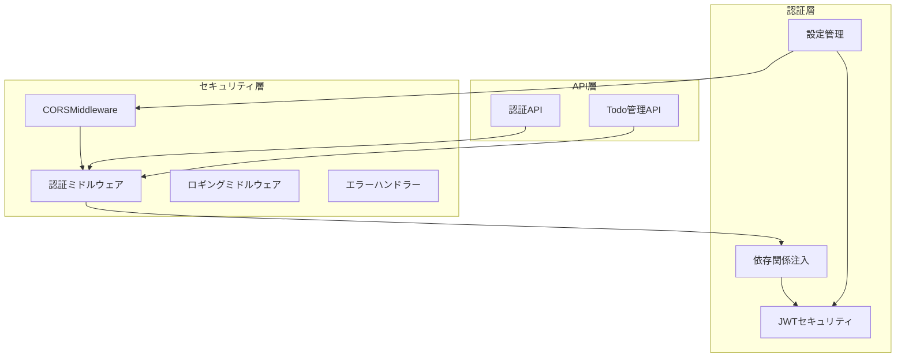
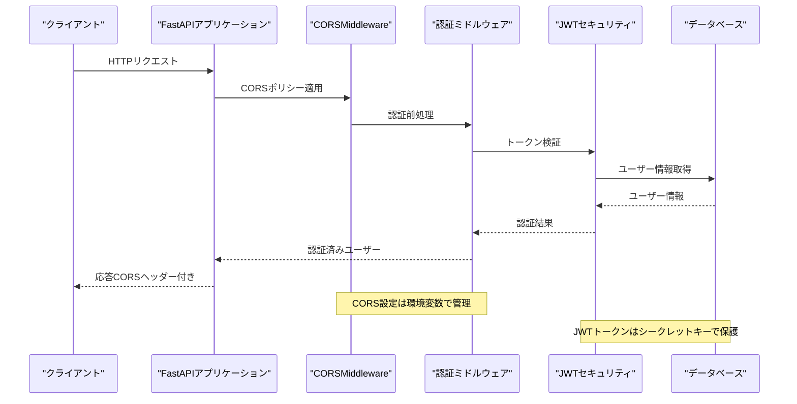
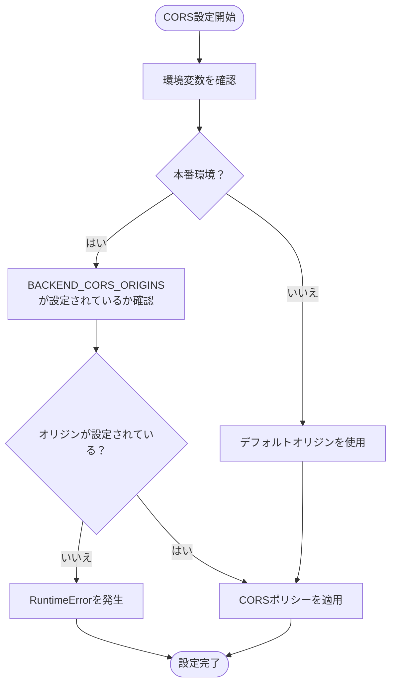
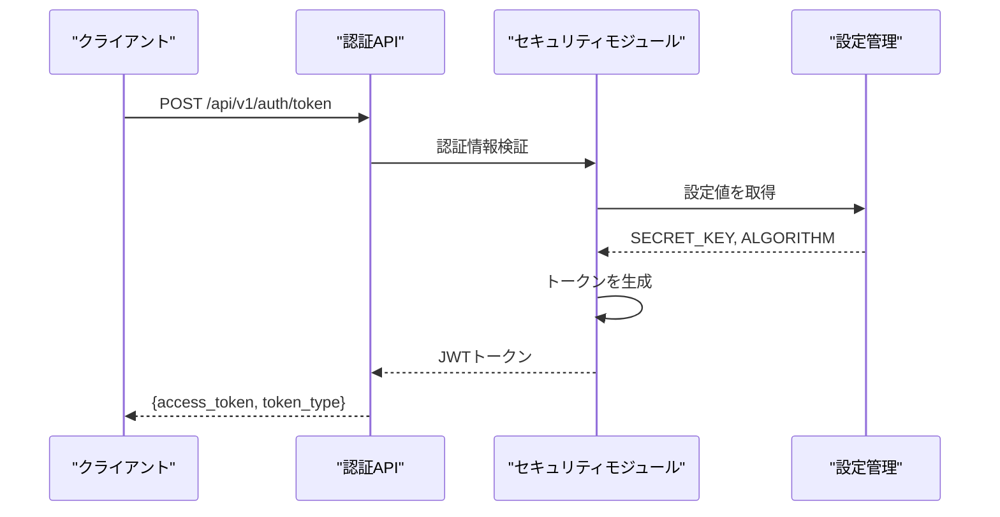
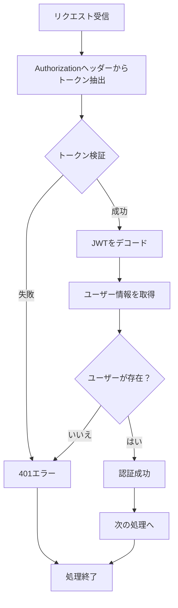
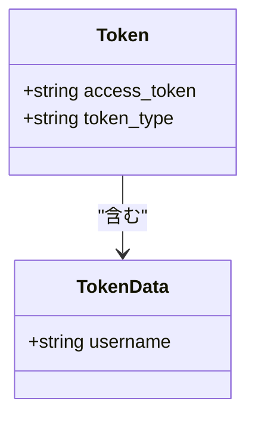
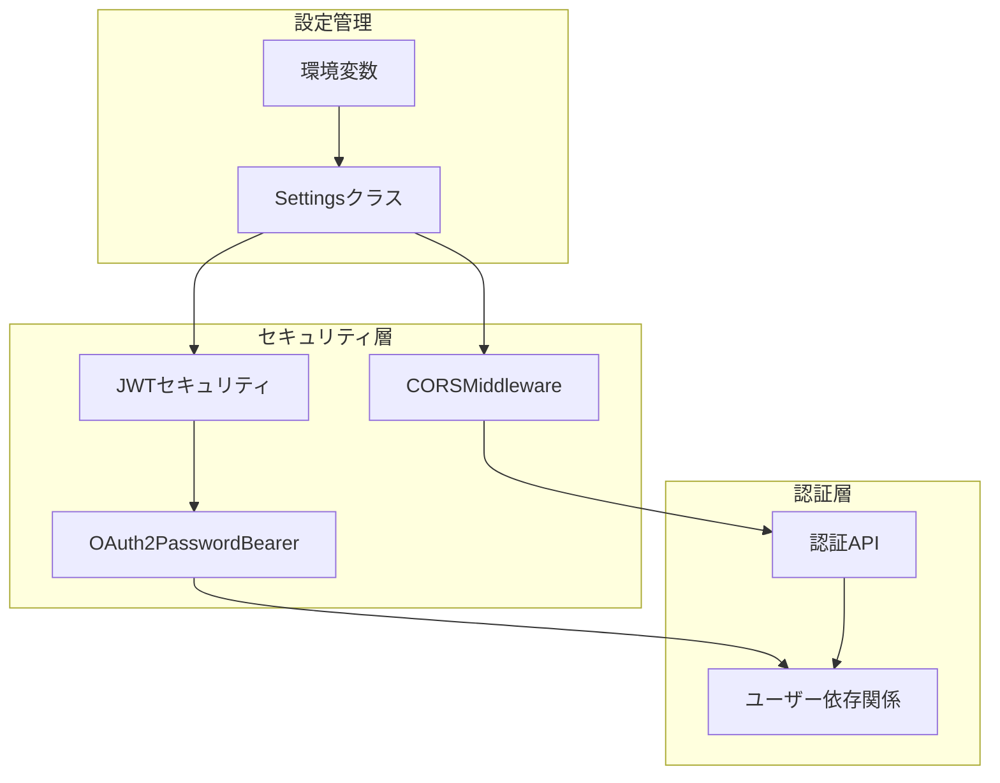

# CORS設定とセキュリティ構成

<cite>
**本文で参照されたファイル**
- [backend/app/main.py](file://backend/app/main.py)
- [backend/app/core/config.py](file://backend/app/core/config.py)
- [backend/app/core/security.py](file://backend/app/core/security.py)
- [backend/app/api/deps.py](file://backend/app/api/deps.py)
- [backend/app/api/api_v1/endpoints/auth.py](file://backend/app/api/api_v1/endpoints/auth.py)
- [backend/app/middleware/logging.py](file://backend/app/middleware/logging.py)
- [backend/app/middleware/error_handler.py](file://backend/app/middleware/error_handler.py)
- [backend/app/schemas/token.py](file://backend/app/schemas/token.py)
</cite>

## 目次
1. [はじめに](#はじめに)
2. [プロジェクト構造](#プロジェクト構造)
3. [コアコンポーネント](#コアコンポーネント)
4. [アーキテクチャ概要](#アーキテクチャ概要)
5. [詳細コンポーネント分析](#詳細コンポーネント分析)
6. [依存関係分析](#依存関係分析)
7. [パフォーマンス考慮事項](#パフォーマンス考慮事項)
8. [トラブルシューティングガイド](#トラブルシューティングガイド)
9. [結論](#結論)

## はじめに
本ドキュメントは、Todo APIのCORS（クロスオリジンリソースシェアリング）設定とセキュリティ構成について詳細に解説します。FastAPIにおけるCORSMiddlewareの使用法、環境変数による設定の柔軟性、開発環境と本番環境での設定違い、認証ヘッダーの処理、セキュリティヘッダーの設定について実装例とともに説明します。

## プロジェクト構造
バックエンドアプリケーションはFastAPIフレームワークを使用し、以下のセキュリティ関連コンポーネントで構成されています：

**図の出典**
- [backend/app/main.py:104-115](file://backend/app/main.py#L104-L115)
- [backend/app/core/config.py:55-60](file://backend/app/core/config.py#L55-L60)
- [backend/app/core/security.py:17-34](file://backend/app/core/security.py#L17-L34)

**節の出典**
- [backend/app/main.py:104-115](file://backend/app/main.py#L104-L115)
- [backend/app/core/config.py:55-60](file://backend/app/core/config.py#L55-L60)

## コアコンポーネント
### CORS設定
CORS（Cross-Origin Resource Sharing）は、ブラウザが異なるオリジン間でリソースを共有できるようにする仕組みです。本プロジェクトでは、FastAPIのCORSMiddlewareを使用してCORSポリシーを設定しています。

#### CORSポリシーの設定方法
CORS設定は以下の通りです：

- **オリジンの許可**: `settings.BACKEND_CORS_ORIGINS`から動的に設定
- **資格情報の許可**: `allow_credentials=True`でCookieや認証ヘッダーを許可
- **メソッドの許可**: `allow_methods=["*"]`で全HTTPメソッドを許可
- **ヘッダーの許可**: `allow_headers=["*"]`で全カスタムヘッダーを許可

#### 許可されるオリジンの管理
オリジンリストは環境変数から管理され、以下のようになっています：

- **開発環境**: localhostと127.0.0.1の3000番ポート、8000番ポートをデフォルトとして許可
- **本番環境**: 環境変数`BACKEND_CORS_ORIGINS`を経由して厳密に制御

**節の出典**
- [backend/app/main.py:104-115](file://backend/app/main.py#L104-L115)
- [backend/app/core/config.py:55-60](file://backend/app/core/config.py#L55-L60)

### 認証ヘッダーの処理
JWT（JSON Web Token）ベースの認証システムを実装しており、以下の認証ヘッダーを処理します：

#### Bearerトークンの設定
- トークン形式: `Bearer <JWTトークン>`
- トークン検証: `Authorization`ヘッダーから抽出
- 有効期限: `ACCESS_TOKEN_EXPIRE_MINUTES`で設定

#### 認証フロー
1. ユーザーは `/api/v1/auth/token` にPOSTリクエストを送信
2. 認証情報が検証されるとJWTトークンが発行される
3. 以降のリクエストでは `Authorization: Bearer <トークン>` ヘッダーを含める

**節の出典**
- [backend/app/api/api_v1/endpoints/auth.py:34-52](file://backend/app/api/api_v1/endpoints/auth.py#L34-L52)
- [backend/app/api/deps.py:10](file://backend/app/api/deps.py#L10)
- [backend/app/core/security.py:17-34](file://backend/app/core/security.py#L17-L34)

### セキュリティヘッダーの設定
本プロジェクトでは以下のセキュリティヘッダーを設定しています：

#### OpenAPIセキュリティスキーマ
- Bearer認証スキーマの追加
- JWTトークン形式の指定
- 認証情報の入力補助

#### トークン管理
- トークンの暗号化アルゴリズム: HS256
- トークンの有効期限: 30分（デフォルト）
- シークレットキー: 環境変数から取得

**節の出典**
- [backend/app/main.py:89-97](file://backend/app/main.py#L89-L97)
- [backend/app/core/security.py:51-53](file://backend/app/core/security.py#L51-L53)

## アーキテクチャ概要
CORS設定とセキュリティ構成の全体像を以下に示します：

**図の出典**
- [backend/app/main.py:104-115](file://backend/app/main.py#L104-L115)
- [backend/app/core/config.py:55-60](file://backend/app/core/config.py#L55-L60)
- [backend/app/core/security.py:17-34](file://backend/app/core/security.py#L17-L34)

## 詳細コンポーネント分析

### CORSミドルウェアの詳細分析
CORSミドルウェアはアプリケーションの起動時に設定され、以下の特徴を持っています：

#### 設定プロセス
1. 環境変数 `ENVIRONMENT` の確認
2. 本番環境の場合、`BACKEND_CORS_ORIGINS` が必須
3. 設定されたオリジンリストを元にCORSポリシーを適用

#### 設定オプションの詳細
- `allow_origins`: 許可されるオリジンのリスト
- `allow_credentials`: 認証情報を含むリクエストを許可
- `allow_methods`: HTTPメソッドの許可
- `allow_headers`: カスタムヘッダーの許可

**図の出典**
- [backend/app/main.py:104-107](file://backend/app/main.py#L104-L107)

**節の出典**
- [backend/app/main.py:104-115](file://backend/app/main.py#L104-L115)
- [backend/app/core/config.py:25-33](file://backend/app/core/config.py#L25-L33)

### JWT認証システムの詳細分析
JWT（JSON Web Token）認証システムは以下の要素で構成されています：

#### トークン生成プロセス

**図の出典**
- [backend/app/api/api_v1/endpoints/auth.py:34-52](file://backend/app/api/api_v1/endpoints/auth.py#L34-L52)
- [backend/app/core/security.py:17-27](file://backend/app/core/security.py#L17-L27)

#### トークン検証プロセス

**図の出典**
- [backend/app/api/deps.py:12-30](file://backend/app/api/deps.py#L12-L30)
- [backend/app/core/security.py:29-34](file://backend/app/core/security.py#L29-L34)

**節の出典**
- [backend/app/core/security.py:17-34](file://backend/app/core/security.py#L17-L34)
- [backend/app/api/deps.py:12-30](file://backend/app/api/deps.py#L12-L30)

### 認証スキームの詳細分析
OpenAPIスキーマに基づく認証設定は以下の通りです：

#### 認証スキーマの定義
- **スキーマ名**: `BearerAuth`
- **タイプ**: `http`
- **方式**: `bearer`
- **形式**: `JWT`
- **説明**: JWT Bearerトークンを入力してください

#### トークンデータモデル

**図の出典**
- [backend/app/schemas/token.py:4-9](file://backend/app/schemas/token.py#L4-L9)

**節の出典**
- [backend/app/main.py:89-97](file://backend/app/main.py#L89-L97)
- [backend/app/schemas/token.py:4-9](file://backend/app/schemas/token.py#L4-L9)

## 依存関係分析
セキュリティ関連コンポーネント間の依存関係を以下に示します：

**図の出典**
- [backend/app/core/config.py:4-72](file://backend/app/core/config.py#L4-L72)
- [backend/app/main.py:104-115](file://backend/app/main.py#L104-L115)
- [backend/app/api/deps.py:10](file://backend/app/api/deps.py#L10)

**節の出典**
- [backend/app/core/config.py:4-72](file://backend/app/core/config.py#L4-L72)
- [backend/app/main.py:104-115](file://backend/app/main.py#L104-L115)

## パフォーマンス考慮事項
CORS設定とセキュリティ構成に関するパフォーマンス上の考慮点：

### CORSパフォーマンス
- **オリジンリストの最適化**: 許可されるオリジンを最小限に保つことで、CORSチェックのオーバーヘッドを削減
- **ヘッダーの制限**: `allow_headers`を必要最小限にすることで、OPTIONSリクエストの処理時間を短縮

### 認証パフォーマンス
- **トークンキャッシュ**: トークンの検証結果を短期間キャッシュすることで、重複認証処理を回避
- **データベース接続**: 非同期接続を使用し、認証情報の取得処理を効率化

## トラブルシューティングガイド

### CORS関連の問題
#### 問題: 本番環境でCORSエラーが発生する
**原因**: `BACKEND_CORS_ORIGINS` が設定されていない
**解決策**: 環境変数に許可するオリジンを設定

#### 問題: 認証トークンが無効になる
**原因**: トークンの有効期限切れまたはシークレットキーの不一致
**解決策**: 
1. トークンの有効期限を確認
2. `SECRET_KEY`環境変数の再設定
3. `ALGORITHM`の整合性を確認

### 認証エラーのトラブルシューティング
#### 401エラーが頻発する場合
1. トークンの形式を確認（`Bearer `プレフィックス付き）
2. トークンの有効期限を確認
3. システム時刻のズレを確認
4. 認証APIのレスポンスを確認

**節の出典**
- [backend/app/main.py:104-107](file://backend/app/main.py#L104-L107)
- [backend/app/api/deps.py:16-22](file://backend/app/api/deps.py#L16-L22)

## 結論
本プロジェクトのCORS設定とセキュリティ構成は、以下の特徴を持っています：

1. **柔軟な環境設定**: 環境変数を活用したCORSオリジンの動的設定
2. **堅牢な認証システム**: JWTベースの認証とOAuth2スキームの統合
3. **セキュアな通信**: CORSポリシーと認証ヘッダーの適切な設定
4. **開発・本番の区別**: 環境に応じた設定の差異を明確に管理

これらの設定により、Todo APIはセキュリティを重視しつつも、柔軟で拡張可能なアーキテクチャを実現しています。本番環境では特にCORSオリジンの設定を慎重に行い、認証システムのセキュリティを維持することが重要です。