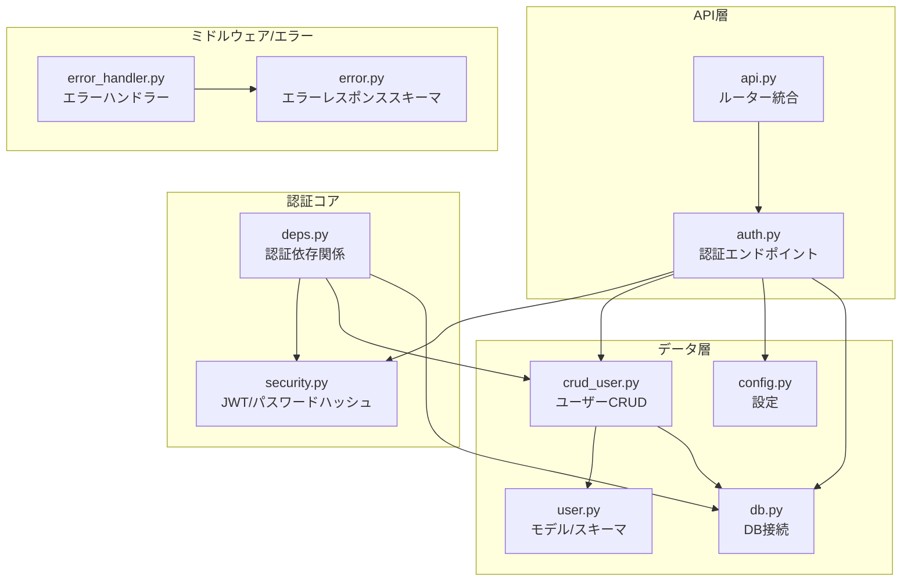
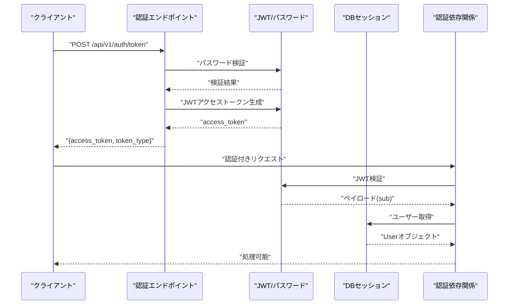
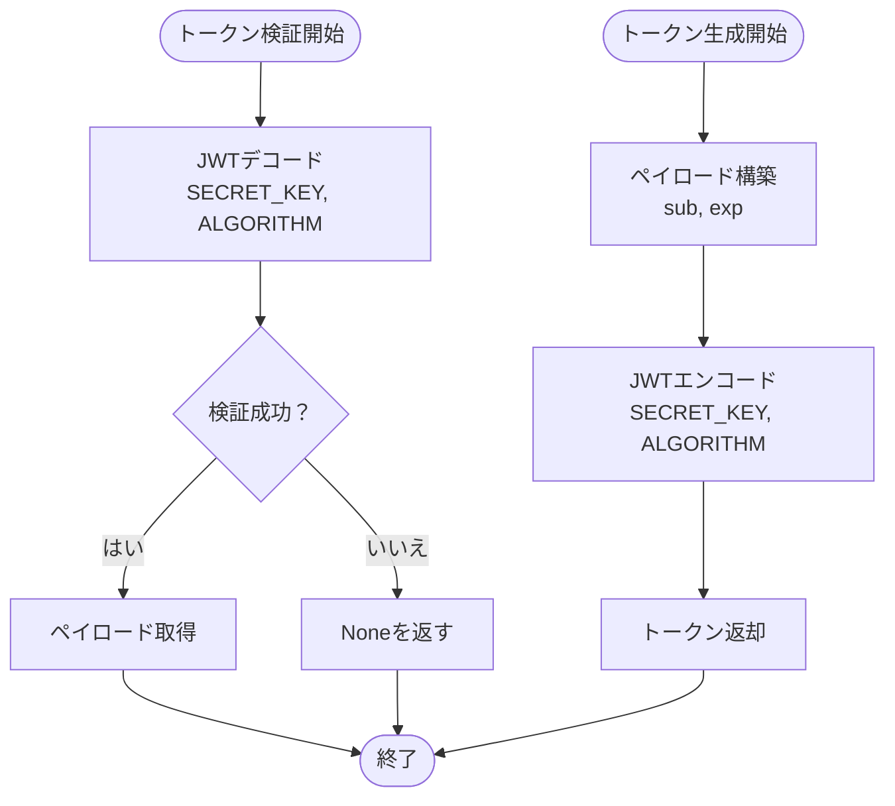
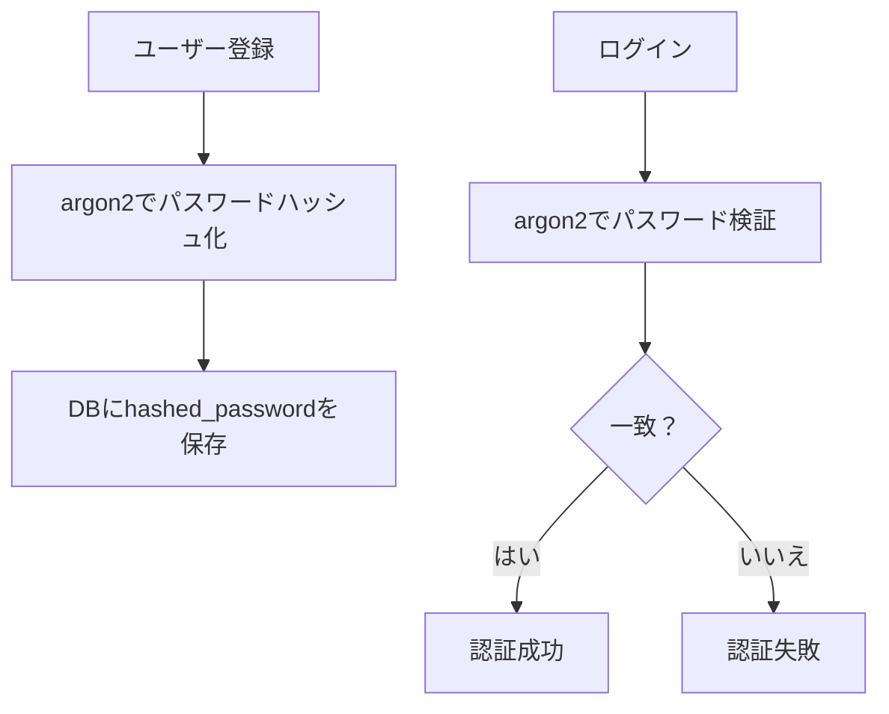
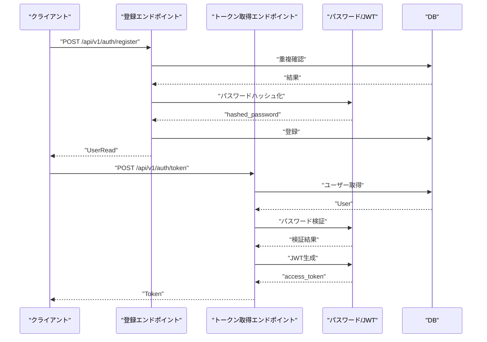
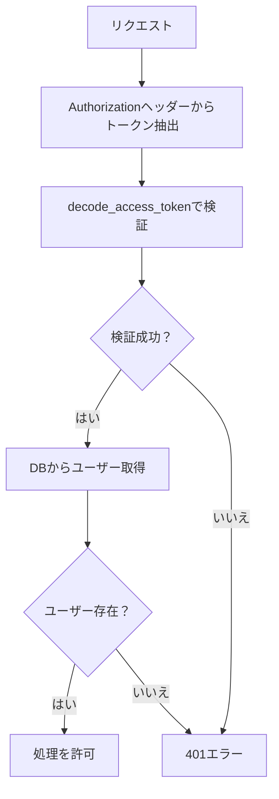
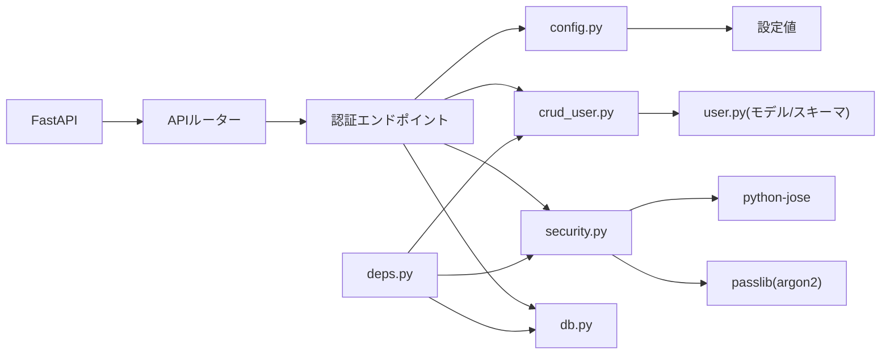

# JWT認証システム

<cite>
**このドキュメントで参照されるファイル**
- [auth.py](file://backend/app/api/api_v1/endpoints/auth.py)
- [security.py](file://backend/app/core/security.py)
- [token.py](file://backend/app/schemas/token.py)
- [deps.py](file://backend/app/api/deps.py)
- [crud_user.py](file://backend/app/crud/crud_user.py)
- [config.py](file://backend/app/core/config.py)
- [user.py](file://backend/app/models/user.py)
- [user.py](file://backend/app/schemas/user.py)
- [api.py](file://backend/app/api/api_v1/api.py)
- [db.py](file://backend/app/core/db.py)
- [error_handler.py](file://backend/app/middleware/error_handler.py)
- [error.py](file://backend/app/schemas/error.py)
- [pyproject.toml](file://backend/pyproject.toml)
- [test_auth.py](file://backend/tests/test_auth.py)
</cite>

## 目次
1. [はじめに](#はじめに)
2. [プロジェクト構造](#プロジェクト構造)
3. [コアコンポーネント](#コアコンポーネント)
4. [アーキテクチャ概観](#アーキテクチャ概観)
5. [詳細コンポーネント解析](#詳細コンポーネント解析)
6. [依存性分析](#依存性分析)
7. [パフォーマンス考慮事項](#パフォーマンス考慮事項)
8. [トラブルシューティングガイド](#トラブルシューティングガイド)
9. [結論](#結論)

## はじめに
本ドキュメントは、FastAPIベースのTodo APIにおけるJWT（JSON Web Token）認証システムの設計と実装を網羅的に解説します。具体的には、JWTトークンの生成・検証・期限切れ時の再発行（リフレッシュ）の仕組み、パスワードハッシュ化アルゴリズムとしてのargon2の利用方法、認証ミドルウェアの実装、依存性注入による認証管理、トークンの有効期限設定と再生成の実装例、セキュリティ上の考慮点、トークンの保存方法、CSRF対策について説明します。

## プロジェクト構造
バックエンドはFastAPIアプリケーションであり、認証に関連する主なモジュールは以下の通りです：
- APIエンドポイント：認証ルート（ユーザー登録、アクセストークン取得）
- 認証コア：JWTの生成・検証、パスワードハッシュ化（argon2）
- CRUD：ユーザーの登録・取得
- 認証依存関係：OAuth2 Bearerトークンの検証と現在のユーザー取得
- 設定：シークレットキー、アルゴリズム、トークン有効期限、CORS、レート制限
- DB接続：非同期SQLModel接続
- エラーハンドリング：統一エラーレスポンス

**図の出典**
- [auth.py:1-53](file://backend/app/api/api_v1/endpoints/auth.py#L1-L53)
- [security.py:1-35](file://backend/app/core/security.py#L1-L35)
- [deps.py:1-31](file://backend/app/api/deps.py#L1-L31)
- [crud_user.py:1-22](file://backend/app/crud/crud_user.py#L1-L22)
- [user.py:1-16](file://backend/app/models/user.py#L1-L16)
- [user.py:1-12](file://backend/app/schemas/user.py#L1-L12)
- [config.py:1-73](file://backend/app/core/config.py#L1-L73)
- [db.py:1-17](file://backend/app/core/db.py#L1-L17)
- [api.py:1-8](file://backend/app/api/api_v1/api.py#L1-L8)
- [error_handler.py:1-149](file://backend/app/middleware/error_handler.py#L1-L149)
- [error.py:1-23](file://backend/app/schemas/error.py#L1-L23)

**節の出典**
- [auth.py:1-53](file://backend/app/api/api_v1/endpoints/auth.py#L1-L53)
- [api.py:1-8](file://backend/app/api/api_v1/api.py#L1-L8)

## コアコンポーネント
- JWT生成・検証：署名アルゴリズム、有効期限、ペイロードのエンコード/デコード
- パスワードハッシュ化：argon2による安全なパスワード保存
- 認証依存関係：OAuth2 Bearerトークンの検証と現在のユーザー取得
- 認証エンドポイント：ユーザー登録、アクセストークン取得
- 設定管理：SECRET_KEY、ALGORITHM、ACCESS_TOKEN_EXPIRE_MINUTES、CORS、レート制限
- DB接続：非同期SQLModelセッション
- エラーハンドリング：統一されたエラーレスポンス形式

**節の出典**
- [security.py:1-35](file://backend/app/core/security.py#L1-L35)
- [config.py:1-73](file://backend/app/core/config.py#L1-L73)
- [deps.py:1-31](file://backend/app/api/deps.py#L1-L31)
- [auth.py:1-53](file://backend/app/api/api_v1/endpoints/auth.py#L1-L53)
- [crud_user.py:1-22](file://backend/app/crud/crud_user.py#L1-L22)
- [db.py:1-17](file://backend/app/core/db.py#L1-L17)
- [error_handler.py:1-149](file://backend/app/middleware/error_handler.py#L1-L149)

## アーキテクチャ概観
認証フローは以下の通りです：
1. 認証エンドポイント（/api/v1/auth/token）でユーザー名・パスワードを検証
2. 成功するとJWTアクセストークンを生成（有効期限付き）
3. 以降のリクエストではAuthorization: Bearer トークンで認証
4. 認証依存関係がトークンを検証し、現在のユーザーを取得
5. DBセッションとCRUD操作を通じてリソースアクセス

**図の出典**
- [auth.py:34-52](file://backend/app/api/api_v1/endpoints/auth.py#L34-L52)
- [security.py:17-34](file://backend/app/core/security.py#L17-L34)
- [deps.py:12-30](file://backend/app/api/deps.py#L12-L30)
- [crud_user.py:7-10](file://backend/app/crud/crud_user.py#L7-L10)
- [db.py:14-16](file://backend/app/core/db.py#L14-L16)

## 詳細コンポーネント解析

### JWTトークン生成・検証
- 生成：ペイロードにsub（ユーザー識別子）を含み、有効期限（ACCESS_TOKEN_EXPIRE_MINUTES）を設定。SECRET_KEYとALGORITHM（HS256）で署名。
- 検証：受信したトークンをSECRET_KEYとALGORITHMで検証し、失敗時はNoneを返す。
- 依存：設定からSECRET_KEY、ALGORITHM、有効期限を取得。

**図の出典**
- [security.py:17-34](file://backend/app/core/security.py#L17-L34)
- [config.py:51-53](file://backend/app/core/config.py#L51-L53)

**節の出典**
- [security.py:17-34](file://backend/app/core/security.py#L17-L34)
- [config.py:51-53](file://backend/app/core/config.py#L51-L53)

### パスワードハッシュ化（argon2）
- passlibのCryptContextでargon2を指定。新規登録時とログイン時のパスワード検証に利用。
- 登録時：入力パスワードをハッシュ化してDB保存。
- ログイン時：入力パスワードをDBのhashed_passwordと比較。

**図の出典**
- [crud_user.py:12-21](file://backend/app/crud/crud_user.py#L12-L21)
- [security.py:10-14](file://backend/app/core/security.py#L10-L14)

**節の出典**
- [crud_user.py:12-21](file://backend/app/crud/crud_user.py#L12-L21)
- [security.py:10-14](file://backend/app/core/security.py#L10-L14)
- [pyproject.toml](file://backend/pyproject.toml#L9)

### 認証エンドポイント（ユーザー登録・アクセストークン取得）
- /api/v1/auth/register：ユーザー名重複チェック後、argon2でパスワードをハッシュ化して登録。
- /api/v1/auth/token：OAuth2PasswordRequestFormでusername/passwordを受け取り、パスワード検証後、JWTアクセストークンを発行。

**図の出典**
- [auth.py:17-32](file://backend/app/api/api_v1/endpoints/auth.py#L17-L32)
- [auth.py:34-52](file://backend/app/api/api_v1/endpoints/auth.py#L34-L52)
- [crud_user.py:7-21](file://backend/app/crud/crud_user.py#L7-L21)
- [security.py:10-14](file://backend/app/core/security.py#L10-L14)
- [security.py:17-27](file://backend/app/core/security.py#L17-L27)

**節の出典**
- [auth.py:17-32](file://backend/app/api/api_v1/endpoints/auth.py#L17-L32)
- [auth.py:34-52](file://backend/app/api/api_v1/endpoints/auth.py#L34-L52)

### 認証ミドルウェア（依存性注入）
- OAuth2PasswordBearer：/api/v1/auth/tokenをtokenUrlとして設定。
- get_current_user：受信したBearerトークンをdecode_access_tokenで検証。subからユーザー名を取得し、DBから該当ユーザーを取得。存在しない場合は401エラー。

**図の出典**
- [deps.py](file://backend/app/api/deps.py#L10)
- [deps.py:12-30](file://backend/app/api/deps.py#L12-L30)
- [security.py:29-34](file://backend/app/core/security.py#L29-L34)

**節の出典**
- [deps.py:10-30](file://backend/app/api/deps.py#L10-L30)
- [security.py:29-34](file://backend/app/core/security.py#L29-L34)

### トークンの有効期限と再生成（リフレッシュ）
- 有効期限：ACCESS_TOKEN_EXPIRE_MINUTES（分単位）で設定。
- 現状：アクセストークンの自動再生成（リフレッシュ）は実装されていない。
- 実装例案（概念）：リフレッシュトークンを別途発行し、期限切れ時に新しいアクセストークンを発行する仕組みを追加することで、UX向上とセキュリティ強化が可能。

**節の出典**
- [config.py](file://backend/app/core/config.py#L53)
- [security.py:17-27](file://backend/app/core/security.py#L17-L27)

### トークン保存方法とCSRF対策
- トークン保存：クライアント側でAuthorization: Bearer としてリクエストヘッダーに設定。
- CSRF対策：JWTはステートレスな認証であるため、CSRFトークンの必要性は低い。ただし、Cookie経由での送受信を行う場合はSameSiteやHttpOnly、Secure属性の設定が必要。現状はAuthorizationヘッダー経由の認証実装であるため、CSRF対策として特に追加のトークンは不要。

**節の出典**
- [deps.py](file://backend/app/api/deps.py#L10)
- [auth.py:34-52](file://backend/app/api/api_v1/endpoints/auth.py#L34-L52)

## 依存性分析
- 外部依存：FastAPI、SQLModel、passlib（argon2）、python-jose（JWT）、SlowAPI（レート制限）、asyncpg（PostgreSQL非同期接続）。
- 内部依存：APIルーターが認証エンドポイントをinclude。認証エンドポイントはセキュリティモジュール、CRUD、設定、DBに依存。認証依存関係はセキュリティモジュールとCRUD、DBに依存。

**図の出典**
- [pyproject.toml:7-22](file://backend/pyproject.toml#L7-L22)
- [api.py:4-7](file://backend/app/api/api_v1/api.py#L4-L7)
- [auth.py:1-14](file://backend/app/api/api_v1/endpoints/auth.py#L1-L14)
- [deps.py:1-8](file://backend/app/api/deps.py#L1-L8)
- [security.py:1-8](file://backend/app/core/security.py#L1-L8)
- [crud_user.py:1-5](file://backend/app/crud/crud_user.py#L1-L5)
- [config.py:1-73](file://backend/app/core/config.py#L1-L73)
- [db.py:1-17](file://backend/app/core/db.py#L1-L17)
- [user.py:1-16](file://backend/app/models/user.py#L1-L16)
- [user.py:1-12](file://backend/app/schemas/user.py#L1-L12)

**節の出典**
- [pyproject.toml:7-22](file://backend/pyproject.toml#L7-L22)

## パフォーマンス考慮事項
- JWT検証：O(1)で完了するため、認証フロー全体のオーバーヘッドは軽量。
- DBアクセス：ユーザー取得はindex（username）を利用しており、検索は高速。
- レート制限：SlowAPIによるLOGIN/RIGISTERの制限が設定されており、DoS攻撃への緩和に寄与。
- 非同期DB：SQLModelの非同期接続により、I/Oバウンドの認証処理においてスループット向上が期待できる。

**節の出典**
- [config.py:62-65](file://backend/app/core/config.py#L62-L65)
- [user.py:10-11](file://backend/app/models/user.py#L10-L11)
- [db.py:1-17](file://backend/app/core/db.py#L1-L17)

## トラブルシューティングガイド
- 認証エラー（401）：トークンの形式不正、有効期限切れ、subの取得失敗、ユーザーが存在しない場合。
- パスワード認証失敗：argon2による検証に失敗。
- 重複ユーザー登録：ユーザー名のユニーク制約違反（400）。
- トークン取得失敗：無効なユーザー名またはパスワード（401）。
- エラーレスポンス：統一されたErrorResponseスキーマで詳細が返却される。

**節の出典**
- [deps.py:17-29](file://backend/app/api/deps.py#L17-L29)
- [auth.py:42-47](file://backend/app/api/api_v1/endpoints/auth.py#L42-L47)
- [test_auth.py:17-30](file://backend/tests/test_auth.py#L17-L30)
- [test_auth.py:53-60](file://backend/tests/test_auth.py#L53-L60)
- [error_handler.py:52-76](file://backend/app/middleware/error_handler.py#L52-L76)
- [error.py:5-13](file://backend/app/schemas/error.py#L5-L13)

## 結論
本システムは、argon2による安全なパスワード保存、FastAPIのOAuth2 Bearer認証、JWTによるステートレスな認証を組み合わせた堅牢な認証基盤を提供しています。設定管理により、シークレットキー、アルゴリズム、有効期限、CORS、レート制限を柔軟に調整可能です。今後の拡張として、リフレッシュトークンによるアクセストークンの自動再発行、Cookie経由での認証時のCSRF対策、セッション管理の強化などが挙げられます。