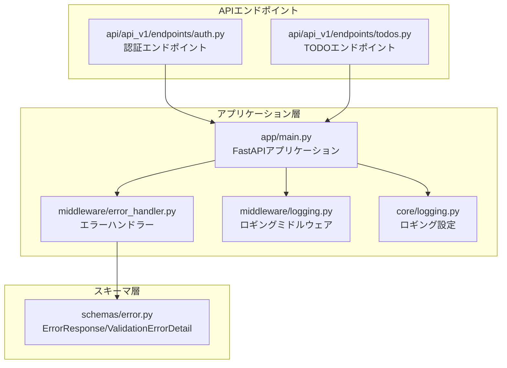
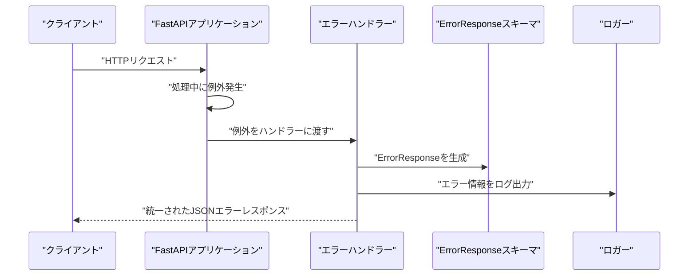
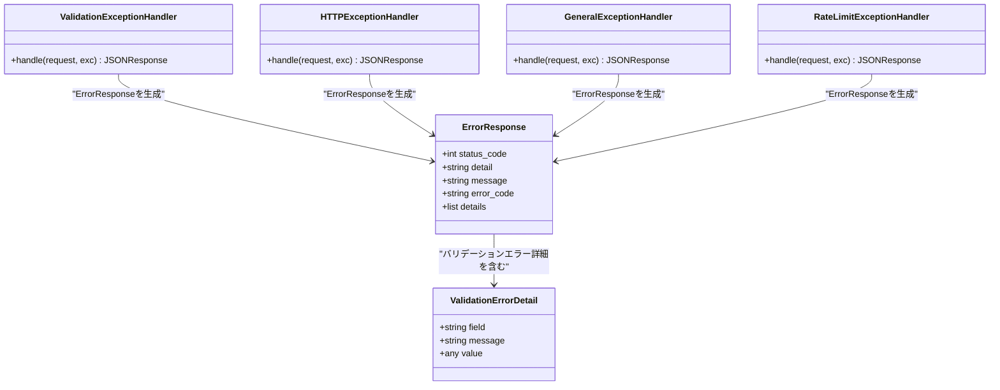
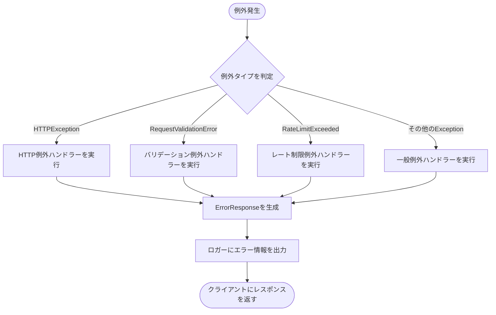
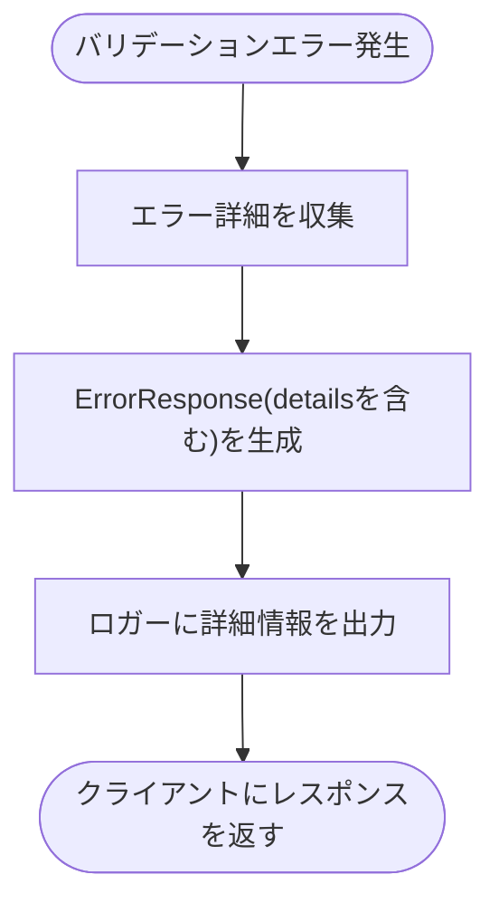
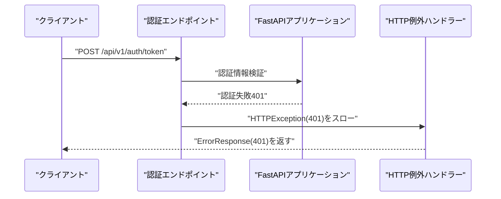
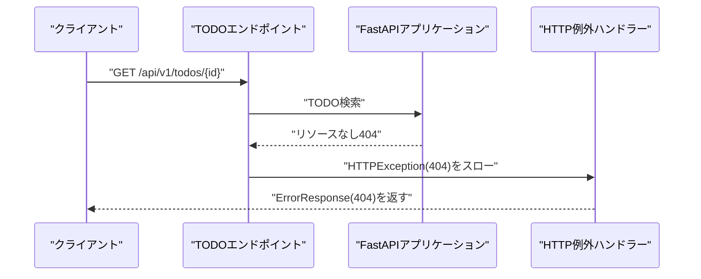
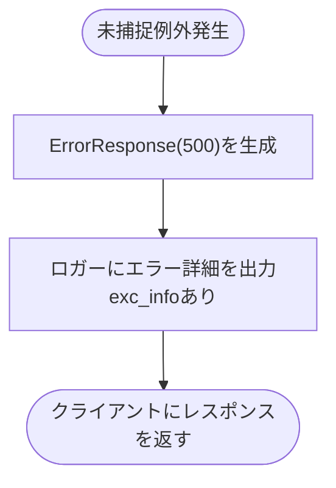
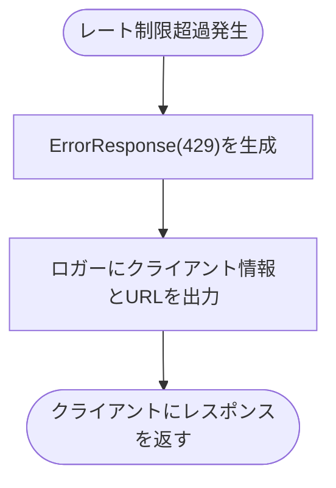
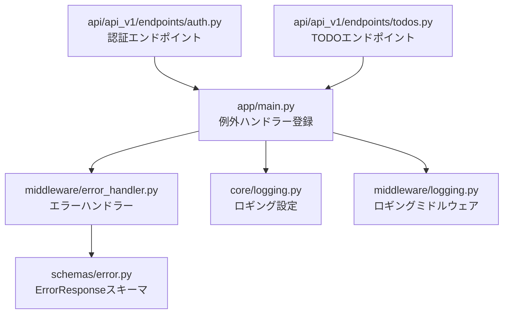

# エラーハンドリングミドルウェア

<cite>
**この文書で参照されているファイル**
- [backend/app/middleware/error_handler.py](file://backend/app/middleware/error_handler.py)
- [backend/app/schemas/error.py](file://backend/app/schemas/error.py)
- [backend/app/main.py](file://backend/app/main.py)
- [backend/app/middleware/logging.py](file://backend/app/middleware/logging.py)
- [backend/app/core/logging.py](file://backend/app/core/logging.py)
- [backend/app/api/api_v1/endpoints/auth.py](file://backend/app/api/api_v1/endpoints/auth.py)
- [backend/app/api/api_v1/endpoints/todos.py](file://backend/app/api/api_v1/endpoints/todos.py)
- [backend/tests/test_errors.py](file://backend/tests/test_errors.py)
</cite>

## 目次
1. [はじめに](#はじめに)
2. [プロジェクト構造](#プロジェクト構造)
3. [コアコンポーネント](#コアコンポーネント)
4. [アーキテクチャ概要](#アーキテクチャ概要)
5. [詳細コンポーネント分析](#詳細コンポーネント分析)
6. [依存関係分析](#依存関係分析)
7. [パフォーマンス考慮事項](#パフォーマンス考慮事項)
8. [トラブルシューティングガイド](#トラブルシューティングガイド)
9. [結論](#結論)

## はじめに
本ドキュメントは、Todoアプリケーションにおけるエラーハンドリングミドルウェアの詳細な仕組みを説明します。具体的には、例外処理の仕組み、カスタムエラーハンドラーの実装、エラーレスポンスのフォーマット、ロギングの統合作用について詳しく解説します。HTTP例外、バリデーションエラー、認証エラー、データベースエラーごとの処理方法と実装例を示し、エラーレスポンススキーマの定義とクライアントへの適切なエラーメッセージの提供方法についても説明します。

## プロジェクト構造
エラーハンドリングは、FastAPIアプリケーションの例外ハンドラーと、共通のエラーレスポンススキーマによって実現されています。エラーハンドラーは、バリデーションエラー、HTTP例外、一般例外、レート制限超過に対してそれぞれ専用のハンドラーが定義されており、すべてのエラーは統一されたErrorResponseスキーマに従ってクライアントに返されます。また、構造化ログ出力を行うロギング設定が用意されており、エラー発生時に適切なログが記録されます。

**図の出典**
- [backend/app/main.py:16-71](file://backend/app/main.py#L16-L71)
- [backend/app/middleware/error_handler.py:1-149](file://backend/app/middleware/error_handler.py#L1-L149)
- [backend/app/middleware/logging.py:1-67](file://backend/app/middleware/logging.py#L1-L67)
- [backend/app/core/logging.py:1-36](file://backend/app/core/logging.py#L1-L36)
- [backend/app/schemas/error.py:1-23](file://backend/app/schemas/error.py#L1-L23)
- [backend/app/api/api_v1/endpoints/auth.py:1-53](file://backend/app/api/api_v1/endpoints/auth.py#L1-L53)
- [backend/app/api/api_v1/endpoints/todos.py:1-102](file://backend/app/api/api_v1/endpoints/todos.py#L1-L102)

**節の出典**
- [backend/app/main.py:16-71](file://backend/app/main.py#L16-L71)
- [backend/app/middleware/error_handler.py:1-149](file://backend/app/middleware/error_handler.py#L1-L149)
- [backend/app/schemas/error.py:1-23](file://backend/app/schemas/error.py#L1-L23)

## コアコンポーネント
- エラーハンドラー関数群
  - バリデーションエラー用ハンドラー：Pydanticバリデーションエラーを整形し、ErrorResponseスキーマに従ったJSONレスポンスを返します。
  - HTTP例外用ハンドラー：StarletteのHTTPExceptionおよびFastAPIのHTTPExceptionを捕らえ、ステータスコードに応じた日本語メッセージを含むErrorResponseを返します。
  - 一般例外用ハンドラー：未捕捉の例外をキャッチし、500 Internal Server ErrorとしてErrorResponseを返します。
  - レート制限超過用ハンドラー：SlowAPIのRateLimitExceededを捕らえ、429 Too Many RequestsとしてErrorResponseを返します。
- エラーレスポンススキーマ
  - ErrorResponse：統一されたエラーレスポンスフォーマット。ステータスコード、詳細、日本語メッセージ、エラーコード、詳細情報（バリデーションエラーの場合）を含みます。
  - ValidationErrorDetail：バリデーションエラーの詳細情報。フィールド名、エラーメッセージ、入力値を保持します。
- ロギング設定
  - 構造化JSONログ出力：python-json-loggerを使用し、アプリケーションロガーにコンソール出力を行う設定です。
  - ロギングミドルウェア：HTTPリクエスト/レスポンスの開始・完了・失敗を記録し、処理時間も含めた統計情報を出力します。

**節の出典**
- [backend/app/middleware/error_handler.py:15-149](file://backend/app/middleware/error_handler.py#L15-L149)
- [backend/app/schemas/error.py:5-23](file://backend/app/schemas/error.py#L5-L23)
- [backend/app/core/logging.py:6-36](file://backend/app/core/logging.py#L6-L36)
- [backend/app/middleware/logging.py:10-67](file://backend/app/middleware/logging.py#L10-L67)

## アーキテクチャ概要
FastAPIアプリケーションは、エラーハンドラーを登録することで、例外発生時に統一されたErrorResponseをクライアントに返す仕組みを採用しています。エラーハンドラーは、バリデーションエラー、HTTP例外、一般例外、レート制限超過に対して個別に対応し、それぞれ適切なHTTPステータスコードと日本語メッセージを含みます。ロギング設定により、エラー発生時の詳細情報が構造化ログとして出力され、運用・デバッグに役立ちます。

**図の出典**
- [backend/app/main.py:66-71](file://backend/app/main.py#L66-L71)
- [backend/app/middleware/error_handler.py:15-149](file://backend/app/middleware/error_handler.py#L15-L149)
- [backend/app/schemas/error.py:5-23](file://backend/app/schemas/error.py#L5-L23)

## 詳細コンポーネント分析

### エラーハンドラーのクラス構造
エラーハンドラーは、FastAPIの例外ハンドラーとして登録され、各例外タイプに応じたレスポンスを生成します。ErrorResponseスキーマは、エラーレスポンスの共通フォーマットを定義しており、バリデーションエラーの場合は詳細情報も含まれます。

**図の出典**
- [backend/app/middleware/error_handler.py:15-149](file://backend/app/middleware/error_handler.py#L15-L149)
- [backend/app/schemas/error.py:5-23](file://backend/app/schemas/error.py#L5-L23)

**節の出典**
- [backend/app/middleware/error_handler.py:15-149](file://backend/app/middleware/error_handler.py#L15-L149)
- [backend/app/schemas/error.py:5-23](file://backend/app/schemas/error.py#L5-L23)

### HTTP例外処理のフロー
HTTP例外（400、401、403、404、409、422、429、500、503など）は、エラーハンドラーによって統一されたErrorResponseに整形されて返されます。ステータスコードに応じた日本語メッセージが設定され、クライアントは一貫したエラーレスポンスを受け取ります。

**図の出典**
- [backend/app/middleware/error_handler.py:52-149](file://backend/app/middleware/error_handler.py#L52-L149)
- [backend/app/main.py:66-71](file://backend/app/main.py#L66-L71)

**節の出典**
- [backend/app/middleware/error_handler.py:52-149](file://backend/app/middleware/error_handler.py#L52-L149)
- [backend/app/main.py:66-71](file://backend/app/main.py#L66-L71)

### バリデーションエラー処理のフロー
Pydanticバリデーションエラーは、エラーハンドラーによってフィールドごとの詳細情報を収集し、ErrorResponseのdetails配列に格納して返されます。これにより、クライアントはどのフィールドに問題があったかを正確に把握できます。

**図の出典**
- [backend/app/middleware/error_handler.py:15-49](file://backend/app/middleware/error_handler.py#L15-L49)

**節の出典**
- [backend/app/middleware/error_handler.py:15-49](file://backend/app/middleware/error_handler.py#L15-L49)

### 認証エラー処理のフロー
認証エラー（401 Unauthorized）は、認証エンドポイントで発生することが多く、HTTP例外ハンドラーによって統一されたErrorResponseに整形されます。クライアントは「認証が必要です、再度ログインしてください」といった日本語メッセージを受け取ります。

**図の出典**
- [backend/app/api/api_v1/endpoints/auth.py:34-52](file://backend/app/api/api_v1/endpoints/auth.py#L34-L52)
- [backend/app/middleware/error_handler.py:52-76](file://backend/app/middleware/error_handler.py#L52-L76)

**節の出典**
- [backend/app/api/api_v1/endpoints/auth.py:34-52](file://backend/app/api/api_v1/endpoints/auth.py#L34-L52)
- [backend/app/middleware/error_handler.py:52-76](file://backend/app/middleware/error_handler.py#L52-L76)

### TODOエラー処理のフロー
TODOエンドポイントでは、リソースが存在しない場合（404 Not Found）や、その他のHTTPエラーが発生した場合に、HTTP例外ハンドラーによってErrorResponseが返されます。これにより、クライアントは一貫したエラーレスポンスを受け取ります。

**図の出典**
- [backend/app/api/api_v1/endpoints/todos.py:69-101](file://backend/app/api/api_v1/endpoints/todos.py#L69-L101)
- [backend/app/middleware/error_handler.py:52-76](file://backend/app/middleware/error_handler.py#L52-L76)

**節の出典**
- [backend/app/api/api_v1/endpoints/todos.py:69-101](file://backend/app/api/api_v1/endpoints/todos.py#L69-L101)
- [backend/app/middleware/error_handler.py:52-76](file://backend/app/middleware/error_handler.py#L52-L76)

### 一般例外処理のフロー
未捕捉の例外（500 Internal Server Error）は、一般例外ハンドラーによってキャッチされ、ErrorResponseに整形されてクライアントに返されます。エラー発生時の詳細情報はロガーに記録され、運用上重要なデバッグ情報として残ります。

**図の出典**
- [backend/app/middleware/error_handler.py:79-104](file://backend/app/middleware/error_handler.py#L79-L104)

**節の出典**
- [backend/app/middleware/error_handler.py:79-104](file://backend/app/middleware/error_handler.py#L79-L104)

### レート制限超過処理のフロー
SlowAPIによるレート制限超過（429 Too Many Requests）は、専用のレート制限例外ハンドラーによってキャッチされ、ErrorResponseに整形されてクライアントに返されます。クライアントは「リクエスト制限を超過しました。しばらく待ってから再度お試しください」といった日本語メッセージを受け取ります。

**図の出典**
- [backend/app/middleware/error_handler.py:125-148](file://backend/app/middleware/error_handler.py#L125-L148)

**節の出典**
- [backend/app/middleware/error_handler.py:125-148](file://backend/app/middleware/error_handler.py#L125-L148)

## 依存関係分析
エラーハンドリングミドルウェアは、FastAPIの例外ハンドラーとして登録され、ErrorResponseスキーマに従ってレスポンスを生成します。ロギング設定は、構造化ログ出力を行うことで、エラー発生時の詳細情報を記録します。認証エンドポイントやTODOエンドポイントからのHTTP例外は、エラーハンドラーによって一貫したレスポンスに整形されます。

**図の出典**
- [backend/app/main.py:16-71](file://backend/app/main.py#L16-L71)
- [backend/app/middleware/error_handler.py:1-149](file://backend/app/middleware/error_handler.py#L1-L149)
- [backend/app/schemas/error.py:1-23](file://backend/app/schemas/error.py#L1-L23)
- [backend/app/core/logging.py:1-36](file://backend/app/core/logging.py#L1-L36)
- [backend/app/middleware/logging.py:1-67](file://backend/app/middleware/logging.py#L1-L67)
- [backend/app/api/api_v1/endpoints/auth.py:1-53](file://backend/app/api/api_v1/endpoints/auth.py#L1-L53)
- [backend/app/api/api_v1/endpoints/todos.py:1-102](file://backend/app/api/api_v1/endpoints/todos.py#L1-L102)

**節の出典**
- [backend/app/main.py:16-71](file://backend/app/main.py#L16-L71)
- [backend/app/middleware/error_handler.py:1-149](file://backend/app/middleware/error_handler.py#L1-L149)
- [backend/app/schemas/error.py:1-23](file://backend/app/schemas/error.py#L1-L23)
- [backend/app/core/logging.py:1-36](file://backend/app/core/logging.py#L1-L36)
- [backend/app/middleware/logging.py:1-67](file://backend/app/middleware/logging.py#L1-L67)
- [backend/app/api/api_v1/endpoints/auth.py:1-53](file://backend/app/api/api_v1/endpoints/auth.py#L1-L53)
- [backend/app/api/api_v1/endpoints/todos.py:1-102](file://backend/app/api/api_v1/endpoints/todos.py#L1-L102)

## パフォーマンス考慮事項
- 例外処理のオーバーヘッド：エラーハンドラーは例外発生時にJSONレスポンスを生成し、ロガーに情報を出力するため、頻繁なエラー発生はパフォーマンスに影響を与える可能性があります。特にバリデーションエラーは大量に発生する可能性があるため、クライアント側での入力検証を強化し、サーバーサイドでのエラーハンドリングを軽減することが望ましいです。
- ロギングのコスト：構造化ログ出力は、エラー発生時に追加のI/O処理を伴います。大量のエラーが発生する環境では、ログ出力の頻度や内容を調整することで、パフォーマンスを維持することが重要です。

## トラブルシューティングガイド
- HTTP例外（401、403、404、409、422、429、500、503など）：エラーハンドラーによって統一されたErrorResponseが返されます。クライアントはステータスコードと日本語メッセージを確認し、適切な対応を行ってください。
- バリデーションエラー（422）：ErrorResponseのdetails配列にフィールドごとのエラー詳細が含まれます。クライアントは各フィールドのエラーメッセージを元に修正を行ってください。
- 一般例外（500）：エラーハンドラーによってErrorResponseが返され、ロガーに詳細情報が出力されます。管理者はログを確認し、問題の原因を特定してください。
- レート制限超過（429）：ErrorResponseが返され、クライアントは「リクエスト制限を超過しました。しばらく待ってから再度お試しください」といったメッセージを受け取ります。クライアントは指定された時間待ってから再度リクエストを行うか、リクエストの頻度を調整してください。
- テストケース：バリデーションエラー、404エラーなどのテストケースが用意されており、エラーハンドリングの動作を確認できます。

**節の出典**
- [backend/tests/test_errors.py:22-38](file://backend/tests/test_errors.py#L22-L38)
- [backend/app/middleware/error_handler.py:15-149](file://backend/app/middleware/error_handler.py#L15-L149)

## 結論
エラーハンドリングミドルウェアは、FastAPIの例外ハンドラーとErrorResponseスキーマを活用して、HTTP例外、バリデーションエラー、認証エラー、一般例外、レート制限超過に対して統一されたレスポンスを提供します。ロギング設定により、エラー発生時の詳細情報が構造化ログとして出力され、運用・デバッグに役立ちます。クライアントは一貫したエラーメッセージを受け取り、適切な対応を行うことができます。今後の改善として、クライアント側での入力検証の強化、ログ出力の調整、エラーハンドラーのカスタマイズなどが考えられます。