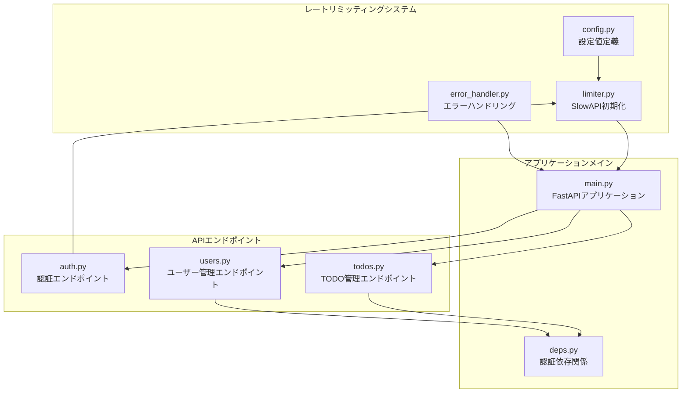
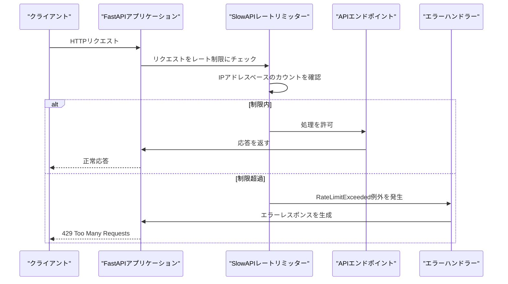
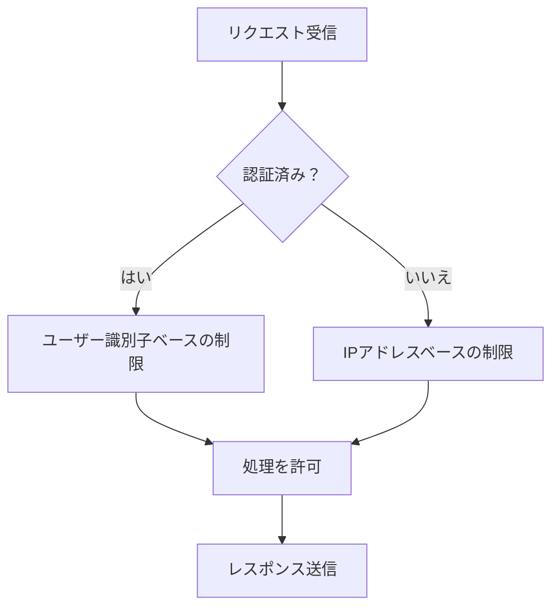
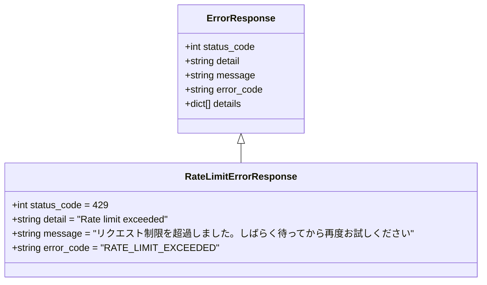
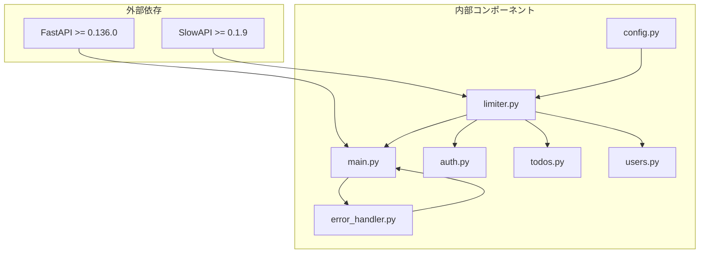

# レートリミッティングシステム

<cite>
**この文書で参照されるファイル**
- [limiter.py](file://backend/app/core/limiter.py)
- [config.py](file://backend/app/core/config.py)
- [main.py](file://backend/app/main.py)
- [auth.py](file://backend/app/api/api_v1/endpoints/auth.py)
- [todos.py](file://backend/app/api/api_v1/endpoints/todos.py)
- [users.py](file://backend/app/api/api_v1/endpoints/users.py)
- [error_handler.py](file://backend/app/middleware/error_handler.py)
- [deps.py](file://backend/app/api/deps.py)
- [api.py](file://backend/app/api/api_v1/api.py)
- [error.py](file://backend/app/schemas/error.py)
- [pyproject.toml](file://backend/pyproject.toml)
</cite>

## 目次
1. [導入](#導入)
2. [プロジェクト構造](#プロジェクト構造)
3. [コアコンポーネント](#コアコンポーネント)
4. [アーキテクチャ概要](#アーキテクチャ概要)
5. [詳細コンポーネント分析](#詳細コンポーネント分析)
6. [依存関係分析](#依存関係分析)
7. [パフォーマンス考慮事項](#パフォーマンス考慮事項)
8. [トラブルシューティングガイド](#トラブルシューティングガイド)
9. [結論](#結論)

## 導入

このTodo APIプロジェクトでは、SlowAPIを使用したレートリミッティングシステムが実装されています。SlowAPIはFastAPIの拡張ライブラリであり、リクエストのレート制限を簡単に実装できます。このシステムは以下の特徴を持っています：

- IPアドレスベースのレート制限
- 認証後のユーザー識別子ベースの制限
- APIエンドポイントごとの個別設定
- Redisを使用した分散レート制限の可能性
- 統一されたエラーレスポンスフォーマット

## プロジェクト構造

レートリミッティングシステムは以下のモジュール構成で実装されています：

**図の出典**
- [limiter.py:1-7](file://backend/app/core/limiter.py#L1-L7)
- [config.py:62-66](file://backend/app/core/config.py#L62-L66)
- [main.py:24-26](file://backend/app/main.py#L24-L26)

**セクションの出典**
- [limiter.py:1-7](file://backend/app/core/limiter.py#L1-L7)
- [config.py:62-66](file://backend/app/core/config.py#L62-L66)
- [main.py:128](file://backend/app/main.py#L128)

## コアコンポーネント

### SlowAPIレートリミッターの初期化

レートリミッターは`backend/app/core/limiter.py`で初期化されており、以下の特徴を持っています：

- IPアドレスベースのキー関数を使用
- デフォルトのレート制限は設定から取得
- 全てのエンドポイントで共通に使用可能

**セクションの出典**
- [limiter.py:1-7](file://backend/app/core/limiter.py#L1-L7)

### 設定値の定義

`backend/app/core/config.py`には以下のレートリミッティング設定が定義されています：

- `RATE_LIMIT_DEFAULT`: 通常のAPIエンドポイントのデフォルト制限
- `RATE_LIMIT_LOGIN`: 認証エンドポイントの制限
- `RATE_LIMIT_REGISTER`: ユーザー登録エンドポイントの制限

これらの設定は環境変数から読み込まれ、開発環境のデフォルト値として定義されています。

**セクションの出典**
- [config.py:62-66](file://backend/app/core/config.py#L62-L66)

### FastAPIアプリケーションの設定

`backend/app/main.py`でレートリミッターがアプリケーションに統合されています：
- SlowAPIエクステンションの初期化
- 例外ハンドラーの登録
- APIルーターのインクルード

**セクションの出典**
- [main.py:24-26](file://backend/app/main.py#L24-L26)
- [main.py:128](file://backend/app/main.py#L128)

## アーキテクチャ概要

レートリミッティングシステムは以下のアーキテクチャで動作します：

**図の出典**
- [main.py:71](file://backend/app/main.py#L71)
- [error_handler.py:125-148](file://backend/app/middleware/error_handler.py#L125-L148)

## 詳細コンポーネント分析

### IPアドレスベースのレート制限

SlowAPIは`get_remote_address`関数を使用してIPアドレスをキーとしてレート制限を適用します。これは以下の利点があります：

- 認証されていないユーザーも保護される
- 認証後のユーザー識別子とは独立して動作
- 実装がシンプルで効率的

**セクションの出典**
- [limiter.py:2](file://backend/app/core/limiter.py#L2)

### APIエンドポイントごとの設定

各エンドポイントは独自のレート制限設定を持つことができます：

#### 認証エンドポイント
- `/api/v1/auth/register`: 5回/分
- `/api/v1/auth/token`: 5回/分

#### 通常エンドポイント
- `/api/v1/todos/*`: 設定されたデフォルト制限
- `/api/v1/users/me`: 設定されたデフォルト制限

**セクションの出典**
- [auth.py:18](file://backend/app/api/api_v1/endpoints/auth.py#L18)
- [auth.py:35](file://backend/app/api/api_v1/endpoints/auth.py#L35)

### 認証後の制限

認証後のエンドポイント（TODO管理、ユーザー情報）は`get_current_user`依存関係を通じて保護されます。認証されたユーザーはSlowAPIのIPアドレスベースの制限とは独立して動作します。

**図の出典**
- [deps.py:12-30](file://backend/app/api/deps.py#L12-L30)

**セクションの出典**
- [deps.py:12-30](file://backend/app/api/deps.py#L12-L30)

### Redisを使用した分散レート制限

SlowAPIはRedisをサポートしており、複数のアプリケーションインスタンス間でレート制限を共有できます。これにより、以下のような利点があります：

- 複数のサーバー間で一貫した制限が適用される
- クラウド環境でのスケーラビリティが向上
- 複数のAPIゲートウェイを跨いで制限を適用可能

**セクションの出典**
- [pyproject.toml:19](file://backend/pyproject.toml#L19)

### エラーレスポンスのフォーマット

レートリミッティングエラーは統一されたフォーマットで返されます：

**図の出典**
- [error.py:5-23](file://backend/app/schemas/error.py#L5-L23)
- [error_handler.py:129-134](file://backend/app/middleware/error_handler.py#L129-L134)

**セクションの出典**
- [error.py:5-23](file://backend/app/schemas/error.py#L5-L23)
- [error_handler.py:125-148](file://backend/app/middleware/error_handler.py#L125-L148)

## 依存関係分析

レートリミッティングシステムの依存関係は以下のようになります：

**図の出典**
- [pyproject.toml:19](file://backend/pyproject.toml#L19)
- [pyproject.toml:11](file://backend/pyproject.toml#L11)

**セクションの出典**
- [pyproject.toml:19](file://backend/pyproject.toml#L19)

## パフォーマンス考慮事項

### レート制限の設定値

現在の設定では以下のパフォーマンス特性があります：

- **デフォルト制限**: 100リクエスト/分
- **認証制限**: 5リクエスト/分
- **登録制限**: 5リクエスト/分

これらの値は以下のように調整できます：
- 高負荷環境ではより緩やかな制限を設定
- 低負荷環境ではより厳しい制限を設定
- 特定のエンドポイントに応じて個別に最適化

### Redisによる分散制限の影響

Redisを使用した分散レート制限は以下の影響を与えます：

- **利点**:
  - 複数インスタンス間の一貫性
  - 設定の永続化
  - 複雑な制限ロジックの実装可能
  
- **課題**:
  - 追加のネットワーク遅延
  - Redisサーバーの可用性への依存
  - 追加の運用コスト

### パフォーマンス最適化の提案

1. **設定の最適化**:
   - トレーサビリティを考慮した制限値の設定
   - 特定エンドポイントの個別設定の活用

2. **Redisの活用**:
   - 複数インスタンスでのスケーラビリティ向上
   - 設定の集中管理

3. **モニタリングの強化**:
   - 制限超過の監視とアラート
   - 性能メトリクスの収集

## トラブルシューティングガイド

### 一般的な問題と解決策

#### 1. レート制限が適用されない場合

**原因**: 設定ファイルの読み込みエラー
**解決策**: `.env`ファイルの確認、環境変数の設定

#### 2. 認証後の制限が機能しない場合

**原因**: 認証ミドルウェアの問題
**解決策**: `get_current_user`関数の確認、JWTトークンの有効性チェック

#### 3. Redis接続エラー

**原因**: Redisサーバーの可用性
**解決策**: Redisサーバーの再起動、ネットワーク接続の確認

### デバッグ手順

1. **ログの確認**:
   - FastAPIアプリケーションログ
   - SlowAPIのレート制限ログ

2. **エラーレスポンスの確認**:
   - 429エラーレスポンスの内容
   - 制限超過時の詳細情報

3. **設定の検証**:
   - 環境変数の値
   - 設定ファイルの内容

**セクションの出典**
- [error_handler.py:125-148](file://backend/app/middleware/error_handler.py#L125-L148)

## 結論

このTodo APIプロジェクトのレートリミッティングシステムは、SlowAPIを使用して効果的に実装されています。主な特徴は以下の通りです：

- **柔軟な設定**: IPアドレスベースと認証後の制限を両方サポート
- **エンドポイントごとのカスタマイズ**: 各エンドポイントに応じた個別設定が可能
- **Redis対応**: 分散環境でのスケーラビリティを実現
- **統一されたエラーハンドリング**: 明確なエラーレスポンスフォーマット

今後の改善点としては、Redisによる分散制限の実装、設定の動的変更、より詳細な監視機能の追加などが考えられます。これらの改善により、より堅牢でスケーラブルなレートリミッティングシステムが実現できます。