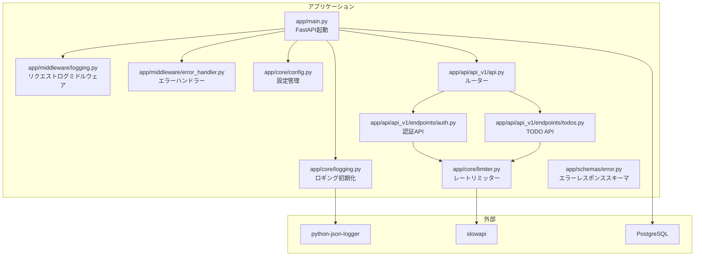
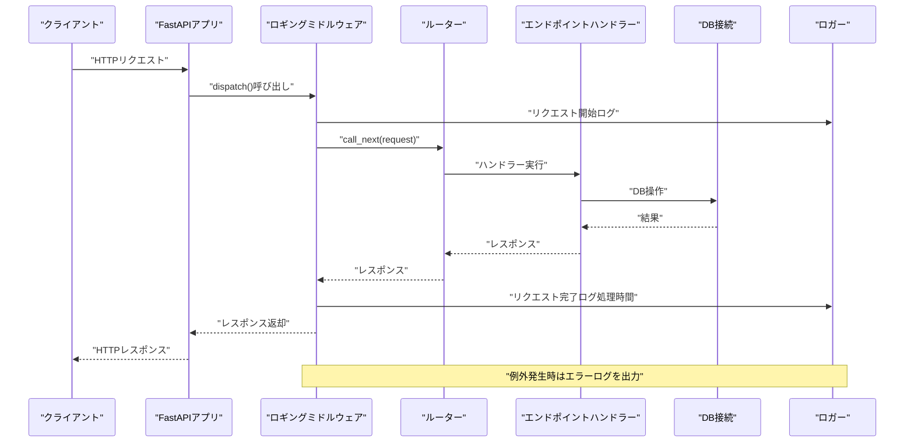
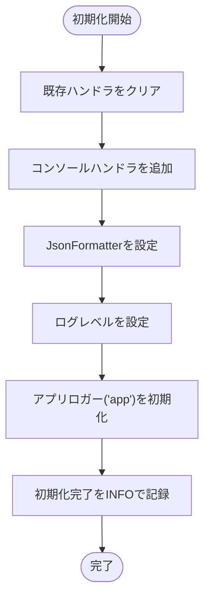
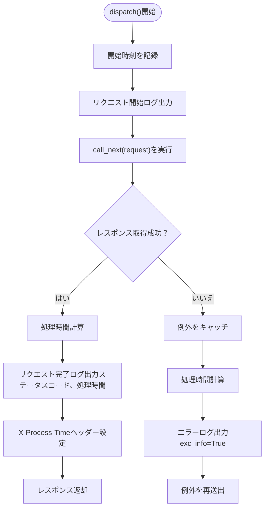
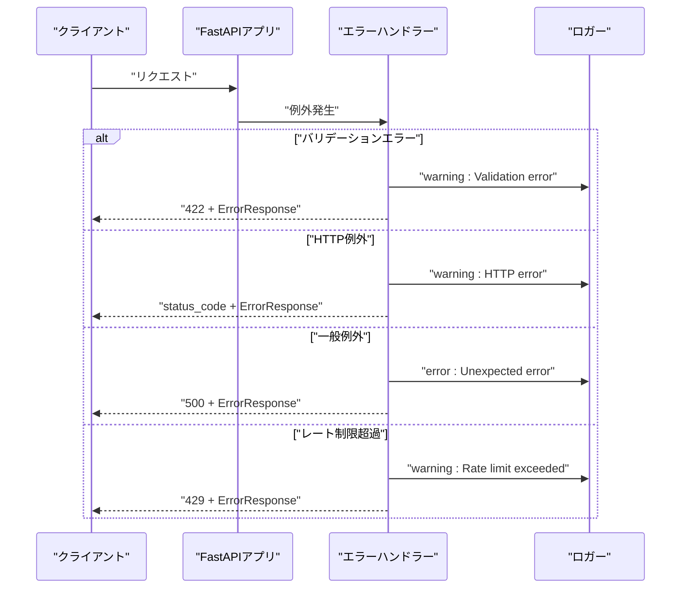
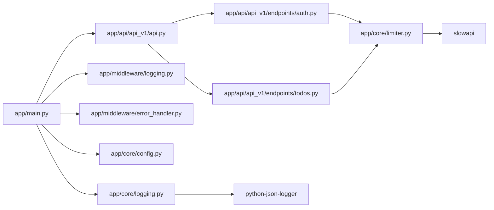

# ロギングと監視

<cite>
**本文で参照されるファイル**
- [pyproject.toml](file://backend/pyproject.toml)
- [main.py](file://backend/app/main.py)
- [logging.py（コア）](file://backend/app/core/logging.py)
- [logging.py（ミドルウェア）](file://backend/app/middleware/logging.py)
- [error_handler.py](file://backend/app/middleware/error_handler.py)
- [config.py](file://backend/app/core/config.py)
- [limiter.py](file://backend/app/core/limiter.py)
- [.env](file://backend/.env)
- [api.py](file://backend/app/api/api_v1/api.py)
- [auth.py](file://backend/app/api/api_v1/endpoints/auth.py)
- [todos.py](file://backend/app/api/api_v1/endpoints/todos.py)
- [error.py](file://backend/app/schemas/error.py)
- [docker-compose.yml](file://docker-compose.yml)
</cite>

## 目次
1. [はじめに](#はじめに)
2. [プロジェクト構造](#プロジェクト構造)
3. [コアコンポーネント](#コアコンポーネント)
4. [アーキテクチャ概要](#アーキテクチャ概要)
5. [詳細なコンポーネント分析](#詳細なコンポーネント分析)
6. [依存関係分析](#依存関係分析)
7. [パフォーマンスと監視](#パフォーマンスと監視)
8. [トラブルシューティングガイド](#トラブルシューティングガイド)
9. [結論](#結論)
10. [付録](#付録)

## はじめに
本ドキュメントは、Todo APIにおける「構造化ロギング」と「監視」の実装を網羅的に解説します。具体的には、以下のトピックをカバーします：
- JSONフォーマットのログ出力
- ログレベルの設定
- トレーサビリティIDの付与方法（現状の実装では未導入）
- エラーログの記録
- ロギングミドルウェアの実装
- パフォーマンスメトリクスの収集（現状の実装では未導入）
- 監視ツールとの連携方法（現状の実装では未導入）
- 開発環境と本番環境でのロギング設定の違い
- ログの保存と分析方法

## プロジェクト構造
バックエンドはFastAPIフレームワーク上で構築されており、以下のようなモジュール構成となっています：
- 設定管理：環境変数・設定値の定義
- ロギング：構造化ロギングの初期化、ミドルウェアによるリクエストログ
- エラーハンドリング：バリデーションエラー、HTTP例外、一般例外、レート制限エラー
- APIルーター：認証、ユーザー、TODOの各エンドポイント
- DB接続：SQLModel + asyncpgによる非同期接続
- Docker：PostgreSQLのローカル起動用

**図の出典**
- [main.py:1-168](file://backend/app/main.py#L1-L168)
- [logging.py（コア）:1-36](file://backend/app/core/logging.py#L1-L36)
- [logging.py（ミドルウェア）:1-67](file://backend/app/middleware/logging.py#L1-L67)
- [error_handler.py:1-149](file://backend/app/middleware/error_handler.py#L1-L149)
- [config.py:1-73](file://backend/app/core/config.py#L1-L73)
- [limiter.py:1-7](file://backend/app/core/limiter.py#L1-L7)
- [api.py:1-8](file://backend/app/api/api_v1/api.py#L1-L8)
- [auth.py:1-53](file://backend/app/api/api_v1/endpoints/auth.py#L1-L53)
- [todos.py:1-102](file://backend/app/api/api_v1/endpoints/todos.py#L1-L102)
- [error.py:1-23](file://backend/app/schemas/error.py#L1-L23)

**節の出典**
- [main.py:1-168](file://backend/app/main.py#L1-L168)
- [config.py:1-73](file://backend/app/core/config.py#L1-L73)

## コアコンポーネント
- 構造化ロギング初期化
  - Pythonの標準ロギングライブラリを使用し、コンソール出力にJSONフォーマットのロガーを設定
  - 日付フォーマット、出力項目（タイムスタンプ、ロガー名、レベル、メッセージ、ファイル名、関数名、行番号）を指定
  - ログレベルは引数で設定可能（デフォルトはINFO）

- HTTPリクエスト・レスポンスログミドルウェア
  - 各リクエストに対して開始・完了・エラーの3段階のログを出力
  - 処理時間（秒）をレスポンスヘッダーに追加（X-Process-Time）
  - 例外発生時はエラーログを出力し、スタックトレースを含める

- エラーハンドラー
  - バリデーションエラー、HTTP例外、一般例外、レート制限超過に対応
  - すべてのエラーに対して構造化ログを出力（URL、メソッド、ステータスコード、エラー内容など）

- 設定管理
  - 環境変数から設定値を読み込み、開発/本番の切り替えをサポート
  - DB接続文字列、CORSオリジン、レートリミットの設定を保持

**節の出典**
- [logging.py（コア）:1-36](file://backend/app/core/logging.py#L1-L36)
- [logging.py（ミドルウェア）:1-67](file://backend/app/middleware/logging.py#L1-L67)
- [error_handler.py:1-149](file://backend/app/middleware/error_handler.py#L1-L149)
- [config.py:1-73](file://backend/app/core/config.py#L1-L73)

## アーキテクチャ概要
以下は、リクエストフローにおけるロギングとエラーハンドリングの全体像です。

**図の出典**
- [main.py:117-118](file://backend/app/main.py#L117-L118)
- [logging.py（ミドルウェア）:15-66](file://backend/app/middleware/logging.py#L15-L66)
- [api.py:1-8](file://backend/app/api/api_v1/api.py#L1-L8)
- [auth.py:17-32](file://backend/app/api/api_v1/endpoints/auth.py#L17-L32)
- [todos.py:59-67](file://backend/app/api/api_v1/endpoints/todos.py#L59-L67)

## 詳細なコンポーネント分析

### 構造化ロギング初期化（コア）
- JSONフォーマットのロガー設定
  - 標準出力へのStreamHandlerを設定
  - python-json-loggerによるJsonFormatterを適用
  - 出力項目にasctime、name、levelname、message、filename、funcName、linenoを含める
- ログレベルの設定
  - 引数で指定されたレベル（大文字小文字は無視）を適用
  - 未指定の場合はINFO
- アプリケーションロガーの初期化
  - "app"というロガーを取得し、レベルを設定
  - 初期化完了をINFOレベルで記録（ログレベルを含む）

**図の出典**
- [logging.py（コア）:6-35](file://backend/app/core/logging.py#L6-L35)

**節の出典**
- [logging.py（コア）:1-36](file://backend/app/core/logging.py#L1-L36)

### HTTPリクエスト・レスポンスログミドルウェア
- 機能
  - リクエスト開始時：メソッド、URL、クライアントIPをログ出力
  - 成功時：ステータスコード、処理時間（秒）をログ出力
  - 失敗時：エラー内容、処理時間をログ出力（exc_info=True）
  - 処理時間（秒）をレスポンスヘッダーX-Process-Timeに設定
- 例外処理
  - 例外発生時はエラーログを出力し、再度raise

**図の出典**
- [logging.py（ミドルウェア）:15-66](file://backend/app/middleware/logging.py#L15-L66)

**節の出典**
- [logging.py（ミドルウェア）:1-67](file://backend/app/middleware/logging.py#L1-L67)

### エラーハンドラー
- バリデーションエラー（422）
  - Pydanticバリデーションエラーを整形し、ErrorResponse形式で返却
  - warningレベルでエラー詳細をログ出力
- HTTP例外（4xx/5xx）
  - status_code、detail、messageをErrorResponse形式で返却
  - warningレベルでエラー詳細をログ出力
- 一般例外（500）
  - 内部エラーとしてErrorResponse形式で返却
  - errorレベルでエラー詳細をログ出力（exc_info=True）
- レート制限超過（429）
  - ErrorResponse形式で返却
  - warningレベルでエラー詳細をログ出力

**図の出典**
- [error_handler.py:15-148](file://backend/app/middleware/error_handler.py#L15-L148)
- [error.py:5-22](file://backend/app/schemas/error.py#L5-L22)

**節の出典**
- [error_handler.py:1-149](file://backend/app/middleware/error_handler.py#L1-L149)
- [error.py:1-23](file://backend/app/schemas/error.py#L1-L23)

### 設定管理（開発/本番）
- 環境変数から設定を読み込み、.envファイルを基準に設定
- 環境識別子（development/production）を判定し、CORSやDB接続文字列などを切り替え
- 本番環境ではCORSオリジンが必須（設定されていない場合runtime error）

**節の出典**
- [config.py:1-73](file://backend/app/core/config.py#L1-L73)
- [.env:1-10](file://backend/.env#L1-L10)

### APIルーターとエンドポイント
- APIルーターは認証、ユーザー、TODOの3つのタグ付きエンドポイントを含む
- 認証エンドポイントにはレートリミッターを適用
- TODOエンドポイントにはDB操作が含まれる

**節の出典**
- [api.py:1-8](file://backend/app/api/api_v1/api.py#L1-L8)
- [auth.py:17-32](file://backend/app/api/api_v1/endpoints/auth.py#L17-L32)
- [todos.py:59-67](file://backend/app/api/api_v1/endpoints/todos.py#L59-L67)

## 依存関係分析
- 外部ライブラリ
  - python-json-logger：JSONフォーマットのロガー
  - slowapi：リクエストレートリミッター
- 内部依存
  - main.pyがコアロギング、ミドルウェア、エラーハンドラー、設定、ルーターを統合
  - 認証・TODOエンドポイントがレートリミッターに依存

**図の出典**
- [main.py:1-168](file://backend/app/main.py#L1-L168)
- [logging.py（コア）:1-36](file://backend/app/core/logging.py#L1-L36)
- [logging.py（ミドルウェア）:1-67](file://backend/app/middleware/logging.py#L1-L67)
- [error_handler.py:1-149](file://backend/app/middleware/error_handler.py#L1-L149)
- [config.py:1-73](file://backend/app/core/config.py#L1-L73)
- [limiter.py:1-7](file://backend/app/core/limiter.py#L1-L7)
- [api.py:1-8](file://backend/app/api/api_v1/api.py#L1-L8)
- [auth.py:1-53](file://backend/app/api/api_v1/endpoints/auth.py#L1-L53)
- [todos.py:1-102](file://backend/app/api/api_v1/endpoints/todos.py#L1-L102)

**節の出典**
- [pyproject.toml:16-21](file://backend/pyproject.toml#L16-L21)

## パフォーマンスと監視
- 現状の実装では、以下の機能は導入されていません：
  - トレーサビリティID（Correlation ID）の付与
  - パフォーマンスメトリクス（レイテンシ、スループット、エラーレート）の収集
  - 監視ツール（APM、Prometheus、Grafanaなど）との連携
- 今後の拡張案（概念的なもの）：
  - トレーサビリティIDの付与：リクエストごとにUUIDを生成し、ロガーのextraに含める
  - パフォーマンスメトリクス：ミドルウェア内で処理時間・ステータスコードごとのカウントをメトリクスとして出力
  - 監視連携：OpenTelemetryやPrometheusExporterを統合し、JSONログにメトリクスを埋め込む

[本節は概念的な提案であり、具体的なファイル解析は行っていません]

## トラブルシューティングガイド
- CORSエラー（本番環境）
  - 現象：本番環境でBACKEND_CORS_ORIGINSが設定されていない場合runtime error
  - 対策：.envまたは環境変数に許可するオリジンを設定
  - 関連：設定ロジック、本番環境判定

- DBヘルスチェック失敗
  - 現象：ヘルスチェック時にDB接続に失敗するとエラーログが出力され、statusがerrorになる
  - 対策：DB接続文字列の確認、ネットワークの確認、DB起動状況の確認

- 例外発生時のログ
  - 現象：バリデーションエラー、HTTP例外、一般例外、レート制限超過でそれぞれのエラーハンドラーが動作
  - 対策：ログからURL、メソッド、ステータスコード、エラー内容を確認し、対応

**節の出典**
- [config.py:106-107](file://backend/app/core/config.py#L106-L107)
- [main.py:153-165](file://backend/app/main.py#L153-L165)
- [error_handler.py:15-148](file://backend/app/middleware/error_handler.py#L15-L148)

## 結論
本APIでは、FastAPIのミドルウェアとエラーハンドラーを通じて、リクエスト・レスポンスの構造化ログとエラーログを効果的に収集しています。JSONフォーマットにより、外部監視ツールへの統合が容易です。現在の実装ではトレーサビリティIDやパフォーマンスメトリクス、APM連携は導入されていませんが、今後の拡張により、より洗練された監視体制を構築することが可能です。

## 付録

### 開発環境と本番環境でのロギング設定の違い
- 環境識別
  - 設定クラスでENVIRONMENTを判定し、is_development/is_productionプロパティで分岐
- CORS
  - 本番環境ではBACKEND_CORS_ORIGINSが必須（設定されていないとruntime error）
- DB接続
  - DATABASE_URLが設定されていればそちらを優先し、それ以外はデフォルト値を使用

**節の出典**
- [config.py:24-33](file://backend/app/core/config.py#L24-L33)
- [config.py:106-107](file://backend/app/core/config.py#L106-L107)
- [config.py:42-48](file://backend/app/core/config.py#L42-L48)

### ログの保存と分析方法（実装例）
- 構造化ログ（JSON）の出力
  - python-json-loggerを使用しており、コンソール出力にJSON形式で出力
  - 出力項目には日付、ロガー名、レベル、メッセージ、ファイル名、関数名、行番号が含まれる
- 外部ツールとの連携
  - JSON形式のログは、ELKスタック（Elasticsearch、Logstash、Kibana）、Fluentd、CloudWatch、Stackdriverなどのツールで解析可能
  - 本番環境では、コンテナ標準出力（stdout）からJSONログを収集し、クラウドのログサービスに送る構成が一般的

**節の出典**
- [logging.py（コア）:22-25](file://backend/app/core/logging.py#L22-L25)
- [pyproject.toml](file://backend/pyproject.toml#L16)

### DockerでのDB起動
- PostgreSQLイメージをローカルで起動し、DB接続を可能にする
- 本番環境では.envのDATABASE_URLを適切に設定し、DBサービスの可用性を確認

**節の出典**
- [docker-compose.yml:1-16](file://docker-compose.yml#L1-L16)
- [.env](file://backend/.env#L1)