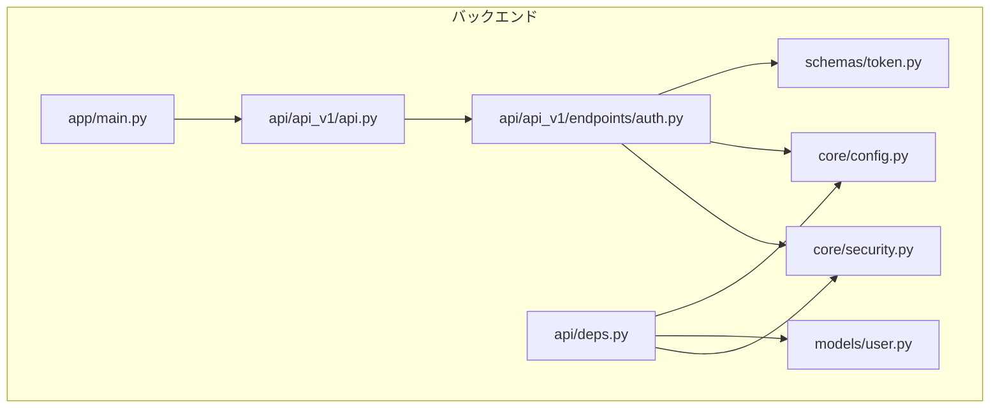
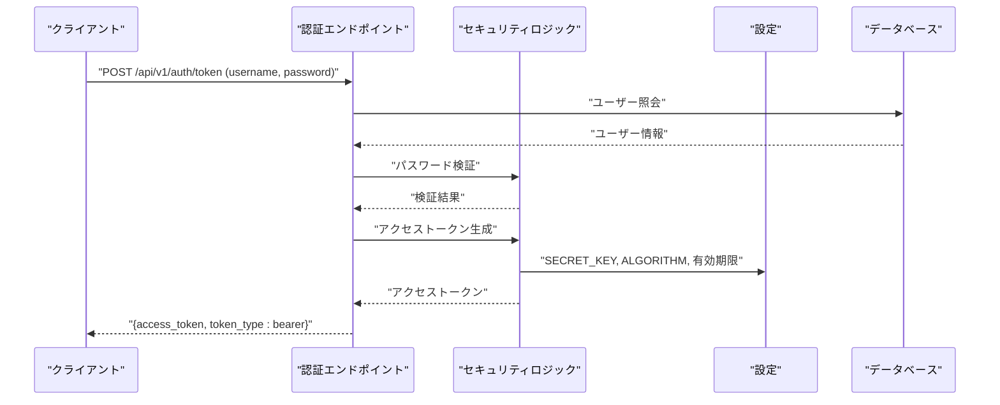
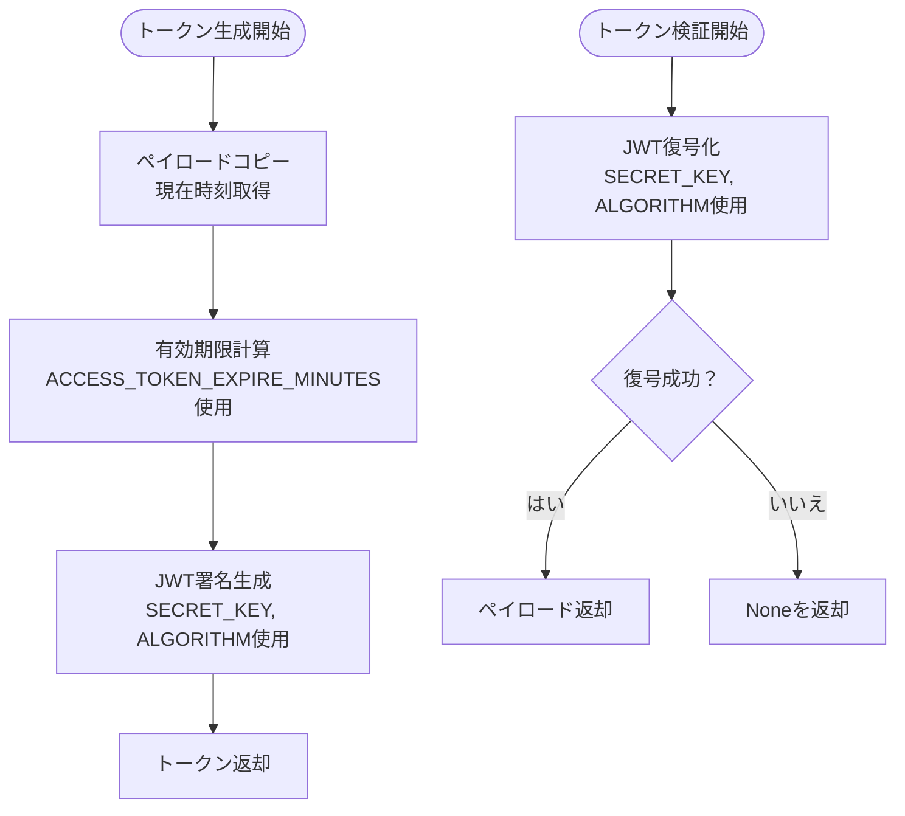
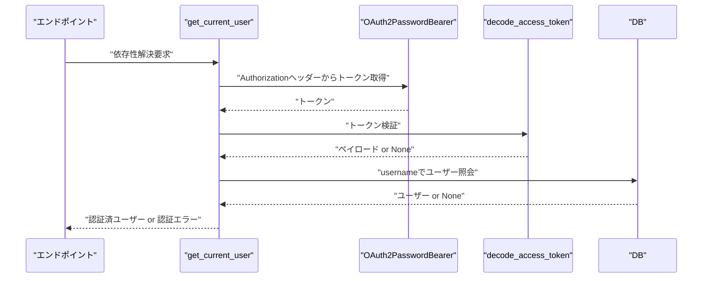
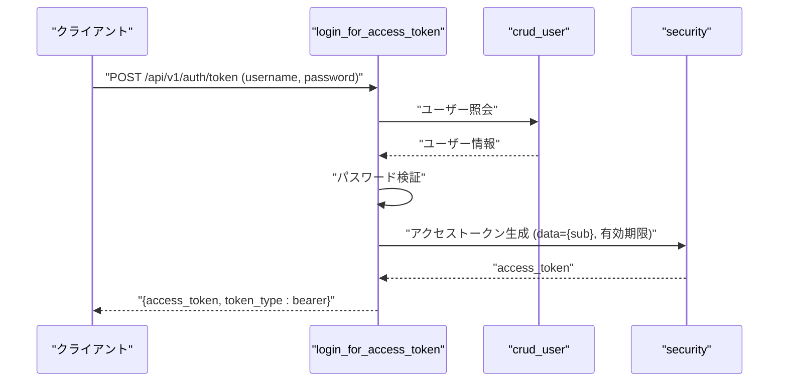
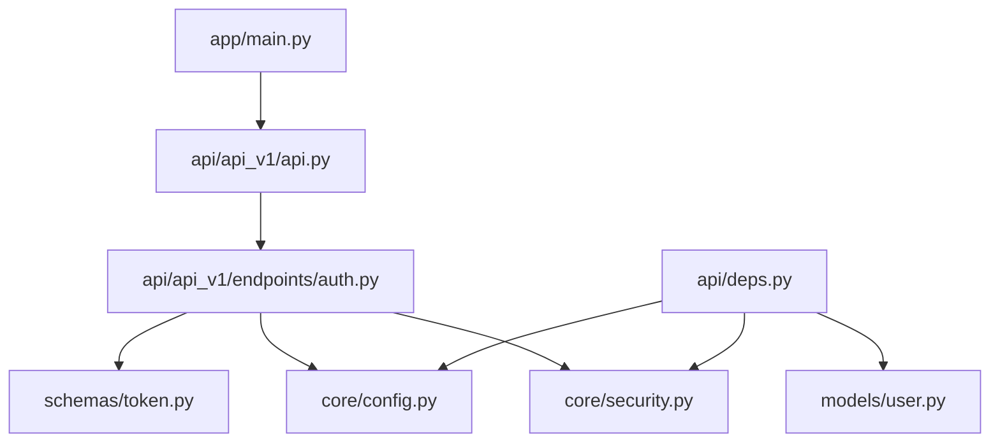

# JWTトークン管理

<cite>
**この文書で参照されるファイル**
- [backend/app/core/security.py](file://backend/app/core/security.py)
- [backend/app/api/api_v1/endpoints/auth.py](file://backend/app/api/api_v1/endpoints/auth.py)
- [backend/app/api/deps.py](file://backend/app/api/deps.py)
- [backend/app/schemas/token.py](file://backend/app/schemas/token.py)
- [backend/app/core/config.py](file://backend/app/core/config.py)
- [backend/app/models/user.py](file://backend/app/models/user.py)
- [backend/app/api/api_v1/api.py](file://backend/app/api/api_v1/api.py)
- [backend/app/main.py](file://backend/app/main.py)
- [backend/tests/test_auth.py](file://backend/tests/test_auth.py)
- [backend/pyproject.toml](file://backend/pyproject.toml)
</cite>

## 目次
1. [はじめに](#はじめに)
2. [プロジェクト構造](#プロジェクト構造)
3. [コアコンポーネント](#コアコンポーネント)
4. [アーキテクチャ概観](#アーキテクチャ概観)
5. [詳細コンポーネント解析](#詳細コンポーネント解析)
6. [依存関係分析](#依存関係分析)
7. [パフォーマンス考慮事項](#パフォーマンス考慮事項)
8. [トラブルシューティングガイド](#トラブルシューティングガイド)
9. [結論](#結論)

## はじめに
本ドキュメントでは、FastAPIベースのTodo APIにおけるJWT（JSON Web Token）の生成・検証・期限管理の実装を詳細に解説します。アクセストークンの構造（ヘッダー、ペイロード、署名）、FastAPIのDependsによる依存性注入を使ったトークン検証ロジック、認可ヘッダーの処理方法、トークンからユーザー情報を抽出する仕組み、およびトークンの再生成と更新プロセスについて、具体的なコード例を交えて説明します。

## プロジェクト構造
バックエンドはFastAPIフレームワークを用い、認証・依存性注入・設定・スキーマ・モデル・ルーティングの層に分かれています。JWT関連のロジックは以下のファイルに集中して実装されています。

**図のソース**
- [backend/app/main.py:120-128](file://backend/app/main.py#L120-L128)
- [backend/app/api/api_v1/api.py:1-8](file://backend/app/api/api_v1/api.py#L1-L8)
- [backend/app/api/api_v1/endpoints/auth.py:1-53](file://backend/app/api/api_v1/endpoints/auth.py#L1-L53)
- [backend/app/api/deps.py:1-31](file://backend/app/api/deps.py#L1-L31)
- [backend/app/core/security.py:1-35](file://backend/app/core/security.py#L1-L35)
- [backend/app/core/config.py:50-54](file://backend/app/core/config.py#L50-L54)
- [backend/app/schemas/token.py:1-10](file://backend/app/schemas/token.py#L1-L10)
- [backend/app/models/user.py:1-16](file://backend/app/models/user.py#L1-L16)

**節のソース**
- [backend/app/main.py:120-128](file://backend/app/main.py#L120-L128)
- [backend/app/api/api_v1/api.py:1-8](file://backend/app/api/api_v1/api.py#L1-L8)

## コアコンポーネント
- JWT生成・検証ロジック：アクセストークンの生成、期限設定、署名アルゴリズム、ペイロードの検証
- 依存性注入による認可：OAuth2PasswordBearerによる認可ヘッダーの取得、トークンの検証、ユーザー情報の抽出
- 認証エンドポイント：ユーザー登録、ログイン（アクセストークン発行）
- 設定管理：SECRET_KEY、ALGORITHM、ACCESS_TOKEN_EXPIRE_MINUTESなどの環境設定

**節のソース**
- [backend/app/core/security.py:10-34](file://backend/app/core/security.py#L10-L34)
- [backend/app/api/deps.py:10-30](file://backend/app/api/deps.py#L10-L30)
- [backend/app/api/api_v1/endpoints/auth.py:17-52](file://backend/app/api/api_v1/endpoints/auth.py#L17-L52)
- [backend/app/core/config.py:50-54](file://backend/app/core/config.py#L50-L54)

## アーキテクチャ概観
JWT認証の全体像は以下の通りです。クライアントはログインエンドポイントにユーザー名・パスワードを送信し、サーバーはパスワードを検証した上でアクセストークンを発行します。以降のリクエストではAuthorization: Bearerヘッダーにトークンを含めることで認証されます。依存性注入により、各エンドポイントはトークンの検証とユーザー情報の取得が自動で行われます。

**図のソース**
- [backend/app/api/api_v1/endpoints/auth.py:34-52](file://backend/app/api/api_v1/endpoints/auth.py#L34-L52)
- [backend/app/core/security.py:17-27](file://backend/app/core/security.py#L17-L27)
- [backend/app/core/config.py:50-54](file://backend/app/core/config.py#L50-L54)

## 詳細コンポーネント解析

### JWT生成・検証ロジック
- 生成：ペイロードに必要なクレーム（例：sub）を設定し、有効期限（exp）を追加。設定値（SECRET_KEY、ALGORITHM、ACCESS_TOKEN_EXPIRE_MINUTES）に基づいて署名付きJWTを生成。
- 検証：受信したトークンをSECRET_KEYとALGORITHMを使って復元し、ペイロードを取得。JWTErrorが発生した場合は無効トークンとして扱う。

**図のソース**
- [backend/app/core/security.py:17-27](file://backend/app/core/security.py#L17-L27)
- [backend/app/core/security.py:29-34](file://backend/app/core/security.py#L29-L34)
- [backend/app/core/config.py:50-54](file://backend/app/core/config.py#L50-L54)

**節のソース**
- [backend/app/core/security.py:17-34](file://backend/app/core/security.py#L17-L34)
- [backend/app/core/config.py:50-54](file://backend/app/core/config.py#L50-L54)

### 依存性注入による認可ロジック
- OAuth2PasswordBearer：Authorization: Bearerヘッダーからトークンを取得。
- get_current_user：トークンを検証し、ペイロードからusernameを取得。DBから該当ユーザーを照会し、存在しない場合は認証エラーを返す。

**図のソース**
- [backend/app/api/deps.py:10-30](file://backend/app/api/deps.py#L10-L30)
- [backend/app/core/security.py:29-34](file://backend/app/core/security.py#L29-L34)

**節のソース**
- [backend/app/api/deps.py:10-30](file://backend/app/api/deps.py#L10-L30)

### 認証エンドポイント（ログイン）
- /api/v1/auth/token：OAuth2パスワードフローに対応し、username/passwordを受け取る。ユーザー照会・パスワード検証に成功すると、アクセストークンを発行。
- トークンペイロードにはsub（ユーザー識別子）を設定し、有効期限はACCESS_TOKEN_EXPIRE_MINUTESで設定。

**図のソース**
- [backend/app/api/api_v1/endpoints/auth.py:34-52](file://backend/app/api/api_v1/endpoints/auth.py#L34-L52)
- [backend/app/core/security.py:17-27](file://backend/app/core/security.py#L17-L27)

**節のソース**
- [backend/app/api/api_v1/endpoints/auth.py:34-52](file://backend/app/api/api_v1/endpoints/auth.py#L34-L52)

### トークンスキーマ
- Token：access_token（文字列）とtoken_type（文字列）を持つ。
- TokenData：username（オプション）を持つ。

**節のソース**
- [backend/app/schemas/token.py:4-9](file://backend/app/schemas/token.py#L4-L9)

### 設定（SECRET_KEY、ALGORITHM、有効期限）
- SECRET_KEY：JWT署名に使用されるシークレットキー（環境変数経由で設定）。
- ALGORITHM：JWT署名アルゴリズム（HS256）。
- ACCESS_TOKEN_EXPIRE_MINUTES：アクセストークンの有効期限（分）。

**節のソース**
- [backend/app/core/config.py:50-54](file://backend/app/core/config.py#L50-L54)

### モデル（ユーザー）
- User：id（UUID）、username（一意）、hashed_password（パスワードハッシュ）を持ち、Todoとの関連を備える。

**節のソース**
- [backend/app/models/user.py:9-16](file://backend/app/models/user.py#L9-L16)

### APIルーティング
- /api/v1/auth：認証関連エンドポイント（登録、ログイン）。
- /api/v1/users：ユーザー管理API。
- /api/v1/todos：TODO管理API。

**節のソース**
- [backend/app/api/api_v1/api.py:4-7](file://backend/app/api/api_v1/api.py#L4-L7)

### OpenAPIセキュリティスキーマ
- Bearer認証スキーマをOpenAPIスキーマに追加し、SwaggerやScalarでの認証入力が可能になる。

**節のソース**
- [backend/app/main.py:73-102](file://backend/app/main.py#L73-L102)

## 依存関係分析
JWT認証に関連するモジュール間の依存関係は以下の通りです。認証エンドポイントはセキュリティロジックに依存し、依存性注入はOAuth2PasswordBearerとセキュリティロジックを介してユーザー情報を取得します。

**図のソース**
- [backend/app/api/api_v1/endpoints/auth.py:1-53](file://backend/app/api/api_v1/endpoints/auth.py#L1-L53)
- [backend/app/api/deps.py:1-31](file://backend/app/api/deps.py#L1-L31)
- [backend/app/core/security.py:1-35](file://backend/app/core/security.py#L1-L35)
- [backend/app/core/config.py:50-54](file://backend/app/core/config.py#L50-L54)
- [backend/app/schemas/token.py:1-10](file://backend/app/schemas/token.py#L1-L10)
- [backend/app/models/user.py:1-16](file://backend/app/models/user.py#L1-L16)
- [backend/app/api/api_v1/api.py:1-8](file://backend/app/api/api_v1/api.py#L1-L8)
- [backend/app/main.py:120-128](file://backend/app/main.py#L120-L128)

**節のソース**
- [backend/app/api/api_v1/endpoints/auth.py:1-53](file://backend/app/api/api_v1/endpoints/auth.py#L1-L53)
- [backend/app/api/deps.py:1-31](file://backend/app/api/deps.py#L1-L31)

## パフォーマンス考慮事項
- トークン有効期限：短い有効期限（例：30分）はセキュリティ向上に寄与するが、頻繁な再認証によるUXへの影響も考慮する必要がある。
- 依存性注入のオーバーヘッド：get_current_userは各エンドポイントで呼ばれるため、必要最小限のDB照会のみに留める。
- 依存ライブラリ：python-jose、passlib、argon2-cffi、sqlmodelなどのパフォーマンス特性を考慮し、適切な設定を行う。

[この節は一般的なガイダンスであり、特定のファイルを直接分析していないため、節のソースは記載しない]

## トラブルシューティングガイド
- 401 Unauthorized：認証情報の検証に失敗した場合。Authorizationヘッダーの形式（Bearer）やトークンの有効期限、SECRET_KEYの一致を確認。
- トークン無効：decode_access_tokenがJWTErrorを投げた場合、署名が不正または期限切れである可能性あり。
- DB照会失敗：get_current_userがユーザーを取得できなかった場合、DB接続状況やユーザーの存在を確認。

**節のソース**
- [backend/app/api/deps.py:17-29](file://backend/app/api/deps.py#L17-L29)
- [backend/app/core/security.py:30-34](file://backend/app/core/security.py#L30-L34)

## 結論
本プロジェクトでは、FastAPIのDependsによる依存性注入を活用し、OAuth2PasswordBearerによる認可ヘッダーの取得、JWTの生成・検証、ユーザー情報の抽出を効率的に実装しています。アクセストークンの有効期限は設定値で管理され、OpenAPIスキーマにBearer認証を統合することで、APIの利用とセキュリティを両立しています。現状ではリフレッシュトークンの実装は含まれていませんが、アクセストークンの再発行プロセスを追加することで、より堅牢な認証フローを実現できます。