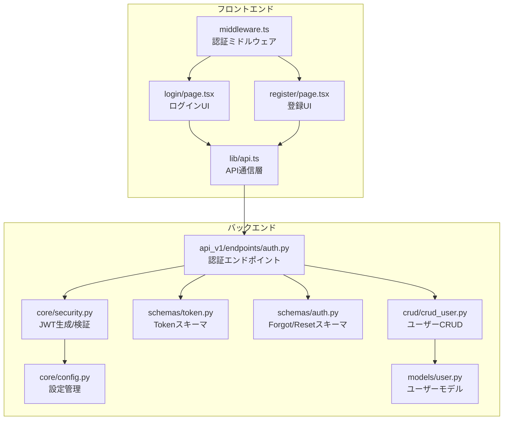
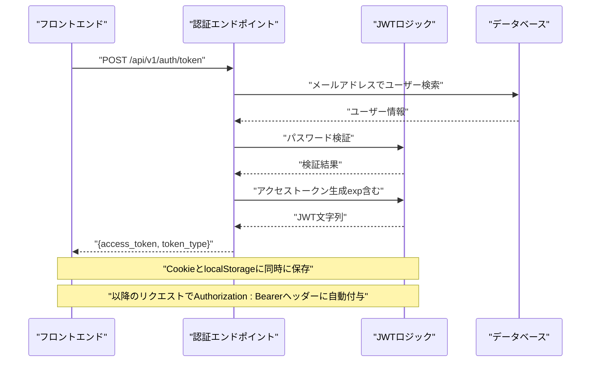
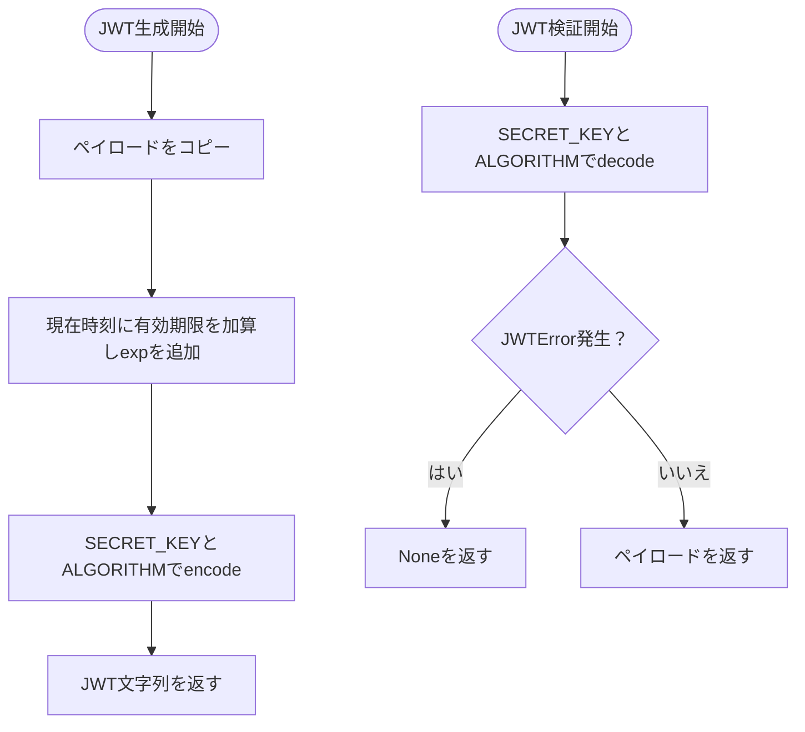
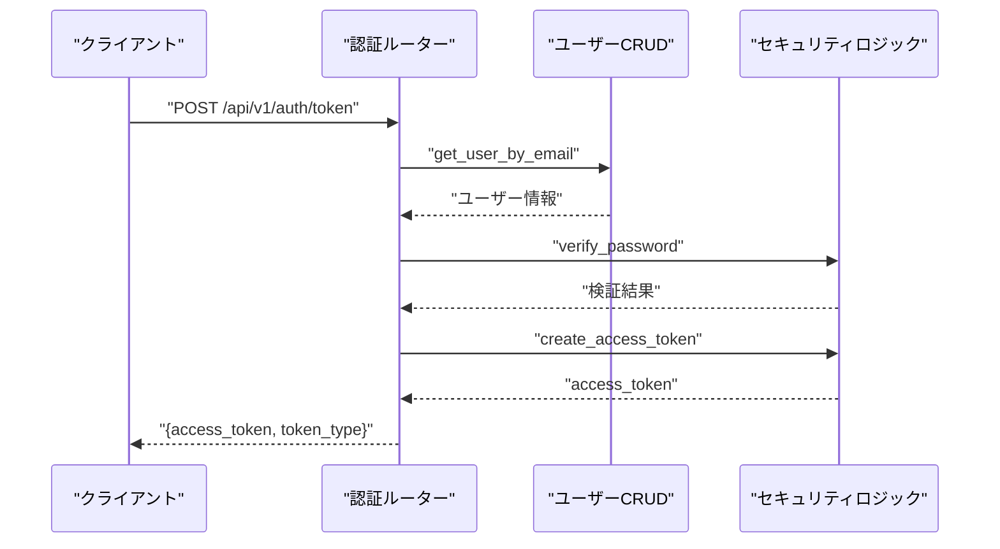
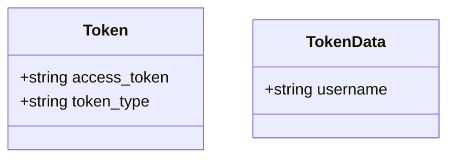
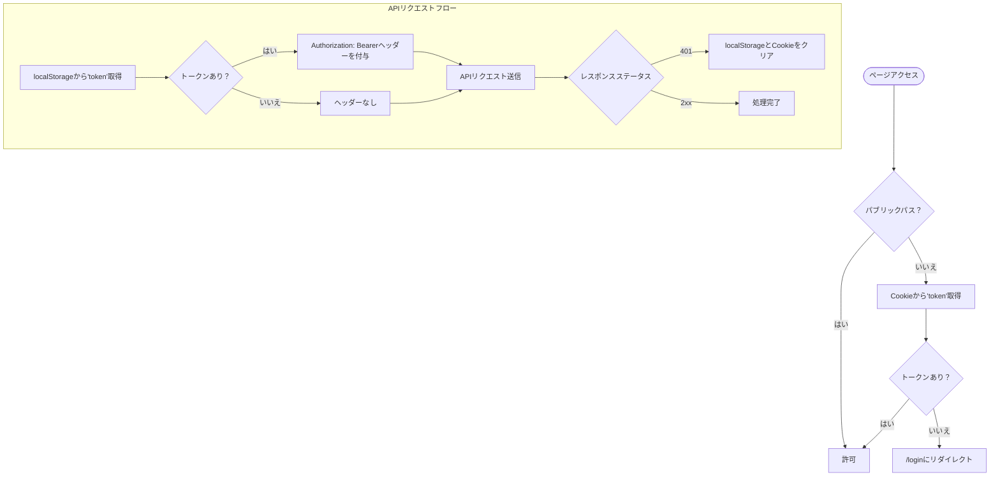
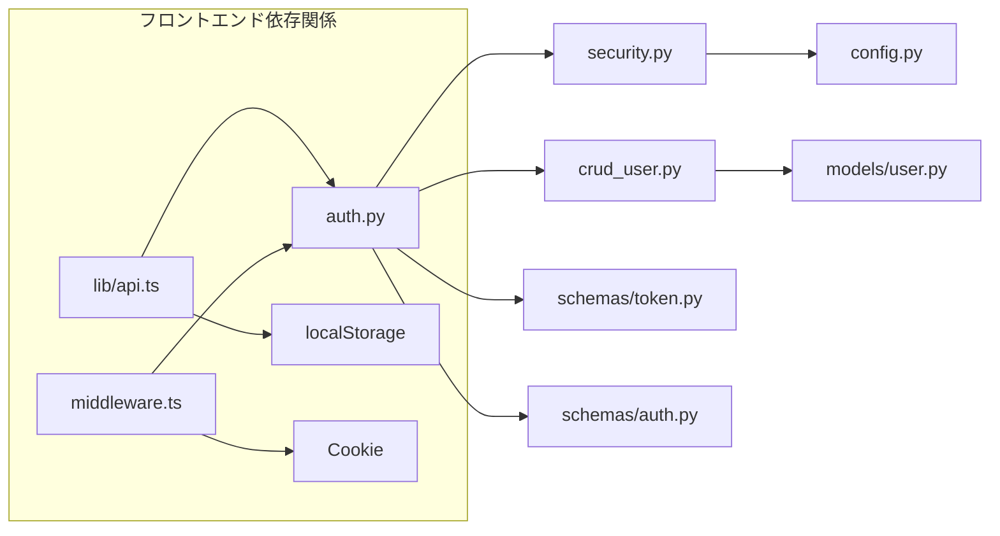

# JWTトークン管理

<cite>
**この文書で参照されるファイル**
- [backend/app/core/security.py](file://backend/app/core/security.py)
- [backend/app/core/config.py](file://backend/app/core/config.py)
- [backend/app/api/api_v1/endpoints/auth.py](file://backend/app/api/api_v1/endpoints/auth.py)
- [backend/app/schemas/token.py](file://backend/app/schemas/token.py)
- [backend/app/schemas/auth.py](file://backend/app/schemas/auth.py)
- [backend/app/crud/crud_user.py](file://backend/app/crud/crud_user.py)
- [backend/app/models/user.py](file://backend/app/models/user.py)
- [frontend/src/middleware.ts](file://frontend/src/middleware.ts)
- [frontend/src/app/login/page.tsx](file://frontend/src/app/login/page.tsx)
- [frontend/src/app/register/page.tsx](file://frontend/src/app/register/page.tsx)
- [frontend/src/lib/api.ts](file://frontend/src/lib/api.ts)
- [docs/auth_specification.md](file://docs/auth_specification.md)
- [backend/tests/test_auth.py](file://backend/tests/test_auth.py)
</cite>

## 更新要旨
**変更内容**
- トークン保持方式のデュアル方式（localStorage + Cookie）への移行を反映
- Cookie認証とSameSite=Strict属性の追加について更新
- APIリクエスト時のAuthorizationヘッダー自動付与ロジックの詳細追加
- トークン有効期限（Cookie: 7日間、localStorage: 30分）の差異について明確化

## 目次
1. [はじめに](#はじめに)
2. [プロジェクト構造](#プロジェクト構造)
3. [コアコンポーネント](#コアコンポーネント)
4. [アーキテクチャ概観](#アーキテクチャ概観)
5. [詳細コンポーネント分析](#詳細コンポーネント分析)
6. [依存関係分析](#依存関係分析)
7. [パフォーマンス考慮事項](#パフォーマンス考慮事項)
8. [トラブルシューティングガイド](#トラブルシューティングガイド)
9. [結論](#結論)

## はじめに
本ドキュメントは、TodoアプリケーションにおけるJWT（JSON Web Token）の生成、検証、管理プロセスの詳細仕様と実装を提供します。JWTの構造（ヘッダー、ペイロード、署名）、トークンの発行・検証・更新・無効化プロセス、有効期限管理、およびフロントエンドでの保存方法（Cookie/LocalStorage）について、コードレベルでの可視化と実装詳細を示します。

**更新** トークン保持方式がデュアル方式（localStorage + Cookie）に移行し、Cookie認証とSameSite=Strict属性が追加されました。

## プロジェクト構造
バックエンドはFastAPI、フロントエンドはNext.jsで構成され、認証フロー全体は以下の構成で実装されています：
- 認証エンドポイント：/api/v1/auth
- JWT生成・検証ロジック：backend/app/core/security.py
- 設定管理：backend/app/core/config.py
- 認証スキーマ：backend/app/schemas/token.py、backend/app/schemas/auth.py
- ユーザーCRUD：backend/app/crud/crud_user.py、backend/app/models/user.py
- 認証フロー（フロントエンド）：frontend/src/middleware.ts、frontend/src/app/login/page.tsx、frontend/src/app/register/page.tsx
- API通信：frontend/src/lib/api.ts
- 統一エラーハンドリング：backend/app/middleware/error_handler.py

```mermaid
graph TB
subgraph "フロントエンド"
FE_MW["middleware.ts<br/>認証ミドルウェア"]
FE_LOGIN["login/page.tsx<br/>ログインUI"]
FE_REG["register/page.tsx<br/>登録UI"]
FE_API["lib/api.ts<br/>API通信層"]
end
subgraph "バックエンド"
BE_AUTH["api_v1/endpoints/auth.py<br/>認証エンドポイント"]
BE_SEC["core/security.py<br/>JWT生成/検証"]
BE_CFG["core/config.py<br/>設定管理"]
BE_SCHEMA_T["schemas/token.py<br/>Tokenスキーマ"]
BE_SCHEMA_A["schemas/auth.py<br/>Forgot/Resetスキーマ"]
BE_CRUD["crud/crud_user.py<br/>ユーザーCRUD"]
BE_MODEL["models/user.py<br/>ユーザーモデル"]
end
FE_MW --> FE_LOGIN
FE_MW --> FE_REG
FE_LOGIN --> FE_API
FE_REG --> FE_API
FE_API --> BE_AUTH
BE_AUTH --> BE_SEC
BE_AUTH --> BE_CRUD
BE_CRUD --> BE_MODEL
BE_SEC --> BE_CFG
BE_AUTH --> BE_SCHEMA_T
BE_AUTH --> BE_SCHEMA_A
```

**図の出典**
- [frontend/src/middleware.ts:1-35](file://frontend/src/middleware.ts#L1-L35)
- [frontend/src/app/login/page.tsx:1-110](file://frontend/src/app/login/page.tsx#L1-L110)
- [frontend/src/app/register/page.tsx:1-112](file://frontend/src/app/register/page.tsx#L1-L112)
- [frontend/src/lib/api.ts:1-125](file://frontend/src/lib/api.ts#L1-L125)
- [backend/app/api/api_v1/endpoints/auth.py:1-117](file://backend/app/api/api_v1/endpoints/auth.py#L1-L117)
- [backend/app/core/security.py:1-35](file://backend/app/core/security.py#L1-L35)
- [backend/app/core/config.py:1-91](file://backend/app/core/config.py#L1-L91)
- [backend/app/schemas/token.py:1-10](file://backend/app/schemas/token.py#L1-L10)
- [backend/app/schemas/auth.py:1-11](file://backend/app/schemas/auth.py#L1-L11)
- [backend/app/crud/crud_user.py:1-28](file://backend/app/crud/crud_user.py#L1-L28)
- [backend/app/models/user.py:1-16](file://backend/app/models/user.py#L1-L16)

**節の出典**
- [backend/app/api/api_v1/endpoints/auth.py:1-117](file://backend/app/api/api_v1/endpoints/auth.py#L1-L117)
- [backend/app/core/security.py:1-35](file://backend/app/core/security.py#L1-L35)
- [backend/app/core/config.py:1-91](file://backend/app/core/config.py#L1-L91)
- [frontend/src/middleware.ts:1-35](file://frontend/src/middleware.ts#L1-L35)
- [frontend/src/lib/api.ts:1-125](file://frontend/src/lib/api.ts#L1-L125)

## コアコンポーネント
- **JWT生成/検証ロジック**
  - 生成：署名アルゴリズム、シークレットキー、有効期限を設定し、ペイロードにexpを追加してエンコード
  - 検証：指定アルゴリズムとシークレットキーでデコードし、JWTErrorを補足
- **認証エンドポイント**
  - /auth/token：OAuth2PasswordRequestFormによる認証、ユーザー存在チェック、パスワード検証、アクセストークン発行
  - /auth/register：新規ユーザー登録（パスワードハッシュ化後DB保存）
  - /auth/forgot-password：パスワードリセットメール送信（トークン無効化→新規作成→メール送信）
  - /auth/reset-password：リセットトークン検証、パスワード更新、トークン使用済みマーク
- **認証スキーマ**
  - Token：access_token、token_type
  - TokenData：任意のユーザー識別情報（例：sub）
  - ForgotPasswordRequest、ResetPasswordRequest：リセットフロー用入力バリデーション
- **設定**
  - SECRET_KEY、ALGORITHM、ACCESS_TOKEN_EXPIRE_MINUTES、RESET_TOKEN_EXPIRE_HOURS、CORS、レート制限など
- **ユーザーCRUD**
  - メールアドレス/IDによる検索、新規登録（パスワードハッシュ化）
- **フロントエンドトークン管理**
  - **デュアル方式**：APIリクエスト時はlocalStorage、ミドルウェア認証時はCookie
  - Cookie属性：SameSite=Strict、有効期限7日間、HTTPS時はSecure属性付与
  - Authorizationヘッダー：apiFetch関数による自動付与

**更新** トークン保持方式がデュアル方式に変更され、Cookie認証が追加されました。

**節の出典**
- [backend/app/core/security.py:16-35](file://backend/app/core/security.py#L16-L35)
- [backend/app/api/api_v1/endpoints/auth.py:36-54](file://backend/app/api/api_v1/endpoints/auth.py#L36-L54)
- [backend/app/schemas/token.py:4-10](file://backend/app/schemas/token.py#L4-L10)
- [backend/app/schemas/auth.py:4-11](file://backend/app/schemas/auth.py#L4-L11)
- [backend/app/core/config.py:51-83](file://backend/app/core/config.py#L51-L83)
- [backend/app/crud/crud_user.py:18-27](file://backend/app/crud/crud_user.py#L18-L27)
- [frontend/src/lib/api.ts:29-72](file://frontend/src/lib/api.ts#L29-L72)
- [frontend/src/lib/api.ts:74-124](file://frontend/src/lib/api.ts#L74-L124)

## アーキテクチャ概観
JWT認証フローの全体像：
- 認証エンドポイントがJWTを発行
- **デュアル方式**：フロントエンドはCookieとlocalStorageの両方にトークンを保存
- 以降のリクエストでAuthorization: Bearerヘッダーに含める（apiFetchによる自動付与）
- Next.jsミドルウェアはCookieからトークンを確認し、認証チェックを行う
- トークンの有効期限切れや無効化により認証エラーが発生

```mermaid
sequenceDiagram
participant FE as "フロントエンド"
participant AUTH as "認証エンドポイント"
participant SEC as "JWTロジック"
participant DB as "データベース"
FE->>AUTH : "POST /api/v1/auth/token"
AUTH->>DB : "メールアドレスでユーザー検索"
DB-->>AUTH : "ユーザー情報"
AUTH->>SEC : "パスワード検証"
SEC-->>AUTH : "検証結果"
AUTH->>SEC : "アクセストークン生成exp含む"
SEC-->>AUTH : "JWT文字列"
AUTH-->>FE : "{access_token, token_type}"
Note over FE,SEC : "CookieとlocalStorageに同時に保存"
Note over FE,SEC : "以降のリクエストでAuthorization : Bearerヘッダーに自動付与"
```

**更新** トークンの保存先がCookieとlocalStorageのデュアル方式に変更され、ミドルウェア認証が追加されました。

**図の出典**
- [backend/app/api/api_v1/endpoints/auth.py:36-54](file://backend/app/api/api_v1/endpoints/auth.py#L36-L54)
- [backend/app/core/security.py:17-27](file://backend/app/core/security.py#L17-L27)
- [backend/app/crud/crud_user.py:8-11](file://backend/app/crud/crud_user.py#L8-L11)
- [frontend/src/lib/api.ts:112-113](file://frontend/src/lib/api.ts#L112-L113)

## 詳細コンポーネント分析

### JWT生成・検証ロジック
- 生成手順
  - 入力ペイロードをコピーし、現在時刻（UTC）に有効期限を加算してexpを追加
  - SECRET_KEYとALGORITHMを使ってjwt.encodeで署名付きJWTを生成
- 検証手順
  - 同じSECRET_KEYとALGORITHMでjwt.decodeを実行
  - JWTErrorを補足し、失敗時はNoneを返す

```mermaid
flowchart TD
Start(["JWT生成開始"]) --> Copy["ペイロードをコピー"]
Copy --> SetExp["現在時刻に有効期限を加算しexpを追加"]
SetExp --> Encode["SECRET_KEYとALGORITHMでencode"]
Encode --> Return["JWT文字列を返す"]
DecodeStart(["JWT検証開始"]) --> Decode["SECRET_KEYとALGORITHMでdecode"]
Decode --> Try{"JWTError発生？"}
Try --> |はい| ReturnNone["Noneを返す"]
Try --> |いいえ| ReturnPayload["ペイロードを返す"]
```

**図の出典**
- [backend/app/core/security.py:17-34](file://backend/app/core/security.py#L17-L34)

**節の出典**
- [backend/app/core/security.py:16-35](file://backend/app/core/security.py#L16-L35)

### 認証エンドポイント（ログイン）
- 入力：OAuth2PasswordRequestForm（username=メールアドレス、password）
- 処理：
  - DBからメールアドレスでユーザーを取得
  - パスワード検証（verify_password）
  - 有効期限付きアクセストークンを生成（create_access_token）
  - {access_token, token_type}を返す
- エラー：
  - 認証失敗時は401、WWW-Authenticate: Bearerヘッダー付き

```mermaid
sequenceDiagram
participant C as "クライアント"
participant R as "認証ルーター"
participant U as "ユーザーCRUD"
participant S as "セキュリティロジック"
C->>R : "POST /api/v1/auth/token"
R->>U : "get_user_by_email"
U-->>R : "ユーザー情報"
R->>S : "verify_password"
S-->>R : "検証結果"
R->>S : "create_access_token"
S-->>R : "access_token"
R-->>C : "{access_token, token_type}"
```

**図の出典**
- [backend/app/api/api_v1/endpoints/auth.py:36-54](file://backend/app/api/api_v1/endpoints/auth.py#L36-L54)
- [backend/app/crud/crud_user.py:8-11](file://backend/app/crud/crud_user.py#L8-L11)
- [backend/app/core/security.py:17-27](file://backend/app/core/security.py#L17-L27)

**節の出典**
- [backend/app/api/api_v1/endpoints/auth.py:36-54](file://backend/app/api/api_v1/endpoints/auth.py#L36-L54)

### 認証スキーマ
- Token
  - access_token: 文字列（JWT）
  - token_type: 文字列（bearer）
- TokenData
  - username: オプション（例：subとしてユーザーIDを格納）

```mermaid
classDiagram
class Token {
+string access_token
+string token_type
}
class TokenData {
+string username
}
```

**図の出典**
- [backend/app/schemas/token.py:4-10](file://backend/app/schemas/token.py#L4-L10)

**節の出典**
- [backend/app/schemas/token.py:4-10](file://backend/app/schemas/token.py#L4-L10)

### 設定管理
- 必須設定
  - SECRET_KEY: JWT署名用シークレット
  - ALGORITHM: HS256（固定）
  - ACCESS_TOKEN_EXPIRE_MINUTES: トークン有効期間（分）- **デフォルト30分**
  - RESET_TOKEN_EXPIRE_HOURS: パスワードリセットトークン有効期間（時間）
- CORS、レート制限、メール設定、フロントエンドURLなど

**節の出典**
- [backend/app/core/config.py:51-83](file://backend/app/core/config.py#L51-L83)

### ユーザーCRUD
- get_user_by_email：メールアドレスでユーザー取得
- get_user_by_id：IDでユーザー取得
- create_user：パスワードをハッシュ化して新規登録

**節の出典**
- [backend/app/crud/crud_user.py:8-27](file://backend/app/crud/crud_user.py#L8-L27)
- [backend/app/models/user.py:9-16](file://backend/app/models/user.py#L9-L16)

### 認証フロー（フロントエンド）
- **認証ミドルウェア**
  - 認証不要パス：/login、/register、/forgot-password、/reset-password
  - それ以外のパス：Cookieから'token'を取得し、存在しない場合は/loginにリダイレクト
- **API通信層**
  - apiFetch関数：localStorageからトークンを取得し、Authorization: Bearerヘッダーを自動付与
  - 自動ログアウト：401エラー時にlocalStorageとCookieをクリア
- **ログインUI**
  - zodバリデーション、エラーハンドリングあり
  - login関数経由でAPI呼び出し（api.tsで提供）

```mermaid
flowchart TD
Enter(["ページアクセス"]) --> Public{"パブリックパス？"}
Public --> |はい| Allow["許可"]
Public --> |いいえ| CheckCookie["Cookieから'token'取得"]
CheckCookie --> HasToken{"トークンあり？"}
HasToken --> |はい| Allow
HasToken --> |いいえ| Redirect["/loginにリダイレクト"]
subgraph "APIリクエストフロー"
TokenCheck["localStorageから'token'取得"] --> HasLocal{"トークンあり？"}
HasLocal --> |はい| AddHeader["Authorization: Bearerヘッダーを付与"]
HasLocal --> |いいえ| NoHeader["ヘッダーなし"]
AddHeader --> Request["APIリクエスト送信"]
NoHeader --> Request
Request --> Response{"レスポンスステータス"}
Response --> |401| Logout["localStorageとCookieをクリア"]
Response --> |2xx| Success["処理完了"]
end
```

**更新** Cookie認証とSameSite=Strict属性が追加され、APIリクエスト時のAuthorizationヘッダー自動付与ロジックが実装されました。

**図の出典**
- [frontend/src/middleware.ts:7-26](file://frontend/src/middleware.ts#L7-L26)
- [frontend/src/lib/api.ts:29-72](file://frontend/src/lib/api.ts#L29-L72)
- [frontend/src/lib/api.ts:74-124](file://frontend/src/lib/api.ts#L74-L124)

**節の出典**
- [frontend/src/middleware.ts:1-35](file://frontend/src/middleware.ts#L1-L35)
- [frontend/src/app/login/page.tsx:15-41](file://frontend/src/app/login/page.tsx#L15-L41)
- [frontend/src/app/register/page.tsx:16-47](file://frontend/src/app/register/page.tsx#L16-L47)
- [frontend/src/lib/api.ts:1-125](file://frontend/src/lib/api.ts#L1-L125)

### トークン保持方式（デュアル方式）
- **Cookie側**
  - SameSite=Strict：クロスサイトリクエストを防ぐ
  - 有効期限：7日間（localStorageと同期）
  - HTTPS時：Secure属性を自動付与
  - Next.jsミドルウェアによる認証チェック用
- **localStorage側**
  - APIリクエスト時のAuthorization: Bearerヘッダー自動付与用
  - 有効期限：30分（ACCESS_TOKEN_EXPIRE_MINUTES）
- **同期ロジック**
  - ログイン成功時：CookieとlocalStorageに同じトークンを保存
  - 401エラー時：両方をクリアして自動ログアウト
  - ログアウト時：両方をクリア

**新規** トークン保持方式がデュアル方式に変更され、Cookie認証が追加されました。

**節の出典**
- [frontend/src/lib/api.ts:74-124](file://frontend/src/lib/api.ts#L74-L124)
- [frontend/src/middleware.ts:15-23](file://frontend/src/middleware.ts#L15-L23)

## 依存関係分析
- 認証エンドポイントはセキュリティロジック、ユーザーCRUD、設定、スキーマに依存
- JWT生成には設定（SECRET_KEY、ALGORITHM、ACCESS_TOKEN_EXPIRE_MINUTES）が必要
- **フロントエンド**：apiFetch関数はlocalStorageに依存し、ミドルウェアはCookieに依存
- **新規**：Cookie認証により、ミドルウェアとAPI層の両方がトークンを扱うようになります

```mermaid
graph LR
AUTH["auth.py"] --> SEC["security.py"]
AUTH --> CRUD["crud_user.py"]
AUTH --> SCHEMA_T["schemas/token.py"]
AUTH --> SCHEMA_A["schemas/auth.py"]
SEC --> CFG["config.py"]
CRUD --> MODEL["models/user.py"]
subgraph "フロントエンド依存関係"
API["lib/api.ts"] --> LOCAL["localStorage"]
MW["middleware.ts"] --> COOKIE["Cookie"]
API --> AUTH
MW --> AUTH
end
```

**更新** Cookie認証とデュアル方式により、フロントエンドの依存関係が変更されました。

**図の出典**
- [backend/app/api/api_v1/endpoints/auth.py:1-117](file://backend/app/api/api_v1/endpoints/auth.py#L1-L117)
- [backend/app/core/security.py:1-35](file://backend/app/core/security.py#L1-L35)
- [backend/app/core/config.py:1-91](file://backend/app/core/config.py#L1-L91)
- [backend/app/crud/crud_user.py:1-28](file://backend/app/crud/crud_user.py#L1-L28)
- [backend/app/models/user.py:1-16](file://backend/app/models/user.py#L1-L16)
- [backend/app/schemas/token.py:1-10](file://backend/app/schemas/token.py#L1-L10)
- [backend/app/schemas/auth.py:1-11](file://backend/app/schemas/auth.py#L1-L11)
- [frontend/src/lib/api.ts:1-125](file://frontend/src/lib/api.ts#L1-L125)
- [frontend/src/middleware.ts:1-35](file://frontend/src/middleware.ts#L1-L35)

**節の出典**
- [backend/app/api/api_v1/endpoints/auth.py:1-117](file://backend/app/api/api_v1/endpoints/auth.py#L1-L117)
- [backend/app/core/security.py:1-35](file://backend/app/core/security.py#L1-L35)
- [frontend/src/lib/api.ts:1-125](file://frontend/src/lib/api.ts#L1-L125)
- [frontend/src/middleware.ts:1-35](file://frontend/src/middleware.ts#L1-L35)

## パフォーマンス考慮事項
- JWT生成・検証は軽量だが、頻繁な認証リクエストはレート制限を考慮
- 有効期限の短縮（ACCESS_TOKEN_EXPIRE_MINUTES）はセキュリティ向上に寄与
- DB検索（メールアドレス）は適切なインデックスを持つことを推奨
- **新規**：CookieとlocalStorageの両方への保存により、初期ロード時のパフォーマンスに影響を与える可能性あり

## トラブルシューティングガイド
- 認証エラー（401）
  - 認証情報不正、トークン未設定、有効期限切れ
  - **新規**：CookieとlocalStorageのどちらかにトークンが残っている場合の対処
  - 統一エラーハンドラーが日本語メッセージを返す
- トークン検証失敗
  - SECRET_KEY不一致、アルゴリズム不一致、ペイロード改ざん
  - decode_access_tokenはJWTErrorを補足し、Noneを返す
- **新規**：Cookie認証に関する問題
  - SameSite=Strictによるクロスサイトリクエスト制限
  - HTTPS環境でのSecure属性確認
  - Cookieの有効期限（7日間）とlocalStorageの期限（30分）の違い
- 統一エラーレスポンス
  - validation_exception_handler、http_exception_handler、rate_limit_exception_handler、general_exception_handler

**更新** Cookie認証とデュアル方式に伴うトラブルシューティング項目が追加されました。

**節の出典**
- [backend/app/api/api_v1/endpoints/auth.py:44-49](file://backend/app/api/api_v1/endpoints/auth.py#L44-L49)
- [backend/app/core/security.py:29-35](file://backend/app/core/security.py#L29-L35)
- [backend/app/middleware/error_handler.py:15-49](file://backend/app/middleware/error_handler.py#L15-L49)
- [backend/app/middleware/error_handler.py:52-76](file://backend/app/middleware/error_handler.py#L52-L76)
- [backend/app/middleware/error_handler.py:125-148](file://backend/app/middleware/error_handler.py#L125-L148)
- [frontend/src/lib/api.ts:56-58](file://frontend/src/lib/api.ts#L56-L58)

## 結論
本システムは、FastAPI＋Next.jsによるJWTベースの認証を実装しています。バックエンドではJWTの生成・検証ロジック、認証エンドポイント、設定管理、ユーザーCRUDが明確に分離されており、フロントエンドでは**デュアル方式**（Cookie＋localStorage）による認証ミドルウェアとAPI通信が提供されています。

**更新** トークン保持方式がCookie認証とSameSite=Strict属性を含むデュアル方式に移行し、APIリクエスト時のAuthorizationヘッダー自動付与が実装されました。今後の改善点として、Cookie/LocalStorageの両対応、リフレッシュトークン導入、Cookieのセキュリティ設定の最適化などが挙げられます。