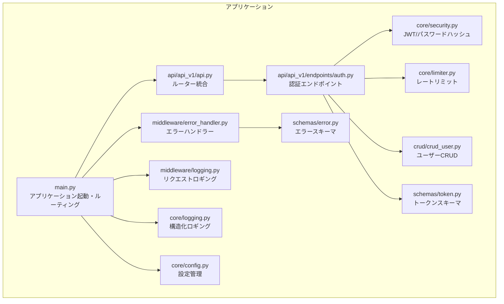
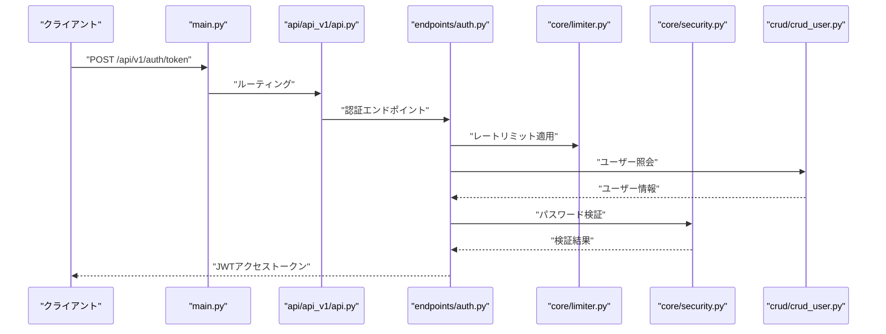
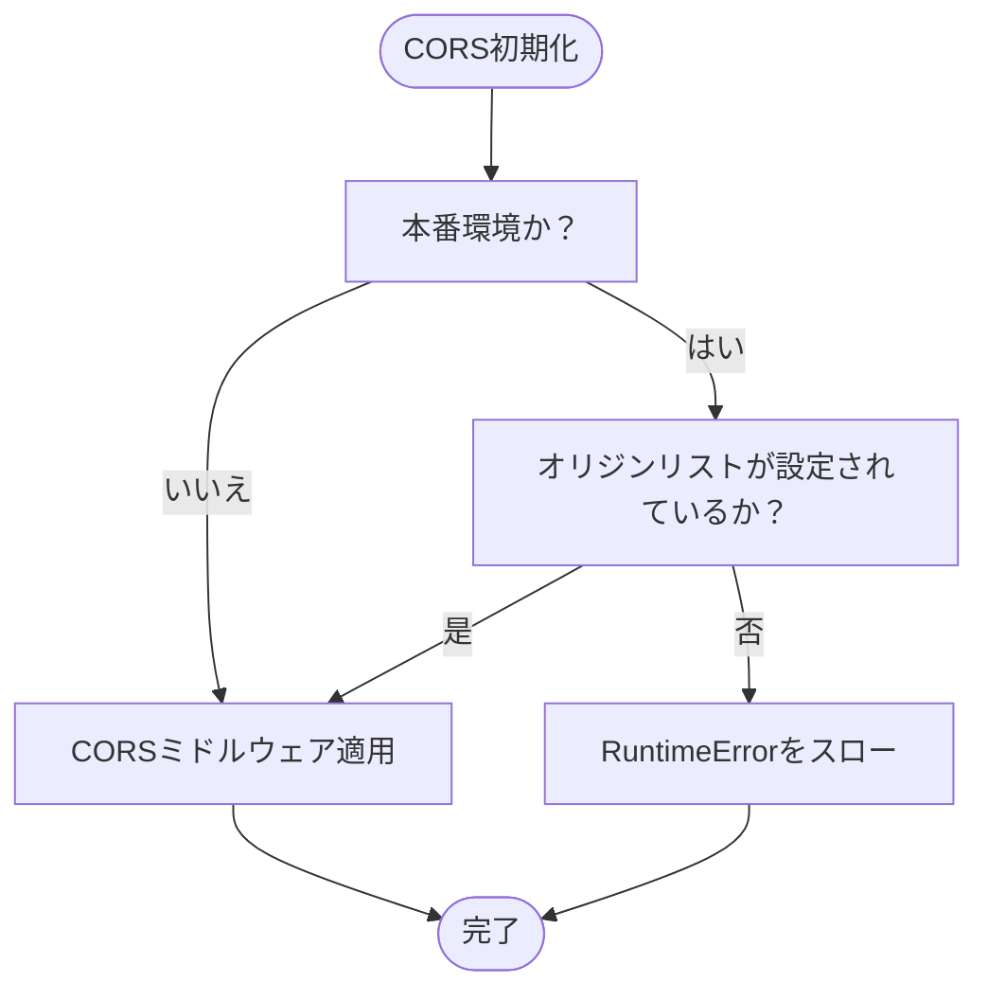
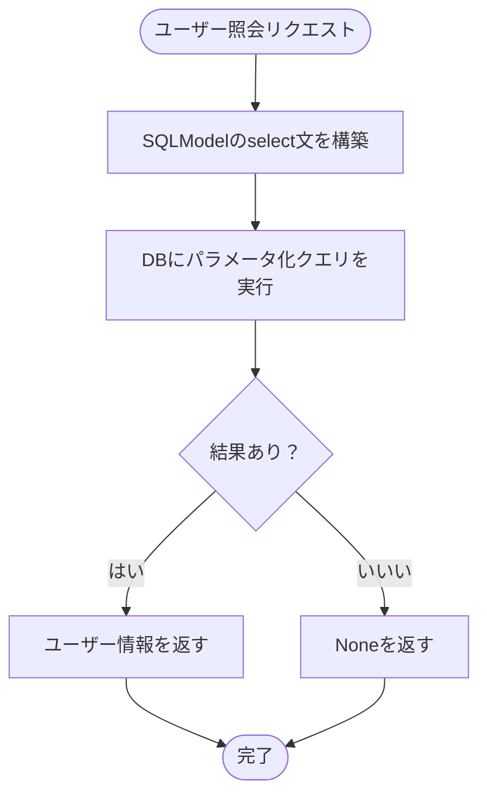
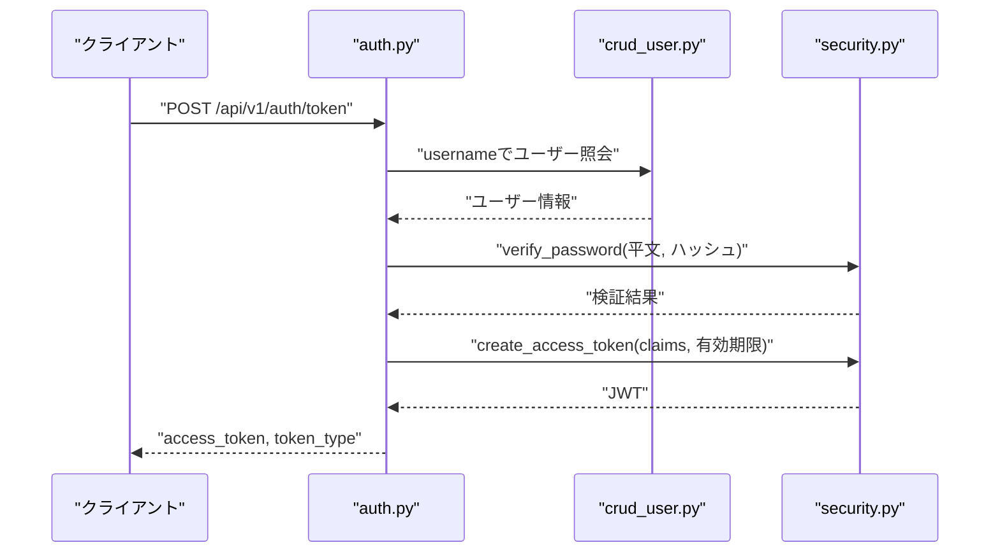
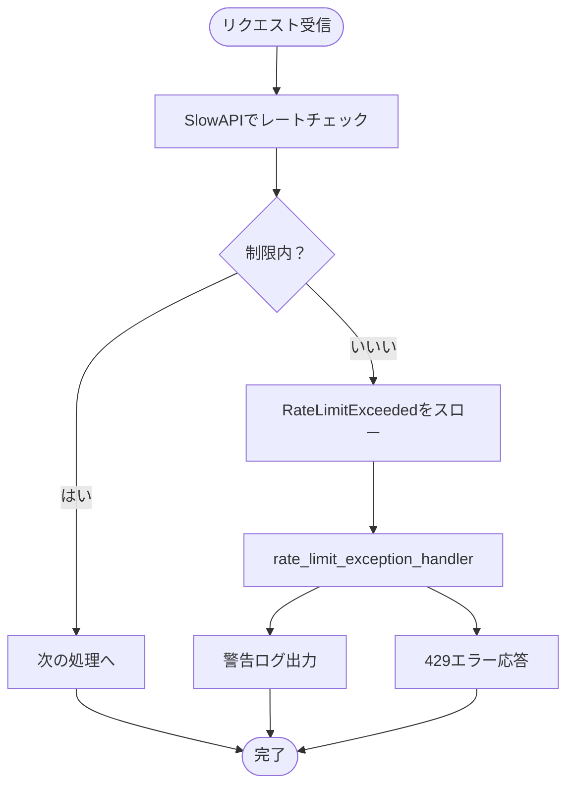
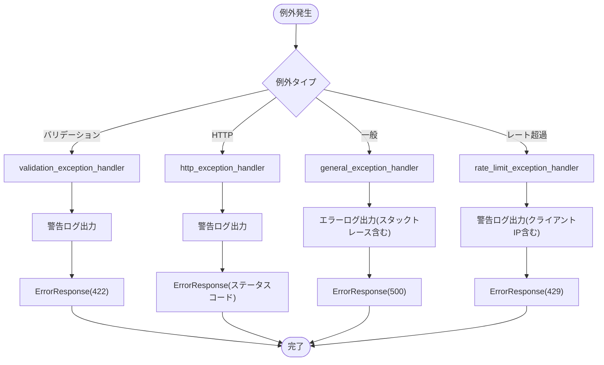
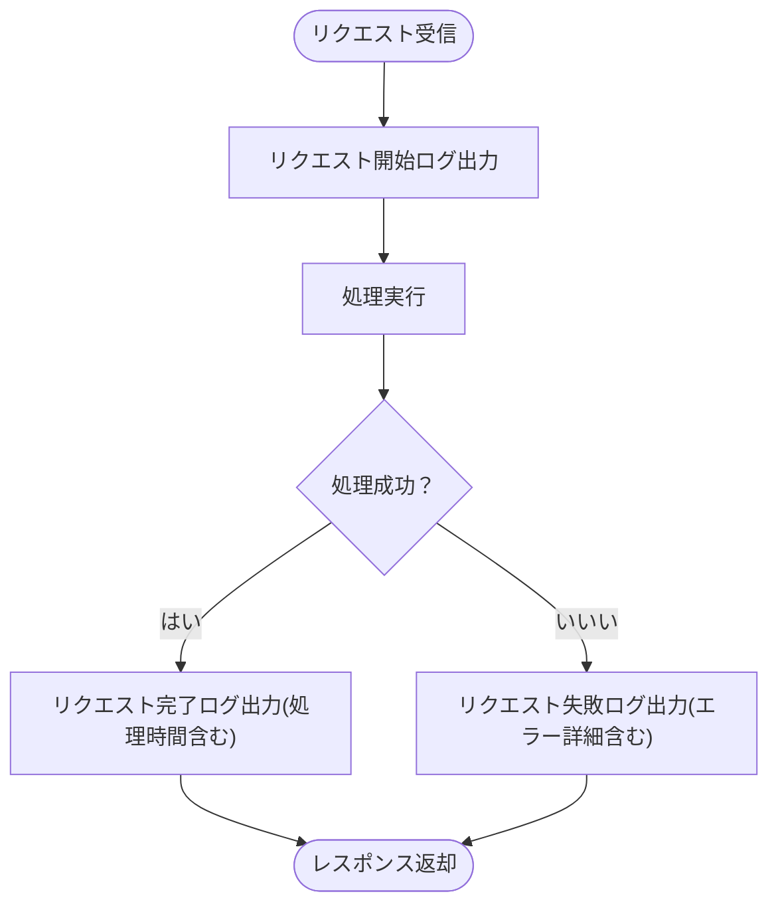
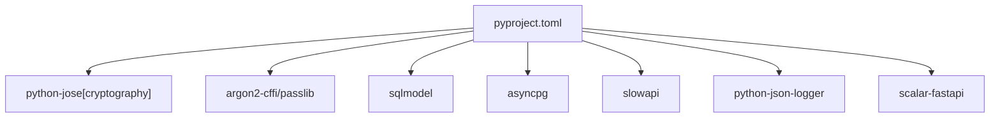

# セキュリティ対策

<cite>
**このドキュメントで参照されているファイル**
- [backend/app/main.py](file://backend/app/main.py)
- [backend/app/core/config.py](file://backend/app/core/config.py)
- [backend/app/core/security.py](file://backend/app/core/security.py)
- [backend/app/core/limiter.py](file://backend/app/core/limiter.py)
- [backend/app/middleware/error_handler.py](file://backend/app/middleware/error_handler.py)
- [backend/app/middleware/logging.py](file://backend/app/middleware/logging.py)
- [backend/app/core/logging.py](file://backend/app/core/logging.py)
- [backend/app/api/api_v1/endpoints/auth.py](file://backend/app/api/api_v1/endpoints/auth.py)
- [backend/app/crud/crud_user.py](file://backend/app/crud/crud_user.py)
- [backend/app/schemas/token.py](file://backend/app/schemas/token.py)
- [backend/app/schemas/error.py](file://backend/app/schemas/error.py)
- [backend/pyproject.toml](file://backend/pyproject.toml)
</cite>

## 目次
1. [はじめに](#はじめに)
2. [プロジェクト構造](#プロジェクト構造)
3. [コアコンポーネント](#コアコンポーネント)
4. [アーキテクチャ概観](#アーキテクチャ概観)
5. [詳細コンポーネント分析](#詳細コンポーネント分析)
6. [依存関係分析](#依存関係分析)
7. [パフォーマンスに関する考慮](#パフォーマンスに関する考慮)
8. [トラブルシューティングガイド](#トラブルシューティングガイド)
9. [結論](#結論)
10. [付録](#付録)

## はじめに
本ドキュメントは、認証システム全体におけるセキュリティ対策を詳細に解説します。具体的には、レート制限（Rate Limiting）、CORS（Cross-Origin Resource Sharing）の設定、CSRF（Cross-Site Request Forgery）対策、XSS（Cross-Site Scripting）防止策、SQLインジェクション対策、セッションセキュリティの管理方法について、実装例とともに解説します。また、エラーハンドリングにおけるセキュリティ考慮、ログの取り扱い、セキュリティ監査の実装、脆弱性スキャンの導入についても述べます。

## プロジェクト構造
バックエンドはFastAPIフレームワークを用いて構築されており、認証、APIバージョン管理、ミドルウェア、設定、セキュリティ、レートリミット、エラーハンドリング、ロギングなどの層が明確に分離されています。認証エンドポイントは `/api/v1/auth` に配置され、JWTベースの認証が実装されています。CORS、レートリミット、エラーハンドリング、ロギングは共通のミドルウェアとして適用されています。

**図の出典**
- [backend/app/main.py:1-168](file://backend/app/main.py#L1-L168)
- [backend/app/api/api_v1/api.py:1-8](file://backend/app/api/api_v1/api.py#L1-L8)
- [backend/app/api/api_v1/endpoints/auth.py:1-53](file://backend/app/api/api_v1/endpoints/auth.py#L1-L53)
- [backend/app/core/security.py:1-35](file://backend/app/core/security.py#L1-L35)
- [backend/app/core/config.py:1-73](file://backend/app/core/config.py#L1-L73)
- [backend/app/core/limiter.py:1-7](file://backend/app/core/limiter.py#L1-L7)
- [backend/app/middleware/error_handler.py:1-149](file://backend/app/middleware/error_handler.py#L1-L149)
- [backend/app/middleware/logging.py:1-67](file://backend/app/middleware/logging.py#L1-L67)
- [backend/app/core/logging.py:1-36](file://backend/app/core/logging.py#L1-L36)
- [backend/app/crud/crud_user.py:1-22](file://backend/app/crud/crud_user.py#L1-L22)
- [backend/app/schemas/token.py:1-10](file://backend/app/schemas/token.py#L1-L10)
- [backend/app/schemas/error.py:1-23](file://backend/app/schemas/error.py#L1-L23)

**節の出典**
- [backend/app/main.py:1-168](file://backend/app/main.py#L1-L168)
- [backend/app/core/config.py:1-73](file://backend/app/core/config.py#L1-L73)

## コアコンポーネント
- 認証（JWT）
  - JWTの署名アルゴリズム、シークレットキー、有効期限は設定ファイルから管理されています。
  - パスワードのハッシュ化にはArgon2が使用され、認証時の照合が行われます。
- CORS
  - 許可するオリジンは設定ファイルから読み込まれ、本番環境では必須のバリデーションが実施されます。
- レート制限
  - SlowAPIによるIPベースのレートリミットが適用され、認証系エンドポイントに対して個別の制限が設定されています。
- エラーハンドリング
  - 全般的なHTTP例外、Pydanticバリデーションエラー、予期しない例外、レート制限超過に対して統一されたエラーレスポンスを返します。
- ロギング
  - 構造化JSONログ出力、リクエスト/レスポンスの処理時間、エラー発生時の詳細なトレース情報を提供します。

**節の出典**
- [backend/app/core/security.py:1-35](file://backend/app/core/security.py#L1-L35)
- [backend/app/core/config.py:50-66](file://backend/app/core/config.py#L50-L66)
- [backend/app/core/limiter.py:1-7](file://backend/app/core/limiter.py#L1-L7)
- [backend/app/middleware/error_handler.py:1-149](file://backend/app/middleware/error_handler.py#L1-L149)
- [backend/app/middleware/logging.py:1-67](file://backend/app/middleware/logging.py#L1-L67)
- [backend/app/core/logging.py:1-36](file://backend/app/core/logging.py#L1-L36)

## アーキテクチャ概観
以下は、認証フローにおける主なセキュリティ関連コンポーネントの相互作用を示したものです。

**図の出典**
- [backend/app/main.py:128-128](file://backend/app/main.py#L128-L128)
- [backend/app/api/api_v1/api.py:5-7](file://backend/app/api/api_v1/api.py#L5-L7)
- [backend/app/api/api_v1/endpoints/auth.py:34-52](file://backend/app/api/api_v1/endpoints/auth.py#L34-L52)
- [backend/app/core/limiter.py:6-6](file://backend/app/core/limiter.py#L6-L6)
- [backend/app/core/security.py:10-11](file://backend/app/core/security.py#L10-L11)
- [backend/app/crud/crud_user.py:7-10](file://backend/app/crud/crud_user.py#L7-L10)

## 詳細コンポーネント分析

### CORS（クロスオリジンリソースシェアリング）
- 設定
  - 許可するオリジンリストは設定ファイルから読み込まれ、本番環境では空でないことを強制的にバリデーションします。
- 実装
  - FastAPIのCORSMiddlewareが適用され、資格情報の許可、メソッドとヘッダの全許可が設定されています。
- 本番環境での注意点
  - 本番環境ではオリジンを明示的に制限し、ワイルドカードを避けるべきです。

**図の出典**
- [backend/app/main.py:104-115](file://backend/app/main.py#L104-L115)
- [backend/app/core/config.py:55-60](file://backend/app/core/config.py#L55-L60)

**節の出典**
- [backend/app/main.py:104-115](file://backend/app/main.py#L104-L115)
- [backend/app/core/config.py:55-60](file://backend/app/core/config.py#L55-L60)

### CSRF（クロスサイトリクエストフォージェリ）対策
- 現状
  - JWTベースの認証により、Cookieを使用したセッション認証を前提としたCSRFのリスクは低減されています。
  - ただし、ブラウザからのAPI呼び出しにおいても、適切なオリジン制限（CORS）とSameSite Cookieの使用、CSRFトークンの導入が望ましいです。
- 改善提案
  - 認証用CookieにSameSite属性を設定し、信頼されたオリジンからのみ送信されるようにします。
  - 任意のPOST/PUT/DELETEリクエストに対してCSRFトークンを要求し、サーバー側で検証します。

[本セクションは概念的説明であり、特定のファイルを解析していません]

### XSS（クロスサイトスクリプティング）防止策
- 現状
  - APIはJSONレスポンスのみを返すため、HTML出力に起因するXSSのリスクは低いですが、クライアント側での出力処理に注意が必要です。
- 対策
  - HTMLエスケープ、Content-Security-Policy（CSP）ヘッダーの設定、XSSフィルタリングライブラリの使用、テンプレートエンジンの安全な使用。

[本セクションは概念的説明であり、特定のファイルを解析していません]

### SQLインジェクション対策
- 現状
  - SQLModel（ORM）を使用しており、SQL文の直接生成は避けられ、クエリビルダーやパラメータ化クエリが利用されています。
- 実装例
  - ユーザー照会：条件にカラム名と値を渡す形でパラメータ化クエリが実行されています。
- 今後の考慮
  - ORMの使用を継続し、SQL文字列の直接組み立てを禁止します。必要に応じて、静的解析ツールやORM専用のセキュリティスキャンナを導入します。

**図の出典**
- [backend/app/crud/crud_user.py:7-10](file://backend/app/crud/crud_user.py#L7-L10)

**節の出典**
- [backend/app/crud/crud_user.py:1-22](file://backend/app/crud/crud_user.py#L1-L22)

### セッションセキュリティの管理方法
- 現状
  - JWTベースの無状態認証を採用しており、セッション管理の必要性は低いです。
- 重要な設計要素
  - 有効期限の短縮、シークレットキーの定期的なローテーション、HTTPSでの通信、トークンの漏洩防止（クライアント側での安全な保存）。

[本セクションは概念的説明であり、特定のファイルを解析していません]

### 認証エンドポイントのセキュリティ
- JWT生成
  - 有効期限付きのアクセストークンを生成し、アルゴリズムとシークレットキーは設定ファイルから取得されます。
- 認証フロー
  - ユーザー名照会 → パスワード検証 → JWT発行の順序で処理されます。

**図の出典**
- [backend/app/api/api_v1/endpoints/auth.py:34-52](file://backend/app/api/api_v1/endpoints/auth.py#L34-L52)
- [backend/app/crud/crud_user.py:7-10](file://backend/app/crud/crud_user.py#L7-L10)
- [backend/app/core/security.py:17-27](file://backend/app/core/security.py#L17-L27)

**節の出典**
- [backend/app/api/api_v1/endpoints/auth.py:1-53](file://backend/app/api/api_v1/endpoints/auth.py#L1-L53)
- [backend/app/core/security.py:1-35](file://backend/app/core/security.py#L1-L35)
- [backend/app/crud/crud_user.py:1-22](file://backend/app/crud/crud_user.py#L1-L22)

### レート制限（Rate Limiting）
- 設定
  - 既定のレート制限、ログインエンドポイント、ユーザー登録エンドポイントそれぞれに異なる制限が設定されています。
- 実装
  - SlowAPIのLimiterがIPアドレスごとに制限を適用し、超過時はRateLimitExceededが発生します。
- エラーハンドリング
  - RateLimitExceededに対して統一エラーレスポンスを返し、ログにも記録されます。

**図の出典**
- [backend/app/core/limiter.py:6-6](file://backend/app/core/limiter.py#L6-L6)
- [backend/app/middleware/error_handler.py:125-148](file://backend/app/middleware/error_handler.py#L125-L148)
- [backend/app/api/api_v1/endpoints/auth.py:18-18](file://backend/app/api/api_v1/endpoints/auth.py#L18-L18)
- [backend/app/api/api_v1/endpoints/auth.py:35-35](file://backend/app/api/api_v1/endpoints/auth.py#L35-L35)

**節の出典**
- [backend/app/core/config.py:62-65](file://backend/app/core/config.py#L62-L65)
- [backend/app/core/limiter.py:1-7](file://backend/app/core/limiter.py#L1-L7)
- [backend/app/middleware/error_handler.py:125-148](file://backend/app/middleware/error_handler.py#L125-L148)
- [backend/app/api/api_v1/endpoints/auth.py:17-32](file://backend/app/api/api_v1/endpoints/auth.py#L17-L32)
- [backend/app/api/api_v1/endpoints/auth.py:34-52](file://backend/app/api/api_v1/endpoints/auth.py#L34-L52)

### エラーハンドリングにおけるセキュリティ考慮
- 例外種別
  - Pydanticバリデーションエラー、HTTP例外、予期しない例外、レート制限超過。
- 応答形式
  - 全てのエラーに対して統一されたErrorResponseスキーマを用います。
- セキュリティ上の配慮
  - 内部エラーの詳細なスタックトレースはログ出力に限定し、クライアントには最小限の情報のみを返します。
- 記録内容
  - URL、HTTPメソッド、ステータスコード、エラーメッセージ、クライアントIPなど。

**図の出典**
- [backend/app/middleware/error_handler.py:15-49](file://backend/app/middleware/error_handler.py#L15-L49)
- [backend/app/middleware/error_handler.py:52-76](file://backend/app/middleware/error_handler.py#L52-L76)
- [backend/app/middleware/error_handler.py:79-104](file://backend/app/middleware/error_handler.py#L79-L104)
- [backend/app/middleware/error_handler.py:125-148](file://backend/app/middleware/error_handler.py#L125-L148)
- [backend/app/schemas/error.py:5-23](file://backend/app/schemas/error.py#L5-L23)

**節の出典**
- [backend/app/middleware/error_handler.py:1-149](file://backend/app/middleware/error_handler.py#L1-L149)
- [backend/app/schemas/error.py:1-23](file://backend/app/schemas/error.py#L1-L23)

### ログの取り扱い
- 構造化ログ
  - JSONフォーマットで出力され、タイムスタンプ、ロガー名、レベル、メッセージ、ファイル名、関数名、行番号を含みます。
- リクエストロギング
  - 各リクエストの開始/完了、処理時間、ステータスコード、クライアントIPを記録します。
- 本番環境での運用
  - 機密情報を含まない出力に留め、外部監視システムへの連携を検討します。

**図の出典**
- [backend/app/middleware/logging.py:15-66](file://backend/app/middleware/logging.py#L15-L66)
- [backend/app/core/logging.py:22-28](file://backend/app/core/logging.py#L22-L28)

**節の出典**
- [backend/app/core/logging.py:1-36](file://backend/app/core/logging.py#L1-L36)
- [backend/app/middleware/logging.py:1-67](file://backend/app/middleware/logging.py#L1-L67)

### セキュリティ監査の実装
- 現状
  - 認証エンドポイント、レート制限、エラーハンドリング、CORS設定、ロギングが一貫して実装されています。
- 監査項目の提案
  - 認証成功/失敗ログの監査、レート超過の統計、エラーレベルの傾向分析、オリジン違反の監視。
- 実装方法
  - 特定のエンドポイントに対するカウンターを追加し、ログから集計・可視化します。

[本セクションは概念的説明であり、特定のファイルを解析していません]

### 脆弱性スキャンの導入
- 静的解析
  - Pythonのセキュリティスキャンナー（例：bandit、semgrep）をCIパイプラインに統合します。
- 依存関係スキャン
  - pip-auditやOSV-scannerを用いて、既知の脆弱性のある依存関係を検出します。
- CI連携
  - GitHub Actionsなどで、プルリクエスト毎に脆弱性スキャンを実施し、失敗時にマージをブロックします。

[本セクションは概念的説明であり、特定のファイルを解析していません]

## 依存関係分析
- 外部依存
  - JWT署名：python-jose[cryptography]
  - パスワードハッシュ：argon2-cffi/passlib
  - ORM：sqlmodel
  - 非同期DB：asyncpg
  - レート制限：slowapi
  - 構造化ロギング：python-json-logger
  - APIドキュメント：scalar-fastapi

**図の出典**
- [backend/pyproject.toml:7-21](file://backend/pyproject.toml#L7-L21)

**節の出典**
- [backend/pyproject.toml:1-47](file://backend/pyproject.toml#L1-L47)

## パフォーマンスに関する考慮
- レート制限
  - IPベースの制限により、DoS攻撃に対する耐性が向上します。設定値は環境変数で柔軟に調整可能です。
- ORMの使用
  - SQLModelのパラメータ化クエリにより、SQLインジェクションリスクを抑えつつ、開発効率を高めています。
- ロギング
  - 構造化ログはパフォーマンスへの影響を最小限に抑えつつ、分析の利便性を高めます。

[本セクションは一般的なパフォーマンスに関する考察であり、特定のファイルを詳細に解析していません]

## トラブルシューティングガイド
- CORSエラー
  - 本番環境でオリジンが設定されていない場合、起動時にエラーが発生します。設定ファイルのオリジンリストを確認し、正しいオリジンを追加してください。
- 認証失敗
  - ユーザー名またはパスワードが間違っている場合、401エラーが返されます。パスワードはArgon2でハッシュ化されているため、平文の比較ではなくverify_passwordを使用してください。
- レート超過
  - 認証系エンドポイントのレート制限を超えると429エラーが返されます。設定ファイルのRATE_LIMIT_LOGIN/RATE_LIMIT_REGISTERを調整するか、クライアント側でリトライ間隔を増やしてください。
- 予期しないエラー
  - 500エラーが返される場合、エラーハンドラーが統一エラーレスポンスを返します。ログを確認し、スタックトレースを元に原因を特定してください。

**節の出典**
- [backend/app/main.py:104-107](file://backend/app/main.py#L104-L107)
- [backend/app/api/api_v1/endpoints/auth.py:42-47](file://backend/app/api/api_v1/endpoints/auth.py#L42-L47)
- [backend/app/middleware/error_handler.py:125-148](file://backend/app/middleware/error_handler.py#L125-L148)
- [backend/app/middleware/error_handler.py:79-104](file://backend/app/middleware/error_handler.py#L79-L104)

## 結論
本プロジェクトでは、JWTベースの認証、CORSの適切な設定、SlowAPIによるレート制限、統一されたエラーハンドリング、構造化ロギングといったセキュリティ対策が実装されています。今後の改善として、CSRF対策（SameSite Cookie、CSRFトークン）、XSS防止策（CSP、エスケープ）、SQLインジェクションの徹底（ORM使用の継続）、セキュリティ監査と脆弱性スキャンの導入が挙げられます。これらの対策を継続的に適用することで、堅牢な認証システムを維持することが可能です。

## 付録
- 認証スキーマ（OpenAPI）
  - Bearer認証スキーマがOpenAPI仕様に追加されており、SwaggerやScalar経由での認証が可能になっています。

**節の出典**
- [backend/app/main.py:76-102](file://backend/app/main.py#L76-L102)