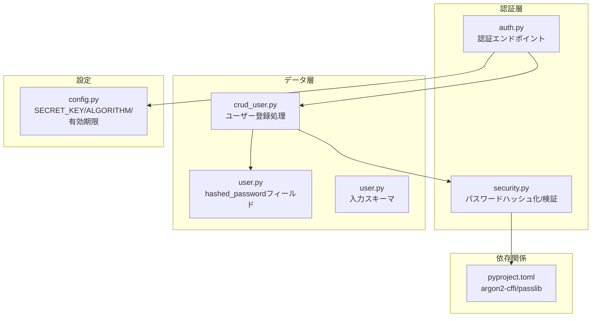
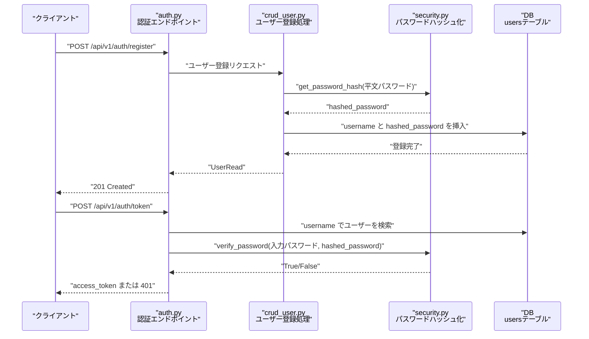
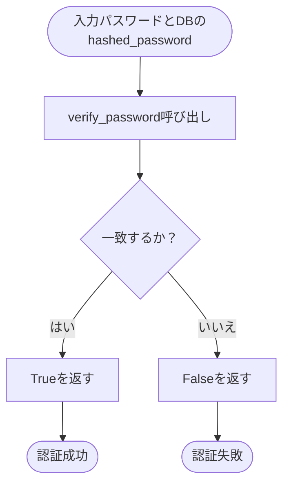
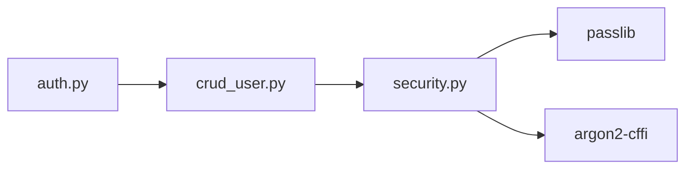

# パスワードハッシュ化

<cite>
**本文で参照するファイル**
- [backend/app/core/security.py](file://backend/app/core/security.py)
- [backend/app/crud/crud_user.py](file://backend/app/crud/crud_user.py)
- [backend/app/api/api_v1/endpoints/auth.py](file://backend/app/api/api_v1/endpoints/auth.py)
- [backend/app/models/user.py](file://backend/app/models/user.py)
- [backend/app/schemas/user.py](file://backend/app/schemas/user.py)
- [backend/app/core/config.py](file://backend/app/core/config.py)
- [backend/pyproject.toml](file://backend/pyproject.toml)
- [backend/tests/test_auth.py](file://backend/tests/test_auth.py)
</cite>

## 目次
1. [はじめに](#はじめに)
2. [プロジェクト構造](#プロジェクト構造)
3. [コアコンポーネント](#コアコンポーネント)
4. [アーキテクチャ概要](#アーキテクチャ概要)
5. [詳細コンポーネント解析](#詳細コンポーネント解析)
6. [依存関係解析](#依存関係解析)
7. [パフォーマンスと最適化](#パフォーマンスと最適化)
8. [トラブルシューティングガイド](#トラブルシューティングガイド)
9. [結論](#結論)

## はじめに
本ドキュメントは、パスワードの安全な保存のためのハッシュ化プロセスについて、Argon2とBcryptの選択理由、アルゴリズムの特徴と安全性、saltの生成と管理方法、ハッシュ化されたパスワードの比較プロセス、バリデーションルール、パラメータ調整、セキュリティ上の考慮事項、パフォーマンス最適化について、実際のコードベースに基づいて詳細に説明します。

## プロジェクト構造
本プロジェクトにおけるパスワードハッシュ化に関連する主な場所は以下の通りです：
- 認証ロジックとJWTトークン生成：backend/app/core/security.py
- ユーザー登録時のパスワードハッシュ化：backend/app/crud/crud_user.py
- 認証エンドポイント（ログイン）：backend/app/api/api_v1/endpoints/auth.py
- ユーザーモデル（hashed_passwordフィールド）：backend/app/models/user.py
- ユーザー入力スキーマ（username/password）：backend/app/schemas/user.py
- 設定（SECRET_KEY、ALGORITHM、ACCESS_TOKEN_EXPIRE_MINUTES）：backend/app/core/config.py
- 依存関係（argon2-cffi、passlib）：backend/pyproject.toml
- 認証関連テスト：backend/tests/test_auth.py

**図の出典**
- [backend/app/core/security.py:1-35](file://backend/app/core/security.py#L1-L35)
- [backend/app/crud/crud_user.py:1-22](file://backend/app/crud/crud_user.py#L1-L22)
- [backend/app/api/api_v1/endpoints/auth.py:1-53](file://backend/app/api/api_v1/endpoints/auth.py#L1-L53)
- [backend/app/models/user.py:1-16](file://backend/app/models/user.py#L1-L16)
- [backend/app/schemas/user.py:1-12](file://backend/app/schemas/user.py#L1-L12)
- [backend/app/core/config.py:1-73](file://backend/app/core/config.py#L1-L73)
- [backend/pyproject.toml:1-47](file://backend/pyproject.toml#L1-L47)

**節の出典**
- [backend/app/core/security.py:1-35](file://backend/app/core/security.py#L1-L35)
- [backend/app/crud/crud_user.py:1-22](file://backend/app/crud/crud_user.py#L1-L22)
- [backend/app/api/api_v1/endpoints/auth.py:1-53](file://backend/app/api/api_v1/endpoints/auth.py#L1-L53)
- [backend/app/models/user.py:1-16](file://backend/app/models/user.py#L1-L16)
- [backend/app/schemas/user.py:1-12](file://backend/app/schemas/user.py#L1-L12)
- [backend/app/core/config.py:1-73](file://backend/app/core/config.py#L1-L73)
- [backend/pyproject.toml:1-47](file://backend/pyproject.toml#L1-L47)

## コアコンポーネント
- パスワードハッシュ化と検証
  - Argon2によるパスワードハッシュ化と検証を行う関数が定義されています。
  - passlibのCryptContext経由でArgon2が使用され、saltは自動生成・管理されます。
  - 過去に生成された他のハッシュ形式も自動的に互換的に検証できます（deprecated="auto"）。

- JWTアクセストークン
  - 認証成功後にJWTを発行し、有効期限を設定します。
  - SECRET_KEYとALGORITHMは設定ファイルから取得されます。

- ユーザー登録時のパスワード処理
  - 入力されたパスワードをハッシュ化し、DBに保存します。
  - usernameの一意性をDBレベルで保証するスキーマが使用されています。

**節の出典**
- [backend/app/core/security.py:7-14](file://backend/app/core/security.py#L7-L14)
- [backend/app/crud/crud_user.py:12-17](file://backend/app/crud/crud_user.py#L12-L17)
- [backend/app/schemas/user.py:4-8](file://backend/app/schemas/user.py#L4-L8)
- [backend/app/models/user.py:12-13](file://backend/app/models/user.py#L12-L13)
- [backend/app/core/config.py:51-53](file://backend/app/core/config.py#L51-L53)

## アーキテクチャ概要
パスワードハッシュ化の全体像は以下の通りです：
- 入力パスワードはユーザー登録時にハッシュ化され、DBに保存されます。
- 認証時は入力パスワードとDBに保存されているハッシュを比較し、一致すればJWTを発行します。
- saltはアルゴリズムによって自動生成・管理されるため、手動でのsalt管理は不要です。

**図の出典**
- [backend/app/api/api_v1/endpoints/auth.py:17-32](file://backend/app/api/api_v1/endpoints/auth.py#L17-L32)
- [backend/app/api/api_v1/endpoints/auth.py:34-52](file://backend/app/api/api_v1/endpoints/auth.py#L34-L52)
- [backend/app/crud/crud_user.py:12-21](file://backend/app/crud/crud_user.py#L12-L21)
- [backend/app/core/security.py:10-14](file://backend/app/core/security.py#L10-L14)
- [backend/app/models/user.py:12-13](file://backend/app/models/user.py#L12-L13)

## 詳細コンポーネント解析

### 1) Argon2によるパスワードハッシュ化
- 使用技術
  - passlibのCryptContext経由でArgon2が選択され、saltやパラメータは自動管理されます。
  - 互換性のために過去の非推奨形式も自動的に検証可能（deprecated="auto"）。

- 特徴と安全性
  - Argon2は現時点での推奨されるパスワードハッシュアルゴリズムであり、計算時間とメモリ使用量を調整可能。
  - saltはアルゴリズム内部で自動生成・付与されるため、再利用や衝突のリスクが低減されます。

- 実装ポイント
  - get_password_hash：平文パスワードをハッシュ化。
  - verify_password：平文パスワードとDBのhashed_passwordを比較。

**節の出典**
- [backend/app/core/security.py:7-14](file://backend/app/core/security.py#L7-L14)

### 2) Bcryptとの比較（選択理由）
- 選択理由
  - 本プロジェクトではArgon2が選択されており、bcryptよりも最近の推奨アルゴリズムとして高い安全性が期待できます。
  - bcryptは依然として安全ですが、Argon2の方がパラメータ調整（時間・メモリコスト）が柔軟で、将来的なハードウェア変化への対応が容易です。

- 安全性の観点
  - Argon2はメモリ-hard（メモリ時間を指定可能）であり、ASICや専用ハードウェアによる高速計算にも強いです。
  - bcryptはCPU-hardですが、Argon2のメモリ-hard特性により、より広範な攻撃に対する耐性があります。

**節の出典**
- [backend/app/core/security.py:7-8](file://backend/app/core/security.py#L7-L8)

### 3) saltの生成と管理
- 自動管理
  - passlibのCryptContextにより、saltはアルゴリズム内部で自動生成・管理されます。
  - 一度生成されたsaltはハッシュに埋め込まれるため、外部での管理は不要です。

- 互換性
  - 互換モード（deprecated="auto"）により、過去に別の形式で生成されたハッシュも引き続き検証可能です。

**節の出典**
- [backend/app/core/security.py:7-11](file://backend/app/core/security.py#L7-L11)

### 4) ハッシュ化されたパスワードの比較プロセス
- 比較フロー
  - verify_passwordは、平文パスワードとDBのhashed_passwordを引数に取り、内部でsaltとパラメータを含んだハッシュを用いて比較します。
  - 成功すればTrue、失敗すればFalseを返します。

**図の出典**
- [backend/app/core/security.py:10-11](file://backend/app/core/security.py#L10-L11)
- [backend/app/api/api_v1/endpoints/auth.py:41-47](file://backend/app/api/api_v1/endpoints/auth.py#L41-L47)

**節の出典**
- [backend/app/core/security.py:10-11](file://backend/app/core/security.py#L10-L11)
- [backend/app/api/api_v1/endpoints/auth.py:41-47](file://backend/app/api/api_v1/endpoints/auth.py#L41-L47)

### 5) パスワードバリデーションルール
- 入力スキーマ
  - usernameには一意性制約があり、最大長が設定されています。
  - passwordフィールドはUserCreateスキーマで定義されており、バリデーションはFastAPI/Pydanticの標準機能により行われます。

- DB制約
  - usernameはDBレベルでユニークかつインデックス付きで管理されています。

**節の出典**
- [backend/app/schemas/user.py:4-8](file://backend/app/schemas/user.py#L4-L8)
- [backend/app/models/user.py:5-5](file://backend/app/models/user.py#L5-L5)

### 6) ハッシュ化のパラメータ調整（work factor、memory costなど）
- 現状
  - 本プロジェクトではCryptContextのデフォルトパラメータが使用されています。
  - 本番環境では、ハードウェア性能に応じてwork factorやmemory costを調整することが推奨されます。

- 調整方法（一般的なアプローチ）
  - 一定の時間内にハッシュ化が完了するように、work factorやmemory costを調整します。
  - 例えば、平均的なサーバー環境で10–50ms程度のハッシュ化時間を目安とします。

- 注意点
  - 一度設定したパラメータは変更しないことが望ましく、変更が必要な場合は一括マイグレーションと再ハッシュ化を考慮する必要があります。

**節の出典**
- [backend/app/core/security.py:7-8](file://backend/app/core/security.py#L7-L8)

### 7) セキュリティ上の考慮事項
- JWTの保護
  - SECRET_KEYは環境変数から設定され、アルゴリズムはHS256が使用されています。
  - ACCESS_TOKEN_EXPIRE_MINUTESで有効期限を設定し、短めの有効期限を推奨します。

- 認証エンドポイントのレート制限
  - 登録・ログインに対してRate Limitが設定されており、ブルートフォース攻撃を抑制します。

- トークンの扱い
  - 認証成功後のみaccess_tokenを発行し、クライアント側では安全に保管する必要があります。

**節の出典**
- [backend/app/core/config.py:51-53](file://backend/app/core/config.py#L51-L53)
- [backend/app/api/api_v1/endpoints/auth.py:17-32](file://backend/app/api/api_v1/endpoints/auth.py#L17-L32)
- [backend/app/api/api_v1/endpoints/auth.py:34-52](file://backend/app/api/api_v1/endpoints/auth.py#L34-L52)

### 8) 実装例（コードスニペットのパス）
- パスワードハッシュ化
  - [backend/app/core/security.py:13-14](file://backend/app/core/security.py#L13-L14)
- パスワード検証
  - [backend/app/core/security.py:10-11](file://backend/app/core/security.py#L10-L11)
- ユーザー登録時のハッシュ化
  - [backend/app/crud/crud_user.py:12-17](file://backend/app/crud/crud_user.py#L12-L17)
- 認証エンドポイントでの検証
  - [backend/app/api/api_v1/endpoints/auth.py:41-47](file://backend/app/api/api_v1/endpoints/auth.py#L41-L47)

**節の出典**
- [backend/app/core/security.py:10-14](file://backend/app/core/security.py#L10-L14)
- [backend/app/crud/crud_user.py:12-17](file://backend/app/crud/crud_user.py#L12-L17)
- [backend/app/api/api_v1/endpoints/auth.py:41-47](file://backend/app/api/api_v1/endpoints/auth.py#L41-L47)

## 依存関係解析
- 外部ライブラリ
  - argon2-cffi：Argon2のC拡張ライブラリ。
  - passlib：複数のパスワードハッシュアルゴリズム（argon2を含む）を統合的に扱う。

- 内部依存
  - auth.py → crud_user.py → security.py → passlib/argon2-cffi
  - 認証エンドポイントはsecurity.pyのverify_passwordを使用。

**図の出典**
- [backend/pyproject.toml:9-13](file://backend/pyproject.toml#L9-L13)
- [backend/app/api/api_v1/endpoints/auth.py:1-15](file://backend/app/api/api_v1/endpoints/auth.py#L1-L15)
- [backend/app/crud/crud_user.py:1-5](file://backend/app/crud/crud_user.py#L1-L5)
- [backend/app/core/security.py:1-8](file://backend/app/core/security.py#L1-L8)

**節の出典**
- [backend/pyproject.toml:7-22](file://backend/pyproject.toml#L7-L22)
- [backend/app/api/api_v1/endpoints/auth.py:1-15](file://backend/app/api/api_v1/endpoints/auth.py#L1-L15)
- [backend/app/crud/crud_user.py:1-5](file://backend/app/crud/crud_user.py#L1-L5)
- [backend/app/core/security.py:1-8](file://backend/app/core/security.py#L1-L8)

## パフォーマンスと最適化
- ハッシュ化のパフォーマンス
  - 本プロジェクトではデフォルトパラメータが使用されています。
  - 本番環境では、ハードウェア性能に応じてwork factorやmemory costを調整し、認証遅延を10–50ms程度に抑えることを目安とします。

- トークン発行のオーバーヘッド
  - JWT発行は軽量ですが、頻繁な認証ではキャッシュやレート制限を併用することで負荷を軽減できます。

- DBアクセスの最適化
  - usernameのインデックスにより、ユーザー検索は高速に行われます。

**節の出典**
- [backend/app/models/user.py:5-5](file://backend/app/models/user.py#L5-L5)
- [backend/app/core/config.py:51-53](file://backend/app/core/config.py#L51-L53)

## トラブルシューティングガイド
- 認証エラー（401 Unauthorized）
  - usernameまたはpasswordが間違っている場合、またはhashed_passwordが不正な形式の場合に発生します。
  - 互換性の問題がある場合は、deprecated="auto"により過去の形式も検証可能ですが、必要に応じて再ハッシュ化を検討してください。

- 重複ユーザー登録エラー（400 Bad Request）
  - usernameが既にDBに存在する場合に発生します。DBのユニーク制約が原因です。

- JWT発行に関する問題
  - SECRET_KEYやALGORITHMの設定ミス、有効期限の設定が原因でトークンが発行できないことがあります。

- テストケース
  - 認証関連のテストは、正常系（201 Created、200 OK）と異常系（400 Bad Request、401 Unauthorized）をカバーしています。

**節の出典**
- [backend/app/api/api_v1/endpoints/auth.py:25-30](file://backend/app/api/api_v1/endpoints/auth.py#L25-L30)
- [backend/app/api/api_v1/endpoints/auth.py:41-47](file://backend/app/api/api_v1/endpoints/auth.py#L41-L47)
- [backend/tests/test_auth.py:5-15](file://backend/tests/test_auth.py#L5-L15)
- [backend/tests/test_auth.py:16-31](file://backend/tests/test_auth.py#L16-L31)
- [backend/tests/test_auth.py:32-51](file://backend/tests/test_auth.py#L32-L51)
- [backend/tests/test_auth.py:52-61](file://backend/tests/test_auth.py#L52-L61)

## 結論
本プロジェクトでは、Argon2を用いたパスワードハッシュ化が導入されており、saltの自動管理、互換性のある検証、JWTによる認証フローが組み合わさっています。本番環境では、ハードウェアに応じたパラメータ調整、適切なレート制限、JWTの有効期限設定、SECRET_KEYの安全管理が重要です。また、usernameの一意性制約とインデックスにより、認証時のDBアクセスも効率的に行われています。