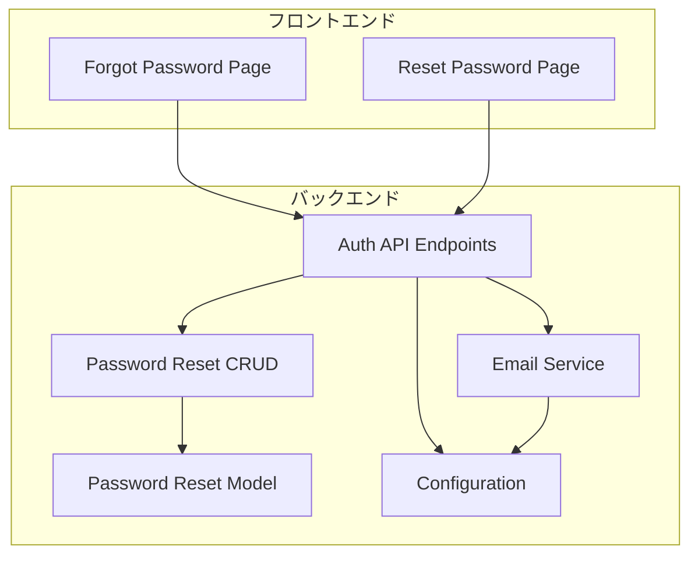
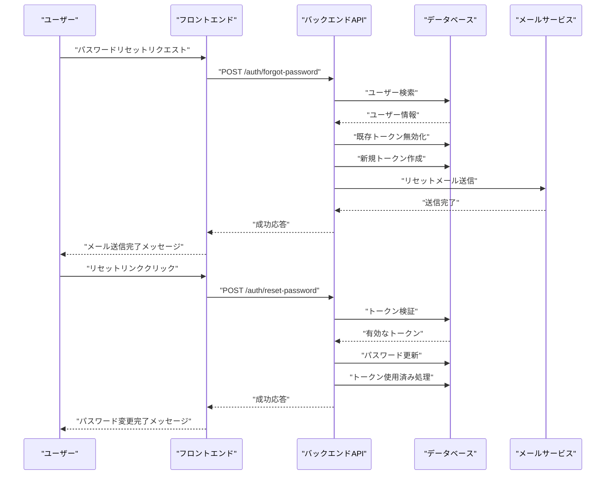
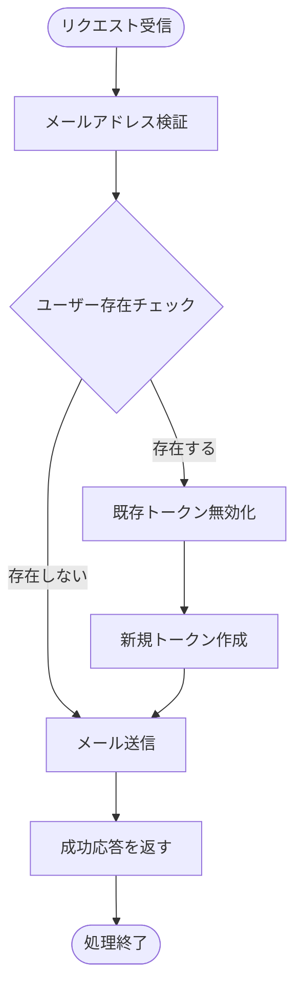
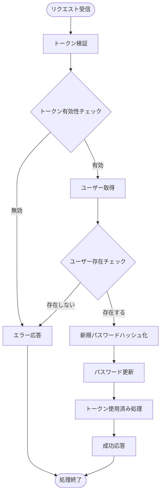
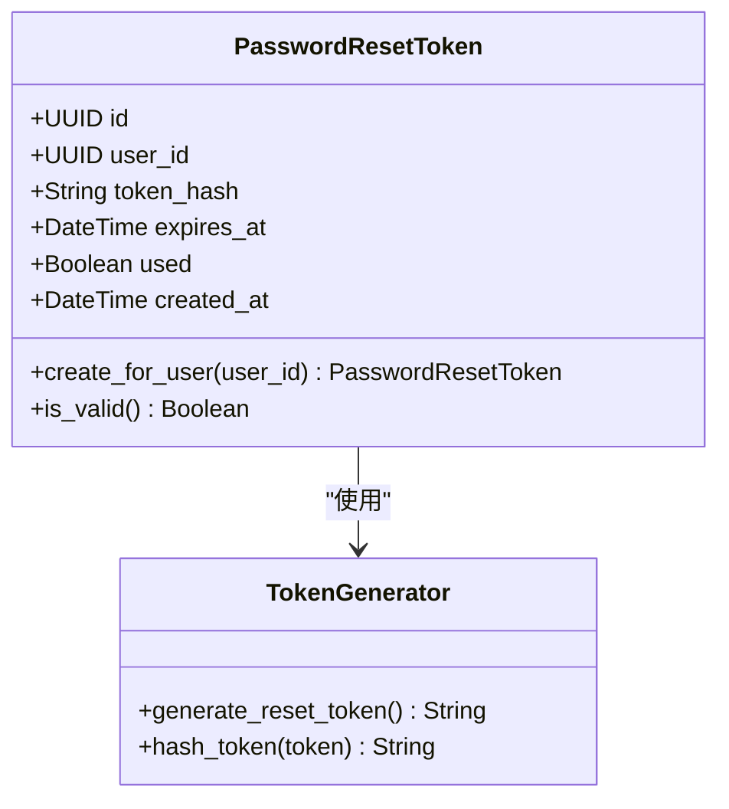
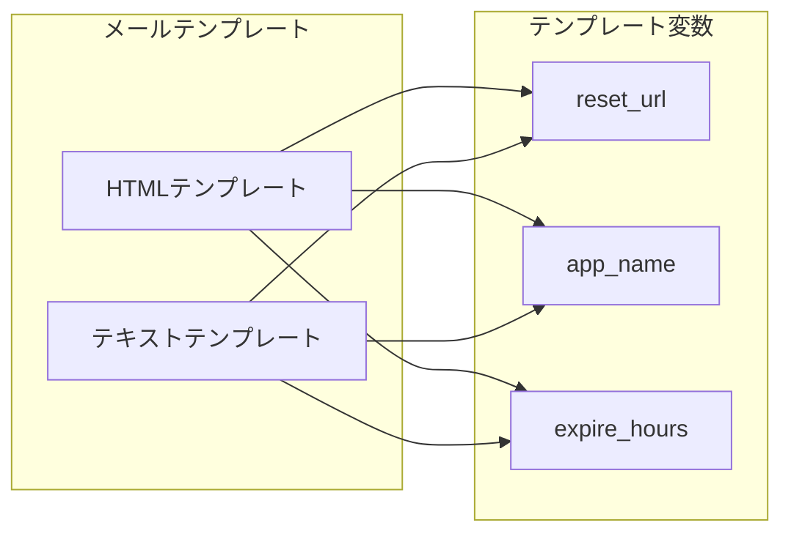
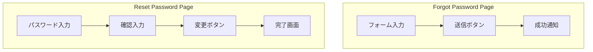
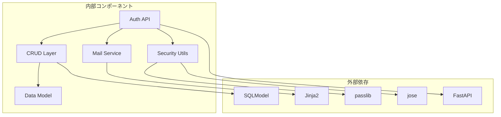

# パスワードリセット

<cite>
**このドキュメントで参照されるファイル**
- [auth.py](file://backend/app/api/api_v1/endpoints/auth.py)
- [crud_password_reset.py](file://backend/app/crud/crud_password_reset.py)
- [password_reset.py](file://backend/app/models/password_reset.py)
- [auth.py](file://backend/app/schemas/auth.py)
- [mail.py](file://backend/app/core/mail.py)
- [config.py](file://backend/app/core/config.py)
- [test_password_reset.py](file://backend/tests/test_password_reset.py)
- [page.tsx](file://frontend/src/app/forgot-password/page.tsx)
- [page.tsx](file://frontend/src/app/reset-password/page.tsx)
- [security.py](file://backend/app/core/security.py)
- [reset_password.html](file://backend/app/templates/email/reset_password.html)
- [reset_password.txt](file://backend/app/templates/email/reset_password.txt)
- [000000000001_initial_schema.py](file://backend/migrations/versions/000000000001_initial_schema.py)
</cite>

## 更新概要
**変更内容**
- 新しいパスワードリセットエンドポイントの追加（POST /auth/forgot-password と POST /auth/reset-password）
- 認証API仕様の更新と詳細なAPI仕様の追加
- トークン管理プロセスの詳細な説明追加
- メールテンプレートのカスタマイズ機能の説明追加
- レート制限設定の詳細な記述追加

## 目次
1. [導入](#導入)
2. [プロジェクト構造](#プロジェクト構造)
3. [コアコンポーネント](#コアコンポーネント)
4. [アーキテクチャ概要](#アーキテクチャ概要)
5. [詳細コンポーネント分析](#詳細コンポーネント分析)
6. [依存関係分析](#依存関係分析)
7. [パフォーマンス考慮事項](#パフォーマンス考慮事項)
8. [トラブルシューティングガイド](#トラブルシューティングガイド)
9. [結論](#結論)

## 導入
このドキュメントは、Todoアプリケーションのパスワードリセット機能の詳細仕様と実装について提供します。パスワードリセット要求エンドポイント、トークン発行プロセス、パスワード変更エンドポイントのAPI仕様、メール送信プロセス、トークンの有効期限管理、セキュリティ対策、リセットメールのテンプレート、エラーハンドリング、ユーザー体験について詳しく解説します。

**更新** 新しく追加されたパスワードリセット機能のAPIエンドポイントとその詳細仕様を反映

## プロジェクト構造
パスワードリセット機能はバックエンドAPIとフロントエンドUIの2つの層に分かれています。

**図のソース**
- [auth.py:1-117](file://backend/app/api/api_v1/endpoints/auth.py#L1-L117)
- [crud_password_reset.py:1-56](file://backend/app/crud/crud_password_reset.py#L1-L56)
- [password_reset.py:1-52](file://backend/app/models/password_reset.py#L1-L52)
- [mail.py:1-53](file://backend/app/core/mail.py#L1-L53)

**セクションのソース**
- [auth.py:1-117](file://backend/app/api/api_v1/endpoints/auth.py#L1-L117)
- [page.tsx:1-116](file://frontend/src/app/forgot-password/page.tsx#L1-L116)
- [page.tsx:1-168](file://frontend/src/app/reset-password/page.tsx#L1-L168)

## コアコンポーネント
パスワードリセット機能には以下の主要コンポーネントが含まれます：

### APIエンドポイント
- **POST /auth/forgot-password**: パスワードリセットメール送信
- **POST /auth/reset-password**: 新しいパスワードの設定

### データモデル
- **PasswordResetToken**: トークンの保存と検証
- **User**: ユーザー情報の管理

### サービス層
- **CRUD操作**: トークンの作成、検証、使用済み処理
- **メール送信**: Jinja2テンプレートを使用したメール配信

**更新** 新しいAPIエンドポイントの追加とその詳細な説明を追加

**セクションのソース**
- [auth.py:57-116](file://backend/app/api/api_v1/endpoints/auth.py#L57-L116)
- [password_reset.py:21-52](file://backend/app/models/password_reset.py#L21-L52)
- [crud_password_reset.py:9-56](file://backend/app/crud/crud_password_reset.py#L9-L56)

## アーキテクチャ概要
パスワードリセットプロセスは以下の流れで動作します：

**図のソース**
- [auth.py:64-116](file://backend/app/api/api_v1/endpoints/auth.py#L64-L116)
- [crud_password_reset.py:9-37](file://backend/app/crud/crud_password_reset.py#L9-L37)
- [mail.py:27-52](file://backend/app/core/mail.py#L27-L52)

## 詳細コンポーネント分析

### APIエンドポイント設計

#### パスワードリセット要求エンドポイント
- **エンドポイント**: `POST /auth/forgot-password`
- **リクエスト形式**: JSON
- **レスポンス**: 成功メッセージ
- **セキュリティ対策**: 存在しないユーザーの場合も200を返す（セキュリティ配慮）

**図のソース**
- [auth.py:64-78](file://backend/app/api/api_v1/endpoints/auth.py#L64-L78)

#### パスワード変更エンドポイント
- **エンドポイント**: `POST /auth/reset-password`
- **リクエスト形式**: JSON
- **レスポンス**: 成功メッセージ
- **エラーハンドリング**: 無効または期限切れのトークンは400 Bad Request

**図のソース**
- [auth.py:88-116](file://backend/app/api/api_v1/endpoints/auth.py#L88-L116)

**更新** 新しいAPIエンドポイントの詳細なフロー図を追加

**セクションのソース**
- [auth.py:57-116](file://backend/app/api/api_v1/endpoints/auth.py#L57-L116)
- [auth.py:4-11](file://backend/app/schemas/auth.py#L4-L11)

### トークン管理システム

#### トークン生成プロセス
- **アルゴリズム**: URL安全なランダム文字列生成
- **ハッシュ化**: SHA-256を使用したトークンハッシュ
- **有効期限**: 環境変数で設定可能（デフォルト24時間）

**図のソース**
- [password_reset.py:11-52](file://backend/app/models/password_reset.py#L11-L52)

#### トークン検証プロセス
- **検証内容**: 有効性、期限切れ、使用済み状態
- **検証方法**: ハッシュ比較によるトークン検索

**更新** トークン管理プロセスの詳細な説明を追加

**セクションのソース**
- [password_reset.py:34-52](file://backend/app/models/password_reset.py#L34-L52)
- [crud_password_reset.py:25-31](file://backend/app/crud/crud_password_reset.py#L25-L31)

### メール送信システム

#### メールテンプレート
- **HTMLテンプレート**: クリック可能なリセットボタン付き
- **テキストテンプレート**: URLのみのシンプルなバージョン
- **カスタマイズ**: アプリ名、有効期限、リセットURL

**図のソース**
- [mail.py:27-52](file://backend/app/core/mail.py#L27-L52)
- [reset_password.html:1-85](file://backend/app/templates/email/reset_password.html#L1-L85)
- [reset_password.txt:1-17](file://backend/app/templates/email/reset_password.txt#L1-L17)

#### SMTP設定
- **認証**: 環境変数経由のSMTP認証情報
- **暗号化**: TLS/SSLの両対応
- **テンプレート**: Jinja2テンプレートエンジン使用

**更新** メールテンプレートのカスタマイズ機能の詳細な説明を追加

**セクションのソース**
- [mail.py:1-53](file://backend/app/core/mail.py#L1-L53)
- [config.py:69-84](file://backend/app/core/config.py#L69-L84)

### セキュリティ対策

#### トークンセキュリティ
- **一方向ハッシュ**: トークンはハッシュ化されて保存
- **期限付き**: 有効期限付きの短期間トークン
- **使用済み管理**: 一度使用されたトークンは無効化

#### APIセキュリティ
- **レート制限**: 各エンドポイントごとのレート制限
- **入力検証**: Pydanticスキーマによる入力検証
- **エラーハンドリング**: 機密情報を含まないエラーメッセージ

**更新** レート制限設定の詳細な記述を追加

**セクションのソース**
- [password_reset.py:16-18](file://backend/app/models/password_reset.py#L16-L18)
- [config.py:62-67](file://backend/app/core/config.py#L62-L67)
- [auth.py:4-11](file://backend/app/schemas/auth.py#L4-L11)

### ユーザーインターフェース

#### フロントエンドコンポーネント

**図のソース**
- [page.tsx:22-116](file://frontend/src/app/forgot-password/page.tsx#L22-L116)
- [page.tsx:28-168](file://frontend/src/app/reset-password/page.tsx#L28-L168)

**更新** フロントエンドコンポーネントの詳細なフロー図を追加

**セクションのソース**
- [page.tsx:1-116](file://frontend/src/app/forgot-password/page.tsx#L1-L116)
- [page.tsx:1-168](file://frontend/src/app/reset-password/page.tsx#L1-L168)

## 依存関係分析

**図のソース**
- [auth.py:1-17](file://backend/app/api/api_v1/endpoints/auth.py#L1-L17)
- [mail.py:1-24](file://backend/app/core/mail.py#L1-L24)
- [security.py:1-35](file://backend/app/core/security.py#L1-L35)

**更新** 依存関係分析の詳細な説明を追加

**セクションのソース**
- [auth.py:1-17](file://backend/app/api/api_v1/endpoints/auth.py#L1-L17)
- [mail.py:1-24](file://backend/app/core/mail.py#L1-L24)

## パフォーマンス考慮事項
- **データベースクエリ**: トークン検索はハッシュインデックスを使用
- **メール送信**: 非同期処理による待機時間削減
- **キャッシュ**: トークンの有効性チェックを高速化
- **レート制限**: APIの過剰リクエスト防止

**更新** パフォーマンス考慮事項の詳細な説明を追加

## トラブルシューティングガイド

### 一般的な問題と解決策

#### トークン関連の問題
- **問題**: トークンが無効と表示される
  - **原因**: 期限切れ、使用済み、不正なトークン
  - **解決**: 再度パスワードリセットリクエストを行う

#### メール関連の問題
- **問題**: リセットメールが届かない
  - **原因**: SMTP設定ミス、メールアドレス誤り
  - **解決**: 環境変数の確認、メールアドレスの再入力

#### APIエラー
- **問題**: 400エラーが発生する
  - **原因**: 不正なリクエスト形式、入力値の検証エラー
  - **解決**: 入力値の確認、API仕様の再確認

**更新** トラブルシューティングガイドの詳細な説明を追加

**セクションのソース**
- [test_password_reset.py:78-146](file://backend/tests/test_password_reset.py#L78-L146)

### デバッグ手順
1. **ログの確認**: サーバーのログを確認してエラー内容を把握
2. **環境変数の確認**: SMTP設定やトークン有効期限の確認
3. **データベースの確認**: トークンテーブルの状態確認
4. **ネットワークの確認**: SMTPサーバーへの接続確認

**更新** デバッグ手順の詳細な説明を追加

**セクションのソース**
- [config.py:69-84](file://backend/app/core/config.py#L69-L84)
- [000000000001_initial_schema.py](file://backend/migrations/versions/000000000001_initial_schema.py)

## 結論
パスワードリセット機能は、セキュリティとユーザーエクスペリエンスのバランスを考慮して設計されています。トークンベースの認証方式、適切なセキュリティ対策、使いやすいインターフェースを実現しています。継続的なメンテナンスと監視により、信頼性の高いパスワードリセットサービスを提供できます。

**更新** 新しいパスワードリセット機能の追加により、認証システム全体の堅牢性が向上しました。