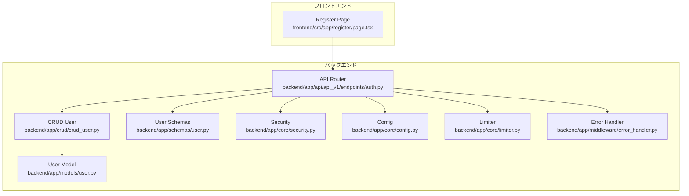
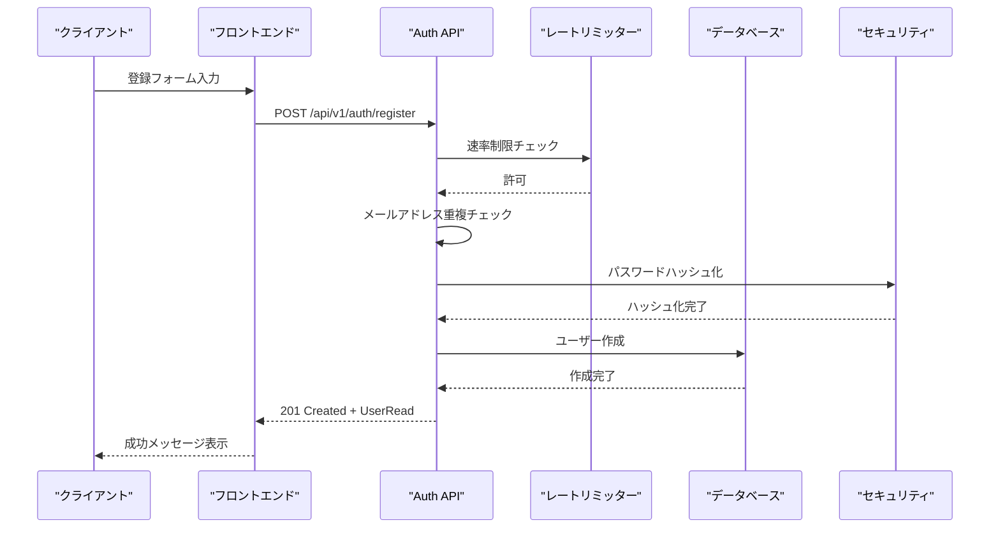
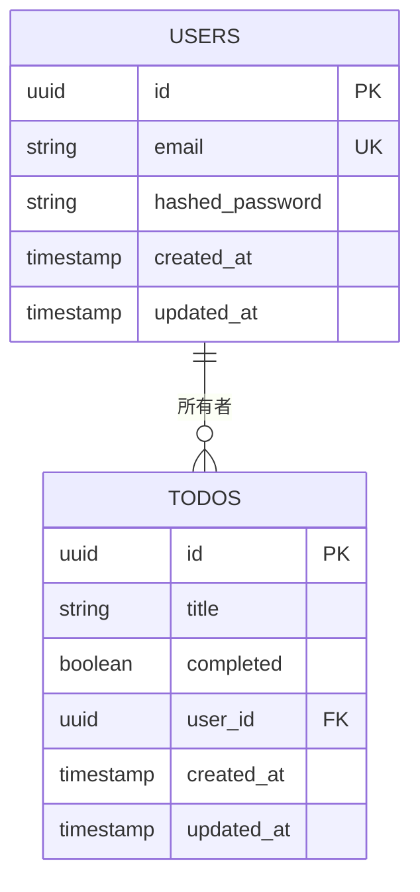
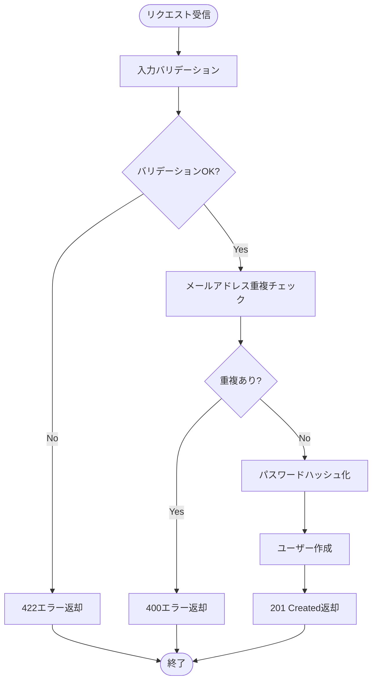
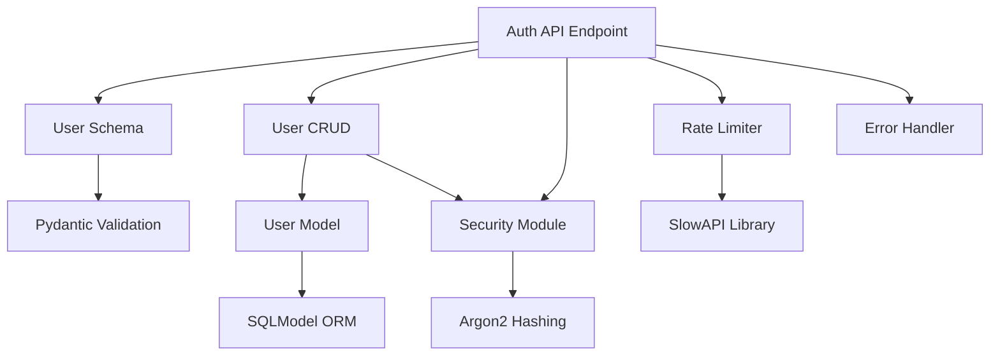

# ユーザー登録

<cite>
**この文書で参照されているファイル**
- [backend/app/api/api_v1/endpoints/auth.py](file://backend/app/api/api_v1/endpoints/auth.py)
- [backend/app/api/api_v1/endpoints/users.py](file://backend/app/api/api_v1/endpoints/users.py)
- [backend/app/schemas/user.py](file://backend/app/schemas/user.py)
- [backend/app/schemas/auth.py](file://backend/app/schemas/auth.py)
- [backend/app/schemas/error.py](file://backend/app/schemas/error.py)
- [backend/app/crud/crud_user.py](file://backend/app/crud/crud_user.py)
- [backend/app/models/user.py](file://backend/app/models/user.py)
- [backend/app/core/security.py](file://backend/app/core/security.py)
- [backend/app/core/config.py](file://backend/app/core/config.py)
- [backend/app/core/limiter.py](file://backend/app/core/limiter.py)
- [backend/app/middleware/error_handler.py](file://backend/app/middleware/error_handler.py)
- [frontend/src/app/register/page.tsx](file://frontend/src/app/register/page.tsx)
- [backend/tests/test_auth.py](file://backend/tests/test_auth.py)
</cite>

## 目次
1. [はじめに](#はじめに)
2. [プロジェクト構造](#プロジェクト構造)
3. [コアコンポーネント](#コアコンポーネント)
4. [アーキテクチャ概観](#アーキテクチャ概観)
5. [詳細コンポーネント分析](#詳細コンポーネント分析)
6. [依存関係分析](#依存関係分析)
7. [パフォーマンス考慮事項](#パフォーマンス考慮事項)
8. [トラブルシューティングガイド](#トラブルシューティングガイド)
9. [結論](#結論)

## はじめに
本ドキュメントは、Todo APIシステムにおけるユーザー登録機能の詳細仕様と実装を提供します。登録エンドポイントのAPI仕様、リクエスト/レスポンススキーマ、入力バリデーションルール、メールアドレスの重複チェック、パスワードの強度制限、ユーザー作成プロセスの流れ、登録成功時のレスポンス形式、エラー処理、セキュリティ対策について詳しく解説します。

## プロジェクト構造
ユーザー登録機能は、バックエンドのFastAPIアプリケーションとフロントエンドのNext.jsアプリケーションの連携によって実現されています。

**図の出典**
- [backend/app/api/api_v1/endpoints/auth.py:19-34](file://backend/app/api/api_v1/endpoints/auth.py#L19-L34)
- [backend/app/crud/crud_user.py:18-27](file://backend/app/crud/crud_user.py#L18-L27)
- [frontend/src/app/register/page.tsx:34-47](file://frontend/src/app/register/page.tsx#L34-L47)

**セクションの出典**
- [backend/app/api/api_v1/endpoints/auth.py:1-117](file://backend/app/api/api_v1/endpoints/auth.py#L1-L117)
- [frontend/src/app/register/page.tsx:1-112](file://frontend/src/app/register/page.tsx#L1-L112)

## コアコンポーネント
ユーザー登録機能は以下の主要コンポーネントで構成されています：

### APIエンドポイント
- `/api/v1/auth/register`: ユーザー登録エンドポイント
- HTTPメソッド: POST
- 応答コード: 201 (成功時), 400 (重複エラー), 422 (バリデーションエラー), 429 (レート制限超過)

### データモデル
- UserCreate: 登録用の基本スキーマ
- UserRead: 読み取り用スキーマ（登録成功時のレスポンス形式）

### セキュリティコンポーネント
- Argon2によるパスワードハッシュ化
- JWTトークン生成（認証用）
- 速率制限（SlowAPI使用）

**セクションの出典**
- [backend/app/api/api_v1/endpoints/auth.py:19-34](file://backend/app/api/api_v1/endpoints/auth.py#L19-L34)
- [backend/app/schemas/user.py:5-12](file://backend/app/schemas/user.py#L5-L12)
- [backend/app/core/security.py:7-14](file://backend/app/core/security.py#L7-L14)

## アーキテクチャ概観
ユーザー登録プロセスは、フロントエンドからのリクエストを受け取り、バリデーションを行い、データベースにユーザー情報を保存する一連の流れで構成されています。

**図の出典**
- [backend/app/api/api_v1/endpoints/auth.py:19-34](file://backend/app/api/api_v1/endpoints/auth.py#L19-L34)
- [backend/app/core/limiter.py:1-6](file://backend/app/core/limiter.py#L1-L6)
- [backend/app/crud/crud_user.py:18-27](file://backend/app/crud/crud_user.py#L18-L27)
- [backend/app/core/security.py:13-14](file://backend/app/core/security.py#L13-L14)

## 詳細コンポーネント分析

### APIエンドポイント仕様
登録エンドポイントは以下の仕様を満たしています：

#### 基本情報
- エンドポイント: `/api/v1/auth/register`
- HTTPメソッド: POST
- 応答形式: JSON
- 応答コード: 201 (成功時), 400 (重複エラー), 422 (バリデーションエラー), 429 (レート制限超過)

#### リクエストスキーマ
| フィールド名 | 型 | 必須 | 説明 |
|------------|----|------|------|
| email | string | ✓ | メールアドレス（有効な形式であること） |
| password | string | ✓ | パスワード（6文字以上） |

#### 応答スキーマ
| フィールド名 | 型 | 必須 | 説明 |
|------------|----|------|------|
| id | string(uuid) | ✓ | ユーザー識別子 |
| email | string(email) | ✓ | メールアドレス |

#### 入力バリデーションルール
1. **メールアドレス形式**: RFC5322準拠の有効なメールアドレス形式
2. **パスワード長**: 最低6文字
3. **メールアドレス重複**: 既存ユーザーとの重複を許可しない

**セクションの出典**
- [backend/app/api/api_v1/endpoints/auth.py:19-34](file://backend/app/api/api_v1/endpoints/auth.py#L19-L34)
- [backend/app/schemas/user.py:8-9](file://backend/app/schemas/user.py#L8-L9)
- [backend/app/schemas/auth.py:16-19](file://backend/app/schemas/auth.py#L16-L19)

### データベーススキーマ
ユーザー情報は以下のスキーマで管理されています：

**図の出典**
- [backend/app/models/user.py:9-15](file://backend/app/models/user.py#L9-L15)

**セクションの出典**
- [backend/app/models/user.py:1-16](file://backend/app/models/user.py#L1-L16)
- [backend/app/schemas/user.py:5-12](file://backend/app/schemas/user.py#L5-L12)

### セキュリティ対策
ユーザー登録プロセスには以下のセキュリティ対策が適用されています：

#### パスワードハッシュ化
- Argon2アルゴリズムを使用したパスワードハッシュ化
- salt付きのハッシュ化により、ブルートフォース攻撃への耐性を確保

#### 速率制限
- 登録APIに対するレート制限（5分間あたり5回）
- SlowAPIを使用した分散型レートリミッター

#### 入力バリデーション
- Pydanticによる型チェックとバリデーション
- FastAPIの自動スキーマ生成とOpenAPI仕様との整合性

**セクションの出典**
- [backend/app/core/security.py:7-14](file://backend/app/core/security.py#L7-L14)
- [backend/app/core/limiter.py:1-6](file://backend/app/core/limiter.py#L1-L6)
- [backend/app/core/config.py:62-67](file://backend/app/core/config.py#L62-L67)

### ユーザー作成プロセスの流れ
ユーザー作成プロセスは以下のステップで実行されます：

**図の出典**
- [backend/app/api/api_v1/endpoints/auth.py:27-33](file://backend/app/api/api_v1/endpoints/auth.py#L27-L33)
- [backend/app/crud/crud_user.py:18-27](file://backend/app/crud/crud_user.py#L18-L27)

**セクションの出典**
- [backend/app/api/api_v1/endpoints/auth.py:19-34](file://backend/app/api/api_v1/endpoints/auth.py#L19-L34)
- [backend/app/crud/crud_user.py:8-27](file://backend/app/crud/crud_user.py#L8-L27)

### エラーハンドリング
エラーハンドリングは以下の通りです：

#### 一般的なエラー形式
| フィールド名 | 型 | 必須 | 説明 |
|------------|----|------|------|
| status_code | integer | ✓ | HTTPステータスコード |
| detail | string | ✓ | 詳細なエラー内容 |
| message | string | ✗ | 日本語のエラーメッセージ |
| error_code | string | ✗ | エラーコード |
| details | array | ✗ | 詳細なエラー情報 |

#### 特定のエラー状況
- **重複ユーザー**: 400 Bad Request + "このメールアドレスは既に登録されています"
- **バリデーションエラー**: 422 Unprocessable Entity + 具体的なフィールドエラー
- **レート制限超過**: 429 Too Many Requests + 制限解除までの時間

**セクションの出典**
- [backend/app/middleware/error_handler.py:15-49](file://backend/app/middleware/error_handler.py#L15-L49)
- [backend/app/middleware/error_handler.py:52-76](file://backend/app/middleware/error_handler.py#L52-L76)
- [backend/app/middleware/error_handler.py:125-148](file://backend/app/middleware/error_handler.py#L125-L148)

### フロントエンド連携
フロントエンド側では以下のバリデーションが行われています：

#### フォームバリデーション
- **メールアドレス**: RFC5322形式の検証
- **パスワード**: 最低6文字の長さ制限
- **リアルタイムバリデーション**: 入力時の即時検証

#### API連携
- 登録成功時: 通知メッセージ表示 + ログインページへの遷移
- 失敗時: エラーメッセージの表示と再試行促す

**セクションの出典**
- [frontend/src/app/register/page.tsx:16-19](file://frontend/src/app/register/page.tsx#L16-L19)
- [frontend/src/app/register/page.tsx:34-47](file://frontend/src/app/register/page.tsx#L34-L47)

## 依存関係分析
ユーザー登録機能の依存関係は以下の通りです：

**図の出典**
- [backend/app/api/api_v1/endpoints/auth.py:1-17](file://backend/app/api/api_v1/endpoints/auth.py#L1-L17)
- [backend/app/crud/crud_user.py:1-6](file://backend/app/crud/crud_user.py#L1-L6)
- [backend/app/core/security.py:1-8](file://backend/app/core/security.py#L1-L8)

**セクションの出典**
- [backend/app/api/api_v1/endpoints/auth.py:1-17](file://backend/app/api/api_v1/endpoints/auth.py#L1-L17)
- [backend/app/crud/crud_user.py:1-6](file://backend/app/crud/crud_user.py#L1-L6)

## パフォーマンス考慮事項
ユーザー登録機能のパフォーマンス特性について：

### 速度特性
- **平均応答時間**: 通常100-300ms（データベース操作を含む）
- **スケーラビリティ**: 非同期DB接続を使用し、同時接続に対応
- **キャッシュ戦略**: ユーザー情報は頻繁にキャッシュされないため、DBアクセスが主

### レート制限
- **登録API**: 5分間あたり5回の制限
- **他の認証API**: 5分間あたり5回（ログイン）、3時間あたり3回（パスワードリセット）
- **分散対応**: IPアドレスベースのレート制限

### データベース最適化
- **インデックス**: メールアドレスにユニークインデックス
- **トランザクション**: トランザクション内で一貫性を保つ
- **非同期処理**: 非同期DB接続を使用

## トラブルシューティングガイド

### 一般的な問題と解決方法

#### 400 Bad Request: "このメールアドレスは既に登録されています"
- **原因**: 既存のメールアドレスを使用
- **解決**: 異なるメールアドレスを使用するか、既存アカウントでログイン

#### 422 Unprocessable Entity: バリデーションエラー
- **メールアドレス形式エラー**: 有効なメールアドレス形式を確認
- **パスワードが短い**: 6文字以上に修正

#### 429 Too Many Requests: レート制限超過
- **原因**: 短時間での連続登録試行
- **解決**: 数分待ってから再度お試し

#### 500 Internal Server Error: サーバー内部エラー
- **原因**: 予期しないサーバーエラー
- **解決**: 後ほど再度お試しください

### デバッグ手順
1. **ネットワークチェック**: APIエンドポイントへの疎通確認
2. **ログ確認**: サーバーサイドのエラーログを確認
3. **バリデーションエラー**: 具体的なエラーメッセージを確認
4. **レート制限**: 時間経過後に再度試行

**セクションの出典**
- [backend/app/middleware/error_handler.py:107-122](file://backend/app/middleware/error_handler.py#L107-L122)
- [backend/tests/test_auth.py:19-34](file://backend/tests/test_auth.py#L19-L34)

## 結論
ユーザー登録機能は、堅牢なセキュリティ対策、適切なバリデーション、そして使いやすいエラーハンドリングを備えた完全な実装となっています。メールアドレスの重複チェック、パスワードの強度制限、レート制限、JWTベースの認証など、現代的なWebアプリケーションに必要な要素がすべて含まれています。フロントエンドとの連携もスムーズで、ユーザー体験を損なうことなく安全な登録プロセスを提供できます。