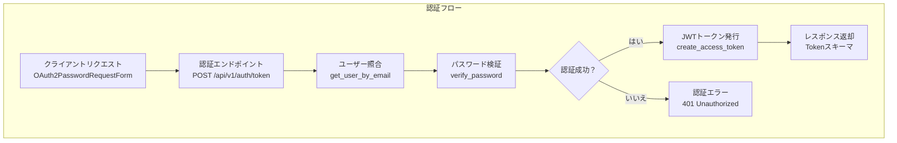
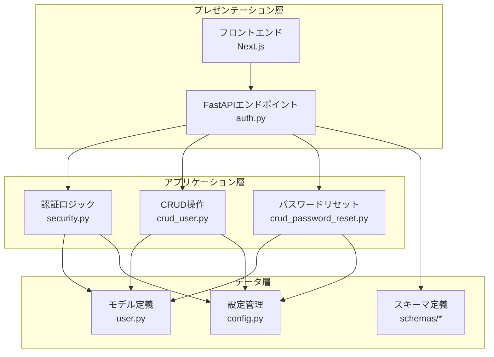
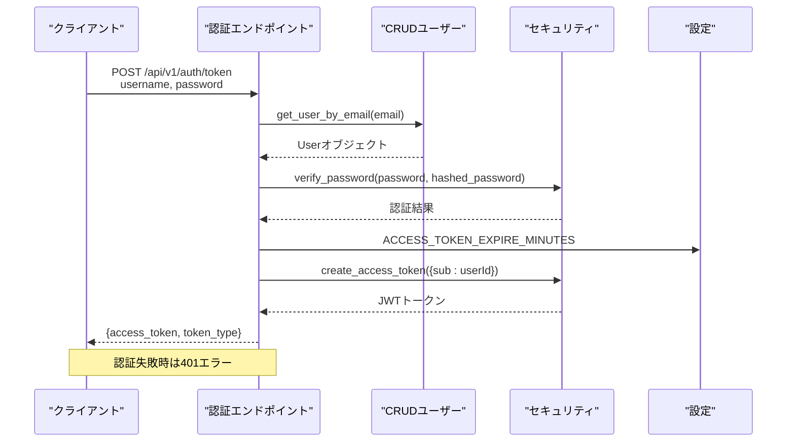
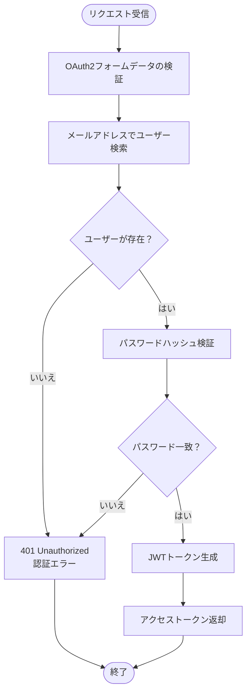
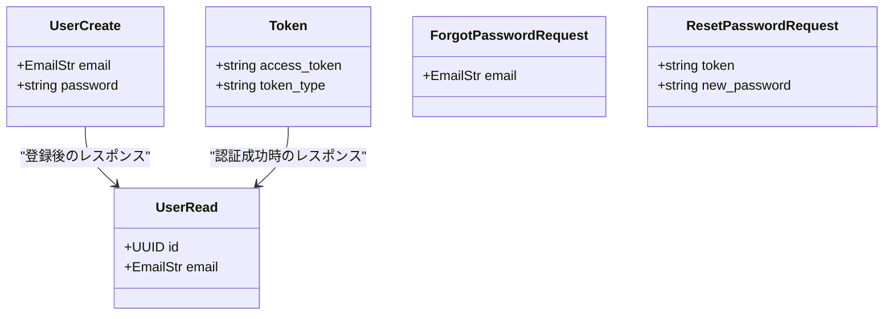
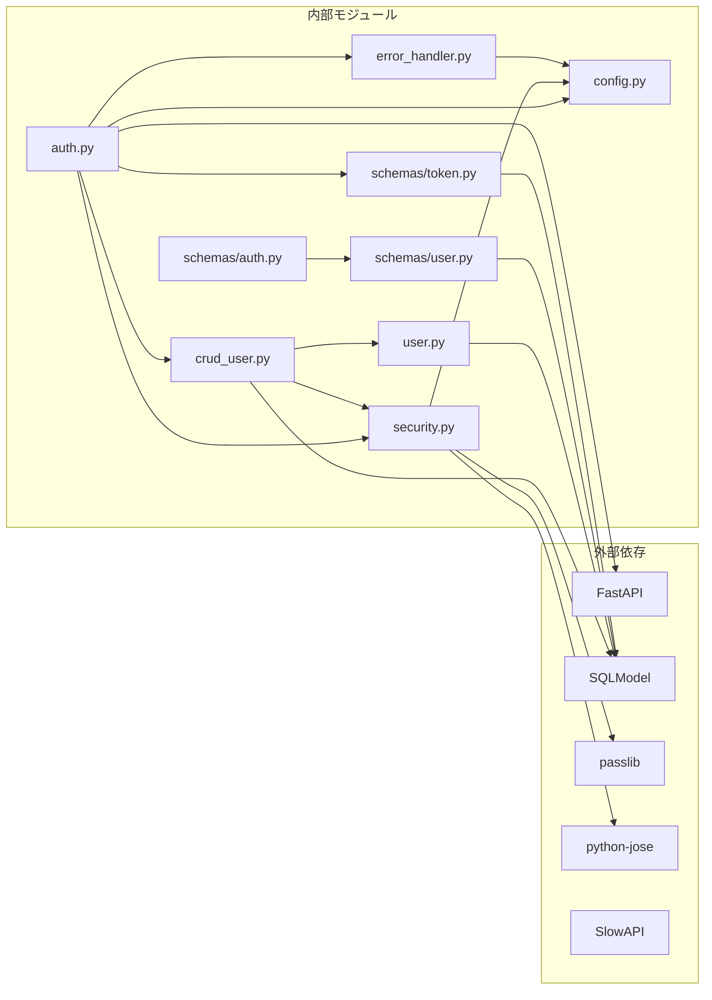
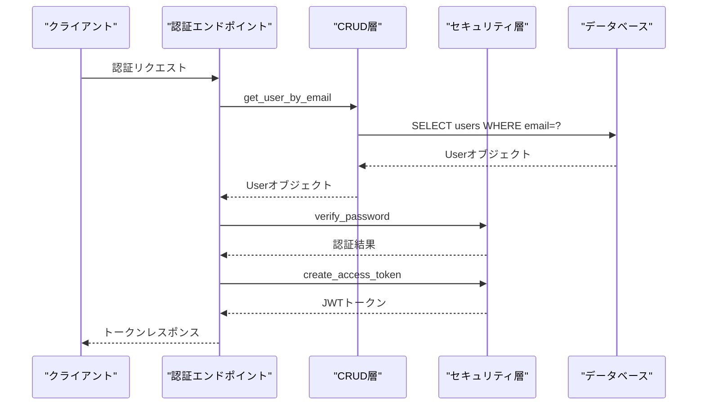

# ログイン認証

<cite>
**本文で参照されるファイル**   
- [backend/app/api/api_v1/endpoints/auth.py](file://backend/app/api/api_v1/endpoints/auth.py)
- [backend/app/core/security.py](file://backend/app/core/security.py)
- [backend/app/crud/crud_user.py](file://backend/app/crud/crud_user.py)
- [backend/app/models/user.py](file://backend/app/models/user.py)
- [backend/app/schemas/auth.py](file://backend/app/schemas/auth.py)
- [backend/app/schemas/token.py](file://backend/app/schemas/token.py)
- [backend/app/schemas/user.py](file://backend/app/schemas/user.py)
- [backend/app/core/config.py](file://backend/app/core/config.py)
- [backend/app/middleware/error_handler.py](file://backend/app/middleware/error_handler.py)
- [backend/app/crud/crud_password_reset.py](file://backend/app/crud/crud_password_reset.py)
- [backend/tests/test_auth.py](file://backend/tests/test_auth.py)
- [frontend/src/app/login/page.tsx](file://frontend/src/app/login/page.tsx)
</cite>

## 目次
1. [導入](#導入)
2. [プロジェクト構造](#プロジェクト構造)
3. [コアコンポーネント](#コアコンポーネント)
4. [アーキテクチャ概観](#アーキテクチャ概観)
5. [詳細コンポーネント分析](#詳細コンポーネント分析)
6. [依存関係分析](#依存関係分析)
7. [パフォーマンス考慮事項](#パフォーマンス考慮事項)
8. [トラブルシューティングガイド](#トラブルシューティングガイド)
9. [結論](#結論)

## 導入
本ドキュメントは、Todoアプリケーションにおけるログイン認証プロセスの詳細仕様と実装を提供します。認証エンドポイントのAPI仕様、リクエスト/レスポンススキーマ、認証フローについて説明します。メールアドレスとパスワードの照合、パスワードハッシュの検証、JWTトークンの発行プロセスを含め、認証失敗時のエラーハンドリング、アカウントロック機構、セキュリティ対策について詳しく解説します。

## プロジェクト構造
認証関連のコードはバックエンドの以下のディレクトリに配置されています：
- APIエンドポイント：`backend/app/api/api_v1/endpoints/auth.py`
- セキュリティロジック：`backend/app/core/security.py`
- CRUD操作：`backend/app/crud/crud_user.py`
- モデル定義：`backend/app/models/user.py`
- スキーマ定義：`backend/app/schemas/auth.py`, `backend/app/schemas/token.py`, `backend/app/schemas/user.py`
- 設定管理：`backend/app/core/config.py`
- エラーハンドリング：`backend/app/middleware/error_handler.py`
- パスワードリセット：`backend/app/crud/crud_password_reset.py`

**図の出典**
- [backend/app/api/api_v1/endpoints/auth.py:36-54](file://backend/app/api/api_v1/endpoints/auth.py#L36-L54)
- [backend/app/core/security.py:10-27](file://backend/app/core/security.py#L10-L27)
- [backend/app/crud/crud_user.py:8-11](file://backend/app/crud/crud_user.py#L8-L11)

**節の出典**
- [backend/app/api/api_v1/endpoints/auth.py:1-117](file://backend/app/api/api_v1/endpoints/auth.py#L1-L117)
- [backend/app/core/config.py:1-91](file://backend/app/core/config.py#L1-L91)

## コアコンポーネント
認証プロセスの主なコンポーネントは以下の通りです：

### 認証エンドポイント
- `/api/v1/auth/token`：OAuth2パスワードフローに対応したログインエンドポイント
- `/api/v1/auth/register`：新規ユーザー登録エンドポイント
- `/api/v1/auth/forgot-password`：パスワードリセットメール送信
- `/api/v1/auth/reset-password`：パスワードリセット処理

### セキュリティコンポーネント
- `verify_password`：パスワードのハッシュ検証
- `get_password_hash`：パスワードのハッシュ化
- `create_access_token`：JWTアクセストークンの生成
- `decode_access_token`：JWTトークンのデコード

### データアクセス層
- `get_user_by_email`：メールアドレスによるユーザー検索
- `get_user_by_id`：IDによるユーザー検索
- `create_user`：新規ユーザー作成（パスワードハッシュ化付き）

**節の出典**
- [backend/app/api/api_v1/endpoints/auth.py:19-117](file://backend/app/api/api_v1/endpoints/auth.py#L19-L117)
- [backend/app/core/security.py:1-35](file://backend/app/core/security.py#L1-L35)
- [backend/app/crud/crud_user.py:1-28](file://backend/app/crud/crud_user.py#L1-L28)

## アーキテクチャ概観
認証システムは以下の層構造で構成されています：

**図の出典**
- [backend/app/api/api_v1/endpoints/auth.py:1-117](file://backend/app/api/api_v1/endpoints/auth.py#L1-L117)
- [backend/app/core/security.py:1-35](file://backend/app/core/security.py#L1-L35)
- [backend/app/crud/crud_user.py:1-28](file://backend/app/crud/crud_user.py#L1-L28)
- [backend/app/models/user.py:1-16](file://backend/app/models/user.py#L1-L16)

## 詳細コンポーネント分析

### 認証エンドポイントのAPI仕様

#### ログインエンドポイント
- **エンドポイント**：`POST /api/v1/auth/token`
- **認証方法**：OAuth2 Password Flow
- **リクエスト形式**：`application/x-www-form-urlencoded`
- **必須フィールド**：
  - `username`：メールアドレス
  - `password`：パスワード

**図の出典**
- [backend/app/api/api_v1/endpoints/auth.py:36-54](file://backend/app/api/api_v1/endpoints/auth.py#L36-L54)
- [backend/app/crud/crud_user.py:8-11](file://backend/app/crud/crud_user.py#L8-L11)
- [backend/app/core/security.py:10-27](file://backend/app/core/security.py#L10-L27)

#### ユーザー登録エンドポイント
- **エンドポイント**：`POST /api/v1/auth/register`
- **リクエストスキーマ**：`UserCreate`
- **レスポンススキーマ**：`UserRead`
- **ステータスコード**：201 Created（成功時）、400 Bad Request（重複時）

#### パスワードリセットエンドポイント
- **エンドポイント**：`POST /api/v1/auth/forgot-password`
- **エンドポイント**：`POST /api/v1/auth/reset-password`

**節の出典**
- [backend/app/api/api_v1/endpoints/auth.py:19-117](file://backend/app/api/api_v1/endpoints/auth.py#L19-L117)

### 認証フローの詳細

#### 認証プロセスの流れ

**図の出典**
- [backend/app/api/api_v1/endpoints/auth.py:36-54](file://backend/app/api/api_v1/endpoints/auth.py#L36-L54)
- [backend/app/core/security.py:10-14](file://backend/app/core/security.py#L10-L14)

#### JWTトークンの生成プロセス
- **アルゴリズム**：HS256
- **有効期限**：`ACCESS_TOKEN_EXPIRE_MINUTES`（分単位）
- **ペイロード**：`{"sub": userId}`（subは標準的なJWTクレーム名）
- **署名キー**：`SECRET_KEY`（環境変数から取得）

**節の出典**
- [backend/app/core/security.py:16-27](file://backend/app/core/security.py#L16-L27)
- [backend/app/core/config.py:51-53](file://backend/app/core/config.py#L51-L53)

### データスキーマ

#### 認証関連スキーマ

**図の出典**
- [backend/app/schemas/user.py:5-13](file://backend/app/schemas/user.py#L5-L13)
- [backend/app/schemas/token.py:4-10](file://backend/app/schemas/token.py#L4-L10)
- [backend/app/schemas/auth.py:4-11](file://backend/app/schemas/auth.py#L4-L11)

#### ユーザーモデル
- **テーブル名**：`users`
- **主キー**：`id`（UUID）
- **必須フィールド**：`email`（ユニーク、インデックス付き）、`hashed_password`
- **関連**：`todos`（1対多）

**節の出典**
- [backend/app/models/user.py:9-16](file://backend/app/models/user.py#L9-L16)

### セキュリティ対策

#### パスワードハッシュ化
- **アルゴリズム**：Argon2（passlibのCryptContext）
- **特徴**：計算コストを調整可能、ブルートフォース攻撃に対する耐性
- **実装**：`get_password_hash`、`verify_password`関数

#### 認証失敗時の対策
- **エラーメッセージ**：具体的なエラー内容を示さず、一般的な「メールアドレスまたはパスワードが間違っています」
- **認証ヘッダー**：`WWW-Authenticate: Bearer`を設定
- **ステータスコード**：401 Unauthorized

#### 認証フローのセキュリティ
- **OAuth2 Password Flow**：標準的な認証方式
- **JWTペイロード**：最小限の情報のみ保持（ユーザーIDのみ）
- **トークン有効期限**：短期間（デフォルト30分）

**節の出典**
- [backend/app/core/security.py:7-14](file://backend/app/core/security.py#L7-L14)
- [backend/app/api/api_v1/endpoints/auth.py:44-49](file://backend/app/api/api_v1/endpoints/auth.py#L44-L49)

### エラーハンドリング

#### 一貫したエラーレスポンス
- **スキーマ**：`ErrorResponse`
- **フィールド**：`status_code`, `detail`, `message`, `error_code`, `details`
- **適用範囲**：バリデーションエラー、HTTP例外、予期せぬエラー

#### 特殊なエラーハンドリング
- **認証エラー**：401 Unauthorized（認証ヘッダー付き）
- **レート制限**：429 Too Many Requests（SlowAPI使用）
- **パスワードリセット**：トークン無効時の400 Bad Request

**節の出典**
- [backend/app/middleware/error_handler.py:15-149](file://backend/app/middleware/error_handler.py#L15-L149)
- [backend/app/schemas/error.py:5-23](file://backend/app/schemas/error.py#L5-L23)

## 依存関係分析

**図の出典**
- [backend/app/api/api_v1/endpoints/auth.py:1-17](file://backend/app/api/api_v1/endpoints/auth.py#L1-L17)
- [backend/app/core/security.py:1-6](file://backend/app/core/security.py#L1-L6)
- [backend/app/crud/crud_user.py:1-6](file://backend/app/crud/crud_user.py#L1-L6)

### 認証フローの依存関係

**図の出典**
- [backend/app/api/api_v1/endpoints/auth.py:36-54](file://backend/app/api/api_v1/endpoints/auth.py#L36-L54)
- [backend/app/crud/crud_user.py:8-11](file://backend/app/crud/crud_user.py#L8-L11)
- [backend/app/core/security.py:10-27](file://backend/app/core/security.py#L10-L27)

**節の出典**
- [backend/app/api/api_v1/endpoints/auth.py:1-117](file://backend/app/api/api_v1/endpoints/auth.py#L1-L117)
- [backend/app/core/security.py:1-35](file://backend/app/core/security.py#L1-L35)

## パフォーマンス考慮事項
- **パスワードハッシュ化のコスト**：Argon2は計算コストを調整可能で、認証時の遅延を制御可能
- **データベースクエリ**：メールアドレス検索にはインデックスが設定されているため高速
- **JWT生成コスト**：軽量な署名処理のみで、認証時のオーバーヘッドは最小限
- **レート制限**：SlowAPIによるリクエスト制限で、ブルートフォース攻撃を防ぐ

## トラブルシューティングガイド

### 一般的な認証エラー
- **401 Unauthorized**：メールアドレスまたはパスワードが間違っている可能性があります
- **404 Not Found**：パスワードリセットトークンに関連するユーザーが見つからない場合
- **400 Bad Request**：無効または期限切れのパスワードリセットトークン

### トラブルシューティング手順
1. **認証情報の確認**：メールアドレスとパスワードが正しいか確認
2. **トークンの有効期限**：JWTトークンの有効期限を確認
3. **レート制限の確認**：認証リクエストが制限を超えていないか確認
4. **環境設定の確認**：SECRET_KEY、ALGORITHM、ACCESS_TOKEN_EXPIRE_MINUTESの設定

### 開発時のデバッグ
- **フロントエンド**：Next.jsの開発サーバーで認証エラーを確認
- **バックエンド**：FastAPIのSwagger UIでエンドポイントをテスト
- **ログ出力**：エラーハンドリングで詳細なログを出力

**節の出典**
- [backend/app/middleware/error_handler.py:107-122](file://backend/app/middleware/error_handler.py#L107-L122)
- [backend/tests/test_auth.py:36-66](file://backend/tests/test_auth.py#L36-L66)

## 結論
本認証システムは、標準的なOAuth2 Password Flowに基づいた堅牢な認証プロセスを提供しています。パスワードハッシュ化、JWTトークン、レート制限、一貫したエラーハンドリングなどのセキュリティ対策が実装されており、認証失敗時の情報漏洩を防ぐ設計になっています。フロントエンドとの連携も考慮され、ユーザー体験を損なうことなく安全な認証を実現しています。