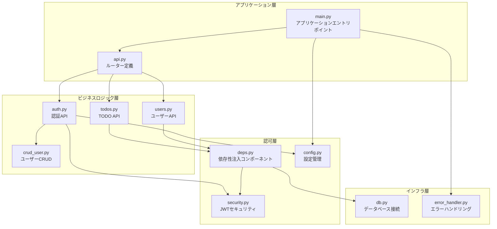
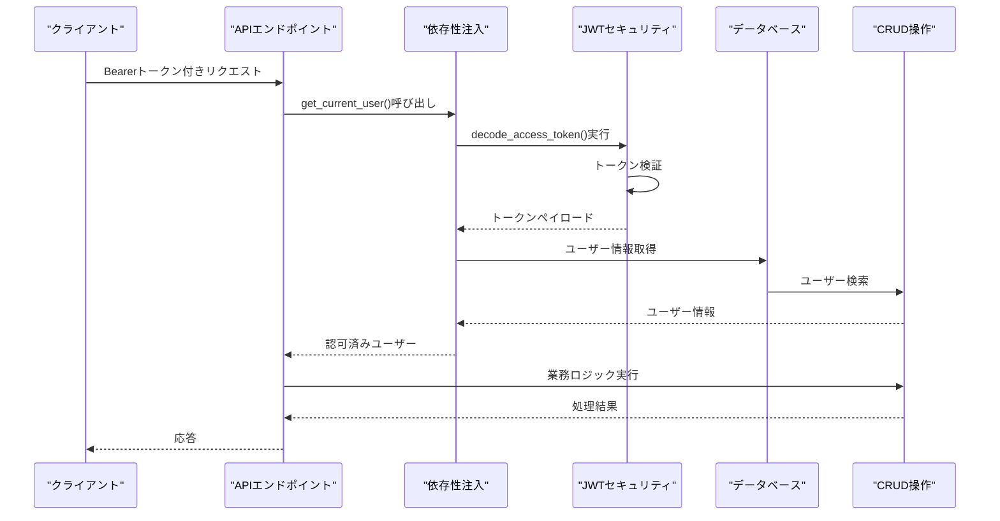
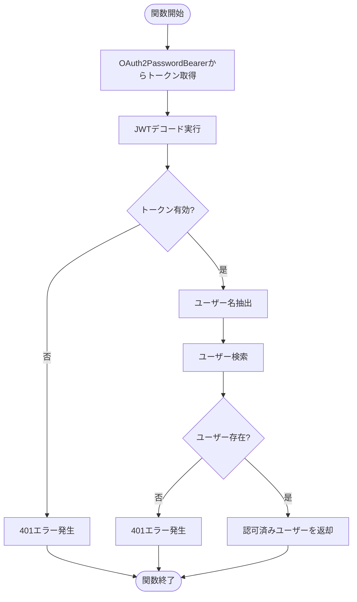
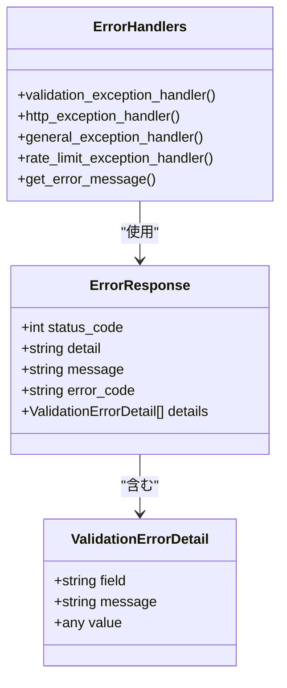
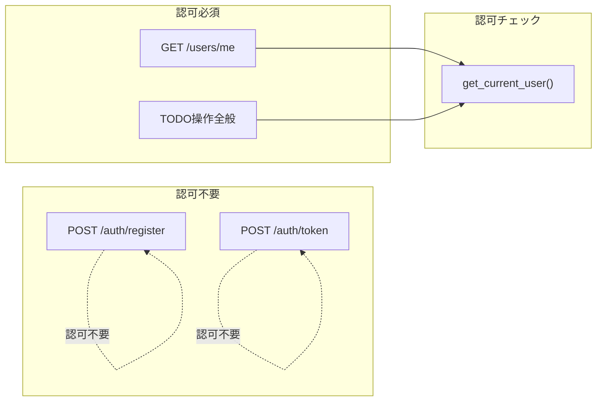
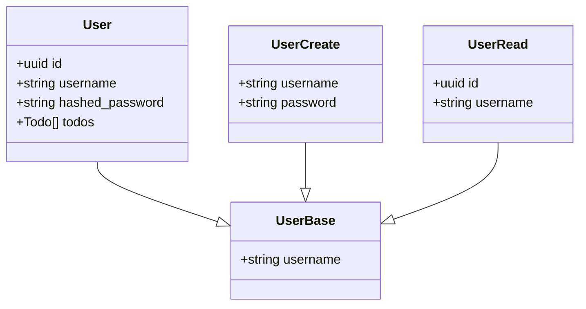
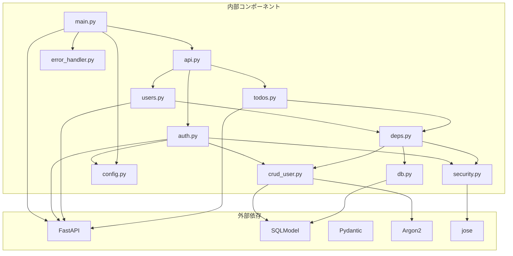

# 認可ロジック

<cite>
**本文で参照されるファイル**   
- [backend/app/main.py](file://backend/app/main.py)
- [backend/app/api/deps.py](file://backend/app/api/deps.py)
- [backend/app/core/security.py](file://backend/app/core/security.py)
- [backend/app/api/api_v1/endpoints/auth.py](file://backend/app/api/api_v1/endpoints/auth.py)
- [backend/app/api/api_v1/endpoints/users.py](file://backend/app/api/api_v1/endpoints/users.py)
- [backend/app/api/api_v1/endpoints/todos.py](file://backend/app/api/api_v1/endpoints/todos.py)
- [backend/app/api/api_v1/api.py](file://backend/app/api/api_v1/api.py)
- [backend/app/core/config.py](file://backend/app/core/config.py)
- [backend/app/core/db.py](file://backend/app/core/db.py)
- [backend/app/middleware/error_handler.py](file://backend/app/middleware/error_handler.py)
- [backend/app/crud/crud_user.py](file://backend/app/crud/crud_user.py)
- [backend/app/models/user.py](file://backend/app/models/user.py)
- [backend/app/schemas/user.py](file://backend/app/schemas/user.py)
- [backend/pyproject.toml](file://backend/pyproject.toml)
</cite>

## 目次
1. [導入](#導入)
2. [プロジェクト構造](#プロジェクト構造)
3. [コアコンポーネント](#コアコンポーネント)
4. [アーキテクチャ概要](#アーキテクチャ概要)
5. [詳細コンポーネント分析](#詳細コンポーネント分析)
6. [依存関係分析](#依存関係分析)
7. [パフォーマンス考慮事項](#パフォーマンス考慮事項)
8. [トラブルシューティングガイド](#トラブルシューティングガイド)
9. [結論](#結論)

## 導入
本ドキュメントは、Todo APIプロジェクトにおける認可（Authorization）ロジックの設計と実装について詳細に説明します。特に以下の点に焦点を当てます：
- Bearer Token認可方式の実装
- 依存性注入による認可チェックの仕組み
- ユーザー権限の検証プロセス
- 認可ミドルウェアの実装方法
- APIエンドポイントごとの認可レベル設定
- ロールベースアクセス制御（RBAC）の可能性
- 認可エラーの処理方法
- セキュリティリスクの緩和策

## プロジェクト構造
Todo APIはFastAPIフレームワークを基盤としたマイクロサービスアーキテクチャを採用しており、認可ロジックは以下の主要なコンポーネントによって構成されています。

**図の出典**
- [backend/app/main.py:1-168](file://backend/app/main.py#L1-L168)
- [backend/app/api/api_v1/api.py:1-8](file://backend/app/api/api_v1/api.py#L1-L8)

**セクションの出典**
- [backend/app/main.py:1-168](file://backend/app/main.py#L1-L168)
- [backend/app/api/api_v1/api.py:1-8](file://backend/app/api/api_v1/api.py#L1-L8)

## コアコンポーネント
認可ロジックの設計には以下の5つの主要コンポーネントが関与しています：

### 1. Bearer Token認証スキーム
FastAPIのOAuth2PasswordBearerを使用したJWT Bearer認証を実装しています。トークンはAuthorizationヘッダーに"Bearer "プレフィックスを付けて送信されます。

### 2. 依存性注入システム
Depsモジュールを通じて認可チェックを行うget_current_user関数を提供し、各APIエンドポイントで簡単に認可を適用できるようにしています。

### 3. JWTセキュリティ管理
security.pyでJWTトークンの生成・検証処理を実装し、パスワードのハッシュ化も含まれています。

### 4. 認可エラーハンドリング
error_handler.pyで認可エラーを統一された形式で処理し、ロギングも実装されています。

### 5. 認可ルール定義
各APIエンドポイントでDepends(deps.get_current_user)を使用することで、認可が必要なエンドポイントを明確に定義しています。

**セクションの出典**
- [backend/app/api/deps.py:1-31](file://backend/app/api/deps.py#L1-L31)
- [backend/app/core/security.py:1-35](file://backend/app/core/security.py#L1-L35)
- [backend/app/middleware/error_handler.py:1-149](file://backend/app/middleware/error_handler.py#L1-L149)

## アーキテクチャ概要
認可ロジックは以下の3層構造で設計されています：

**図の出典**
- [backend/app/api/deps.py:12-31](file://backend/app/api/deps.py#L12-L31)
- [backend/app/core/security.py:29-35](file://backend/app/core/security.py#L29-L35)
- [backend/app/crud/crud_user.py:7-10](file://backend/app/crud/crud_user.py#L7-L10)

## 詳細コンポーネント分析

### 依存性注入による認可チェック (`get_current_user`)
認可ロジックの中心となる関数で、以下のプロセスを実行します：

1. **トークン取得**: OAuth2PasswordBearerからAuthorizationヘッダーのBearerトークンを取得
2. **トークン検証**: JWTデコード処理を実行
3. **ユーザー検索**: トークンから抽出したユーザー名でデータベース検索
4. **認可判定**: 存在するユーザーのみ認可を許可

**図の出典**
- [backend/app/api/deps.py:12-31](file://backend/app/api/deps.py#L12-L31)

**セクションの出典**
- [backend/app/api/deps.py:12-31](file://backend/app/api/deps.py#L12-L31)

### JWTセキュリティ管理 (`security.py`)
JWTトークンの生成と検証を担当するクラスで、以下の機能を提供します：

#### トークン生成プロセス
- 有効期限設定（デフォルト30分）
- HS256アルゴリズムを使用した署名
- 環境変数からシークレットキーを取得

#### トークン検証プロセス
- 指定されたアルゴリズムで署名検証
- 有効期限のチェック
- 例外発生時の安全なフォールバック

**セクションの出典**
- [backend/app/core/security.py:16-35](file://backend/app/core/security.py#L16-L35)

### 認可エラーハンドリング (`error_handler.py`)
認可エラーを統一された形式で処理し、以下のエラーコードに対応しています：

- 401 Unauthorized: 認証情報の検証に失敗
- 403 Forbidden: 権限がない操作
- 404 Not Found: 要求されたリソースが存在しない

**図の出典**
- [backend/app/middleware/error_handler.py:15-149](file://backend/app/middleware/error_handler.py#L15-L149)

**セクションの出典**
- [backend/app/middleware/error_handler.py:15-149](file://backend/app/middleware/error_handler.py#L15-L149)

### APIエンドポイントごとの認可レベル設定
各APIエンドポイントでは、必要に応じて認可チェックを適用しています：

#### 認可不要エンドポイント
- `/api/v1/auth/register`: 新規ユーザー登録
- `/api/v1/auth/token`: ログイン認証

#### 認可必須エンドポイント
- `/api/v1/users/me`: 現在のユーザー情報取得
- `/api/v1/todos/`: 全てのTODO操作

**図の出典**
- [backend/app/api/api_v1/endpoints/auth.py:17-32](file://backend/app/api/api_v1/endpoints/auth.py#L17-L32)
- [backend/app/api/api_v1/endpoints/users.py:9-13](file://backend/app/api/api_v1/endpoints/users.py#L9-L13)
- [backend/app/api/api_v1/endpoints/todos.py:13-102](file://backend/app/api/api_v1/endpoints/todos.py#L13-L102)

**セクションの出典**
- [backend/app/api/api_v1/endpoints/auth.py:17-32](file://backend/app/api/api_v1/endpoints/auth.py#L17-L32)
- [backend/app/api/api_v1/endpoints/users.py:9-13](file://backend/app/api/api_v1/endpoints/users.py#L9-L13)
- [backend/app/api/api_v1/endpoints/todos.py:13-102](file://backend/app/api/api_v1/endpoints/todos.py#L13-L102)

### RBAC（ロールベースアクセス制御）の可能性
現在の実装ではユーザーIDに基づく認可しか行っていませんが、RBACを実装するための拡張ポイントがあります：

#### 現在のユーザー情報構造

**図の出典**
- [backend/app/models/user.py:9-16](file://backend/app/models/user.py#L9-L16)
- [backend/app/schemas/user.py:4-12](file://backend/app/schemas/user.py#L4-L12)

#### RBAC実装のための拡張案
1. **ロールフィールドの追加**: `role: str = Field(default="user")`
2. **権限マトリクスの定義**: 各ロールごとの権限を定義
3. **カスタム認可関数の作成**: `require_role(required_role: str)`
4. **権限チェックロジックの実装**: `check_permission(user_role, required_permission)`

**セクションの出典**
- [backend/app/models/user.py:9-16](file://backend/app/models/user.py#L9-L16)
- [backend/app/schemas/user.py:4-12](file://backend/app/schemas/user.py#L4-L12)

## 依存関係分析
認可ロジックの依存関係は以下の通りです：

**図の出典**
- [backend/pyproject.toml:7-22](file://backend/pyproject.toml#L7-L22)
- [backend/app/main.py:1-168](file://backend/app/main.py#L1-L168)

**セクションの出典**
- [backend/pyproject.toml:7-22](file://backend/pyproject.toml#L7-L22)
- [backend/app/main.py:1-168](file://backend/app/main.py#L1-L168)

## パフォーマンス考慮事項
認可ロジックのパフォーマンス向上のための最適化策：

### 1. トークンキャッシュ戦略
- 有効期限内のトークンをメモリキャッシュに格納
- 重複する認可チェックを回避

### 2. データベースクエリの最適化
- ユーザー検索クエリのインデックス活用
- N+1クエリ問題の防止

### 3. 非同期処理の活用
- すべてのデータベース操作は非同期で実行
- I/Oバウンド処理の並列化

### 4. 認可チェックの遅延評価
- 必要な場合のみ認可チェックを実施
- 認可不要なエンドポイントでのオーバーヘッド削減

## トラブルシューティングガイド

### 一般的な認可エラーの原因と対処法

#### 1. 401 Unauthorizedエラー
**原因**: 
- 有効期限切れのJWTトークン
- 無効な署名のJWTトークン
- Authorizationヘッダーの形式不正

**対処法**:
- 新しいトークンを取得するために再認証
- トークンの形式を"Bearer {トークン}"に修正
- シークレットキーの一致確認

#### 2. 403 Forbiddenエラー
**原因**: 
- 現在のユーザーがリソースにアクセスできない
- RBACロール不足（将来的な実装）

**対処法**:
- 権限のあるユーザーで再度試行
- RBACロールの確認と変更

#### 3. 404 Not Foundエラー
**原因**: 
- 認可されたユーザーが存在しない
- 削除されたユーザーのリクエスト

**対処法**:
- 再認証を実施
- ユーザーが正常に作成されているか確認

### 認可エラーログの解析
エラーハンドラーは以下の情報をログに出力します：
- URLとHTTPメソッド
- ステータスコード
- 詳細なエラー内容
- クライアントIPアドレス

**セクションの出典**
- [backend/app/middleware/error_handler.py:15-149](file://backend/app/middleware/error_handler.py#L15-L149)

## 結論
Todo APIの認可ロジックは、以下の特徴を持つ堅牢な設計となっています：

1. **標準準拠のJWT Bearer認証**: OAuth2PasswordBearerを使用した認証方式
2. **依存性注入による柔軟な認可**: get_current_user関数を通じて認可チェックを適用
3. **統一されたエラーハンドリング**: 401/403/404エラーを一貫した形式で処理
4. **拡張可能なRBAC対応**: 将来的なロールベースアクセス制御の実装が可能
5. **パフォーマンス最適化**: 非同期処理とキャッシュ戦略の採用

今後の改善点として、RBACの実装、トークンキャッシュの導入、認可ロギングの強化などが挙げられます。これらの改善により、より高度な認可管理機能を実現することが可能です。