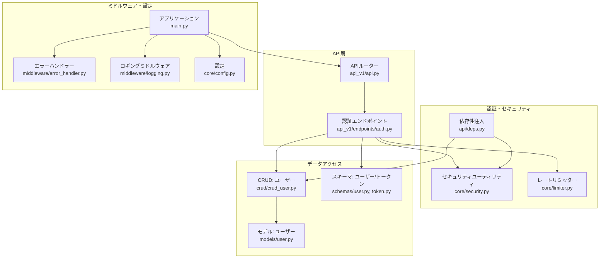
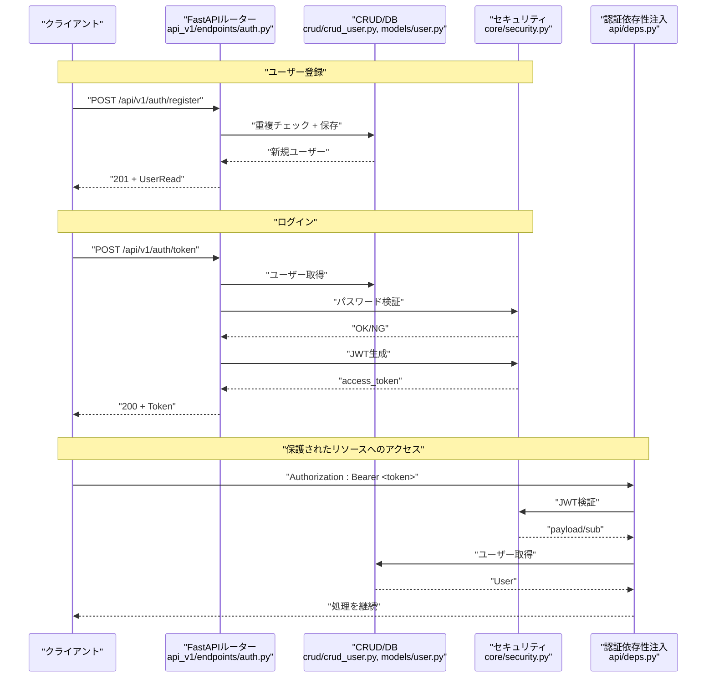
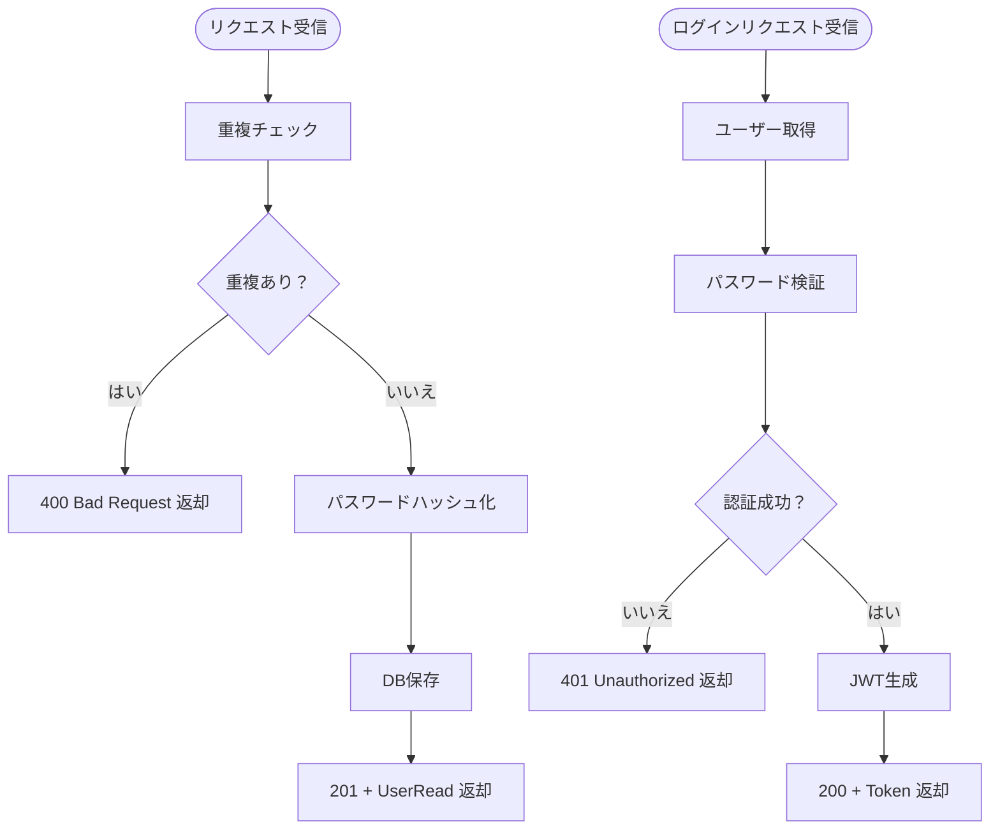
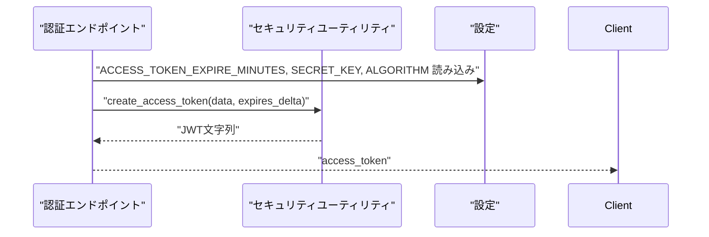
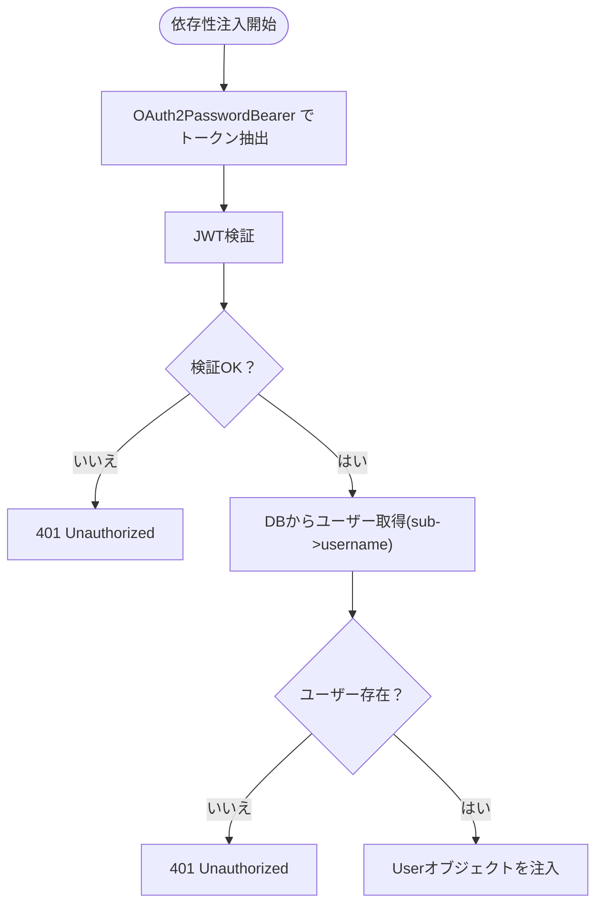
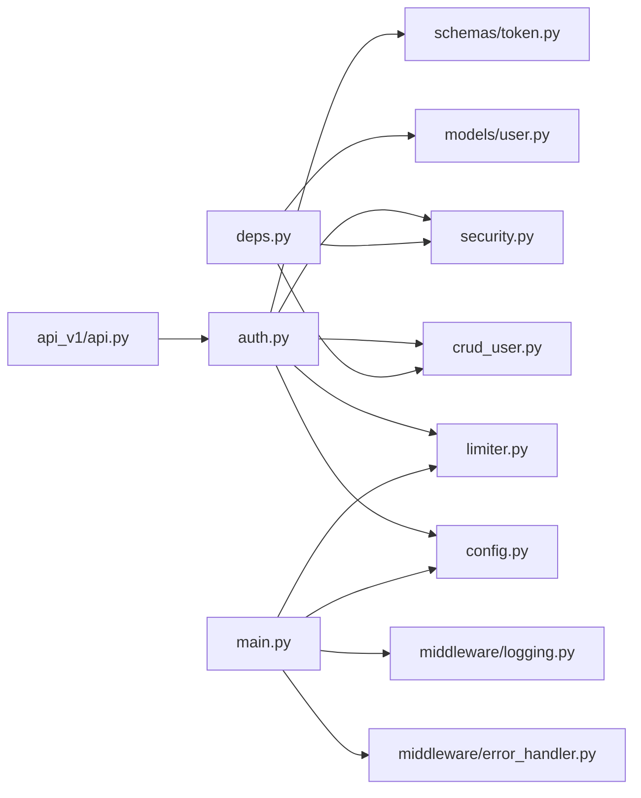

# 認証システム

<cite>
**本文で参照されたファイル**   
- [backend/app/api/api_v1/endpoints/auth.py](file://backend/app/api/api_v1/endpoints/auth.py)
- [backend/app/core/security.py](file://backend/app/core/security.py)
- [backend/app/schemas/token.py](file://backend/app/schemas/token.py)
- [backend/app/crud/crud_user.py](file://backend/app/crud/crud_user.py)
- [backend/app/models/user.py](file://backend/app/models/user.py)
- [backend/app/core/config.py](file://backend/app/core/config.py)
- [backend/app/api/deps.py](file://backend/app/api/deps.py)
- [backend/app/middleware/error_handler.py](file://backend/app/middleware/error_handler.py)
- [backend/app/main.py](file://backend/app/main.py)
- [backend/pyproject.toml](file://backend/pyproject.toml)
- [backend/app/core/limiter.py](file://backend/app/core/limiter.py)
- [backend/tests/test_auth.py](file://backend/tests/test_auth.py)
- [backend/app/schemas/user.py](file://backend/app/schemas/user.py)
- [backend/app/middleware/logging.py](file://backend/app/middleware/logging.py)
- [backend/app/api/api_v1/api.py](file://backend/app/api/api_v1/api.py)
</cite>

## 目次
1. [はじめに](#はじめに)
2. [プロジェクト構造](#プロジェクト構造)
3. [コアコンポーネント](#コアコンポーネント)
4. [アーキテクチャ概観](#アーキテクチャ概観)
5. [詳細コンポーネント解析](#詳細コンポーネント解析)
6. [依存関係解析](#依存関係解析)
7. [パフォーマンス考慮事項](#パフォーマンス考慮事項)
8. [トラブルシューティングガイド](#トラブルシューティングガイド)
9. [結論](#結論)
10. [付録](#付録)

## はじめに
本ドキュメントは、FastAPIベースのJWT認証システムの仕様と実装を網羅的に解説します。主な対象となるエンドポイントは以下の通りです：
- ユーザー登録：POST /api/v1/auth/register
- ログイン（アクセストークン取得）：POST /api/v1/auth/token

また、JWTトークンの生成・検証プロセス、パスワードハッシュ化（Argon2 + Bcrypt）、認可ヘッダーの使用方法、認証ミドルウェアの実装、依存性注入（DI）の仕組み、セキュリティ対策（レート制限、CORS設定）について詳しく説明します。

## プロジェクト構造
バックエンドはFastAPIアプリケーションとして構成されており、認証関連のエンドポイントは `/api/v1/auth` に配置されています。全体のルーティングは `api_v1/api.py` で定義され、認証エンドポイントは `auth.py` に実装されています。認証フローでは、パスワードハッシュ化、JWTの生成・検証、DBアクセス、レートリミッター、CORS、エラーハンドリングなどのコンポーネントが連携して動作します。

**図の出典**
- [backend/app/api/api_v1/api.py:1-8](file://backend/app/api/api_v1/api.py#L1-L8)
- [backend/app/api/api_v1/endpoints/auth.py:1-53](file://backend/app/api/api_v1/endpoints/auth.py#L1-L53)
- [backend/app/core/security.py:1-35](file://backend/app/core/security.py#L1-L35)
- [backend/app/api/deps.py:1-31](file://backend/app/api/deps.py#L1-L31)
- [backend/app/core/limiter.py:1-7](file://backend/app/core/limiter.py#L1-L7)
- [backend/app/crud/crud_user.py:1-22](file://backend/app/crud/crud_user.py#L1-L22)
- [backend/app/models/user.py:1-19](file://backend/app/models/user.py#L1-L19)
- [backend/app/schemas/user.py:1-12](file://backend/app/schemas/user.py#L1-L12)
- [backend/app/schemas/token.py:1-10](file://backend/app/schemas/token.py#L1-L10)
- [backend/app/middleware/error_handler.py:1-149](file://backend/app/middleware/error_handler.py#L1-L149)
- [backend/app/middleware/logging.py:1-67](file://backend/app/middleware/logging.py#L1-L67)
- [backend/app/core/config.py:1-60](file://backend/app/core/config.py#L1-L60)
- [backend/app/main.py:1-164](file://backend/app/main.py#L1-L164)

**節の出典**
- [backend/app/api/api_v1/api.py:1-8](file://backend/app/api/api_v1/api.py#L1-L8)
- [backend/app/main.py:1-164](file://backend/app/main.py#L1-L164)

## コアコンポーネント
- 認証エンドポイント（POST /api/v1/auth/register、POST /api/v1/auth/token）
  - 登録：ユーザー名の重複チェック、パスワードのハッシュ化、DBへの保存
  - ログイン：ユーザーの存在確認、パスワード検証、JWTアクセストークンの発行
- JWTセキュリティユーティリティ
  - トークン生成（署名アルゴリズム、有効期限）
  - トークン検証（署名検証、有効期限チェック）
- 認証ミドルウェア（依存性注入）
  - Authorization: Bearer トークンの抽出、JWTの検証、現在のユーザー取得
- レートリミッター
  - 全体・ログイン用のレート制限設定
- CORS
  - 許可するオリジン、メソッド、ヘッダーの設定
- エラーハンドリング
  - 429（レートリミット）、401（認証失敗）、404/500（その他のHTTPエラー）の統一フォーマット

**節の出典**
- [backend/app/api/api_v1/endpoints/auth.py:1-53](file://backend/app/api/api_v1/endpoints/auth.py#L1-L53)
- [backend/app/core/security.py:1-35](file://backend/app/core/security.py#L1-L35)
- [backend/app/api/deps.py:1-31](file://backend/app/api/deps.py#L1-L31)
- [backend/app/core/limiter.py:1-7](file://backend/app/core/limiter.py#L1-L7)
- [backend/app/core/config.py:1-60](file://backend/app/core/config.py#L1-L60)
- [backend/app/middleware/error_handler.py:1-149](file://backend/app/middleware/error_handler.py#L1-L149)

## アーキテクチャ概観
以下は、認証エンドポイントのリクエスト・レスポンスフローと、関連コンポーネントの関係を示したものです。

**図の出典**
- [backend/app/api/api_v1/endpoints/auth.py:1-53](file://backend/app/api/api_v1/endpoints/auth.py#L1-L53)
- [backend/app/crud/crud_user.py:1-22](file://backend/app/crud/crud_user.py#L1-L22)
- [backend/app/models/user.py:1-19](file://backend/app/models/user.py#L1-L19)
- [backend/app/core/security.py:1-35](file://backend/app/core/security.py#L1-L35)
- [backend/app/api/deps.py:1-31](file://backend/app/api/deps.py#L1-L31)

## 詳細コンポーネント解析

### 認証エンドポイント仕様
- POST /api/v1/auth/register
  - 入力：UserCreate（username, password）
  - 処理：重複ユーザーのチェック、パスワードのハッシュ化、DB保存
  - 出力：UserRead（id, username）
  - 認可：不要
  - 例：テストケース参照
    - [backend/tests/test_auth.py:24-34](file://backend/tests/test_auth.py#L24-L34)
- POST /api/v1/auth/token
  - 入力：OAuth2PasswordRequestForm（username, password）
  - 処理：ユーザーの存在確認、パスワード検証、JWTアクセストークン生成
  - 出力：Token（access_token, token_type=bearer）
  - 認可：不要（ログイン用）
  - 例：テストケース参照
    - [backend/tests/test_auth.py:52-69](file://backend/tests/test_auth.py#L52-L69)

**図の出典**
- [backend/app/api/api_v1/endpoints/auth.py:17-32](file://backend/app/api/api_v1/endpoints/auth.py#L17-L32)
- [backend/app/api/api_v1/endpoints/auth.py:34-52](file://backend/app/api/api_v1/endpoints/auth.py#L34-L52)
- [backend/app/crud/crud_user.py:12-21](file://backend/app/crud/crud_user.py#L12-L21)
- [backend/app/core/security.py:10-14](file://backend/app/core/security.py#L10-L14)

**節の出典**
- [backend/app/api/api_v1/endpoints/auth.py:17-52](file://backend/app/api/api_v1/endpoints/auth.py#L17-L52)
- [backend/tests/test_auth.py:24-69](file://backend/tests/test_auth.py#L24-L69)

### JWTトークンの生成・検証プロセス
- 生成
  - トークンペイロードにsub（ユーザー識別子）を設定
  - 有効期限（ACCESS_TOKEN_EXPIRE_MINUTES）を追加
  - SECRET_KEY と ALGORITHM（HS256）を使って署名付きJWTを生成
  - 参考：[backend/app/core/security.py:17-27](file://backend/app/core/security.py#L17-L27)
- 検証
  - 同じSECRET_KEY と ALGORITHM で署名検証
  - 有効期限のチェック
  - 検証失敗時はNoneを返す
  - 参考：[backend/app/core/security.py:29-34](file://backend/app/core/security.py#L29-L34)

**図の出典**
- [backend/app/core/security.py:17-27](file://backend/app/core/security.py#L17-L27)
- [backend/app/core/config.py:39-42](file://backend/app/core/config.py#L39-L42)

**節の出典**
- [backend/app/core/security.py:1-35](file://backend/app/core/security.py#L1-L35)
- [backend/app/core/config.py:1-60](file://backend/app/core/config.py#L1-L60)

### パスワードハッシュ化（Argon2 + Bcrypt）
- パスワードハッシュ化にはPasslibのCryptContextが使用され、Argon2が指定されている
- 実際の依存関係ではargon2-cffiおよびbcryptが導入されているため、Argon2が優先される
- 登録時にパスワードをハッシュ化し、ログイン時にverify_passwordで照合
- 参考：
  - [backend/pyproject.toml:9-11](file://backend/pyproject.toml#L9-L11)
  - [backend/app/core/security.py:8-14](file://backend/app/core/security.py#L8-L14)
  - [backend/app/crud/crud_user.py](file://backend/app/crud/crud_user.py#L13)

**節の出典**
- [backend/pyproject.toml:1-47](file://backend/pyproject.toml#L1-L47)
- [backend/app/core/security.py:1-35](file://backend/app/core/security.py#L1-L35)
- [backend/app/crud/crud_user.py:1-22](file://backend/app/crud/crud_user.py#L1-L22)

### 認可ヘッダーの使用方法
- 認証済みリクエストにはAuthorization: Bearer <access_token>ヘッダーを設定
- FastAPIのOAuth2PasswordBearerがトークンを抽出し、依存性注入でget_current_userがJWTを検証
- 検証失敗時は401 Unauthorizedを返す
- 参考：
  - [backend/app/api/deps.py](file://backend/app/api/deps.py#L10)
  - [backend/app/api/deps.py:12-30](file://backend/app/api/deps.py#L12-L30)
  - [backend/app/main.py:90-97](file://backend/app/main.py#L90-L97)

**節の出典**
- [backend/app/api/deps.py:1-31](file://backend/app/api/deps.py#L1-L31)
- [backend/app/main.py:74-102](file://backend/app/main.py#L74-L102)

### 認証ミドルウェア（依存性注入）の実装
- get_current_userは、OAuth2PasswordBearerによるトークン取得、JWT検証、DBからのユーザー取得を行う
- トークンペイロードのsubからusernameを取得し、DBから該当ユーザーを検索
- いずれかのフェーズで失敗すると、401 Unauthorizedを送出
- 参考：[backend/app/api/deps.py:12-30](file://backend/app/api/deps.py#L12-L30)

**図の出典**
- [backend/app/api/deps.py:12-30](file://backend/app/api/deps.py#L12-L30)

**節の出典**
- [backend/app/api/deps.py:1-31](file://backend/app/api/deps.py#L1-L31)

### 依存性注入（DI）の仕組み
- DB接続：Depends(get_db) によりAsyncSessionを注入
- トークン：Depends(oauth2_scheme) によりAuthorization: Bearer トークンを注入
- 現在のユーザー：Depends(get_current_user) により認証済みUserを注入
- 参考：
  - [backend/app/api/deps.py:10-14](file://backend/app/api/deps.py#L10-L14)
  - [backend/app/api/api_v1/endpoints/auth.py:22-23](file://backend/app/api/api_v1/endpoints/auth.py#L22-L23)
  - [backend/app/api/api_v1/endpoints/auth.py:38-39](file://backend/app/api/api_v1/endpoints/auth.py#L38-L39)

**節の出典**
- [backend/app/api/deps.py:1-31](file://backend/app/api/deps.py#L1-L31)
- [backend/app/api/api_v1/endpoints/auth.py:1-53](file://backend/app/api/api_v1/endpoints/auth.py#L1-L53)

### セキュリティ対策（レート制限、CORS設定）
- レート制限
  - 全体：100/分
  - ログイン：5/分
  - SlowAPIによる実装
  - 参考：
    - [backend/app/core/limiter.py:1-7](file://backend/app/core/limiter.py#L1-L7)
    - [backend/app/core/config.py:50-52](file://backend/app/core/config.py#L50-L52)
    - [backend/app/api/api_v1/endpoints/auth.py](file://backend/app/api/api_v1/endpoints/auth.py#L18)
    - [backend/app/api/api_v1/endpoints/auth.py](file://backend/app/api/api_v1/endpoints/auth.py#L35)
- CORS
  - 許可オリジン：localhost:3000, 127.0.0.1:3000, localhost:8000
  - 許可メソッド・ヘッダー：すべて
  - 参考：[backend/app/core/config.py:43-48](file://backend/app/core/config.py#L43-L48)
  - [backend/app/main.py:104-111](file://backend/app/main.py#L104-L111)

**節の出典**
- [backend/app/core/limiter.py:1-7](file://backend/app/core/limiter.py#L1-L7)
- [backend/app/core/config.py:1-60](file://backend/app/core/config.py#L1-L60)
- [backend/app/api/api_v1/endpoints/auth.py:1-53](file://backend/app/api/api_v1/endpoints/auth.py#L1-L53)
- [backend/app/main.py:104-111](file://backend/app/main.py#L104-L111)

### エラーハンドリング
- 422（バリデーションエラー）：Pydanticエラーを整形して返却
- 401（認証エラー）：認証失敗時の統一メッセージ
- 404/409/429/500：それぞれの状況に応じた日本語メッセージ
- 429（レートリミット超過）：専用ハンドラーで統一フォーマット
- 参考：[backend/app/middleware/error_handler.py:15-148](file://backend/app/middleware/error_handler.py#L15-L148)

**節の出典**
- [backend/app/middleware/error_handler.py:1-149](file://backend/app/middleware/error_handler.py#L1-L149)

## 依存関係解析
- 外部依存（一部）
  - argon2-cffi, bcrypt, passlib[bcrypt], python-jose[cryptography], slowapi, sqlmodel, fastapi など
  - 参考：[backend/pyproject.toml:7-22](file://backend/pyproject.toml#L7-L22)
- 内部依存
  - auth.py → crud_user.py, security.py, config.py, limiter.py, schemas/token.py
  - deps.py → security.py, crud_user.py, models/user.py
  - main.py → config.py, limiter.py, error_handler.py, logging.py
  - api_v1/api.py → endpoints/auth, users, todos

**図の出典**
- [backend/app/api/api_v1/endpoints/auth.py:1-53](file://backend/app/api/api_v1/endpoints/auth.py#L1-L53)
- [backend/app/crud/crud_user.py:1-22](file://backend/app/crud/crud_user.py#L1-L22)
- [backend/app/core/security.py:1-35](file://backend/app/core/security.py#L1-L35)
- [backend/app/core/config.py:1-60](file://backend/app/core/config.py#L1-L60)
- [backend/app/core/limiter.py:1-7](file://backend/app/core/limiter.py#L1-L7)
- [backend/app/schemas/token.py:1-10](file://backend/app/schemas/token.py#L1-L10)
- [backend/app/api/deps.py:1-31](file://backend/app/api/deps.py#L1-L31)
- [backend/app/models/user.py:1-19](file://backend/app/models/user.py#L1-L19)
- [backend/app/middleware/error_handler.py:1-149](file://backend/app/middleware/error_handler.py#L1-L149)
- [backend/app/middleware/logging.py:1-67](file://backend/app/middleware/logging.py#L1-L67)
- [backend/app/api/api_v1/api.py:1-8](file://backend/app/api/api_v1/api.py#L1-L8)

**節の出典**
- [backend/pyproject.toml:1-47](file://backend/pyproject.toml#L1-L47)
- [backend/app/api/api_v1/endpoints/auth.py:1-53](file://backend/app/api/api_v1/endpoints/auth.py#L1-L53)
- [backend/app/api/deps.py:1-31](file://backend/app/api/deps.py#L1-L31)
- [backend/app/main.py:1-164](file://backend/app/main.py#L1-L164)
- [backend/app/api/api_v1/api.py:1-8](file://backend/app/api/api_v1/api.py#L1-L8)

## パフォーマンス考慮事項
- JWT検証は軽量だが、頻繁な認証チェックはCPUに負荷をかける可能性があるため、適切な有効期限（ACCESS_TOKEN_EXPIRE_MINUTES）を設定する
- DBアクセス（ユーザー取得）は非同期SQLModelを使用しており、I/Oを意識した設計である
- レートリミッター（SlowAPI）による制御により、認証試行の過剰なリクエストを抑制できる
- CORS設定は開発用途に最適化されているため、本番環境ではオリジンを絞り、最小限の許可のみとする

[本節は一般的なガイダンスであり、特定のファイルを直接分析していない]

## トラブルシューティングガイド
- 401 Unauthorized（ログイン失敗）
  - 認証情報が間違っているか、ユーザーが存在しない
  - 参考：[backend/app/api/api_v1/endpoints/auth.py:42-47](file://backend/app/api/api_v1/endpoints/auth.py#L42-L47)
- 400 Bad Request（重複ユーザー）
  - 同じusernameで既に登録されている
  - 参考：[backend/app/api/api_v1/endpoints/auth.py:25-30](file://backend/app/api/api_v1/endpoints/auth.py#L25-L30)
- 429 Too Many Requests（レートリミット超過）
  - 認証試行が規定回数を超えた
  - 参考：[backend/app/middleware/error_handler.py:125-148](file://backend/app/middleware/error_handler.py#L125-L148)
- CORSエラー
  - 許可されていないオリジンからのリクエスト
  - 参考：[backend/app/core/config.py:43-48](file://backend/app/core/config.py#L43-L48)
- 500 Internal Server Error
  - 予期しないエラー発生（ロギングミドルウェアで詳細を記録）
  - 参考：[backend/app/middleware/error_handler.py:79-104](file://backend/app/middleware/error_handler.py#L79-L104)

**節の出典**
- [backend/app/api/api_v1/endpoints/auth.py:1-53](file://backend/app/api/api_v1/endpoints/auth.py#L1-L53)
- [backend/app/middleware/error_handler.py:1-149](file://backend/app/middleware/error_handler.py#L1-L149)
- [backend/app/core/config.py:1-60](file://backend/app/core/config.py#L1-L60)

## 結論
本認証システムは、FastAPIの依存性注入、非同期DBアクセス、JWTによる認証、SlowAPIによるレート制限、CORS設定、統一エラーハンドリングを組み合わせて構築されています。ユーザー登録とログインの基本的な認証フローに加え、保護されたリソースへのアクセスにはAuthorization: Bearer トークンが必要です。本仕様に基づく実装は、セキュリティと運用性のバランスを考慮して設計されています。

[本節は要約であり、特定のファイルを直接分析していない]

## 付録
- 使用されるスキーマ
  - UserCreate/UserRead：ユーザー登録・取得用
  - Token/TokenData：JWTトークン用
  - 参考：
    - [backend/app/schemas/user.py:1-12](file://backend/app/schemas/user.py#L1-L12)
    - [backend/app/schemas/token.py:1-10](file://backend/app/schemas/token.py#L1-L10)
- DBモデル
  - User：UUID主キー、hashed_password、Relationship（todos）
  - 参考：[backend/app/models/user.py:1-19](file://backend/app/models/user.py#L1-L19)

**節の出典**
- [backend/app/schemas/user.py:1-12](file://backend/app/schemas/user.py#L1-L12)
- [backend/app/schemas/token.py:1-10](file://backend/app/schemas/token.py#L1-L10)
- [backend/app/models/user.py:1-19](file://backend/app/models/user.py#L1-L19)