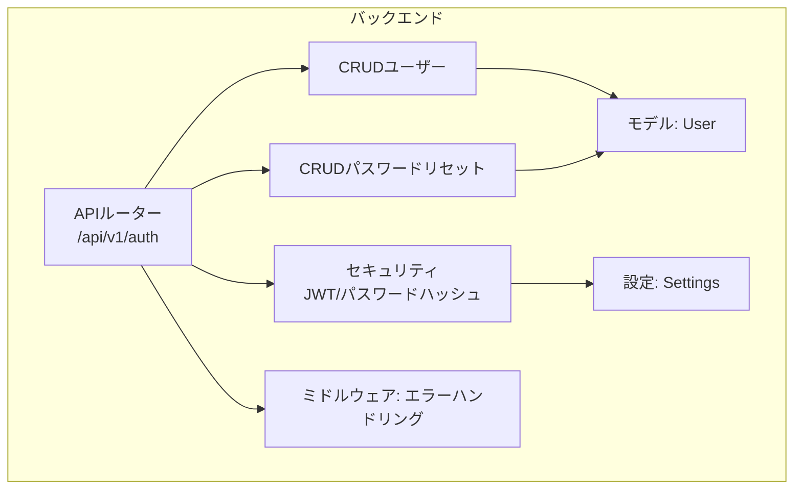
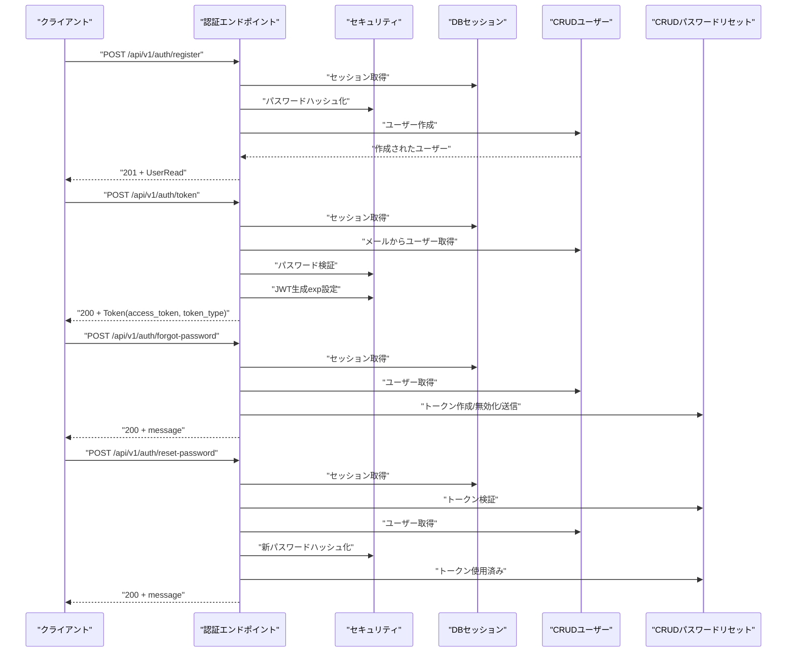
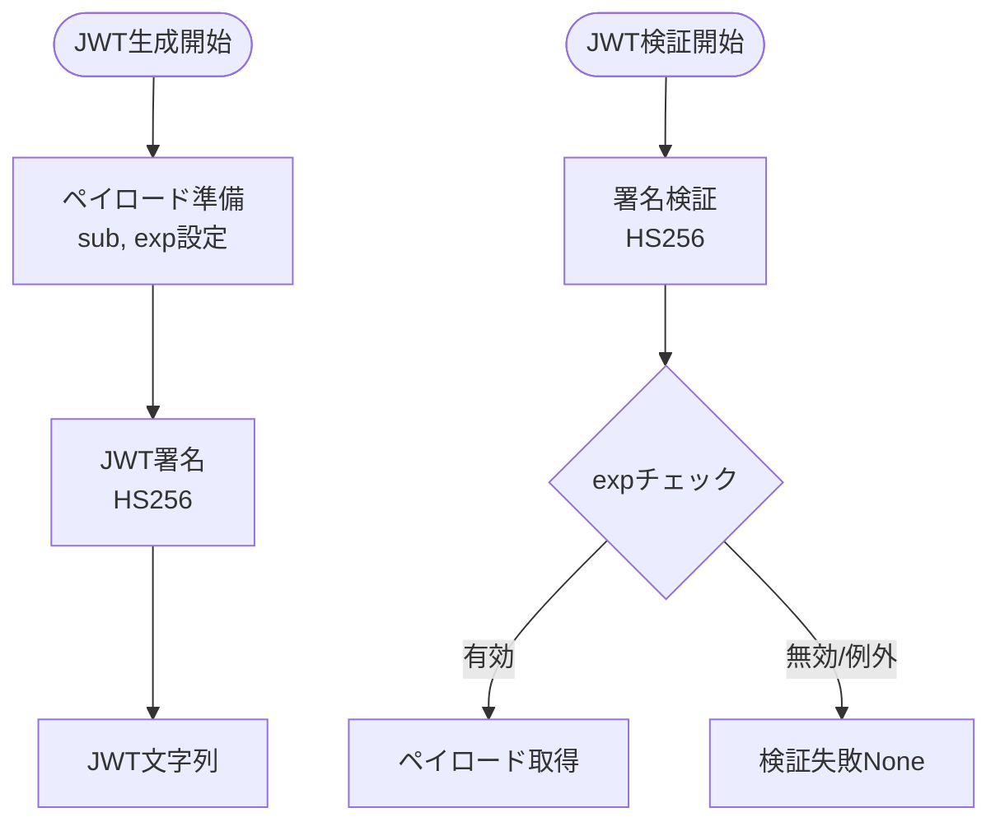
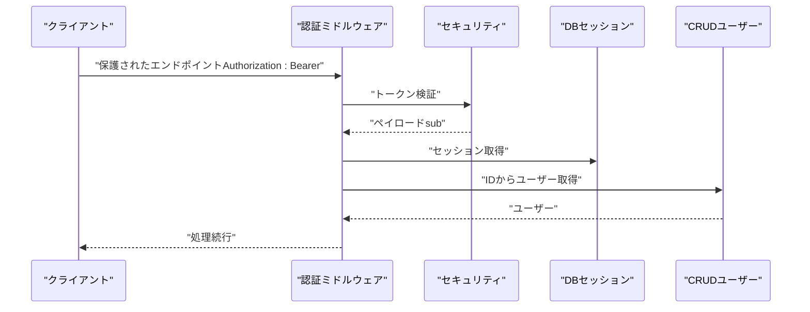
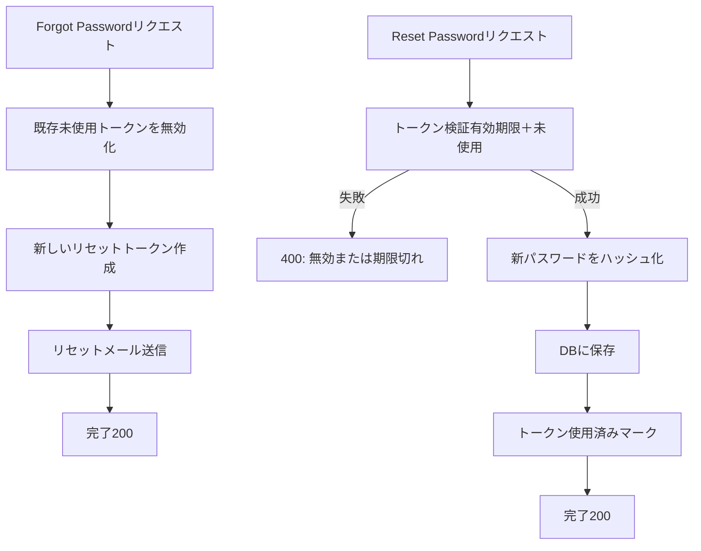
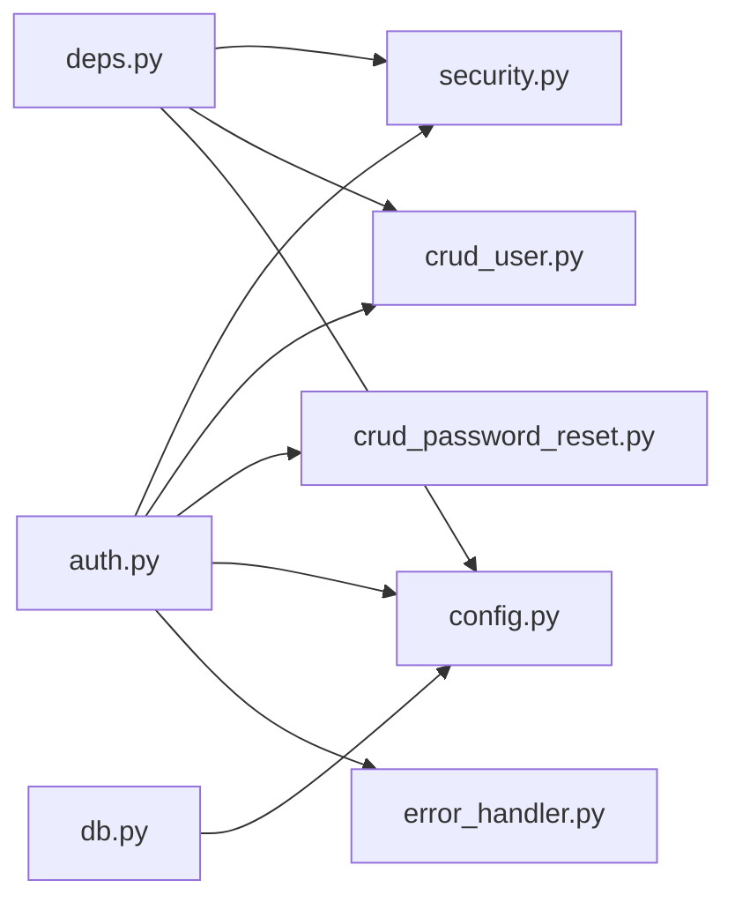

# 認証システム

<cite>
**この文書で参照されているファイル**
- [backend/app/api/api_v1/endpoints/auth.py](file://backend/app/api/api_v1/endpoints/auth.py)
- [backend/app/schemas/auth.py](file://backend/app/schemas/auth.py)
- [backend/app/core/security.py](file://backend/app/core/security.py)
- [backend/app/crud/crud_user.py](file://backend/app/crud/crud_user.py)
- [backend/app/models/user.py](file://backend/app/models/user.py)
- [backend/app/schemas/token.py](file://backend/app/schemas/token.py)
- [backend/app/schemas/user.py](file://backend/app/schemas/user.py)
- [backend/app/core/config.py](file://backend/app/core/config.py)
- [backend/app/middleware/error_handler.py](file://backend/app/middleware/error_handler.py)
- [backend/app/api/api_v1/api.py](file://backend/app/api/api_v1/api.py)
- [backend/app/api/deps.py](file://backend/app/api/deps.py)
- [backend/app/core/db.py](file://backend/app/core/db.py)
- [backend/tests/test_auth.py](file://backend/tests/test_auth.py)
- [backend/app/crud/crud_password_reset.py](file://backend/app/crud/crud_password_reset.py)
- [frontend/src/app/login/page.tsx](file://frontend/src/app/login/page.tsx)
- [frontend/src/app/register/page.tsx](file://frontend/src/app/register/page.tsx)
</cite>

## 目次
1. [導入](#導入)
2. [プロジェクト構造](#プロジェクト構造)
3. [コアコンポーネント](#コアコンポーネント)
4. [アーキテクチャ概要](#アーキテクチャ概要)
5. [詳細コンポーネント分析](#詳細コンポーネント分析)
6. [依存関係分析](#依存関係分析)
7. [パフォーマンス考慮事項](#パフォーマンス考慮事項)
8. [トラブルシューティングガイド](#トラブルシューティングガイド)
9. [結論](#結論)
10. [付録](#付録)

## 導入
本認証システムはJWT（JSON Web Token）ベースの認証を実装しており、以下の機能を提供します：
- ユーザー登録：メールアドレスとパスワードによる新規登録
- ログイン：OAuth2のパスワードフローによるアクセストークン取得
- ログアウト：クライアント側でのトークン破棄（サーバー側には不要）
- パスワードリセット：メール経由のリセットフロー
- 認証ミドルウェア：保護されたエンドポイントへのアクセス制御

本ドキュメントでは、認証エンドポイントのAPI仕様、リクエスト/レスポンススキーマ、JWTトークンの生成と検証プロセス、パスワードハッシュ化、トークンの有効期限管理、認証ミドルウェアの動作原理について詳しく解説します。

## プロジェクト構造
バックエンドはFastAPIフレームワークを用いており、認証に関連する主なモジュールは以下の通りです：
- APIルーター：/api/v1/auth 以下に認証エンドポイントを配置
- セキュリティ：JWTの生成・検証、パスワードハッシュ化
- CRUD：ユーザーおよびパスワードリセットトークンの操作
- モデル：SQLModelによるデータ定義
- 設定：JWTアルゴリズム、シークレットキー、有効期限、レート制限など
- ミドルウェア：エラーハンドリング（バリデーション、HTTP例外、レート制限）

```mermaid
graph TB
subgraph "バックエンド"
API["APIルーター<br/>/api/v1/auth"]
SEC["セキュリティ<br/>JWT/パスワードハッシュ"]
CRUDU["CRUDユーザー"]
CRUDR["CRUDパスワードリセット"]
MODELU["モデル: User"]
CONF["設定: Settings"]
MID["ミドルウェア: エラーハンドリング"]
end
API --> SEC
API --> CRUDU
API --> CRUDR
CRUDU --> MODELU
CRUDR --> MODELU
SEC --> CONF
API --> MID
```

**図の出典**
- [backend/app/api/api_v1/endpoints/auth.py:1-117](file://backend/app/api/api_v1/endpoints/auth.py#L1-L117)
- [backend/app/core/security.py:1-35](file://backend/app/core/security.py#L1-L35)
- [backend/app/crud/crud_user.py:1-28](file://backend/app/crud/crud_user.py#L1-L28)
- [backend/app/crud/crud_password_reset.py:1-56](file://backend/app/crud/crud_password_reset.py#L1-L56)
- [backend/app/models/user.py:1-16](file://backend/app/models/user.py#L1-L16)
- [backend/app/core/config.py:1-91](file://backend/app/core/config.py#L1-L91)
- [backend/app/middleware/error_handler.py:1-149](file://backend/app/middleware/error_handler.py#L1-L149)

**節の出典**
- [backend/app/api/api_v1/api.py:1-8](file://backend/app/api/api_v1/api.py#L1-L8)
- [backend/app/core/config.py:1-91](file://backend/app/core/config.py#L1-L91)

## コアコンポーネント
- 認証ルーター（/api/v1/auth）
  - /register：ユーザー登録（201 Created）
  - /token：アクセストークン取得（200 OK）
  - /forgot-password：パスワードリセットメール送信（200 OK）
  - /reset-password：パスワードリセット（200 OK）
- セキュリティ
  - JWT生成：create_access_token（expを設定、HS256）
  - JWT検証：decode_access_token（例外処理あり）
  - パスワードハッシュ：passlib（argon2）
- CRUD
  - ユーザー：登録時のハッシュ化、メール/IDによる検索
  - パスワードリセット：トークン作成、検証、使用済みフラグ管理
- 認証ミドルウェア
  - OAuth2 Bearerトークンの検証、ユーザーIDの抽出、DBからのユーザー取得

**節の出典**
- [backend/app/api/api_v1/endpoints/auth.py:1-117](file://backend/app/api/api_v1/endpoints/auth.py#L1-L117)
- [backend/app/core/security.py:1-35](file://backend/app/core/security.py#L1-L35)
- [backend/app/crud/crud_user.py:1-28](file://backend/app/crud/crud_user.py#L1-L28)
- [backend/app/crud/crud_password_reset.py:1-56](file://backend/app/crud/crud_password_reset.py#L1-L56)
- [backend/app/api/deps.py:1-37](file://backend/app/api/deps.py#L1-L37)

## アーキテクチャ概要
認証フロー全体の構成は以下の通りです：
- APIエンドポイントはFastAPIのルーターを通じて提供
- 認証ミドルウェア（OAuth2PasswordBearer）により、保護されたエンドポイントにアクセスする前にトークン検証が実施
- JWTの生成・検証はセキュリティモジュールで処理
- DB接続は非同期SQLAlchemyセッションで管理
- エラーハンドリングは共通ミドルウェアで一元化

```mermaid
sequenceDiagram
participant Client as "クライアント"
participant AuthEP as "認証エンドポイント"
participant Security as "セキュリティ"
participant DB as "DBセッション"
participant CRUDU as "CRUDユーザー"
participant CRUDR as "CRUDパスワードリセット"
Client->>AuthEP : "POST /api/v1/auth/register"
AuthEP->>DB : "セッション取得"
AuthEP->>Security : "パスワードハッシュ化"
AuthEP->>CRUDU : "ユーザー作成"
CRUDU-->>AuthEP : "作成されたユーザー"
AuthEP-->>Client : "201 + UserRead"
Client->>AuthEP : "POST /api/v1/auth/token"
AuthEP->>DB : "セッション取得"
AuthEP->>CRUDU : "メールからユーザー取得"
AuthEP->>Security : "パスワード検証"
AuthEP->>Security : "JWT生成exp設定"
AuthEP-->>Client : "200 + Token(access_token, token_type)"
Client->>AuthEP : "POST /api/v1/auth/forgot-password"
AuthEP->>DB : "セッション取得"
AuthEP->>CRUDU : "ユーザー取得"
AuthEP->>CRUDR : "トークン作成/無効化/送信"
AuthEP-->>Client : "200 + message"
Client->>AuthEP : "POST /api/v1/auth/reset-password"
AuthEP->>DB : "セッション取得"
AuthEP->>CRUDR : "トークン検証"
AuthEP->>CRUDU : "ユーザー取得"
AuthEP->>Security : "新パスワードハッシュ化"
AuthEP->>CRUDR : "トークン使用済み"
AuthEP-->>Client : "200 + message"
```

**図の出典**
- [backend/app/api/api_v1/endpoints/auth.py:1-117](file://backend/app/api/api_v1/endpoints/auth.py#L1-L117)
- [backend/app/core/security.py:1-35](file://backend/app/core/security.py#L1-L35)
- [backend/app/crud/crud_user.py:1-28](file://backend/app/crud/crud_user.py#L1-L28)
- [backend/app/crud/crud_password_reset.py:1-56](file://backend/app/crud/crud_password_reset.py#L1-L56)

## 詳細コンポーネント分析

### API仕様とスキーマ
- 認証エンドポイント
  - POST /api/v1/auth/register
    - 要求スキーマ：UserCreate（email, password）
    - 応答スキーマ：UserRead（id, email）
    - 状態コード：201（成功）、400（メール重複）
  - POST /api/v1/auth/token
    - 要求スキーマ：OAuth2パスワードフォーム（username, password）
    - 応答スキーマ：Token（access_token, token_type）
    - 状態コード：200（成功）、401（認証失敗）
  - POST /api/v1/auth/forgot-password
    - 要求スキーマ：ForgotPasswordRequest（email）
    - 応答スキーマ：メッセージ（常に200）
  - POST /api/v1/auth/reset-password
    - 要求スキーマ：ResetPasswordRequest（token, new_password）
    - 応答スキーマ：メッセージ（200）
- 共通スキーマ
  - Token：access_token, token_type
  - UserCreate/UserRead：email（unique, index）、password（登録時のみ）、id（登録後のみ）

**節の出典**
- [backend/app/api/api_v1/endpoints/auth.py:1-117](file://backend/app/api/api_v1/endpoints/auth.py#L1-L117)
- [backend/app/schemas/auth.py:1-11](file://backend/app/schemas/auth.py#L1-L11)
- [backend/app/schemas/token.py:1-10](file://backend/app/schemas/token.py#L1-L10)
- [backend/app/schemas/user.py:1-13](file://backend/app/schemas/user.py#L1-L13)

### JWTトークンの生成と検証プロセス
- 生成
  - トークンペイロードにsub（ユーザーID）を設定
  - exp（有効期限）を現在時刻＋設定値（分）として追加
  - HS256アルゴリズムで署名されたJWTを生成
- 検証
  - 例外（JWTError）を補足し、無効なトークンはNoneを返す
  - FastAPIのOAuth2PasswordBearerにより、Authorization: Bearer トークンが要求される
- 有効期限管理
  - 設定：ACCESS_TOKEN_EXPIRE_MINUTES（分）
  - トークンペイロードにexpを含めるため、期限切れの場合は検証に失敗

```mermaid
flowchart TD
Start(["JWT生成開始"]) --> Prepare["ペイロード準備<br/>sub, exp設定"]
Prepare --> Encode["JWT署名<br/>HS256"]
Encode --> Token["JWT文字列"]
DecodeStart(["JWT検証開始"]) --> Decode["署名検証<br/>HS256"]
Decode --> ExpCheck{"expチェック"}
ExpCheck --> |有効| Payload["ペイロード取得"]
ExpCheck --> |無効/例外| Fail["検証失敗None"]
```

**図の出典**
- [backend/app/core/security.py:17-35](file://backend/app/core/security.py#L17-L35)
- [backend/app/core/config.py:52-53](file://backend/app/core/config.py#L52-L53)

**節の出典**
- [backend/app/core/security.py:1-35](file://backend/app/core/security.py#L1-L35)
- [backend/app/core/config.py:1-91](file://backend/app/core/config.py#L1-L91)
- [backend/app/api/deps.py:1-37](file://backend/app/api/deps.py#L1-L37)

### 認証ミドルウェアの動作原理
- OAuth2PasswordBearer
  - tokenUrlを"/api/v1/auth/token"として設定
  - 保護されたエンドポイントにアクセスする際、Authorization: Bearer トークンが必要
- get_current_user
  - トークンをデコードし、subからユーザーIDを取得
  - UUID形式の検証、DBからユーザーを取得、存在しない場合は401
  - トークンが無効または期限切れの場合、401

```mermaid
sequenceDiagram
participant Client as "クライアント"
participant MW as "認証ミドルウェア"
participant Sec as "セキュリティ"
participant DB as "DBセッション"
participant CRUDU as "CRUDユーザー"
Client->>MW : "保護されたエンドポイントAuthorization : Bearer"
MW->>Sec : "トークン検証"
Sec-->>MW : "ペイロードsub"
MW->>DB : "セッション取得"
MW->>CRUDU : "IDからユーザー取得"
CRUDU-->>MW : "ユーザー"
MW-->>Client : "処理続行"
```

**図の出典**
- [backend/app/api/deps.py:1-37](file://backend/app/api/deps.py#L1-L37)
- [backend/app/core/security.py:29-35](file://backend/app/core/security.py#L29-L35)
- [backend/app/crud/crud_user.py:13-16](file://backend/app/crud/crud_user.py#L13-L16)

**節の出典**
- [backend/app/api/deps.py:1-37](file://backend/app/api/deps.py#L1-L37)

### パスワードハッシュ化
- 使用アルゴリズム：argon2（passlib）
- 登録時：パスワードをハッシュ化して保存
- ログイン時：入力パスワードと保存されたハッシュを比較

**節の出典**
- [backend/app/core/security.py:8-14](file://backend/app/core/security.py#L8-L14)
- [backend/app/crud/crud_user.py:19-22](file://backend/app/crud/crud_user.py#L19-L22)

### パスワードリセットフロー
- トークン作成
  - 既存の未使用トークンを無効化
  - 新しいトークン（生のトークン＋ハッシュ）を作成
- 送信
  - メール送信（宛先：ユーザーのメールアドレス）
- 検証
  - 生のトークンをハッシュ化してDBから取得
  - 有効期限内かつ未使用か確認
- 更新
  - 新しいパスワードをハッシュ化して保存
  - トークンを「使用済み」にマーク

```mermaid
flowchart TD
FP["Forgot Passwordリクエスト"] --> Invalidate["既存未使用トークンを無効化"]
Invalidate --> Create["新しいリセットトークン作成"]
Create --> Send["リセットメール送信"]
Send --> DoneFP["完了200"]
RP["Reset Passwordリクエスト"] --> Verify["トークン検証有効期限＋未使用"]
Verify --> |失敗| Bad["400: 無効または期限切れ"]
Verify --> |成功| Hash["新パスワードをハッシュ化"]
Hash --> Save["DBに保存"]
Save --> Mark["トークン使用済みマーク"]
Mark --> DoneRP["完了200"]
```

**図の出典**
- [backend/app/api/api_v1/endpoints/auth.py:64-116](file://backend/app/api/api_v1/endpoints/auth.py#L64-L116)
- [backend/app/crud/crud_password_reset.py:9-56](file://backend/app/crud/crud_password_reset.py#L9-L56)

**節の出典**
- [backend/app/api/api_v1/endpoints/auth.py:57-116](file://backend/app/api/api_v1/endpoints/auth.py#L57-L116)
- [backend/app/crud/crud_password_reset.py:1-56](file://backend/app/crud/crud_password_reset.py#L1-L56)

### APIエンドポイント詳細

#### POST /api/v1/auth/register
- 処理概要
  - 入力のバリデーション（Pydantic）
  - 既存ユーザーの重複チェック
  - パスワードをハッシュ化し、ユーザーを作成
- 応答
  - 201 Created + UserRead
  - 400 Bad Request（メールアドレス重複）

**節の出典**
- [backend/app/api/api_v1/endpoints/auth.py:19-34](file://backend/app/api/api_v1/endpoints/auth.py#L19-L34)
- [backend/app/crud/crud_user.py:8-27](file://backend/app/crud/crud_user.py#L8-L27)

#### POST /api/v1/auth/token
- 処理概要
  - OAuth2パスワードフォームからメールアドレスとパスワード取得
  - DBからユーザーを取得し、パスワード検証
  - JWTアクセストークンを生成（exp付き）
- 応答
  - 200 OK + Token
  - 401 Unauthorized（認証失敗）

**節の出典**
- [backend/app/api/api_v1/endpoints/auth.py:36-54](file://backend/app/api/api_v1/endpoints/auth.py#L36-L54)
- [backend/app/core/security.py:17-27](file://backend/app/core/security.py#L17-L27)

#### POST /api/v1/auth/forgot-password
- 処理概要
  - 入力メールアドレスに対応するユーザーを検索
  - 既存の未使用トークンを無効化
  - 新しいリセットトークンを作成し、メール送信
- 応答
  - 200 OK + message（ユーザーが存在しても200）

**節の出典**
- [backend/app/api/api_v1/endpoints/auth.py:57-78](file://backend/app/api/api_v1/endpoints/auth.py#L57-L78)
- [backend/app/crud/crud_password_reset.py:40-56](file://backend/app/crud/crud_password_reset.py#L40-L56)

#### POST /api/v1/auth/reset-password
- 処理概要
  - トークンを検証（有効期限＋未使用）
  - 対応するユーザーを取得
  - 新しいパスワードをハッシュ化して保存
  - トークンを「使用済み」にマーク
- 応答
  - 200 OK + message
  - 400 Bad Request（無効または期限切れ）
  - 404 Not Found（ユーザーなし）

**節の出典**
- [backend/app/api/api_v1/endpoints/auth.py:81-116](file://backend/app/api/api_v1/endpoints/auth.py#L81-L116)
- [backend/app/crud/crud_password_reset.py:25-37](file://backend/app/crud/crud_password_reset.py#L25-L37)

### 認証フロントエンド連携
- ログイン画面
  - 入力バリデーション（メールアドレス、パスワード6文字以上）
  - /api/v1/auth/token にOAuth2形式（application/x-www-form-urlencoded）で送信
  - 成功時はホームへ遷移
- 登録画面
  - 入力バリデーション（メールアドレス、パスワード6文字以上）
  - /api/v1/auth/register にJSONで送信
  - 成功時はログイン画面へ遷移

**節の出典**
- [frontend/src/app/login/page.tsx:1-111](file://frontend/src/app/login/page.tsx#L1-L111)
- [frontend/src/app/register/page.tsx:1-112](file://frontend/src/app/register/page.tsx#L1-L112)

## 依存関係分析
- 認証ルーターは、セキュリティ、CRUD、設定、ミドルウェアに依存
- 認証ミドルウェアはセキュリティ（JWT検証）とCRUD（ユーザー取得）に依存
- DBセッションは設定（DATABASE_URL）から取得

```mermaid
graph LR
AuthEP["auth.py"] --> Security["security.py"]
AuthEP --> CRUDU["crud_user.py"]
AuthEP --> CRUDR["crud_password_reset.py"]
AuthEP --> Config["config.py"]
AuthEP --> ErrorHandler["error_handler.py"]
Deps["deps.py"] --> Security
Deps --> CRUDU
Deps --> Config
DB["db.py"] --> Config
```

**図の出典**
- [backend/app/api/api_v1/endpoints/auth.py:1-117](file://backend/app/api/api_v1/endpoints/auth.py#L1-L117)
- [backend/app/core/security.py:1-35](file://backend/app/core/security.py#L1-L35)
- [backend/app/crud/crud_user.py:1-28](file://backend/app/crud/crud_user.py#L1-L28)
- [backend/app/crud/crud_password_reset.py:1-56](file://backend/app/crud/crud_password_reset.py#L1-L56)
- [backend/app/core/config.py:1-91](file://backend/app/core/config.py#L1-L91)
- [backend/app/middleware/error_handler.py:1-149](file://backend/app/middleware/error_handler.py#L1-L149)
- [backend/app/api/deps.py:1-37](file://backend/app/api/deps.py#L1-L37)
- [backend/app/core/db.py:1-17](file://backend/app/core/db.py#L1-L17)

**節の出典**
- [backend/app/api/api_v1/endpoints/auth.py:1-117](file://backend/app/api/api_v1/endpoints/auth.py#L1-L117)
- [backend/app/api/deps.py:1-37](file://backend/app/api/deps.py#L1-L37)
- [backend/app/core/db.py:1-17](file://backend/app/core/db.py#L1-L17)

## パフォーマンス考慮事項
- JWTの検証は軽量だが、頻繁な認証エンドポイント呼び出しにはレート制限を活用
- DB検索（メール/ID）はインデックス付き（email: unique+index）により高速化
- 非同期DBセッション（asyncpg）によるI/O並列化
- トークン有効期限の短縮（ACCESS_TOKEN_EXPIRE_MINUTES）はセキュリティ向上に寄与

[この節は一般的なガイダンスであり、特定ファイルの解析を伴わない]

## トラブルシューティングガイド
- 認証エラー（401 Unauthorized）
  - トークン形式が不正（Bearer指定漏れ、無効なJWT）
  - トークンのsubがUUID形式でない
  - DBに該当ユーザーが存在しない
- トークン検証失敗
  - 期限切れ（exp超過）
  - 署名アルゴリズム/シークレットキー不一致
- レート制限超過（429 Too Many Requests）
  - 認証系エンドポイントの呼び出し回数が設定値を超えた場合
- その他のエラー
  - 400/404/422などのHTTP例外は共通エラーハンドラーにより整形されて返却

**節の出典**
- [backend/app/api/deps.py:13-36](file://backend/app/api/deps.py#L13-L36)
- [backend/app/middleware/error_handler.py:52-148](file://backend/app/middleware/error_handler.py#L52-L148)

## 結論
本認証システムは、FastAPI＋JWT＋非同期DB＋レート制限＋共通エラーハンドリングにより堅牢な認証基盤を提供しています。ユーザー登録、ログイン、パスワードリセット、認証ミドルウェアの各フローにおいて、セキュリティ（argon2、HS256、exp）と可用性（非同期DB、レート制限）をバランスよく考慮しています。

[この節は要約であり、特定ファイルの解析を伴わない]

## 付録

### 設定項目（重要）
- SECRET_KEY：JWT署名用シークレット
- ALGORITHM：JWTアルゴリズム（HS256）
- ACCESS_TOKEN_EXPIRE_MINUTES：アクセストークン有効期限（分）
- RATE_LIMIT_*：各エンドポイントのレート制限設定
- FRONTEND_URL：パスワードリセットリンクのベースURL
- RESET_TOKEN_EXPIRE_HOURS：パスワードリセットトークン有効期限（時間）

**節の出典**
- [backend/app/core/config.py:51-83](file://backend/app/core/config.py#L51-L83)

### APIテスト（参考）
- /api/v1/auth/register：201 + UserRead
- /api/v1/auth/register（重複）：400
- /api/v1/auth/token：200 + Token
- /api/v1/auth/token（無効認証情報）：401

**節の出典**
- [backend/tests/test_auth.py:1-66](file://backend/tests/test_auth.py#L1-L66)