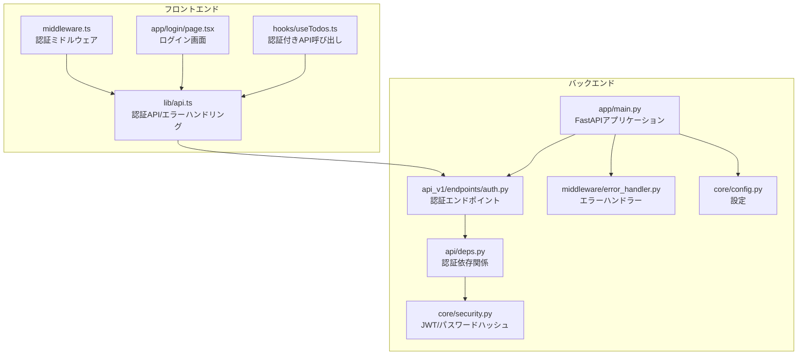
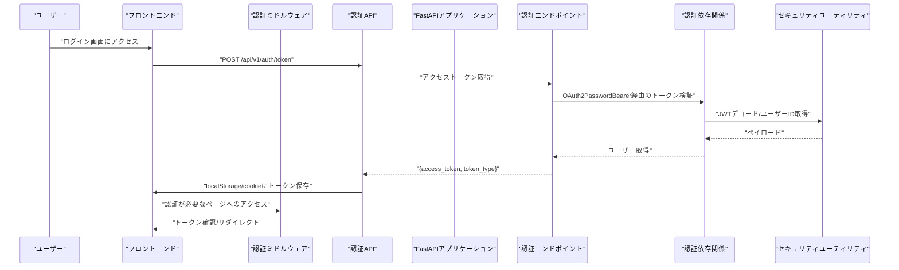
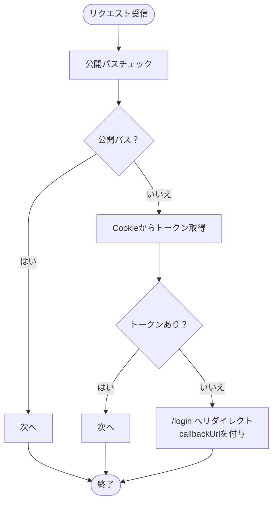
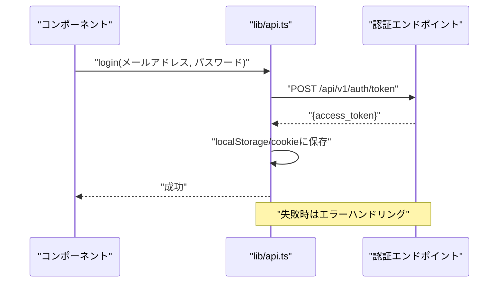
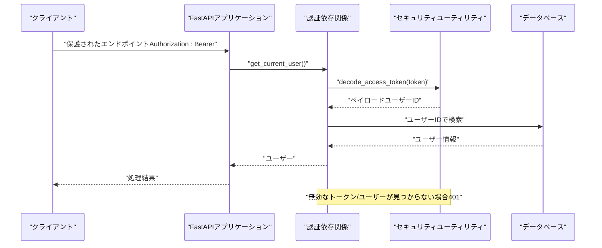
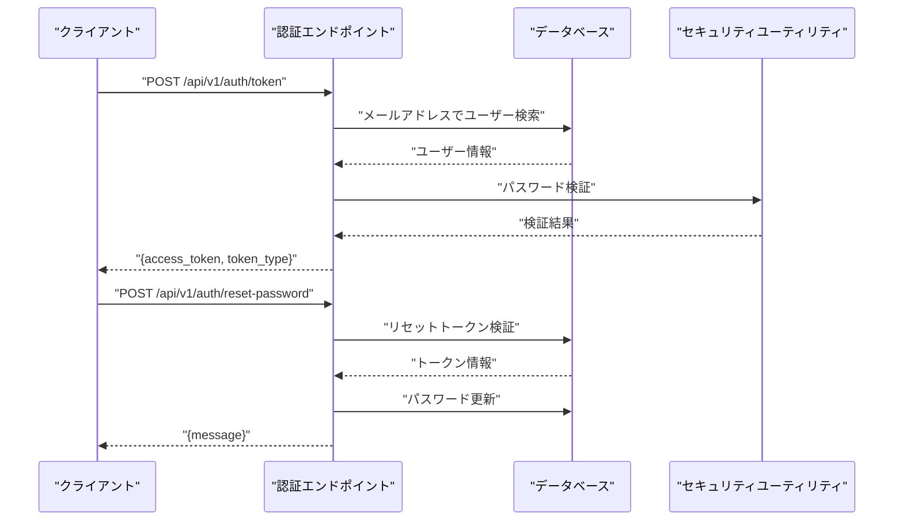
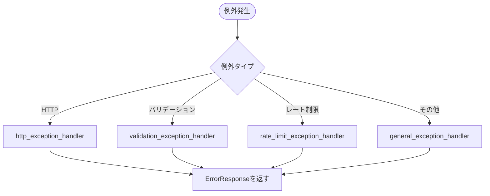
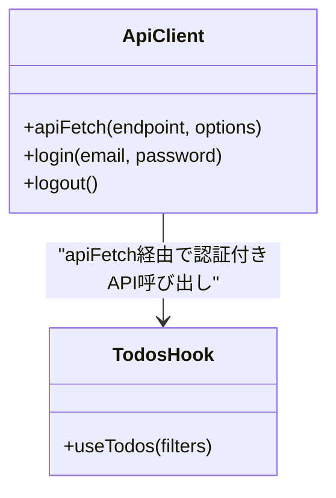
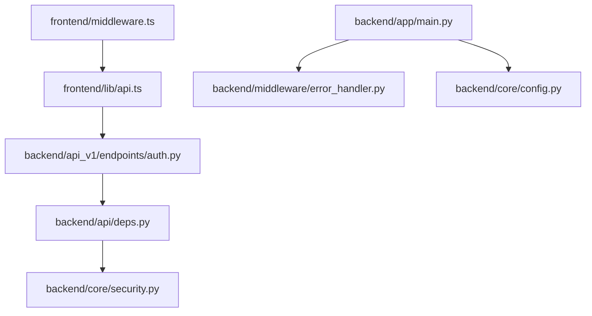

# 認証ミドルウェア

<cite>
**本文で参照するファイル**
- [frontend/src/middleware.ts](file://frontend/src/middleware.ts)
- [backend/app/middleware/error_handler.py](file://backend/app/middleware/error_handler.py)
- [backend/app/api/api_v1/endpoints/auth.py](file://backend/app/api/api_v1/endpoints/auth.py)
- [backend/app/api/deps.py](file://backend/app/api/deps.py)
- [backend/app/core/security.py](file://backend/app/core/security.py)
- [backend/app/schemas/token.py](file://backend/app/schemas/token.py)
- [backend/app/schemas/error.py](file://backend/app/schemas/error.py)
- [backend/app/core/config.py](file://backend/app/core/config.py)
- [backend/app/main.py](file://backend/app/main.py)
- [frontend/src/lib/api.ts](file://frontend/src/lib/api.ts)
- [frontend/src/app/login/page.tsx](file://frontend/src/app/login/page.tsx)
- [frontend/src/hooks/useTodos.ts](file://frontend/src/hooks/useTodos.ts)
</cite>

## 目次
1. [はじめに](#はじめに)
2. [プロジェクト構造](#プロジェクト構造)
3. [コアコンポーネント](#コアコンポーネント)
4. [アーキテクチャ概観](#アーキテクチャ概観)
5. [詳細コンポーネント解析](#詳細コンポーネント解析)
6. [依存関係解析](#依存関係解析)
7. [パフォーマンス考慮](#パフォーマンス考慮)
8. [トラブルシューティングガイド](#トラブルシューティングガイド)
9. [結論](#結論)
10. [付録](#付録)

## はじめに
本ドキュメントは、Todoアプリケーションにおける認証ミドルウェアの仕様と実装を網羅的に解説します。フロントエンドの認証状態管理、リダイレクト処理、エラーページ表示、バックエンドのトークン検証プロセス、認証エラーハンドリング、アクセス制御の仕組みについて詳しく説明します。さらに、認証ミドルウェアのカスタマイズ方法やエラーレスポンスのフォーマットについても解説します。

## プロジェクト構造
認証に関連する主な場所は以下の通りです：
- フロントエンド：Next.jsのミドルウェア、認証API、UIコンポーネント
- バックエンド：FastAPIアプリケーション、認証エンドポイント、ミドルウェア、セキュリティユーティリティ

**図の出典**
- [frontend/src/middleware.ts:1-35](file://frontend/src/middleware.ts#L1-L35)
- [frontend/src/lib/api.ts:1-113](file://frontend/src/lib/api.ts#L1-L113)
- [frontend/src/app/login/page.tsx:1-111](file://frontend/src/app/login/page.tsx#L1-L111)
- [frontend/src/hooks/useTodos.ts:1-119](file://frontend/src/hooks/useTodos.ts#L1-L119)
- [backend/app/main.py:1-168](file://backend/app/main.py#L1-L168)
- [backend/app/api/api_v1/endpoints/auth.py:1-117](file://backend/app/api/api_v1/endpoints/auth.py#L1-L117)
- [backend/app/api/deps.py:1-37](file://backend/app/api/deps.py#L1-L37)
- [backend/app/core/security.py:1-35](file://backend/app/core/security.py#L1-L35)
- [backend/app/middleware/error_handler.py:1-149](file://backend/app/middleware/error_handler.py#L1-L149)
- [backend/app/core/config.py:1-91](file://backend/app/core/config.py#L1-L91)

**節の出典**
- [frontend/src/middleware.ts:1-35](file://frontend/src/middleware.ts#L1-L35)
- [backend/app/main.py:1-168](file://backend/app/main.py#L1-L168)

## コアコンポーネント
- 認証ミドルウェア（フロントエンド）
  - 公開パス（ログイン、登録、パスワードリセット関連）を除外し、それ以外のリクエストに対してトークンの存在を確認。トークンがなければログインページへリダイレクトし、元のURLをクエリパラメータとして保持。
- 認証API（フロントエンド）
  - OAuth2 Password Flowに対応した認証エンドポイントを呼び出し、JWTアクセストークンを取得。成功時はlocalStorageとcookieに保存。
- トークン検証（バックエンド）
  - JWTアクセストークンをデコードし、ユーザーIDからDBからユーザーを取得。無効なトークンや存在しないユーザーに対して401エラーを返す。
- エラーハンドリング（バックエンド）
  - すべてのHTTP例外、バリデーションエラー、一般例外、レート制限超過に対して統一フォーマットのエラーレスポンスを返す。
- 認証エンドポイント（バックエンド）
  - ユーザー登録、アクセストークン取得、パスワードリセットメール送信、パスワードリセットを提供。

**節の出典**
- [frontend/src/middleware.ts:1-35](file://frontend/src/middleware.ts#L1-L35)
- [frontend/src/lib/api.ts:1-113](file://frontend/src/lib/api.ts#L1-L113)
- [backend/app/api/deps.py:1-37](file://backend/app/api/deps.py#L1-L37)
- [backend/app/middleware/error_handler.py:1-149](file://backend/app/middleware/error_handler.py#L1-L149)
- [backend/app/api/api_v1/endpoints/auth.py:1-117](file://backend/app/api/api_v1/endpoints/auth.py#L1-L117)

## アーキテクチャ概観
認証フローはフロントエンドのミドルウェアとバックエンドの認証エンドポイント、依存関係、セキュリティユーティリティを通じて構成されます。エラーハンドリングは共通のスキーマに従って統一されており、設定は環境変数から読み込まれます。

**図の出典**
- [frontend/src/middleware.ts:1-35](file://frontend/src/middleware.ts#L1-L35)
- [frontend/src/lib/api.ts:1-113](file://frontend/src/lib/api.ts#L1-L113)
- [backend/app/api/api_v1/endpoints/auth.py:1-117](file://backend/app/api/api_v1/endpoints/auth.py#L1-L117)
- [backend/app/api/deps.py:1-37](file://backend/app/api/deps.py#L1-L37)
- [backend/app/core/security.py:1-35](file://backend/app/core/security.py#L1-L35)

## 詳細コンポーネント解析

### 認証ミドルウェア（フロントエンド）
- 機能
  - 公開パス（ログイン、登録、パスワードリセット関連）を除外。
  - トークンの存在を確認（cookieまたはlocalStorage）。存在しない場合はログインページへリダイレクトし、元のURLをcallbackUrlとして渡す。
  - 実行対象パスをmatcherで指定。
- トークンの保存
  - 認証成功後、localStorageにJWTアクセストークンを保存。
  - cookieにも同様のトークンを保存（HTTPS環境ではSecure属性を付与）。

**図の出典**
- [frontend/src/middleware.ts:1-35](file://frontend/src/middleware.ts#L1-L35)

**節の出典**
- [frontend/src/middleware.ts:1-35](file://frontend/src/middleware.ts#L1-L35)
- [frontend/src/lib/api.ts:1-113](file://frontend/src/lib/api.ts#L1-L113)

### 認証API（フロントエンド）
- 機能
  - OAuth2 Password Flowに対応した認証エンドポイントを呼び出し、JWTアクセストークンを取得。
  - 成功時はlocalStorageにアクセストークンを保存し、cookieにも保存（HTTPS環境ではSecure属性を付与）。
  - 失敗時はエラーメッセージをtoastで表示し、ApiErrorをthrow。
- トークンの使用
  - 以降のAPIリクエストにはAuthorization: Bearerヘッダーとして送信。

**図の出典**
- [frontend/src/lib/api.ts:1-113](file://frontend/src/lib/api.ts#L1-L113)
- [frontend/src/app/login/page.tsx:1-111](file://frontend/src/app/login/page.tsx#L1-L111)

**節の出典**
- [frontend/src/lib/api.ts:1-113](file://frontend/src/lib/api.ts#L1-L113)
- [frontend/src/app/login/page.tsx:1-111](file://frontend/src/app/login/page.tsx#L1-L111)

### トークン検証（バックエンド）
- 機能
  - OAuth2PasswordBearerにより、Authorization: Bearerヘッダーからトークンを取得。
  - JWTをデコードし、ペイロードからユーザーIDを取得。
  - UUID形式のユーザーIDが妥当か検証し、DBからユーザーを取得。
  - 存在しないユーザーまたは無効なトークンに対して401エラーを返す。

**図の出典**
- [backend/app/api/deps.py:1-37](file://backend/app/api/deps.py#L1-L37)
- [backend/app/core/security.py:1-35](file://backend/app/core/security.py#L1-L35)

**節の出典**
- [backend/app/api/deps.py:1-37](file://backend/app/api/deps.py#L1-L37)
- [backend/app/core/security.py:1-35](file://backend/app/core/security.py#L1-L35)

### 認証エンドポイント（バックエンド）
- 機能
  - ユーザー登録：既存ユーザーの場合は400エラー。
  - アクセストークン取得：メールアドレスとパスワードを検証し、JWTアクセストークンを発行。
  - パスワードリセット：リセットメールを送信（ユーザーが存在しても200を返す）、トークンをDBに保存。
  - パスワードリセット：トークンを検証し、新しいパスワードを設定。

**図の出典**
- [backend/app/api/api_v1/endpoints/auth.py:1-117](file://backend/app/api/api_v1/endpoints/auth.py#L1-L117)
- [backend/app/core/security.py:1-35](file://backend/app/core/security.py#L1-L35)

**節の出典**
- [backend/app/api/api_v1/endpoints/auth.py:1-117](file://backend/app/api/api_v1/endpoints/auth.py#L1-L117)

### エラーハンドリング（バックエンド）
- 機能
  - HTTP例外、バリデーションエラー、一般例外、レート制限超過に対して統一フォーマットのErrorResponseを返す。
  - 各例外に対応する日本語メッセージを提供。
  - 例外発生時のロギングを実施。

**図の出典**
- [backend/app/middleware/error_handler.py:1-149](file://backend/app/middleware/error_handler.py#L1-L149)
- [backend/app/schemas/error.py:1-23](file://backend/app/schemas/error.py#L1-L23)

**節の出典**
- [backend/app/middleware/error_handler.py:1-149](file://backend/app/middleware/error_handler.py#L1-L149)
- [backend/app/schemas/error.py:1-23](file://backend/app/schemas/error.py#L1-L23)

### 認証状態管理（フロントエンド）
- 機能
  - localStorageとcookieにJWTアクセストークンを保存。
  - 以降のAPIリクエストにはAuthorization: Bearerヘッダーとして送信。
  - ログアウト時はlocalStorageとcookieからトークンを削除。
- 依存関係
  - useTodosフックがapiFetch経由で認証付きAPIを呼び出す。

**図の出典**
- [frontend/src/lib/api.ts:1-113](file://frontend/src/lib/api.ts#L1-L113)
- [frontend/src/hooks/useTodos.ts:1-119](file://frontend/src/hooks/useTodos.ts#L1-L119)

**節の出典**
- [frontend/src/lib/api.ts:1-113](file://frontend/src/lib/api.ts#L1-L113)
- [frontend/src/hooks/useTodos.ts:1-119](file://frontend/src/hooks/useTodos.ts#L1-L119)

## 依存関係解析
- 認証ミドルウェア
  - 公開パスの定義、リダイレクト先、matcherの設定。
- 認証API
  - 認証エンドポイント、トークン保存、エラーハンドリング。
- トークン検証
  - OAuth2PasswordBearer、JWTデコード、DBからのユーザー取得。
- エラーハンドリング
  - 例外ハンドラーの登録、ErrorResponseスキーマ、設定によるメッセージマッピング。
- 認証エンドポイント
  - CRUD、パスワードリセット、レートリミット。

**図の出典**
- [frontend/src/middleware.ts:1-35](file://frontend/src/middleware.ts#L1-L35)
- [frontend/src/lib/api.ts:1-113](file://frontend/src/lib/api.ts#L1-L113)
- [backend/app/api/api_v1/endpoints/auth.py:1-117](file://backend/app/api/api_v1/endpoints/auth.py#L1-L117)
- [backend/app/api/deps.py:1-37](file://backend/app/api/deps.py#L1-L37)
- [backend/app/core/security.py:1-35](file://backend/app/core/security.py#L1-L35)
- [backend/app/main.py:1-168](file://backend/app/main.py#L1-L168)
- [backend/app/middleware/error_handler.py:1-149](file://backend/app/middleware/error_handler.py#L1-L149)
- [backend/app/core/config.py:1-91](file://backend/app/core/config.py#L1-L91)

**節の出典**
- [backend/app/main.py:1-168](file://backend/app/main.py#L1-L168)
- [backend/app/core/config.py:1-91](file://backend/app/core/config.py#L1-L91)

## パフォーマンス考慮
- トークンの検証はJWTデコードのみで行うため、DBアクセスは必要最小限に抑えられている。
- 認証エンドポイントにはレートリミットが適用されている。
- 例外発生時のロギングは軽量で、エラーレスポンスの生成はJSONシリアライズのみ。

## トラブルシューティングガイド
- 401エラー（認証失敗）
  - 無効なトークン、ユーザーが存在しない、ペイロードにユーザーIDが含まれない場合。
  - 対策：再ログインし、トークンを再発行。
- 403エラー（権限不足）
  - トークンはあるが、アクセス権限がない場合。
  - 対策：適切な権限を持つアカウントでログイン。
- 429エラー（レート制限超過）
  - 認証エンドポイントに対するリクエストが多すぎる場合。
  - 対策：一定時間待ってから再度お試しください。
- 500エラー（サーバー内部エラー）
  - 予期しないエラーが発生した場合。
  - 対策：時間を置いてから再度お試しください。必要に応じて管理者に連絡。

**節の出典**
- [backend/app/middleware/error_handler.py:1-149](file://backend/app/middleware/error_handler.py#L1-L149)
- [backend/app/api/deps.py:1-37](file://backend/app/api/deps.py#L1-L37)

## 結論
本認証ミドルウェアは、フロントエンドの認証状態管理、リダイレクト処理、エラーページ表示、バックエンドのJWTベースのトークン検証、統一エラーレスポンスフォーマットを組み合わせて、堅牢かつユーザーフレンドリーな認証を実現しています。設定ファイルを介したカスタマイズが可能であり、レートリミットやエラーハンドリングを通じて運用の安定性を高めています。

## 付録
- 認証ミドルウェアのカスタマイズ方法
  - 公開パスの追加/変更：frontend/src/middleware.tsのpublicPathsを編集。
  - 実行対象パスの変更：matcherの正規表現を調整。
  - トークンの保存方法の変更：frontend/src/lib/api.tsのlocalStorage/cookie保存ロジックを修正。
- エラーレスポンスのフォーマット
  - 共通スキーマ：backend/app/schemas/error.pyのErrorResponse。
  - 例外ハンドラー：backend/app/middleware/error_handler.pyの各ハンドラー。
- 設定
  - 環境変数による設定：backend/app/core/config.py。
  - トークンの有効期限、アルゴリズム、レートリミットなどが定義されている。

**節の出典**
- [frontend/src/middleware.ts:1-35](file://frontend/src/middleware.ts#L1-L35)
- [frontend/src/lib/api.ts:1-113](file://frontend/src/lib/api.ts#L1-L113)
- [backend/app/schemas/error.py:1-23](file://backend/app/schemas/error.py#L1-L23)
- [backend/app/middleware/error_handler.py:1-149](file://backend/app/middleware/error_handler.py#L1-L149)
- [backend/app/core/config.py:1-91](file://backend/app/core/config.py#L1-L91)