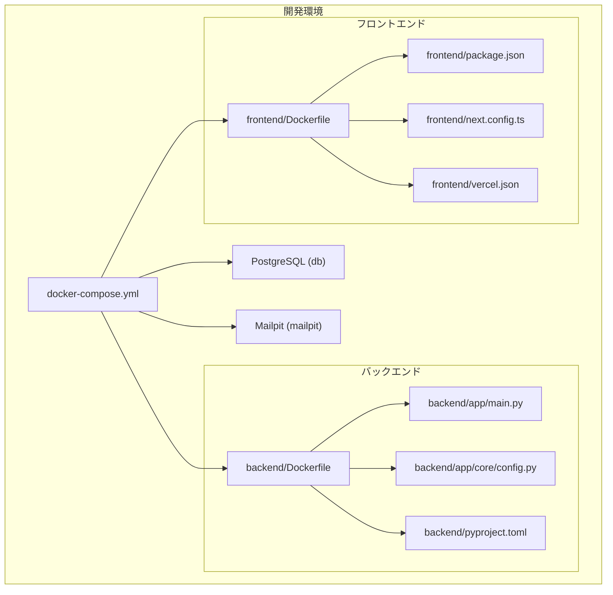
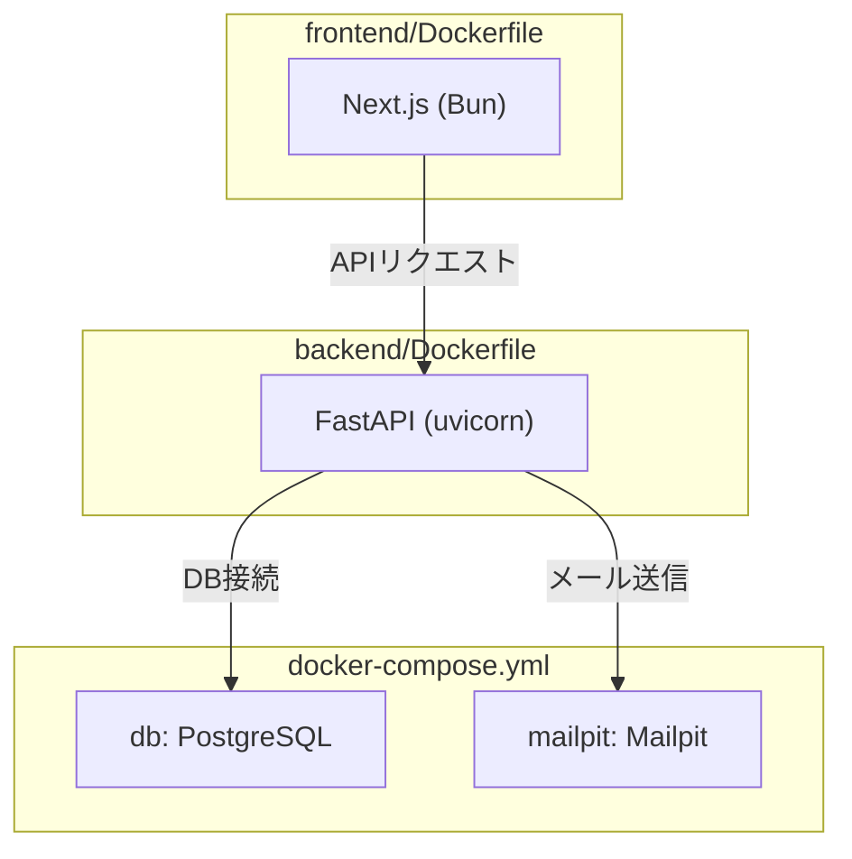
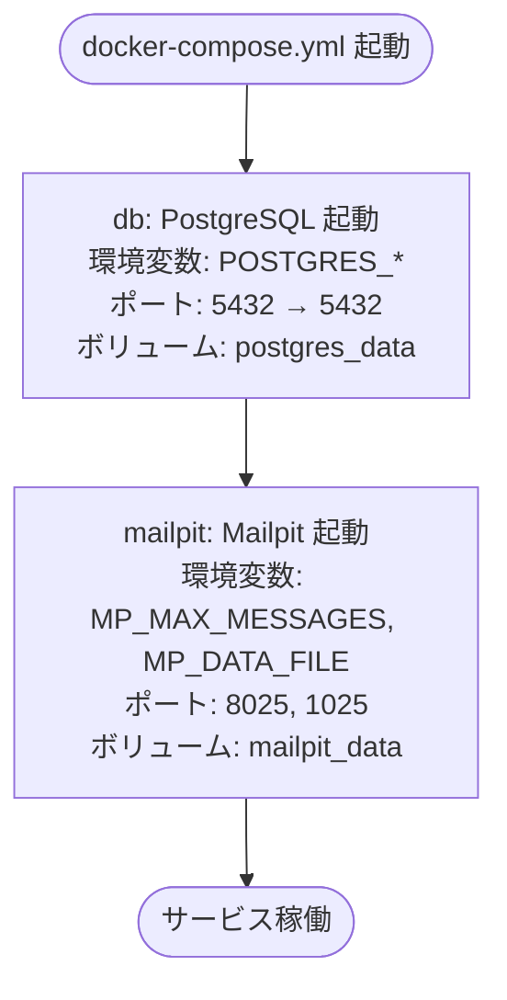
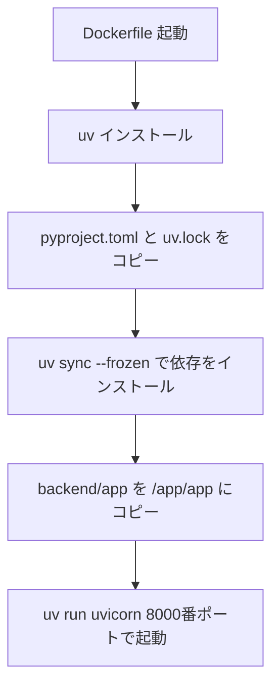
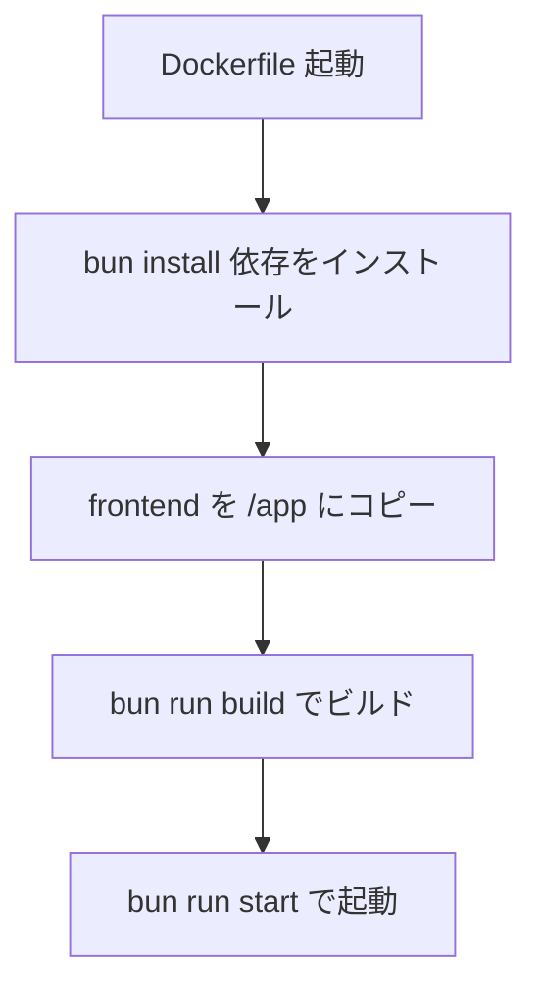
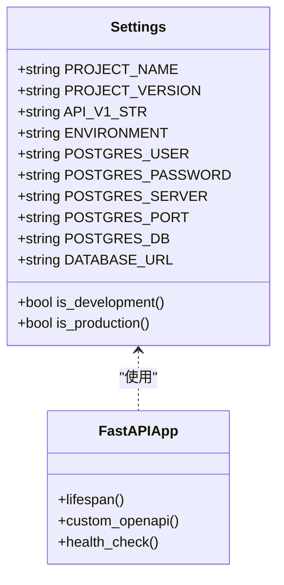
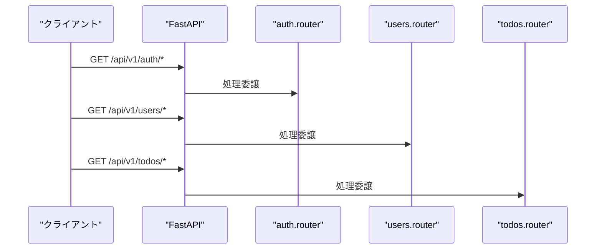
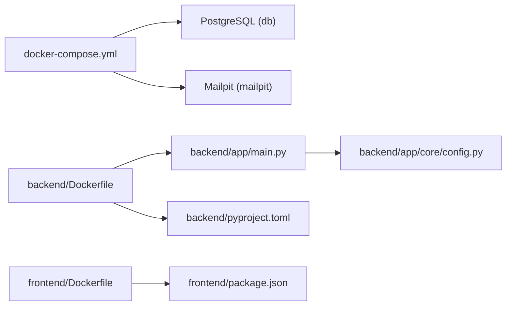

# コンテナ管理

<cite>
**本文で参照するファイル一覧**
- [docker-compose.yml](file://docker-compose.yml)
- [backend/Dockerfile](file://docker/backend/Dockerfile)
- [frontend/Dockerfile](file://docker/frontend/Dockerfile)
- [backend/main.py](file://backend/app/main.py)
- [backend/app/core/config.py](file://backend/app/core/config.py)
- [backend/pyproject.toml](file://backend/pyproject.toml)
- [frontend/package.json](file://frontend/package.json)
- [frontend/next.config.ts](file://frontend/next.config.ts)
- [frontend/vercel.json](file://frontend/vercel.json)
</cite>

## 目次
1. [はじめに](#はじめに)
2. [プロジェクト構造](#プロジェクト構造)
3. [コアコンポーネント](#コアコンポーネント)
4. [アーキテクチャ概要](#アーキテクチャ概要)
5. [詳細コンポーネント分析](#詳細コンポーネント分析)
6. [依存関係分析](#依存関係分析)
7. [パフォーマンス考慮事項](#パフォーマンス考慮事項)
8. [トラブルシューティングガイド](#トラブルシューティングガイド)
9. [結論](#結論)
10. [付録](#付録)

## はじめに
本ドキュメントは、Dockerコンテナによる開発環境管理の詳細な手順を提供します。具体的には、docker-compose.ymlでのサービス定義、バックエンド（FastAPI）とフロントエンド（Next.js/Bun）のDockerfile設定、コンテナ間の通信、ボリュームマウント、環境変数の設定方法について解説します。さらに、コンテナの起動・停止・再起動、ログの確認、トラブルシューティングの手順も網羅的に示します。

## プロジェクト構造
本プロジェクトは、バックエンド（Python/PostgreSQL/Mailpit）、フロントエンド（Next.js/Bun）をそれぞれDockerコンテナとして管理し、docker-compose.ymlで統合的に起動・停止・通信を制御しています。ボリュームマウントにより、データ永続化（PostgreSQL、Mailpit）が実現されています。

**図の出典**
- [docker-compose.yml:1-29](file://docker-compose.yml#L1-L29)
- [backend/Dockerfile:1-10](file://docker/backend/Dockerfile#L1-L10)
- [frontend/Dockerfile:1-8](file://docker/frontend/Dockerfile#L1-L8)
- [backend/app/main.py:1-168](file://backend/app/main.py#L1-L168)
- [backend/app/core/config.py:1-42](file://backend/app/core/config.py#L1-L42)
- [backend/pyproject.toml:1-51](file://backend/pyproject.toml#L1-L51)
- [frontend/package.json:1-65](file://frontend/package.json#L1-L65)
- [frontend/next.config.ts:1-8](file://frontend/next.config.ts#L1-L8)
- [frontend/vercel.json:1-17](file://frontend/vercel.json#L1-L17)

**節の出典**
- [docker-compose.yml:1-29](file://docker-compose.yml#L1-L29)
- [backend/Dockerfile:1-10](file://docker/backend/Dockerfile#L1-L10)
- [frontend/Dockerfile:1-8](file://docker/frontend/Dockerfile#L1-L8)

## コアコンポーネント
- docker-compose.yml：PostgreSQL（db）、Mailpit（mailpit）のサービス定義、ポートマッピング、ボリュームマウント、環境変数を管理。
- backend/Dockerfile：Python 3.10 slimイメージ、uvパッケージマネージャー、FastAPIアプリケーションのビルド・実行。
- frontend/Dockerfile：Bunランタイム、依存パッケージインストール、ビルド、起動コマンド。
- backend/app/main.py：FastAPIアプリケーションの起動、CORS、ロギング、ルーティング、ヘルスチェック。
- backend/app/core/config.py：設定クラス（Settings）による環境変数の定義・上書き、DB接続URL生成。
- backend/pyproject.toml：依存ライブラリ定義、テスト設定、カバレッジ設定。
- frontend/package.json：Next.jsの開発・ビルド・テスト・E2Eコマンド定義。
- frontend/next.config.ts：Next.jsの設定（空テンプレート）。
- frontend/vercel.json：Vercelへのデプロイ設定（開発・本番共通）。

**節の出典**
- [docker-compose.yml:1-29](file://docker-compose.yml#L1-L29)
- [backend/Dockerfile:1-10](file://docker/backend/Dockerfile#L1-L10)
- [frontend/Dockerfile:1-8](file://docker/frontend/Dockerfile#L1-L8)
- [backend/app/main.py:1-168](file://backend/app/main.py#L1-L168)
- [backend/app/core/config.py:1-42](file://backend/app/core/config.py#L1-L42)
- [backend/pyproject.toml:1-51](file://backend/pyproject.toml#L1-L51)
- [frontend/package.json:1-65](file://frontend/package.json#L1-L65)
- [frontend/next.config.ts:1-8](file://frontend/next.config.ts#L1-L8)
- [frontend/vercel.json:1-17](file://frontend/vercel.json#L1-L17)

## アーキテクチャ概要
docker-compose.ymlで定義されたサービス群は、以下の通りです：
- db（PostgreSQL 16-alpine）
  - 環境変数：POSTGRES_USER、POSTGRES_PASSWORD、POSTGRES_DB
  - ポート：5432（ホスト:コンテナ）
  - ボリューム：postgres_data（データ永続化）
- mailpit（Mailpit）
  - 環境変数：MP_MAX_MESSAGES、MP_DATA_FILE
  - ポート：8025（Web UI）、1025（SMTP）
  - ボリューム：mailpit_data（メッセージデータ永続化）

バックエンド（FastAPI）は、コンテナ内にuvで依存をインストールし、uvicornで8000番ポートで起動します。フロントエンド（Next.js）はBunでビルド・起動します。開発時は、docker-compose.ymlでdbとmailpitを起動し、バックエンド/フロントエンドはコンテナ内で動作させます。

**図の出典**
- [docker-compose.yml:1-29](file://docker-compose.yml#L1-L29)
- [backend/Dockerfile:1-10](file://docker/backend/Dockerfile#L1-L10)
- [frontend/Dockerfile:1-8](file://docker/frontend/Dockerfile#L1-L8)

## 詳細コンポーネント分析

### docker-compose.yml（サービス定義・通信・ボリューム）
- dbサービス
  - イメージ：postgres:16-alpine
  - 環境変数：POSTGRES_USER、POSTGRES_PASSWORD、POSTGRES_DB
  - ポートマッピング：5432（ホスト:コンテナ）
  - ボリューム：postgres_data（/var/lib/postgresql/data）
- mailpitサービス
  - イメージ：axllent/mailpit:latest
  - 環境変数：MP_MAX_MESSAGES、MP_DATA_FILE
  - ポートマッピング：8025（Web UI）、1025（SMTP）
  - ボリューム：mailpit_data（/data）
- 独自ボリューム定義：postgres_data、mailpit_data

**図の出典**
- [docker-compose.yml:1-29](file://docker-compose.yml#L1-L29)

**節の出典**
- [docker-compose.yml:1-29](file://docker-compose.yml#L1-L29)

### backend/Dockerfile（Python/uv/Uvicorn）
- 基底イメージ：python:3.10-slim-bookworm
- uvインストール：ghcr.io/astral-sh/uv:latest
- 依存インストール：uv sync --frozen（pyproject.toml、uv.lock）
- コピー：backend/app → /app/app
- 実行：uv run uvicorn app.main:app --host 0.0.0.0 --port 8000

**図の出典**
- [backend/Dockerfile:1-10](file://docker/backend/Dockerfile#L1-L10)
- [backend/pyproject.toml:1-51](file://backend/pyproject.toml#L1-L51)

**節の出典**
- [backend/Dockerfile:1-10](file://docker/backend/Dockerfile#L1-L10)
- [backend/pyproject.toml:1-51](file://backend/pyproject.toml#L1-L51)

### frontend/Dockerfile（Bun/Next.js）
- 基底イメージ：oven/bun:latest
- 依存インストール：bun install（package.json、bun.lock）
- コピー：frontend 以下を /app にコピー
- ビルド：bun run build
- 実行：bun run start

**図の出典**
- [frontend/Dockerfile:1-8](file://docker/frontend/Dockerfile#L1-L8)
- [frontend/package.json:1-65](file://frontend/package.json#L1-L65)

**節の出典**
- [frontend/Dockerfile:1-8](file://docker/frontend/Dockerfile#L1-L8)
- [frontend/package.json:1-65](file://frontend/package.json#L1-L65)

### 設定（Settings）とDB接続
- backend/app/core/config.py
  - Settingsクラス：PROJECT_NAME、PROJECT_VERSION、API_V1_STR、ENVIRONMENT
  - DB関連：POSTGRES_USER、POSTGRES_PASSWORD、POSTGRES_SERVER、POSTGRES_PORT、POSTGRES_DB
  - DATABASE_URL：環境変数から上書き可能
- backend/app/main.py
  - CORS設定：BACKEND_CORS_ORIGINS（本番では必須）
  - ヘルスチェックエンドポイント：/health
  - Scalar API Reference：/docs

**図の出典**
- [backend/app/core/config.py:1-42](file://backend/app/core/config.py#L1-L42)
- [backend/app/main.py:1-168](file://backend/app/main.py#L1-L168)

**節の出典**
- [backend/app/core/config.py:1-42](file://backend/app/core/config.py#L1-L42)
- [backend/app/main.py:1-168](file://backend/app/main.py#L1-L168)

### APIルーティング（FastAPI）
- backend/app/api/api_v1/api.py：/api/v1 にルーティングを追加
  - /auth、/users、/todos に各routerをinclude

**図の出典**
- [backend/app/api/api_v1/api.py:1-7](file://backend/app/api/api_v1/api.py#L1-L7)

**節の出典**
- [backend/app/api/api_v1/api.py:1-7](file://backend/app/api/api_v1/api.py#L1-L7)

## 依存関係分析
- docker-compose.yml は、db（PostgreSQL）と mailpit（Mailpit）のサービスを定義し、ボリュームを介してデータを永続化します。
- backend/Dockerfile は、uvによる依存管理（pyproject.toml、uv.lock）を前提としており、FastAPIアプリをuvicornで起動します。
- frontend/Dockerfile は、Bunによる依存管理（package.json、bun.lock）を前提としており、Next.jsをビルド・起動します。
- backend/app/main.py は、backend/app/core/config.py から設定を読み込み、DB接続やCORS、ルーティング、ヘルスチェックを実装します。

**図の出典**
- [docker-compose.yml:1-29](file://docker-compose.yml#L1-L29)
- [backend/Dockerfile:1-10](file://docker/backend/Dockerfile#L1-L10)
- [frontend/Dockerfile:1-8](file://docker/frontend/Dockerfile#L1-L8)
- [backend/app/main.py:1-168](file://backend/app/main.py#L1-L168)
- [backend/app/core/config.py:1-42](file://backend/app/core/config.py#L1-L42)
- [backend/pyproject.toml:1-51](file://backend/pyproject.toml#L1-L51)
- [frontend/package.json:1-65](file://frontend/package.json#L1-L65)

**節の出典**
- [docker-compose.yml:1-29](file://docker-compose.yml#L1-L29)
- [backend/Dockerfile:1-10](file://docker/backend/Dockerfile#L1-L10)
- [frontend/Dockerfile:1-8](file://docker/frontend/Dockerfile#L1-L8)
- [backend/app/main.py:1-168](file://backend/app/main.py#L1-L168)
- [backend/app/core/config.py:1-42](file://backend/app/core/config.py#L1-L42)
- [backend/pyproject.toml:1-51](file://backend/pyproject.toml#L1-L51)
- [frontend/package.json:1-65](file://frontend/package.json#L1-L65)

## パフォーマンス考慮事項
- 依存パッケージのインストール
  - backend：uv sync --frozen により、pyproject.toml と uv.lock に基づく高速かつ再現性のある依存解決を実現。
  - frontend：bun install により、package.json と bun.lock に基づく高速インストール。
- 起動速度
  - backend：uvicorn で直接起動することで、FastAPIアプリケーションの起動を高速化。
  - frontend：Next.js のビルド後に起動することで、実行時のオーバーヘッドを最小限に抑えます。
- データ永続化
  - db と mailpit はボリュームマウントにより、コンテナの再作成時にデータを保持します。

[本節は一般的なガイダンスであり、特定ファイルの解析を伴わないため「節の出典」はありません]

## トラブルシューティングガイド
- DB接続エラー
  - 環境変数の確認：POSTGRES_USER、POSTGRES_PASSWORD、POSTGRES_DB、POSTGRES_SERVER、POSTGRES_PORT
  - 設定上書き：DATABASE_URL（環境変数経由）でDB接続先を変更可能
  - 確認方法：/health エンドポイントでDB接続状況を確認
- CORSエラー（本番環境）
  - BACKEND_CORS_ORIGINS が設定されているか確認（本番環境では必須）
- Mailpit（メール）確認
  - Web UI：http://localhost:8025
  - SMTP：localhost:1025
- コンテナの起動・停止・再起動
  - 起動：docker compose up -d
  - 停止：docker compose down
  - 再起動：docker compose restart
- ログの確認
  - docker compose logs -f
  - 特定サービス：docker compose logs -f db または mailpit
- 依存パッケージの問題
  - backend：pyproject.toml と uv.lock が一致しているか確認
  - frontend：package.json と bun.lock が一致しているか確認

**節の出典**
- [backend/app/core/config.py:1-42](file://backend/app/core/config.py#L1-L42)
- [backend/app/main.py:1-168](file://backend/app/main.py#L1-L168)
- [docker-compose.yml:1-29](file://docker-compose.yml#L1-L29)

## 結論
本ドキュメントでは、docker-compose.ymlによるサービス定義、backend/Dockerfile と frontend/Dockerfile におけるビルド・起動手順、コンテナ間通信、ボリュームマウント、環境変数設定、そして起動・停止・再起動、ログ確認、トラブルシューティングの手順を網羅的に解説しました。これらの手順に従うことで、PostgreSQL と Mailpit に加え、FastAPI と Next.js（Bun）の開発環境を効率的に管理できます。

[本節は要約であり、特定ファイルの解析を伴わないため「節の出典」はありません]

## 付録
- Vercelへのデプロイ設定（参考）
  - frontend/vercel.json：ビルドコマンド、開発コマンド、出力ディレクトリ、フレームワーク、環境変数（NEXT_PUBLIC_API_URL）などを定義

**節の出典**
- [frontend/vercel.json:1-17](file://frontend/vercel.json#L1-L17)