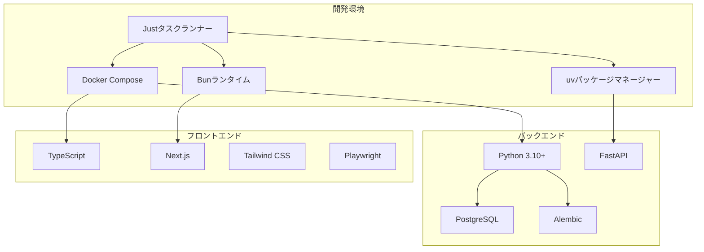
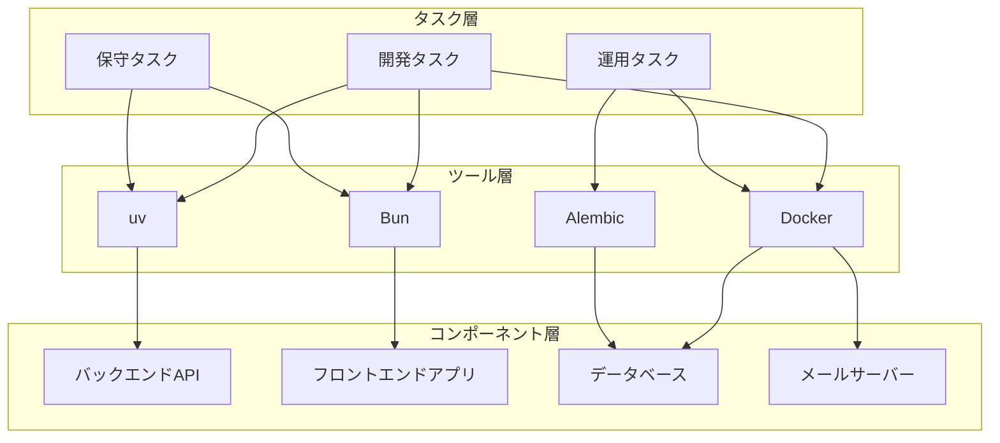
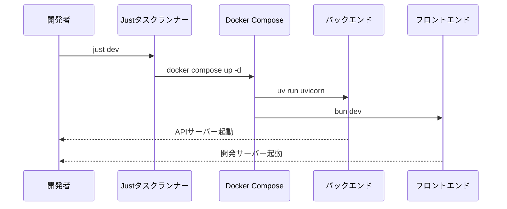
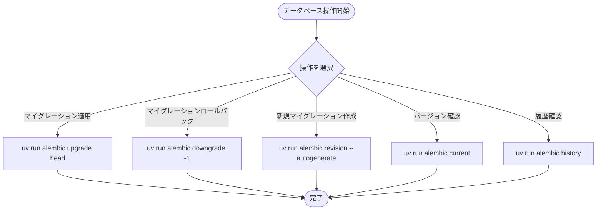
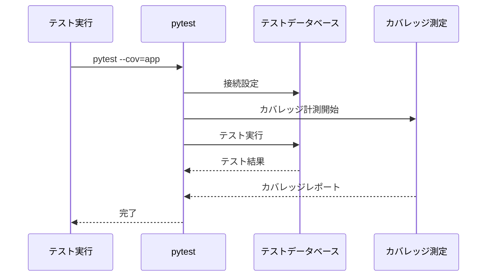
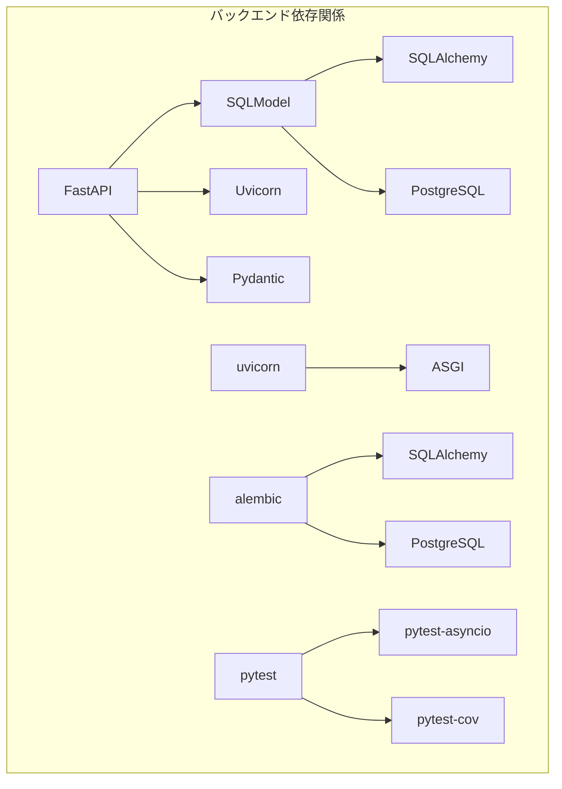
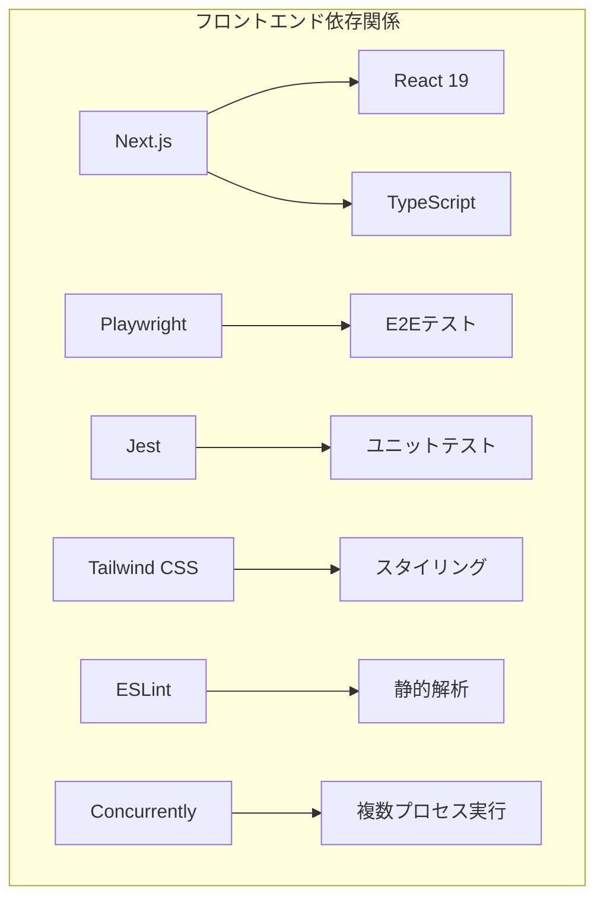

# タスク管理

<cite>
**この文書で参照されるファイル一覧**
- [justfile](file://justfile)
- [README.md](file://README.md)
- [docker-compose.yml](file://docker-compose.yml)
- [backend/pyproject.toml](file://backend/pyproject.toml)
- [backend/uv.lock](file://backend/uv.lock)
- [backend/pytest.ini](file://backend/pytest.ini)
- [backend/alembic.ini](file://backend/alembic.ini)
- [backend/migrations/versions/4f4084d80ebd_create_users_and_todos_tables.py](file://backend/migrations/versions/4f4084d80ebd_create_users_and_todos_tables.py)
- [frontend/package.json](file://frontend/package.json)
- [frontend/eslint.config.mjs](file://frontend/eslint.config.mjs)
- [frontend/playwright.config.ts](file://frontend/playwright.config.ts)
- [docker/backend/Dockerfile](file://docker/backend/Dockerfile)
- [docker/frontend/Dockerfile](file://docker/frontend/Dockerfile)
- [backend/tests/conftest.py](file://backend/tests/conftest.py)
</cite>

## 目次
1. [はじめに](#はじめに)
2. [プロジェクト構造](#プロジェクト構造)
3. [コアコンポーネント](#コアコンポーネント)
4. [アーキテクチャ概要](#アーキテクチャ概要)
5. [詳細コンポーネント分析](#詳細コンポーネント分析)
6. [依存関係分析](#依存関係分析)
7. [パフォーマンス考慮事項](#パフォーマンス考慮事項)
8. [トラブルシューティングガイド](#トラブルシューティングガイド)
9. [結論](#結論)
10. [付録](#付録)

## はじめに
本ドキュメントは、Todoプロジェクトにおけるjustタスクランナーの詳細な使用方法と設定について提供します。開発タスク（ビルド、テスト、マイグレーション）、運用タスク（コンテナ管理、デプロイメント）、保守タスク（コードフォーマット、静的解析）の各タスクの実行方法を説明し、pyproject.tomlとpackage.jsonでの依存関係管理、uvとBunの使用方法について詳しく解説します。

## プロジェクト構造
Todoプロジェクトは、バックエンド（FastAPI）とフロントエンド（Next.js）の2つの主要なコンポーネントから構成されています。各コンポーネントには独自の依存関係管理システムが存在し、justタスクランナーを通じて統合された開発ワークフローが提供されています。

**図の出典**
- [justfile:1-69](file://justfile#L1-L69)
- [docker-compose.yml:1-29](file://docker-compose.yml#L1-L29)

**セクションの出典**
- [justfile:1-69](file://justfile#L1-L69)
- [README.md:143-242](file://README.md#L143-L242)

## コアコンポーネント
本プロジェクトのタスク管理は、以下の4つの主要なコンポーネントによって支えられています：

### 1. Justタスクランナー
justfileは、プロジェクト全体のタスクを一元管理する中心的なコンポーネントです。Dockerベースの開発環境、マイグレーション管理、ログ監視、コンテナ操作などのタスクをカプセル化しています。

### 2. uvパッケージマネージャー
uvは、Pythonの高速なパッケージ管理ツールとして使用され、依存関係のインストールや仮想環境の管理を効率的に行います。Dockerイメージのビルドプロセスでも利用されています。

### 3. Bunランタイム
Bunは、JavaScript/TypeScriptの高速なランタイムとして、フロントエンドの開発サーバー起動やビルドプロセスを担っています。

### 4. Dockerコンテナ
Docker Composeを使用して、PostgreSQLデータベース、Mailpitメールサーバー、バックエンドAPIサーバー、フロントエンド開発サーバーを一貫した環境で管理します。

**セクションの出典**
- [justfile:1-69](file://justfile#L1-L69)
- [backend/pyproject.toml:1-51](file://backend/pyproject.toml#L1-L51)
- [frontend/package.json:1-65](file://frontend/package.json#L1-L65)

## アーキテクチャ概要
本プロジェクトのタスク管理アーキテクチャは、以下の3層構造で設計されています：

**図の出典**
- [justfile:1-69](file://justfile#L1-L69)
- [docker-compose.yml:1-29](file://docker-compose.yml#L1-L29)

## 詳細コンポーネント分析

### 開発タスク管理

#### 1. 開発環境起動タスク
開発環境の起動は、単一のコマンドでバックエンドとフロントエンドの両方を同時に起動できます。

**図の出典**
- [justfile:8-15](file://justfile#L8-L15)

#### 2. 個別開発サーバー起動
バックエンドとフロントエンドを個別に起動することも可能です。

**セクションの出典**
- [justfile:29-35](file://justfile#L29-L35)

#### 3. ログ監視タスク
各サービスのログをリアルタイムで監視できます。

**セクションの出典**
- [justfile:18-27](file://justfile#L18-L27)

### 運用タスク管理

#### 1. データベース管理
データベースの状態管理は、Alembicを使用して行います。

**図の出典**
- [justfile:42-64](file://justfile#L42-L64)

#### 2. 環境リセット
データベースのボリュームを完全にクリーンアップしてリセットできます。

**セクションの出典**
- [justfile:38-40](file://justfile#L38-L40)

### 保守タスク管理

#### 1. テスト実行
バックエンドのテストは、pytestを使用して実行されます。

**図の出典**
- [backend/pyproject.toml:44-50](file://backend/pyproject.toml#L44-L50)

#### 2. 静的解析
ESLintを使用した静的解析が設定されています。

**セクションの出典**
- [frontend/eslint.config.mjs:1-19](file://frontend/eslint.config.mjs#L1-L19)

#### 3. E2Eテスト
Playwrightを使用したエンドツーエンドテストが設定されています。

**セクションの出典**
- [frontend/playwright.config.ts:1-66](file://frontend/playwright.config.ts#L1-L66)

### 依存関係管理

#### 1. Python依存関係管理（uv）
uvを使用した依存関係管理は、以下の特徴を持ちます：

- **高速なインストール**: uvはpipよりも高速なパッケージインストールを提供
- **ロックファイルの使用**: uv.lockファイルを使用して依存関係の固定化
- **マルチプラットフォーム対応**: 複数のPythonバージョンに対応

**セクションの出典**
- [backend/pyproject.toml:1-51](file://backend/pyproject.toml#L1-L51)
- [backend/uv.lock:1-521](file://backend/uv.lock#L1-L521)

#### 2. JavaScript依存関係管理（Bun）
Bunを使用した依存関係管理は、以下の特徴を持ちます：

- **高速なnpm互換**: npmの代わりにBunを使用することで高速化
- **TypeScriptサポート**: TypeScriptの直接実行が可能
- **バンドル機能**: 生産用ビルドの最適化

**セクションの出典**
- [frontend/package.json:1-65](file://frontend/package.json#L1-L65)

## 依存関係分析

### Python依存関係構造

**図の出典**
- [backend/pyproject.toml:7-25](file://backend/pyproject.toml#L7-L25)
- [backend/pyproject.toml:27-35](file://backend/pyproject.toml#L27-L35)

### JavaScript依存関係構造

**図の出典**
- [frontend/package.json:18-36](file://frontend/package.json#L18-L36)
- [frontend/package.json:37-55](file://frontend/package.json#L37-L55)

**セクションの出典**
- [backend/pyproject.toml:1-51](file://backend/pyproject.toml#L1-L51)
- [frontend/package.json:1-65](file://frontend/package.json#L1-L65)

## パフォーマンス考慮事項
本プロジェクトでは、以下のパフォーマンス向上策が採用されています：

### 1. 高速なパッケージ管理
- **uvの使用**: pipよりも高速なPythonパッケージ管理
- **Bunの使用**: npmの代わりに高速なJavaScriptランタイム

### 2. 高速なコンテナビルド
- **Dockerイメージの最適化**: 依存関係のキャッシュを利用したビルド
- **マルチステージビルド**: 必要最小限のコンテナサイズ

### 3. 高速な開発サーバー
- **Hot Reload**: 開発中の自動リロード機能
- **並列処理**: 複数プロセスの同時実行

## トラブルシューティングガイド

### 1. 開発環境起動時の問題
- **ポート競合**: 既に使用されているポート（3000、8000、5432）を確認
- **Dockerコンテナの停止**: `just clean-db`でコンテナを再起動
- **依存関係の問題**: `uv sync`または`bun install`を実行

### 2. データベースマイグレーションの問題
- **マイグレーションの適用**: `just db-migrate`で最新バージョンに更新
- **マイグレーションのロールバック**: `just db-rollback`で1段階戻す
- **新しいマイグレーション**: `just db-revision MESSAGE="説明文"`で作成

### 3. テスト実行の問題
- **テストの実行**: `uv run pytest`でテストを実行
- **カバレッジの確認**: `uv run pytest --cov=app`でカバレッジを確認
- **テストデータベース**: `just clean-db`でテスト用データベースをリセット

**セクションの出典**
- [justfile:38-64](file://justfile#L38-L64)
- [backend/tests/conftest.py:1-81](file://backend/tests/conftest.py#L1-L81)

## 結論
本プロジェクトでは、justタスクランナーを活用して、開発、運用、保守の3つのタスクカテゴリを効率的に管理しています。uvとBunの使用により、依存関係管理の高速化と開発体験の向上が実現されています。Dockerコンテナの活用により、開発環境の一貫性が保たれています。これらのツールとプロセスの組み合わせにより、効率的で信頼性の高いソフトウェア開発が可能になっています。

## 付録

### 1. 重要なタスクのまとめ
- **開発環境起動**: `just dev`
- **バックエンド起動**: `just backend-dev`
- **フロントエンド起動**: `just frontend-dev`
- **データベースマイグレーション**: `just db-migrate`
- **テスト実行**: `uv run pytest`
- **E2Eテスト**: `bun run e2e`

### 2. 依存関係管理のベストプラクティス
- **uvの使用**: `uv sync`で依存関係を管理
- **Bunの使用**: `bun install`でJavaScript依存関係を管理
- **ロックファイルの活用**: `uv.lock`と`bun.lock`を使用してバージョン固定

### 3. Dockerコンテナの管理
- **コンテナ起動**: `docker compose up -d`
- **コンテナ停止**: `docker compose down`
- **コンテナ状態確認**: `docker compose ps`

**セクションの出典**
- [justfile:1-69](file://justfile#L1-L69)
- [docker/backend/Dockerfile:1-10](file://docker/backend/Dockerfile#L1-L10)
- [docker/frontend/Dockerfile:1-8](file://docker/frontend/Dockerfile#L1-L8)