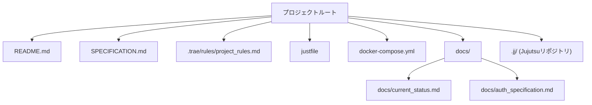
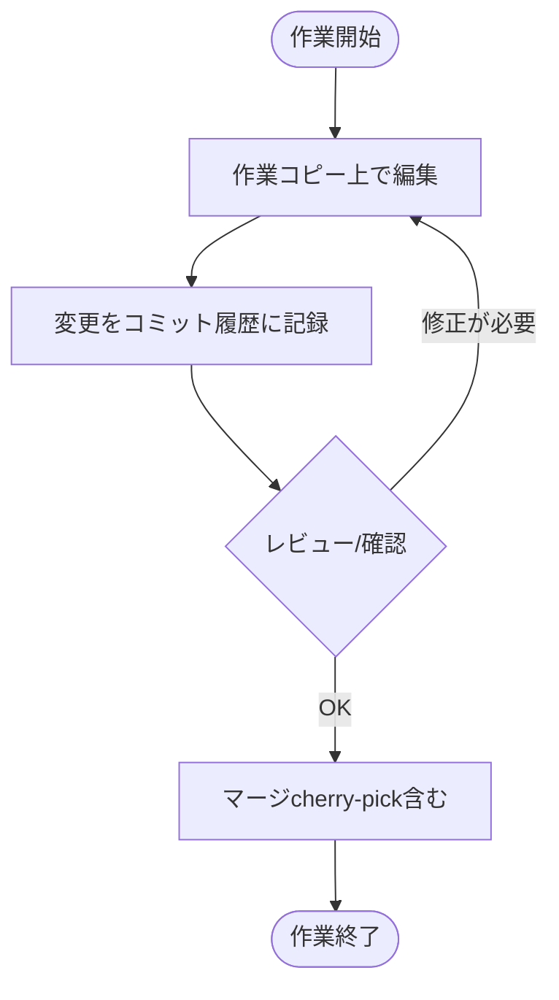
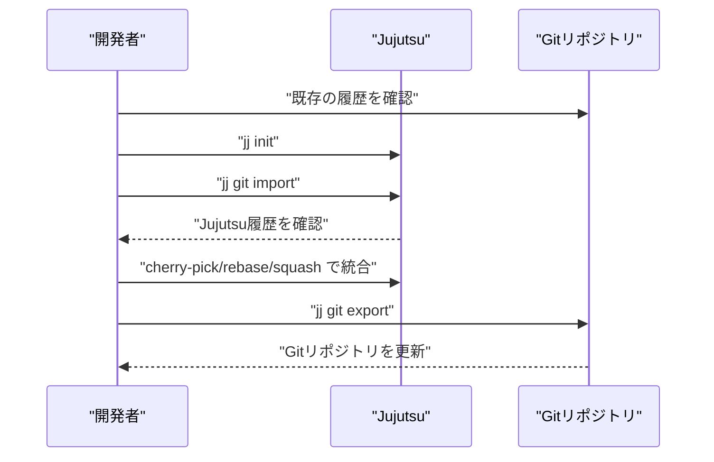
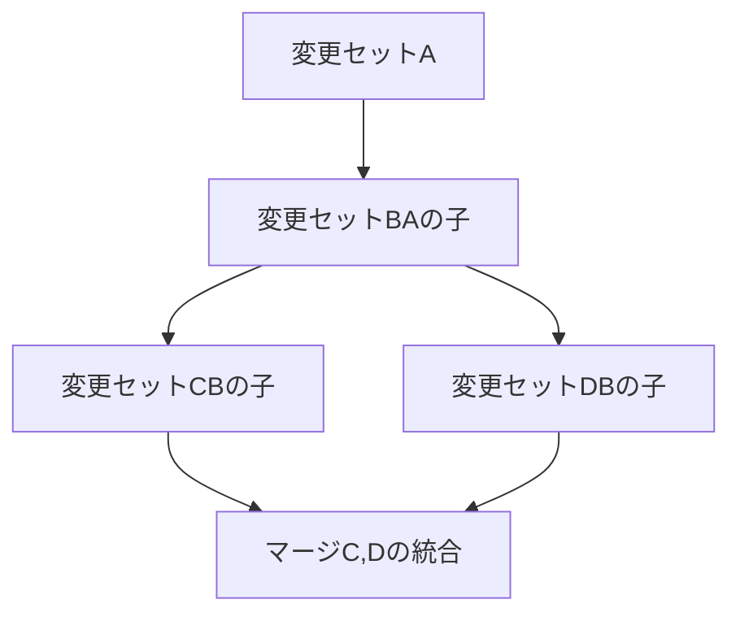
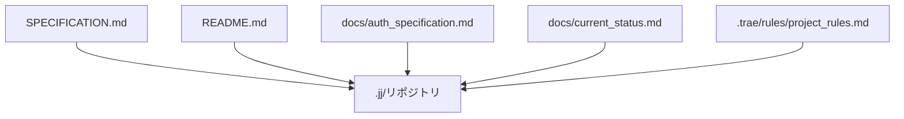
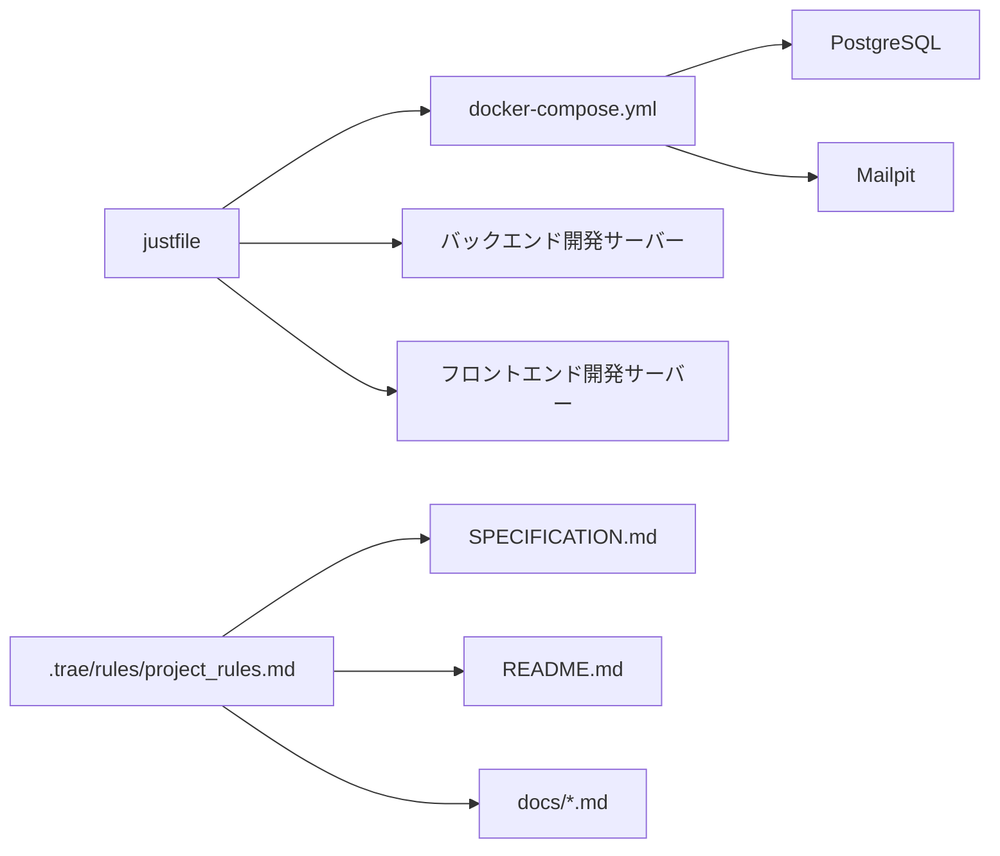
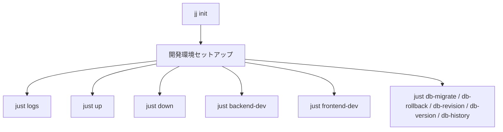

# バージョン管理

<cite>
**本文で参照されるファイル**
- [README.md](file://README.md)
- [SPECIFICATION.md](file://SPECIFICATION.md)
- [.trae/rules/project_rules.md](file://.trae/rules/project_rules.md)
- [justfile](file://justfile)
- [docker-compose.yml](file://docker-compose.yml)
- [docs/current_status.md](file://docs/current_status.md)
- [docs/auth_specification.md](file://docs/auth_specification.md)
</cite>

## 目次
1. [はじめに](#はじめに)
2. [プロジェクト構造](#プロジェクト構造)
3. [コアコンポーネント](#コアコンポーネント)
4. [アーキテクチャ概要](#アーキテクチャ概要)
5. [詳細コンポーネント分析](#詳細コンポーネント分析)
6. [依存関係分析](#依存関係分析)
7. [パフォーマンスに関する考慮事項](#パフォーマンスに関する考慮事項)
8. [トラブルシューティングガイド](#トラブルシューティングガイド)
9. [結論](#結論)
10. [付録](#付録)

## はじめに
本ドキュメントは、Jujutsu（jj）という分散型バージョン管理システム（VCS）を用いた開発ワークフローについて説明します。特に、以下の点に焦点を当てます：
- Jujutsuの基本操作（作業の開始・終了・変更の作成）
- Gitとの相互運用方法（import/export、マージ戦略）
- 変更履歴の管理方法（コミット、変更セット、親子関係）
- SPECIFICATION.mdやREADME.mdなどのドキュメントのバージョン管理方法

本プロジェクトでは、開発ルールとして「コミットメッセージは日本語で記述する」ことが定められています。また、開発タスクはjustfileを通じて一元管理されています。

**節の出典**
- [README.md:57-59](file://README.md#L57-L59)
- [.trae/rules/project_rules.md:10](file://.trae/rules/project_rules.md#L10)

## プロジェクト構造
本プロジェクトの全体像と、Jujutsuが関与する領域（ドキュメント、設定、開発ツール）を以下に示します。



**図の出典**
- [README.md:216-242](file://README.md#L216-L242)
- [SPECIFICATION.md:119-147](file://SPECIFICATION.md#L119-L147)
- [.trae/rules/project_rules.md:26-29](file://.trae/rules/project_rules.md#L26-L29)

**節の出典**
- [README.md:216-242](file://README.md#L216-L242)
- [SPECIFICATION.md:119-147](file://SPECIFICATION.md#L119-L147)
- [.trae/rules/project_rules.md:26-29](file://.trae/rules/project_rules.md#L26-L29)

## コアコンポーネント
- Jujutsu（jj）：分散型VCSとしての基本操作（作業の開始・終了・変更の作成）を提供。開発ルールではコミットメッセージは日本語で記述することが求められている。
- 開発ルール（.trae/rules/project_rules.md）：技術スタック、開発ルール、ファイル参照先（SPECIFICATION.md、docs/current_status.md、justfile）を定めている。
- 開発タスク（justfile）：Docker起動、バックエンド/フロントエンド開発サーバー起動、DBマイグレーション、ログ表示など。
- インフラ（docker-compose.yml）：PostgreSQL、Mailpitなどのサービスを管理。
- ドキュメント（README.md、SPECIFICATION.md、docs/*.md）：仕様、現状、認証仕様、開発手順などを記述。

**節の出典**
- [.trae/rules/project_rules.md:1-30](file://.trae/rules/project_rules.md#L1-L30)
- [justfile:1-69](file://justfile#L1-L69)
- [docker-compose.yml:1-29](file://docker-compose.yml#L1-L29)
- [README.md:143-150](file://README.md#L143-L150)
- [SPECIFICATION.md:142-147](file://SPECIFICATION.md#L142-L147)

## アーキテクチャ概要
Jujutsuは、Gitとの相互運用を前提とした分散型VCSとして位置づけられています。本プロジェクトでは、開発ルールとして「コミットメッセージは日本語で記述する」ことが定められています。また、開発タスクはjustfileによって一元管理されており、Docker Composeによるインフラ管理が行われています。

```mermaid
graph TB
subgraph "開発者"
Dev["開発者"]
end
subgraph "バージョン管理"
JJ["Jujutsu (jj)"]
Git["Gitリポジトリ"]
end
subgraph "開発ツール"
Just["justfile"]
DC["docker-compose.yml"]
end
subgraph "ドキュメント"
Spec["SPECIFICATION.md"]
Readme["README.md"]
Docs["docs/*.md"]
Rules[".trae/rules/project_rules.md"]
end
Dev --> JJ
Dev --> Just
Dev --> DC
JJ <- --> Git
Just --> DC
Spec --> Dev
Readme --> Dev
Docs --> Dev
Rules --> Dev
```

**図の出典**
- [.trae/rules/project_rules.md:9-11](file://.trae/rules/project_rules.md#L9-L11)
- [SPECIFICATION.md:142-147](file://SPECIFICATION.md#L142-L147)
- [README.md:143-150](file://README.md#L143-L150)

## 詳細コンポーネント分析

### Jujutsu（jj）の基本操作
- 作業の開始：新しい変更（変更セット）を作成し、作業コピー上で編集を開始します。
- 変更の作成：編集内容をコミットし、履歴に記録します。開発ルールではコミットメッセージは日本語で記述することが求められています。
- 変更の終了：変更をマージ（またはcherry-pick）し、必要に応じて他のブランチに反映します。



**節の出典**
- [.trae/rules/project_rules.md:10](file://.trae/rules/project_rules.md#L10)
- [SPECIFICATION.md:142-147](file://SPECIFICATION.md#L142-L147)

### Gitとの相互運用
- import/export：既存のGitリポジトリからJujutsuへ移行（import）し、必要に応じてJujutsuの履歴をGitへエクスポート（export）します。
- マージ戦略：Jujutsuのcherry-pickやrebase、squashなどを用いて、Gitとの整合性を保ちながら変更を統合します。



**節の出典**
- [SPECIFICATION.md:142-147](file://SPECIFICATION.md#L142-L147)

### 変更履歴の管理
- 親子関係：変更セットの親子関係を意識し、履歴を整理していきます。
- 履歴の視覚化：Jujutsuのコマンドで履歴を確認し、必要に応じてrewordやsquashで履歴を整理します。
- 保守性：開発ルールに従い、コミットメッセージは日本語で記述することで、チーム内での理解を深めます。



**節の出典**
- [.trae/rules/project_rules.md:10](file://.trae/rules/project_rules.md#L10)

### SPECIFICATION.mdやREADME.mdのバージョン管理
- SPECIFICATION.md：プロジェクトの仕様書であり、Jujutsuでバージョン管理されます。開発ルールではコミットメッセージは日本語で記述することが求められています。
- README.md：プロジェクトの概要、技術スタック、開発手順などが記述され、Jujutsuでバージョン管理されます。
- docs/*.md：認証仕様書や現状まとめなどのドキュメントも同様にバージョン管理されます。



**節の出典**
- [SPECIFICATION.md:119-147](file://SPECIFICATION.md#L119-L147)
- [README.md:143-150](file://README.md#L143-L150)
- [.trae/rules/project_rules.md:26-29](file://.trae/rules/project_rules.md#L26-L29)

## 依存関係分析
- 開発ツール（justfile）：Docker Compose、DBマイグレーション、バックエンド/フロントエンド開発サーバーの起動を一元管理。
- インフラ（docker-compose.yml）：PostgreSQL、Mailpitなどのサービスを管理。
- 開発ルール（.trae/rules/project_rules.md）：技術スタック、開発ルール、ファイル参照先を定めている。
- ドキュメント（README.md、SPECIFICATION.md、docs/*.md）：仕様、現状、認証仕様、開発手順などを記述。



**節の出典**
- [justfile:1-69](file://justfile#L1-L69)
- [docker-compose.yml:1-29](file://docker-compose.yml#L1-L29)
- [.trae/rules/project_rules.md:1-30](file://.trae/rules/project_rules.md#L1-L30)

## パフォーマンスに関する考慮事項
- 開発効率：justfileによるタスクの自動化により、開発サイクルを短縮できます。
- DBマイグレーション：Alembicによるマイグレーション管理により、データベーススキーマの変更を安全に適用できます。
- Docker Compose：サービスの起動・停止・ログ表示を一貫して管理することで、開発環境の安定性を高めます。

**節の出典**
- [justfile:42-65](file://justfile#L42-L65)
- [docker-compose.yml:1-29](file://docker-compose.yml#L1-L29)

## トラブルシューティングガイド
- Jujutsuの初期化：開発ルールに従い、ローカル環境にjjがインストールされている場合に「jj init」を実行します。
- 開発環境のセットアップ：justfileのレシピを使用して、Dockerでの一括起動、停止、ログ表示、ローカル開発サーバーの起動を行います。
- DBマイグレーション：Alembicのコマンドを使用して、マイグレーションの適用・ロールバック・履歴確認を行います。



**節の出典**
- [SPECIFICATION.md:142-147](file://SPECIFICATION.md#L142-L147)
- [justfile:1-69](file://justfile#L1-L69)

## 結論
本プロジェクトでは、Jujutsu（jj）を分散型VCSとして活用し、開発ルール（特にコミットメッセージは日本語）を守ることで、チーム内の理解を深めています。開発タスクはjustfileによって一元管理され、Docker Composeによるインフラ管理が行われています。SPECIFICATION.mdやREADME.md、docs/*.mdといったドキュメントもJujutsuでバージョン管理されることで、変更履歴の可視化と保守性が向上します。Gitとの相互運用により、既存のGitリポジトリとの連携も可能であり、柔軟な開発ワークフローが実現できます。

## 付録
- 開発ルール（.trae/rules/project_rules.md）：技術スタック、開発ルール、ファイル参照先（SPECIFICATION.md、docs/current_status.md、justfile）を定めています。
- 開発タスク（justfile）：Docker起動、バックエンド/フロントエンド開発サーバー起動、DBマイグレーション、ログ表示など。
- インフラ（docker-compose.yml）：PostgreSQL、Mailpitなどのサービスを管理。
- ドキュメント（README.md、SPECIFICATION.md、docs/*.md）：仕様、現状、認証仕様、開発手順などを記述。

**節の出典**
- [.trae/rules/project_rules.md:1-30](file://.trae/rules/project_rules.md#L1-L30)
- [justfile:1-69](file://justfile#L1-L69)
- [docker-compose.yml:1-29](file://docker-compose.yml#L1-L29)
- [README.md:143-150](file://README.md#L143-L150)
- [SPECIFICATION.md:119-147](file://SPECIFICATION.md#L119-L147)
- [docs/current_status.md:1-85](file://docs/current_status.md#L1-L85)
- [docs/auth_specification.md:1-65](file://docs/auth_specification.md#L1-L65)