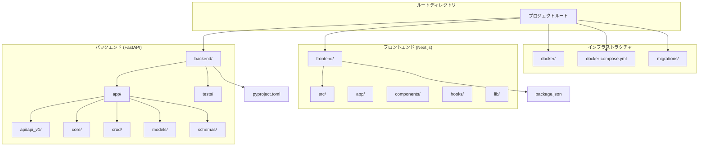
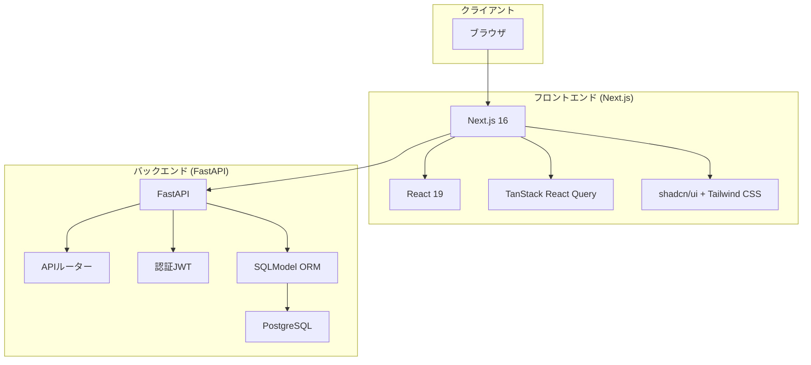
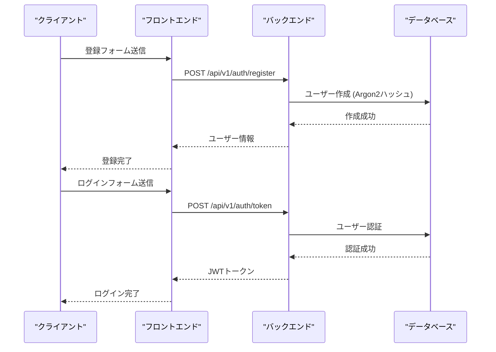
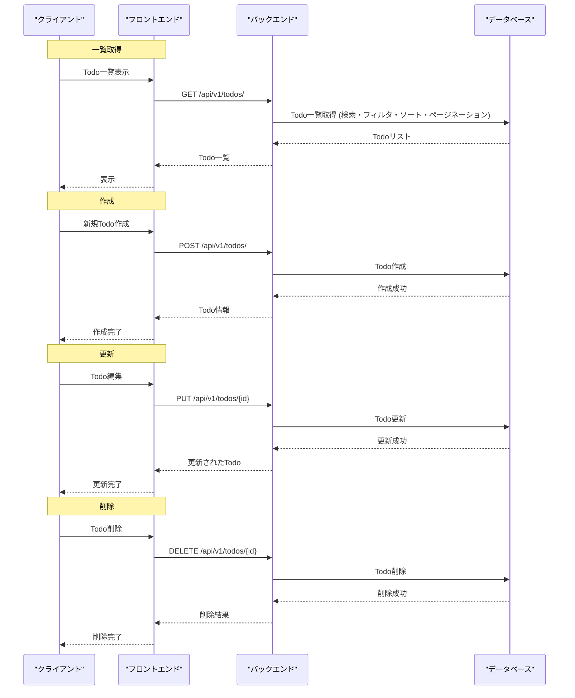
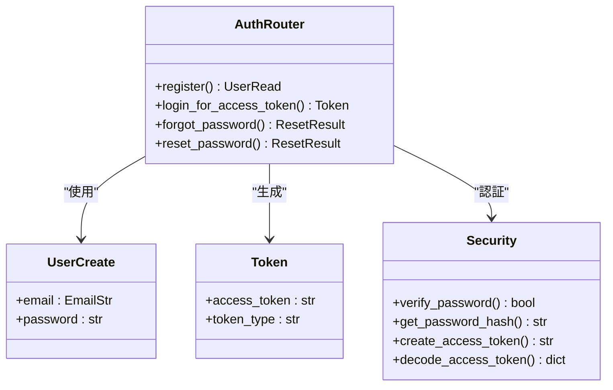
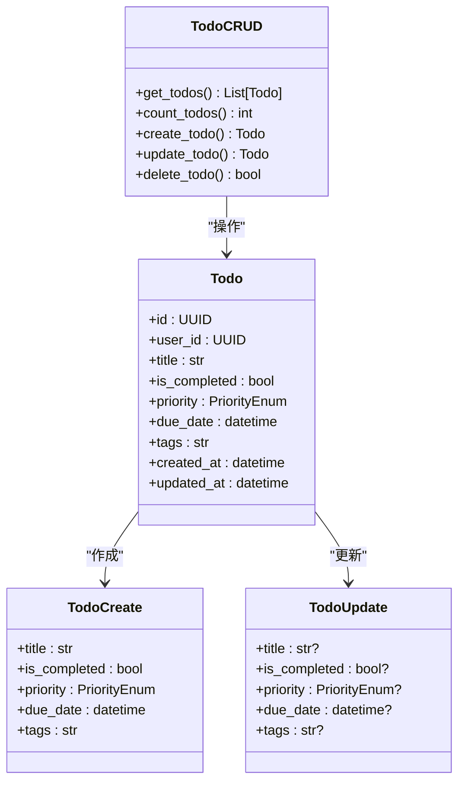
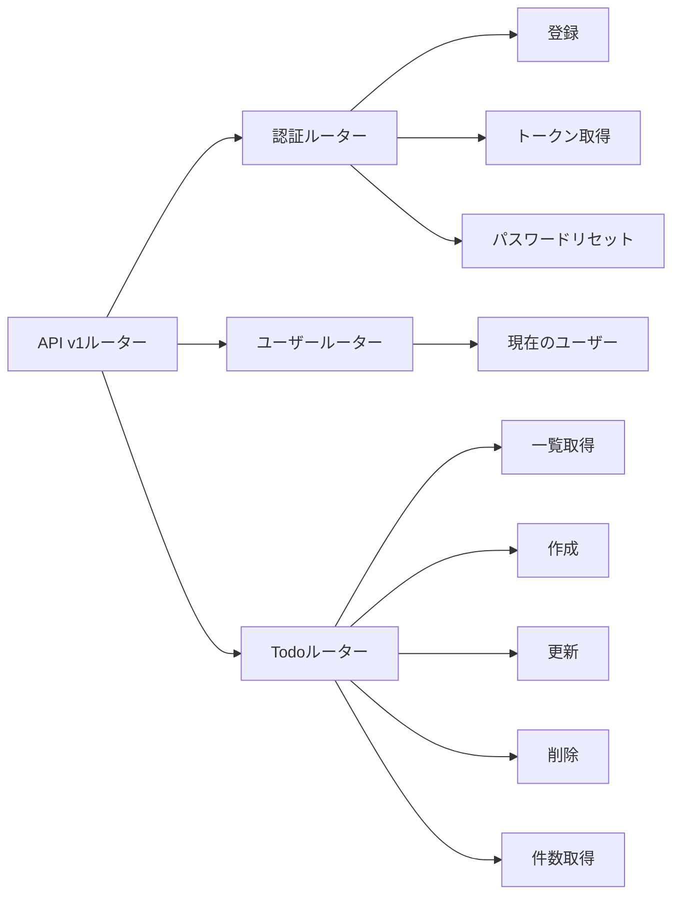
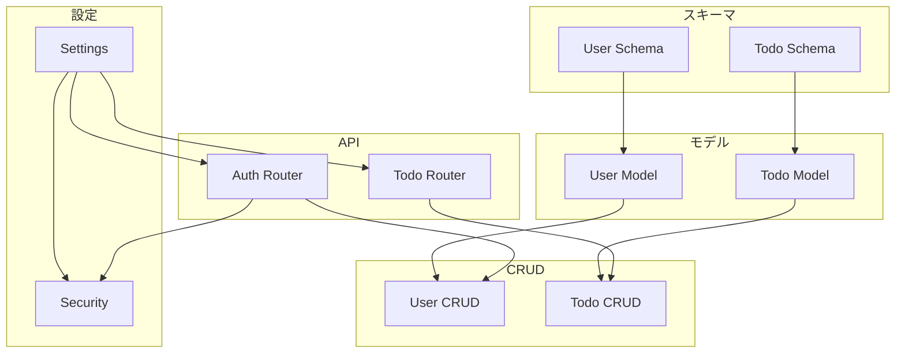

# 英語チュートリアルシリーズ

<cite>
**この文書で参照されたファイル**
- [README.md](file://README.md)
- [SPECIFICATION.md](file://SPECIFICATION.md)
- [backend/pyproject.toml](file://backend/pyproject.toml)
- [frontend/package.json](file://frontend/package.json)
- [backend/main.py](file://backend/main.py)
- [frontend/src/app/layout.tsx](file://frontend/src/app/layout.tsx)
- [backend/app/main.py](file://backend/app/main.py)
- [backend/app/api/api_v1/api.py](file://backend/app/api/api_v1/api.py)
- [backend/app/models/user.py](file://backend/app/models/user.py)
- [backend/app/models/todo.py](file://backend/app/models/todo.py)
- [backend/app/schemas/user.py](file://backend/app/schemas/user.py)
- [backend/app/schemas/todo.py](file://backend/app/schemas/todo.py)
- [backend/app/api/api_v1/endpoints/auth.py](file://backend/app/api/api_v1/endpoints/auth.py)
- [backend/app/api/api_v1/endpoints/todos.py](file://backend/app/api/api_v1/endpoints/todos.py)
- [backend/app/core/config.py](file://backend/app/core/config.py)
- [backend/app/core/security.py](file://backend/app/core/security.py)
- [backend/app/crud/crud_user.py](file://backend/app/crud/crud_user.py)
- [backend/app/crud/crud_todo.py](file://backend/app/crud/crud_todo.py)
</cite>

## 目次
1. [イントロダクション](#イントロダクション)
2. [プロジェクト構造](#プロジェクト構造)
3. [コアコンポーネント](#コアコンポーネント)
4. [アーキテクチャ概観](#アーキテクチャ概観)
5. [詳細コンポーネント分析](#詳細コンポーネント分析)
6. [依存関係分析](#依存関係分析)
7. [パフォーマンス考慮事項](#パフォーマンス考慮事項)
8. [トラブルシューティングガイド](#トラブルシューティングガイド)
9. [結論](#結論)
10. [付録](#付録)

## イントロダクション
本プロジェクトは、FastAPI、Next.js、PostgreSQLを用いたモダンなTodoアプリケーションです。ポートフォリオとしての教育目的を兼ねて、最新のWeb開発手法と技術スタックを示すことを目的としています。

主な特従機能
- JWTベースの認証（登録・ログイン）
- Todo管理（作成・読取・更新・削除）
- 実時間更新（React Queryによる楽観的UI更新）
- レート制限（ブルートフォース攻撃対策）
- 構造化ロギング（JSON形式）
- エラーハンドリング（統一エラーレスポンス）
- ヘルスチェック（システム監視）

## プロジェクト構造
全体のプロジェクト構造は以下の通りです：

**図の出典**
- [README.md:216-242](file://README.md#L216-L242)
- [SPECIFICATION.md:107-123](file://SPECIFICATION.md#L107-L123)

**節の出典**
- [README.md:216-242](file://README.md#L216-L242)
- [SPECIFICATION.md:107-123](file://SPECIFICATION.md#L107-L123)

## コアコンポーネント
バックエンドのコアコンポーネントは以下の通りです：

### 設定管理
- 環境変数ベースの設定管理
- 認証設定（JWT）
- データベース接続設定
- CORS設定
- レート制限設定

### セキュリティ
- Argon2によるパスワードハッシュ化
- JWTトークン生成・検証
- 認証ミドルウェア

### CRUD操作
- Todo管理（CRUD操作）
- ユーザー管理
- パスワードリセット

**節の出典**
- [backend/app/core/config.py:1-98](file://backend/app/core/config.py#L1-L98)
- [backend/app/core/security.py:1-43](file://backend/app/core/security.py#L1-L43)
- [backend/app/crud/crud_todo.py:1-159](file://backend/app/crud/crud_todo.py#L1-L159)

## アーキテクチャ概観
システムの全体像は以下の通りです：

**図の出典**
- [README.md:30-52](file://README.md#L30-L52)
- [README.md:60-102](file://README.md#L60-L102)

### 認証フロー

**図の出典**
- [README.md:106-111](file://README.md#L106-L111)
- [backend/app/api/api_v1/endpoints/auth.py:20-66](file://backend/app/api/api_v1/endpoints/auth.py#L20-L66)

### Todo CRUDフロー

**図の出典**
- [README.md:113-126](file://README.md#L113-L126)
- [backend/app/api/api_v1/endpoints/todos.py:21-157](file://backend/app/api/api_v1/endpoints/todos.py#L21-L157)

## 詳細コンポーネント分析

### 認証コンポーネント
認証システムはJWTベースで構成されており、以下の機能を提供します：

#### 認証エンドポイント
- ユーザー登録（/api/v1/auth/register）
- トークン取得（/api/v1/auth/token）
- パスワードリセット（/api/v1/auth/forgot-password, /api/v1/auth/reset-password）

**図の出典**
- [backend/app/api/api_v1/endpoints/auth.py:17-133](file://backend/app/api/api_v1/endpoints/auth.py#L17-L133)
- [backend/app/schemas/user.py:10-16](file://backend/app/schemas/user.py#L10-L16)
- [backend/app/schemas/auth.py:1-50](file://backend/app/schemas/auth.py#L1-L50)
- [backend/app/core/security.py:1-43](file://backend/app/core/security.py#L1-L43)

**節の出典**
- [backend/app/api/api_v1/endpoints/auth.py:20-133](file://backend/app/api/api_v1/endpoints/auth.py#L20-L133)
- [backend/app/core/security.py:11-43](file://backend/app/core/security.py#L11-L43)

### Todo管理コンポーネント
Todo管理は以下の機能を提供します：

#### Todoモデル
- UUIDによる識別子
- 優先度（high/medium/low）
- 期限日時
- タグ（カンマ区切り）

#### CRUD操作
- 一覧取得（検索・フィルタ・ソート・ページネーション）
- 作成・更新・削除
- 件数カウント

**図の出典**
- [backend/app/models/todo.py:13-38](file://backend/app/models/todo.py#L13-L38)
- [backend/app/schemas/todo.py:16-49](file://backend/app/schemas/todo.py#L16-L49)
- [backend/app/crud/crud_todo.py:33-159](file://backend/app/crud/crud_todo.py#L33-L159)

**節の出典**
- [backend/app/models/todo.py:13-38](file://backend/app/models/todo.py#L13-L38)
- [backend/app/schemas/todo.py:16-49](file://backend/app/schemas/todo.py#L16-L49)
- [backend/app/crud/crud_todo.py:33-159](file://backend/app/crud/crud_todo.py#L33-L159)

### API構造
APIは以下のルート構造で構成されています：

**図の出典**
- [backend/app/api/api_v1/api.py:1-8](file://backend/app/api/api_v1/api.py#L1-L8)
- [backend/app/api/api_v1/endpoints/auth.py:17-133](file://backend/app/api/api_v1/endpoints/auth.py#L17-L133)
- [backend/app/api/api_v1/endpoints/todos.py:18-157](file://backend/app/api/api_v1/endpoints/todos.py#L18-L157)

**節の出典**
- [backend/app/api/api_v1/api.py:1-8](file://backend/app/api/api_v1/api.py#L1-L8)
- [backend/app/api/api_v1/endpoints/auth.py:17-133](file://backend/app/api/api_v1/endpoints/auth.py#L17-L133)
- [backend/app/api/api_v1/endpoints/todos.py:18-157](file://backend/app/api/api_v1/endpoints/todos.py#L18-L157)

## 依存関係分析
各コンポーネント間の依存関係は以下の通りです：

**図の出典**
- [backend/app/core/config.py:5-98](file://backend/app/core/config.py#L5-L98)
- [backend/app/core/security.py:1-43](file://backend/app/core/security.py#L1-L43)
- [backend/app/models/user.py:10-17](file://backend/app/models/user.py#L10-L17)
- [backend/app/models/todo.py:13-38](file://backend/app/models/todo.py#L13-L38)
- [backend/app/schemas/user.py:6-16](file://backend/app/schemas/user.py#L6-L16)
- [backend/app/schemas/todo.py:16-49](file://backend/app/schemas/todo.py#L16-L49)
- [backend/app/crud/crud_user.py:1-28](file://backend/app/crud/crud_user.py#L1-L28)
- [backend/app/crud/crud_todo.py:1-159](file://backend/app/crud/crud_todo.py#L1-L159)

**節の出典**
- [backend/app/core/config.py:5-98](file://backend/app/core/config.py#L5-L98)
- [backend/app/core/security.py:1-43](file://backend/app/core/security.py#L1-L43)
- [backend/app/crud/crud_user.py:1-28](file://backend/app/crud/crud_user.py#L1-L28)
- [backend/app/crud/crud_todo.py:1-159](file://backend/app/crud/crud_todo.py#L1-L159)

## パフォーマンス考慮事項
- **非同期処理**: SQLAlchemyの非同期対応によるパフォーマンス向上
- **キャッシュ戦略**: React Queryによるクライアントサイドキャッシュ
- **データベース最適化**: インデックスの適切な使用（created_at, is_completed, priority, due_date）
- **レート制限**: 認証エンドポイントへのアクセス制限
- **構造化ロギング**: JSON形式によるパフォーマンス監視

## トラブルシューティングガイド

### 認証エラー
- JWTトークンの有効期限切れ
- 不正な認証情報
- トークン形式の不正

### Todo操作エラー
- 存在しないTodoの更新/削除
- 権限不足によるアクセス拒否
- 入力バリデーションエラー

### データベース接続エラー
- 接続文字列の誤り
- ユーザー権限の不足
- データベースサービスの停止

**節の出典**
- [backend/app/api/api_v1/endpoints/auth.py:54-61](file://backend/app/api/api_v1/endpoints/auth.py#L54-L61)
- [backend/app/api/api_v1/endpoints/todos.py:136-138](file://backend/app/api/api_v1/endpoints/todos.py#L136-L138)
- [backend/app/main.py:148-183](file://backend/app/main.py#L148-L183)

## 結論
本プロジェクトは、モダンなWeb開発技術を用いた包括的なTodoアプリケーションを提供します。FastAPIの型安全なAPI設計、Next.jsの最新機能、PostgreSQLの堅牢なデータ管理を組み合わせることで、教育目的にも最適なサンプルコードを提供しています。

## 付録

### APIエンドポイント一覧
- 認証: POST /api/v1/auth/register, POST /api/v1/auth/token
- Todo: GET/POST/PUT/DELETE /api/v1/todos/, GET /api/v1/todos/count
- システム: GET /health

### 開発環境構築手順
1. DockerとDocker Composeのインストール
2. Bun（フロントエンド開発）
3. Python 3.10+とuv（バックエンド開発）
4. Jujutsu（バージョン管理）

**節の出典**
- [README.md:143-214](file://README.md#L143-L214)
- [SPECIFICATION.md:127-160](file://SPECIFICATION.md#L127-L160)