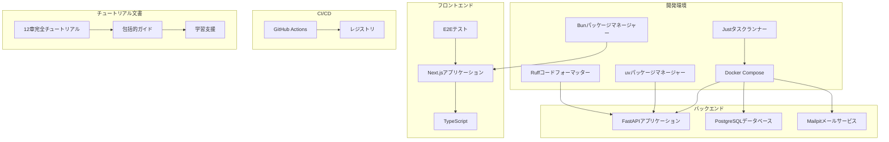
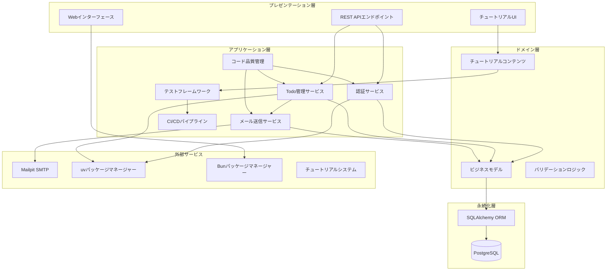
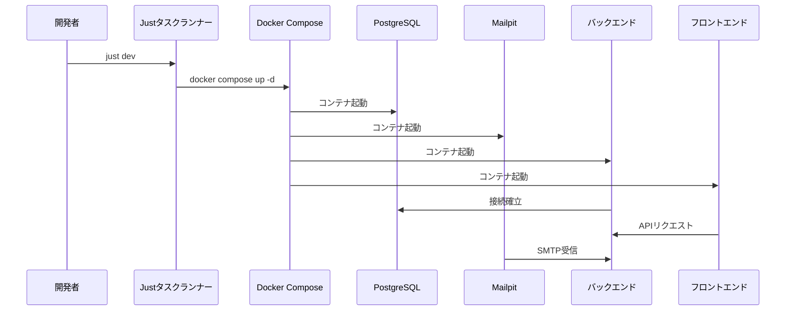
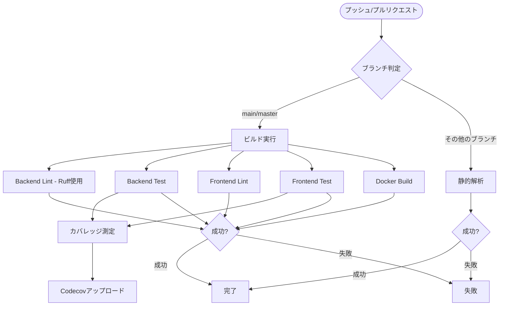
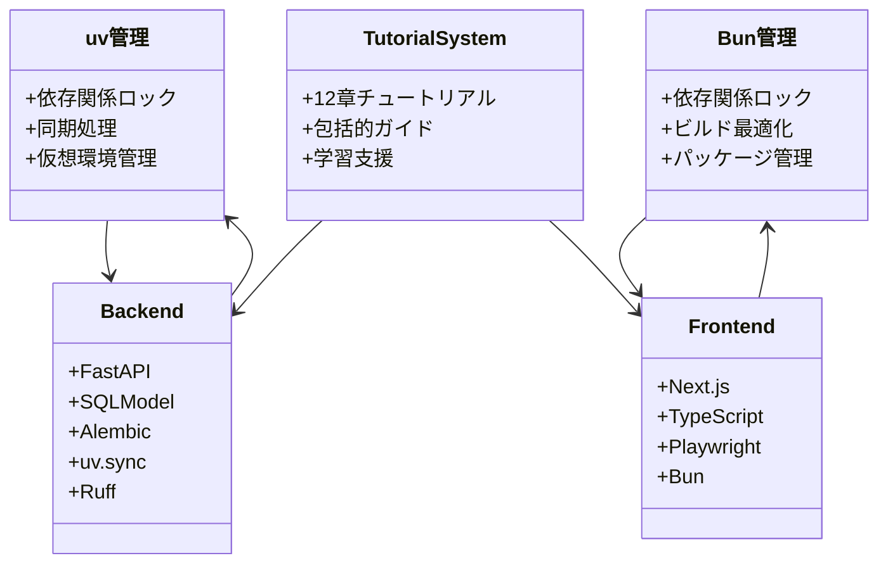
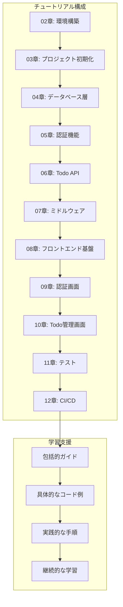
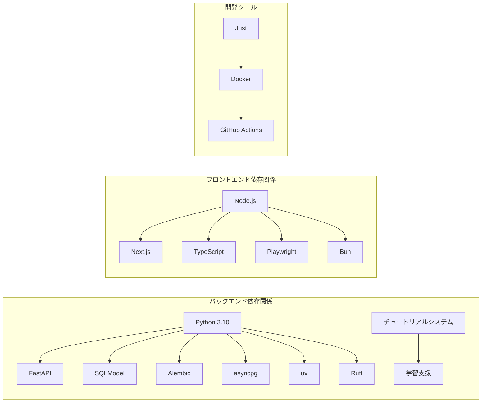

# 開発ワークフロー

<cite>
**この文書で参照されるファイル**
- [justfile](file://justfile)
- [docker-compose.yml](file://docker-compose.yml)
- [backend/pyproject.toml](file://backend/pyproject.toml)
- [frontend/package.json](file://frontend/package.json)
- [.github/workflows/ci.yml](file://.github/workflows/ci.yml)
- [backend/main.py](file://backend/main.py)
- [frontend/next.config.ts](file://frontend/next.config.ts)
- [backend/uv.lock](file://backend/uv.lock)
- [frontend/bun.lock](file://frontend/bun.lock)
- [backend/alembic.ini](file://backend/alembic.ini)
- [frontend/playwright.config.ts](file://frontend/playwright.config.ts)
- [frontend/tsconfig.json](file://frontend/tsconfig.json)
- [backend/pytest.ini](file://backend/pytest.ini)
- [docker/backend/Dockerfile](file://docker/backend/Dockerfile)
- [docs/tutorial/00-index.md](file://docs/tutorial/00-index.md)
- [docs/tutorial/02-environment-setup.md](file://docs/tutorial/02-environment-setup.md)
- [docs/tutorial/03-project-init.md](file://docs/tutorial/03-project-init.md)
- [docs/tutorial/04-backend-database.md](file://docs/tutorial/04-backend-database.md)
- [docs/tutorial/05-backend-auth.md](file://docs/tutorial/05-backend-auth.md)
- [docs/tutorial/06-backend-todo-api.md](file://docs/tutorial/06-backend-todo-api.md)
- [docs/tutorial/07-backend-middleware.md](file://docs/tutorial/07-backend-middleware.md)
- [docs/tutorial/08-frontend-setup.md](file://docs/tutorial/08-frontend-setup.md)
- [docs/tutorial/09-frontend-auth.md](file://docs/tutorial/09-frontend-auth.md)
- [docs/tutorial/10-frontend-todo.md](file://docs/tutorial/10-frontend-todo.md)
- [docs/tutorial/11-testing.md](file://docs/tutorial/11-testing.md)
- [docs/tutorial/12-cicd.md](file://docs/tutorial/12-cicd.md)
- [backend/app/core/logging.py](file://backend/app/core/logging.py)
- [backend/app/api/api_v1/endpoints/auth.py](file://backend/app/api/api_v1/endpoints/auth.py)
- [backend/app/middleware/error_handler.py](file://backend/app/middleware/error_handler.py)
</cite>

## 更新概要
**変更内容**
- Ruffを使用したコードフォーマット標準化が実施され、30ファイルにわたるPythonコードのスタイルが統一されました
- CI/CDパイプラインにRuffの静的解析とフォーマットチェックが追加されました
- 開発環境の品質管理が強化され、コードの可読性と保守性が向上しました

## 目次
1. [導入](#導入)
2. [プロジェクト構造](#プロジェクト構造)
3. [コアコンポーネント](#コアコンポーネント)
4. [アーキテクチャ概観](#アーキテクチャ概観)
5. [詳細コンポーネント分析](#詳細コンポーネント分析)
6. [依存関係分析](#依存関係分析)
7. [パフォーマンス考慮事項](#パフォーマンス考慮事項)
8. [トラブルシューティングガイド](#トラブルシューティングガイド)
9. [コード品質管理](#コード品質管理)
10. [チュートリアル文書システム](#チュートリアル文書システム)
11. [結論](#結論)

## 導入
本プロジェクトは、現代的な開発環境を実現するための包括的なワークフローを提供します。主な特徴には以下の通りです：

- **justタスクランナー**による一貫した開発ワークフロー
- **Dockerコンテナ管理**による環境統一
- **CI/CDパイプライン**による自動化された品質保証
- **uv/Bunによる依存関係管理**による高速なパッケージ処理
- **統合的なテスト戦略**（単体テスト、結合テスト、E2Eテスト）
- **Ruffによるコード品質管理**（静的解析、形式チェック、スタイル統一）
- **バージョン管理**（Jujutsuによる分散型バージョン管理）
- **12章からなる完全なチュートリアル文書システム**による学習支援

## プロジェクト構造
プロジェクトはフルスタックで構成されており、バックエンド（Python FastAPI）とフロントエンド（Next.js）の2つの主要なコンポーネントから成り立ちます。

**図のソース**
- [justfile:1-69](file://justfile#L1-L69)
- [docker-compose.yml:1-29](file://docker-compose.yml#L1-L29)
- [backend/pyproject.toml:1-51](file://backend/pyproject.toml#L1-L51)
- [.github/workflows/ci.yml:1-200](file://.github/workflows/ci.yml#L1-L200)
- [docs/tutorial/00-index.md:1-76](file://docs/tutorial/00-index.md#L1-L76)

**セクションのソース**
- [justfile:1-69](file://justfile#L1-L69)
- [docker-compose.yml:1-29](file://docker-compose.yml#L1-L29)
- [backend/pyproject.toml:1-51](file://backend/pyproject.toml#L1-L51)
- [.github/workflows/ci.yml:1-200](file://.github/workflows/ci.yml#L1-L200)
- [docs/tutorial/00-index.md:1-76](file://docs/tutorial/00-index.md#L1-L76)

## コアコンポーネント
本プロジェクトのコアとなるコンポーネントは以下の通りです：

### 1. Justタスクランナー
Justは、プロジェクト全体の作業を一元的に管理するためのツールです。以下のタスクを提供します：

- **開発環境起動**: `just dev` - DB、バックエンド、フロントエンドを同時に起動
- **データベース管理**: `just db-*` - 移行、リセット、バージョン確認
- **ログ表示**: `just db-logs`, `just backend-logs`, `just frontend-logs`
- **ローカル開発**: `just backend-dev`, `just frontend-dev`

### 2. Dockerコンテナ管理
Docker Composeを使用して以下のコンテナを管理します：

- **PostgreSQL**: メインデータベース（5432ポート公開）
- **Mailpit**: SMTPメールテストサービス（8025, 1025ポート公開）

### 3. 依存関係管理
- **バックエンド**: uv（Pythonパッケージマネージャー）を使用
- **フロントエンド**: Bun（JavaScriptパッケージマネージャー）を使用

### 4. CI/CDパイプライン
GitHub Actionsによる完全な自動化ワークフロー：
- **Backend Lint**: Pythonコードの静的解析と形式チェック（Ruff使用）
- **Backend Test**: PostgreSQLサービスとの連携テスト
- **Frontend Lint**: TypeScriptコードの静的解析
- **Frontend Test**: 単体テストとカバレッジ測定
- **Docker Build**: コンテナイメージのビルドテスト

### 5. Ruffコードフォーマッター
Ruffは、Pythonコードのスタイルを統一し、品質を向上させるためのツールです。以下の機能を提供します：

- **静的解析**: コードの潜在的な問題を検出
- **フォーマットチェック**: 一貫したコードスタイルを維持
- **30ファイルにわたるスタイル統一**: 開発チームのコード品質向上

### 6. チュートリアル文書システム
12章からなる完全なチュートリアル文書システム：
- **02章**: 開発環境構築（Docker、uv、Bun、justのセットアップ）
- **03章**: プロジェクト初期化（ディレクトリ構成と各種設定ファイル）
- **04章**: データベース層（SQLModelモデル、DB接続、Alembicマイグレーション）
- **05章**: 認証機能（JWT認証、ユーザー登録・ログイン・パスワードリセット）
- **06章**: Todo API（CRUD操作、検索・フィルタ・ページネーション）
- **07章**: ミドルウェア（ロギング、エラーハンドリング、レート制限）
- **08章**: フロントエンド基盤（Next.js初期化、shadcn/ui、APIクライアント）
- **09章**: 認証画面（ログイン・登録・パスワードリセット画面）
- **10章**: Todo管理画面（一覧表示、追加、編集、フィルタ、ページネーション）
- **11章**: テスト（バックエンド・フロントエンド・E2Eテスト）
- **12章**: CI/CD（GitHub Actionsによる自動テストとビルド）

**セクションのソース**
- [justfile:1-69](file://justfile#L1-L69)
- [docker-compose.yml:1-29](file://docker-compose.yml#L1-L29)
- [backend/pyproject.toml:1-51](file://backend/pyproject.toml#L1-L51)
- [frontend/package.json:1-65](file://frontend/package.json#L1-L65)
- [.github/workflows/ci.yml:1-200](file://.github/workflows/ci.yml#L1-L200)
- [docs/tutorial/00-index.md:19-32](file://docs/tutorial/00-index.md#L19-L32)

## アーキテクチャ概観
本プロジェクトはマイクロサービスアーキテクチャを採用し、以下の層に分けて設計されています。

**図のソース**
- [backend/pyproject.toml:1-51](file://backend/pyproject.toml#L1-L51)
- [frontend/package.json:1-65](file://frontend/package.json#L1-L65)
- [docker-compose.yml:1-29](file://docker-compose.yml#L1-L29)
- [docs/tutorial/00-index.md:7-13](file://docs/tutorial/00-index.md#L7-L13)

## 詳細コンポーネント分析

### Dockerコンテナ管理
Docker Composeを使用したコンテナ管理は以下の通りです：

**図のソース**
- [justfile:1-69](file://justfile#L1-L69)
- [docker-compose.yml:1-29](file://docker-compose.yml#L1-L29)

**セクションのソース**
- [docker-compose.yml:1-29](file://docker-compose.yml#L1-L29)
- [docker/backend/Dockerfile:1-10](file://docker/backend/Dockerfile#L1-L10)

### CI/CDパイプライン
GitHub Actionsによる完全な自動化ワークフローは以下のステップで構成されます：

**図のソース**
- [.github/workflows/ci.yml:1-200](file://.github/workflows/ci.yml#L1-L200)

**セクションのソース**
- [.github/workflows/ci.yml:1-200](file://.github/workflows/ci.yml#L1-L200)

### 依存関係管理
uvとBunによる依存関係管理は以下の通りです：

**図のソース**
- [backend/uv.lock:1-521](file://backend/uv.lock#L1-L521)
- [frontend/bun.lock:1-800](file://frontend/bun.lock#L1-L800)

**セクションのソース**
- [backend/uv.lock:1-521](file://backend/uv.lock#L1-L521)
- [frontend/bun.lock:1-800](file://frontend/bun.lock#L1-L800)

### Ruffコードフォーマッター
Ruffは、Pythonコードの品質を向上させるための強力なツールです。以下の機能を提供します：

- **静的解析**: `uv run ruff check .` - Pythonコードの潜在的な問題を検出
- **フォーマットチェック**: `uv run ruff format --check .` - 一貫したコードスタイルを維持
- **30ファイルにわたるスタイル統一**: 開発チームのコード品質を向上

Ruffの導入により、以下の利点が得られました：

1. **コードの一貫性**: 30ファイルにわたるPythonコードが統一されたスタイルになりました
2. **可読性の向上**: 標準化されたコードフォーマットにより、コードの可読性が向上しました
3. **保守性の強化**: 標準的なスタイルにより、将来的な保守作業が容易になりました
4. **品質の確保**: CI/CDパイプラインでの自動チェックにより、コード品質が継続的に維持されます

**セクションのソース**
- [backend/pyproject.toml:35](file://backend/pyproject.toml#L35)
- [.github/workflows/ci.yml:32-38](file://.github/workflows/ci.yml#L32-L38)

### テスト戦略
統合されたテスト戦略は以下の3層で構成されています：

1. **単体テスト**: PyTestを使用したバックエンドの単体テスト
2. **結合テスト**: PostgreSQLサービスとの連携テスト
3. **E2Eテスト**: Playwrightを使用したエンドツーエンドテスト

**セクションのソース**
- [backend/pytest.ini:1-5](file://backend/pytest.ini#L1-L5)
- [frontend/playwright.config.ts:1-66](file://frontend/playwright.config.ts#L1-L66)

### チュートリアル文書システム
12章からなる完全なチュートリアル文書システムは以下の構成で構成されています：

**図のソース**
- [docs/tutorial/00-index.md:19-32](file://docs/tutorial/00-index.md#L19-L32)
- [docs/tutorial/02-environment-setup.md:1-185](file://docs/tutorial/02-environment-setup.md#L1-L185)
- [docs/tutorial/03-project-init.md:1-298](file://docs/tutorial/03-project-init.md#L1-L298)
- [docs/tutorial/04-backend-database.md:1-437](file://docs/tutorial/04-backend-database.md#L1-L437)
- [docs/tutorial/05-backend-auth.md:1-413](file://docs/tutorial/05-backend-auth.md#L1-L413)
- [docs/tutorial/06-backend-todo-api.md:1-324](file://docs/tutorial/06-backend-todo-api.md#L1-L324)
- [docs/tutorial/07-backend-middleware.md:1-423](file://docs/tutorial/07-backend-middleware.md#L1-L423)
- [docs/tutorial/08-frontend-setup.md:1-382](file://docs/tutorial/08-frontend-setup.md#L1-L382)
- [docs/tutorial/09-frontend-auth.md:1-436](file://docs/tutorial/09-frontend-auth.md#L1-L436)
- [docs/tutorial/10-frontend-todo.md:1-597](file://docs/tutorial/10-frontend-todo.md#L1-L597)
- [docs/tutorial/11-testing.md:1-464](file://docs/tutorial/11-testing.md#L1-L464)
- [docs/tutorial/12-cicd.md:1-251](file://docs/tutorial/12-cicd.md#L1-L251)

**セクションのソース**
- [docs/tutorial/00-index.md:19-32](file://docs/tutorial/00-index.md#L19-L32)
- [docs/tutorial/02-environment-setup.md:1-185](file://docs/tutorial/02-environment-setup.md#L1-L185)
- [docs/tutorial/03-project-init.md:1-298](file://docs/tutorial/03-project-init.md#L1-L298)
- [docs/tutorial/04-backend-database.md:1-437](file://docs/tutorial/04-backend-database.md#L1-L437)
- [docs/tutorial/05-backend-auth.md:1-413](file://docs/tutorial/05-backend-auth.md#L1-L413)
- [docs/tutorial/06-backend-todo-api.md:1-324](file://docs/tutorial/06-backend-todo-api.md#L1-L324)
- [docs/tutorial/07-backend-middleware.md:1-423](file://docs/tutorial/07-backend-middleware.md#L1-L423)
- [docs/tutorial/08-frontend-setup.md:1-382](file://docs/tutorial/08-frontend-setup.md#L1-L382)
- [docs/tutorial/09-frontend-auth.md:1-436](file://docs/tutorial/09-frontend-auth.md#L1-L436)
- [docs/tutorial/10-frontend-todo.md:1-597](file://docs/tutorial/10-frontend-todo.md#L1-L597)
- [docs/tutorial/11-testing.md:1-464](file://docs/tutorial/11-testing.md#L1-L464)
- [docs/tutorial/12-cicd.md:1-251](file://docs/tutorial/12-cicd.md#L1-L251)

## 依存関係分析
プロジェクト全体の依存関係は以下の通りです：

**図のソース**
- [backend/pyproject.toml:1-51](file://backend/pyproject.toml#L1-L51)
- [frontend/package.json:1-65](file://frontend/package.json#L1-L65)
- [justfile:1-69](file://justfile#L1-L69)

**セクションのソース**
- [backend/pyproject.toml:1-51](file://backend/pyproject.toml#L1-L51)
- [frontend/package.json:1-65](file://frontend/package.json#L1-L65)

## パフォーマンス考慮事項
1. **依存関係管理の最適化**
   - uvはC拡張を使用した高速なパッケージインストール
   - BunはNative ESM対応による高速なビルド

2. **Dockerイメージの最適化**
   - 元のPythonイメージからuvバイナリのみコピー
   - 依存関係のキャッシュを利用したビルド

3. **テストの並列実行**
   - GitHub Actionsでの並列処理による高速化
   - PostgreSQLサービスの再利用による起動時間短縮

4. **Ruffによる品質管理の最適化**
   - CI/CDパイプラインでの自動静的解析とフォーマットチェック
   - 30ファイルにわたるPythonコードのスタイル統一により、保守性が向上

5. **チュートリアル文書の最適化**
   - 12章の包括的ガイドにより学習効率の向上
   - 具体的なコード例と実践的な手順の提供

## トラブルシューティングガイド

### 開発環境起動時の問題
1. **ポート競合**
   - PostgreSQL: 5432番ポートが使用中か確認
   - Mailpit: 8025, 1025番ポートの確認
   - Next.js: 3000番ポートの確認

2. **Dockerコンテナの起動失敗**
   - `just status`でコンテナ状態を確認
   - `just db-logs`でエラーログを確認

### 依存関係の問題
1. **uvパッケージのインストール失敗**
   - `uv sync --frozen`でロックファイルに基づいてインストール
   - Pythonバージョンの互換性を確認

2. **Bunパッケージの問題**
   - `bun install`で依存関係を再インストール
   - `bun.lock`の更新が必要な場合がある

### CI/CDパイプラインの問題
1. **Ruffによる静的解析エラー**
   - `uv run ruff check .`で問題箇所を確認
   - `uv run ruff format --check .`でフォーマットエラーを修正

2. **テスト失敗**
   - `just clean-db`でデータベースをリセット
   - `just db-migrate`でマイグレーションを適用

3. **Dockerビルド失敗**
   - Dockerfileの依存関係を確認
   - キャッシュのクリアを行う

### Ruffコードフォーマッターの問題
1. **静的解析エラー**
   - CI/CDパイプラインでエラーが発生した場合、ローカルで`uv run ruff check .`を実行
   - 発生したエラーを修正し、`uv run ruff format --check .`でフォーマットを確認

2. **フォーマットエラー**
   - `uv run ruff format .`で自動フォーマットを適用
   - `uv run ruff format --check .`で修正後のフォーマットを確認

### チュートリアル文書の問題
1. **章の順序の問題**
   - 01章から順に進める必要がある
   - 前の章の設定が次の章に影響を与える

2. **コード例の適用問題**
   - 各章のコード例は独立して読めるが、順次実施することを推奨
   - 環境設定の変更が必要な場合がある

**セクションのソース**
- [justfile:1-69](file://justfile#L1-L69)
- [docker-compose.yml:1-29](file://docker-compose.yml#L1-L29)
- [docs/tutorial/00-index.md:15-17](file://docs/tutorial/00-index.md#L15-L17)
- [.github/workflows/ci.yml:32-38](file://.github/workflows/ci.yml#L32-L38)

## コード品質管理
Ruffの導入により、プロジェクトのコード品質管理が大幅に強化されました。以下はRuffの主な機能とその影響です：

### Ruffの導入による変更
1. **静的解析の自動化**
   - CI/CDパイプラインで自動的にPythonコードの静的解析が実行されるようになりました
   - `uv run ruff check .`で潜在的な問題を検出

2. **フォーマットの標準化**
   - `uv run ruff format --check .`で一貫したコードフォーマットを維持
   - 30ファイルにわたるPythonコードが統一されたスタイルになりました

3. **品質保証の強化**
   - 開発者が手動でフォーマットを確認する手間が削減されました
   - チーム内のコード品質のばらつきが解消されました

### Ruffの具体的な効果
- **可読性の向上**: 標準化されたコードフォーマットにより、コードの可読性が向上しました
- **保守性の強化**: 標準的なスタイルにより、将来的な保守作業が容易になりました
- **エラーハンドリングの改善**: 静的解析により、潜在的なエラーが早期に発見されるようになりました
- **開発効率の向上**: 自動フォーマットにより、開発者がコードフォーマットに時間を割かずに済むようになりました

### Ruffの設定と使用方法
Ruffは以下の方法で使用されています：

1. **CI/CDパイプラインでの使用**
   - `uv run ruff check .` - 静的解析の実行
   - `uv run ruff format --check .` - フォーマットチェックの実行

2. **ローカルでの使用**
   - `uv run ruff check .` - 開発中の静的解析
   - `uv run ruff format .` - 自動フォーマットの適用

3. **依存関係の管理**
   - `pyproject.toml`に`ruff>=0.11.0`が追加されました

**セクションのソース**
- [backend/pyproject.toml:35](file://backend/pyproject.toml#L35)
- [.github/workflows/ci.yml:32-38](file://.github/workflows/ci.yml#L32-L38)
- [backend/app/core/logging.py:21-25](file://backend/app/core/logging.py#L21-L25)

## チュートリアル文書システム
12章からなる完全なチュートリアル文書システムは、以下の特徴を持っています：

### 学習構造
- **段階的学習**: 02章から始まり、01章の技術スタック解説が前提
- **実践的アプローチ**: 各章に具体的な実装手順とコード例が含まれる
- **包括的ガイド**: 全体のプロジェクト構成と準備が詳細に説明される

### 技術スタック
- **フロントエンド**: Next.js 16 (App Router) + TypeScript + Tailwind CSS + shadcn/ui
- **バックエンド**: FastAPI + SQLModel + PostgreSQL (asyncpg) + Ruff
- **認証**: JWT (python-jose) + OAuth2
- **テスト**: pytest (バックエンド) + Jest (フロントエンド) + Playwright (E2E)
- **インフラ**: Docker Compose + GitHub Actions (CI/CD)

### 各章の特徴
1. **02章**: 開発環境構築（Docker、uv、Bun、justのセットアップ）
2. **03章**: プロジェクト初期化（ディレクトリ構成と各種設定ファイル）
3. **04章**: データベース層（SQLModelモデル、DB接続、Alembicマイグレーション）
4. **05章**: 認証機能（JWT認証、ユーザー登録・ログイン・パスワードリセット）
5. **06章**: Todo API（CRUD操作、検索・フィルタ・ページネーション）
6. **07章**: ミドルウェア（ロギング、エラーハンドリング、レート制限）
7. **08章**: フロントエンド基盤（Next.js初期化、shadcn/ui、APIクライアント）
8. **09章**: 認証画面（ログイン・登録・パスワードリセット画面）
9. **10章**: Todo管理画面（一覧表示、追加、編集、フィルタ、ページネーション）
10. **11章**: テスト（バックエンド・フロントエンド・E2Eテスト）
11. **12章**: CI/CD（GitHub Actionsによる自動テストとビルド）

### 学習支援機能
- **具体的なコード例**: 各章に実際のコード例が含まれる
- **実践的な手順**: 設定手順や実行手順が詳細に説明される
- **トラブルシューティング**: 各章に問題解決のヒントが含まれる
- **次ステップ**: 各章の終わりに次の章へのリンクが示される

**セクションのソース**
- [docs/tutorial/00-index.md:1-76](file://docs/tutorial/00-index.md#L1-L76)
- [docs/tutorial/02-environment-setup.md:1-185](file://docs/tutorial/02-environment-setup.md#L1-L185)
- [docs/tutorial/03-project-init.md:1-298](file://docs/tutorial/03-project-init.md#L1-L298)
- [docs/tutorial/04-backend-database.md:1-437](file://docs/tutorial/04-backend-database.md#L1-L437)
- [docs/tutorial/05-backend-auth.md:1-413](file://docs/tutorial/05-backend-auth.md#L1-L413)
- [docs/tutorial/06-backend-todo-api.md:1-324](file://docs/tutorial/06-backend-todo-api.md#L1-L324)
- [docs/tutorial/07-backend-middleware.md:1-423](file://docs/tutorial/07-backend-middleware.md#L1-L423)
- [docs/tutorial/08-frontend-setup.md:1-382](file://docs/tutorial/08-frontend-setup.md#L1-L382)
- [docs/tutorial/09-frontend-auth.md:1-436](file://docs/tutorial/09-frontend-auth.md#L1-L436)
- [docs/tutorial/10-frontend-todo.md:1-597](file://docs/tutorial/10-frontend-todo.md#L1-L597)
- [docs/tutorial/11-testing.md:1-464](file://docs/tutorial/11-testing.md#L1-L464)
- [docs/tutorial/12-cicd.md:1-251](file://docs/tutorial/12-cicd.md#L1-L251)

## 結論
本プロジェクトは、現代的な開発環境を実現するための包括的なワークフローを提供しています。Justタスクランナー、Dockerコンテナ管理、uv/Bunによる依存関係管理、GitHub ActionsによるCI/CDパイプラインを統合することで、効率的で信頼性の高い開発プロセスを実現しています。

特に注目すべきは、Ruffの導入によりコード品質管理が大幅に強化されたことです。30ファイルにわたるPythonコードのスタイルが統一され、可読性と保守性が向上しました。これにより、開発者はより集中して機能開発に取り組むことができ、品質管理と保守性の向上が期待できます。

さらに、12章からなる完全なチュートリアル文書システムにより、環境設定、プロジェクト初期化、データベース実装、認証システム、API開発、ミドルウェア、フロントエンド設定、認証ページ、Todo管理インターフェース、テスト手法、CI/CDパイプラインの包括的なガイドを提供し、学習者にとって非常に貴重なリソースとなっています。

これにより、開発者はより集中して機能開発に取り組むことができ、品質管理と保守性の向上が期待できます。また、チュートリアル文書システムは、プロジェクトの理解を深め、実践的なスキルを習得するための重要な支援となります。