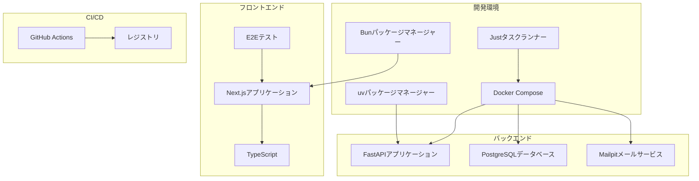
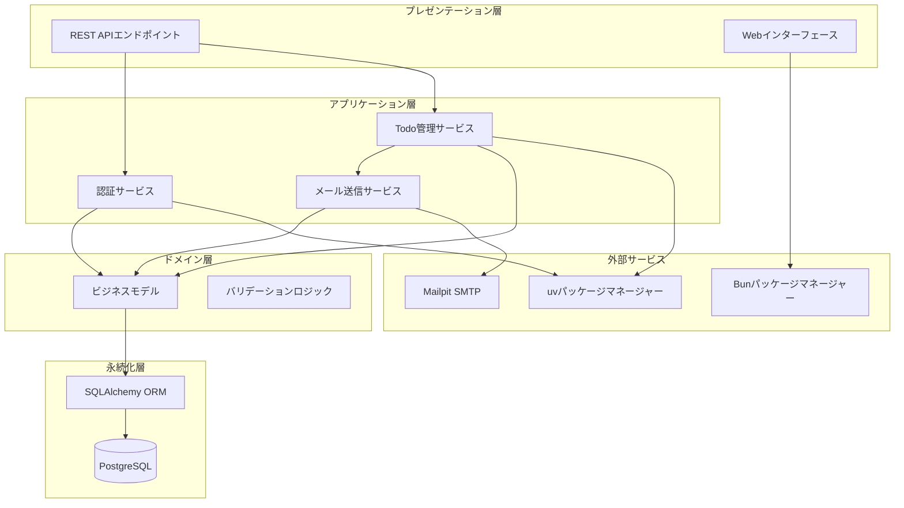
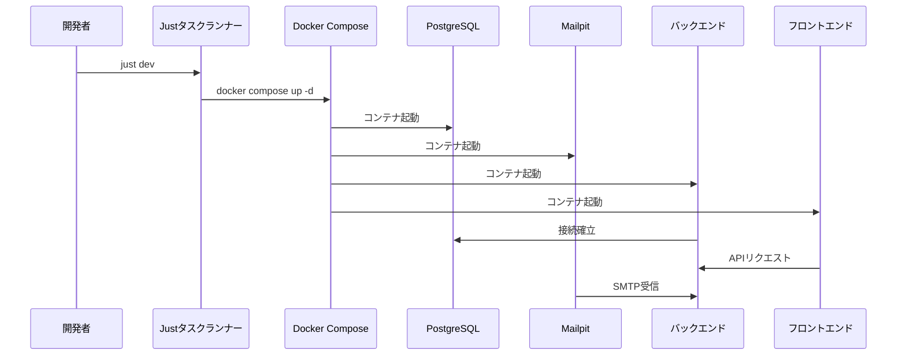
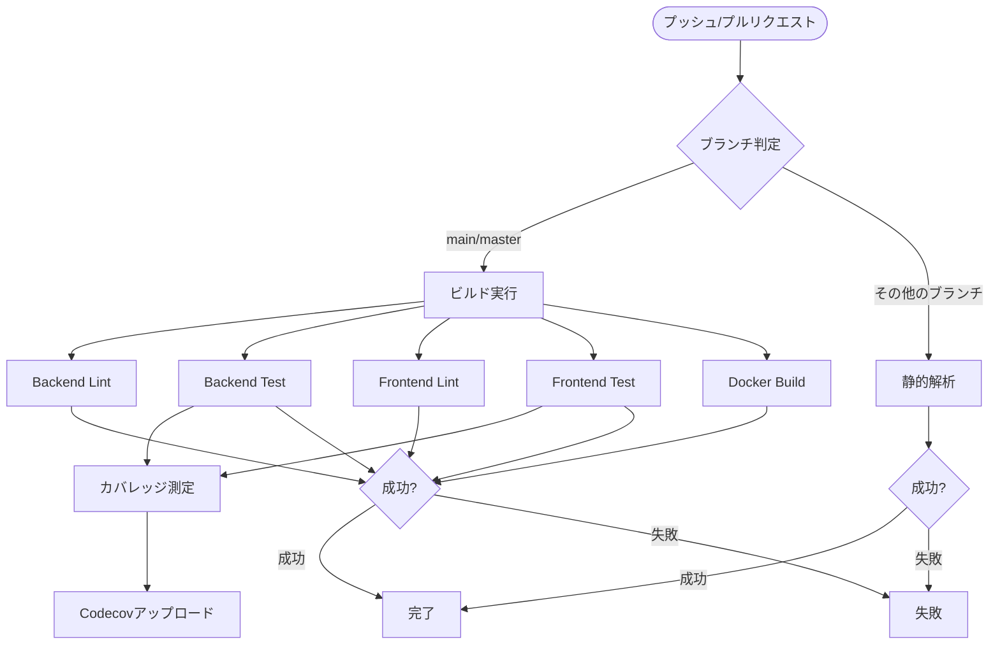
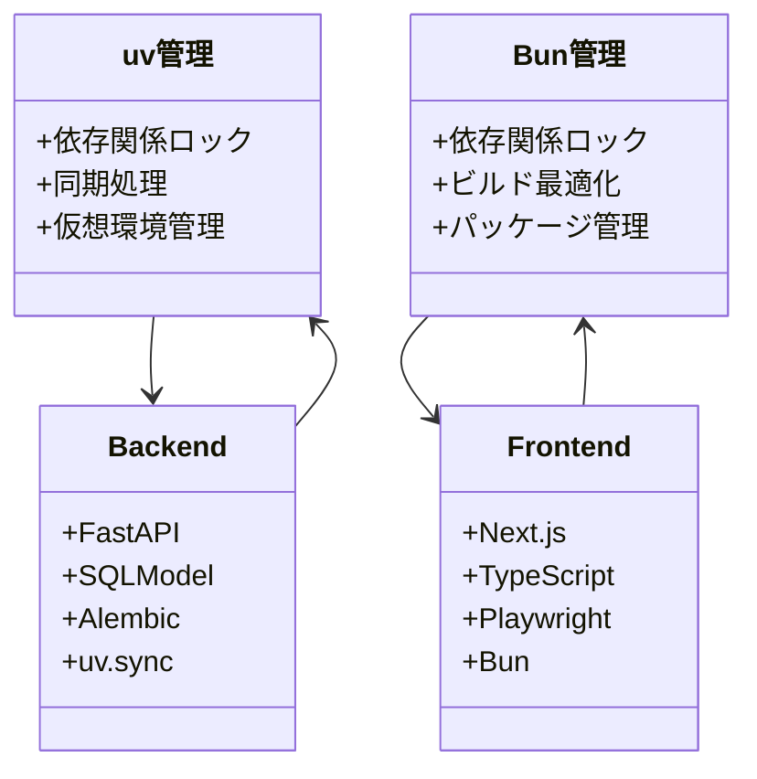
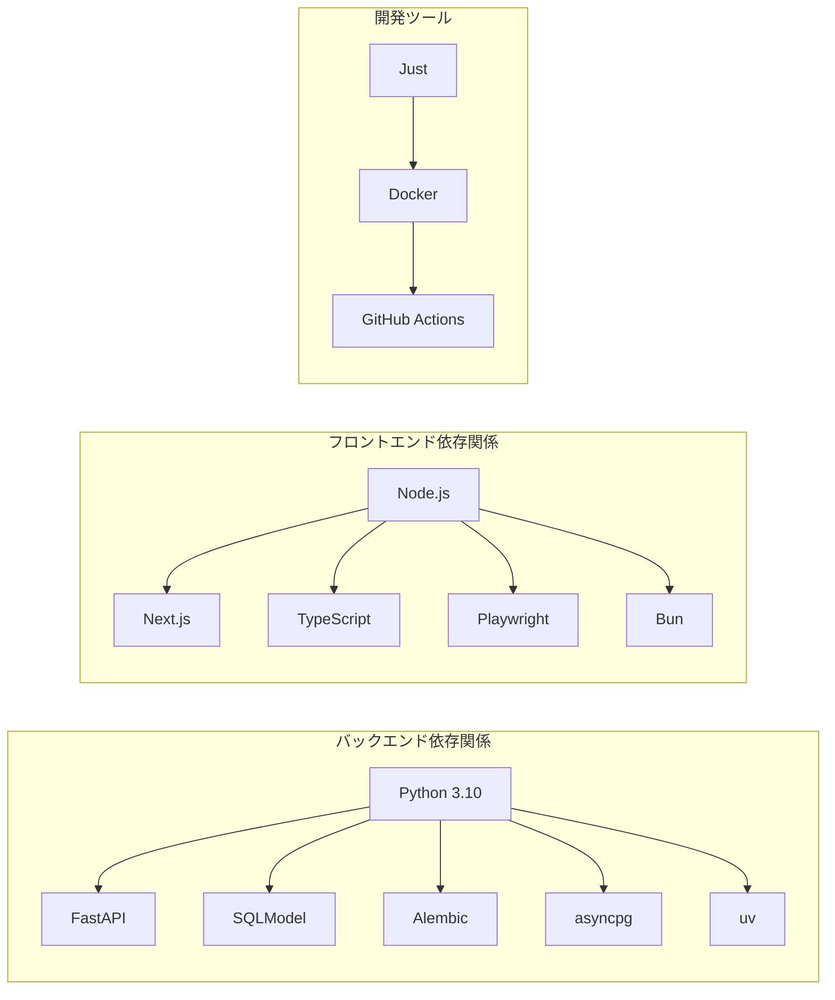

# 開発ワークフロー

<cite>
**この文書で参照されるファイル**
- [justfile](file://justfile)
- [docker-compose.yml](file://docker-compose.yml)
- [backend/pyproject.toml](file://backend/pyproject.toml)
- [frontend/package.json](file://frontend/package.json)
- [.github/workflows/ci.yml](file://.github/workflows/ci.yml)
- [backend/main.py](file://backend/main.py)
- [frontend/next.config.ts](file://frontend/next.config.ts)
- [backend/uv.lock](file://backend/uv.lock)
- [frontend/bun.lock](file://frontend/bun.lock)
- [backend/alembic.ini](file://backend/alembic.ini)
- [frontend/playwright.config.ts](file://frontend/playwright.config.ts)
- [frontend/tsconfig.json](file://frontend/tsconfig.json)
- [backend/pytest.ini](file://backend/pytest.ini)
- [docker/backend/Dockerfile](file://docker/backend/Dockerfile)
</cite>

## 目次
1. [導入](#導入)
2. [プロジェクト構造](#プロジェクト構造)
3. [コアコンポーネント](#コアコンポーネント)
4. [アーキテクチャ概観](#アーキテクチャ概観)
5. [詳細コンポーネント分析](#詳細コンポーネント分析)
6. [依存関係分析](#依存関係分析)
7. [パフォーマンス考慮事項](#パフォーマンス考慮事項)
8. [トラブルシューティングガイド](#トラブルシューティングガイド)
9. [結論](#結論)

## 導入
本プロジェクトは、現代的な開発環境を実現するための包括的なワークフローを提供します。主な特徴には以下の通りです：

- **justタスクランナー**による一貫した開発ワークフロー
- **Dockerコンテナ管理**による環境統一
- **CI/CDパイプライン**による自動化された品質保証
- **uv/Bunによる依存関係管理**による高速なパッケージ処理
- **統合的なテスト戦略**（単体テスト、結合テスト、E2Eテスト）
- **コード品質管理**（静的解析、形式チェック、カバレッジ測定）
- **バージョン管理**（Jujutsuによる分散型バージョン管理）

## プロジェクト構造
プロジェクトはフルスタックで構成されており、バックエンド（Python FastAPI）とフロントエンド（Next.js）の2つの主要なコンポーネントから成り立ちます。

**図のソース**
- [justfile:1-69](file://justfile#L1-L69)
- [docker-compose.yml:1-29](file://docker-compose.yml#L1-L29)
- [backend/pyproject.toml:1-51](file://backend/pyproject.toml#L1-L51)
- [.github/workflows/ci.yml:1-200](file://.github/workflows/ci.yml#L1-L200)

**セクションのソース**
- [justfile:1-69](file://justfile#L1-L69)
- [docker-compose.yml:1-29](file://docker-compose.yml#L1-L29)
- [backend/pyproject.toml:1-51](file://backend/pyproject.toml#L1-L51)
- [.github/workflows/ci.yml:1-200](file://.github/workflows/ci.yml#L1-L200)

## コアコンポーネント
本プロジェクトのコアとなるコンポーネントは以下の通りです：

### 1. Justタスクランナー
Justは、プロジェクト全体の作業を一元的に管理するためのツールです。以下のタスクを提供します：

- **開発環境起動**: `just dev` - DB、バックエンド、フロントエンドを同時に起動
- **データベース管理**: `just db-*` - 移行、リセット、バージョン確認
- **ログ表示**: `just db-logs`, `just backend-logs`, `just frontend-logs`
- **ローカル開発**: `just backend-dev`, `just frontend-dev`

### 2. Dockerコンテナ管理
Docker Composeを使用して以下のコンテナを管理します：

- **PostgreSQL**: メインデータベース（5432ポート公開）
- **Mailpit**: SMTPメールテストサービス（8025, 1025ポート公開）

### 3. 依存関係管理
- **バックエンド**: uv（Pythonパッケージマネージャー）を使用
- **フロントエンド**: Bun（JavaScriptパッケージマネージャー）を使用

### 4. CI/CDパイプライン
GitHub Actionsによる完全な自動化ワークフロー：
- **Backend Lint**: Pythonコードの静的解析と形式チェック
- **Backend Test**: PostgreSQLサービスとの連携テスト
- **Frontend Lint**: TypeScriptコードの静的解析
- **Frontend Test**: 単体テストとカバレッジ測定
- **Docker Build**: コンテナイメージのビルドテスト

**セクションのソース**
- [justfile:1-69](file://justfile#L1-L69)
- [docker-compose.yml:1-29](file://docker-compose.yml#L1-L29)
- [backend/pyproject.toml:1-51](file://backend/pyproject.toml#L1-L51)
- [frontend/package.json:1-65](file://frontend/package.json#L1-L65)
- [.github/workflows/ci.yml:1-200](file://.github/workflows/ci.yml#L1-L200)

## アーキテクチャ概観
本プロジェクトはマイクロサービスアーキテクチャを採用し、以下の層に分けて設計されています。

**図のソース**
- [backend/pyproject.toml:1-51](file://backend/pyproject.toml#L1-L51)
- [frontend/package.json:1-65](file://frontend/package.json#L1-L65)
- [docker-compose.yml:1-29](file://docker-compose.yml#L1-L29)

## 詳細コンポーネント分析

### Dockerコンテナ管理
Docker Composeを使用したコンテナ管理は以下の通りです：

**図のソース**
- [justfile:1-69](file://justfile#L1-L69)
- [docker-compose.yml:1-29](file://docker-compose.yml#L1-L29)

**セクションのソース**
- [docker-compose.yml:1-29](file://docker-compose.yml#L1-L29)
- [docker/backend/Dockerfile:1-10](file://docker/backend/Dockerfile#L1-L10)

### CI/CDパイプライン
GitHub Actionsによる完全な自動化ワークフローは以下のステップで構成されます：

**図のソース**
- [.github/workflows/ci.yml:1-200](file://.github/workflows/ci.yml#L1-L200)

**セクションのソース**
- [.github/workflows/ci.yml:1-200](file://.github/workflows/ci.yml#L1-L200)

### 依存関係管理
uvとBunによる依存関係管理は以下の通りです：

**図のソース**
- [backend/uv.lock:1-521](file://backend/uv.lock#L1-L521)
- [frontend/bun.lock:1-800](file://frontend/bun.lock#L1-L800)

**セクションのソース**
- [backend/uv.lock:1-521](file://backend/uv.lock#L1-L521)
- [frontend/bun.lock:1-800](file://frontend/bun.lock#L1-L800)

### テスト戦略
統合されたテスト戦略は以下の3層で構成されています：

1. **単体テスト**: PyTestを使用したバックエンドの単体テスト
2. **結合テスト**: PostgreSQLサービスとの連携テスト
3. **E2Eテスト**: Playwrightを使用したエンドツーエンドテスト

**セクションのソース**
- [backend/pytest.ini:1-5](file://backend/pytest.ini#L1-L5)
- [frontend/playwright.config.ts:1-66](file://frontend/playwright.config.ts#L1-L66)

## 依存関係分析
プロジェクト全体の依存関係は以下の通りです：

**図のソース**
- [backend/pyproject.toml:1-51](file://backend/pyproject.toml#L1-L51)
- [frontend/package.json:1-65](file://frontend/package.json#L1-L65)
- [justfile:1-69](file://justfile#L1-L69)

**セクションのソース**
- [backend/pyproject.toml:1-51](file://backend/pyproject.toml#L1-L51)
- [frontend/package.json:1-65](file://frontend/package.json#L1-L65)

## パフォーマンス考慮事項
1. **依存関係管理の最適化**
   - uvはC拡張を使用した高速なパッケージインストール
   - BunはNative ESM対応による高速なビルド

2. **Dockerイメージの最適化**
   - 元のPythonイメージからuvバイナリのみコピー
   - 依存関係のキャッシュを利用したビルド

3. **テストの並列実行**
   - GitHub Actionsでの並列処理による高速化
   - PostgreSQLサービスの再利用による起動時間短縮

## トラブルシューティングガイド

### 開発環境起動時の問題
1. **ポート競合**
   - PostgreSQL: 5432番ポートが使用中か確認
   - Mailpit: 8025, 1025番ポートの確認
   - Next.js: 3000番ポートの確認

2. **Dockerコンテナの起動失敗**
   - `just status`でコンテナ状態を確認
   - `just db-logs`でエラーログを確認

### 依存関係の問題
1. **uvパッケージのインストール失敗**
   - `uv sync --frozen`でロックファイルに基づいてインストール
   - Pythonバージョンの互換性を確認

2. **Bunパッケージの問題**
   - `bun install`で依存関係を再インストール
   - `bun.lock`の更新が必要な場合がある

### CI/CDパイプラインの問題
1. **テスト失敗**
   - `just clean-db`でデータベースをリセット
   - `just db-migrate`でマイグレーションを適用

2. **Dockerビルド失敗**
   - Dockerfileの依存関係を確認
   - キャッシュのクリアを行う

**セクションのソース**
- [justfile:1-69](file://justfile#L1-L69)
- [docker-compose.yml:1-29](file://docker-compose.yml#L1-L29)

## 結論
本プロジェクトは、現代的な開発環境を実現するための包括的なワークフローを提供しています。Justタスクランナー、Dockerコンテナ管理、uv/Bunによる依存関係管理、GitHub ActionsによるCI/CDパイプラインを統合することで、効率的で信頼性の高い開発プロセスを実現しています。これにより、開発者はより集中して機能開発に取り組むことができ、品質管理と保守性の向上が期待できます。