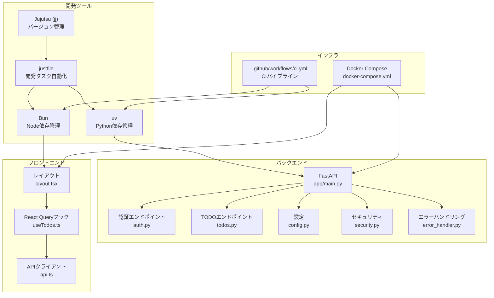
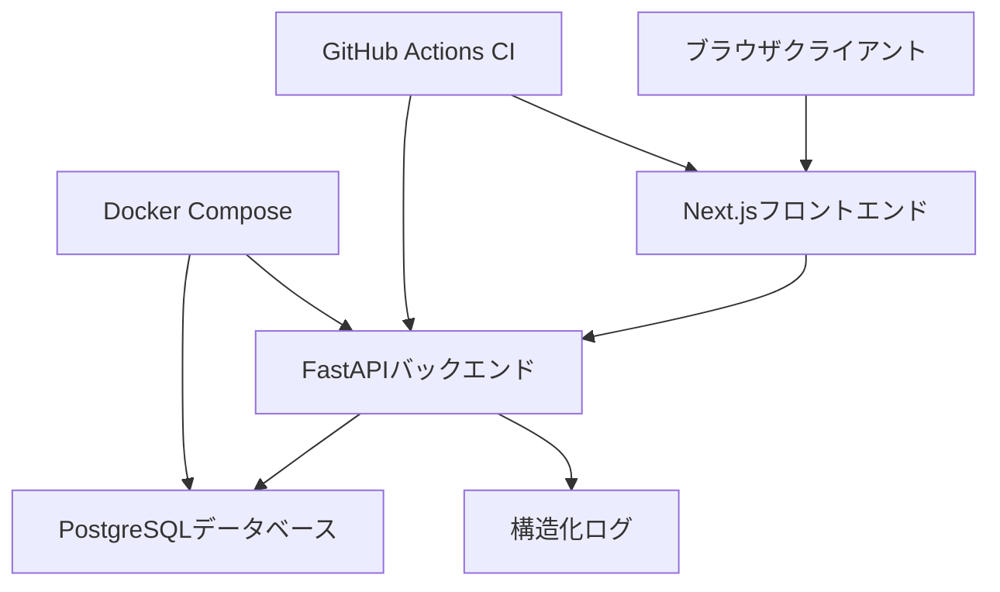
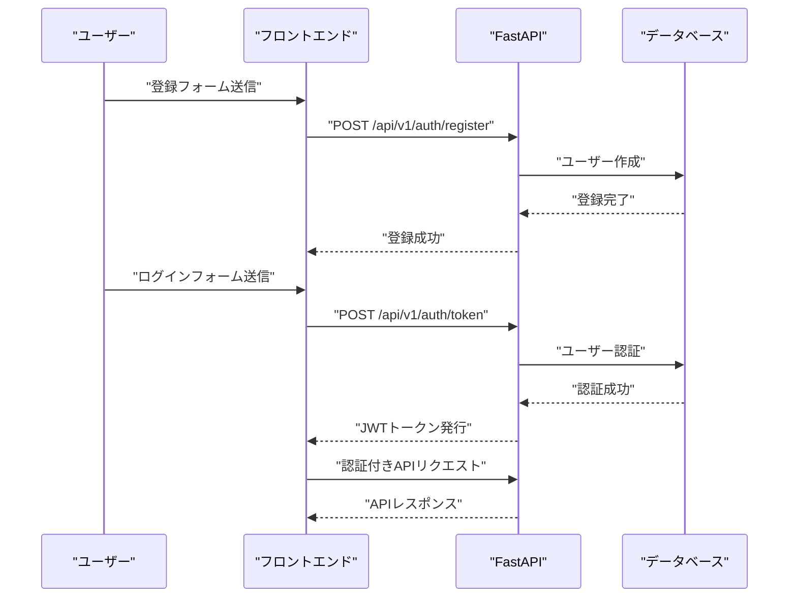
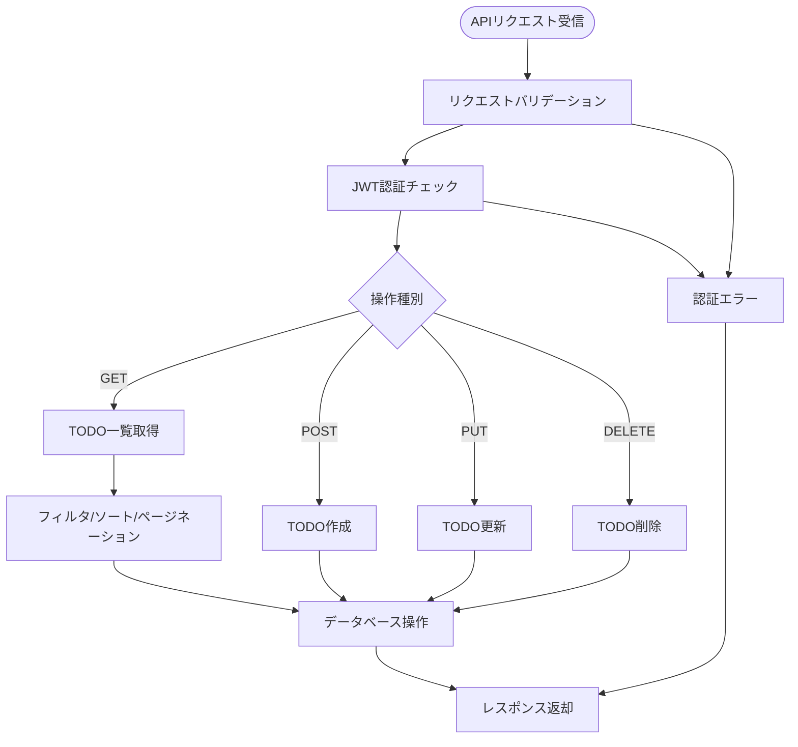
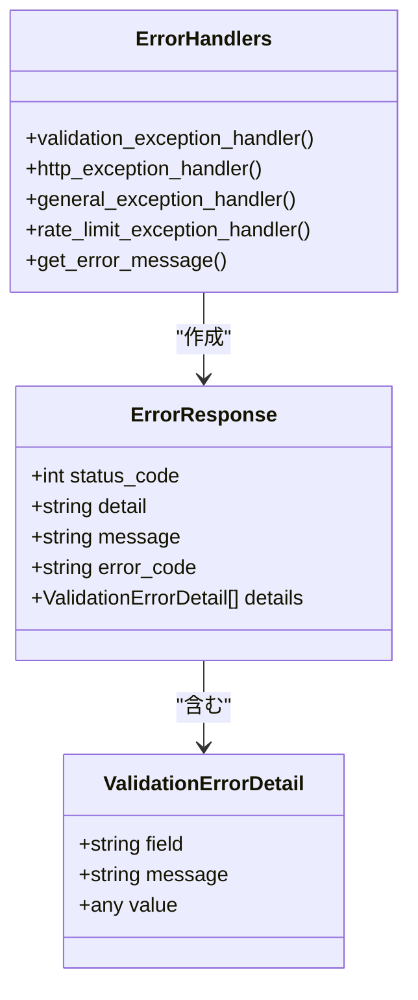
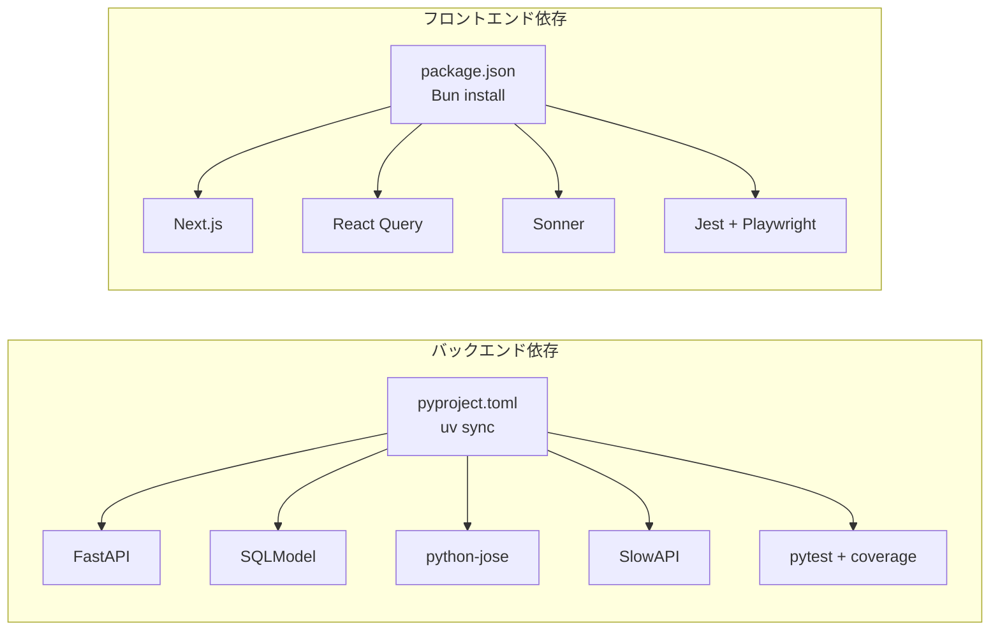

# 開発者ガイド

<cite>
**この文書で参照されるファイル**
- [README.md](file://README.md)
- [justfile](file://justfile)
- [pyproject.toml](file://backend/pyproject.toml)
- [package.json](file://frontend/package.json)
- [docker-compose.yml](file://docker-compose.yml)
- [ci.yml](file://.github/workflows/ci.yml)
- [main.py](file://backend/app/main.py)
- [auth.py](file://backend/app/api/api_v1/endpoints/auth.py)
- [todos.py](file://backend/app/api/api_v1/endpoints/todos.py)
- [layout.tsx](file://frontend/src/app/layout.tsx)
- [useTodos.ts](file://frontend/src/hooks/useTodos.ts)
- [config.py](file://backend/app/core/config.py)
- [security.py](file://backend/app/core/security.py)
- [error_handler.py](file://backend/app/middleware/error_handler.py)
- [user.py (スキーマ)](file://backend/app/schemas/user.py)
- [user.py (モデル)](file://backend/app/models/user.py)
- [api.ts](file://frontend/src/lib/api.ts)
</cite>

## 目次
1. [はじめに](#はじめに)
2. [プロジェクト構造](#プロジェクト構造)
3. [コアコンポーネント](#コアコンポーネント)
4. [アーキテクチャ概観](#アーキテクチャ概観)
5. [詳細コンポーネント分析](#詳細コンポーネント分析)
6. [依存関係分析](#依存関係分析)
7. [性能に関する考慮事項](#性能に関する考慮事項)
8. [トラブルシューティングガイド](#トラブルシューティングガイド)
9. [貢献方法](#貢献方法)
10. [結論](#結論)

## はじめに
本ガイドは、Jujutsu（jj）によるバージョン管理、開発タスクの自動化（justfile）、依存関係管理（uv、Bun）、コードレビューのガイドライン、バグ報告とフィードバックの方法について、Todoアプリケーションの開発フローと貢献方法を説明します。また、プロジェクトの設計思想、保守性の向上、品質保証のためのベストプラクティスも示します。

## プロジェクト構造
本プロジェクトは、バックエンド（FastAPI）とフロントエンド（Next.js）の2つの主要なコンポーネントから構成され、Dockerによるコンテナ化が行われています。開発タスクはjustfileを通じて一元管理され、CIパイプラインはGitHub Actionsによって自動化されています。

**図の出典**
- [main.py:1-168](file://backend/app/main.py#L1-L168)
- [auth.py:1-53](file://backend/app/api/api_v1/endpoints/auth.py#L1-L53)
- [todos.py:1-102](file://backend/app/api/api_v1/endpoints/todos.py#L1-L102)
- [config.py:1-73](file://backend/app/core/config.py#L1-L73)
- [security.py:1-35](file://backend/app/core/security.py#L1-L35)
- [error_handler.py:1-149](file://backend/app/middleware/error_handler.py#L1-L149)
- [layout.tsx:1-40](file://frontend/src/app/layout.tsx#L1-L40)
- [useTodos.ts:1-119](file://frontend/src/hooks/useTodos.ts#L1-L119)
- [api.ts:1-110](file://frontend/src/lib/api.ts#L1-L110)
- [docker-compose.yml:1-16](file://docker-compose.yml#L1-L16)
- [ci.yml:1-200](file://.github/workflows/ci.yml#L1-L200)

**節の出典**
- [README.md:143-242](file://README.md#L143-L242)
- [justfile:1-69](file://justfile#L1-L69)

## コアコンポーネント
- 認証システム：JWTベースの認証、パスワードハッシュ化（Argon2）、認可エンドポイント
- TODO管理：CRUD操作、フィルタリング、ソート、ページネーション
- API仕様：OpenAPI/Swagger、Scalar統合、認証スキーマ
- エラーハンドリング：統一エラーレスポンス、ロギング、Rate Limit
- 健康診断：DB接続チェック、プロセス時間ヘッダー

**節の出典**
- [auth.py:17-53](file://backend/app/api/api_v1/endpoints/auth.py#L17-L53)
- [todos.py:13-102](file://backend/app/api/api_v1/endpoints/todos.py#L13-L102)
- [main.py:49-128](file://backend/app/main.py#L49-L128)
- [error_handler.py:15-149](file://backend/app/middleware/error_handler.py#L15-L149)

## アーキテクチャ概観
本システムは、ブラウザクライアントがNext.jsフロントエンドを介してFastAPIバックエンドにREST APIリクエストを行う、クライアント-サーバーアーキテクチャです。DockerコンテナでPostgreSQLデータベースを提供し、CIパイプラインで継続的インテグレーションが実施されます。

**図の出典**
- [README.md:60-142](file://README.md#L60-L142)
- [main.py:1-168](file://backend/app/main.py#L1-L168)
- [docker-compose.yml:1-16](file://docker-compose.yml#L1-L16)
- [ci.yml:1-200](file://.github/workflows/ci.yml#L1-L200)

## 詳細コンポーネント分析

### 認証フロー
JWTベースの認証プロセスは、ユーザー登録→トークン取得→認証付きAPIアクセスという流れです。パスワードはArgon2でハッシュ化され、JWTトークンには有効期限が設定されます。

**図の出典**
- [README.md:106-111](file://README.md#L106-L111)
- [auth.py:17-53](file://backend/app/api/api_v1/endpoints/auth.py#L17-L53)
- [security.py:10-35](file://backend/app/core/security.py#L10-L35)
- [api.ts:64-102](file://frontend/src/lib/api.ts#L64-L102)

**節の出典**
- [auth.py:17-53](file://backend/app/api/api_v1/endpoints/auth.py#L17-L53)
- [security.py:10-35](file://backend/app/core/security.py#L10-L35)
- [config.py:52-53](file://backend/app/core/config.py#L52-L53)

### TODO管理フロー
TODOのCRUD操作は、クエリパラメータによるフィルタリング、ソート、ページネーションに対応しています。React Queryを使用したクライアントサイドの状態管理が実装されています。

**図の出典**
- [todos.py:13-102](file://backend/app/api/api_v1/endpoints/todos.py#L13-L102)
- [useTodos.ts:26-119](file://frontend/src/hooks/useTodos.ts#L26-L119)

**節の出典**
- [todos.py:13-102](file://backend/app/api/api_v1/endpoints/todos.py#L13-L102)
- [useTodos.ts:26-119](file://frontend/src/hooks/useTodos.ts#L26-L119)

### APIエラーハンドリング
統一されたエラーレスポンス形式を提供し、バリデーションエラー、HTTP例外、Rate Limit超過、予期せぬエラーに対して適切な処理を行います。構造化ログを伴い、エラー詳細を記録します。

**図の出典**
- [error_handler.py:15-149](file://backend/app/middleware/error_handler.py#L15-L149)

**節の出典**
- [error_handler.py:15-149](file://backend/app/middleware/error_handler.py#L15-L149)

## 依存関係分析
バックエンドとフロントエンドそれぞれの依存関係管理は、uv（Python）とBun（Node）によって行われています。CIパイプラインでは、uvとBunのセットアップが自動化されています。

**図の出典**
- [pyproject.toml:1-47](file://backend/pyproject.toml#L1-L47)
- [package.json:1-65](file://frontend/package.json#L1-L65)
- [ci.yml:23-38](file://.github/workflows/ci.yml#L23-L38)

**節の出典**
- [pyproject.toml:1-47](file://backend/pyproject.toml#L1-L47)
- [package.json:1-65](file://frontend/package.json#L1-L65)
- [ci.yml:23-38](file://.github/workflows/ci.yml#L23-L38)

## 性能に関する考慮事項
- 非同期処理：SQLModelの非同期ORMを使用し、DBアクセスのパフォーマンスを向上
- Rate Limit：SlowAPIによる認証エンドポイントの保護（5/分）とデフォルト（100/分）
- 構造化ログ：JSON形式でのログ出力により、パフォーマンスモニタリングが容易
- キャッシュ戦略：React Queryによるクライアントサイドキャッシュと自動リフェッチ
- Docker最適化：軽量Alpineイメージを使用したコンテナサイズの削減

## トラブルシューティングガイド
- 起動時エラー：`uv sync`で依存関係のインストール、`just dev`で一括起動
- DB接続エラー：`just clean-db`でデータベースの再初期化、`just db-migrate`でマイグレーション実行
- 認証エラー：`/health`エンドポイントでDB接続確認、JWTトークンの有効期限確認
- APIエラー：統一エラーレスポンスを確認し、エラーメッセージの詳細を確認
- CIエラー：`.github/workflows/ci.yml`のステップを確認し、依存関係のバージョンを調整

**節の出典**
- [justfile:3-69](file://justfile#L3-L69)
- [main.py:134-168](file://backend/app/main.py#L134-L168)
- [error_handler.py:15-149](file://backend/app/middleware/error_handler.py#L15-L149)
- [ci.yml:1-200](file://.github/workflows/ci.yml#L1-L200)

## 貢献方法
1. Jujutsu（jj）によるブランチ作成
   - `jj new`で新しい変更セットを作成
   - `jj describe`で変更内容を記述
2. 開発タスクの実行
   - `just dev`で開発環境全体の起動
   - `just backend-dev`、`just frontend-dev`で個別起動
3. テストの実行
   - `uv run pytest`でバックエンドテスト
   - `bun run test`でフロントエンドテスト
4. コミットとプッシュ
   - `jj commit`で変更をコミット
   - `jj push`でリモートにプッシュ
5. プルリクエストの作成
   - GitHubでプルリクエストを作成
   - コードレビューを受ける

### コードレビューのガイドライン
- 変更範囲の明確化：1つのプルリクエストに1つのテーマを絞る
- テストの追加：機能追加には対応するテストを含める
- ドキュメント更新：API変更や新機能についてはドキュメントを更新
- セキュリティチェック：認証・認可の変更は特に注意
- 性能影響の評価：パフォーマンスに影響する変更は計測する

### バグ報告とフィードバック
- GitHub Issuesを使用して報告
- 再現手順、期待動作、実際の動作を明確に記載
- 環境情報（OS、ブラウザ、バージョン）を記載
- スクリーンショットやログを添付

**節の出典**
- [README.md:279-294](file://README.md#L279-L294)
- [justfile:1-69](file://justfile#L1-L69)
- [ci.yml:1-200](file://.github/workflows/ci.yml#L1-L200)

## 結論
本プロジェクトは、現代的なWeb開発スタック（FastAPI + Next.js + PostgreSQL）を活用し、Jujutsuによる効率的なバージョン管理、justfileによる開発タスクの自動化、uv/Bunによる依存関係管理を通じて、保守性と品質を両立した開発フローを提供しています。CIパイプラインの導入により、継続的インテグレーションとしての品質保証が実現されており、貢献者が安全かつ効率的に機能追加や改善を行うことができます。