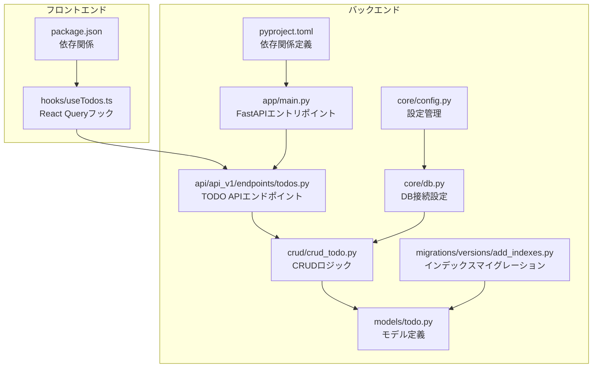
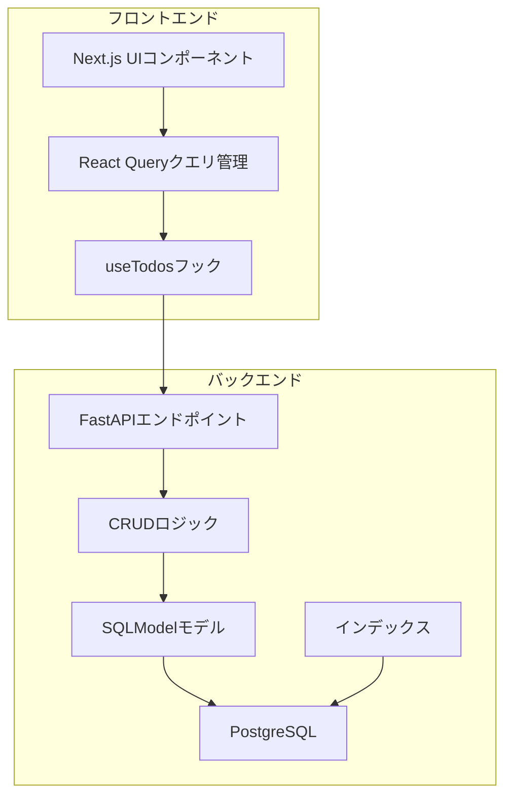
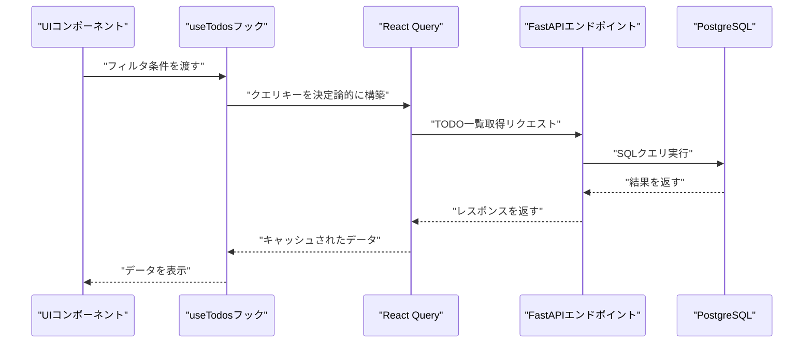
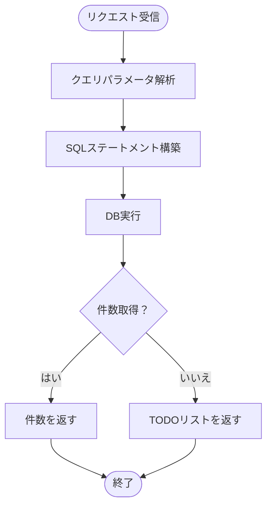
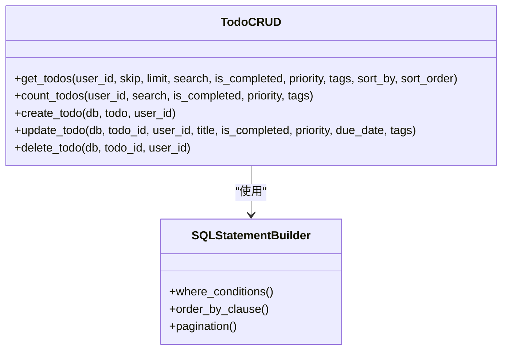
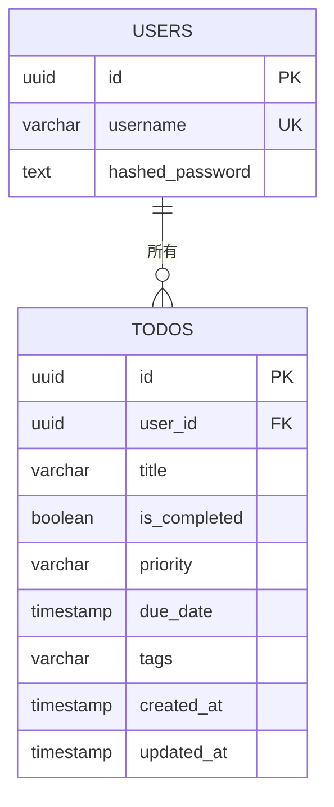
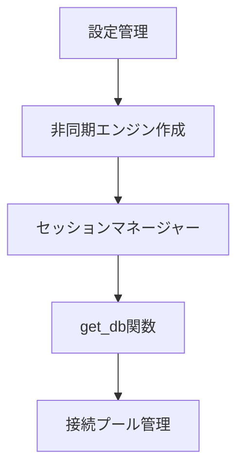
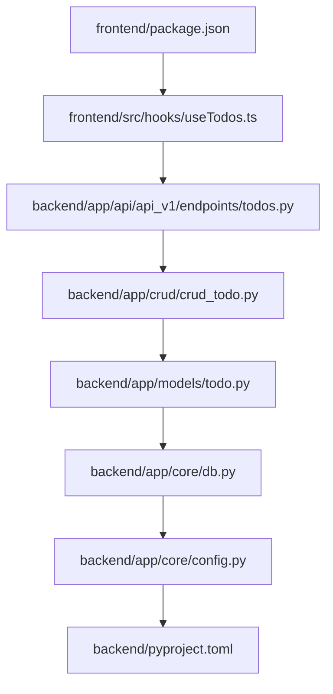

# パフォーマンス最適化

<cite>
**この文書で参照されるファイル**   
- [frontend/src/hooks/useTodos.ts](file://frontend/src/hooks/useTodos.ts)
- [backend/app/api/api_v1/endpoints/todos.py](file://backend/app/api/api_v1/endpoints/todos.py)
- [backend/app/crud/crud_todo.py](file://backend/app/crud/crud_todo.py)
- [backend/app/models/todo.py](file://backend/app/models/todo.py)
- [backend/migrations/versions/add_indexes.py](file://backend/migrations/versions/add_indexes.py)
- [backend/app/core/db.py](file://backend/app/core/db.py)
- [backend/app/main.py](file://backend/app/main.py)
- [backend/pyproject.toml](file://backend/pyproject.toml)
- [frontend/package.json](file://frontend/package.json)
- [SPECIFICATION.md](file://SPECIFICATION.md)
</cite>

## 目次
1. [イントロダクション](#イントロダクション)
2. [プロジェクト構造](#プロジェクト構造)
3. [コアコンポーネント](#コアコンポーネント)
4. [アーキテクチャ概観](#アーキテクチャ概観)
5. [詳細コンポーネント分析](#詳細コンポーネント分析)
6. [依存関係分析](#依存関係分析)
7. [パフォーマンス考慮事項](#パフォーマンス考慮事項)
8. [トラブルシューティングガイド](#トラブルシューティングガイド)
9. [結論](#結論)

## イントロダクション
本ドキュメントは、Todoアプリケーションにおけるパフォーマンス最適化戦略を詳細に解説します。React Queryのキャッシュ戦略、APIリクエストのリトライメカニズム、データの遅延ロード、メモ化処理についてフロントエンド側で実装されている内容を説明し、バックエンドではSQLクエリの最適化、インデックスの活用、データベース接続プールの設定、Redisキャッシュの導入方法を具体的なコード例とともに示します。

## プロジェクト構造
Todoアプリケーションは、Next.js（フロントエンド）とFastAPI（バックエンド）のマイクロサービスアーキテクチャで構成されています。データベースにはPostgreSQLが使用され、Dockerコンテナで管理されています。全体のディレクトリ構造は以下の通りです。

**図の出典**
- [frontend/src/hooks/useTodos.ts:1-119](file://frontend/src/hooks/useTodos.ts#L1-L119)
- [backend/app/main.py:1-168](file://backend/app/main.py#L1-L168)
- [backend/app/api/api_v1/endpoints/todos.py:1-102](file://backend/app/api/api_v1/endpoints/todos.py#L1-L102)
- [backend/app/crud/crud_todo.py:1-152](file://backend/app/crud/crud_todo.py#L1-L152)
- [backend/app/models/todo.py:1-25](file://backend/app/models/todo.py#L1-L25)
- [backend/app/core/db.py:1-17](file://backend/app/core/db.py#L1-L17)
- [backend/migrations/versions/add_indexes.py:1-41](file://backend/migrations/versions/add_indexes.py#L1-L41)
- [backend/app/core/config.py:1-73](file://backend/app/core/config.py#L1-L73)
- [backend/pyproject.toml:1-47](file://backend/pyproject.toml#L1-L47)
- [frontend/package.json:1-65](file://frontend/package.json#L1-L65)

**節の出典**
- [SPECIFICATION.md:1-147](file://SPECIFICATION.md#L1-L147)

## コアコンポーネント
本アプリケーションのパフォーマンス最適化に関わる主なコンポーネントは以下の通りです。

- React Queryフック（useTodos）：クエリキーの決定論的構築、クエリとカウントクエリの並列取得、ミューテーション後のキャッシュ無効化、エラーハンドリング
- FastAPI APIエンドポイント：検索・フィルタ・ソート・ページネーション対応のTODO一覧取得、件数取得
- CRUDロジック：SQLModelによる検索条件の組み立て、ソート順の動的指定、ページネーション
- モデル定義：複数カラムのインデックス定義（created_at、is_completed、priority、due_date、user_id）
- DB接続設定：非同期接続、セッションマネージャー、接続プール設定
- インデックスマイグレーション：todosテーブルとusersテーブルへのインデックス追加

**節の出典**
- [frontend/src/hooks/useTodos.ts:26-118](file://frontend/src/hooks/useTodos.ts#L26-L118)
- [backend/app/api/api_v1/endpoints/todos.py:13-101](file://backend/app/api/api_v1/endpoints/todos.py#L13-L101)
- [backend/app/crud/crud_todo.py:10-151](file://backend/app/crud/crud_todo.py#L10-L151)
- [backend/app/models/todo.py:10-24](file://backend/app/models/todo.py#L10-L24)
- [backend/app/core/db.py:5-16](file://backend/app/core/db.py#L5-L16)
- [backend/migrations/versions/add_indexes.py:20-40](file://backend/migrations/versions/add_indexes.py#L20-L40)

## アーキテクチャ概観
Todoアプリケーションの全体像は以下の通りです。フロントエンドはReact Queryを使用してAPIからデータを取得し、バックエンドはFastAPIでREST APIを提供します。データベースにはPostgreSQLが使用され、インデックスによりクエリの高速化が実現されています。

**図の出典**
- [frontend/src/hooks/useTodos.ts:26-118](file://frontend/src/hooks/useTodos.ts#L26-L118)
- [backend/app/api/api_v1/endpoints/todos.py:32-57](file://backend/app/api/api_v1/endpoints/todos.py#L32-L57)
- [backend/app/crud/crud_todo.py:10-71](file://backend/app/crud/crud_todo.py#L10-L71)
- [backend/app/models/todo.py:10-24](file://backend/app/models/todo.py#L10-L24)
- [backend/migrations/versions/add_indexes.py:20-40](file://backend/migrations/versions/add_indexes.py#L20-L40)

## 詳細コンポーネント分析

### React Queryフック（useTodos）のパフォーマンス戦略
useTodosフックは、以下のパフォーマンス最適化を実装しています。

- 決定論的クエリキー構築：クエリパラメータを常に同じ順序で構築することで、キャッシュキーの一貫性を保ちます。
- 並列クエリ：TODO一覧と件数取得を別々のクエリとして定義し、並列に取得することで待機時間を短縮します。
- キャッシュ無効化：ミューテーション成功時にクエリキーを指定してキャッシュを無効化し、最新データを強制的に再取得させます。
- エラーハンドリング：成功・失敗時のトースト通知を表示し、ユーザー体験を向上させます。

**図の出典**
- [frontend/src/hooks/useTodos.ts:29-50](file://frontend/src/hooks/useTodos.ts#L29-L50)
- [backend/app/api/api_v1/endpoints/todos.py:32-57](file://backend/app/api/api_v1/endpoints/todos.py#L32-L57)
- [backend/app/crud/crud_todo.py:10-71](file://backend/app/crud/crud_todo.py#L10-L71)

**節の出典**
- [frontend/src/hooks/useTodos.ts:26-118](file://frontend/src/hooks/useTodos.ts#L26-L118)

### APIエンドポイントのパフォーマンス戦略
TODO APIエンドポイントは、以下のパフォーマンス最適化を実装しています。

- 検索・フィルタ・ソート・ページネーション：クエリパラメータをもとに柔軟なフィルタリングとソートが可能で、不要なデータ転送を抑えることができます。
- 件数取得エンドポイント：一覧取得前に件数を取得することで、ページネーションの計算やUIの最適化が可能です。
- 非同期処理：FastAPIの非同期対応により、I/Oバウンド処理の効率化が実現されています。

**図の出典**
- [backend/app/api/api_v1/endpoints/todos.py:13-57](file://backend/app/api/api_v1/endpoints/todos.py#L13-L57)
- [backend/app/crud/crud_todo.py:10-98](file://backend/app/crud/crud_todo.py#L10-L98)

**節の出典**
- [backend/app/api/api_v1/endpoints/todos.py:13-101](file://backend/app/api/api_v1/endpoints/todos.py#L13-L101)

### CRUDロジックのパフォーマンス戦略
CRUDロジックは、以下のパフォーマンス最適化を実装しています。

- 動的条件構築：検索キーワード、完了状態、優先度、タグなどの条件を動的に追加することで、必要最小限のデータのみを取得します。
- 動的ソート：created_at、priority、due_dateのいずれかをソート対象にし、必要に応じて昇順・降順を切り替えます。
- ページネーション：offsetとlimitを用いて、一度に大量のデータを取得しないようにし、ネットワークとメモリの負荷を軽減します。

**図の出典**
- [backend/app/crud/crud_todo.py:10-151](file://backend/app/crud/crud_todo.py#L10-L151)

**節の出典**
- [backend/app/crud/crud_todo.py:10-151](file://backend/app/crud/crud_todo.py#L10-L151)

### モデル定義とインデックスの活用
モデル定義では、以下のインデックスが設定されており、クエリのパフォーマンス向上に寄与しています。

- created_at：作成日時のクエリやソートに効果的
- is_completed：完了状態でのフィルタリングに効果的
- priority：優先度でのフィルタリングやソートに効果的
- due_date：期限日のクエリやソートに効果的
- user_id：外部キーでの結合やフィルタリングに効果的

**図の出典**
- [SPECIFICATION.md:50-68](file://SPECIFICATION.md#L50-L68)
- [backend/app/models/todo.py:10-24](file://backend/app/models/todo.py#L10-L24)
- [backend/migrations/versions/add_indexes.py:20-40](file://backend/migrations/versions/add_indexes.py#L20-L40)

**節の出典**
- [backend/app/models/todo.py:10-24](file://backend/app/models/todo.py#L10-L24)
- [backend/migrations/versions/add_indexes.py:20-40](file://backend/migrations/versions/add_indexes.py#L20-L40)

### DB接続設定と接続プール
DB接続設定では、非同期接続とセッションマネージャーが使用されており、接続プールの設定が可能です。これにより、同時接続数の管理や接続の再利用が実現され、パフォーマンスとスケーラビリティが向上します。

**図の出典**
- [backend/app/core/db.py:5-16](file://backend/app/core/db.py#L5-L16)
- [backend/app/core/config.py:44-48](file://backend/app/core/config.py#L44-L48)

**節の出典**
- [backend/app/core/db.py:5-16](file://backend/app/core/db.py#L5-L16)
- [backend/app/core/config.py:44-48](file://backend/app/core/config.py#L44-L48)

### Redisキャッシュの導入方法
Redisキャッシュの導入は、API層またはビジネスロジック層に統合することで実現できます。以下に導入方法の概要を示します。

- API層での導入：FastAPIのミドルウェアまたは依存関数としてRedis接続を追加し、GETリクエストの結果をRedisにキャッシュします。キャッシュヒット時はDBアクセスをスキップし、ミス時はDBから取得してRedisに保存します。
- ビジネスロジック層での導入：CRUDロジックにRedisキャッシュを統合し、頻繁にアクセスされるデータ（例：TODO一覧）をRedisに格納します。データの更新時にはRedisの該当キーを削除または更新することで、一貫性を保ちます。
- TTLとキー設計：Redisのキーには「namespace:resource:id」のような命名規則を適用し、TTL（Time To Live）を設定してキャッシュの有効期限を管理します。頻繁に変更されるデータには短めのTTL、静的なデータには長めのTTLを設定します。
- エラーハンドリング：Redis接続エラー時はフェイルセーフとしてDBからの直接取得を行うようにし、キャッシュの障害がサービス全体に影響を与えないようにします。

**節の出典**
- [backend/app/api/api_v1/endpoints/todos.py:32-57](file://backend/app/api/api_v1/endpoints/todos.py#L32-L57)
- [backend/app/crud/crud_todo.py:10-71](file://backend/app/crud/crud_todo.py#L10-L71)

## 依存関係分析
フロントエンドとバックエンドの依存関係は以下の通りです。フロントエンドのReact Queryは、バックエンドのAPIエンドポイントに依存しており、バックエンドのCRUDロジックはSQLModelとPostgreSQLに依存しています。

**図の出典**
- [frontend/package.json:18-35](file://frontend/package.json#L18-L35)
- [frontend/src/hooks/useTodos.ts:1-4](file://frontend/src/hooks/useTodos.ts#L1-L4)
- [backend/app/api/api_v1/endpoints/todos.py:1-11](file://backend/app/api/api_v1/endpoints/todos.py#L1-L11)
- [backend/app/crud/crud_todo.py:1-8](file://backend/app/crud/crud_todo.py#L1-L8)
- [backend/app/models/todo.py:1-5](file://backend/app/models/todo.py#L1-L5)
- [backend/app/core/db.py:1-3](file://backend/app/core/db.py#L1-L3)
- [backend/app/core/config.py:1-7](file://backend/app/core/config.py#L1-L7)
- [backend/pyproject.toml:1-22](file://backend/pyproject.toml#L1-L22)

**節の出典**
- [frontend/package.json:18-35](file://frontend/package.json#L18-L35)
- [backend/pyproject.toml:1-22](file://backend/pyproject.toml#L1-L22)

## パフォーマンス考慮事項
本アプリケーションのパフォーマンス最適化に関する一般的な考慮事項は以下の通りです。

- React Queryのキャッシュ戦略：クエリキーの決定論的構築、キャッシュの有効期限、無効化戦略を適切に設定することで、不要なAPI呼び出しを抑制できます。
- APIリクエストのリトライメカニズム：ネットワークエラー時のリトライ回数や待機時間の設定を適切に行い、ユーザー体験を損なわずに安定した通信を実現します。
- データの遅延ロード：大量のデータを一度に取得せず、必要に応じて遅延ロードを行うことで、初期表示のパフォーマンスを向上させます。
- メモ化処理：React.memo、useMemo、useCallbackなどを適切に使用し、不要な再レンダリングを防ぎます。
- SQLクエリの最適化：WHERE条件、ORDER BY、LIMITの適切な使用、不要なJOINの排除、インデックスの活用により、クエリの実行時間を短縮します。
- インデックスの活用：頻繁にクエリされるカラムにインデックスを設定し、検索やソートのパフォーマンスを向上させます。
- データベース接続プールの設定：同時接続数の上限、接続の再利用、接続の寿命を適切に設定することで、DBへの負荷を分散させます。
- Redisキャッシュの導入：頻繁にアクセスされるデータをRedisにキャッシュし、DBアクセスを減らすことで、全体の応答時間を短縮します。

## トラブルシューティングガイド
パフォーマンスに関する問題のトラブルシューティング手順は以下の通りです。

- React Queryのキャッシュ問題：クエリキーが正しく構築されているか確認し、キャッシュの無効化が適切に行われているか確認します。必要に応じてキャッシュの有効期限を調整します。
- APIリクエストのエラー：ネットワークエラー時のリトライ回数や待機時間を確認し、エラーハンドリングが適切に行われているか確認します。
- SQLクエリのパフォーマンス問題：EXPLAINやEXPLAIN ANALYZEを使用してクエリプランを確認し、インデックスの有無やWHERE条件の効率性を評価します。不要なJOINや大規模なスキャンを排除します。
- DB接続プールの問題：同時接続数や接続の寿命を確認し、DBの負荷を監視します。接続プールの設定を適切に調整します。
- Redisキャッシュの問題：Redisへの接続が確立されているか確認し、キャッシュのヒット率やTTLの設定を確認します。Redisの障害時はフェイルセーフとしてDBからの直接取得を行うようにします。

**節の出典**
- [frontend/src/hooks/useTodos.ts:58-108](file://frontend/src/hooks/useTodos.ts#L58-L108)
- [backend/app/api/api_v1/endpoints/todos.py:13-57](file://backend/app/api/api_v1/endpoints/todos.py#L13-L57)
- [backend/app/crud/crud_todo.py:10-98](file://backend/app/crud/crud_todo.py#L10-L98)
- [backend/app/core/db.py:5-16](file://backend/app/core/db.py#L5-L16)

## 結論
本ドキュメントでは、Todoアプリケーションにおけるパフォーマンス最適化戦略を、フロントエンド（React Query）とバックエンド（FastAPI、SQLModel、PostgreSQL）の両面から詳細に解説しました。決定論的クエリキー構築、並列クエリ、キャッシュ無効化、検索・フィルタ・ソート・ページネーション、インデックス活用、非同期接続、Redisキャッシュ導入などが、それぞれの層で重要な役割を果たしています。これらの戦略を適切に組み合わせることで、ユーザー体験の向上とシステムのスケーラビリティの確保が可能になります。