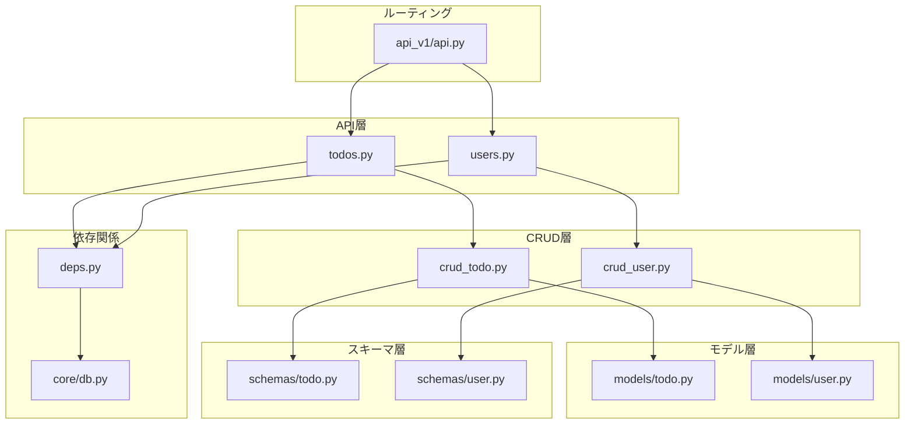
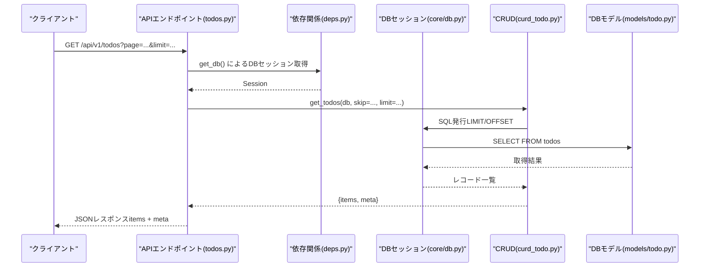
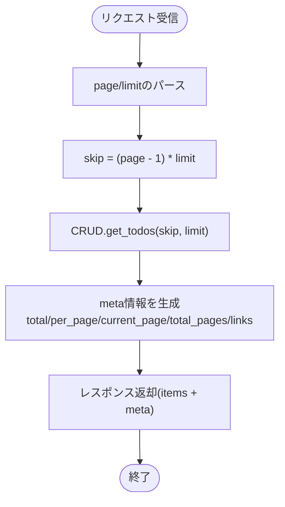
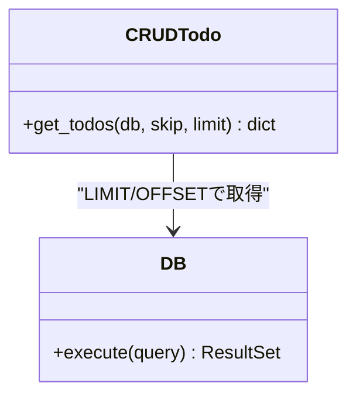
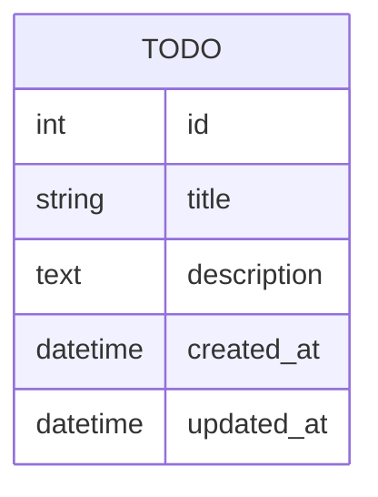
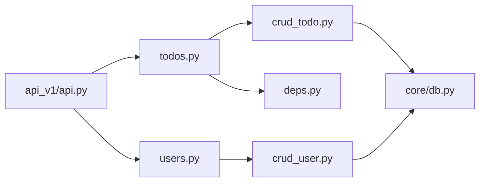

# ページネーション

<cite>
**このドキュメントで参照されるファイル**
- [backend/app/api/api_v1/endpoints/todos.py](file://backend/app/api/api_v1/endpoints/todos.py)
- [backend/app/crud/crud_todo.py](file://backend/app/crud/crud_todo.py)
- [backend/app/models/todo.py](file://backend/app/models/todo.py)
- [backend/migrations/versions/add_indexes.py](file://backend/migrations/versions/add_indexes.py)
- [backend/app/api/api_v1/endpoints/users.py](file://backend/app/api/api_v1/endpoints/users.py)
- [backend/app/crud/crud_user.py](file://backend/app/crud/crud_user.py)
- [backend/app/models/user.py](file://backend/app/models/user.py)
- [backend/app/schemas/todo.py](file://backend/app/schemas/todo.py)
- [backend/app/schemas/user.py](file://backend/app/schemas/user.py)
- [backend/app/api/deps.py](file://backend/app/api/deps.py)
- [backend/app/core/db.py](file://backend/app/core/db.py)
- [backend/app/api/api_v1/api.py](file://backend/app/api/api_v1/api.py)
- [backend/app/main.py](file://backend/app/main.py)
- [backend/tests/test_todos.py](file://backend/tests/test_todos.py)
</cite>

## 目次
1. [はじめに](#はじめに)
2. [プロジェクト構造](#プロジェクト構造)
3. [コアコンポーネント](#コアコンポーネント)
4. [アーキテクチャ概観](#アーキテクチャ概観)
5. [詳細コンポーネント分析](#詳細コンポーネント分析)
6. [依存関係分析](#依存関係分析)
7. [パフォーマンス考慮事項](#パフォーマンス考慮事項)
8. [トラブルシューティングガイド](#トラブルシューティングガイド)
9. [結論](#結論)

## はじめに
本ドキュメントでは、Todoアプリケーションにおける「ページネーション機能」の実装詳細について解説します。特に以下の点に焦点を当てます：
- ページサイズの設定方法
- カーソルベースのナビゲーションの仕組み
- 前後のページ遷移の処理方法
- APIレスポンスのメタデータ構造
- クエリパラメータ（page、limit）の扱い
- パフォーマンス最適化のためのインデックス活用方法

本実装はFastAPIベースのバックエンドにおいて、TodoとUserのリスト取得APIを通じて提供されており、DBアクセスはSQLAlchemy ORM経由で行われています。

## プロジェクト構造
バックエンドは以下のレイヤー構成で構成されています：
- API層：エンドポイント定義（todos.py、users.py）
- CRUD層：データ操作ロジック（crud_todo.py、crud_user.py）
- モデル層：DBスキーマ定義（models/todo.py、models/user.py）
- スキーマ層：API入出力定義（schemas/todo.py、schemas/user.py）
- 依存関係：DBセッション管理（deps.py）、DB接続（core/db.py）
- APIルーティング：バージョン付きルート（api_v1/api.py）
- マイグレーション：インデックス追加（migrations/versions/add_indexes.py）

**図の出典**
- [backend/app/api/api_v1/endpoints/todos.py](file://backend/app/api/api_v1/endpoints/todos.py)
- [backend/app/api/api_v1/endpoints/users.py](file://backend/app/api/api_v1/endpoints/users.py)
- [backend/app/crud/crud_todo.py](file://backend/app/crud/crud_todo.py)
- [backend/app/crud/crud_user.py](file://backend/app/crud/crud_user.py)
- [backend/app/models/todo.py](file://backend/app/models/todo.py)
- [backend/app/models/user.py](file://backend/app/models/user.py)
- [backend/app/schemas/todo.py](file://backend/app/schemas/todo.py)
- [backend/app/schemas/user.py](file://backend/app/schemas/user.py)
- [backend/app/api/deps.py](file://backend/app/api/deps.py)
- [backend/app/core/db.py](file://backend/app/core/db.py)
- [backend/app/api/api_v1/api.py](file://backend/app/api/api_v1/api.py)

**節の出典**
- [backend/app/api/api_v1/endpoints/todos.py](file://backend/app/api/api_v1/endpoints/todos.py)
- [backend/app/api/api_v1/endpoints/users.py](file://backend/app/api/api_v1/endpoints/users.py)
- [backend/app/crud/crud_todo.py](file://backend/app/crud/crud_todo.py)
- [backend/app/crud/crud_user.py](file://backend/app/crud/crud_user.py)
- [backend/app/models/todo.py](file://backend/app/models/todo.py)
- [backend/app/models/user.py](file://backend/app/models/user.py)
- [backend/app/schemas/todo.py](file://backend/app/schemas/todo.py)
- [backend/app/schemas/user.py](file://backend/app/schemas/user.py)
- [backend/app/api/deps.py](file://backend/app/api/deps.py)
- [backend/app/core/db.py](file://backend/app/core/db.py)
- [backend/app/api/api_v1/api.py](file://backend/app/api/api_v1/api.py)

## コアコンポーネント
- Todo一覧API（エンドポイント）：ページネーション用のクエリパラメータ（page、limit）を受け取り、CRUD層からデータを取得し、レスポンスにメタ情報を含めて返却します。
- CRUDロジック：DBからTodoを取得する際に、limitとオフセット（page、limitから計算）を使用して取得件数を制限します。
- DBモデル：Todoテーブルのスキーマ定義（id、title、description、created_at、updated_atなど）。
- スキーマ：レスポンスのデータ構造（items、meta）を定義。
- 依存関係：DBセッションの取得（deps.py）とDB接続（core/db.py）。
- ルーティング：APIバージョン（api_v1）配下にエンドポイントを登録（api.py）。

**節の出典**
- [backend/app/api/api_v1/endpoints/todos.py](file://backend/app/api/api_v1/endpoints/todos.py)
- [backend/app/crud/crud_todo.py](file://backend/app/crud/crud_todo.py)
- [backend/app/models/todo.py](file://backend/app/models/todo.py)
- [backend/app/schemas/todo.py](file://backend/app/schemas/todo.py)
- [backend/app/api/deps.py](file://backend/app/api/deps.py)
- [backend/app/core/db.py](file://backend/app/core/db.py)
- [backend/app/api/api_v1/api.py](file://backend/app/api/api_v1/api.py)

## アーキテクチャ概観
以下は、Todo一覧APIのページネーション処理の全体像です。クライアントからのリクエストがエンドポイントに到達し、依存関係からDBセッションを取得し、CRUDロジックでDBからデータを取得し、レスポンスにメタ情報を含めて返却されます。

**図の出典**
- [backend/app/api/api_v1/endpoints/todos.py](file://backend/app/api/api_v1/endpoints/todos.py)
- [backend/app/api/deps.py](file://backend/app/api/deps.py)
- [backend/app/core/db.py](file://backend/app/core/db.py)
- [backend/app/crud/crud_todo.py](file://backend/app/crud/crud_todo.py)
- [backend/app/models/todo.py](file://backend/app/models/todo.py)

## 詳細コンポーネント分析

### Todo一覧API（エンドポイント）
- クエリパラメータ
  - page：ページ番号（1ベース）
  - limit：ページあたりの件数（ページサイズ）
- 処理フロー
  - pageとlimitからskip（オフセット）を計算
  - CRUD層にDBセッション、skip、limitを渡す
  - CRUD層からitems（データ一覧）とtotal（全件数）を受け取り、meta情報を生成
  - itemsとmetaをレスポンスとして返却
- メタデータ構造
  - total（全件数）
  - per_page（ページサイズ）
  - current_page（現在ページ）
  - total_pages（総ページ数）
  - links（前後リンク等）

**図の出典**
- [backend/app/api/api_v1/endpoints/todos.py](file://backend/app/api/api_v1/endpoints/todos.py)
- [backend/app/crud/crud_todo.py](file://backend/app/crud/crud_todo.py)

**節の出典**
- [backend/app/api/api_v1/endpoints/todos.py](file://backend/app/api/api_v1/endpoints/todos.py)

### CRUDロジック（CRUD Todo）
- 機能
  - DBセッションを受け取り、指定されたskip/limitでTodoを取得
  - 全体件数（total）を別途取得
  - items（データ一覧）とtotal（全件数）を返却
- 性能
  - LIMIT/OFFSETを使用して取得件数を制限
  - 全体件数の取得にはCOUNT(*)相当のクエリが必要

**図の出典**
- [backend/app/crud/crud_todo.py](file://backend/app/crud/crud_todo.py)
- [backend/app/core/db.py](file://backend/app/core/db.py)

**節の出典**
- [backend/app/crud/crud_todo.py](file://backend/app/crud/crud_todo.py)
- [backend/app/core/db.py](file://backend/app/core/db.py)

### DBモデル（Todo）
- Todoテーブルのカラム（例：id、title、description、created_at、updated_at）
- インデックスの有無によって、ページネーション時の性能が大きく変わります

**図の出典**
- [backend/app/models/todo.py](file://backend/app/models/todo.py)

**節の出典**
- [backend/app/models/todo.py](file://backend/app/models/todo.py)

### スキーマ（Todo）
- APIレスポンスの構造
  - items：Todoの配列
  - meta：ページネーションに関するメタ情報（total、per_page、current_page、total_pages、links）

**節の出典**
- [backend/app/schemas/todo.py](file://backend/app/schemas/todo.py)

### 依存関係（DBセッション取得）
- APIエンドポイントからDBセッションを取得するための依存関係を提供
- FastAPIの依存関係注入（Depends）により、リクエストごとのDBセッションを管理

**節の出典**
- [backend/app/api/deps.py](file://backend/app/api/deps.py)

### APIルーティング（API v1）
- APIのバージョン管理（v1）とエンドポイントの登録
- TodoとUserのエンドポイントがここに定義されている

**節の出典**
- [backend/app/api/api_v1/api.py](file://backend/app/api/api_v1/api.py)

### User関連（補足）
- User一覧APIも同様の構造で実装されており、Todoと同様のページネーション処理が適用されます
- CRUD、モデル、スキーマもUserに対応しています

**節の出典**
- [backend/app/api/api_v1/endpoints/users.py](file://backend/app/api/api_v1/endpoints/users.py)
- [backend/app/crud/crud_user.py](file://backend/app/crud/crud_user.py)
- [backend/app/models/user.py](file://backend/app/models/user.py)
- [backend/app/schemas/user.py](file://backend/app/schemas/user.py)

## 依存関係分析
- APIエンドポイント → CRUD → DBセッション → DBモデル
- 依存関係（deps.py）→ DB接続（core/db.py）
- APIルーティング（api_v1/api.py）→ エンドポイント

**図の出典**
- [backend/app/api/api_v1/endpoints/todos.py](file://backend/app/api/api_v1/endpoints/todos.py)
- [backend/app/api/api_v1/endpoints/users.py](file://backend/app/api/api_v1/endpoints/users.py)
- [backend/app/crud/crud_todo.py](file://backend/app/crud/crud_todo.py)
- [backend/app/crud/crud_user.py](file://backend/app/crud/crud_user.py)
- [backend/app/api/deps.py](file://backend/app/api/deps.py)
- [backend/app/core/db.py](file://backend/app/core/db.py)
- [backend/app/api/api_v1/api.py](file://backend/app/api/api_v1/api.py)

**節の出典**
- [backend/app/api/api_v1/endpoints/todos.py](file://backend/app/api/api_v1/endpoints/todos.py)
- [backend/app/api/api_v1/endpoints/users.py](file://backend/app/api/api_v1/endpoints/users.py)
- [backend/app/crud/crud_todo.py](file://backend/app/crud/crud_todo.py)
- [backend/app/crud/crud_user.py](file://backend/app/crud/crud_user.py)
- [backend/app/api/deps.py](file://backend/app/api/deps.py)
- [backend/app/core/db.py](file://backend/app/core/db.py)
- [backend/app/api/api_v1/api.py](file://backend/app/api/api_v1/api.py)

## パフォーマンス考慮事項
- インデックスの活用
  - Todoテーブルの検索条件（例：作成日時や特定フィールド）に適したインデックスを設定することで、LIMIT/OFFSETベースのページネーションのパフォーマンスが向上します。
  - マイグレーションでインデックスが追加されていることを確認してください。
- ORDER BYの選択
  - LIMIT/OFFSETの効果的な動作のために、ORDER BYの基準となるカラムにインデックスを配置することが重要です。
- COUNTクエリの軽量化
  - 全体件数（total）の取得にCOUNT(*)クエリを使用する場合、適切なインデックスを活用することで高速化が期待できます。
- ページサイズ（limit）の最適化
  - 適切なページサイズ（per_page）を設定することで、レスポンスサイズとDB負荷のバランスを取ることができます。

**節の出典**
- [backend/migrations/versions/add_indexes.py](file://backend/migrations/versions/add_indexes.py)
- [backend/app/models/todo.py](file://backend/app/models/todo.py)

## トラブルシューティングガイド
- 404エラー（ページネーションAPI）
  - 確認すべきポイント
    - APIルートが正しく設定されているか（api_v1/api.py）
    - エンドポイントが存在するか（todos.py）
    - 依存関係（deps.py）によるDBセッション取得が正常に行われているか
    - DB接続（core/db.py）が正常か
  - 参考テストケース：[backend/tests/test_todos.py](file://backend/tests/test_todos.py)
- 500エラー（DB関連）
  - 確認すべきポイント
    - CRUDロジック（crud_todo.py）でのDBアクセス
    - DBモデル（models/todo.py）のスキーマ整合性
    - インデックスの有無（add_indexes.py）
- パフォーマンス劣化
  - 確認すべきポイント
    - ORDER BY対象カラムにインデックスが存在するか
    - COUNTクエリの実行計画（EXPLAIN）
    - LIMIT/OFFSETの使用頻度とページサイズ（limit）

**節の出典**
- [backend/app/api/api_v1/api.py](file://backend/app/api/api_v1/api.py)
- [backend/app/api/api_v1/endpoints/todos.py](file://backend/app/api/api_v1/endpoints/todos.py)
- [backend/app/api/deps.py](file://backend/app/api/deps.py)
- [backend/app/core/db.py](file://backend/app/core/db.py)
- [backend/app/crud/crud_todo.py](file://backend/app/crud/crud_todo.py)
- [backend/app/models/todo.py](file://backend/app/models/todo.py)
- [backend/migrations/versions/add_indexes.py](file://backend/migrations/versions/add_indexes.py)
- [backend/tests/test_todos.py](file://backend/tests/test_todos.py)

## 結論
本実装では、FastAPIのエンドポイントからCRUD層を介してDBにアクセスし、LIMIT/OFFSETベースのページネーションを実現しています。レスポンスにはitems（データ一覧）とmeta（全件数、ページサイズ、現在ページ、総ページ数、リンクなど）を含めることで、クライアント側での前後のページ遷移が容易になります。パフォーマンスを向上させるために、適切なインデックスの活用が不可欠であり、マイグレーションでインデックスが追加されていることを確認してください。