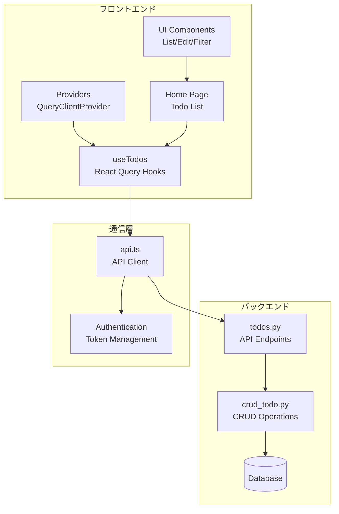
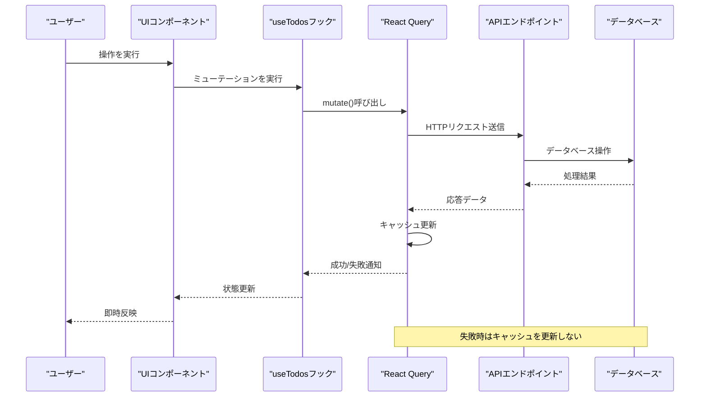
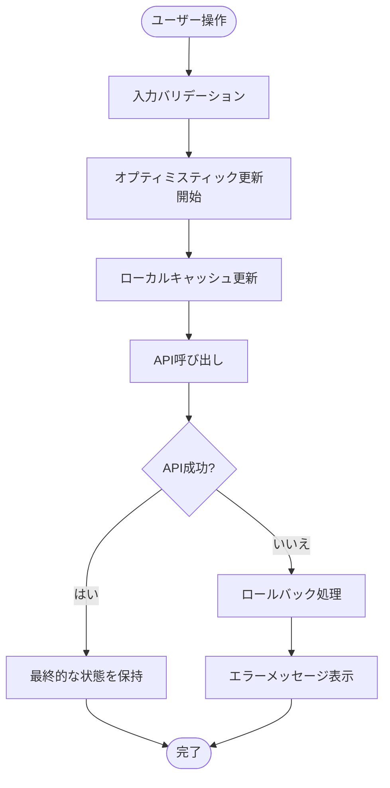
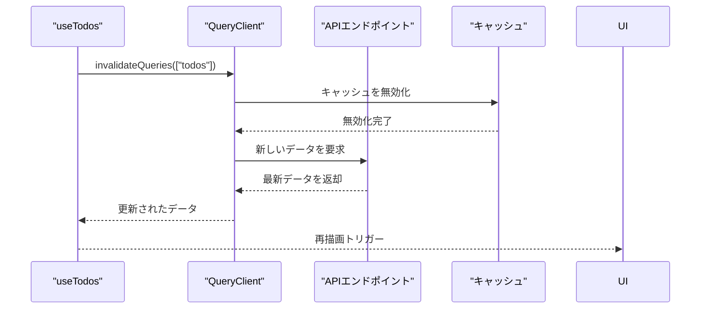
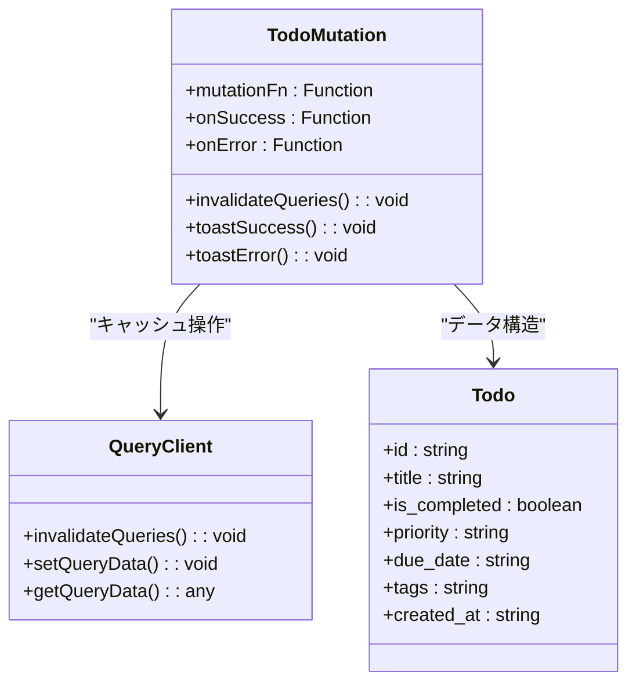
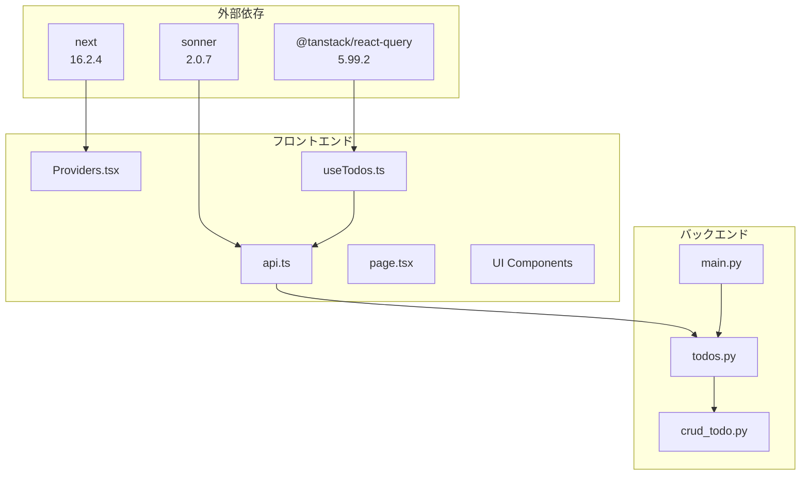

# リアルタイム更新

<cite>
**この文書で参照されるファイル**
- [frontend/src/hooks/useTodos.ts](file://frontend/src/hooks/useTodos.ts)
- [frontend/src/app/providers.tsx](file://frontend/src/app/providers.tsx)
- [frontend/src/lib/api.ts](file://frontend/src/lib/api.ts)
- [frontend/src/app/page.tsx](file://frontend/src/app/page.tsx)
- [frontend/src/app/_components/TodoItemList.tsx](file://frontend/src/app/_components/TodoItemList.tsx)
- [frontend/src/app/_components/TodoEditDialog.tsx](file://frontend/src/app/_components/TodoEditDialog.tsx)
- [frontend/src/app/_components/TodoFilterPanel.tsx](file://frontend/src/app/_components/TodoFilterPanel.tsx)
- [backend/app/api/api_v1/endpoints/todos.py](file://backend/app/api/api_v1/endpoints/todos.py)
- [backend/app/crud/crud_todo.py](file://backend/app/crud/crud_todo.py)
- [backend/app/main.py](file://backend/app/main.py)
- [frontend/package.json](file://frontend/package.json)
</cite>

## 目次
1. [導入](#導入)
2. [プロジェクト構造](#プロジェクト構造)
3. [コアコンポーネント](#コアコンポーネント)
4. [アーキテクチャ概要](#アーキテクチャ概要)
5. [詳細コンポーネント分析](#詳細コンポーネント分析)
6. [依存関係分析](#依存関係分析)
7. [パフォーマンス考慮事項](#パフォーマンス考慮事項)
8. [トラブルシューティングガイド](#トラブルシューティングガイド)
9. [結論](#結論)

## 導入
本プロジェクトでは、React Queryを使用したリアルタイム更新機能を実装しています。リアルタイム更新とは、ユーザーの操作に対して即座にUIを更新し、APIコールの成功/失敗に応じて適切な状態管理を行うことを指します。本ドキュメントでは、オプティミスティックUI更新、クエリの自動再検索、キャッシュの即時更新について詳しく説明します。

## プロジェクト構造
リアルタイム更新機能は、フロントエンドのReact QueryとバックエンドのFastAPIの連携によって実現されています。

**図の出典**
- [frontend/src/app/providers.tsx:1-26](file://frontend/src/app/providers.tsx#L1-L26)
- [frontend/src/hooks/useTodos.ts:1-119](file://frontend/src/hooks/useTodos.ts#L1-L119)
- [backend/app/api/api_v1/endpoints/todos.py:1-102](file://backend/app/api/api_v1/endpoints/todos.py#L1-L102)

**セクションの出典**
- [frontend/src/app/providers.tsx:1-26](file://frontend/src/app/providers.tsx#L1-L26)
- [frontend/src/hooks/useTodos.ts:1-119](file://frontend/src/hooks/useTodos.ts#L1-L119)
- [backend/app/api/api_v1/endpoints/todos.py:1-102](file://backend/app/api/api_v1/endpoints/todos.py#L1-L102)

## コアコンポーネント
リアルタイム更新機能の核心となるコンポーネント群です。

### React Queryクライアント設定
QueryClientProviderはアプリケーション全体でReact Queryの設定を提供し、キャッシュの有効期限や再検索のタイミングを制御します。

### useTodosカスタムフック
Todo管理のためのカスタムフックで、以下の機能を提供します：
- Todo一覧の取得とフィルタリング
- Todoの作成、更新、削除
- 状態管理とエラーハンドリング
- 自動再検索機能

### APIクライアント
api.tsファイルには、認証トークンの管理とエラーハンドリングを含むAPI呼び出し関数が含まれています。

**セクションの出典**
- [frontend/src/app/providers.tsx:8-25](file://frontend/src/app/providers.tsx#L8-L25)
- [frontend/src/hooks/useTodos.ts:26-118](file://frontend/src/hooks/useTodos.ts#L26-L118)
- [frontend/src/lib/api.ts:25-62](file://frontend/src/lib/api.ts#L25-L62)

## アーキテクチャ概要
リアルタイム更新のアーキテクチャは、クライアントサイドのReact QueryとサーバーサイドのFastAPIの統合によって構成されています。

**図の出典**
- [frontend/src/hooks/useTodos.ts:52-108](file://frontend/src/hooks/useTodos.ts#L52-L108)
- [backend/app/api/api_v1/endpoints/todos.py:59-101](file://backend/app/api/api_v1/endpoints/todos.py#L59-L101)

## 詳細コンポーネント分析

### React QueryのオプティミスティックUI更新
オプティミスティックUI更新は、ユーザーの操作を即座に反映し、非同期処理中に即座にUIを更新する手法です。

**図の出典**
- [frontend/src/hooks/useTodos.ts:52-108](file://frontend/src/hooks/useTodos.ts#L52-L108)
- [frontend/src/app/page.tsx:56-80](file://frontend/src/app/page.tsx#L56-L80)

### クエリの自動再検索メカニズム
React Queryは、ミューテーション成功時に指定されたクエリを自動的に無効化し、再度フェッチする仕組みを持っています。

**図の出典**
- [frontend/src/hooks/useTodos.ts:58-78](file://frontend/src/hooks/useTodos.ts#L58-L78)
- [frontend/src/hooks/useTodos.ts:87-93](file://frontend/src/hooks/useTodos.ts#L87-L93)

### キャッシュの即時更新戦略
キャッシュの即時更新は、APIレスポンスの成功/失敗に応じて異なる処理を行います。

**図の出典**
- [frontend/src/hooks/useTodos.ts:52-108](file://frontend/src/hooks/useTodos.ts#L52-L108)

### APIコールの成功/失敗時の状態管理
APIコールの成功/失敗に応じた状態管理は、以下の通りです：

**成功時の処理**：
- React Queryのキャッシュを無効化
- 新しいデータでUIを更新
- 成功メッセージを表示
- 入力フィールドをクリア

**失敗時の処理**：
- エラーメッセージを表示
- キャッシュを更新しない
- 元の状態を維持
- ユーザーにエラー情報を伝える

**セクションの出典**
- [frontend/src/hooks/useTodos.ts:58-78](file://frontend/src/hooks/useTodos.ts#L58-L78)
- [frontend/src/hooks/useTodos.ts:87-93](file://frontend/src/hooks/useTodos.ts#L87-L93)
- [frontend/src/hooks/useTodos.ts:101-107](file://frontend/src/hooks/useTodos.ts#L101-L107)

### エラー回復メカニズム
エラー回復は、以下のステップで行われます：

1. **エラー検出**：APIレスポンスのステータスコードをチェック
2. **エラーメッセージの抽出**：詳細なエラーメッセージを解析
3. **ユーザーへの通知**：Sonnerを使用してエラーメッセージを表示
4. **状態の復元**：元の状態に戻すことで、ユーザーは再試行可能
5. **再検索のトリガー**：成功後に自動的に最新データを取得

**セクションの出典**
- [frontend/src/lib/api.ts:39-62](file://frontend/src/lib/api.ts#L39-L62)
- [frontend/src/lib/api.ts:17-23](file://frontend/src/lib/api.ts#L17-L23)

### ユーザー体験向上のためのインタラクティブな更新処理
インタラクティブな更新処理は、以下の要素でユーザー体験を向上させます：

**即時フィードバック**：
- ボタンの無効化/有効化
- ローディングインジケーターの表示
- 成功/失敗の視覚的フィードバック

**操作の安全性**：
- 入力バリデーション
- 確認ダイアログの使用
- 元に戻せる操作の設計

**パフォーマンス最適化**：
- キャッシュの有効活用
- 不要な再レンダリングの防止
- 遅延ローディングの適用

**セクションの出典**
- [frontend/src/app/page.tsx:195-204](file://frontend/src/app/page.tsx#L195-L204)
- [frontend/src/app/_components/TodoEditDialog.tsx:123-131](file://frontend/src/app/_components/TodoEditDialog.tsx#L123-L131)

## 依存関係分析
リアルタイム更新機能に関連する依存関係は以下の通りです。

**図の出典**
- [frontend/package.json:21-32](file://frontend/package.json#L21-L32)
- [frontend/src/app/providers.tsx:3-4](file://frontend/src/app/providers.tsx#L3-L4)

**セクションの出典**
- [frontend/package.json:18-35](file://frontend/package.json#L18-L35)
- [backend/app/main.py:128-128](file://backend/app/main.py#L128-L128)

## パフォーマンス考慮事項
リアルタイム更新機能のパフォーマンスを最適化するために考慮すべき点：

### キャッシュ戦略
- **staleTimeの設定**：60秒間はキャッシュを新鮮として扱う
- **invalidationのタイミング**：ミューテーション成功時にのみ無効化
- **再フェッチの制御**：必要最小限のデータのみ再取得

### ネットワーク効率
- **クエリキーの最適化**：フィルター条件を含んだ決定論的なクエリキー
- **重複リクエストの防止**：同じクエリの同時実行を防ぐ
- **エラーハンドリングの効率化**：失敗時のリトライ戦略

### UIパフォーマンス
- **不要な再レンダリングの抑制**：React Queryのキャッシュ利用
- **メモ化の活用**：useMemo/useCallbackの適切な使用
- **遅延ローディング**：大量データ時の表示最適化

## トラブルシューティングガイド

### 一般的な問題と解決策

**問題：リアルタイム更新が動作しない**
- 確認項目：
  - QueryClientProviderが正しく設定されているか
  - invalidateQueriesが適切に呼び出されているか
  - APIエンドポイントが正常に応答しているか

**問題：エラー時にキャッシュが更新され続ける**
- 確認項目：
  - onErrorハンドラーが正しく設定されているか
  - React Queryのキャッシュ無効化が適切に行われているか
  - エラーメッセージの表示が適切に行われているか

**問題：パフォーマンスが悪い**
- 確認項目：
  - staleTimeの設定が適切か
  - 不要なクエリの再実行が発生していないか
  - UIコンポーネントの再レンダリングが最適化されているか

### デバッグ手法
1. **React Query Devtoolsの使用**：キャッシュ状態とクエリの実行履歴を確認
2. **ネットワークトレース**：API呼び出しのタイミングとレスポンスを分析
3. **コンソールログの確認**：エラーメッセージと状態変更のログを確認

**セクションの出典**
- [frontend/src/app/providers.tsx:9-15](file://frontend/src/app/providers.tsx#L9-L15)
- [frontend/src/lib/api.ts:39-62](file://frontend/src/lib/api.ts#L39-L62)

## 結論
本プロジェクトのリアルタイム更新機能は、React Queryの強力なキャッシュ管理機能と、FastAPIの堅牢なAPI設計を組み合わせることで、ユーザーにとってスムーズで信頼性の高い操作体験を提供しています。オプティミスティックUI更新、自動再検索、キャッシュの即時更新という3つの柱により、ユーザーの操作に対する即時フィードバックと、システムの整合性を両立させています。

今後の改善点としては、以下の点が挙げられます：
- WebSocketベースのリアルタイム通知機能の追加
- オフライン対応の強化
- キャッシュの永続化戦略の検討
- ユーザー行動の分析によるパフォーマンス最適化

これらの機能を継続的に改善することで、より洗練されたリアルタイム更新体験を提供することが可能です。