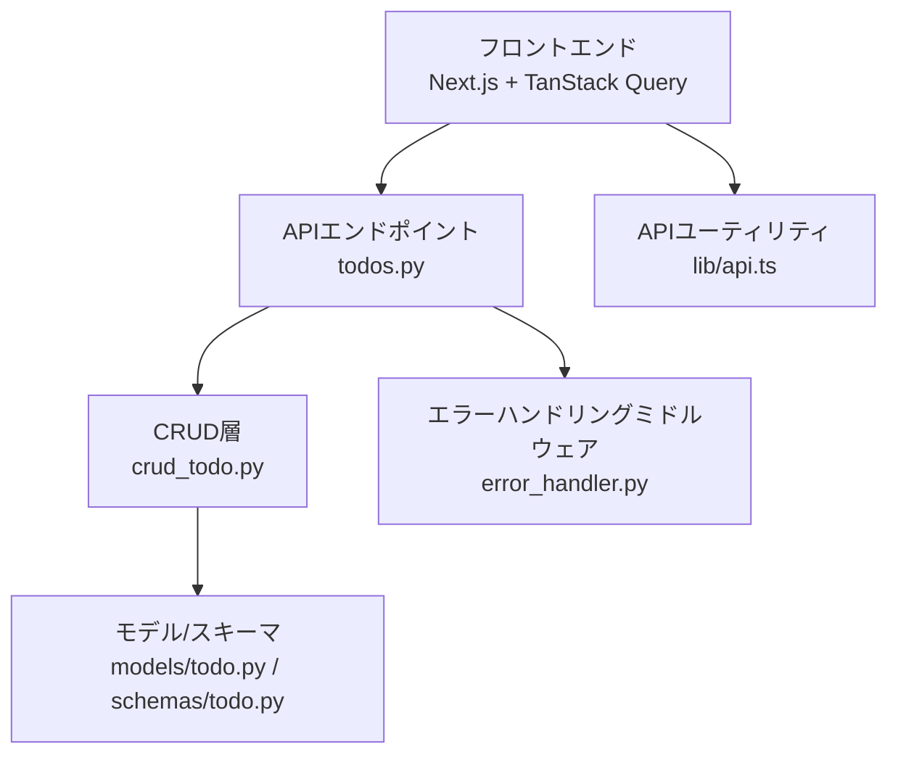
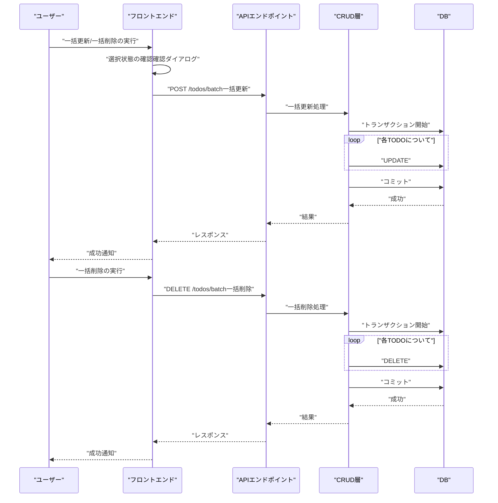
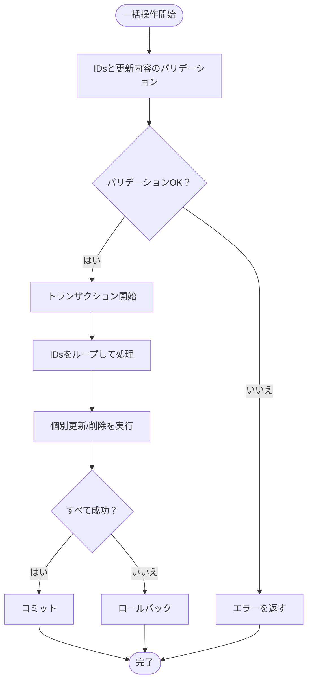
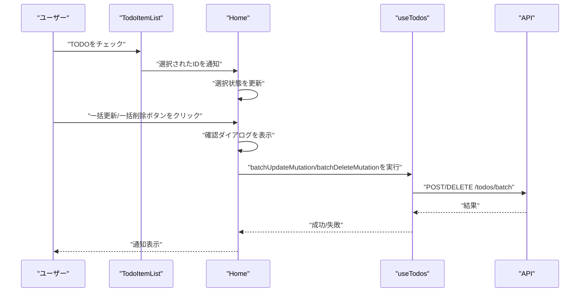
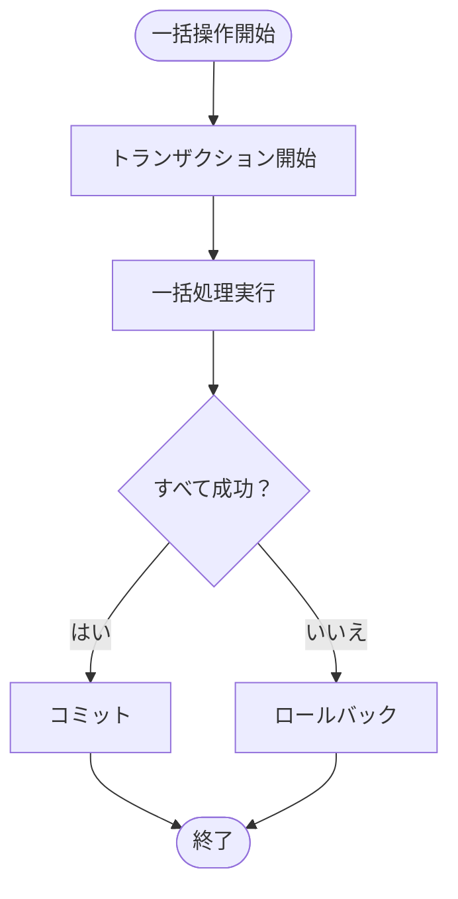
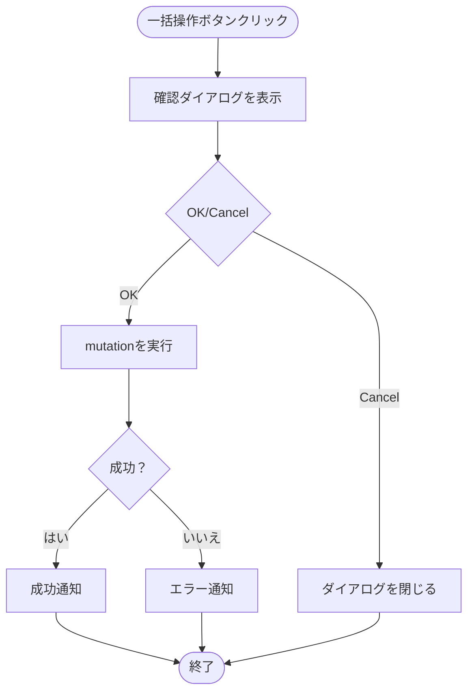
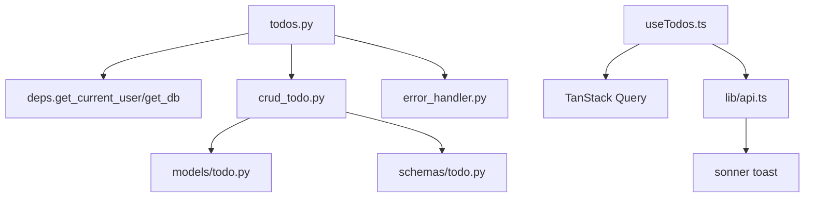

# 一括操作

<cite>
**本文で参照するファイル**   
- [backend/app/api/api_v1/endpoints/todos.py](file://backend/app/api/api_v1/endpoints/todos.py)
- [backend/app/crud/crud_todo.py](file://backend/app/crud/crud_todo.py)
- [backend/app/models/todo.py](file://backend/app/models/todo.py)
- [backend/app/schemas/todo.py](file://backend/app/schemas/todo.py)
- [frontend/src/hooks/useTodos.ts](file://frontend/src/hooks/useTodos.ts)
- [frontend/src/lib/api.ts](file://frontend/src/lib/api.ts)
- [frontend/src/app/page.tsx](file://frontend/src/app/page.tsx)
- [frontend/src/app/_components/TodoItemList.tsx](file://frontend/src/app/_components/TodoItemList.tsx)
- [backend/app/middleware/error_handler.py](file://backend/app/middleware/error_handler.py)
- [backend/tests/test_todos.py](file://backend/tests/test_todos.py)
</cite>

## 目次
1. [はじめに](#はじめに)
2. [プロジェクト構造](#プロジェクト構造)
3. [コアコンポーネント](#コアコンポーネント)
4. [アーキテクチャ概要](#アーキテクチャ概要)
5. [詳細コンポーネント解析](#詳細コンポーネント解析)
6. [依存関係解析](#依存関係解析)
7. [パフォーマンス考慮事項](#パフォーマンス考慮事項)
8. [トラブルシューティングガイド](#トラブルシューティングガイド)
9. [結論](#結論)
10. [付録](#付録)

## はじめに
本ドキュメントでは、TODOアプリケーションにおける「一括操作機能（複数TODOの一度の選択・更新・削除）」の設計と実装について解説します。具体的には、以下の点を網羅的に扱います：
- APIエンドポイント設計（一括更新・一括削除の追加案）
- クライアントサイドでの選択状態管理（React Hooks + TanStack Query）
- 一括処理ロジック（一括更新・一括削除）
- トランザクション処理とエラーハンドリング
- ユーザー操作の確認ダイアログの実装方法（フロー図付き）

なお、現在の実装では「一括更新」「一括削除」のエンドポイントは提供されていません。本ドキュメントは、既存の「個別更新」「個別削除」のAPIとフロントエンドの選択状態管理を基盤として、一括操作機能を追加するための設計案・実装手順を示します。

## プロジェクト構造
本プロジェクトは、バックエンド（FastAPI + SQLModel）とフロントエンド（Next.js + TanStack Query + shadcn/ui）の2層構造です。一括操作機能を実装する際は、以下のモジュールを意識する必要があります：
- APIエンドポイント：TODO一覧・件数取得・個別更新・個別削除
- CRUD層：TODOのCRUDロジック
- モデル・スキーマ：TODOエンティティ定義とバリデーション
- クライアントフック：TODO一覧取得・件数取得・個別更新・個別削除のmutation
- APIユーティリティ：認証トークン付与・エラーハンドリング
- エラーハンドリングミドルウェア：統一エラーレスポンス

**図の出典**
- [backend/app/api/api_v1/endpoints/todos.py:1-102](file://backend/app/api/api_v1/endpoints/todos.py#L1-L102)
- [backend/app/crud/crud_todo.py:1-152](file://backend/app/crud/crud_todo.py#L1-L152)
- [backend/app/models/todo.py:1-25](file://backend/app/models/todo.py#L1-L25)
- [backend/app/schemas/todo.py:1-41](file://backend/app/schemas/todo.py#L1-L41)
- [frontend/src/hooks/useTodos.ts:1-119](file://frontend/src/hooks/useTodos.ts#L1-L119)
- [frontend/src/lib/api.ts:1-110](file://frontend/src/lib/api.ts#L1-L110)
- [backend/app/middleware/error_handler.py:1-149](file://backend/app/middleware/error_handler.py#L1-L149)

**節の出典**
- [backend/app/api/api_v1/endpoints/todos.py:1-102](file://backend/app/api/api_v1/endpoints/todos.py#L1-L102)
- [frontend/src/hooks/useTodos.ts:1-119](file://frontend/src/hooks/useTodos.ts#L1-L119)
- [frontend/src/lib/api.ts:1-110](file://frontend/src/lib/api.ts#L1-L110)
- [backend/app/middleware/error_handler.py:1-149](file://backend/app/middleware/error_handler.py#L1-L149)

## コアコンポーネント
- APIエンドポイント（todos.py）
  - GET /todos：一覧取得（検索・フィルタ・ソート・ページネーション対応）
  - GET /todos/count：件数取得（同上）
  - PUT /todos/{id}：個別更新（完了状態・優先度・期限・タグなど）
  - DELETE /todos/{id}：個別削除
- CRUD（crud_todo.py）
  - get_todos / count_todos / create_todo / update_todo / delete_todo
- モデル・スキーマ（models/todo.py, schemas/todo.py）
  - Todoエンティティ定義、優先度列挙型、更新系スキーマ
- クライアントフック（useTodos.ts）
  - useQuery：一覧・件数取得
  - useMutation：追加・個別更新・個別削除
- APIユーティリティ（lib/api.ts）
  - 認証トークンの付与、エラーハンドリング（統一エラーレスポンス）
- エラーハンドリング（error_handler.py）
  - ValidationError、HTTPException、RateLimitExceeded、一般例外の統一処理

**節の出典**
- [backend/app/api/api_v1/endpoints/todos.py:1-102](file://backend/app/api/api_v1/endpoints/todos.py#L1-L102)
- [backend/app/crud/crud_todo.py:1-152](file://backend/app/crud/crud_todo.py#L1-L152)
- [backend/app/models/todo.py:1-25](file://backend/app/models/todo.py#L1-L25)
- [backend/app/schemas/todo.py:1-41](file://backend/app/schemas/todo.py#L1-L41)
- [frontend/src/hooks/useTodos.ts:1-119](file://frontend/src/hooks/useTodos.ts#L1-L119)
- [frontend/src/lib/api.ts:1-110](file://frontend/src/lib/api.ts#L1-L110)
- [backend/app/middleware/error_handler.py:1-149](file://backend/app/middleware/error_handler.py#L1-L149)

## アーキテクチャ概要
一括操作機能を追加する場合の基本的なフローは以下の通りです：
- 選択状態管理：画面で複数のTODOを選択（チェックボックス）
- 一括更新：選択されたTODOに対して一括で完了状態・優先度・期限・タグを更新
- 一括削除：選択されたTODOを一括で削除
- トランザクション：一括更新/削除は1つのトランザクション内で処理
- 確認ダイアログ：ユーザー操作の確認（OK/キャンセル）
- エラーハンドリング：一括処理中のエラーを一元的に処理

**図の出典**
- [backend/app/api/api_v1/endpoints/todos.py:1-102](file://backend/app/api/api_v1/endpoints/todos.py#L1-L102)
- [backend/app/crud/crud_todo.py:107-151](file://backend/app/crud/crud_todo.py#L107-L151)

## 詳細コンポーネント解析

### APIエンドポイント設計（一括操作）
現状のAPIエンドポイントでは、一括操作用のエンドポイントはありません。以下のように拡張することを提案します：

- POST /api/v1/todos/batch
  - 操作：一括更新
  - 入力：ids（TODO ID配列）、更新内容（is_completed、priority、due_date、tagsなど）
  - 出力：一括更新結果（件数、失敗リスト等）
- DELETE /api/v1/todos/batch
  - 操作：一括削除
  - 入力：ids（TODO ID配列）
  - 出力：一括削除結果（件数、失敗リスト等）

これらのエンドポイントは、既存の個別更新/削除のバリデーションと同様の認証・権限チェックを適用します。また、トランザクション内で一括処理を行うことで、整合性を保ちます。

**節の出典**
- [backend/app/api/api_v1/endpoints/todos.py:1-102](file://backend/app/api/api_v1/endpoints/todos.py#L1-L102)

### CRUDロジック（一括操作）
一括操作用のCRUDメソッドを追加します。以下は概略です（実装は必要に応じて追加）：
- batch_update_todos：ids配列を受け取り、一括で更新
- batch_delete_todos：ids配列を受け取り、一括で削除

**図の出典**
- [backend/app/crud/crud_todo.py:107-151](file://backend/app/crud/crud_todo.py#L107-L151)

**節の出典**
- [backend/app/crud/crud_todo.py:107-151](file://backend/app/crud/crud_todo.py#L107-L151)

### クライアントサイドでの選択状態管理
既存のuseTodosフックでは、個別のTODOに対する操作（追加・更新・削除）がuseMutationによって提供されています。一括操作を実装するには、以下のフローを考慮します：

- 選択状態の保持
  - TodoItemListコンポーネントで、各TODOにチェックボックスを配置し、選択されたIDを親コンポーネントに渡します。
  - Homeコンポーネントで、選択されたIDのリストを状態として保持します。
- 一括更新・一括削除の実装
  - Homeコンポーネントに「一括更新」「一括削除」ボタンを追加し、選択されたIDをAPIに送信します。
  - useMutationを拡張して、一括操作用のmutationを追加します（例：batchUpdateMutation、batchDeleteMutation）。
- 確認ダイアログ
  - 一括操作ボタンを押した際に、確認ダイアログを表示します。OKを押した場合のみAPIを呼び出します。

**図の出典**
- [frontend/src/app/_components/TodoItemList.tsx:1-182](file://frontend/src/app/_components/TodoItemList.tsx#L1-L182)
- [frontend/src/app/page.tsx:1-298](file://frontend/src/app/page.tsx#L1-L298)
- [frontend/src/hooks/useTodos.ts:1-119](file://frontend/src/hooks/useTodos.ts#L1-L119)

**節の出典**
- [frontend/src/app/_components/TodoItemList.tsx:1-182](file://frontend/src/app/_components/TodoItemList.tsx#L1-L182)
- [frontend/src/app/page.tsx:1-298](file://frontend/src/app/page.tsx#L1-L298)
- [frontend/src/hooks/useTodos.ts:1-119](file://frontend/src/hooks/useTodos.ts#L1-L119)

### トランザクション処理とエラーハンドリング
- トランザクション処理
  - 一括更新/削除は、DBのトランザクション内で処理する必要があります。一つでも失敗すると全体をロールバックします。
  - 一括操作のエンドポイントで、CRUD層にトランザクション制御を委ね、失敗時はエラーレスポンスを返します。
- エラーハンドリング
  - API側：既存のエラーハンドリングミドルウェア（validation_exception_handler、http_exception_handler、general_exception_handler、rate_limit_exception_handler）を活用し、一括操作でも統一されたエラーレスポンスを返します。
  - クライアント側：lib/api.tsのapiFetchでエラーをキャッチし、toastでユーザーに通知します。

**図の出典**
- [backend/app/middleware/error_handler.py:15-149](file://backend/app/middleware/error_handler.py#L15-L149)
- [frontend/src/lib/api.ts:25-62](file://frontend/src/lib/api.ts#L25-L62)

**節の出典**
- [backend/app/middleware/error_handler.py:15-149](file://backend/app/middleware/error_handler.py#L15-L149)
- [frontend/src/lib/api.ts:25-62](file://frontend/src/lib/api.ts#L25-L62)

### ユーザー操作の確認ダイアログの実装方法
- UIコンポーネント
  - 確認ダイアログ（例：AlertDialog）を追加し、一括操作ボタンを押した際に表示します。
- 実装フロー
  - Homeコンポーネントで、一括更新/一括削除ボタンにonClickイベントを設定。
  - ダイアログのOKボタンが押されたら、batchUpdateMutation/batchDeleteMutationを実行。
  - Cancelボタンが押されたら、何も処理を行わず閉じます。

[この図は概念的なフローであり、特定のソースファイルを直接可視化していないため、出典は記載しません]

## 依存関係解析
- APIエンドポイント（todos.py）は、deps.get_current_userによる認証・権限チェック、deps.get_dbによるDB接続に依存しています。
- CRUD（crud_todo.py）は、SQLModelのselect/func/count、UUID、datetime/timezoneを使用し、DB操作に依存しています。
- useTodosフックは、TanStack QueryのuseQuery/useMutation、apiFetch、react-queryのinvalidateQueriesに依存しています。
- lib/api.tsは、localStorage経由の認証トークン管理、fetch、toast通知に依存しています。
- error_handler.pyは、FastAPIの例外ハンドラー、logging、ErrorResponseスキーマに依存しています。

**図の出典**
- [backend/app/api/api_v1/endpoints/todos.py:1-102](file://backend/app/api/api_v1/endpoints/todos.py#L1-L102)
- [backend/app/crud/crud_todo.py:1-152](file://backend/app/crud/crud_todo.py#L1-L152)
- [frontend/src/hooks/useTodos.ts:1-119](file://frontend/src/hooks/useTodos.ts#L1-L119)
- [frontend/src/lib/api.ts:1-110](file://frontend/src/lib/api.ts#L1-L110)
- [backend/app/middleware/error_handler.py:1-149](file://backend/app/middleware/error_handler.py#L1-L149)

**節の出典**
- [backend/app/api/api_v1/endpoints/todos.py:1-102](file://backend/app/api/api_v1/endpoints/todos.py#L1-L102)
- [backend/app/crud/crud_todo.py:1-152](file://backend/app/crud/crud_todo.py#L1-L152)
- [frontend/src/hooks/useTodos.ts:1-119](file://frontend/src/hooks/useTodos.ts#L1-L119)
- [frontend/src/lib/api.ts:1-110](file://frontend/src/lib/api.ts#L1-L110)
- [backend/app/middleware/error_handler.py:1-149](file://backend/app/middleware/error_handler.py#L1-L149)

## パフォーマンス考慮事項
- 一括操作時のネットワークリクエスト数削減
  - 一括更新/削除は1回のリクエストで複数TODOを処理することで、リクエスト数を削減できます。
- DBトランザクションの使用
  - 一括処理は1つのトランザクション内で実行することで、整合性を保ちつつコミット回数を抑えることができます。
- クライアント側の再描画抑制
  - React QueryのinvalidateQueriesで一括更新後の一覧再取得を1回にまとめ、不要な再レンダリングを防ぎます。
- ソート・フィルタの影響
  - 一括操作後に再度一覧を取得する場合、現在のフィルタ条件（検索・完了状態・優先度・タグ・ソート）を維持して再取得することで、ユーザー体験を損なわずに最新状態を反映できます。

[本節は一般的なパフォーマンスに関する指針を示すものであり、特定のファイルを直接分析していないため、出典は記載しません]

## トラブルシューティングガイド
- 認証エラー（401）
  - API側の認証チェック（deps.get_current_user）が失敗すると、401エラーが返されます。クライアント側では、ApiErrorをキャッチしてログインページへのリダイレクトを実施します。
- 一括操作のエラー
  - 一括更新/削除中に一部のTODOでエラーが発生した場合、トランザクションはロールバックされ、エラーレスポンスが返されます。クライアント側では、toastでエラー内容を表示します。
- 件数カウントと一覧のずれ
  - 一括削除後に件数カウントが即座に更新されない場合があります。再度件数取得APIを呼び出すことで、最新の件数を取得できます。

**節の出典**
- [frontend/src/app/page.tsx:49-54](file://frontend/src/app/page.tsx#L49-L54)
- [frontend/src/lib/api.ts:25-62](file://frontend/src/lib/api.ts#L25-L62)
- [backend/app/middleware/error_handler.py:52-76](file://backend/app/middleware/error_handler.py#L52-L76)

## 結論
本ドキュメントでは、既存の個別TODO操作機能を基盤として、一括操作機能（一括更新・一括削除）の設計・実装方法について解説しました。具体的には、APIエンドポイントの追加、CRUDロジックのトランザクション対応、クライアントサイドでの選択状態管理、確認ダイアログの導入、そしてエラーハンドリングの統一について述べました。これにより、ユーザーは効率的に複数のTODOを一括で管理できるようになります。

[本節は要旨のため、出典は記載しません]

## 付録
- 関連テスト
  - TODOのCRUD操作に関するテスト（作成・一覧・更新・削除・件数取得）が存在します。一括操作を追加した際は、同様のテストパターンを拡張し、一括更新・一括削除のテストを追加することを推奨します。

**節の出典**
- [backend/tests/test_todos.py:1-159](file://backend/tests/test_todos.py#L1-L159)