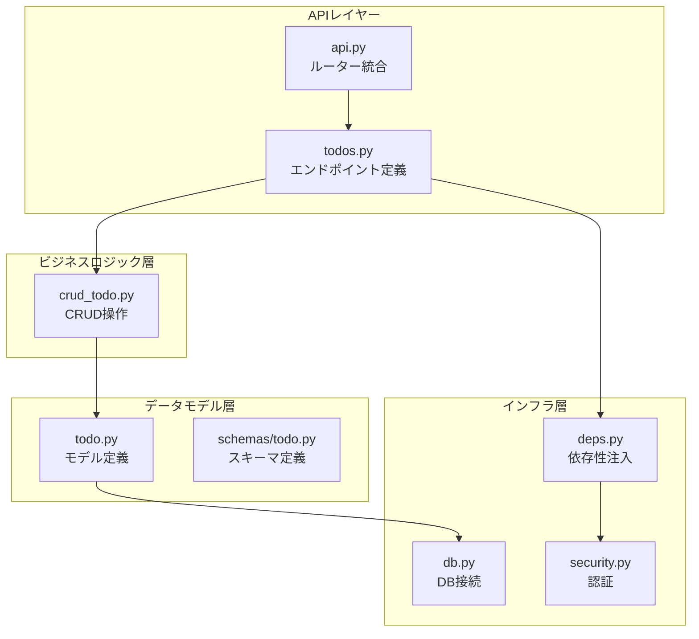
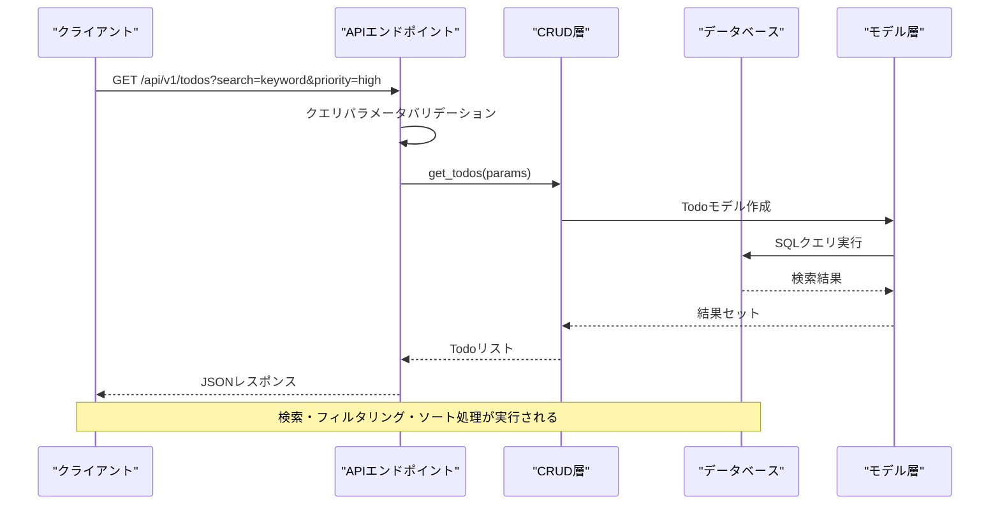
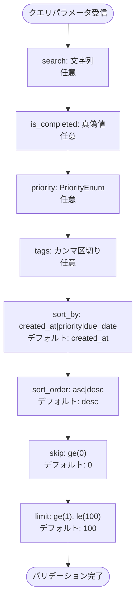
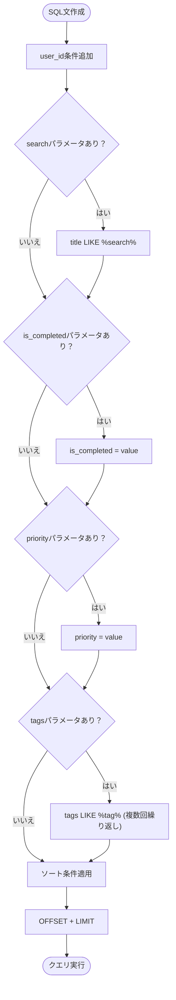
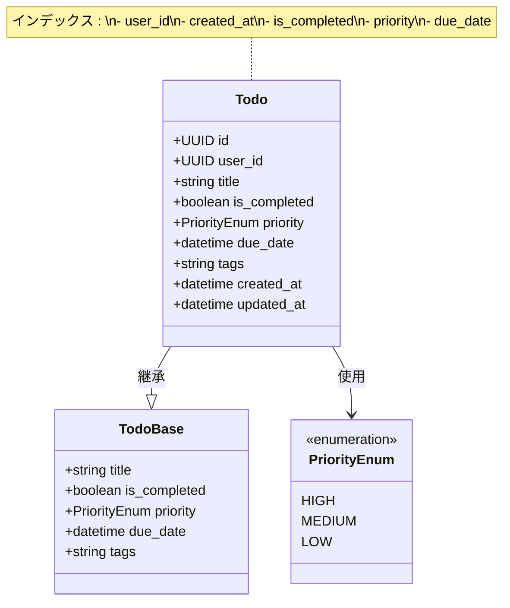
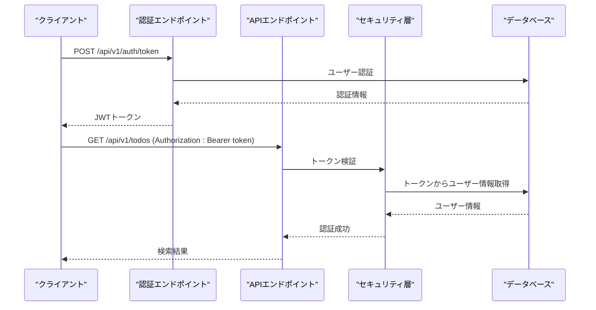
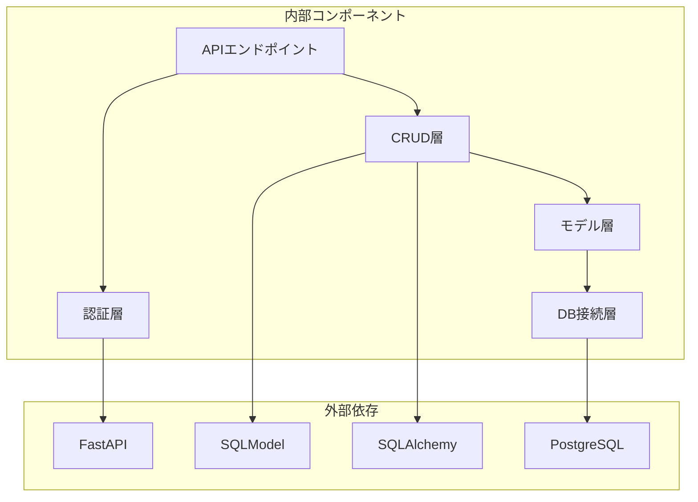

# 高度な検索・フィルタリング

<cite>
**この文書で参照されるファイル**
- [backend/app/api/api_v1/endpoints/todos.py](file://backend/app/api/api_v1/endpoints/todos.py)
- [backend/app/crud/crud_todo.py](file://backend/app/crud/crud_todo.py)
- [backend/app/models/todo.py](file://backend/app/models/todo.py)
- [backend/app/schemas/todo.py](file://backend/app/schemas/todo.py)
- [backend/migrations/versions/add_indexes.py](file://backend/migrations/versions/add_indexes.py)
- [backend/app/api/deps.py](file://backend/app/api/deps.py)
- [backend/app/api/api_v1/api.py](file://backend/app/api/api_v1/api.py)
- [backend/app/core/db.py](file://backend/app/core/db.py)
- [backend/app/core/security.py](file://backend/app/core/security.py)
- [backend/tests/test_todos.py](file://backend/tests/test_todos.py)
- [backend/app/main.py](file://backend/app/main.py)
</cite>

## 目次
1. [導入](#導入)
2. [プロジェクト構造](#プロジェクト構造)
3. [コアコンポーネント](#コアコンポーネント)
4. [アーキテクチャ概要](#アーキテクチャ概要)
5. [詳細コンポーネント分析](#詳細コンポーネント分析)
6. [依存関係分析](#依存関係分析)
7. [性能考慮事項](#性能考慮事項)
8. [トラブルシューティングガイド](#トラブルシューティングガイド)
9. [結論](#結論)

## 導入
本ドキュメントは、Todoアプリケーションにおける高度な検索・フィルタリング機能の仕様と実装について詳細に説明します。検索キーワード（search）、完了状態（is_completed）、優先度（priority）、タグ（tags）フィルターの利用方法とAPIエンドポイントのパラメータ構成について解説し、ソートオプション（sort_by、sort_order）の設定方法、クエリパラメータのバリデーション、SQLクエリの最適化戦略を具体的なコード例で示します。

## プロジェクト構造
TodoアプリケーションはFastAPIフレームワークを使用したマイクロサービスアーキテクチャを採用しています。検索・フィルタリング機能は以下の層構造で実装されています：

**図の出典**
- [backend/app/api/api_v1/endpoints/todos.py:1-102](file://backend/app/api/api_v1/endpoints/todos.py#L1-L102)
- [backend/app/crud/crud_todo.py:1-152](file://backend/app/crud/crud_todo.py#L1-L152)
- [backend/app/models/todo.py:1-25](file://backend/app/models/todo.py#L1-L25)

**節の出典**
- [backend/app/api/api_v1/endpoints/todos.py:1-102](file://backend/app/api/api_v1/endpoints/todos.py#L1-L102)
- [backend/app/api/api_v1/api.py:1-8](file://backend/app/api/api_v1/api.py#L1-L8)

## コアコンポーネント
高度な検索・フィルタリング機能は以下の主要コンポーネントで構成されています：

### APIエンドポイント
- `/api/v1/todos/` - TODO一覧取得（検索・フィルタリング・ページネーション対応）
- `/api/v1/todos/count` - TODO件数取得（検索・フィルタリング対応）

### CRUD操作
- `get_todos()` - 検索・フィルタリング・ソート・ページネーションを含む一覧取得
- `count_todos()` - 検索・フィルタリングを含む件数取得

### モデル定義
- `Todo` - TODOエンティティのデータベースマッピング
- `PriorityEnum` - 優先度の列挙型定義

**節の出典**
- [backend/app/api/api_v1/endpoints/todos.py:13-57](file://backend/app/api/api_v1/endpoints/todos.py#L13-L57)
- [backend/app/crud/crud_todo.py:10-98](file://backend/app/crud/crud_todo.py#L10-L98)
- [backend/app/models/todo.py:10-25](file://backend/app/models/todo.py#L10-L25)
- [backend/app/schemas/todo.py:7-18](file://backend/app/schemas/todo.py#L7-L18)

## アーキテクチャ概要
検索・フィルタリング機能は以下のアーキテクチャパターンに従って設計されています：

**図の出典**
- [backend/app/api/api_v1/endpoints/todos.py:32-57](file://backend/app/api/api_v1/endpoints/todos.py#L32-L57)
- [backend/app/crud/crud_todo.py:10-71](file://backend/app/crud/crud_todo.py#L10-L71)

## 詳細コンポーネント分析

### APIエンドポイントの設計
APIエンドポイントはFastAPIの`Query`パラメータを使用して検索・フィルタリング機能を提供します：

#### 主要パラメータ
- `search`: 検索キーワード（文字列）
- `is_completed`: 完了状態（真偽値）
- `priority`: 優先度（high/medium/low）
- `tags`: タグ（カンマ区切り複数指定可）
- `sort_by`: ソート対象（created_at/priority/due_date）
- `sort_order`: ソート順序（asc/desc）
- `skip`: スキップ件数（非負整数）
- `limit`: 取得件数（1-100の範囲）

#### クエリパラメータバリデーション

**図の出典**
- [backend/app/api/api_v1/endpoints/todos.py:17-43](file://backend/app/api/api_v1/endpoints/todos.py#L17-L43)

**節の出典**
- [backend/app/api/api_v1/endpoints/todos.py:13-57](file://backend/app/api/api_v1/endpoints/todos.py#L13-L57)

### CRUD層の実装
CRUD層は検索・フィルタリング・ソート・ページネーションを一貫して処理します：

#### 検索フィルタリングロジック

**図の出典**
- [backend/app/crud/crud_todo.py:25-68](file://backend/app/crud/crud_todo.py#L25-L68)

#### ソートオプションの実装
- `created_at`: 作成日時でのソート（デフォルト）
- `priority`: 優先度でのソート（high > medium > low）
- `due_date`: 期日でのソート

**節の出典**
- [backend/app/crud/crud_todo.py:45-65](file://backend/app/crud/crud_todo.py#L45-L65)

### モデル層の設計
モデル層はSQLModelを使用してデータベースとのマッピングを定義し、インデックスを活用したパフォーマンス向上を実現しています：

**図の出典**
- [backend/app/models/todo.py:10-25](file://backend/app/models/todo.py#L10-L25)
- [backend/app/schemas/todo.py:7-18](file://backend/app/schemas/todo.py#L7-L18)

**節の出典**
- [backend/app/models/todo.py:10-25](file://backend/app/models/todo.py#L10-L25)
- [backend/app/schemas/todo.py:13-35](file://backend/app/schemas/todo.py#L13-L35)

### データベースインデックス戦略
データベースは以下のインデックスを設定して検索パフォーマンスを最適化しています：

| インデックス名 | 対象カラム | 検索用途 |
|---------------|-----------|---------|
| `ix_todos_user_id` | user_id | ユーザー別フィルタ |
| `ix_todos_created_at` | created_at | 日付順ソート |
| `ix_todos_is_completed` | is_completed | 完了状態フィルタ |
| `ix_todos_priority` | priority | 優先度フィルタ |
| `ix_todos_due_date` | due_date | 期日順ソート |

**節の出典**
- [backend/migrations/versions/add_indexes.py:22-27](file://backend/migrations/versions/add_indexes.py#L22-L27)

### 認証とセキュリティ
検索・フィルタリング機能はJWT Bearer認証によって保護されており、各リクエストには有効なアクセストークンが必要です：

**図の出典**
- [backend/app/api/deps.py:12-30](file://backend/app/api/deps.py#L12-L30)
- [backend/app/core/security.py:29-35](file://backend/app/core/security.py#L29-L35)

**節の出典**
- [backend/app/api/deps.py:1-31](file://backend/app/api/deps.py#L1-L31)
- [backend/app/core/security.py:1-35](file://backend/app/core/security.py#L1-L35)

## 依存関係分析
検索・フィルタリング機能の依存関係は以下の通りです：

**図の出典**
- [backend/app/api/api_v1/endpoints/todos.py:1-11](file://backend/app/api/api_v1/endpoints/todos.py#L1-L11)
- [backend/app/crud/crud_todo.py:1-8](file://backend/app/crud/crud_todo.py#L1-L8)
- [backend/app/core/db.py:1-17](file://backend/app/core/db.py#L1-L17)

**節の出典**
- [backend/app/api/api_v1/endpoints/todos.py:1-11](file://backend/app/api/api_v1/endpoints/todos.py#L1-L11)
- [backend/app/crud/crud_todo.py:1-8](file://backend/app/crud/crud_todo.py#L1-L8)
- [backend/app/core/db.py:1-17](file://backend/app/core/db.py#L1-L17)

## 性能考慮事項
高度な検索・フィルタリング機能は以下の最適化戦略を採用しています：

### SQLクエリの最適化
1. **インデックス活用**: 各検索条件に対応したインデックスを設定
2. **条件式の組み立て**: 条件が指定された場合のみWHERE句を追加
3. **ページネーション**: OFFSET + LIMITを使用した効率的な取得
4. **LIKE演算子の制限**: キーワード検索は前方一致を避けるため、'%keyword%'を使用

### パフォーマンス最適化戦略
- **インデックス設計**: 検索頻度の高いカラムにインデックスを配置
- **クエリ構造**: 条件のない場合は最小限のWHERE句のみ使用
- **ソート効率**: ソート対象のカラムにインデックスを配置
- **メモリ使用量**: LIMITによる結果セットの制限

### トレードオフと制限
- **タグ検索の制限**: 複数タグのAND条件は複数回のLIKE演算子で表現
- **全文検索**: 現状はLIKE演算子を使用しており、高度な全文検索機能は未実装
- **大規模データ**: 100件のLIMIT制限により、大量データの検索は制御されている

**節の出典**
- [backend/migrations/versions/add_indexes.py:22-27](file://backend/migrations/versions/add_indexes.py#L22-L27)
- [backend/app/crud/crud_todo.py:25-68](file://backend/app/crud/crud_todo.py#L25-L68)

## トラブルシューティングガイド
検索・フィルタリング機能に関する一般的な問題と解決策：

### 共通エラー
- **認証エラー**: 401 Unauthorized - 有効なJWTトークンの確認
- **パラメータエラー**: 422 Unprocessable Entity - クエリパラメータの形式確認
- **リソースなし**: 404 Not Found - 存在しないTODOの操作

### 検索・フィルタリングに関する問題
- **検索結果が空**: 検索キーワードの正確性や大小文字の違いを確認
- **フィルタリングが効かない**: 優先度の値が正しいか確認（high/medium/low）
- **ソート順序が逆**: sort_orderパラメータの値を確認（asc/desc）

### デバッグ手順
1. **APIドキュメントの確認**: Scalar API Referenceを使用してエンドポイントを確認
2. **ログの確認**: アプリケーションログからエラー詳細を確認
3. **データベースの確認**: SQLクエリの実行計画を確認

**節の出典**
- [backend/app/main.py:121-127](file://backend/app/main.py#L121-L127)
- [backend/tests/test_todos.py:155-159](file://backend/tests/test_todos.py#L155-L159)

## 結論
高度な検索・フィルタリング機能は、FastAPIとSQLModelを基盤とした堅牢なアーキテクチャによって実現されています。以下の特徴を持つことで、ユーザーフレンドリーな検索体験を提供しています：

- **柔軟なフィルタリング**: 検索キーワード、完了状態、優先度、タグの複数条件対応
- **効率的なソート**: 3つのソートオプションをサポート
- **パフォーマンス最適化**: インデックス活用とクエリ最適化
- **セキュアなアクセス**: JWT認証によるアクセス制御
- **堅牢なバリデーション**: FastAPIのクエリパラメータバリデーション

今後の改善点として、全文検索機能の追加、複数タグのAND/OR条件対応、検索履歴の保存などが考えられます。これらの機能は現在のアーキテクチャに適合しやすく、拡張性を保ちながら機能を強化できます。