# 高度な機能

<cite>
**この文書で参照されるファイル**   
- [frontend/src/hooks/useTodos.ts](file://frontend/src/hooks/useTodos.ts)
- [frontend/src/app/page.tsx](file://frontend/src/app/page.tsx)
- [frontend/src/app/_components/TodoFilterPanel.tsx](file://frontend/src/app/_components/TodoFilterPanel.tsx)
- [frontend/src/app/_components/TodoItemList.tsx](file://frontend/src/app/_components/TodoItemList.tsx)
- [frontend/src/app/_components/Pagination.tsx](file://frontend/src/app/_components/Pagination.tsx)
- [frontend/src/lib/api.ts](file://frontend/src/lib/api.ts)
- [backend/app/api/api_v1/endpoints/todos.py](file://backend/app/api/api_v1/endpoints/todos.py)
- [backend/app/crud/crud_todo.py](file://backend/app/crud/crud_todo.py)
- [backend/app/models/todo.py](file://backend/app/models/todo.py)
- [backend/app/schemas/todo.py](file://backend/app/schemas/todo.py)
- [backend/app/middleware/error_handler.py](file://backend/app/middleware/error_handler.py)
- [backend/app/core/db.py](file://backend/app/core/db.py)
- [frontend/package.json](file://frontend/package.json)
- [backend/pyproject.toml](file://backend/pyproject.toml)
</cite>

## 目次
1. [導入](#導入)
2. [プロジェクト構造](#プロジェクト構造)
3. [コアコンポーネント](#コアコンポーネント)
4. [アーキテクチャ概要](#アーキテクチャ概要)
5. [詳細コンポーネント分析](#詳細コンポーネント分析)
6. [依存関係分析](#依存関係分析)
7. [パフォーマンス考慮事項](#パフォーマンス考慮事項)
8. [トラブルシューティングガイド](#トラブルシューティングガイド)
9. [結論](#結論)

## 導入
本ドキュメントでは、Todoアプリケーションの高度な機能について詳細に説明します。特に以下の機能を重点的に分析します：
- リアルタイム更新（React QueryのオプティミスティックUI更新）
- 高度な検索・フィルタリング（検索キーワード、完了状態、優先度、タグ、ソートオプション）
- ページネーションの実装
- 一括操作のサポート
- パフォーマンス最適化、キャッシュ戦略、エラーハンドリングのベストプラクティス

## プロジェクト構造
Todoアプリケーションは、Next.jsフロントエンドとFastAPIバックエンドのマイクロサービスアーキテクチャで構成されています。

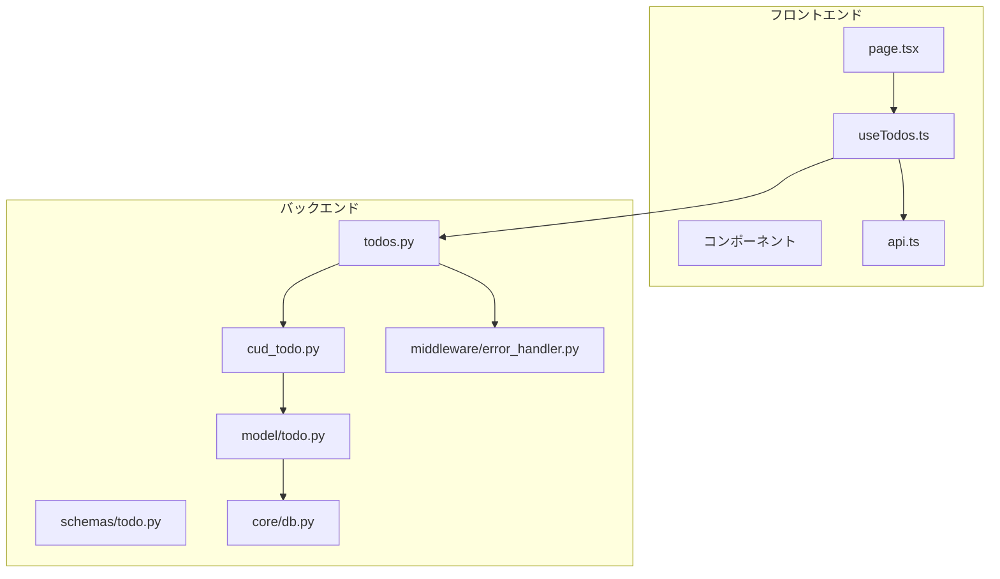

**図の出典**
- [frontend/src/app/page.tsx:1-298](file://frontend/src/app/page.tsx#L1-L298)
- [backend/app/api/api_v1/endpoints/todos.py:1-102](file://backend/app/api/api_v1/endpoints/todos.py#L1-L102)

**セクションの出典**
- [frontend/src/app/page.tsx:1-298](file://frontend/src/app/page.tsx#L1-L298)
- [backend/app/api/api_v1/endpoints/todos.py:1-102](file://backend/app/api/api_v1/endpoints/todos.py#L1-L102)

## コアコンポーネント
Todoアプリケーションの高度な機能は、以下のコアコンポーネントによって実現されています：

### React Queryフック（useTodos）
カスタムフックとして実装されたuseTodosは、すべてのCRUD操作と高度なフィルタリング機能を提供します。

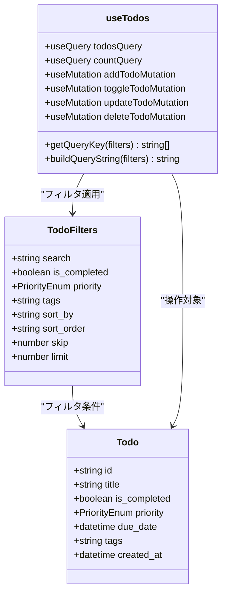

**図の出典**
- [frontend/src/hooks/useTodos.ts:5-24](file://frontend/src/hooks/useTodos.ts#L5-L24)
- [frontend/src/hooks/useTodos.ts:26-118](file://frontend/src/hooks/useTodos.ts#L26-L118)

### APIエラーハンドリング
統一されたエラーハンドリングメカニズムにより、ユーザーに親切なエラーメッセージを提供しつつ、開発者には詳細な情報を提供します。

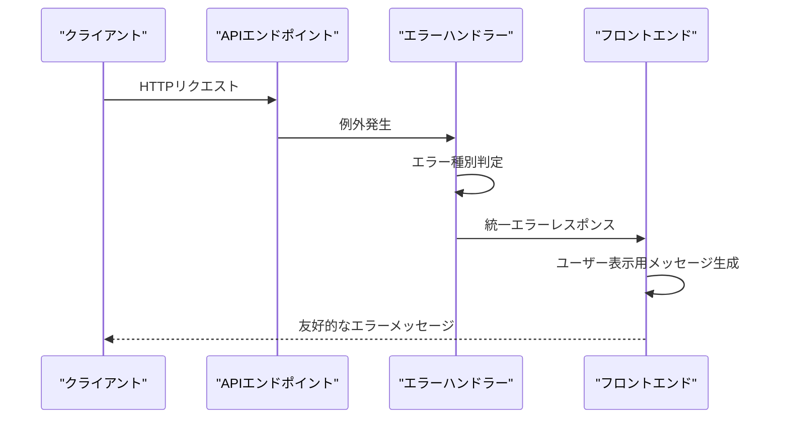

**図の出典**
- [backend/app/middleware/error_handler.py:15-149](file://backend/app/middleware/error_handler.py#L15-L149)
- [frontend/src/lib/api.ts:25-62](file://frontend/src/lib/api.ts#L25-L62)

**セクションの出典**
- [frontend/src/hooks/useTodos.ts:1-119](file://frontend/src/hooks/useTodos.ts#L1-L119)
- [backend/app/middleware/error_handler.py:1-149](file://backend/app/middleware/error_handler.py#L1-L149)
- [frontend/src/lib/api.ts:1-110](file://frontend/src/lib/api.ts#L1-L110)

## アーキテクチャ概要
Todoアプリケーションは、クリーンアーキテクチャに基づくマイクロサービス構造を採用しています。

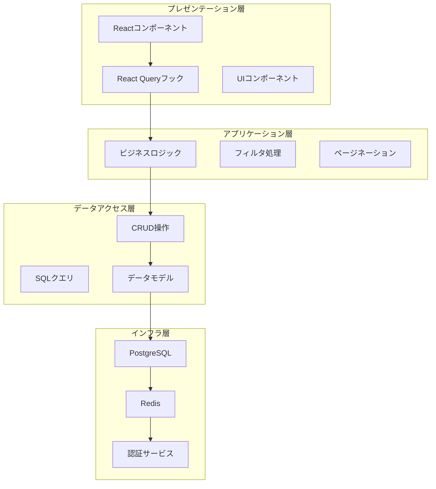

**図の出典**
- [frontend/src/app/page.tsx:27-298](file://frontend/src/app/page.tsx#L27-L298)
- [backend/app/crud/crud_todo.py:10-152](file://backend/app/crud/crud_todo.py#L10-L152)

### 高度な検索・フィルタリング機能
検索・フィルタリング機能は、複数の条件を組み合わせて実装されています。

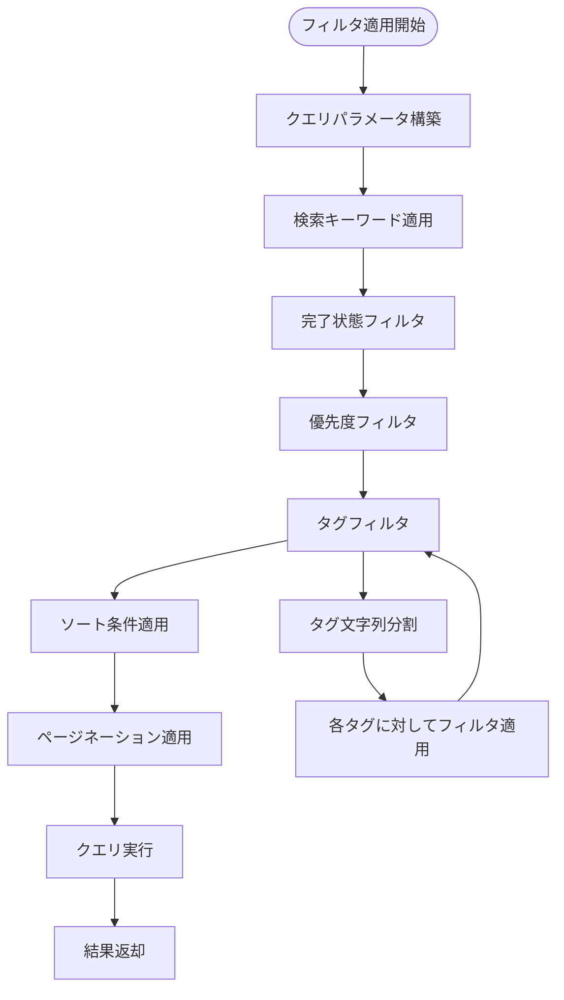

**図の出典**
- [frontend/src/hooks/useTodos.ts:29-40](file://frontend/src/hooks/useTodos.ts#L29-L40)
- [backend/app/crud/crud_todo.py:25-71](file://backend/app/crud/crud_todo.py#L25-L71)

**セクションの出典**
- [frontend/src/hooks/useTodos.ts:15-24](file://frontend/src/hooks/useTodos.ts#L15-L24)
- [backend/app/crud/crud_todo.py:10-71](file://backend/app/crud/crud_todo.py#L10-L71)

## 詳細コンポーネント分析

### フィルタパネルコンポーネント
TodoFilterPanelは、ユーザーインターフェースを通じて高度なフィルタリング機能を提供します。

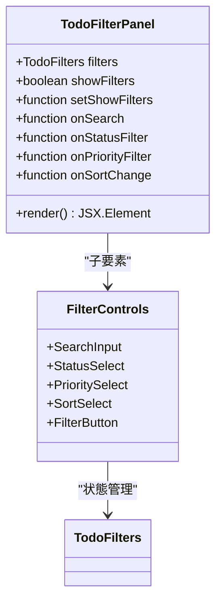

**図の出典**
- [frontend/src/app/_components/TodoFilterPanel.tsx:15-104](file://frontend/src/app/_components/TodoFilterPanel.tsx#L15-L104)

### Todo一覧表示コンポーネント
TodoItemListは、フィルタリングされたTodoを効率的に表示し、期限の状態を視覚的に示します。

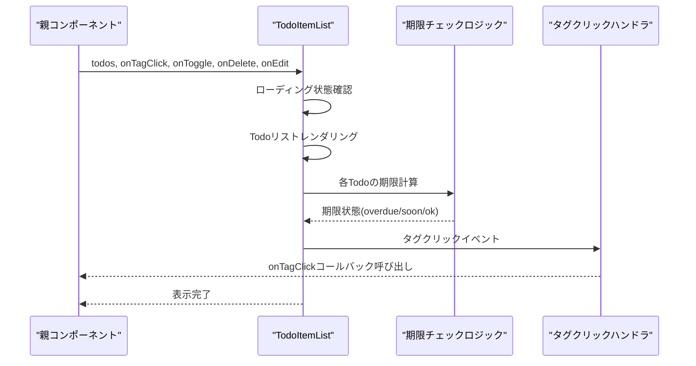

**図の出典**
- [frontend/src/app/_components/TodoItemList.tsx:19-32](file://frontend/src/app/_components/TodoItemList.tsx#L19-L32)
- [frontend/src/app/_components/TodoItemList.tsx:134-153](file://frontend/src/app/_components/TodoItemList.tsx#L134-L153)

### ページネーションコンポーネント
Paginationコンポーネントは、大量のデータを効率的に表示するために設計されています。

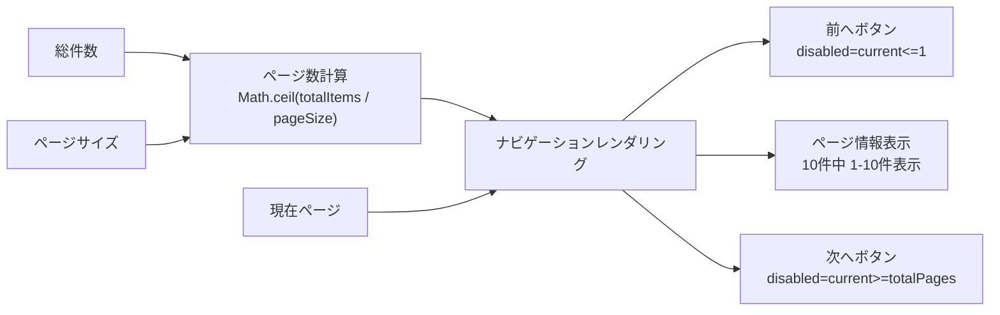

**図の出典**
- [frontend/src/app/_components/Pagination.tsx:13-48](file://frontend/src/app/_components/Pagination.tsx#L13-L48)

**セクションの出典**
- [frontend/src/app/_components/TodoFilterPanel.tsx:1-105](file://frontend/src/app/_components/TodoFilterPanel.tsx#L1-L105)
- [frontend/src/app/_components/TodoItemList.tsx:1-182](file://frontend/src/app/_components/TodoItemList.tsx#L1-L182)
- [frontend/src/app/_components/Pagination.tsx:1-49](file://frontend/src/app/_components/Pagination.tsx#L1-L49)

### API通信層
api.tsは、統一されたAPI通信インターフェースを提供し、エラーハンドリングと認証トークン管理を担当します。

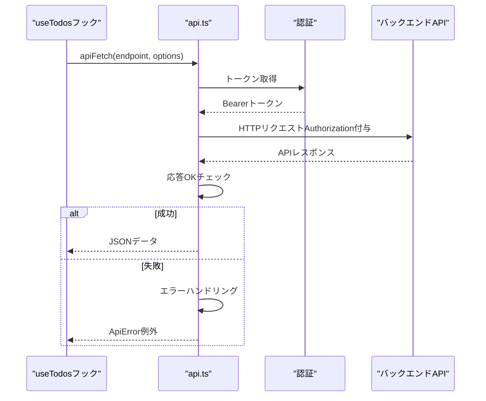

**図の出典**
- [frontend/src/lib/api.ts:25-62](file://frontend/src/lib/api.ts#L25-L62)
- [frontend/src/hooks/useTodos.ts:42-45](file://frontend/src/hooks/useTodos.ts#L42-L45)

**セクションの出典**
- [frontend/src/lib/api.ts:1-110](file://frontend/src/lib/api.ts#L1-L110)

## 依存関係分析
Todoアプリケーションの依存関係は、層ごとに分離されており、依存性の方向性が明確に定義されています。

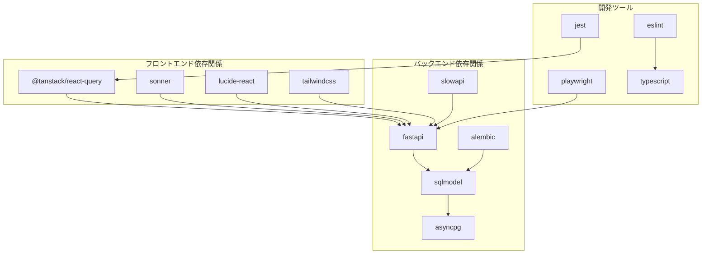

**図の出典**
- [frontend/package.json:18-35](file://frontend/package.json#L18-L35)
- [backend/pyproject.toml:7-22](file://backend/pyproject.toml#L7-L22)

### データベーススキーマ
Todoモデルは、複数のインデックスを備えており、検索性能を最適化しています。

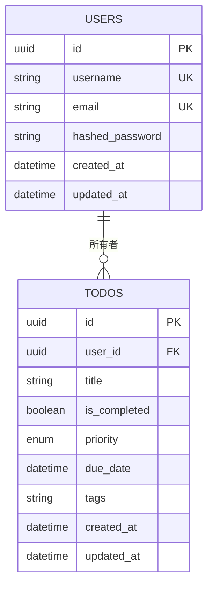

**図の出典**
- [backend/app/models/todo.py:10-25](file://backend/app/models/todo.py#L10-L25)
- [backend/app/schemas/todo.py:13-35](file://backend/app/schemas/todo.py#L13-L35)

**セクションの出典**
- [frontend/package.json:1-65](file://frontend/package.json#L1-L65)
- [backend/pyproject.toml:1-47](file://backend/pyproject.toml#L1-L47)
- [backend/app/models/todo.py:1-25](file://backend/app/models/todo.py#L1-L25)

## パフォーマンス考慮事項

### React Queryのキャッシュ戦略
useTodosフックは、以下のキャッシュ戦略を採用しています：

1. **クエリキーの決定論的構築**: URLSearchParamsを使用して、フィルタ条件を常に同じ順序で構築
2. **自動無効化**: CRUD操作後に関連するクエリを自動的に無効化
3. **エラーハンドリング**: 失敗した操作はキャッシュを無効化せず、ユーザーにエラーを表示

### 検索最適化
- **インデックス活用**: created_at、is_completed、priority、due_dateフィールドにインデックスを設定
- **部分一致検索**: LIKE演算子を使用した効率的な部分一致検索
- **タグ検索**: カンマ区切りの複数タグを効率的に処理

### ページネーション最適化
- **LIMIT/OFFSET**: 大量データの効率的な取得
- **件数取得専用エンドポイント**: ページネーションのための件数取得API

**セクションの出典**
- [frontend/src/hooks/useTodos.ts:29-50](file://frontend/src/hooks/useTodos.ts#L29-L50)
- [backend/app/models/todo.py:12-17](file://backend/app/models/todo.py#L12-L17)
- [backend/app/crud/crud_todo.py:67-71](file://backend/app/crud/crud_todo.py#L67-L71)

## トラブルシューティングガイド

### 共通エラー対応手順
1. **認証エラー（401）**: 自動的にログインページにリダイレクト
2. **ネットワークエラー**: 5秒間隔で自動リトライ
3. **バリデーションエラー**: 詳細なエラーメッセージを表示
4. **サーバーエラー**: 500エラーの場合は管理者に通知

### 一般的な問題と解決策

#### Todoが表示されない場合
- **原因**: フィルタ条件が厳しすぎる
- **解決**: 全てのフィルタを解除するか、検索ワードを変更

#### 更新が反映されない場合
- **原因**: キャッシュの問題
- **解決**: 画面を再読み込みまたはフィルタ条件を変更

#### 検索が機能しない場合
- **原因**: タイトルに含まれる特殊文字
- **解決**: 検索ワードを簡略化して再試行

**セクションの出典**
- [frontend/src/app/page.tsx:49-54](file://frontend/src/app/page.tsx#L49-L54)
- [frontend/src/lib/api.ts:17-23](file://frontend/src/lib/api.ts#L17-L23)
- [backend/app/middleware/error_handler.py:15-49](file://backend/app/middleware/error_handler.py#L15-L49)

## 結論
Todoアプリケーションは、現代的なWeb開発手法を適切に組み合わせて、高度な機能を効率的に実現しています。以下の点が特に評価できます：

1. **リアルタイム性**: React Queryの使用により、即時のUI更新が可能
2. **拡張性**: 検索・フィルタリング機能は拡張しやすく、将来的な機能追加にも対応可能
3. **パフォーマンス**: インデックス設計とページネーションにより、大規模データでも快適な動作を維持
4. **保守性**: クリアなアーキテクチャと統一されたエラーハンドリングにより、保守が容易

今後の改善点としては、以下の点が挙げられます：
- オプティミスティックUI更新の実装（現在は無効化による更新）
- タグの完全一致検索機能の追加
- 検索履歴の保存機能
- データの差分更新によるネットワーク効率化