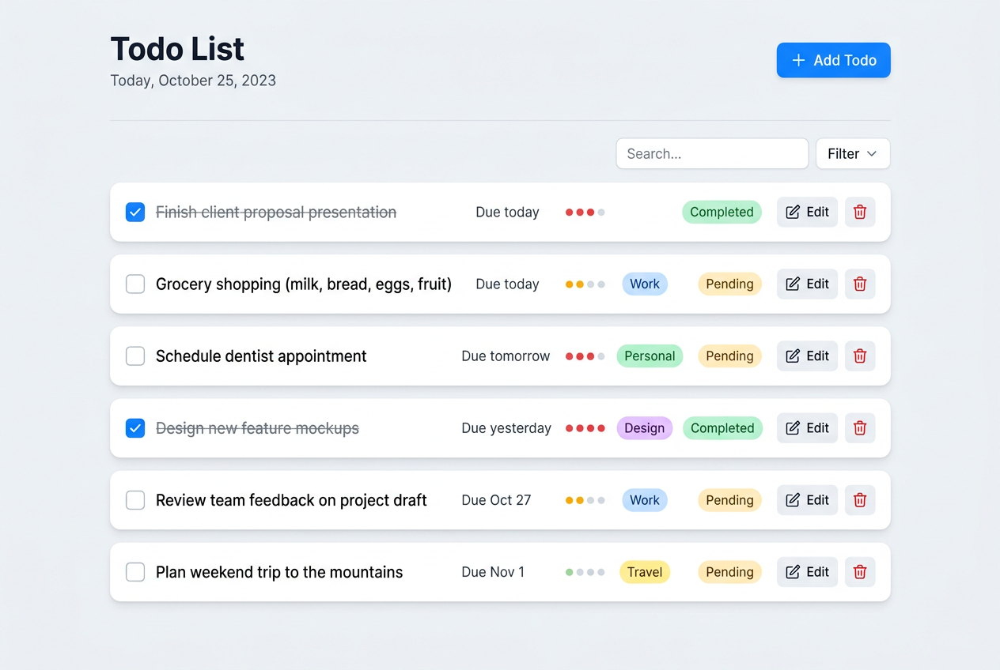

# Todo Application


[](https://codecov.io/gh/ss8806/Todos)

A modern Todo application built with FastAPI, Next.js, and PostgreSQL.

## Overview

This is a full-stack Todo application that provides user authentication and Todo management functionality. It's designed as a portfolio project demonstrating modern web development practices and technologies.

### Features

- **User Authentication**: JWT-based authentication with registration and login
- **Todo Management**: Create, read, update, and delete Todo items
- **Real-time Updates**: Optimistic UI updates with React Query
- **Rate Limiting**: API protection against brute force attacks
- **Structured Logging**: JSON-formatted application logs
- **Error Handling**: Unified error responses and toast notifications
- **Health Checks**: System health monitoring endpoints

## Screenshots

### Login Page


### Todo Dashboard


## Tech Stack

### Frontend
- **Framework**: [Next.js 16](https://nextjs.org/) (App Router)
- **Language**: TypeScript
- **Runtime**: Bun
- **Styling**: Tailwind CSS
- **UI Components**: shadcn/ui
- **State Management**: TanStack React Query
- **Form Handling**: React Hook Form + Zod
- **Notifications**: Sonner (toast)

### Backend
- **Framework**: [FastAPI](https://fastapi.tiangolo.com/)
- **Language**: Python 3.10+
- **Package Manager**: [uv](https://github.com/astral-sh/uv)
- **Database**: PostgreSQL with asyncpg
- **ORM**: SQLModel
- **Authentication**: JWT (python-jose)
- **Password Hashing**: Argon2 + Bcrypt
- **Rate Limiting**: SlowAPI
- **Logging**: python-json-logger (structured logging)

### Infrastructure
- **Database**: PostgreSQL
- **Container**: Docker, Docker Compose

### Version Control
- **VCS**: Jujutsu (jj)

## Architecture

### System Overview

```
┌─────────────────────────────────────────────────────────────────┐
│                        Client Browser                         │
└──────────────────────────┬──────────────────────────────────────┘
                           │ HTTP/HTTPS
                           ▼
┌─────────────────────────────────────────────────────────────────┐
│                      Frontend (Next.js)                       │
│  ┌──────────────┐  ┌──────────────┐  ┌─────────────────────┐  │
│  │  App Router  │  │  Components  │  │   React Query       │  │
│  │  Pages       │  │  (shadcn/ui) │  │   (State Mgmt)      │  │
│  └──────────────┘  └──────────────┘  └─────────────────────┘  │
│  ┌──────────────┐  ┌──────────────┐                           │
│  │  React Hook  │  │   Zod        │                           │
│  │  Form        │  │  Validation  │                           │
│  └──────────────┘  └──────────────┘                           │
└──────────────────────────┬──────────────────────────────────────┘
                           │ REST API (JSON)
                           ▼
┌─────────────────────────────────────────────────────────────────┐
│                     Backend (FastAPI)                         │
│  ┌──────────────┐  ┌──────────────┐  ┌─────────────────────┐  │
│  │  API Routes  │  │  Auth (JWT)  │  │   Rate Limiting     │  │
│  │  (api_v1)    │  │  python-jose │  │   (SlowAPI)         │  │
│  └──────────────┘  └──────────────┘  └─────────────────────┘  │
│  ┌──────────────┐  ┌──────────────┐  ┌─────────────────────┐  │
│  │  SQLModel    │  │  CRUD Ops    │  │   Structured        │  │
│  │  (ORM)       │  │  (db layer)  │  │   Logging           │  │
│  └──────────────┘  └──────────────┘  └─────────────────────┘  │
└──────────────────────────┬──────────────────────────────────────┘
                           │ SQLAlchemy (async)
                           ▼
┌─────────────────────────────────────────────────────────────────┐
│                    Database (PostgreSQL)                      │
│  ┌──────────────┐  ┌──────────────┐  ┌─────────────────────┐  │
│  │  users       │  │   todos      │  │   alembic_version   │  │
│  └──────────────┘  └──────────────┘  └─────────────────────┘  │
└─────────────────────────────────────────────────────────────────┘
```

### Data Flow

#### Authentication Flow
```
Client → POST /api/v1/auth/register → Create User (Argon2 hash)
Client → POST /api/v1/auth/token → JWT Token (15min expiry)
Client → GET /api/v1/todos/ [Bearer Token] → Verify Token → Return Todos
```

#### Todo CRUD Flow
```
Client → POST /api/v1/todos/ {title, priority, due_date, tags}
       → Validate (Pydantic) → Create (SQLModel) → Return Todo

Client → GET /api/v1/todos/?search=&is_completed=&priority=&sort_by=
       → Filter/Sort → Paginate → Return List

Client → PUT /api/v1/todos/{id} {is_completed, priority, due_date, tags}
       → Update Fields → Commit → Return Updated Todo

Client → DELETE /api/v1/todos/{id}
       → Find & Delete → Commit → Return Status
```

### API Endpoints

#### Authentication
- `POST /api/v1/auth/register` - User registration
- `POST /api/v1/auth/token` - Login (get access token)

#### Todos
- `GET /api/v1/todos/` - Get all todos (requires authentication)
- `POST /api/v1/todos/` - Create new todo (requires authentication)
- `PUT /api/v1/todos/{id}` - Update todo (requires authentication)
- `DELETE /api/v1/todos/{id}` - Delete todo (requires authentication)

#### Health
- `GET /health` - Health check endpoint

## Getting Started

### Prerequisites

- Docker & Docker Compose
- Bun (for frontend development)
- Python 3.10+ & uv (for backend development)
- Jujutsu (jj) for version control

### Quick Start with Docker

1. **Clone the repository**:
   ```bash
   git clone <repository-url>
   cd Todo
   ```

2. **Set up environment variables**:
   ```bash
   cp .env.example .env
   # Edit .env with your configuration
   ```

3. **Start all services**:
   ```bash
   just up
   ```

4. **Access the application**:
   - Frontend: http://localhost:3000
   - Backend API: http://localhost:8000
   - API Documentation: http://localhost:8000/docs

5. **View logs**:
   ```bash
   just logs
   ```

6. **Stop services**:
   ```bash
   just down
   ```

### Local Development

#### Backend

```bash
cd backend

# Install dependencies
uv sync

# Run development server
just backend-dev
# or
uv run uvicorn main:app --reload --host 0.0.0.0 --port 8000
```

#### Frontend

```bash
cd frontend

# Install dependencies
bun install

# Run development server
just frontend-dev
# or
bun dev
```

## Project Structure

```
Todo/
├── backend/                 # FastAPI backend
│   ├── app/
│   │   ├── api/            # API routes
│   │   ├── core/           # Core configuration, security, logging
│   │   ├── crud/           # Database operations
│   │   ├── middleware/     # Custom middleware
│   │   ├── models/         # Database models
│   │   └── schemas/        # Pydantic schemas
│   ├── migrations/         # Database migrations (Alembic)
│   ├── tests/              # Backend tests
│   └── pyproject.toml      # Python dependencies
├── frontend/               # Next.js frontend
│   ├── src/
│   │   ├── app/           # Next.js app router pages
│   │   ├── components/    # UI components
│   │   ├── hooks/         # Custom React hooks
│   │   └── lib/           # Utility functions, API client
│   └── package.json       # Node dependencies
├── docker/                 # Docker configurations
├── docker-compose.yml      # Docker Compose configuration
├── justfile               # Development task runner
└── .env.example           # Environment variables template
```

## API Documentation

Interactive API documentation is available at:
- **Scalar API Reference**: http://localhost:8000/docs
- **OpenAPI JSON**: http://localhost:8000/api/v1/openapi.json

## Design Decisions

### Why SQLModel?
SQLModel provides a modern, async ORM experience with Pydantic integration, reducing code duplication between database models and API schemas.

### Why TanStack React Query?
React Query handles server state management, caching, and automatic refetching, providing a better developer experience than manual state management.

### Why Rate Limiting?
Rate limiting protects against brute force attacks and API abuse, especially important for authentication endpoints.

### Why Structured Logging?
JSON-formatted logs enable better log aggregation and analysis in production environments, integrating with tools like ELK stack or Datadog.

## Security Features

- **JWT Authentication**: Stateless token-based auth with configurable expiration
- **Password Hashing**: Argon2 and Bcrypt for secure password storage
- **Rate Limiting**: 5 requests/minute on auth endpoints, 100/minute default
- **CORS Configuration**: Configurable allowed origins
- **Input Validation**: Pydantic schemas for request validation

## Monitoring & Logging

- **Structured Logging**: JSON-formatted logs with request/response tracking
- **Health Check**: `/health` endpoint with database connectivity status
- **Error Tracking**: Unified error responses with detailed messages
- **Request Timing**: X-Process-Time header for performance monitoring

## Contributing

1. Create a new branch using Jujutsu
2. Make your changes
3. Run tests
4. Commit with descriptive messages
5. Submit a pull request

## License

This project is for portfolio/educational purposes.

## Contact

For questions or support, please open an issue on GitHub.
